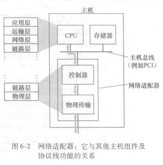
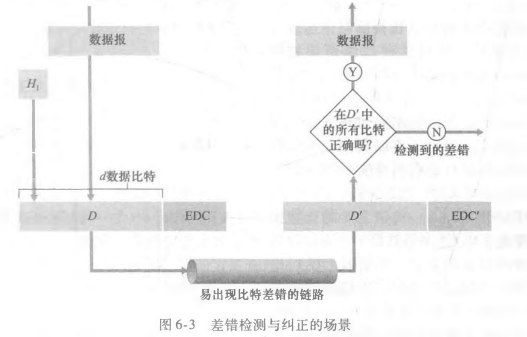
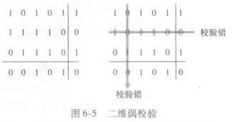

# 链路层和局域网

## 6.1 概述

### 前言

将运行链路层协议(即第2 层)协议的任何设备均称为**节点**(node) ，节点包括主机、路由器、交换机和WiFi接入点 。

把沿着通信路径连接相邻节点的通信信道称为**链路**(link) 。为了将一个数据报从源主机传输到目的主机，数据报必须通过沿端到端路径上的各段链路传输。

通过特定的链路时，传输节点将数据报封装在**链路层帧**中，并将该帧传送到链路中

### 6.1.1 链路层提供的服务

尽管任一链路层的基本服务都是将数据报通过单一通信链路从一个节点移动到相邻节点，但所提供的服务细节能够随着**链路层协议的不同而变化**。链路层协议能够提供的可能服务包括: 

- 成帧。链路层协议**将网络层数据报用链路层帧**封装起来。一个帧由一个数据字段和若干首部字段组成，其中网络层数据报就插在数据字段中。帧的结构由链路层协议规定。
- 链路接入。媒体访问控制（Medium Access Control, MAC）协议规定了**帧在链路上传输的规则**。当多个节点共享单个广播链路时，即多路访问时，MAC协议用于协调多个节点的帧传输。
- 可靠交付。当链路层协议提供可靠交付服务时，它保证无差错地经链路层移动每个网络层数据报。链路层可靠交付服务通常用于高差错率的链路，例如无线链路，其目的是本地纠正一个差错，而不是迫使端到端数据重传。然而，对于低比特差错的链路，链路层可靠交付是不必要开销。许多有线的链路层协议不提供可靠交付服务。
- 差错检测和纠正。发送节点在帧中包括差错检测比特，接收节点进行差错检查。链路层的差错检测通常更复杂，并且用硬件实现。差错纠正中接收方不仅能检测帧中出现的比特差错，而且能确定帧中差错出现的位置，并纠正。

### 6.1.2 链路层在何处实现

链路层是实现在路由器的线路卡中。一个典型的主机体系结构链路层的主体部分是在网络适配器（network adapter）中实现的，网络适配器也称为网络接口卡（Network Interface Card, NIC）。 位于网络适配器核心的是链路层控制器，该控制器通常是一个实现了许多链路层服务的专用芯片。因此，链路层控制器的许多功能是用硬件实现的。发送端控制器取得数据报，在链路层帧中封装该数据报，然后遵循链路接入协议将帧传进通信链路。在接收端，控制器接收整个帧，抽取网络层数据报。链路层的软件组件实现了高层链路层功能，如组装链路层寻址信息和激活控制器硬件。在接收端，链路层软件响应控制器中断，处理差错条件和将数据报向上传递给网络层。所以，链路层是硬件和软件的结合体，即此处是协议栈中软件与硬件交接的地方。

## 6.2 差错检测和纠正技术

在发送节点，为了保护比特免受差错，使用差错检测和纠正比特 (Error- Detection and- Correction EDC）来增强数据D。通常，要保护的数据不仅包括从网络层传递下来需要通过链路传输的数据报，而且包括链路帧首部中的链 路级的寻址信息、序号和其他字段。

### 6.2.1 奇偶校验

一维奇偶校验只能检测出奇数个比特差错，且不能纠正。

二位奇偶校验，接收方不仅可以检测到出现了单个比特差错，还可以利用存在奇偶校验差错的列和行的索引来识别发生差错的比特并纠正它

### 6.2.2 校验和方法

在检验和技术中，将d比特数据报作为一个k比特整数的序列处理。一个简单检验和方法就是将这k比特整数加起来，并且用得到的和作为差错检测比特。因特网检验和（Internet checksum）就基于这种方法，即数据的字节作为16比特的整数对待并求和。这个和的反码形成了携带在报文段首部的因特网检验和。

### 6.2.3 循环冗余检测

