# 计算机网络和因特网

## 0 计算机网络定义

简单定义：一些相互连接的、自治的计算机的集合

文献定义：计算机网络用**通信设备和线路**将分散在不同地点的有独立功能的**多个计算机系统**相互连接起来，并按照**网络协议**进行数据通信，实现资源共享的计算机集合

多个计算机 + 通信子网 + 一系列协议

## 1.1 因特网

### 1.1.1 描述

世界范围的计算机网络

互联全世界数以亿计的计算设备

全球性网络的网络

### 1.1.2 构成

#### 1.1.2.1 计算设备

计算设备：路由器、手机、移动设备、服务器、工作站等等

称为：主机、端系统

主要功能：进行数据处理，运行网络应用程序

#### 1.1.2.2 联网设备

通信链路和分组交换机

主要功能：保证高效可靠的数据传输

##### 1.1.2.2.1  通信链路

把端系统连接到一起的物理线路

类型多种：同轴电缆、双绞线、光纤、无线电等，不同链路传输速率不同

链路传输速率：每秒传输多少位数据 bit/s

##### 1.1.2.2.2 分组交换机

分组交换机：**连接端系统的中间交换设备**，用于接收和转发分组，从一条通信链路接收分组、保存，转发至另外一条通信链路（采用分组交换技术）；

分组交换packet switching技术：发送端将要发送的数据分成若干较小的块，**添加首部形成分组（包packet）**，分别发送至目的端，再组装恢复成原数据

路径route/path：一个分组从发送端系统传输到接收端系统，所经过的一系列通信链路和分组交换机，**可共享，不专用**

#### 1.1.2.3 ISP网络服务提供商

一个由多个分组交换机和多段通信链路组成的网络

端系统通过ISP接入因特网

不同ISP提供不同类型网络接入

低层次的ISP通过高层ISP互联

每个ISP独立管理，运行ISP协议

#### 1.1.2.4 协议

控制网络中信息接受和发送的一组**软件**

因特网协议：TCP/IP协议（传输控制协议/网络协议）

因特网标准：由IETF制定的标准文档RFC

#### 1.1.2.5 内联网

专用的内部网络：若政府、公司网络

专网内主机不能随意与外部主机交换信息，由防火墙控制

### 1.1.3 服务描述

分布式应用程序：在端系统上运行，彼此可以通信

面向连接的可靠服务：确保从发送方发出的数据最终按**顺序完整**的交付给接收方

无连接的不可靠的服务：不能对最终交付做任何保证

两者都不能确定数据接收的所需时间

### 1.1.4 协议

定义：定义了在两个或多个通信实体之交换的报文格式和顺序，以及报文发送或接收一条报文或其他时间所采取的动作

网络协议：由某些设备的硬件或软件执行

## 1.2 网络边缘（资源子网）

外围部件，主机，网络应用

### 1.2.1 端系统

#### 1.2.1.1 定义

与因特网相连的计算机，运行各种应用程序

#### 1.2.1.2 分类

客户机client：桌面和移动PC

服务器server：功能更强的机器，邮件服务器，web服务器

#### 1.2.1.3 模式

##### 1.2.1.3.1 客户端/服务器模式

分布式应用程序，客户机程序和服务器程序在端系统分布式运行

分客户端和服务器

通过因特网互相发送报文进行交互

路由器、链路、其他部件成为“黑盒子”

##### 1.2.1.3.2 对等模式

最小限度使用专用服务器，

端系统中运行的对等应用程序同时起客户机和服务器程序的**双重作用**

### 1.2.2 无连接和面向连接的服务

端系统通过服务传输报文，进行通信

##### 1.2.2.1 面向连接的服务

采取TCP（传输控制协议）协议

两个端系统交换数据，要先通过“握手过程”建立连接，然后才发送实际数据

握手过程：**互相发送“控制”分组**，使双方做好接收后面数据分组的准备，即在两个端系统之间**创建连接**

特性：

- 可靠的数据传送：无差错、按序的传递所有数据，如果一段时间没有收到确认分组，则会重传分组
- 流控制：端对端传输阻塞时会降低发送速率，确保任何一方都不会过快的发送过量的分组而造成分组丢失
- 拥塞控制：全局控制，防止因特网进入迟滞状态。主要是路由器阻塞，其缓存出现溢出或者分组丢失

##### 1.2.2.2 无连接的服务

采取UDP（用户数据报协议）协议

两个端系统交换数据时，不需要握手，直接发送分组，数据传递更快

特性：

- 不可靠：源主机不能确定分组是否已到达目的地
- 没有流控制和拥塞控制

## 1.3 网络核心和接入网

### 1.3.0 定义

网络核心位于网络内部，连接端系统的分组交换机和链路形成的网状网络

### 1.3.1 电路交换、分组交换

#### 1.3.1.1 电路交换

##### 1.3.1.1.1 概念

- **预留端到端资源**：端系统之间通信路径上所需要的资源（缓存，带宽等），建立连接
- 发送方以**恒定速率**像接收方传送数据

##### 1.3.1.1.2 工作原理

通信双方必须先建立一个**专用的连接（电路）**，一直维持，直到通信结束

例：**电路交换网络**：每个链路可有n条电路，能够支持n条同步连接，可共享，每条连接获得1/n的带宽

##### 1.3.1.1.3 电路交换网络的多路复用

在一条传输链路上同时**建立多条连接**，分别传输数据

<u>频分多路复用FDM</u>：链路的频谱由跨越链路创建的连接所共享，按频率划分为若干频段，每个频段专用于一个连接，带宽指代频段的宽度。

<u>时分多路复用TDM</u>：时间划分为固定区间的帧，每帧再划分为固定数量的时隙，每一个时隙专用于一个连接，**周期性**的通信

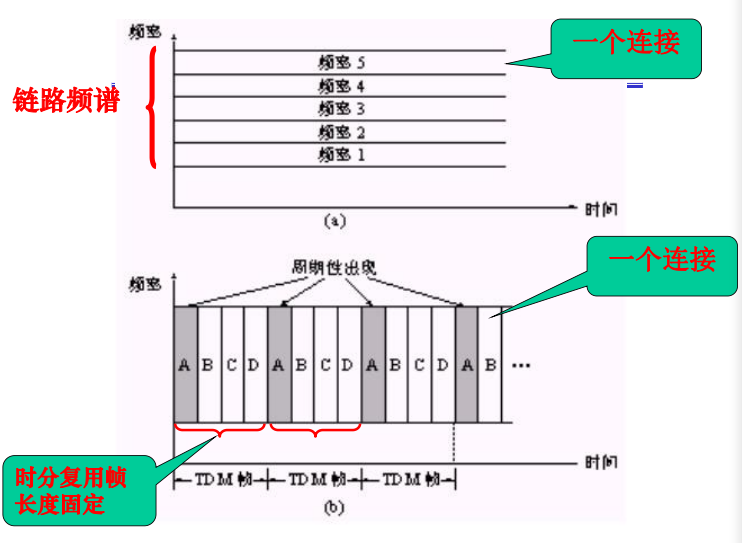

##### 1.3.1.1.4 电路交换缺陷

效率较低：**静默期**（无数据传输）专用电路空闲，网络资源被浪费

创建端到端的电路及预留端到端带宽的过程复杂

##### 1.3.1.1.5 计算实例

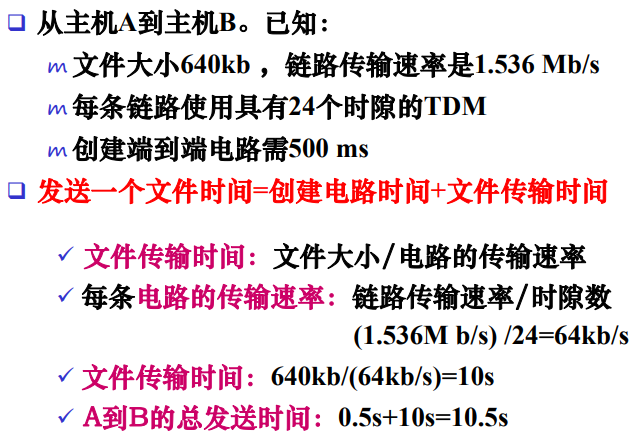

#### 1.3.1.2 分组交换

##### 1.3.1.2.1 概念

- 不需要资源预留
- **按需使用**资源，可能要排队等待：同时有其他分组发送

##### 1.3.1.2.2 工作原理和过程

1. 源端将报文（应用程序要传输的信息）划分为较小的数据块---分组packet；
2. 每个分组通过一系列链路和分组交换机传送，知道目的端
3. 目的端恢复原报文

分组以链路的**最大传输速率**传输

传输过程采用存储转发传输机制

###### 1.3.1.2.2.1 存储转发传输

分组交换机先将输入端的**整个分组**接收下来（存储），再从输出链路转发传输出去（转发）

##### 1.3.1.2.3 相关参数

- **传输时延**：将一个分组的所有比特推送到输出链路上所需时间，时延 = 分组长 / 链路速率
- 输出缓存（输出队列）：用于保存准备发往某个链路的分组。每条相连的链路都对应有一个输出缓存
- 排队时延：分组在输出缓存中**等待转发**的时间，排队时延是变化的，与网络中的拥塞有关
- 分组丢失：当缓存空间已满时，有的分组要被丢失

##### 1.3.1.2.4 计算实例

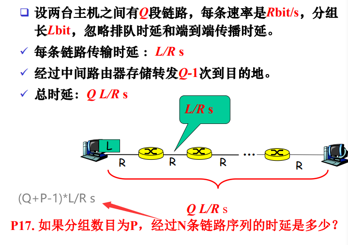

#### 1.3.1.3 报文交换

将要发送的整个信息作为一个报文发送

采用存储转发技术：**整个报文**先传送到相邻结点，全部保存下来后，再转发至下一个结点

和分组交换类似，只不过一次传送整个报文，包含多个分组

#### 1.3.1.4 交换技术对比

- 电路交换：整个报文的比特流**连续地从源点直达终点**，好像一个管道传输
- 报文交换：整个报文**先传送到相邻结点**，**全部存储后**，**在转发**至下一个结点
- 分组交换：**单个分组（并不是整个报文）**传送到相邻结点后，存储下来，就可以转发至下一个结点

前两者对比：

- 电路交换：**效率不高**，需要预先分配传输链路，空闲时，浪费链路时间
- 分组交换：不适合实时服务，端到端时延不确定，带宽**共享好**，简单，有效，成本低；按需分配链路，利用率很高，这是**发展趋势**

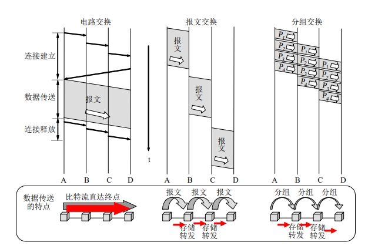

### 1.3.2 分组交换网络

在源和目的主机之间**通过一系列分组交换机转发分组**

#### 1.3.2.1 虚电路网络：

交换机根据**虚电路号**转发分组

两个主机建立虚连接-----每个虚电路指定一个标识符ID-----分组带有标识符，转发路径

#### 1.3.2.2 数据报网络：

交换机根据**目的地址（IP地址和端口号）**转发分组

不需要建立连接-----分组带有目的地址，转发路径

## 1.4 接入网和物理媒体

**接入网（network access）**：将端系统连接到边缘路由器的物理链路，使用户连接到网络的基础设施

**边缘路由器（edge router）**：端系统到任何其他远程端系统地路径上地第一台路由器

### 1.4.1 网络接入

解决问题：端系统怎样连接到边缘路由器

#### 1.4.1.1 住宅接入

将家庭端系统与边缘路由器连接

##### 1.4.1.1.1 拨号调制解调器

通过普通模拟电话线用拨号调制解调器相连

调制：将数字信号转换为模拟信号

解调：将模拟信号转化为数字信号

模拟信号：连续变化地电磁波，传输的是模拟信号，显示的是数字信号

数字信号：一系列电压脉冲

网络接入是沿着一条点对点拨号电话线的一对调制解调器

缺点：速率低，不能同时做事情

##### 1.4.1.1.2 新型宽带接入技术

更高的数据传输率，可以同时上网和打电话

方式：数字用户线DSL、混合光纤同轴电缆HFC、光纤到户

#### 1.4.1.2 公司接入

通过局域网LAN连接端用户和边缘路由器

先将多个端系统连接成局域网，然后局域网在于边缘路由器连接

#### 1.4.1.3 无线接入

用于无线移动设备的接入

有：无线局域网、广域无线接入网

无线局域网：用户连接基站，基站连接有线因特网，基站之间互相通信

广域无线接入网：基站由电信提供商管理，覆盖范围广，4G\5G

### 1.4.2 物理媒体

将网络中不同端系统相互连接起来的物理线路，是进行数据传输的物理通路，通过**传播电磁波或光脉冲**来发送比特流，也称传输媒体，传输介质

两类：

引导型媒体：电波沿固体媒体传播，双绞线、同轴电缆、光缆等

非引导性媒体：电波在空气中或外层空间传播，无线电等

物理媒体的性能对网络的通信、速度、距离、价格以及网络中的结点数和可靠性都有很大影响。

### 1.4.3 小练习

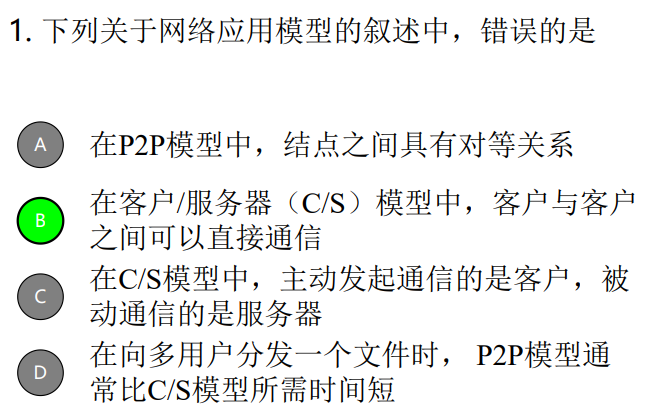

## 1.5 ISP互联

端系统经过一个接入网与因特网相连

因特网体系结构：因特网边缘的接入网络通过分层的ISP与因特网其他部分相连

时延和丢包怎样出现？

分组在每个路由器中先存储，再转发

- 缓存中排队，等待交换===时延
- 分组到达链路的速率超过输出链路能力===丢包

## 1.6 时延

分组传输：从源主机出发，通过一系列路由器传输，最终到达目的主机

### 1.6.1 时延类型

#### 1.6.1.1 节点处理时延

检查比特差错

决定输出链路

#### 1.6.1.2 排队时延

分组等待在链路上传输的排队时间

相关因素：等待的分组数量，到达分组数量，到达队列流量强度（比特达到速率/推出速率）和性质

毫秒至微秒级

#### 1.6.1.3 传输时延

或存储转发时延

将分组的所有比特推向链路的所需要的时间

L/R：分组长度（bit）/链路传输速率(bps)

#### 1.6.1.4 传播时延

一个比特从链路的起点到下一个节点传播所需要的时间

以链路传播速率s传播：信号在线路上单位时间内传送的距离

2 * 10^8^m/s - 3 * 10^8^m/s

### 1.6.2 排队时延和分组丢失

#### 1.6.2.1 排队时延

##### 1.6.2.1.1 排队时延大小

- 取决于流量到达该队列的速率、链路的传输速率和到达流量的性质（周期性或突发形式)。
- 流量强度(traffic intensity) :比特到达队列的速率与比特从队列中推出的速率之比。

##### 1.6.2.1.2 平均排队时延和流量强度

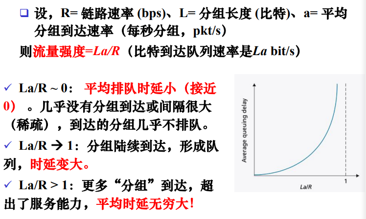

#### 1.6.2.2 分组丢失

- 通常，一条链路的缓存队列容量有限。
- 分组丢失(lost):当到达的分组发现队列已满,没有空间存储，被丢弃(drop)。
- 丢失的分组可能由前面的节点或由源端系统重传，或根本不重传。

#### 1.6.2.3 端到端时延

路由器和源主机都有处理时延d~proc~

链路传播时延d~prop~

路由器和源主机输出时延d~trans~ =  L/R

如果网络没有拥塞，那么就可以忽略排队时延

## 1.7 协议层次及其服务模型

### 1.7.1 分层体系结构

#### 1.7.1.1 概念

网络的分层结构及其各层协议的集合，是对网络及其组成部分功能的精确定义。

每层功能独立、相邻两层有逻辑接口，可以交换信息、上层调用下层服务，下层为上层提供服务

#### 1.7.1.2 优点

- 使复杂系统简化:
  - 将一个大而复杂系统划分为若干个明确、特定的部分，分别讨论研究。
- 易于维护、系统的更新
  - 某层功能变化，不会影响系统其余部分:
  - 只要保持对其上层提供的服务，及其使用下层的服务不变。

### 1.7.2 协议分层

#### 1.7.2.1 概念

- 协议:控制网络中信息的发送和接收。
  - 定义了通信实体之间交换报文的格式和次序，以及在报文传输和/或接收或其他事件所采取的动作。
- 协议分层:
  - 采用分层(layer)的方式组织协议及实现协议的网络硬件和软件。

#### 1.7.2.2 协议分层说明

- 每层都有相应的一系列协议，如TCP、HTTP;
- 每层协议通过软件、硬件或两者结合实现。
- 每层协议可分布在网络的不同组件中:如端系统、分组交换机。
- 协议栈(protocol stack):各层所有协议的集合。

#### 1.7.2.3 分层缺点

- 有些功能可能在不同层重复出现:
  - 如，基于链路和基于端到端传输的差错恢复;
- 某层的功能可能需要仅存在其他某层的信息。

### 1.7.3 分层数据传递

主机(端系统)间数据传送实际上并不是在对等层间直接进行，而是通过相邻层间的传递合作完成。

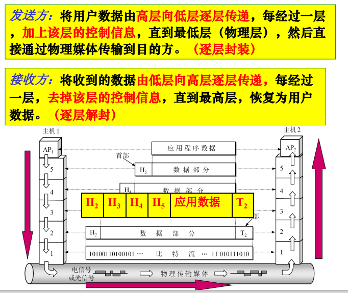

### 1.7.4 因特网协议栈

#### 1.7.4.1 概念图

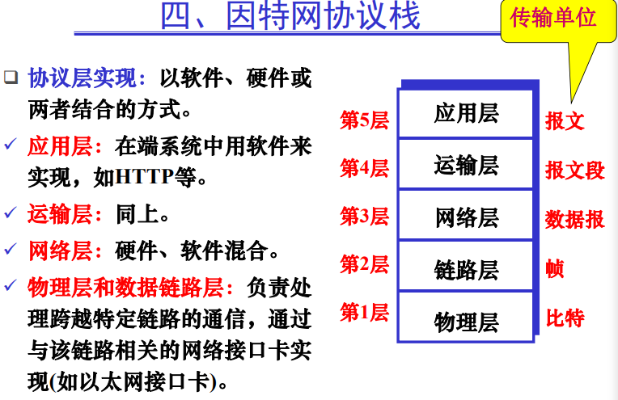

#### 1.7.4.2 各层功能

- 应用层:提供各种网络应用。传输应用报文。
  - FTP、SMTP、HTTP
- 运输层:在应用程序的客户机和服务器之间提供传输应用层报文服务。传输报文段。
  - TCP、UDP
- 网络层:主机和主机之间传输网络层分组（数据报)。
  - IP协议、选路协议
- 链路层:在邻近单元之间传输数据（帧)。
  - PPP、以太网
- 物理层:在节点之间传输比特流。
  - 传输媒体

之前的协议**OSI**是七层，还有表示层和会话层，如图：

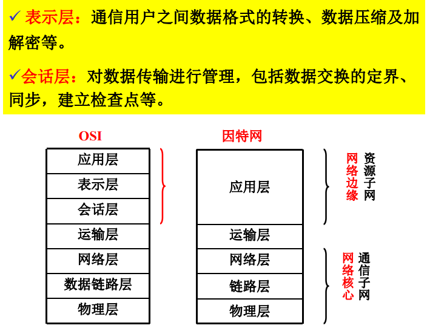

#### 1.7.4.3 节点分层

与端系统类似，路由器和链路层交换机以分层方式组织网络硬件和软件，通常只实现低几层。

- 路由器:实现第一层到第三层，能够实现IP协议;
- 链路层交换机:实现第一层和第二层，能够识别第二层地址，如以太网地址。
- 主机:实现所有5个层次。

#### 1.7.4.4 报文传递过程

##### 1.7.4.4.1 源主机

由**高层向低层**逐层传递(封装)

应用层报文M传递到运输层，附加上运输层首部信息H~t~(运输层报文段)

报文段传递到网络层，附加上网络层首部信息H~n~(网络层数据报)

每层传递的数据分为<u>首部字段</u>和<u>有效载荷</u>字段两部分。

有效载荷是相邻上层传下来的数据。

##### 1.7.4.4.2 目的主机

由**低层向高层**逐层传递(解封)

物理层接收，并将其沿协议栈逐层向上传递，每层去除对应的首部，恢复原报文。

如果报文很长，传输时,可先分成多个报文段,每个报文段在网络层再分成多个数据报。

##### 1.7.4.4.3 图示

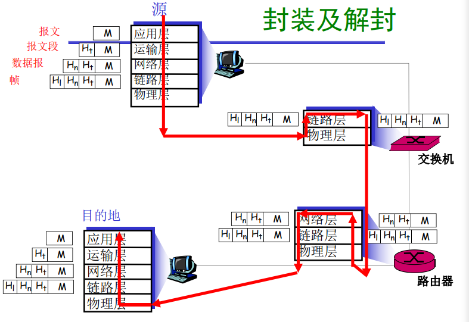

### 1.7.5 练习

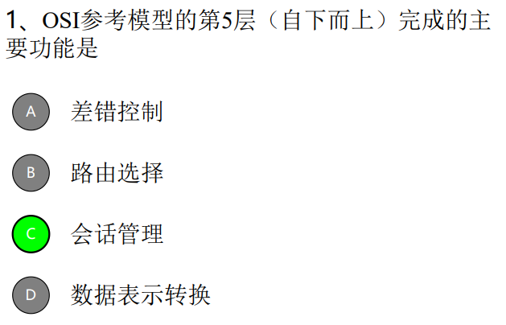

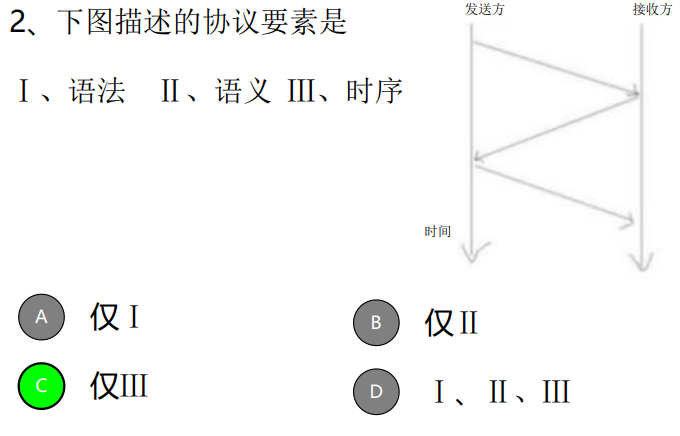

## 1.8 计算机网络和因特网历史

计算机网络是计算机技术与通信技术相结合的产物。

第一个分组交换计算机网络：美国国防部高级研究计划局(Advanced ResearchProjects Agency)的研制的ARPAnet

由此产生两个概念：（即计算机网络的逻辑组成）

- 通信子网:由结点交换机、通信线路及设备组成。(网络核心)。
  - 保证高效、可靠地数据通信。
- 资源子网:网络外围，包括主机、终端、软件等。(网络边缘)
  - 数据处理。
