# 应用层

## 2.1 应用层协议原理

### 2.1.1 网络应用程序体系结构

规定如何在各种端系统上组织应用程序，有研发者设计

#### 类型一：客户机、服务器体系结构

- 服务器：永久的IP地址，为多个客户机请求提供服务，可扩展为服务器场（主机集群）

- 客户机：向服务器发出请求，动态IP地址，彼此之间不直接通信


#### 类型二：纯P2P体系结构（peer-to-peer）

- 最少（无）打开的服务器

- 任意端系统（对等方），可以直接通信

- 对等方间歇地连接，IP地址不固定

- 可扩展度高，难以管理

- 挑战：ISP友好（宽带不对称）、安全性、激励使用


#### 类型三：两者混合

服务器注册/定位

对等方在同一个中心服务器注册内容或者定位内容


### 2.1.2 进程通信

进程：在主机上运行的程序

进程通信：

- 同一主机中两个进程间的通信由操作系统控制

- 不同主机中通过网络交换报文进行，分为发送进程和接收进程


#### 客户机和服务器进程

- 网络应用程序由成对的进程组成，并通过网络互相发送报文

- 即发起通信的客户机进程和等待其他进程联系的服务器进程


#### 套接字socket

- 同一台主机内应用层和运输层之间的接口

- 也叫做应用程序和网络之间的应用程序接口API，是在网络上建立网络应用程序的可编程接口

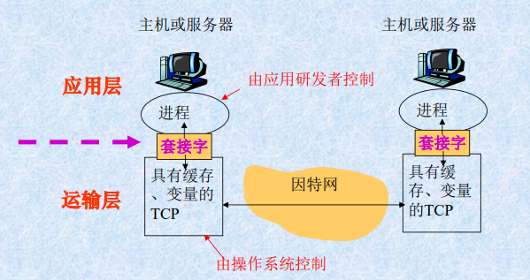

#### 两者关系

- 进程通过套接字在网络上发送和接收报文
  - 发送报文：把报文推出门（套接字）
  - 传送报文：通过下面网络把报文传送到目的进程门口
  - 接收进程：通过套接字接收报文
- 一些说明
  - 应用程序开发者可以**控制套接字应用层端**的全部;
  - 对套接字的**运输层端几乎不能控制**(只能选择运输层协议、设定几个运输层参数等)。
  - 应用程序开发者选择了一个运输层协议,则应用程序就建立在由该协议提供的运输层服务之上。如TCP协议

#### 进程寻址

- 网络上有多个主机，每个主机有多个进程
- **进程识别信息**:表示哪台主机上的哪一个进程。
  - 源主机上的进程向目的主机上的进程发送报文时,应带有接收进程的识别信息(标识)。
- 进程寻址:根据进程识别信息找到相应进程。
- 进程识别信息
  - 第一部分：主机名称或地址，即IP地址
  - 第二部分：主机的哪个进程，用端口号表示
- 周知端口：常用的应用程序被指派到固定的端口号
  - Web服务进程HTTP协议：80
  - 邮件服务进程SMTP协议：25

#### 用户代理user agent

- 用户与网络应用程序之间的接口
  - Web应用的用户代理：是一些浏览器软件，一个通过套接字收发报文，并提供用户接口的进程
  - 电子邮件应用程序用户代理：允许进程进行邮件的撰写和阅读


### 2.1.3 应用层协议

- 定义了运行在不同端系统上的应用程序进程之间传递报文的格式和方式

- 具体内容：
  - 各种报文类型及其语法
  - 字段的语义
  - 时序：报文发送和响应的规则
- 说明
- 公共领域协议，由标准文档RFC定义，如HTTP
- 专用层协议：如p2p使用的协议

- HTTP定义了在浏览器程序和Web服务器程序间传输的报文格式和序列


### 2.1.4 应用程序需要的服务

概念

- 应用程序间通信:由**运输协议**跨越网络将发送进程的报文传输到接收进程的门户。
- 需要使用运输协议所提供的服务。
- 运输协议有多种,提供的服务不同。

运输服务

- 可靠的数据传输
- 带宽（数据传输率）
- 定时（数据传输的时间限制）
- 安全性


###  2.1.5 因特网运输协议提供的服务

两个运输层协议:

- **用户数据报协议UDP**
- **传输控制协议TCP**

每个协议为调用它们的应用程序提供不同的服务模型。

在创建一个新的因特网应用时,要选择其中一个。

#### TCP服务

两方面：面向连接的服务、可靠的传输服务

==**面向连接的服务**==

- 划分三阶段
- 建立连接(握手过程):
  - 客户机程序和服务器程序之间互相交换控制信息,在两个进程的套接字之间建立一个TCP连接。
- 传输报文:
  - 连接是**全双工**的,即连接双方的进程可以在此连接上同时进行报文收发。
- 拆除连接;
  - 应用程序报文发送结束。

==**可靠的数据传输服务**==

- 通信进程可以**无差错、按适当顺序**交付发送的数据。
- 没有数据丢失和重复。

**拥塞控制**

- 当发送方和接收方之间的网络出现拥塞时,会**抑制发送进程速率**。
- 对整个网络有益。
- 拥塞控制还会试图限制每个TCP链接,达到**公平共享网络带宽**的目的。

**缺陷**

- TCP和UPD都没有提供任何**加密机制**。
- 安全套接字层(Secure Socket Layer, SSL)
  - 属于应用层协议，位于应用层协议与TCP之间;
  - 提供了加密、数据完整性、端点鉴别等功能,实现进程间安全通信。
- 不确保最小传输速率:发送进程受拥塞控制机制制约;
- 不提供时延保证:数据传输的时间不确定。
- <u>TCP协议能保证交付所有的数据，但并不保证这些数据传输的速率以及期待的传输时延。</u>

#### UDP服务

提供最小服务模式运行。

- <u>无连接</u>:两个进程通信前没有握手过程;
- <u>不可靠数据传输</u>:不保证报文能够被接收,或收到的报文是乱序到达。
- <u>没有拥塞控制机制</u>:发送进程可以任何速率发送数据
- <u>不提供时延保证</u>


## 2.2 Web应用和HTTP协议

Web ===> World Wide Web

关键技术：

HTML：超文本标记语言，实现信息与信息之间的链接

URL：统一资源定位技术，实现全球信息的精确定位

HTTP：超文本传输协议实现分布式信息共享


### 2.2.1 HTTP概况

- 超文本传输协议，应用层协议，Web的核心

- 包括两部分:客户机程序服务器程序,分别运行在不同的端系统中,通过交换HTTP报文进行会话。
- HTTP协议**定义了报文的格式以及客户机和服务器交换报文的方式**。

- **HTTP协议定义了Web客户机(浏览器)如何向Web站点请求Web页,以及服务器如何将Web页传送给客户机**。

Web常用术语

- Web页（文档）：由若干对象组成，对象便是文件，通过一个URL地址来寻址

- URL：<u>统一资源定位符</u>，标识万维网的各种文档，由存放对象的服务器主机名和对象的路径名组成

- 浏览器：Web应用的客户代理，实现了<u>HTTP协议的一个客户机端</u>，用于显示所请求的Web页，提供导航功能和配置属性

- Web服务器:用于存贮Web对象(由URL寻址)。实现<u>HTTP协议的服务器端</u>。

说明

- HTTP协议使用的底层运输协议是<u>TCP</u>。
- 工作过程:<u>创建TCP连接→交换报文→关闭TCP连接</u>
- 客户机先与服务器建立TCP连接,然后,浏览器和服务器进程通过**套接字**访问TCP:

- ==**TCP提供可靠的数据传输服务**==:客户机进程和服务器进程发出的每个HTTP报文能**完整地**到达对方。
- ==**HTTP是无状态协议**==:服务器不保存关于客户机的任何信息。


### 2.2.2 HTTP连接

非持续和持续HTTP连接（默认使用）

非持续连接每个TCP连接上只传送一个Web对象，只传送一个请求/响应对，而后者则可以是多个


#### 2.2.2.1 非持续连接

> 特点：

- 每个TCP连接只传输一个请求报文和一个响应报文

- 每个TCP连接在服务器返回对象之后关闭

- 浏览器可以同时打开多个连接

- **往返时延RTT（round trip time）**：一个小分组从客户及到服务器，再回到客户机所花时间，这包括传播时延、排队时延及处理时延


> TCP连接三次握手

- 客户机发送一个TCP连接请求报文

- 服务器回送一个TCP确认响应报文

- 客户机发送一个包含TCP确认和HTTP请求的报文

- **总响应时间：2 * RTT + 文件传输时间**

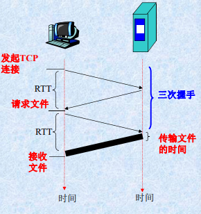


> 缺点

- 服务器负担重：每个请求对象都需要新建连接

- 每一个对象的传输时延长：包含两个RTT时延，一个用于建立TCP，一个用于请求和接收对象


#### 2.2.2.2 持续连接

> 特点

服务器在发送响应后保持该TCP连接

连接经过一定时间间隔未被使用，服务器就会关闭该连接


> 两种方式：

非流水线方式：客户机只有在前一个相应接收到后才能发新的请求；会浪费一些资源，出现空闲状态

流水线方式：客户机可以一个接一个连续产生请求，无需接收到响应才发请求：节省RTT时延，空闲时间很短，这是默认方式

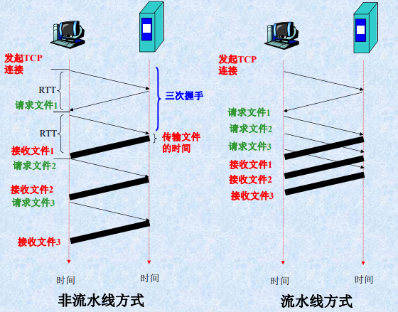


### 2.2.3 HTTP报文

> HTTP请求报文格式

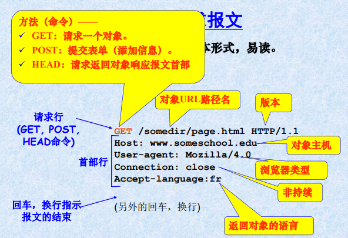

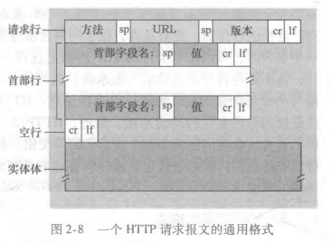


> HTTP响应报文

图示

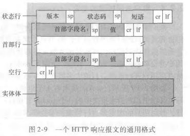

状态码

- 200 OK:请求成功,信息在返回的响应报文中。
- 301 Moved Permanently:请求的对象已经被永久转移了，新的URL定义在响应报文的Location:首部行中。客户软件将自动获取新的URL。实际就是重定向了
- 400 Bad Request :一个通用差错代码，指示该请求不能被服务器理解。
- 404 Not Found:被请求的文档不在服务器上。
- 505 HTTP Version Not Supported:服务器不支持请求报文使用的HTTP协议版本。


### 2.2.4 Cookie

HTTP服务器是无状态的,不保存客户信息。

Cookie:允许Web站点跟踪、识别用户;服务器可以限制用户访问,或把内容与用户身份关联。

许多重要的Web站点使用cookies.包括四个部分

- 1)在HTTP响应报文中有一个cookie首部行
- 2)在HTTP请求报文中有一个cookie首部行
- 3)用户主机中保留有一个cookie文件并由浏览器管理
- 4)Web站点的后端数据库保存cookie


> 工作过程

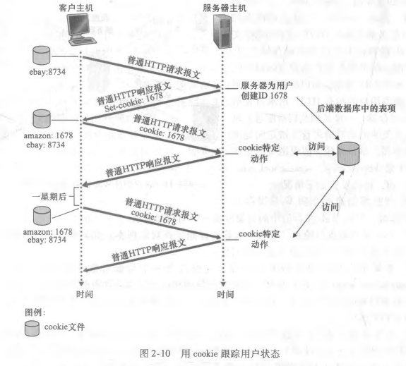


> 用途和缺陷

用途

- 身份认证
- 虚拟购物车
- 推荐广告
- 用户会话状态保存

缺陷

- 站点可以知道用户许多用户信息
- 不利于隐私保护


### 2.2.5 Web缓存

> 概念

Web缓存器(Web cache):也叫**代理服务器**，目标是代替初始服务器满足HTTP请求

- 能够代表初始web服务器来满足HTTP请求的网络实体。
- 保存最近请求过的对象的副本。
- 可在客户机或服务器工作,也可在中间系统工作。

初始（原始）服务器(origin server):对象最初存放并始终保持其拷贝的服务器。


> 使用

- 客户机通过Web缓存器请求对象
- 用户配置浏览器:所有Web访问经由Web缓存器
- 浏览器向Web缓存器发送所有HTTP请求
  - 对象在缓存中:Web缓存器返回对象
  - 不在:Web缓存器向初始服务器发出请求,接收对象后保存副本，并转发给客户机


> 说明

- Web缓存器既可以是服务器也可以是客户机:
- 当它接收浏览器请求并发回响应时,是服务器;
- 当它向初始服务器发出请求并接收响应时,是客户机


> 优点

- 减少客户机请求的响应时间:
  - 客户机<---~高速链路~-----> Web缓存器<-------->初始服务器
- 减少机构内部网络与因特网连接链路上的通信量:
  - 降低开销,改善各种应用的性能。


### 2.2.6 条件GET方法

> 与高速缓存对比

- 高速缓存:
  - 减少响应时间;
  - 存放在级存中的**对象拷贝可能是旧的**。即保存在初始Web服务器中的对象可能已经被修改。
- 条件GET方法:
  - 使缓存器能够证实其保存的对象是否为最新。
  - 如果缓存中是最新对象版本,可继续使用,初始Web服务器就不需重新发送该对象。


> 使用

- Web服务器回发响应报文:包括对象的最后修改时间，缓存器就保存起来
  - Last-modified: date1
- 再次请求时，缓存检查Web服务器中的该对象是否已被修改,发送一个条件GET请求报文:告诉服务器,仅当自指定日期之后该对象被修改过,才发送该对象。
  - If-modified-since: date1
- 若Web服务器中的该对象未被修改，则响应报文含有304 Not Modified，并且实体为空。
- 缓存器直接转发以存储的对象拷贝


### 2.2.7 练习

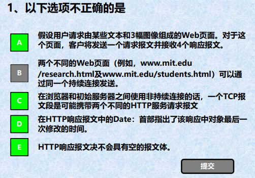

需要发送四个请求报文；非持续连接中一个TCP只能有一个请求；Date是请求时间，last-modified才是最后一次修改时间；HEAD请求就只返回头部，没有报文体

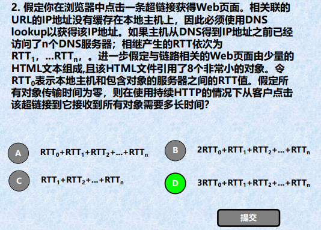

获得IP地址，需要等待n个DNS服务结束，即所有RTT~1-n~之和；

然后建立连接一个RTT~0~，接收到HTML一个RTT~0~，然后接收到HTML解析后，再请求引入的对象，由于是持续连接，且传输时间为零，所有8个小对象只需要一个RTT~0~


## 2.3 FTP文件传输协议

### 2.3.1 概念

本地主机上的用户，向远程主机上上传或下载文件

用户通过一个FTP用户代理与FTP服务器交互


### 2.3.2 传输过程

用户提供远程主机的主机名：本地主机的FTP客户机进程和FTP服务器进程之间建立TCP服务

提供用户标识和口令

服务器验证之后，，进行文件传送（双向：上传或下载）

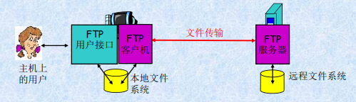


### 2.3.3 FTP和HTTP比较

- 都是文件传输协议，并运行在TCP上，

- FTP使用了两个并行的TCP连接：分控制连接和数据连接；HTTP只有一个连接
- FTP的控制信息是**带外传送**(out-of-band) :使用分离的控制连接；HTTP的控制信息是带内传输(in-band):请求和响应都是在传输文件的TCP连接中发送。
- FTP协议是**有状态**的:FTP服务器对每个活动用户会话的状态进行追踪,并保留，限制同时会话的总数；HTTP**协议是无状态的**:不对用户状态进行追踪。


### 2.3.4 控制连接

用于在两主机间传输控制信息(如用户标识、口令等)

FTP会话开始前，FTP的客户机与服务器**在21号端口**上建立。

FTP的客户机通过该连接发送用户标识和口令,或改变远程目录的命令。

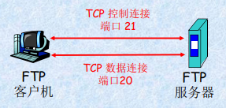

### 2.3.5 数据连接

用于准确**传输文件**

当服务器收到一个文件传输的命令后(从远程主机上读或写),**在20端口**发起一个到客户机的数据连接。

在该数据连接上传送一个文件并关闭连接。

**控制连接是持续的**:在整个用户会话期间一直保持;

**数据连接是非持续的**:会话中每进行一次文件传输,都需要建立一个新的数据连接。


## 2.4 因特网中的电子邮件

### 2.4.1 概述

总体结构，三部分

- 用户代理
- 邮件服务器
- 简单邮件传输协议SMTP

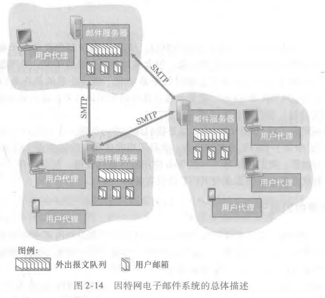

1、用户代理

- 允许用户阅读、回复、发送、保存和撰写报文
- 当用户完成邮件撰写时,邮件代理向其邮件服务器发送邮件,并存放在发送队列中。
- 当用户想读取一条报文时,邮件代理从其邮件服务器的邮箱中获取该报文。

2、邮件服务器

- 邮箱：管理和维护用户的报文
- 报文队列：用户要发出的邮件报文
- 邮件发送主要过程:
  - 邮件保存到发送方报文队列
  - 通过SMTP协议转发到接收方邮件服务器,保存到相应邮箱中
  - 若投递失败,发送方将其保存在一个报文队列中,以后每30分钟发送一次,若几天后仍未成功,将该报文删除,并通知发送方。
  - 用户访问自己邮箱时,邮件服务器对其身份进行验证(用户名和口令)。

3、SMTP

应用层协议

25号端口

使用TCP可靠数据连接

用于把一封邮件从发送邮件**服务器**传送**到**接收邮件**服务器**

包括两部分：客户机端（发送方邮件服务器运行）和服务器端（接收方运行）

SMTP**不使用中间邮件服务器**发送邮件，即 TCP 连接是从发送方到接收方的直接相连


### 2.4.2 SMTP与HTTP

相同点

- 都用于从一台主机向另一台主机**传送文件**
  - HTTP用于从Web服务器向Web客户机(浏览器)传送文件(对象);
  - SMTP用于从一个邮件服务器向另一个邮件服务器传送文件(电子邮件报文)。
- 持续:HTTP和SMTP**都使用持续连接**。

区别

- **HTTP是拉协议**:用户使用HTTP从服务器拉取信息。其TCP连接是由想获取文件的机器发起。
  **SMTP是推协议**:发送邮件服务器把文件推向接收邮件服务器,其TCP连接是由要发送文件的机器发起。

- **SMTP使用7位ASCII码格式**:对一些包含了非7位ASCII字符的报文或二进制数据(如图片、声音),需要按照7位ASCII码进行编码,再传送。在接收方需要解码还原为原有报文。现在有**MIME（多用途因特网邮件扩展）**协议，可以采用非ASCLL数据传输，编码传输，解码还原
  **HTTP数据没有该限制**。
- 对含有文本和图形(或其他媒体类型)的文档:
  **HTTP把每个对象封装在它各自的HTTP响应报文中**发送
  电子邮件则把所有报文对象放在**一个报文**中。


### 2.4.3 邮件访问协议

SMTP只适用于把邮件报文推出去，但是用户从邮件服务器上拉取接收到的邮件是垃操作，只能采用别的协议


> POP3
>
> 简单，功能有限，服务器不保存读取过的邮件

在用户代理打开了一个到邮件服务器(服务器)端口110上的TCP连接后,开始工作。

工作三阶段

- 特许阶段:用户代理发送用户名和口令获得下载邮件的特许。(身份认证)
- 事务处理阶段:用户代理取回报文,可对邮件进行某些操作。如做删除标记、取消删除标记、获取统计信息等。
- 更新阶段:邮件服务器删除带有删除标记的报文,结束POP会话。


> IMAP
>
> 未发出删除命令，邮件将一直保存，实现复杂

在用户的PC机上运行IMAP客户程序,然后与ISP的邮件服务器上的IMAP服务器程序建立TCP连接。

用户在自己的PC机上就可以操纵邮件服务器的邮箱,就像在本地操纵一样,是一个联机协议。


>基于Web的电子邮件
>
>使用浏览器收发电子邮件

用户代理是普通的浏览器,用户和其远程邮箱之间的通信通过HTTP进行:

- 发件人使用HTTP将电子邮件报文从其浏览器发送到其邮件服务器上;
- 收件人使用HTTP从其邮箱中取一个报文到浏览器;

**邮件服务器之间发送和接收邮件时,仍使用SMTP**。

用户可以在远程服务器上以层次目录方式组织报文。


## 2.5 DNS：因特网的目录服务

DNS 域名系统 domain name system

标识主机的两种方式:

主机名:由不定长的字母和数字组成。便于记忆。如`www.yahoo.com`路由器处理困难。

IP地址:由4个字节组成,有着严格的层次结构。路由器容易处理。


### 2.5.1 DNS提供的服务

> DNS是什么

- 一个由分层的 DNS服务器（DNSserver）实现的**分布式数据库;**
- 一个使得主机能够查询分布式数据库的**应用层协议**。
- DNS协议运行在**UDP**之上，使用**53号端口**。

DNS服务器通常是运行BIND ( Berkeley Internet Name Domain）软件的UNIX 机器。


> 提供的服务

- DNS通常是由其他应用层协议所使用的，包括HTTP、SMTP和FTP,将**用户提供的主机名解析为IP地址**。会带来额外的时延，但是有DNS缓存，所以还是可以接受的
- 主机别名
  规范名和别名:通过DNS可以得到主机别名(别名更易记)对应的规范主机名及IP地址。并且可以有多个别名
- 邮件服务器别名
  电子邮件应用程序调用DNS,对提供的邮件服务器别名进行解析,以获得该主机的规范主机名及其IP地址。
- 负载分配
  冗余服务器:一个IP地址**集合**和一个规范主机名，可以将请求循环分发，达到负载均衡


### 2.5.2 DNS工作机理概述

> 工作过程

1.某个应用程序调用DNS的客户端,并指明需要被转换的主机名

2.用户主机上的DNS客户端接收到后,向网络中发送一个DNS查询报文

3.经过若干毫秒到若干秒的时延后,用户主机上的DNS客户端接收到一个提供所希望映射的DNS回答报文
4.映射结果被传递到调用DNS客户端的应用程序

**DNS查询/回答报文使用==UDP数据报==,从53号端口发送**

从用户主机调用应用程序的角度看，DNS是一个提供简单、直接的转换服务的**黑盒子**。


> 简单实现--集中式设计，整个因特网上只有一个DNS服务器，包含所有的映射

优点: 设计简单，具有吸引力

问题:

- 单点故障:若该DNS服务器崩溃,整个因特网随之瘫痪。
- 通信容量:单个DNS服务器要处理所有的DNS查询。
- 远距离的集中式数据库:单个DNS服务器不可能“邻近”所有查询客户,远距离查询将导致严重时延。
- 维护:单个DNS服务器要为所有的因特网主机保留记录。中央数据库庞大

事实上，DNS是一个在因特网上实现**分布式**数据库的精彩范例，下面是真正的实现


>1、分布式、层次数据库

大致说来，有3种类型的 DNS服务器:根 DNS服务器、顶级域（Top-Level Domain，TLD) DNS服务器和权威DNS服务器。

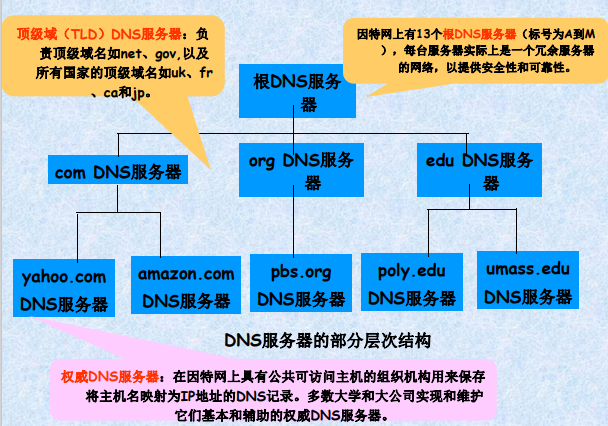

此外，还有一个本地DNS服务器：

- 严格来说,不属于DNS服务器的层次结构
- 每个ISP都有一台本地DNS服务器(也叫默认DNS服务器)
- 主机的本地DNS服务器通常“邻近”本主机
- 当主机发出DNS请求时,该请求被发往本地DNS服务器,它起着代理的作用，并将该请求转发到DNS服务器层次结构中。


> 两种查询机制

第一种递归查询+迭代查询

1是递归查询，246是迭代查询

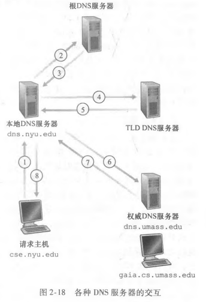

第二种递归查询

1246都是递归查询

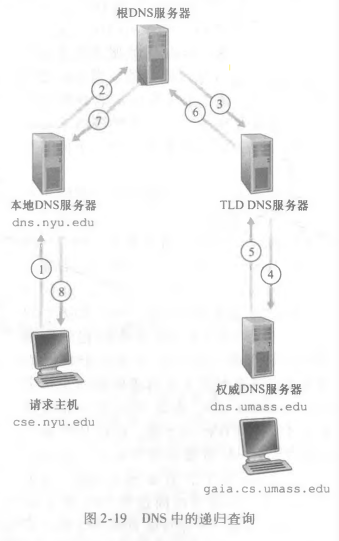


> 2、DNS缓存

- 作用
  - **改善时延性能**、减少在因特网上到处传输的DNS报文数量
- 原理
  - 在一个请求链中,当某DNS服务器接收一个DNS回答时,它能将该回答中的信息缓存在本地存储器中。
- 注意
  - 由于主机和主机名与P地址间的映射并不是永久的,DNS服务器在一段时间后(通常设置为两天)将丢弃缓存的信息。


### 2.5.3 DNS记录报文

> 资源记录

共同实现 DNS分布式数据库的所有 DNS服务器存储了资源记录 （Resource Record,RR)，RR提供了主机名到IP地址的映射。每个 DNS回答报文包含了一条或多条资源记录。

资源记录是一个四元组：`(Name, Value, Type, TTL)`

TTL是该记录的生存时间，它决定了资源记录应当从缓存中删除的时间。Name和Value的值取决于Type;

- 如果Type = A，则Name是主机名,Value是该主机名对应的IP地址。
- 如果Type = NS，则 Name是个域（如foo. com )，而Value是个知道如何获得该域中主机IP地址的权威DNS服务器的主机名。这个记录用于沿着查询链来路由 DNS查询
- 如果Type = CNAME，则Value是别名为Name的主机对应的规范主机名。
- 如果Type = MX，则Value是个别名为Name的**邮件服务器**的规范主机名。


> DNS报文

DNS只有两种报文，并且查询和回答报文是一样的格式

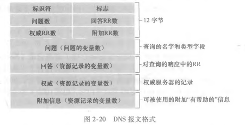


## 2.6 P2P应用

 P2P体系结构对总是打开的基础设施服务器有最小的 （或者没有）依赖


### 2.6.1 P2P文件分发

在P2P文件分发中，每个对等方能够向任何其他 对等方重新分发它已经收到的该文件的任何部分，从而在分发过程中协助中心服务器服务器


#### 2.6.1.1 P2P体系结构的扩展性

服务器和对等方使用接入链路与因特网相连

- u~s~ : 服务器接入链路的上载速率
- u~i~ : 第i对等方接入链路的上载速率
- d~i~ : 第i对等方接入链路的下载速率
- F : 被分发的文件长度(比特)
- N : 获得该文件副本的对等方的数量

分发时间:所有N个对等方得到该文件的副本所需要的时间。

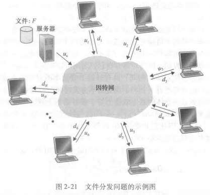

客户-服务器体系结构的分发时间

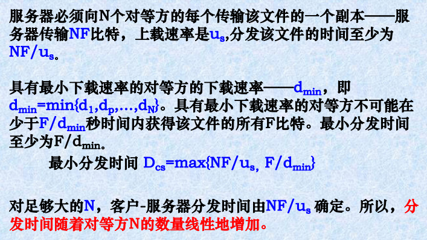

P2P体系结构的分发时间

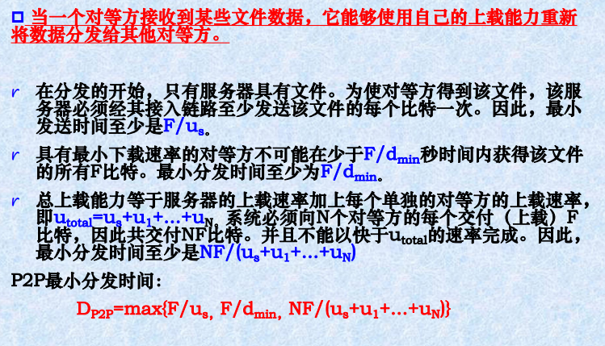

比较两种结构的最小分发时间

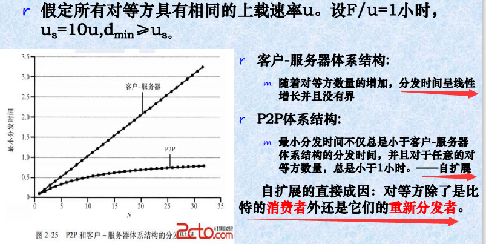


#### 2.6.1.2 BitTorrent

BitTorrent是一种用于文件分发的P2P协议。

- 洪流(torrent):参与一个特定文件分发的所有对等方的集合。
  - 在一个洪流中的对等方彼此下载等长度的文件块，典型的块长度为256KB。
  - 某个对等方在洪流中依据条件可以选择加入或者离开洪流，初次加入时，对等方是没有块的
- 追踪器:每个洪流所具有的一个基础设施结点。
  - 当一个对等方加入某洪流时,它向追踪器注册自己,并周期性地通知追踪器它仍在该洪流中。


> > **新对等方Alice加入如何操作？**

**追踪器**随机地从参与对等方的集合中选择对等方的一个**子集**，并将这些对等方的**IP地址**发送给Alice

 Alice持有对等方的这张列表，试图与该列表上的所有对等方创建**并行的TCP连接**。我们称所有这样与Alice成功地创建一个TCP连接的对等方为“**邻近对等方**” 。临近对等方是会随着时间而波动的。

 Alice**周期性**地（经TCP连接）询问每个邻近对等方它们所具有的块列表。有了这个信息，Alice将对她当前还没有的块发出请求（仍通过TCP连接）。


> > **从邻居请求那些块？**-最稀缺优先技术

针对她没有的块在她的邻居中决定最稀缺的块(邻居中副本数量最少的块）,并首先请求那些最稀缺的块。

使最稀缺块得到更为迅速的重新分发——(大致地)均衡每个块在洪流中的副本数量。


> > **应当向哪个邻居发送** -对换算法

Alice**优先选择以最高速率向他提供数据的邻居**。

- 对每企邻居都持续地测量接收到比特的速率,并确定以最高速率流入的4个邻居。
- 每过10秒,她重新计算该速率并可能修改这4个对等方的集合。这4个对等方被称为**疏通**。

每过30秒Alice将**随机地**选择一名新的对换伴侣并开始与那位伴侣进行对换。

除了这5个对等方(“前”4个对等方和一个试探的对等方)的所有其他相邻对等方均被“**阻塞**”,即它们不能从Alice接收到任何块。


## 2.7 视频流和内容分发网

视频流:视频数据的传输,互联网带宽的主要消费者

- 视频的一个重要特征是它能够被压缩,因而可用比特率来权衡视频质量。
- 比特率越高,图像质量越好,用户总体视觉感受越好。

内容分发网:为了应对分发巨量视频数据的挑战,几乎所有主要的视频流公司都利用内容分发网(Content Distribution Network,CDN)

挑战:规模大，异质性（用户能力不同，带宽不同等）

解决方案:分布式、应用级基础设施


### 2.7.1 DASH

经HTTP的动态适应性流（Dynamic,AdaptiveStreaming over HTTP,DASH)

服务器:

- 将视频文件分成多个块
- 存储的每个块,以不同的速率编码
- 清单文件:提供不同块的URL

客户(具有主动智能性):

- 定期测量服务器到客户端的带宽
- 查询清单,一次请求一个块
- 在给定当前带宽的情况下选择可持续的最大编码率
- 可以在不同的时间点选择不同的编码率(取决于当时的可用带宽)


### 2.7.2 内容分发网

Content Distribution Network

> 选项一：单一的大型服务器

- 单点故障
- 网络拥塞点
- 存在通往远方客户的漫长道路
- 通过传出链接发送多个视频副本
- 很简单,但这个解决方案无法扩展


> 选项二：在多个地理分布的站点 (CDN) 存储/提供多个视频副本

- 深入:将CDN服务器深入到许多接入网络中；贴近用户
- 邀请做客:在接入网络附近(但不在内部)的关键位置建造数量较少(10个)的较大集群；因特网交换点IXP


>  操作

CDN:在CDN 节点存储内容的副本

订阅者从CDN请求内容

- 定向到附近的副本，检索内容
- 如果网络路径拥塞,可以选择不同的副本


## 2.8 套接字编程

网络应用程序的核心:

- 客户机程序和服务器程序。
- 运行时,分别创建一个客户机进程和一个服务器进程,相互之间通过套接字读写数据进行通信。

网络应用程序类型:

- 通用应用程序:
  - 通过RFC文档所定义的标准协议来实现
    程序必须满足该RFC所规定的规则;
    使用与协议相关的端口号。如Web应用
- 专用的应用程序:
  - 程序不必符合RFC规则;开发者根据实际应用设计;
    不能使用RFC中定义的周知端口号。


### 2.8.1 TCP套接字编程

面向连接的，为两个端系统之间的数据流动提供可靠的字节流通道


#### 2.8.1.1 交互

先建立TCP连接,再进行数据传输。

客户机程序是连接的发起方;

服务器必须先准备好,对客户机程序发起的连接做出响应:

- 服务器程序事先已经在系统中运行;
- 服务器程序的一个套接字(欢迎套接字)已经打开,准备接收客户机程序发起的连接(敲门)。


#### 2.8.1.2 具体过程

> 建立TCP连接

客户机进程向服务器发起一个TCP连接:

- 创建一个本地套接字,指定相应服务器进程的地址(IP地址和端口号)。

建立一个TCP连接;

- 当服务器听到客户机的连接请求(敲门)时,创建一个新套接字,经过“三次握手”,客户机套接字和服务器套接字之间建立一个TCP连接(直接的虚拟管道)。==**注意服务器有两个套接字**==

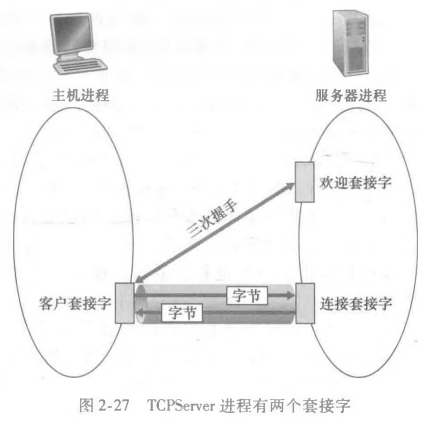

> 传送数据

TCP连接为客户机和服务器提供了一个直接的传输管道。

可靠的,顺序的,字节流的传输


> 术语

流:流入或流出某进程的一串字符序列。

输入流:来自某个输入源(如键盘)、或某个套接字(因特网的数据流入套接字)。

输出流:到某个输出源(如显示器)、或某个套接字(数据通过套接字流向因特网)。


#### 2.8.1.3 代码示例

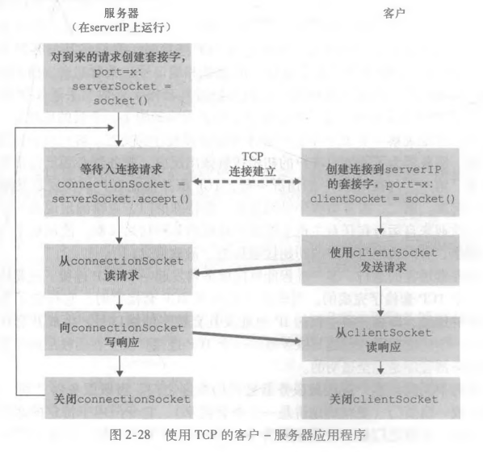

```python
# client.py
from socket import *
serverName = 'servername'
serverPort = 12000
clientSocket = socket(AF_INET, SOCK_STREAM)
clientsocket.connect((serverName, serverPort))
sentence = raw_input('Input lowercase sentence:')
clientsocket.send(sentence.encode())
modifiedSentence = clientsocket.recv(1024)
print('From Server: ', modifiedSentence.decode())
cientSocket.close()

# server.py
from socket import *
serverPort = 12000
serverSocket = socket(AF_INET, SOCK_STREAM)
serverSocket.bind(('', serverPort))
# 请求连接的最大数
serverSocket.listen(1)
print('The server is ready to receive')
while True:
    connectionSocket, addr = serverSocket.accept()
    sentence = connectionsocket.recv(1024).decode()
    capitalizedSentence = sentence.upper()
    connectionsocket.send(capitalizedSentence.encode())
    connectionSocket.close()
```


### 2.8.2 UDP套接字编程

#### 2.8.2.1 介绍

- UDP是一种无连接的服务，即在两个进程之间没有创建管道时所需的初始握手阶段。
- 进程之间的数据传递以分组为单位进行。
- ==**分组中含目的进程地址(主机IP地址和端口号)。**==
- 提供不可靠的传输服务。
- 底层操作系统会把源主机的IP地址和原套接字的端口号也会附在分组上


#### 2.8.2.2 编程说明

- 通信进程之间没有初始握手,不需要欢迎套接字;
- 没有流与套接字相联系;
- 发送主机将信息字节封装生成分组,再发送;
- 接收进程解封收到的分组,获得信息字节。


#### 2.8.2.3 代码示例

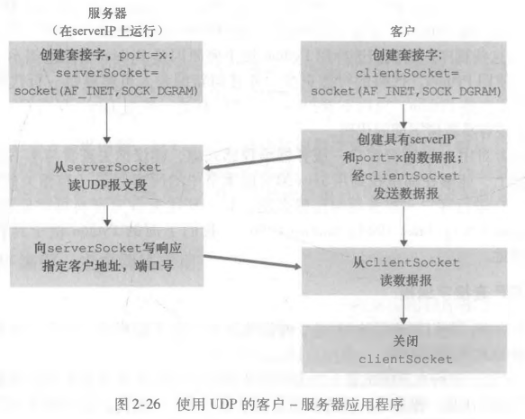

```python
# client.py
from socket import *
serverName = 'hostname'
serverPort = 12000
clientsocket = socket(AF_INET, SOCK_DGRAM)
message = raw_input('Input lowercase sentence:')
clientSocket.sendto(message.encode(), (serverName, serverPort))
modifiedMessage, serverAddress = clientsocket.recvfrom(2048)
print(modifiedMessage.decode())
clientSocket.close()

# server.py
from socket import *
serverPort = 12000
serverSocket = socket(AF_INET, SOCK_DGRAM)
serversocket.bind(('', serverPort))
print('The server is ready to receivez')
while True: 
    message, clientAddress = serverSocket.recvfrom(2048)
    modifiedMessage = message.decode().upper()
    serverSocket.sendto(modifiedMessage.encode(), clientAddress)
```


