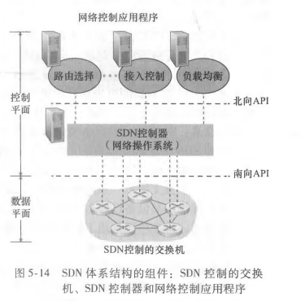
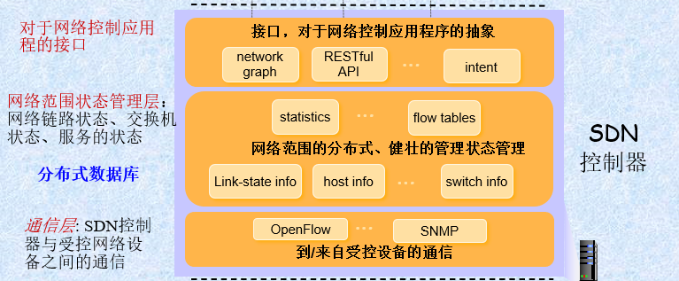

# 网络层：控制平面

控制平面作为一种网络范围的逻辑，不仅控制沿着从源主机到目的主机的端到端路径间的路由器如何转发数据报，而且控制网络层组件和服务如何配置和管理 。

## 5.1 概述

转发表和流表是如何计算、维护和安装？有以下两种方法：

> **每路由器控制**

每路由器控制。每台路由器中运行一种路由选择算法，**每台路由器中都包含转发和路由选择功能。**每台路由器有一个路由选择组件，用于与其他路由器中的路由选择组件通信，以计算其转发表的值。这种方法在因特网中已经使用了几十年。OSPF和BGP协议都是基于这种方法进行控制的。 

> **逻辑集中式控制**

逻辑集中式控制。**逻辑集中式控制器计算并分发转发表以供每台路由器使用**。通用的“匹配加动作”抽象允许执行传统的IP转发以及其他功能（负载共享、防火墙功能和NAT）的丰富集合，而这些功能先前是在单独的中间盒中实现的。

控制器经一种定义良好的协议与每台路由器中的一个**控制代理（CA）**进行交互, 以配置和管理该路由器的转发表。CA—般具有最少的功能，其任务是与控制器通信并且按控制器命令行事。这些CA既不能直接相互交互，也 不能主动参与计算转发表。这是每路由器控制和逻辑集中式控制之间的关键差异。SDN采用了逻辑集中式控制器的概念。

## 5.2 路由选择算法

其目的是从发送方到接收方的过程中确定一条通过路由器网络的好的路径（等价于路由）。通常，一条好路径指具有最低开销的路径。

路由选择算法的一种分类是根据该算法是集中式还是分散式的

> 集中式路由选择算法

集中式路由选择算法用完整的、全局性的网络知识计算岀从源到目的地之间的最低开销路径。该算法以所有节点之间的连通性及所有链路的开销为输入。集中式算法具有关于连通性和链路开销方面的完整信息。具有全局状态信息的算法常被称作链路状态（Link State, LS）算法, 因为该算法必须知道网络中每条链路的开销。

> 分散式路由选择算法

在分散式路由选择算法中，路由器以迭代、分布式的方式计算出最低开销路径。没有节点拥有关于所有网络链路开销的完整信息。每个节点仅有与其直接相连链路的开销知识。通过迭代计算过程以及与相邻节点的信息交换，一个节点逐渐计算出到达某目的节点或一组目的节点的最低开销路径。距离向量（Distance-Vector, DV）算法的分散式路由选择算法中，每个节点维护到网络中所有其他节点的开销（距离）估计的向量。这种分散式算法，通过相邻路由器之间的交互式报文交换，更适合那些路由器直接交互的控制平面。

路由选择算法的第二种分类是根据算法是静态的还是动态的。

> 静态路由算法

静态路由选择算法中，路由随时间的变化非常缓慢，通常是人工进行调整（如人为手工编辑一条链路开销）。

> 动态路由算法

动态路由选择算法随着网络流量负载或拓扑发生变化而改变路由选择路径。一个动态算法可周期性地运行或直接响应拓扑或链路开销的变化而运行。虽然动态算法易于对网络的变化做岀反应，但也更容易受诸如路由选择循环、路由振荡之类问题的影响。

路由选择算法的第三种分类是根据它是负载敏感的还是负载迟钝的分。

> 负载敏感

负载敏感算法中，链路开销会动态地变化以反映出底层链路的当前拥塞水平。如果当前拥塞的一条链路与高开销相联系，则路由选择算法趋向于绕开该拥塞链路来选择路由。

> 负载迟钝

当今的因特网路由选择算法（如RIP、 OSPF和BGP）都是负载迟钝的,因为某条链路的开销不明确地反映其当前（或最近）的拥塞水平

### 5.2.1 链路状态路由选择算法

> 概述

在链路状态算法中，网络拓扑和所有链路开销都是已知的，也就是LS算法的输入。实践中这是通过让每个节点向网络中所有其他节点**广播**链路状态分组来完成的，其中每个链路状态分组包含它所连接的链路的标识和开销。即**链路状态广播**算法。节点广播的结果是**所有节点都具有该网络的统 一、完整的视图**。每个节点都能够运行LS算法并计算出相同的最低开销路径集合。

> 算法

Dijkstra算法

- D(v)：到算法本地迭代，从源节点到目的节点v的最低开销路径的开销
- p(v)：从源到v沿着当前最低开销路径的前一节点
- N’：节点子集，如果从源到v的最低开销路径以确定，v在N'中

该集中式路由选择算法由一个初始化步骤和其后的循环组成。循环执行的次数与网络中节点个数相同。一旦终止，该算法就计算出了从源节点u到网络中每个其他节点的最短路径。

> 样例

通过回溯，就可以得到最终的路径

> 算法分析

链路状态算法在最差情况下复杂性为O(n^2^)

可能会出现链路震荡：当链路开销等于链路上承载的负载（**路由震荡：路由随着链路成本的变化来回切换**）

解决方法：确保并非所有的路由器都同时运行LS算法

### 5.2.2 距离向量路由选择算法

> 概述

距离向量（Distance-Vector, DV）算法是一种**迭代的、异步的和分布式**的算法，而LS 算法是一种使用全局信息的算法。分布式的——每个节点都要从一个或多个直接相连邻居接收某些信息，执行计算，然后将其计算结果分发给邻居。迭代的——此过程一直要持续到邻居之间无更多信息要交换为止。异步的——它不要求所有节点相互之间步伐一致地操作。

> 算法

Bellman-Ford算法

只要有某个距离向量改变了，就需要再次向他的邻居发送其更新后的距离向量

> 存在问题-无穷计算

当链路开销变化时，如果是开销减小，将有利于算法的计算，如果是链路开销变大，可能回出现路由选择环路，即相互依赖，比如y通过z到达x，z又通过y到达x。

解决：增加毒性逆转

其思想较为简单：如果z通过y路由选择到目的地x，则z将通告y,z到x的距离是无穷大，也就是z将向y通告Dz（x） =∞（即使z实际上知道Dz(x)=5）。

涉及3个或更多节点（而不只是两个直接相连的邻居节点）的环路毒性逆转技术没用了。

最佳解决方法：定义最大度量

定义一个最大的有效费用值，如RIP协议定义最大跳数为15跳步，16跳步表示∞，

### 5.2.3 两者比较

N是节点（路由器）的集合，而E是边（链路）的集合

- 报文复杂性。LS算法要求每个节点都知道网络中每条链路的开销。这就要求要发送O( |N||E|)个报文。而且无论何时一条链路的开销改变时，必须向所有节点发送新的链路开销。DV算法要求在每次迭代时，在两个直接相连邻居之间交换报文。
- 收敛速度。LS算法的实现是一个要求O(|N||E|)个报文的O(|N|^2^)算法。DV算法收敛较慢，且在收敛时会遇到路由选择环路。DV算法还会遭遇无穷计数的问题。
- 健壮性。如果一台路由器发生故障、行为错乱或受到蓄意破坏时情况会怎样呢?对于LS算法，路由器能够向其连接的链路（而不是其他链路）广播不正确的开销。在LS算法下，路由计算在某种程度上是分离的，提供了一定程度的健壮性。在 DV算法下，一个节点可向任意或所有目的节点通告其不正确的最低开销路径。每次迭代时，在 DV算法中一个节点的计算会传递给它的邻居，然后在下次迭代时再间接地传递给邻居的邻居。在此情况下，DV算法中一个不正确的节点计算值会扩散到整个网络。

## 5.3 因特网中自治系统内部的路由选择

同质化路由器的观点有点简单化，有下列两个原因

规模。随着路由器数目变得很大，涉及路由选择信息的通信、计算和存储的开销将高得不可实现。在如此大量的路由器中迭代的距离向量算法将肯定永远无法收敛！ 

管理自治。因特网是ISP的网络，其中每个ISP都有它自己的路由器网络。ISP通常希望按自己的意愿运行路由器（如在自己的网络中运行它所选择的某种路由选择算法），或对外部隐藏其网络的内部组织面貌。

### 5.3.1 自治系统AS

上面两个问题都可以通过将路由器组织进自治系统（Autonomous System, AS）来解决， 其中每个AS由一组通常处在相同管理控制下的路由器组成。通常在一个ISP中的路由器以及互联它们的链路构成一个AS。然而，某些ISP将它们的网络划分为多个AS。特别是, 某些一级ISP在其整个网络中使用一个庞大的AS,而其他ISP则将它们的ISP拆分为数十个互联的AS。一个自治系统由其全局唯一的AS号（ASN）所标识。 

在相同AS中的路由器都运行相同的路由选择算法并且有彼此的信息。在一个自治系统内运行的路由选择算法叫作自治系统内部路由选择协议（intTa autonomous system routing protocol） 

### 5.3.2 RIP选路信息协议

> 概念

路由信息协议RIP是内部网关协议IGP中最先得到广泛使用的协议。

RIP是一种分布式的基于距离向量的路由选择协议。

- 距离度量: 跳的数量(最大 = 15跳)
- 跳：从源路由器到目的子网的最短路径所经过子网数量

> 定义

- 仅和相邻路由器交换路由选择信息。

  - 目的子网、下一台路由器、跳数。 

  

  

- 按固定的时间间隔交换路由信息（RIP响应报文/RIP通告），例如，每隔 30 秒。

- 每次通告：最多25个目的子网(IP地址形式) 

- 如果180秒没有收到通告→邻居/链路失效 

> 实例

> RIP表处理

RIP选路表由称为route-d (守护进程)的应用级进程管理

**通告在UDP分组中发送，周期地重复**

> 优缺点

- 最大的优点就是实现简单，开销较小。
- RIP 限制了网络的规模，它能使用的最大距离为 15（16 表示不可达）。
- 路由器之间交换的路由信息是路由器中的完整路由表，因而随着网络规模的扩大，开销也就增加。 
- RIP 存在的一个问题是当网络出现故障时，要经过比较长的时间才能将此信息传送到所有的路由器。好消息传播得快，而坏消息传播得慢
  - 无穷计算问题 

### 5.3.2 OSPF协议

> 概念

OSPF是一种链路状态协议，它使用**洪泛链路状态信息**和Dijkstra最低开销路径算法。 **使用OSPF, —台路由器构建了一幅关于整个自治系统的完整拓扑图**（即一幅图）。每台路由器在本地运行Dijkstra的最短路径算法，以确定一个以自身为根节点到所有子网的最短路径树。

使用OSPF时，**路由器向自治系统内所有其他路由器广播路由选择信息**，而不仅仅是向其相邻路由器广播。每当一条链路的状态发生变化时，路由器就会广播链路状态信息。即使链路状态未发生变化，它也要周期性地 （至少每隔30min一次）广播链路状态。这种周期性更新增加了链路状态算法的健壮性。”

**OSPF通告包含在OSPF报文中，该OSPF 报文直接由IP承载**，对OSPF其上层协议的值为89。因此OSPF协议必须自己实现诸如可靠报文传输、链路状态广播等功能。**OSPF协议还要检查链路正在运行（通过向相连的邻居发送HELLO报文**），并允许OSPF路由器获得相邻路由器的网络范围链路状态的数据库。

> 优点

安全。能够鉴别OSPF路由器之间的交换（如链路状态更新）。使用鉴别，仅有受信任的路由器能参与一个AS内的OSPF协议，因此可防止恶意入侵者 将不正确的信息注入路由器表内。

多条相同开销的路径。当到达某目的地的多条路径具有相同的开销时，OSPF允许使用多条路径，无须仅选择单一的路径来承载所有的流量）

对单播与多播路由选择的综合支持。多播OSPF （MOSPF）提供对OSPF的简单扩展，以便提供多播路由选择

**支持在单个AS中的层次结构**。**一个OSPF自治系统能够层次化地配置多个区域**。 每个区域运行自己的OSPF链路状态路由选择算法，区域内每台路由器都向该区域内的所有其他路由器广播其链路状态。在每个区域内，**区域边界路由器负责为流向该区域以外的分组提供路由选择**。AS中只有**一个OSPF 区域配置成主干区域**，主要作用是**为该AS中其他区域之间的流量提供路由选择**。

## 5.4 ISP之间的路由选择：BGP

在因特网中，所有的AS运行相同的AS间路由选择协议，称为边界网关协议（Broder Gateway Protocol, BGP） 

### 5.4.1 BGP的作用

在BGP中，分组并不是路由到一个特定的目的地址，相反是路由到CIDR化的前缀, 其中每个前缀表示一个子网或一个子网的集合。在BGP的世界中，一个目的地可以采用138.16. 68/22的形式。因此，一台路由器的转发表将具有形式为（x，I）的表项，其中x是一个前缀（例如138.16.68/22）, I是该路由器的接口之一的接口号。

作为一种AS间的路由选择协议，BGP为每台路由器提供了一种完成以下任务的手段: 

1）从邻居AS获得前缀的可达性信息。特别是，BGP允许每个子网向因特网的其余部分通告它的存在。如果没有BGP的话，每个子网将是隔离的孤岛。 

2）确定到该前缀的“最好的”路由。一台路由器可能知道两条或更多条到特定前缀的不同路由。该最好的路由将基于策略以及可达性信息 来确定。 

### 5.4.2 通告BGP路由信息

对于每个AS,每台路由器要么是一台网关路由器（gateway router）,要么是一台内部路由器（internal router），网关路由器是一台位于AS边缘的路由器，它直接连接到在其他AS中的一台或多台路由器。内部路由器仅连接在它自己AS中的主机和路由器。

**在BGP中，每对路由器通过使用179端口的半永久TCP连接交换路由选择信息**。每条直接连接以及所有通过该连接发送的BGP报文，称为 BGP连接。此外，跨越两个AS的BGP连接称为**外部BGP(eBGP)连接**，而在相同AS中的两台路由器之间的BGP会话称为**内部BGP(iBGP)连接**。对于直接连接在不同AS中的网关路由器的每条链路而言，通常有一条eBGP连接；在每个AS中的路由器之间还有多条iBGP连接。注意到iBGP连接并不总是与物理链路对应。

### 5.4.3 确定最好的路由

从一个给定的路由器到一个目的子网可能有多条路径。一台路由器如何在这些路径之间进行选择(并且再相应地配置它的转发表)呢？ 

当路由器通过BGP连接通告前缀时，它在前缀中包括一些BGP属性。前缀及其属性称为路由(route)。两个重要的属性是AS-PATH和NEXT-HOP。AS-PATH属性包含了通告已经通过的AS的列表。BGP路由器还使用AS-PATH属性来检测和防止通告环路；NEXT-HOP是AS-PATH起始的路由器接口的IP地址。

> 算法-热土豆路由选择

热土豆路由选择依据的思想是：对于路由器,尽可能快地将分组送出其AS （更明确地说，用可能的最低开销），而不担心其AS外部到目的地的余下部分的开销。热土豆路由选择因而是自私的算法，即它试图减小在它自己AS中的开销，而忽略在其AS之外的端到端开销的其他部分。

## 5.5 SDN控制平面

为何需要一个逻辑集中式的控制平面？

- 更方便网络管理
  - 集中式统一管理，避免路由器配置错误
  - 动态流量监管，灵活处理流量
- 基于流表转发，编程路由器
  - 集中式编程，更容易：集中计算流表，再分发
  - 分布式编程，较为困难：每个路由器独立运行路由算法，分布式计算路由表
- 控制平面的开放实现
  - 可编程按需定制

### 5.5.1 结构

> 数据平面交换机

快速、简单、交换机硬件实现通用转发

交换机的流表由远程控制器计算和配置

通过API配置交换机流表(e.g., OpenFlow)

遵循协议与远程控制器通信 (e.g., OpenFlow)

> SDN控制器（网络OS）

维护网络状态信息

与网络控制应用程序，通过北向API交互

与网络交换机通过南向API交互

分布式系统：提升性能、可扩展性、容错、健壮性

> 网络控制应用

控制平面的智力：通过北向API获得下层服务，实现控制功能

非捆绑的：可由第三方提供

## 5.6 ICMP：因特网控制报文协议

因特网控制报文协议（ICMP）,被主机和路由器用来彼此沟通网络层的信息。**ICMP最典型的用途是差错报告**。在某个位置，IP路由器不能找到一条通往HTTP请求中所指定的主机的路径，该路由器就会向你的主机生成并发出一个ICMP报文以指示该错误。 

**ICMP通常被认为是IP的一部分**，但从体系结构上讲它位于IP之上，因为**ICMP报文是承载在IP分组中的**。这就是说，ICMP报文是作为IP有效载荷承载的，就像TCP与 UDP报文段作为IP有效载荷被承载那样。**上层协议编码为1。**

ICMP报文有一个类型字段和一个编码字段，并且包含引起该ICMP报文首次生成的IP数据报的首部和前8个字节（以便发送方能确定引发该差错的数据报）。

众所周知的ping程序发送一个ICMP类型8编码0的报文到指定主机。看到回显（echo）请求，目的主机发回一个类型0编码0的ICMP回显回答。大多数TCP/IP实现直接在操作系统中支持ping服务器，即该服务器不是一个进程。

## 5.7 网络管理和SNMP

网络管理包括了硬件、软件和人类元素的设置、综合和协调，以监视、测 试、轮询、配置、分析、评价和控制网络及网元资源，用合理的成本满足实时性、运营性能和服务质量的要求。

> 网络管理框架

算了，不写了，看不懂