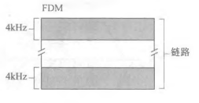

# 链路层和局域网

## 6.1 概述

### 前言

将运行链路层协议(即第2 层)协议的任何设备均称为**节点**(node) ，节点包括主机、路由器、交换机和WiFi接入点 。

把沿着通信路径连接相邻节点的通信信道称为**链路**(link) 。为了将一个数据报从源主机传输到目的主机，数据报必须通过沿端到端路径上的各段链路传输。

通过特定的链路时，传输节点将数据报封装在**链路层帧**中，并将该帧传送到链路中

### 6.1.1 链路层提供的服务

尽管任一链路层的基本服务都是将数据报通过单一通信链路从一个节点移动到相邻节点，但所提供的服务细节能够随着**链路层协议的不同而变化**。链路层协议能够提供的可能服务包括: 

- 成帧。链路层协议**将网络层数据报用链路层帧**封装起来。一个帧由一个数据字段和若干首部字段组成，其中网络层数据报就插在数据字段中。帧的结构由链路层协议规定。
- 链路接入。媒体访问控制（Medium Access Control, MAC）协议规定了**帧在链路上传输的规则**。当多个节点共享单个广播链路时，即多路访问时，MAC协议用于协调多个节点的帧传输。
- 可靠交付。当链路层协议提供可靠交付服务时，它保证无差错地经链路层移动每个网络层数据报。链路层可靠交付服务通常用于高差错率的链路，例如无线链路，其目的是本地纠正一个差错，而不是迫使端到端数据重传。然而，对于低比特差错的链路，链路层可靠交付是不必要开销。许多有线的链路层协议不提供可靠交付服务。
- 差错检测和纠正。发送节点在帧中包括差错检测比特，接收节点进行差错检查。链路层的差错检测通常更复杂，并且用硬件实现。差错纠正中接收方不仅能检测帧中出现的比特差错，而且能确定帧中差错出现的位置，并纠正。

### 6.1.2 链路层在何处实现

链路层是实现在路由器的线路卡中。一个典型的主机体系结构链路层的主体部分是在网络适配器（network adapter）中实现的，网络适配器也称为网络接口卡（Network Interface Card, NIC）。 位于网络适配器核心的是链路层控制器，该控制器通常是一个实现了许多链路层服务的专用芯片。因此，链路层控制器的许多功能是用硬件实现的。发送端控制器取得数据报，在链路层帧中封装该数据报，然后遵循链路接入协议将帧传进通信链路。在接收端，控制器接收整个帧，抽取网络层数据报。链路层的软件组件实现了高层链路层功能，如组装链路层寻址信息和激活控制器硬件。在接收端，链路层软件响应控制器中断，处理差错条件和将数据报向上传递给网络层。所以，链路层是硬件和软件的结合体，即此处是协议栈中软件与硬件交接的地方。

## 6.2 差错检测和纠正技术

在发送节点，为了保护比特免受差错，使用差错检测和纠正比特 (Error- Detection and- Correction EDC）来增强数据D。通常，要保护的数据不仅包括从网络层传递下来需要通过链路传输的数据报，而且包括链路帧首部中的链 路级的寻址信息、序号和其他字段。

### 6.2.1 奇偶校验

一维奇偶校验只能检测出奇数个比特差错，且不能纠正。

二位奇偶校验，接收方不仅可以检测到出现了单个比特差错，还可以利用存在奇偶校验差错的列和行的索引来识别发生差错的比特并纠正它

### 6.2.2 校验和方法

在检验和技术中，将d比特数据报作为一个k比特整数的序列处理。一个简单检验和方法就是将这k比特整数加起来，并且用得到的和作为差错检测比特。因特网检验和（Internet checksum）就基于这种方法，即数据的字节作为16比特的整数对待并求和。这个和的反码形成了携带在报文段首部的因特网检验和。

### 6.2.3 循环冗余检测

现今的计算机网络中广泛应用的差错检测技术基于循环冗余检测（Cyclic RedundancyCheck ,CRC)编码。CRC编码也称为多项式编码（ polynomial code)，因为该编码能够将要发送的比特串看作为系数是0和1一个多项式，对比特串的操作被解释为多项式算术。
CRC编码操作如下。考虑d比特的数据D，发送节点要将它发送给接收节点。发送方和接收方首先必须协商一个r +1比特模式，称为生成多项式( generator )，我们将其表示为G。我们将要求**G的最高有效位的比特（最左边）是1**。

对于一个给定的数据段D，发送方要选择r个附加比特R，并将它们附加到D上，使得得到的d +r比特模式（被解释为一个二进制数)用模2算术恰好能被G整除(即没有余数)。用CRC进行差错检测的过程因此很简单:接收方用G去除接收到的d +r比特。如果余数为非零,接收方知道出现了差错;否则认为数据正确而被接收。

所有CRC计算采用模2算术来做，在**加法中不进位，在减法中不借位**。这意味着加法和减法是相同的，而且这两种操作等价于操作数的**按位异或(XOR)**。

实例

在D = 101110, d = 6, G = 1001和 r =3的情况下的计算过程

## 6.3 多路访问链路和协议

### 6.3.1 概述

有两种类型的网络链路:点对点链路和广播链路。**点对点链路**由链路一端的单个发送方和链路另一端的单个接收方组成。第二种类型的链路是**广播链路**，它能够让多个发送和接收节点都连接到相同的、单一的、共享的广播信道上。这里使用“广播”是因为当任何一个节点传输一个帧时，信道广播该帧，**每个其他节点都收到一个副本**。以太网和无线局域网是广播链路层技术的例子。

如何协调多个发送和接收节点对一个共享广播信道的访问，这就是**多路访问问题**( multiple access problem)。

**多路访问协议（ multiple access protocol )，即节点通过这些协议来规范它们在共享的广播信道上的传输行为。**

> **碰撞**

因为所有的节点都能够传输帧，所以多个节点可能会同时传输帧。当发生这种情况时，所有节点同时接到多个帧;这就是说，传输的帧在所有的接收方处碰撞了。通常，当碰撞发生时，没有一个接收节点能够有效地获得任何传输的帧;在某种意义下，碰撞帧的信号纠缠在一起。因此，涉及此次碰撞的所有帧都丢失了，在碰撞时间间隔中的广播信道被浪费了。显然，如果许多节点要频繁地传输帧，许多传输将导致碰撞，广播信道的大量带宽将被浪费掉。

当多个节点处于活跃状态时，为了确保广播信道执行有用的工作，以某种方式协调活跃节点的传输是必要的。这种协调工作由多路访问协议负责。多路访问协议划分为3种类型:信道划分协议（ channel partitioning proto-col )，随机接入协议（ random access protocol)和轮流协议（ taking-turns protocol)。

> 多路访问协议应当具有的特性

在理想情况下，对于速率为R bps的广播信道,多路访问协议应该具有以下所希望的特性:

1. 当仅有一个节点发送数据时，该节点具有R bps的吞吐量;
2. 当有M个节点发送数据时，每个节点吞吐量为R/M bps。这不必要求M个节点中的每一个节点总是有R/M的瞬间速率，而是每个节点在一些适当定义的时间间隔内应该有R/M的平均传输速率。
3. 协议是分散的;这就是说不会因某主节点故障而使整个系统崩溃。
4. 协议是简单的,使实现不昂贵。

### 6.3.2 信道划分协议

> TDM时分多路复用

假设一个支持N个节点的信道且信道的传输速率为Rbps。TDM将时间划分为**时间帧(** timeframe)，并进一步划分每个时间帧为**N个时隙**（ slot )。然后把每个时隙分配给N个节点中的一个。无论何时某个节点在有分组要发送的时候,它在循环的TDM帧中指派给它的时隙内传输分组比特。通常，**选择的时隙长度应使一个时隙内能够传输单个分组**。

TDM是有吸引力的，因为它**消除了碰撞而且非常公平**:每个节点在每个帧时间内得到了专用的传输速率R/N bps。然而它有两个主要缺陷。首先，**节点被限制于R/N bps 的平均速率**，即使当它是唯一有分组要发送的节点时。其次，**节点必须总是等待它在传输序列中的轮次**，即我们再次看到，即使它是唯一一个有帧要发送的节点。

> FDM频分多路复用

TDM在时间上共享广播信道，而FDM将R bps信道划分为不同的频段（每个频段具有R/N带宽)，并把每个频率分配给N个节点中的一个。因此 FDM在单个较大的Rbps信道中创建了N个较小的R/N bps 信道。FDM也有TDM同样的优点和缺点。它避免了碰撞，在N个节点之间公平地划分了带宽。然而，FDM 也有TDM所具有的主要缺点，也就是限制一个节点只能使用R/N的带宽，即使当它是唯一一个有分组要发送的节点时。

> CDMA码分多址

第三种信道划分协议是码分多址（Code Division Multiple Access，CDMA )。TDM和FDM分别为节点分配时隙和频率，而**CDMA对每个节点分配一种不同的编码**。然后每个节点用它唯一的编码来对它发送的数据进行编码。如果精心选择这些编码，CDMA网络具有一种奇妙的特性，即不同的节点能够同时传输，并且它们各自相应的接收方仍能正确接收发送方编码的数据比特，而不在乎其他节点的干扰传输。CDMA已经在军用系统中使用了一段时间（由于它的抗干扰特性)，目前已经广泛地用于民用，尤其是蜂窝电话中。

### 6.3.3 随机接入协议

第二大类多访问协议是随机接入协议。在随机接人协议中，一个传输节点总是以信道的**全部速率**（即R bps）进行发送。当有碰撞时，涉及碰撞的每个节点**反复地重发它的帧（也就是分组)**，到该帧无碰撞地通过为止。但是当一个节点经历一次碰撞时，它不必立刻重发该帧。相反，它在重发该帧之前等待一个随机时延。涉及碰撞的每个节点独立地选择随机时延。因为该随机时延是独立地选择的，所以下述现象是有可能的:这些节点之一所选择的时延充分小于其他碰撞节点的时延，并因此能够无碰撞地将它的帧在信道中发出。

> 时隙ALOHA协议

以最简单的随机接人协议之一——时隙ALOHA 协议，开始对随机接入协议的学习。做下列假设:

- 所有帧由L比特组成。
- 时间被划分成长度为L/R秒的时隙（这就是说，一个时隙等于传输一帧的时间)。节点只在时隙起点开始传输帧。
- 节点是同步的,每个节点都知道时隙何时开始。
- 如果在一个时隙中有两个或者更多个帧碰撞，则所有节点在该时隙结束之前检测到该碰撞事件。

令p是一个概率，即一个在0和1之间的数。在每个节点中，时隙ALOHA 的操作是简单的:

- 当节点有一个新帧要发送时，它等到下一个时隙开始并在该时隙传输整个帧。
- 如果没有碰撞，该节点成功地传输它的帧，从而不需要考虑重传该帧。(如果该节点有新帧,它能够为传输准备一个新帧。)
- 如果有碰撞，该节点在时隙结束之前检测到这次碰撞。该节点以概率p在后续的每个时隙中重传它的帧，直到该帧被无碰撞地传输出去。

以概率p重传，是指某节点在这个时隙重传出现的概率为p。跳过这个时隙的概率为1-p。所有涉及碰撞的节点独立地运行他们的概率选择。

时隙ALOHA看起来有很多优点。与信道划分不同，当某节点是唯一活跃的节点时，时隙ALOHA允许该节点以全速R连续传输。时隙ALOHA也是高度**分散**的，因为每个节点检测碰撞并**独立地决定**什么时候重传。(然而，时隙ALOHA 的确需要在节点中对**时隙同步**;下面的ALOHA协议以及CSMA协议都不需要这种同步。）时隙ALOHA也是一个极为简单的协议。

假设有N个节点。则一个给定时隙是成功时隙的概率为节点之一传输而余下的N-1个节点不传输的概率。一个给定节点传输的概率是p;剩余节点不传输的概率是（1-p)^N-1^。因此，一个给定节点成功传送的概率是p(1-p)^N-1^。因为有N个节点，任意一个节点成功传送的概率是**Np(1-p)^N-1^**。可以得到这个协议的最大效率为**1/e=0.37**。这就是说，当有大量节点有很多帧要传输时，则（最多）仅有37%的时隙做有用的工作。

> ALOHA

时隙ALOHA协议要求所有的节点同步它们的传输，以在每个时隙开始时开始传输。第一个ALOHA协议实际上是一个**非时隙、完全分散**的协议。在纯ALOHA 中，当一帧首次到达（即一个网络层数据报在发送节点从网络层传递下来)，节点立刻将该帧完整地传输进广播信道。如果一个传输的帧与一个或多个传输经历了碰撞，这个节点将立即（在完全传输完它的碰撞帧之后）以概率p重传该帧。否则，该节点等待一个帧传输时间。在此等待之后，它则以概率p传输该帧，或者以概率1-p在另一个帧时间等待（保持空闲)。

为了确定纯ALOHA 的最大效率，我们关注某个单独的节点。我们的假设与在时隙ALOHA分析中所做的相同，取帧传输时间为时间单元。在任何给定时间，某节点传输一个帧的概率是p。假设该帧在时刻t0开始传输。为了使该帧能成功地传输，在时间间隔[t0-1，t0]中不能有其他节点开始传输。这种传输将与节点i的帧传输起始部分相重叠。所有其他节点在这个时间间隔不开始传输的概率是(1 - p)^N-1^。类似地，当节点i在传输时，其他节点不能开始传输，因为这种传输将与节点i传输的后面部分相重叠。所有其他节点在这个时间间隔不开始传输的概率也是(1 - p)^N-1^。因此，一个给定的节点成功传输一次的概率是p(1-p)^2N-1^。求得纯ALOHA协议的最大效率仅为1/(2e)，这刚好是时隙ALOHA的一半。这就是完全分散的ALOHA协议所要付出的代价。

> CSMA载波侦听多路访问协议

在时隙和纯ALOHA 中，一个节点传输的决定独立于连接到这个广播信道上的其他节点的活动。

两个重要的规则:

- 载波侦听（ carrier sensing)，即一个节点在传输前先听信道。如果来自另一个节点的帧正向信道上发送，节点则等待直到检测到一小段时间没有传输，然后开始传输。
- 碰撞检测 （ colli-sion detection)，即当一个传输节点在传输时一直在侦听此信道。如果它检测到另一个节点正在传输干扰帧，它就停止传输，在重复“侦听-当空闲时传输”循环之前等待一段随机时间。

这两个规则包含在载波侦听多路访问(Carrier Sense Multiple Access，CSMA)和具有碰撞检测的CSMA ( CSMA with Collision Detection，CSMA/CD）协议族中。

> 具有碰撞检测的载波侦听多路访问协议CSMA/CD

在分析CSMA/CD协议之前，先从与广播信道相连的适配器（在节点中）的角度总结它的运行:

1. 适配器从网络层―条获得数据报，准备链路层帧，并将其放入帧适配器缓存中。
2. 如果适配器侦听到信道空闲（即无信号能量从信道进入适配器)，它开始传输帧。在另一方面，如果适配器侦听到信道正在忙，它将等待，直到侦听到没有信号能量时才开始传输帧。
3. 在传输过程中，适配器监视来自其他使用该广播信道的适配器的信号能量的存在。
4. 如果适配器传输整个帧而未检测到来自其他适配器的信号能量，该适配器就完成了该帧。在另一方面，如果适配器在传输时检测到来自其他适配器的信号能量，它中止传输（即它停止了传输帧)。
5. 中止传输后,适配器等待一个随机时间量,然后返回步骤2。

等待一个随机（而不是固定）的时间量的需求是明确的——如果两个节点同时传输帧，然后这两个节点等待相同固定的时间量，它们将持续碰撞下去。但选择随机回退时间的时间间隔多大为好呢?如果时间间隔大而碰撞节点数量小，节点很可能等待较长的时间（使信道保持空闲)。在另一方面，如果时间间隔小而碰撞节点数量大，很可能选择的随机值将几乎相同，传输节点将再次碰撞。我们希望时间间隔应该这样:当碰撞节点数量较少时，时间间隔较短;当碰撞节点数量较大时，时间间隔较长。

**以太网中的二进制指数后退算法**。当传输一个给定帧时，在该帧经历了一连串的n次碰撞后，节点随机地从 [0，1，2，…，2^n^-1]中选择一个K值。因此，一个帧经历的碰撞越多，K选择的间隔越大。对于以太网，一个节点等待的实际时间量是**K*512比特时间**（即发送512比特进入以太网所需时间量的K倍)，n能够取的最大值在10以内。

**传播时延对CSMA/CD的影响**

**帧传输时间要大于传播时延的两倍**

练习：

### 6.3.4 轮流协议

多路访问协议的两个理想特性是:①当只有一个节点活跃时，该活跃节点具有R bps的吞吐量;②当有M个节点活跃时，每个活跃节点的吞吐量接近R/M bps。ALOHA和CSMA协议具备第一个特性，但不具备第二个特性。

轮流协议( taking- turns protocol)和随机接入协议一样，有几十种轮流协议，其中每一个协议又都有很多变种。

> 轮询协议polling protocal

轮询协议要求这些节点之一要被指定为主节点。主节点以循环的方式轮询（ poll）每个节点。特别是，主节点首先向节点1发送一个报文，告诉它（节点1)能够传输的帧的最多数量。在节点1传输了某些帧后，主节点告诉节点2它（节点2）能够传输的帧的最多数量。(主节点能够通过观察在信道上是否缺乏信号，来决定一个节点何时完成了帧的发送。)上述过程以这种方式继续进行，主节点以循环的方式轮询了每个节点。

轮询协议消除了困扰随机接入协议的碰撞和空时隙，这使得轮询取得高得多的效率。但是它也有一些缺点。第一是该协议引入了轮询时延，即通知一个节点“它可以传输”所需的时间。第二个更为严重，如果主节点有故障，整个信道都变得不可操作。

> 令牌协议token- passing protocol

在这种协议中没有主节点。一个称为令牌（ token)的小的特殊帧在节点之间以某种固定的次序进行交换。当一个节点收到令牌时，仅当它有一些帧要发送时，它才持有这个令牌;否则，它立即向下一个节点转发该令牌。当一个节点收到令牌时，如果它确实有帧要传输，它发送最大数目的帧数，然后把令牌转发给下一个节点。

令牌传递是分散的，并有很高的效率。但是它也有自己的一些问题：一个节点的故障可能会使整个信道崩溃。或者如果一个节点偶然忘记了释放令牌，则必须调用某些恢复步骤使令牌返回到循环中来。

## 6.4 交换局域网

图6-15显示了一个交换局域网连接了3个部门，两台服务器和一台与4台交换机连接的路由器。因为这些交换机**运行在链路层**，所以它们**交换链路层帧（而不是网络层数据报),不识别网络层地址**，不使用如RIP或OSPF这样的路由选择算法来确定通过第二层交换机网络的路径。**它们使用链路层地址而不是IP地址来转发链路层帧通过交换机网络**。

### 6.4.1 链路层地址和ARP

主机和路由器具有链路层地址。主机和路由器也具有网络层地址，这两个地址是必不可少的。地址解析协议（ARP)提供了将IP地址转换为链路层地址的机制。

> **MAC地址**

事实上，并不是主机或路由器具有链路层地址，而是它们的适配器（即网络接口）具有链路层地址。因此，**具有多个网络接口的主机或路由器将具有与之相关联的多个链路层地址，就像它也具有与之相关联的多个IP地址一样**。然而，重要的是注意到**链路层交换机并不具有**与它们的接口（这些接口是与主机和路由器相连的）相关联的**链路层地址**。这是因为链路层交换机的任务是在主机与路由器之间承载数据报;交换机**透明地执行**该项任务，这就是说，**主机或路由器不必明确地将帧寻址到其间的交换机**。链路层地址有各种不同的称呼:LAN地址（LAN address )、物理地址（ physicaladdress）或MAC地址（MAC address)。对于大多数局域网（包括以太网和802.11无线局域网）而言，**MAC地址长度为6字节**，共有2^48^个可能的MAC地址。这些6个字节地址通常用**十六进制表示法**，地址的每个字节被表示为一对十六进制数。

MAC地址的一个性质是**没有两块适配器具有相同的地址。**

**适配器的MAC地址具有扁平结构**(这与层次结构相反)，而且不论适配器到哪里用都不会变化。与之形成对照的是**IP地址具有层次结构**（即一个网络部分和一个主机部分)，而且当主机移动时，主机的IP地址需要改变，即改变它所连接到的网络。一台主机具有一个网络层地址和一个MAC地址是有用的。

当某适配器要向某些目的适配器发送一个帧时，发送适配器将目的适配器的MAC地址插人到该帧中，并将该帧发送到局域网上。一台交换机偶尔将一个入帧广播到它的所有接口，因此一块适配器可以接收一个并非向它寻址的帧。这样，**当适配器接收到一个帧时，将检查该帧中的目的MAC地址是否与它自己的MAC地址匹配**。如果**匹配，该适配器提取出封装的数据报，并将该数据报沿协议栈向上传递**。如果不匹配，该适配器丢弃该帧，而不会向上传递该网络层数据报。

然而，有时某发送适配器的确要让局域网上所有其他适配器来接收并处理它打算发送的帧。在这种情况下，发送适配器在该帧的目的地址字段中插人一个特殊的MAC广播地址。对于使用6字节地址的局域网来说，**广播地址是48个连续的1组成的字符串（即FF-FF-FF-FF-FF-FF)**。

> **地址解析协议ARP**-重点

因为存在网络层地址和链路层地址，所以需要在它们之间进行转换。对于因特网而言，这是地址解析协议 (Address Resolution Protocol，ARP) 的任务。

**ARP将一个IP地址解析为一个MAC地址**。在很多方面它和 DNS类似，DNS将主机名解析为IP地址。然而，这两种解析器之间的一个重要区别是，DNS为在因特网中**任何地方**的主机解析主机名，而ARP只为在**同一个子网**上的主机和路由器接口解析IP地址。

**每台主机或路由器在其内存中具有一个 ARP表(ARP table)**，这张表包含IP地址到MAC地址的映射关系。该ARP表也包含一个**寿命（TTL)值**，它指示了从表中删除每个映射的时间。注意到这张表不必为该子网上的每台主机和路由器都包含一个表项;某些可能从来没有进入到该表中，某些可能已经过期。从一个表项放置到某ARP表中开始，一个表项通常的过期时间是**20 分钟**。

> 子网内通信

发送主机需要获得给定IP地址的目的主机的MAC地址。如果发送方的ARP表具有该目的节点的表项，这个任务是很容易完成的。但如果ARP表中当前没有该目的主机的表项，又该怎么办呢?在这种情况下，发送方用ARP协议来解析这个地址。首先，发送方构造一个称为ARP分组(ARP packet）的特殊分组。**一个ARP分组有几个字段，包括发送和接收IP地址及MAC地址**。**ARP查询分组和响应分组都具有相同的格式**。ARP查询分组的目的是询问子网上所有其他主机和路由器，以确定对应于要解析的IP地址的那个MAC地址。

发送方向它的适配器传递一个ARP查询分组，并且**指示适配器应该用MAC广播地址（即FF-FF-FF-FF-FF-FF）来发送这个分组**。适配器在链路层帧中封装这个ARP分组，用广播地址作为帧的目的地址，并将该帧传输进子网中。包含该**ARP查询的帧能被子网上的所有其他适配器接收到**，并且每个适配器都把在该帧中的ARP分组向上传递给ARP模块。这些ARP模块中的每个都检查它的IP地址是否与ARP分组中的目的IP地址相匹配。**与之匹配的一个给查询主机发送回一个带有所希望映射的响应ARP分组**。然后**发送方更新它的ARP表，并发送它的IP数据报**，该数据报封装在一个链路层帧中，并且该帧的目的MAC就是对先前ARP请求进行响应的主机或路由器的MAC地址。

**查询ARP报文是在广播帧中发送的，而响应ARP报文在一个标准帧中发送（单播）。**其次，ARP是**即插即用**的，这就是说，一个ARP表是自动建立的，即它不需要系统管理员来配置。并且如果某主机与子网断开连接，它的表项最终会从留在子网中的节点的表中删除掉。

一个ARP分组封装在链路层帧中，因而在体系结构上位于链路层之上。然而，一个ARP分组具有包含链路层地址的字段，因而可认为是链路层协议，但它也包含网络层地址，因而也可认为是为网络层协议。**所以，可能最好把ARP看成是跨越链路层和网络层边界两边的协议**。

> 发送数据包到子网外

现在来看更复杂的情况，即当子网中的某主机要向子网之外（也就是跨越路由器的另一个子网）的主机发送网络层数据报的情况。

记住一点：路由器会阻断ARP的广播，也就是ARP只能在子网内进行

所以要发往别的子网，只能一段一段的进行，每一段以路由器分割，每一段都需要进行ARP广播。

### 6.4.2 以太网

以太网是到目前为止最流行的有线局域网技术，以太网对本地区域联网的重要性就像因特网对全球联网所具有的地位那样。

这一节了解一下就好了

> 以太网帧

- 数据字段( 46 ~1500字节)。这个字段承载了IP数据报。**以太网的最大传输单元( MTU）是1500字节**。这意味着如果IP数据报超过了1500字节，则主机必须将该数据报分片。**数据字段的最小长度是46字节**。这意味着如果IP数据报小于46字节，数据报必须被填充到46字节。当采用填充时,传递到网络层的数据包括IP数据报和填充部分。网络层使用IP数据报首部中的长度字段来去除填充部分。
- 目的地址（6字节)。这个字段包含**目的适配器的MAC地址**
- 源地址(6字节)。这个字段包含了**传输该帧到局域网上的适配器的MAC地址**
- 类型字段（2字节)。类型字段允许以太网复用多种网络层协议。为了理解这点.我们需要记住主机能够使用除了IP以外的其他网络层协议。注意到该类型字段和网络层数据报中的协议字段、运输层报文段的端口号字段相类似;所有这些字段都是为了把一层中的某协议与上一层的某协议结合起来。
- CRC(4字节)。CRC(循环冗余检测）字段的目的是使得接收适配器（适配器B）检测帧中是否引入了差错。
- 前同步码（8字节)。以太网帧以一个8字节的前同步码字段开始。该前同步码的前7字节的值都是10101010;最后一个字节是10101011。前同步码字段的前7字节用于“唤醒”接收适配器，并且将它们的时钟和发送方的时钟同步。接收适配器只需通过锁定前同步码的前7字节的比特，就能够锁定适配器A 的时钟。前同步码的第8个字节的最后两个比特（第一个出现的两个连续的1)警告适配器B，“重要的内容”就要到来了。

> 可以看一下下面以太网和其他层的关系，增强一下理解

所有的以太网技术都向网络层提供无连接服务。这就是说，当适配器A 要向适配器B发送一个数据报时，适配器A在一个以太网帧中封装该数据报，并且把该帧发送到局域网上，没有先与适配器B握手。这种第二层的无连接服务类似于IP的第三层数据报服务和UDP的第四层无连接服务。

以太网技术都向网络层提供不可靠服务。特别是，当适配器B收到一个来自适配器A的帧，它对该帧执行CRC校验，但是当该帧通过CRC校验时它既不发送确认帧;而当该帧没有通过CRC校验时它也不发送否定确认帧。当某帧没有通过CRC校验，适配器B只是丢弃该帧。因此，适配器A根本不知道它传输的帧是否到达了B并通过了CRC校验。

如果由于丢弃了以太网帧而存在间隙，主机B上的应用也会看见这个间隙吗?这只取决于该应用是使用UDP还是使用TCP。如果应用使用的是UDP，则主机B中的应用的确会看到数据中的间隙。另一方面，如果应用使用的是TCP,则主机B中的TCP将不会确认包含在丢弃帧中的数据，从而引起主机A 的TCP重传。注意到当TCP重传数据时，数据最终将回到曾经丢弃它的以太网适配器。因此，从这种意义上来说，以太网的确重传了数据，尽管以太网并不知道它是正在传输一个具有全新数据的全新数据报，还是一个包含已经被传输过至少一次的数据的数据报。

> 以太网技术

以太网具有许多不同的特色，具有某种令人眼花缭乱的首字母缩写词，如10BASE-T,10BASE-2、100BASE-T、1000BASE-LX和10GBASE-T。首字母缩写词的第一部分指该标准的速率:10、100、1000或10G，分别代表10Mbps、100Mbps、1000Mbps和10Gbps 以太网。“BASE”指基带以太网，这意味着该物理媒体仅承载以太网流量;该首字母缩写词的最后一部分指物理媒体本身，一般而言,“T”指双绞铜线。标准为IEEE 802.3

### 6.4.3 链路层交换机

交换机的任务是**接收入链路层帧**并将它们**转发到出链路**。交换机自身对子网中的主机和路由器是透明的 ( transparent );这就是说，某主机/路由器向另一个主机/路由器寻址一个帧（而不是向交换机寻址该帧)，顺利地将该帧发送进局域网，并不知道某交换机将会接收该帧并将它转发到另一个节点。这些帧到达该交换机的任何输出接口之一的速率可能暂时会超过该接口的链路容量。为了解决这个问题，交换机输出接口设有缓存，这非常类似于路由器接口为数据报设有缓存。

> **交换机转发和过滤**

**过滤（ filtering）是决定一个帧应该转发到某个接口还是应当将其丢弃的交换机功能。转发( forwarding）是决定一个帧应该被导向哪个接口，并把该帧移动到那些接口的交换机功能。**

交换机的过滤和转发借助于交换机表（ switch table）完成。该交换机表包含某局域网上某些主机和路由器的但不必是全部的表项。交换机表中的一个表项包含:**①一个MAC地址;②通向该MAC地址的交换机接口;③表项放置在表中的时间**。

假定目的地址为 DD-DD-DD-DD-DD-DD的帧从交换机接口x到达。有3种可能的情况:

1. 表中没有对于DD-DD-DD-DD-DD-DD的表项。在这种情况下，交换机向除接口x外的所有接口前面的输出缓存转发该帧的副本。换言之，如果没有对于目的地址的表项,交换机广播该帧。
2. 表中有一个表项将DD-DD-DD-DD-DD-DD与接口x联系起来。无须将该帧转发到任何其他接口,交换机通过丢弃该帧执行过滤功能即可。
3. 表中有一个表项将DD-DD-DD-DD-DD-DD与接口y≠x联系起来。在这种情况下，该帧需要被转发到与接口y相连的局域网网段。

> **自学习**

交换机具有令人惊奇的特性，那就是它的表是自动、动态和自治地建立的，即没有来自网络管理员或来自配置协议的任何干预。换句话说，交换机是自学习( self- learning)的。这种能力是以如下方式实现的:

1)交换机表初始为空。

2）对于在每个接口接收到的每个入帧，该交换机在其表中存储:**①在该帧源地址字段中的MAC地址;②该帧到达的接口;③当前时间。**交换机以这种方式在它的表中记录了发送节点所在的局域网网段。

3）如果在一段时间（称为老化期( aging time))后，交换机没有接收到以该地址作为源地址的帧，就在表中删除这个地址。

交换机是即插即用设备（ plug-and-play device )，因为它们不需要网络管理员或用户的干预。交换机也是双工的，这意味着任何交换机接口能够同时发送和接收。

> **链路层交换机的性质**

使用交换机的几个优点：

- 消除碰撞。在使用交换机构建的局域网中，没有因碰撞而浪费的带宽!交换机缓存帧并且决不会在网段上同时传输多于一个帧。
- 异质的链路。交换机将链路彼此隔离，因此局域网中的不同链路能够以不同的速率运行并且能够在不同的媒体上运行。
- 管理。除了提供强化的安全性，交换机也易于进行网络管理。例如，如果一个适配器工作异常并持续发送以太网帧，交换机能够检测到该问题，并在内部断开异常适配器。

> **交换机和路由器比较**

路由器是使用网络层地址转发分组的存储转发分组交换机。尽管交换机也是一个存储转发分组交换机，但它和路由器是根本不同的，因为它用MAC地址转发分组。交换机是第二层的分组交换机，而路由器是第三层的分组交换机。

交换机的优点和缺点。交换机是即插即用的。交换机还能够具有相对高的分组过滤和转发速率，交换机必须处理高至第二层的帧，而路由器必须处理高至第三层的数据报。一个大型交换网络将要求在主机和路由器中有大的ARP表，这将生成可观的ARP流量和处理量。而且，交换机对于广播风暴并不提供任何保护措施，即如果某主机出了故障并传输出没完没了的以太网广播帧流，该交换机将转发所有这些帧,使得整个以太网的崩溃。

路由器的优点和缺点。因为网络寻址通常是分层次的，即使当网络中存在冗余路径时，分组通常也不会通过路由器循环。路由器的另一个特色是它们对第二层的广播风暴提供了防火墙保护。
