# 算法

## 动态规划

### 引出

首先考虑`fabonacci`数列的递归算法

```c++
long fibr(int n) {
    if((n == 1) || (n == 2)) {
        return 1;
    }
    return fibr(n-1) + fibr(n-2);
}
```

时间代价较高，为O(n^1.62^)，为什么？

原因如下：函数中的两个递归调用，其中的工作在很大程度上是重复的，这两个调用中的每一个都在其子调用中重复计算数列中的大多数数值。

为此，消除重复计算：

```c++
long fibi(int n) {
    long past, prev, curr;
    for(int i = 3; i <= n; i++) {
        past = prev;
        prev = curr;
        curr = past + prev;
    }
    return curr;
}
```

只需要存储前面两个数值，即可避免很多的重复计算。

结论：

这种**存储子程序结果列表的算法设计方法就是动态规划dynamic programming**，把预先计算的数值放到一个列表中供将来重新使用。此外，动态规划的一般实现方法是**自底向上**建立子问题的数值列表。


### 解题步骤

1. 定义子问题
2. 猜测部分解
3. 建立各个子问题之间的递归关系（动态规划函数，数学模型）
4. 自底向上的求解递归式（或自顶向下） 
5. 组合所有子问题的解从而获得原问题的解


### 背包问题

假定有一个背包，背包中有一定的空间，空间的容积用一个整数值K来定义。有n件物品，每一件物品都有一定的体积，第i件物品的体积记为整数k。背包问题knapsack problem是：是否存在这n件物品的一个子集，这个子集中物品的体积之和正好为K。

考虑第n件物品：如果第n件物品对于解决问题没有必要（即通过前n-1件物品就可以解决问题），那么有第n件物品当然可以解决问题，只需要忽略即可；另一方面，如果确实需要第n件物品作为结果子集中的一个元素，那么现在需要对容积为K-k~n~的背包，针对前n-1件物品解决背包问题。

具体定义如下：背包容积K和物品数量n。用P(n，k)表示问题的一个指定实例，那么认为P(n，k)有一个解，当且仅当P(n-1， K)或P(n-1，K-k~n~)至少其中有一个解。当然，物品的放入顺序是任意的，仅仅只需要给定物品的一个顺序，就可以使得问题更加直接。

继续深入这个思路，要解决物品数量为n-1的子问题，就需要解决物品数量为n-2的子问题。一直继续下去，知道分解到只剩下一个物品，这个物品要么放到背包里，要么不放。时间代价的递归关系式为T(n) = 2T(n-1)+c = O(2^n^)。

可以发现，只有n(K+1)个子问题需要解决。显然，可能有许多子问题被多次重复解决了。这自然要用动态规划，需要构造一个n(K+1)的数组来存放所有子问题P(i, k)的解，其中1<=i<=n, 0<=k<=K。

有两种方法：一是从P(n, K)开始，利用递归调用解决各个子问题，每次在解决一个子问题时，先到数组中检查一下，看看这个子问题是否已经解决过了，如果没有，则在解决之后进行结果存放；二是从第一行开始填充数组，然后从i=2到n，从左到右填充接下来的行。

实例：

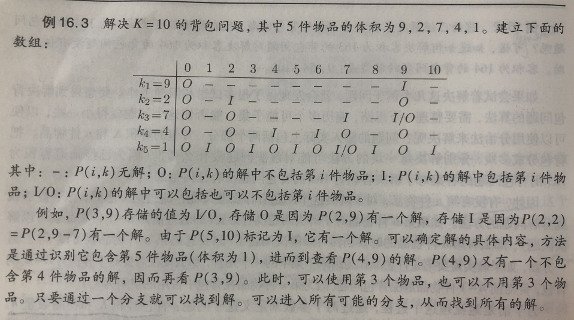

即：数组中的一个新槽是通过其前一行的两个槽来计算他的解，由于填充数组中每个槽需要花费的时间是一个常数，算法的总代价就是O(nK)。


### 全局最短路径

考虑找到图中所有结点间最短距离的问题，这称为全局最短路径问题（all-pairs shortest-paths）。准确的说，对于每一个u,v属于V，计算d(u, v)。

一种方法是运行Dijkstra算法|V|次，每次从不同的起点计算最短路径。

另一种方法是Floy算法，就是不管有多少条边，把处理时间限制到O(|V|^3^)。解决全局最短路径问题的核心在于合理组织可能结果集的搜索过程，以便不需要重复解决相同的子问题。利用k-path方法进行组织，k-path定义为从顶点v到顶点u的任意路径，路径中的中间节点数不会超过k。0-path就是从顶点v到顶点u直接的边。

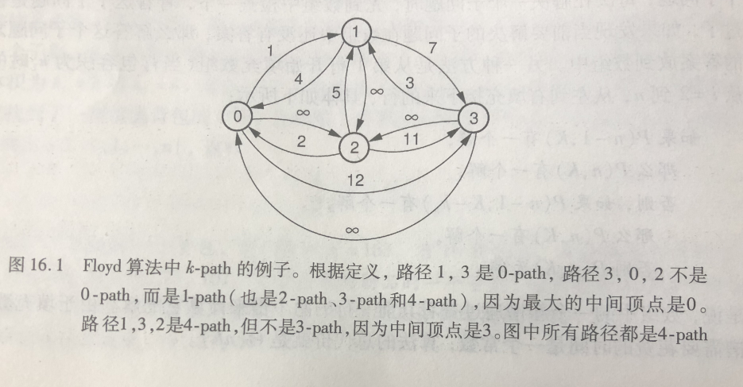


把D~k~(v, u)定义为从顶点v到顶点u的最短k-path长度。假定已经知道从顶点v到顶点u的最短k-path，那么最短（k+1）-path要么通过顶点k，要么不通过。如果通过顶点k，那么（k+1）-path的最佳路径就是从顶点v到顶点k的最佳k-path，接上从顶点k到顶点u的最佳k-path。否则，前面就应该已经看到k-path了。Floyd算法仅仅在一个**三角循环**中检查所有可能性。

```c++
// store the pair-wise distances in D
void Floyd(Graph* G) {
    for(int i = 0; i < G->n(); i++)
        for(int j = 0; j < G->n(); j++)
            if(G->weight(i, j) != 0)
                D[i][j] = G->weight(i, j);
    for(int k=0; k < G->n(); k++)
        for(int i=0; i < G->n(); i++)
            for(int j = 0; j < G->n(); j++)
                if(D[i][j] > D[i][k] + D[k][j])
                    D[i][j] = D[i][k] + D[k][j];
}
```

对于稠密图来说，他是最佳选择，相对来说比较快，也比较容易实现。


### 最大子数组问题

给定由n个整数（可能有负整数）组成的序列 (a1 , a2 , …, an )，最大子段和问题要求该序列的一个子序列的和的最大值，当序列中所有整数均为负整数时，其最大子段和为0。

定义子问题：

- 该问题输入的是⼀个有n 个元素的序列A，不妨设P(i) 为直到第i个元素的最大和

猜测部分解：

- 子问题`P(i)`的解包括第i个元素，此时有`P(i)=P(i-1)+A[i]`
- 子问题`P(i)`的解不包括第i个元素，意味着需要从第i个元素开始重新计算值，即`P(i)=A[i]`

建立各个子问题的动态规划函数：

`p(i) = max{p(i-1)+A[i], A[i]}`，初始`p(0) = 0`

编码求解之后，P数组中的最大值即为最大子数组的和。

```python
# 只需要求最大和
def Dynamic_programming(A):
    n = len(A)
    max_sum = -float('inf')
    sum = A[0]
    for i in range(1, n):
        sum = max(A[i], sum + A[i])
        max_sum = max(sum, max_sum)
    print(max_sum)

# 求左右下标
def Dynamic_programming_update(A):
    n = len(A)
    max_sum = -float('inf')
    sum = A[0]
    l = 0
    h = 0
    for i in range(1, n):
        if sum+A[i] >= A[i]:
            h = i
            sum = sum + A[i]
        else:
            l = i
            h = i
            sum = A[i]
        if sum > max_sum:
            max_sum = sum
            low = l
            high = h
    print(max_sum, low, high)
```


### 最长公共子序列

对给定序列X=(x1 , x2 ,…, xm)和序列Z=(z1 , z2 ,…,  zk )，Z是X的子序列当且仅当存在一个递增下标序列 (i1 , i2 ,…, ik )，使得对于所有j=1, 2, …, k，有（1≤i，j≤m）。

给定两个序列X和Y，当序列Z既是X的子序列又 是Y的子序列时，称Z是序列X和Y的公共子序列。最长公共子序列问题就是在序列X和Y中查找最长的公共子序列。 Longest-common-subsequence:LCS

定义子问题：

- 给定序列𝑋 =< 𝑥1, 𝑥2, … , 𝑥𝑚 >和𝑌 =< 𝑦1, 𝑦2, … , 𝑦𝑛 >，考虑 X和Y的前缀，定义C[i, j]为𝑋𝑖 =< 𝑥1, 𝑥2, … , 𝑥𝑖 >与𝑌𝑗 =< 𝑦1, 𝑦2, … , 𝑦𝑗 >的最长公共子序列的长度。于是，C[m, n]就是X和Y的最长公共子序列的长度。

刻画最优子结构：

- 设X=x~1~x~2~…x~m~和Y=y~1~y~2~…y~n~是两个序列，Z~k~ =z~1~z~2~…z~k~是这两个序列的一个最长公共子序列。 
- 1.如果x~m~=y~n~，那么z~k~=x~m~=y~n~，且Z~k-1~是X~m-1~，Y~n-1~的一个最长公共子序列； 
- 2.如果x~m~≠y~n~，那么Z~k~是X~m-1~，Y~n~的一个最长公共子序列或者Z~k~是X~m~，Y~n-1~的一个最长公共子序列。
- 从上面三种情况可以看出，两个序列的LCS包含两个序列的前缀的LCS。因此，LCS问题具有最优子结构特征。

给出动态规划函数：

- 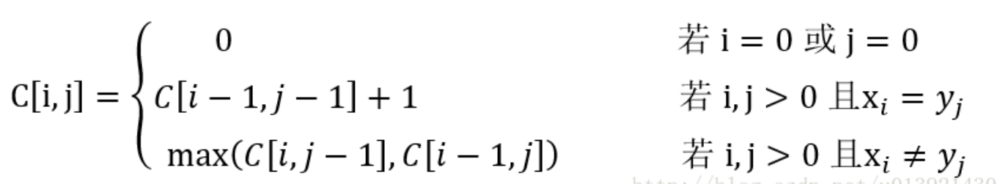

自底向上的求解递归式：

```python
LCS-LENGTH(X, Y):
    m = X.length
    n = Y.length
    let b[1..m, 1..n] and c[0..m, 0..n] be new tables
    for i = 1 to m:
        c[i, 0] = 0
    for j = 0 to n:
        c[0, j] = 0
    for i = 1 to m:
        for j = 1 to n:
            if X[i] == Y[j]:
                c[i, j] = c[i-1, j-1] + 1
                b[i, j] = "左上箭头"
            elseif c[i-1, j] >= c[i, j-1]:
                c[i, j] = c[i, j-1]
                b[i, j] = "向上箭头"
            else:
                c[i, j] = c[i, j-1]
                b[i, j] = "向左箭头"
	return c and b
```

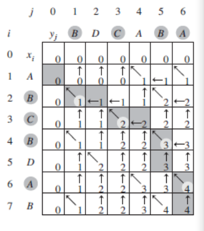

打印函数：

```python
PRINT-LCS(b, X, i, j):
    if i == 0 or j == 0:
        return 
    if b[i, j] == "向左箭头":
        PRINT-LCS(b, X, i-1, j-1)
        print X[i]
    elseif b[i, j] == "向上箭头":
        PRINT-LCS(b, X, i-1, j)
    else:
        PRINT-LCE(b, X, i, j-1)
```


### 01背包问题

假设有n个物品，每个物品i的价值为vi，大小为si。包的容量为S，要求从这n个物品中挑选若干物品装进包中，在所有装进包中物品的大小小于等于包容量S的前提下，包中物品总价值最大

定义子问题：

- 可以定义子问题从物品0，…… ，i-1，i中选取若干物品置于包中，这些物品的重量(容量)为X，且获取了最佳收益。
- 假设该子问题可以经由策略Knapsack来求解，该策略此时的输入参数为Knapsack(i，X)。

刻画最优子结构：

- 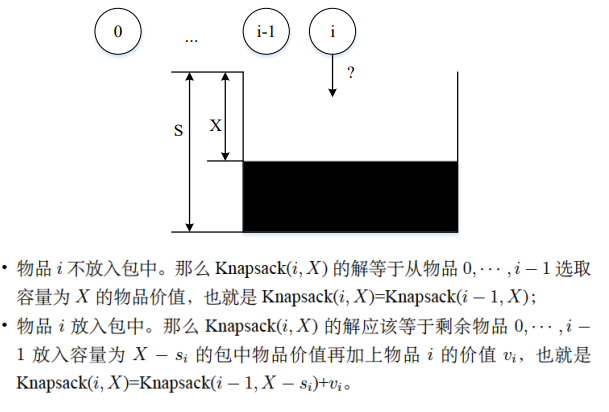

建立各个子问题之间的递归关系：X剩余的容量，w

- X < s~i~时， Knapsack(i, X)=Knapsack(i-1, X)
- X >= s~i~时，Knapsack(i, X)=max{Knapsack(i-1, X-s~i~)+v~i~ , Knapsack(i-1, X)}

自底向上求解递归式，填表：

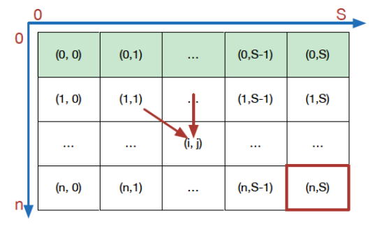

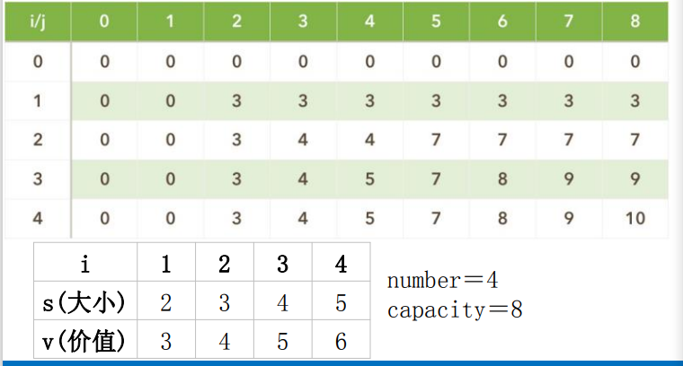


回溯得到结果：

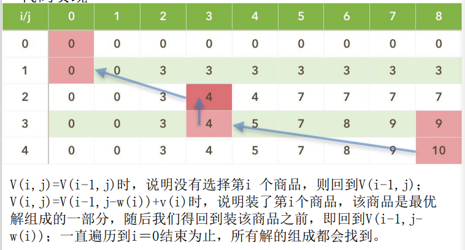


## 贪心算法

### 引出

什么是贪心算法：

- 顾名思义，贪心算法或贪心思想采用贪心的策略，保证每次操作都是局部最优的，从而使最后得到的结果是全局最优的。找到一个比较的区间，然后找出区间最优解

贪心算法存在的问题：

- 不能保证求得的最后解是最佳的；
- 不能用来求最大或最小解问题；
- 只能求满足某些约束条件的可行解的范围。

贪心算法一般流程

- 评价最优条件是什么？
- 循环 -> 未解决问题 && 还有解
- 从可能的解中取出最优解
- 执行最优解
- 缩小问题规模 -> 双指针， for循环 ，减去最优解…


### 一般步骤

①确定问题的最优子结构 

②基于问题的最优子结构设计一个递归算法 

③证明我们做出的贪心选择，只剩下一个子问题 

④证明贪心选择总是安全的 

⑤递归算法实现贪心策略 

⑥将贪心算法转化为迭代算法

**贪心算法的两个重要的性质：** 

- 贪心选择性质 
- 最优子结构性质


### 贪心与动态规划比较

动态规划算法 

1. 动态规划算法通常以自底向上的方式解各子问题，全局最优解中一定包含某个局部最优解，但不一定包含前一个局部最优解，因此需要记录之前的所有最优解 
2. 动态规划的关键是状态转移方程，即如何由以求出的局部最优解来推导全局最优解 
3. 边界条件：即最简单的，可以直接得出的局部最优解。 

贪心算法 

1. 而贪心算法则通常以自顶向下的方式进行，以迭代的方式作出相继的贪心选择，每做一次贪心选择就将所求问题简化为规模更小的子问题。 
2. 贪心算法中，作出的每步贪心决策都无法改变，因为贪心策略是由上一步的最优解推导下一步的最优解，而上一步之前的最优解则不作保留。


### 活动选择问题

假设我们存在这样一个活动集合 S={a1,a2,a3,a4,...,an},其中每一个活动a~i~都有一个开始时间s~i~和结束时间f~i~保证(0≤s~i~<f~i~)，活动a~i~进行时，那么它占用的时间为[s~i~, f~i~)。现在这些活动占用一个共同的资源教室，如果两个活动时间占用的时间不重叠，则说明两个活动是兼容的。在活动选择问题中，我们希望选出一个最大兼容活动集，即在同一间教室能安排数量最多的活动。


三种策略：

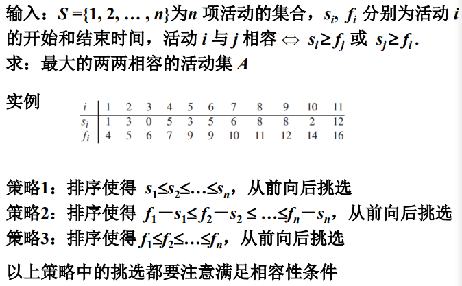

选择的贪心策略：

**选择最早结束的活动**。直观上认为每次选择最早结束的活动，后面的活动可选的时间就越充裕。

```python
GREED-ACTIVITY-SELECTOR(s, f):
    n = s.length
    A = {a1}
    k = 1
    for m = 2 to n:
        if s[m] >= f[k]:
            A = A 并 {am}
            k = m
    return A
# 注意这里已经根据策略三排好序了，是按照结束时间排好序了的，所以只需要简单比较一下开始时间是不是大于当前活动的结束时间即可
```


### 分数背包问题

设定与0-1背包一样，但是对每个商品，小偷可以只拿走其一部分，而不是只能做出二元(0-1)选择。可以把0-1背包问题中的商品看做品质不一大小不同的金块，而分数背包问题中的商品更像是金砂。


三种贪心策略：

- 选择价值最大的物品
- 选择重量最轻的物品
- 选择单位重量价值最大的物品

分析应该选择第三种


```python
#伪代码
1 改变数组w和v的排列顺序，使其按单位重量价值v[i]/w[i]降序排序
2 将数组x[n]初始化为0
3 i = 1
4 循环直到w[i] > C #当剩余容量还充足时
	4.1 将第i个物品放入背包，x[i] = 1;
    4.2 C = C - w[i]
    4.3 i++
5 x[i] = C/w[i]   #最后物品i可能只能装入一部分，或者没有
```


### 多机调度问题

设有n个独立的作业{1, 2, …, n}，由m台相同的机器{M1 , M2 , …, Mm}进行加工处理，作业i所需的处理时间为t~i~（1≤i≤n），每个作业均可在任何一台机器上加工处理，但不可间断、拆分。多机调度问题要求给出一种作业调度方案，使所给的n个作业在尽可能短的时间内由m台机器加工处理完成。


贪心策略：

贪心法求解多机调度问题的贪心策略是**最长处理时间作业优先**，即把处理时间最长的作业分配给最先空闲的机器，这样可以保证处理时间长的作业优先处理，从而在整体上获得尽可能短的处理时间。

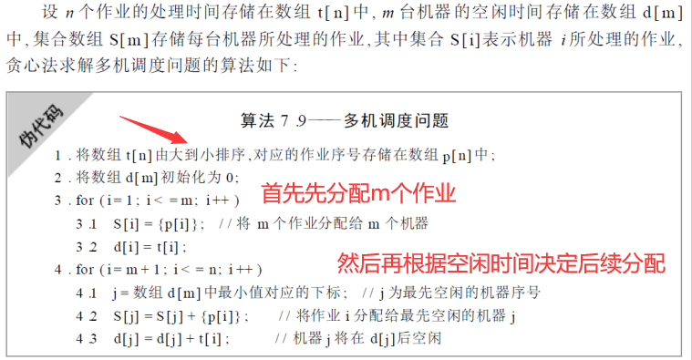


实例：

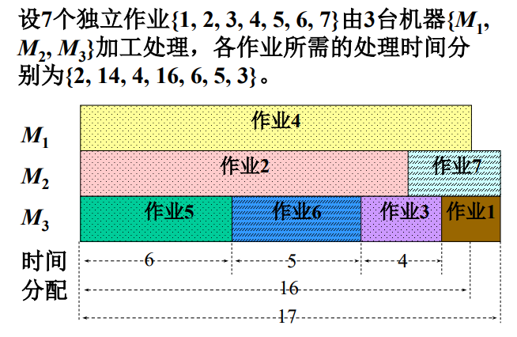


### 哈夫曼树编码

看树一节即可，典型的贪心策略


## 计算复杂度理论

不是很懂意思

### P类、EXP类和R类问题

- P类：在多项式时间可解的判定问题类（O(n^k^)）
  - 最短路径问题 
- EXP类：在指数级时间可解的判定问题类
  - 围棋问题 
- R类：在有限的时间里可解的判定问题类，即计算机可解的问题

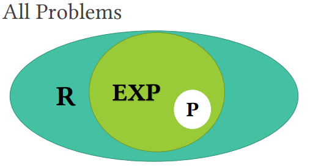

### NP类问题

每个解可以在多项式时间进行检查的判定问题类，但是到目前还没有找到多项式时间的确定型算法

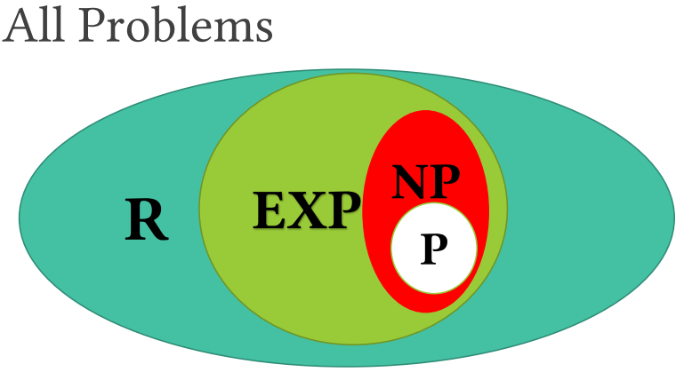

### NP-hard类和NP-complete问题

NP-hard类：所有不比NP类问题容易的问题

NP-complete类：NP问题 ∩ 𝑁𝑃 − hard

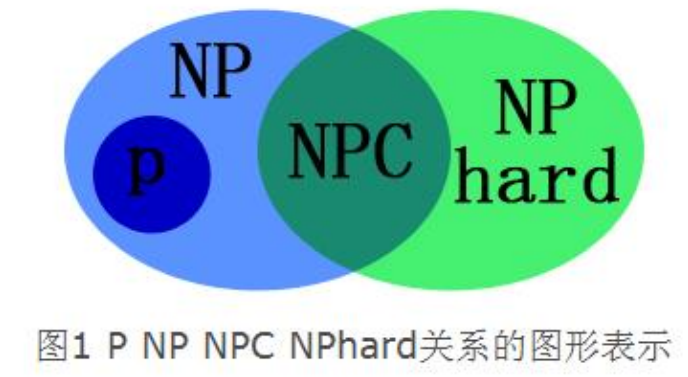