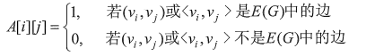
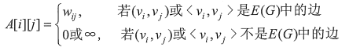
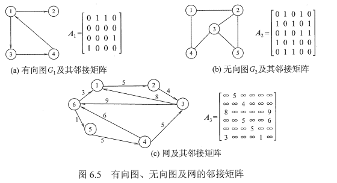
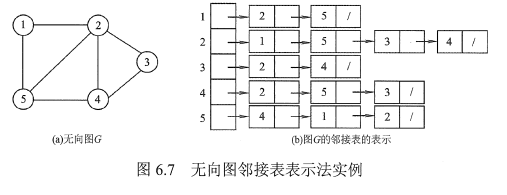
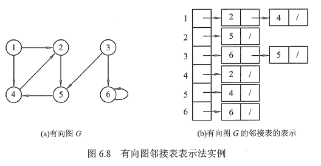
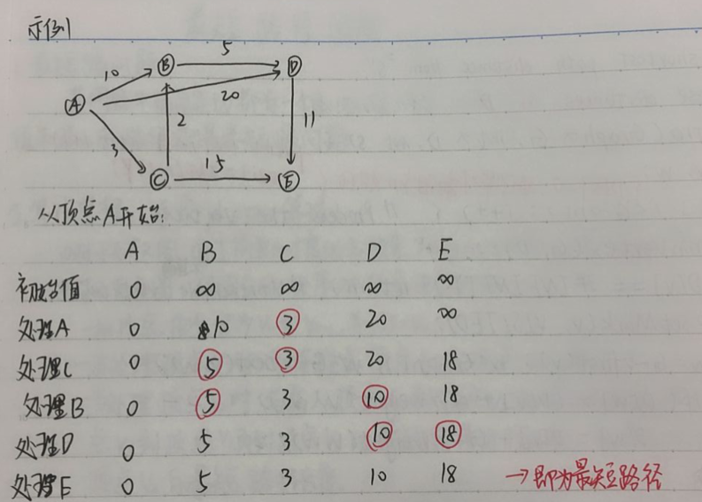
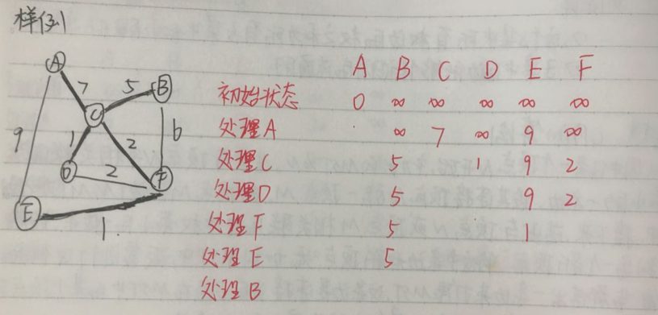
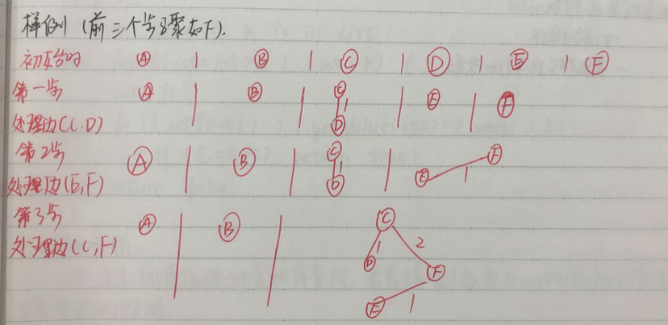

# 图

## 基本概念

### 图定义

图可以用`G=(V, E)`来表示，每个图都包括一个顶点集(vertices)V，和一个边集合E，其中E中的每条边都是V中某一对顶点之间的连接


### 术语

邻接点：一条边所连接的两个顶点是相邻的

无向边：无序顶点对（u, v）

有向边：有序顶点对<u, v>

有向图：图中的边是有向边

无向图：图中的边是无向边

带权图：边上都有权值

简单图：不存在重复边，不存在自旋边

多重图：允许重复边和自旋边

完全图（简单完全图）：无向图任意两点之间都存在边，有向图任意两个顶点之间都存在方向相反的两条弧

连通图：任意两点之间都有路径存在，即连通，无向图中的极大连通子图（极大要求连通子图包含所有边）称为连通分量，连通针对两个点来说。

强连通图：在有向图中，若从顶点v到顶点w和从顶点w到顶点v之间都有路径，则称这两个顶点是强连通的。若图中任何一对顶点都是强连通的，则称此图为强连通图。有向图中的极大强连通子图称为有向图的强连通分量。

生成树：连通图的生成树是包含图中全部顶点的一个极小连通子图。

生成森林：非连通图中，连通分量的生成树构成了非连通图的生成森林

简单路径：在路径序列中，顶点不重复出现的路径


## 图的物理实现

### 邻接矩阵法

> 定义

也称相邻矩阵表示法和二维数组表示法

图的顶点元素是一个|V|的顺序表

图的相邻矩阵是一个|V|*|V|的矩阵

对于无权图：



对于带权图：




> 实例




> 特点

- 邻接矩阵需要存储所有边，不管边存不存在
- 邻接矩阵的空间代价至于顶点个数有关，为O(n^2^)，图越密集，空间效率越高
- 基于邻接矩阵的图算法，必须查看他的所有可能的边，导致时间代价为O(^2^)，是和密集图存储
- 设图G的邻接矩阵为A，A^n^的元素A^n^[i] [j]等于由顶点i到顶点j的长度为n的路径的数目。


### 邻接表法

> 定义

邻接表是一个包含|V|个元素的顺序表

每个元素包含两个域，一个存储图的顶点信息，另一个是指针，指向该顶点的边构成的链表

这个链表通过存储顶点的邻接点来表示对应的边，链表中每个结点存储顶点的邻接点在顺序表中的位置

如果要存储边的权值，则链表中的结点需要增加一个数据域，来记录权值或者存储一个指向权值存储位置的指针


> 实例






> 特点

邻接表的空间代价与图中的边和顶点数目都有关系，每个顶点都要一个数组元素的位置，而每条边必须出现在其中某个顶点的链表中，所以邻接表的空间代价为O(|V|+|E|)

仅存储实际的边，没有空间浪费，但是存在结构性开销，图越稀疏，其空间效率越高

基于邻接表的图算法，需要查看每个顶点和于其相邻的实际的边，所以总时间复杂度为O(|V|+|E|)，适合稀疏图


## 图的遍历算法

### 广度优先搜索BFS

> 算法思想

从图中的某个顶点V~0~出发，并在访问此顶点后依次访问他的所有未被访问过的邻接点，之后按这些顶点被访问的先后顺序依次访问他们的邻接点直至图中所有V~0~有路径相通的顶点都被访问到。


> 算法步骤

- 首先创建一个队列，如图非空，将顶点V~0~放入队列中，并设置顶点V~0~已访问
- 从队列中取出一个顶点，并依次访问该顶点的所有邻接点，如果该邻接点未被访问，则将该邻接点放入队列中，并设置其已访问
- 若队列非空，继续第二步，直至队列为空，则遍历过程结束


> 伪代码

```c++
void BFS(Graph * G, int start, Queue<int> * Q)) {
    int v, w;
    Q->enqueue(start);
    G->setMark(start, VISITED);
    while(Q->length() != 0) {
        Q->dequeue(v);
        preVisit(v);  // take action
        for(w=G->first(v); w<G->n(); w=G->next(v, w))
            if(G->getMark(w) == UNVISITED) {
                g->setMark(w, VISITED);
                Q->enqueue(w);
            }
    }
}
```


> 算法分析

在有向图中，BFS对每一条边处理一次，在无向图中，BFS对每条边都要两个方向处理一次，每个顶点一定会被访问到，而且只访问一次，所以总代价为O(|V| + |E|)


### 深度优先搜索DFS

> 算法思想

从图中某个顶点V~0~出发，访问此顶点，然后依次从该顶点的各个未被访问的邻接点出发深度优先搜索遍历图，直至图中所有和V~0~有路径相通的顶点都被访问到。


> 伪代码

```c++
void DFS(Graph * G, int v) {
    preVisit(G, v);
    G->setMark(v, VISITED);
    for(int w=G->first(v); w<g->n(); w=G->next(v, w))
        if(G->getMark(w) == UNVISITED)
            DFS(G, w);
    postVisit(G, v);
}
```


> 算法分析

在有向图中，DFS对每一条边处理一次，在无向图中，DFS对每一条边都要从两个方向处理一次，每个顶点一定会被访问到，而且只能访问一次，所以总代价为O(|V| + |E|)；


## 拓扑排序

### 问题概述

> 问题描述

给定一组有先决条件约束的工作等，希望以某种线性顺序组织这些任务，且不违反任何先决条件


> 抽象数据类型设计选择

可以用一个有向无环图（DAG）来模拟这个问题。任何任务之间存在先决条件关系，即顶点之间有方向性，因此图是有方向的，图又需要是无回路的，因为回路中隐含了相互冲突的条件，从而使某些条件不可能在不违反任何先决条件的情况下得到实现


> 定义

将一个DAG中所有顶点在不违反先决条件规定的基础上排成线性序列的过程称为拓扑排序


### 实现方法

#### 基于深度优先

> 算法思想

通过对图进行深度优先搜索，当访问某个顶点时，不对这个顶点进行任何处理（即函数preVisit什么也不做），当递归返回到这个顶点时，函数postVisit打印这个顶点，这就会产生一个逆拓扑序列，序列从哪个顶点开始并不重要，只要所有顶点最终均被访问到


> 代码

```c++
void topsort(Gragh * G) {
    int i;
    for(i=0; i < G->n(); i++)
        G->setMark(i, UNVISITED);
    for(i=0; i < G->n(); i++)  // 防止不是连通图
        if(G->getMark(i) == UNVISITED)
            tophelp(G, i);
}

void tophelp(Graph * G, int v) {
    G->setMark(v, VISITED);
    for(int w=G->first(v); w<G->n(); w=G->next(v, w))
        if(g->getMark(w) == UNVISITED)
            tophelp(G, w);
    printout(v);
}
```


#### 基于广度优先

> 算法思想

首先访问所有的边，计算指向每个顶点的边数（即计算每个顶点的前置条件数目），将所有没有前置条件的顶点放入队列中，然后开始处理队列，当从队列中取出一个顶点时，把它打印出来，同时将其所有的相邻顶点（那些以V作为前置条件的顶点）的前置条件计数减1，当某个相邻的前置条件计数为0时，就将其放入队列，如果还有顶点未被打印，而队列已经为空，则图中必定含有回路


> 代码

```c++
void topsort(Gragh* G, Queue<int> *Q) {
    int count[G->n()];
    int v, w;
    // 完成初始化工作
    for(v=0; v<G->n(); v++)
        count[v] = 0;
    for(v=0; v<G->n(); v++)
        for(w=G->first(); w<G->n(); w=G->next(v, w))
            count[w]++;
    for(v=0; v<G->N(); v++)
        if(count[v] == 0)
            Q->enqueue(v);
    while(Q->length() != 0) {
        v=Q->dequeue();
        printout(v);
        for(w=G->first(); w<G->n(); w=G->next(v, w)) {
            count[w]--;
            if(count[w] == 0) {
                Q->enqueue(w);
            }
        }
    }
}
```


## 最短路径问题

### 概述

> 最短路问题

若网络中的每条边都有一个权值（长度，成本，时间等），则找出两节点之间总权值和最小的路径就是最短路问题


> 最短路径问题定义

输入：每条边上标记了权或代价的图

输出：组成最短路径边的序列

功能：

- 寻找两个指定顶点之间的最短路径
- 寻找从一个顶点S到图中所有其他顶点的最短路径
- 寻找所有顶点对之间的最短路径


### 算法思想Dijkstra

> 对于无权图

通过简单的广度优先搜索就可以单源最短路径

> 对于有权图

用固定的顺序对顶点进行处理

- 把顶点依次记为V~0~到V~n-1~，并记S=V~0~
- 当处理顶点V~1~时，取连接顶点V~0~和顶点V~1~的边
- 当处理顶点V~2~时，考虑从顶点V~0~到顶点V~2~的最短距离，并把他从顶点V~0~到顶点V~1~再到顶点V~2~的最短距离进行比较，取较小者为顶点V~0~到顶点V~2~的最短距离长度
- 当处理顶点V~i~时，利用已经处理过的从顶点V~0~到顶点V~i-1~的最短路径长度

注意：顶点处理处理顺序不是存储的顺序，而是每次路径最短的顶点

具体做法：

- 为V中的所有顶点X维护一个路径长度估计值D(X)，D中元素初始化为INFINITY，并且按照从顶点S出发的所到达顶点的距离递增的顺序处理各个顶点
- 每当处理一个顶点V时，他的任意一个相邻顶点X的D(X)值都可能随之改变，在算法结束时，数组D中将包含最短路径值


> 伪代码

```c++
// compute shortest path distance from s
// return these distances in D
void Dijkstra(Gragh* G, int* D， int s) {
    int i, v, w;
    for(i=0; i<G->n(); i++)
        D[i] = INFINITY;
    D[S] = 0;
    for(i=0; i<G->n(); i++) {
    	v = minVertex(G, D);  // 获取当前路径最小的顶点
        if(D[v] == INFINITY)  // 不连通
            return;
        G->setMark(v, VISITED);
        for(w=G->first(); w<G->N(); w=G->next(v, w))  // 更新邻居顶点
            if(D[w] > (D[v] + G->weight(v, w)))
                D[w] = D[v] + G->weight(v, w);
    }
}

// 寻找未访问的当前路径最短的顶点
int minVertex(Gragh* G, int* D) {
    int i, v=-1;
    for(i=0; i<G->n(); i++)
        if(G->getMark(i) == UNVISITED) {
            v = i;
            break;
        }
    for(i++; i<G->n(); i++)
        if((G->getMark(i) == UNVISITED) && (D[i] < D[v]))
            v = i;
    return v;
}
```

### 效率分析

因为扫描需要进行|V|次，而且每条边需要相同次数来更新D值，所以总时间代价为O(|V|^2^+|E|)=O(|V|^2^)




## 最小支撑数MST（最小生成树）

### 问题定义

输入：一个连通无向图G，且每条边均有权值

输出：图G的子图，包括图中的所有顶点及其一部分边的图，且边满足下列条件：

这个子集所有边的权之和未所有子集中最小的

子集中的边能够保证图的连通性


### Prim算法

> 算法思想

从图中任意一点顶点N开始，初始的MST为N~0~，选出与顶点N相关联的边中权最小的一条边，设其连接顶点N与另一顶点M~0~把顶点M和边（N，M）加入到MST中，接下来，选出与顶点N或顶点M相关联的边中权最小的一条边，设置连接到一个新顶点，将这条边和新顶点加入到MST中，反复进行这样的处理，每一步都选出一条边来扩展MST，这条边是连接当前已经在MST中的某个顶点与一个不在MST中的顶点组成的边集合中代价最小的那条边。


> 伪代码

```c++
void prim(Graph * G, int* D, int s) {
    int V[G->n()];   // store closest vertex
    int i, w;
    for(i=0; i<G->n(); i++)
        D[i] = INFINITY;
    D[s] = 0;
    for(i=0; i<G->n(); i++) {
        int v = minVertex(G, D);
        G->setMark(v, VISITED);
        if(v != s)
            addEdgeToMST(V[v], v);  // add edge to MST
        if(D[v] == INFINITY)    // unreachable vertices
            return; 
        for(w=G->first(v); w<G->n(); w=G->next(v, w))
            if(D[w] > G->weight(v, w)) {
                D[w] = G->weight(v, w);    // update distance
                V[w] = v;   // where it come from
            }
    }
}
```


> 算法分析

关键问题是找到下一个最近的顶点

顺序查找：O(|V|^2^+|E|) = O(|V|^2^)

适用于稠密图


> 例子




### Kruskal算法

> 算法思想

首先将顶点集合分为|V|个等价类，每个等价类中包括一个顶点，然后按照权的大小顺序处理一条边，如果一条边连接输入两个不同的等价类的顶点，则把这条边添加到MST中，并把这个两个等价类合并为一个等价类，反复执行这个过程，直到最后剩下一个等价类

用最小堆来实现按照权的大小顺序处理每一条边

用基于父指针表示法的并查集（UNION/FIND）算法来确定两个顶点是否属于同一等价类


> 算法分析

Kruskal算法的代价按权处理各条边所需要的时间确定，如果使用了路径压缩，则UNION函数的开销几乎是常数

因此，最差情况下，即几乎所有边都会在找到生成树和算法终止前被处理，算法总时间复杂度O(|E|log|E|)

再更一般的情况下，生成树的边都是较短的边，只有近似于|V|条边需要处理，代价更接近于O(|V|log|E|)


> 样例


