# 其他树结构

## B树

### 定义

B树，又称多路平衡查找树，B树中所有节点的孩子个数的最大值称为B树的阶，通常用m表示一颗m阶B树或为空树，或为满足如下特性的m叉树：

- 树中每个结点**至多有m棵子树**，即至多含有m-1个关键字

- 若根节点不是终端结点，则至少有两棵子树

- 除根节点外的所有非叶节点**至少有m/2（取上限）棵子树**

- 所有非叶节点的结构如下：

  ​	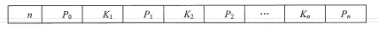

  ​	k为关键字，递增顺序，p为指向子树根的指针，n为节点中关键字的个数

- 所有叶节点出现在同一层次，并且不带信息。代表查找失败的位置。

B树的所有节点的平衡因子都为0

实例--五阶B树

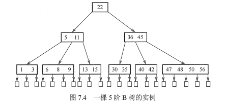

### B树高度

首先明确：B树高度不包括最后叶节点的一层

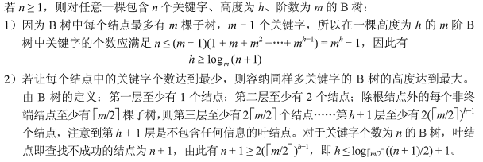

### B树查找

在B树上进行查找与二叉查找树很相似，只是每个结点都是多个关键字的有序表，在每个结点上所做的不是两路分支决定，而是根据该结点的子树所做的多路分支决定。

B树的查找包含两个基本操作:①在B树中找结点;②在结点内找关键字。由于B树常存储在磁盘上，因此前一个查找操作是在磁盘上进行的，而后一个查找操作是在内存中进行的，即在找到目标结点后，先将结点信息读入内存，然后在结点内采用顺序查找法或折半查找法。

在B树上查找到某个结点后，先在有序表中进行查找，若找到则查找成功，否则按照对应的指针信息到所指的子树中去查找（例如，在图7.4中查找关键字42，首先从根结点开始，根结点只有一个关键字，且42>22，若存在，必在关键字22的右边子树上，右孩子结点有两个关键字，而36<42<45，则若存在，必在36和45中间的子树上，在该子结点中查到关键字42，查找成功)。查找到叶结点时（对应指针为空指针)，则说明树中没有对应的关键字，查找失败。

### B树插入

_注意m/2均要取上界_

与二叉查找树的插入操作相比，B树的插入操作要复杂得多。在二叉查找树中，仅需查找到需插入的终端结点的位置。但是，在B树中找到插入的位置后，并不能简单地将其添加到终端结点中，因为此时可能会导致整棵树不再满足B树定义中的要求。将关键字key插入B树的过程如下:

- 定位。利用前述的B树查找算法，找出插入该关键字的最低层中的某个非叶结点（在B树中查找key时，会找到表示查找失败的叶结点，这样就确定了最底层非叶结点的插入位置。注意:插入位置一定是最低层中的某个非叶结点)。
- 插入。在B树中，每个非失败结点的关键字个数都在区间[m/2-1, m-1]内。插入后的结点关键字个数小于m，可以直接插入;插入后检查被插入结点内关键字的个数，当插入后的结点关键字个数大于m-1时，必须对结点进行**分裂**。

分裂的方法是:取一个新结点，在插入 key后的原结点，**从中间位置(m/2)将其中的关键字分为两部分**，左部分包含的关键字放在原结点中，右部分包含的关键字放到新结点中，中间位置(m/2)的结点插入原结点的父结点。若此时导致其父结点的关键字个数也超过了上限，则继续进行这种分裂操作，直至这个过程传到根结点为止，进而导致B树高度增1。

对于m = 3的B树，所有结点中最多有m-1= 2个关键字，若某结点中已有两个关键字，则结点已满。插入一个关键字60后，结点内的关键字个数超过了m-1，此时必须进行结点分裂。

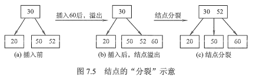

### B树删除

B树中的删除操作与插入操作类似，但要稍微复杂一些，即要使得删除后的结点中的关键字个数≥m/2-1，因此将涉及结点的“合并”问题。

当被删关键字k不在终端结点（最低层非叶结点〉中时，可以用k的**前驱（或后继）**k'来替代k，然后在相应的结点中删除k，关键字k必定落在某个终端结点中，则转换成了被删关键字在终端结点中的情形。在下图中的4阶B树中，删除关键字80，用其前驱78替代，然后在终端结点中删除78。因此只需讨论删除终端结点中关键字的情形。（**最后总会转换成终端节点的删除**）

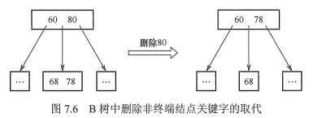

当被删关键字在终端结点（最低层非叶结点〉中时，有下列三种情况:

1)直接删除关键字。若被删除关键字所在结点的关键字个数≥lm/2]，表明删除该关键字后仍满足B树的定义，则直接删去该关键字。

2）兄弟够借。若被删除关键字所在结点删除前的关键字个数=m/2-1，且与此结点相邻的右（或左）兄弟结点的关键字个数≥m/2，则需要调整该结点、右(或左）兄弟结点及其双亲结点(父子换位法)，以达到新的平衡。在图中删除4阶B树的关键字65，右兄弟关键字个数 ≥m/2=2，将71取代原65的位置，将74调整到71的位置。

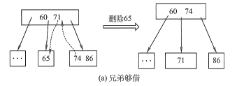

3）兄弟不够借。若被删除关键字所在结点删除前的关键字个数=m/2-1，且此时与该结点相邻的左、右兄弟结点的关键字个数均=m/2-1，则将关键字删除后与左（或右)兄弟结点及双亲结点中的关键字进行合并。在图中删除4阶B树的关键字5，它及其右兄弟结点的关键字个数=m/2-1=1，故在5删除后将60合并到65结点中。

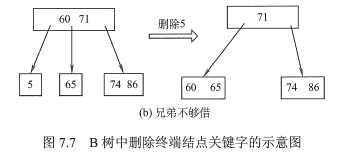

在合并过程中，双亲结点中的关键字个数会减1。若其双亲结点是根结点且关键字个数减少至0（根结点关键字个数为1时，有2棵子树)，则直接将根结点删除，合并后的新结点成为根;若双亲结点不是根结点，且关键字个数减少到m/2-2，则又要与它自己的兄弟结点进行调整或合并操作，并重复上述步骤，直至符合B树的要求为止。

## B+树

_m/2均取上界_

### 定义

B+树是应数据库所需而出现的一种B树的变形树

一棵m阶的B+树需满足下列条件:

- 每个分支结点最多有m棵子树（孩子结点)。
- 非叶根结点至少有两棵子树，其他每个分支结点至少有m/2棵子树。
- **结点的子树个数与关键字个数相等**。
- **所有叶结点包含全部关键字及指向相应记录的指针**，叶结点中将关键字按大小顺序排列，并且**相邻叶结点按大小顺序相互链接起来**。
- 所有**分支结点（可视为索引的索引**）中仅包含它的各个子结点（即下一级的索引块）中关键字的最大值及指向其子结点的指针。

m阶的B+树与m阶的B树的主要差异如下:

1. 在B+树中，具有n个关键字的结点只含有n棵子树，即每个关键字对应一棵子树;而在B树中，具有n个关键字的结点含有n+1棵子树。
2. 在B+树中，每个结点（非根内部结点）的关键字个数n的范围m/2≤n≤m(根结点:1≤n≤m)。在B树中，每个结点（非根内部结点)的关键字个数n的范围是m/2-1≤n≤m-1(根结点: 1≤n≤m- 1)。
3. 在B+树中，叶结点包含信息，所有非叶结点仅起索引作用，非叶结点中的每个索引项只含有对应子树的最大关键字和指向该子树的指针，不含有该关键字对应记录的存储地址。
4. 在B+树中，**叶结点包含了全部关键字**，即在非叶结点中出现的关键字也会出现在叶结点中;而在B树中，叶结点包含的关键字和其他结点包含的关键字是**不重复**的。

### B+树查找

图为一棵4阶B+树。可以看出，分支结点的某个关键字是其子树中最大关键字的副本。通常在B+树中有两个头指针:一个指向根结点，另一个指向关键字最小的叶结点。因此，可以对B+树进行两种查找运算:一种是从最小关键字开始的顺序查找，另一种是从根结点开始的多路查找。

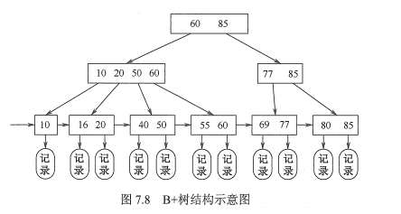

B+树的查找、插入和删除操作和B树的基本类似。只是在查找过程中，非叶结点上的关键字值等于给定值时并不终止，而是继续向下查找，直到叶结点上的该关键字为止。所以，在 B+树中查找时，无论查找成功与否，每次查找都是一条从根结点到叶结点的路径。

## B-树应用

B树大量应用在数据库（索引结构）和文件系统当中。

它的设计思想是，将相关数据尽量集中在一起，以便一次读取多个数据，减少硬盘操作次数。B树算法减少定位记录时所经历的中间过程，从而加快存取速度。

假定一个节点可以容纳100个值，那么3层的B树可以容纳100万个数据，如果换成二叉查找树，则需要20层！假定操作系统一次读取一个节点，并且根节点保留在内存中，那么B树在100万个数据中查找目标值，只需要读取两次硬盘。

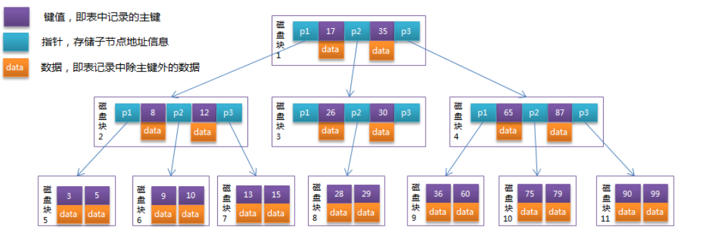

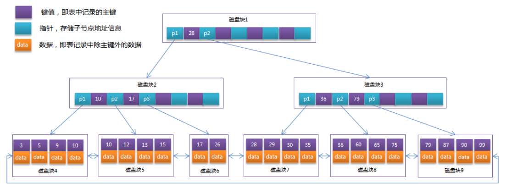

## 2-3-4树

2-3-4树是**阶数**为4的B树，B树，全名BalanceTree，平衡树。这种结构主要用来做查找。

由于2-3-4树是一颗阶数为4的B树，所以它会存在以下节点：

- 二节点
  - 一个key和左右两个链接；其中key大于左链接、小于右链接
- 三节点
  - 包含两个key和三个链接（两个key分别称为key1和key2，key1小于key2）
  - 1、2、3三个子链接（子链接1的key小于根结点key1、子链接2的key大于根结点key1且小于根结点key2、子链接3的key大于根结点key2）
- 四节点
  - 包含三个key和四个子链接（三个key分别为key1、key2、key3且从小到大排列）
  - 1、2、3、4三个子链接（子链接1的key小于根结点key1、子链接2的key大于根结点key1且小于根结点key2、子链接3的key大于根结点key2且小于根结点key3、子链接4的key大于根结点key3）

- 上述的节点计数指子链接的数量，而非节点包含的key的数量

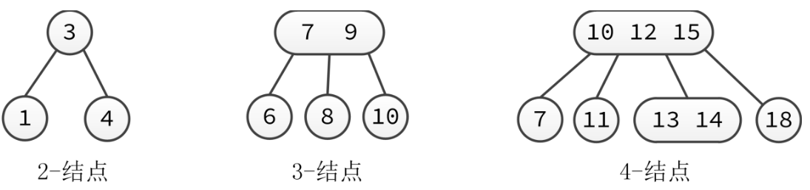

## 红黑树

### 概念

红黑树是对概念模型2-3-4树的一种实现，由于直接进行不同节点间的转化会造成较大的开销，所以选择以二叉树为基础，在二叉树的属性中加入一个**颜色属性**来表示2-3-4树中不同的节点。

2-3-4树中的2节点对应着红黑树中的黑色节点，而2-3-4树中的非2节点是以**红节点+黑节点**的方式存在，红节点的意义是与黑色父节点结合，表达着2-3-4树中的3，4节点。

转换情况：

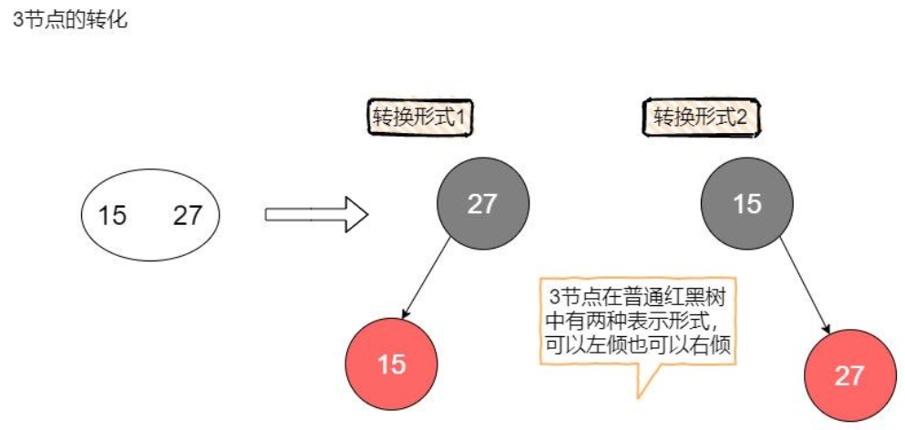

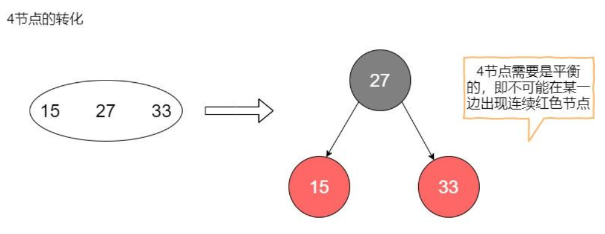

具体转换实例

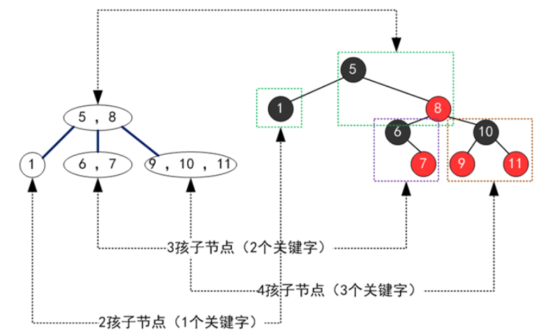

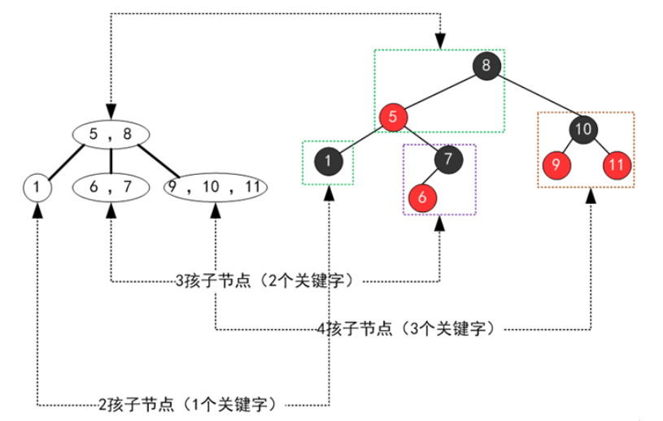

### 特性

红黑树（Red Black Tree）是一种自平衡的二叉查找树。除了符合二叉查找树的基本特性外，它还具有下列附加特性：

1.每个节点是红色或黑色。

2.根节点永远是黑色。

3.每个叶子节点都是黑色的空节点（Null节点）。

4.若一个节点是红色的，那么他的子节点必须是黑色的。(从每个叶子到根的所有路径上不能有两个连续的红色节点)

5.从任一节点到该节点的所有路径都包含相同数目的黑色节点。

这些约束强制了红黑树的关键性质: 从根节点到叶子节点的最长的可能路径不多于最短的可能路径的两倍长。

一些说明：

约束4和5，保证了红黑树的大致平衡：根到叶子的所有路径中，最长路径不会超过最短路径的2倍。

使得红黑树在最坏的情况下，也能有O(log2N)的查找效率

黑色高度为3时，最短路径：黑色→ 黑色 → 黑色，最长路径：黑色→ 红色 → 黑色→ 红色 → 黑色

最短路径的长度为2（不算Nil的叶子节点），最长路径为4

举例

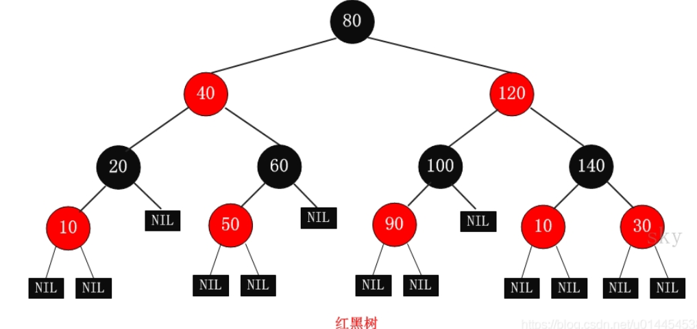

删除，插入什么的就不记录了，需要用到旋转，合并，拆分......太难了- _ - 

[这个人讲的比较基础清晰](https://zhuanlan.zhihu.com/p/273829162)

### 应用

Java中，TreeMap、TreeSet都使用红黑树作为底层数据结构

JDK1.8开始，HashMap也引入了红黑树：当冲突的链表长度超过8时，自动转为红黑树

Linux底层的CFS进程调度算法中，vruntime使用红黑树进行存储。

多路复用技术的Epoll，其核心结构是红黑树 + 双向链表。

