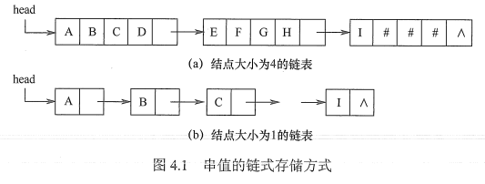
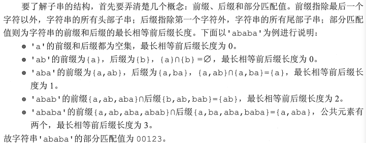
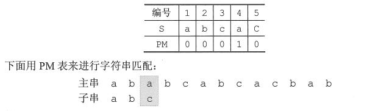
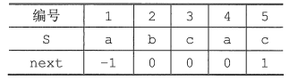
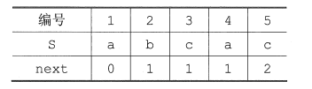
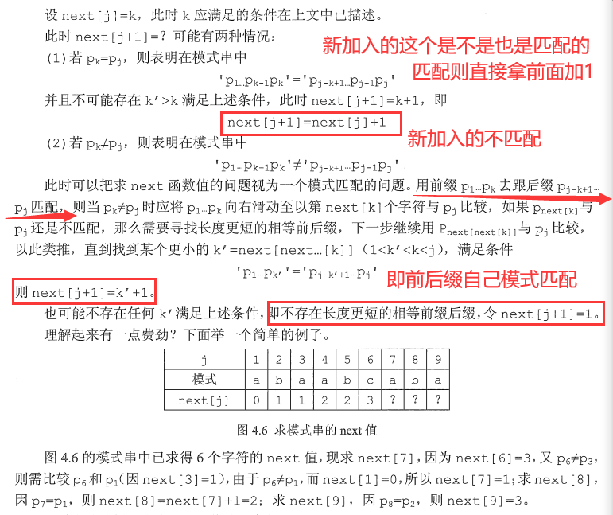
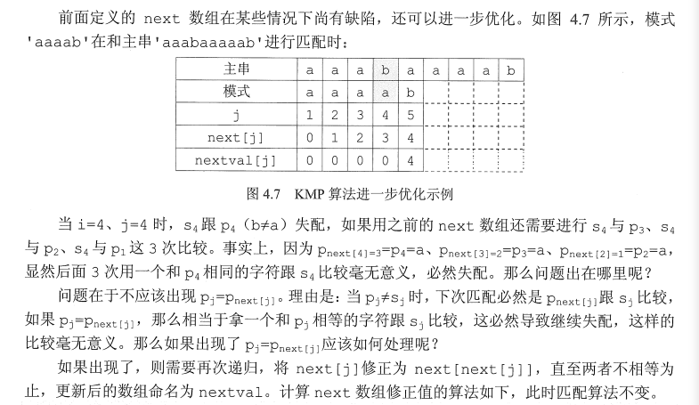

# 串

## 基本概念

串是由零个或多个字符组成的有限序列。

串中任意个连续的字符组成的子序列称为该串的子串，包含子串的串相应地称为主串。某个字符在串中的序号称为该字符在串中的位置。

子串在主串中的位置以子串的第一个字符在主串中的位置来表示。

当两个串的长度相等且每个对应位置的字符都相等时，称这两个串是相等的。


## 串的存储结构

### 定长顺序存储表示

类似于线性表的顺序存储结构，用一组地址连续的存储单元存储串值的字符序列。在串的定长顺序存储结构中，为每个串变量分配一个固定长度的存储区，即定长数组。

```c++
#define MAXLEN 255
typedef struct {
    char ch[MAXLEN];
    int length;
}SString;
```


### 堆分配存储表示

堆分配存储表示仍然以一组地址连续的存储单元存放串值的字符序列，但它们的存储空间是在程序执行过程中动态分配得到的。

```c++
typedef struct{
    char *ch;
    int length;
}HString;
```

在C语言中，存在一个称之为“堆”的自由存储区，并用malloc()和free()函数来完成动态存储管理。利用malloc()为每个新产生的串分配一块实际串长所需的存储空间，若分配成功，则返回一个指向起始地址的指针，作为串的基地址，这个串由ch指针来指示;若分配失败，则返回NULL。已分配的空间可用free()释放掉。

高级语言基本都采用前两种


### 块链存储表示

类似于线性表的链式存储结构，也可采用链表方式存储串值。由于串的特殊性（每个元素只有一个字符)，在具体实现时，每个结点既可以存放一个字符，也可以存放多个字符。每个结点称为块，整个链表称为块链结构。结点占不满时通常用“#”补上。




## 串的模式匹配

子串的定位操作通常称为串的模式匹配，求的是子串（模式串）在主串中的位置


### 暴力匹配

```c++
int Index(SString S, SString T) {
    int i = 1, j = 1;
    while(i <= S.length && j <= T.length) {
        if(S.ch[i] == T.ch[j]) {
            ++i; ++j;
        } else {  // turn back
            i = i - j + 2;
            j = 1;
        }
    }
    if(j > T.length)
        return i - T.length;
    else
        return 0;
}
// 下标从1开始
```

暴力模式匹配算法的最坏时间复杂度为O(mn)，其中n和m分别为主串和模式串的长度。


### KMP算法

> **引入**

在暴力匹配中，每趟匹配失败都是模式后移一位再从头开始比较。而某趟已匹配相等的字符序列是模式的某个前缀，这种频繁的重复比较相当于模式串在不断地进行自我比较，这就是其低效率的根源。

因此，可以从分析模式本身的结构着手，如果已匹配相等的前缀序列中有某个后缀正好是模式的前缀，那么就可以将模式向后滑动到与这些相等字符对齐的位置，主串i指针无须回溯，并继续从该位置开始进行比较。而模式向后滑动位数的计算仅与模式本身的结构有关，与主串无关。


> 字符串的前缀、后缀和部分匹配值



==结论：移动位数 = 已匹配的字符数 - 对应的部分匹配值==

KMP算法可以在O(m + n)的时间数量级上完成串的模式匹配操作。



如图，第一次不匹配时，2-0=2，所以向后移动两位，直接从第三个开始匹配。


### KMP改进

前面得到：右移位数 = 已匹配的字符数 – 对应的部分匹配值。

写成：`Move = (j-1) - PM[j-1]`。

使用部分匹配值时，每当匹配失败，就去找它前一个元素的部分匹配值，这样使用起来有些不方便，所以将PM表右移一位，这样哪个元素匹配失败，直接看它自己的部分匹配值即可。

将字符串' abcac '的PM表右移一位，就得到了next数组:



注意到：

1）第一个元素右移以后空缺的用-1来填充，因为若是第一个元素匹配失败，则需要将子串向右移动一位，而不需要计算子串移动的位数。

2）最后一个元素在右移的过程中溢出，因为原来的子串中，最后一个元素的部分匹配值是其下一个元素使用的，但已经没有下一个元素了，所以可以舍去


上面的式子就改写成了：`Move = (j-1) - next[j]`

相当于把字串的比较指针j回退到：`j = j - Move = next[j] + 1`

所以为了使公式更加简单，常常将next数组整体+1，即得到：



最终得到子串指针变化公式`j=next[j]`。next[j]的含义是：在子串的第j个字符与主串发生失配时，则跳到子串的next[jl位置重新与主串当前位置进行比较。


> 如何推理next数组的一般公式？

有点懵逼

首先由公式知：`next[1] = 0`



```c++
void get_next(String T, int next[]) {
    int i = 1, j = 0;
    next[1] = 0;
    while(i < T.length) {
        if(j == 0 || T.ch[i] == T.ch[j]) {
            ++i;
            ++j;
            next[i] = j;  // 若pi=pj,则next[j+1]=next[j]+1
        } else {
            j = next[j]; // 否则令j=next[j]，循环继续
        }
    }
}
```


> 改进之后的KMP算法

```c++
int Index_KMP(String S, String T, int next[]) {
    int i = 1, j = 1;
    while(i <= S.length && j <= T.length) {
        if(j == 0 || S.ch[i] == T.ch[j]) {
            ++i;
            ++j;
        } else {
            j = next[j];
        }
    }
    if(j > T.length)
        return i = T.length;
    else
        return 0;
}
```

尽管普通模式匹配的时间复杂度是O(mn)，KMP算法的时间复杂度是O(m+n)，但在一般情况下，普通模式匹配的实际执行时间近似为O(m + n)，因此至今仍被采用。KMP算法仅在主串与子串有很多“部分匹配”时才显得比普通算法快得多，其主要优点是主串不回溯。


### KMP进一步优化

看不懂啊啊啊啊啊啊啊



```c++
void get_nextval(String T, int nextval[]) {
    int i = 1; j = 0;
    nextval[1] = 0;
    while(i < T.length) {
        if(j == 0 || T.ch[i] == T.ch[j]) {
            ++i;
            ++j;
            if(T.ch[i] != T.ch[j])
                nextval[i] = j;
            else
                nextval[i] = nextval[j];
        }
        else
            j = nextval[j];
    }
}
```

