# 树

## 1 基本术语

1. 根A到结点K的唯一路径上的任意结点，称为结点K的祖先。路径上最接近结点K的结点E称为K的双亲。有相同双亲的结点称为兄弟。
2. 树中一个结点的孩子个数称为该结点的度，树中结点的最大度数称为树的度。
3. 度大于0的结点称为分支结点(又称非终端结点);度为0（没有子女结点）的结点称为叶子结点(又称终端结点)。在分支结点中，每个结点的分支数就是该结点的度。
4. 结点的深度、高度和层次。
   结点的层次从树根开始定义，根结点为第1层，它的子结点为第2层，以此类推。双亲在同一层的结点互为堂兄弟。
   结点的深度是从根结点开始自顶向下逐层累加的。
   结点的高度是从叶结点开始自底向上逐层累加的。
   树的高度（或深度）是树中结点的最大层数。
5. 有序树和无序树。树中结点的各子树从左到右是有次序的，不能互换，称该树为有序树，否则称为无序树。
6. 路径和路径长度。树中两个结点之间的路径是由这两个结点之间所经过的结点序列构成的，而路径长度是路径上所经过的边的个数。
   注意:由于树中的分支是有向的，即从双亲指向孩子，所以树中的路径是从上向下的，同一双亲的两个孩子之间不存在路径。
7. 森林。森林是m (m≥0）棵互不相交的树的集合。


## 2 二叉树

### 2.1 定义

> 概念

二叉树是另一种树形结构，其特点是每个结点至多只有两棵子树（即二叉树中不存在度大于2的结点)，并且二叉树的子树有左右之分，其次序不能任意颠倒。

与树相似，二叉树也以递归的形式定义。二叉树是n (n≥0）个结点的有限集合:
①或者为空二叉树，即n=0。
②或者由一个根结点和两个互不相交的被称为根的左子树和右子树组成。左子树和右子树又分别是一棵二叉树。

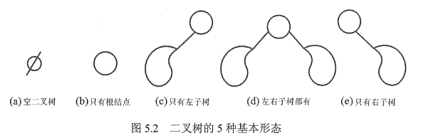


> 特殊的二叉树

**满二叉树**

一棵高度为h，且含有2^h^-1个结点的二叉树称为满二叉树，即树中的每层都含有最多的结点，满二叉树的叶子结点都集中在二叉树的最下一层，并且除叶子结点之外的每个结点度数均为2。
可以对满二叉树按层序编号:约定编号从根结点(根结点编号为1)起，自上而下，自左向右。这样，每个结点对应一个编号，对于编号为i的结点，若有双亲，则其双亲为i/2(取下限),若有左孩子，则左孩子为2i;若有右孩子，则右孩子为2i+ 1。

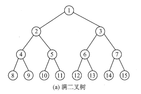

**完全二叉树**

高度为h、有n个结点的二叉树，当且仅当其每个结点都与高度为h的满二叉树中编号为1~n的结点一一对应时，称为完全二叉树。

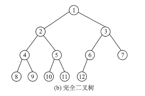

**二叉排序树**

左子树上所有结点的关键字均小于根结点的关键字;右子树上的所有结点的关键字均大于根结点的关键字;左子树和右子树又各是一棵二叉排序树。

**平衡二叉树**

树上任一结点的左子树和右子树的深度之差不超过1。


> 二叉树性质

非空二叉树上的叶子结点数等于度为2的结点数加1，即n0=n2+1。借助所有节点个数等于总度数之和。

非空二叉树上第k层上至多有2^k-1^个结点（k≥ 1)。

高度为h的二叉树至多有2^h^ - 1个结点（h≥1)。


### 2.2 二叉树存储结构

> 顺序结构

二叉树的顺序存储是指用一组地址连续的存储单元依次自上而下、自左至右存储完全二叉树上的结点元素，即将完全二叉树上编号为i的结点元素存储在一维数组下标为i-1的分量中。

依据二叉树的性质，完全二叉树和满二叉树采用顺序存储比较合适，树中结点的序号可以唯一地反映结点之间的逻辑关系，这样既能最大可能地节省存储空间，又能利用数组元素的下标值确定结点在二叉树中的位置，以及结点之间的关系。

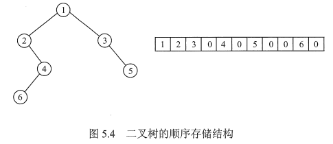


> 链式存储结构

由于顺序存储的空间利用率较低，因此二叉树一般都采用链式存储结构，用链表结点来存储二叉树中的每个结点。在二叉树中，结点结构通常包括若干数据域和若干指针域，二叉链表至少包含3个域:数据域data、左指针域lchild和右指针域rchild。n个节点的二叉链表中，含有n+1个空指针域。

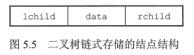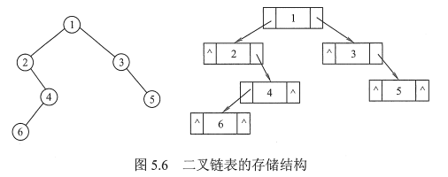


### 2.3 二叉树遍历

二叉树的遍历是指按某条搜索路径访问树中每个结点，使得每个结点均被访问一次，而且仅被访问一次。

> 先序遍历

先序遍历(PreOrder）的操作过程如下。若二叉树为空，则什么也不做;否则,

- 1）访问根结点;
- 2）先序遍历左子树;
- 3）先序遍历右子树。

```c++
void preOrder(BiTree T) {
    if (T != NULL) {
        visit(T);
        preOrder(T->lchild);
        preOrder(T->rchild);
    }
}

void preOrder(BiTree T) {
    InitStack(S);
    BiTree p = T;
    while(P || !InEmpty(S)) {
        if(p) {             // 一路向左
            visit(p);       // 访问当前节点并入栈
            Push(S, p);     
            p = p->lchild;  // 左孩子不空，一直向左走
        } else {            // 出栈，并转向出栈节点的右子树
            Pop(S, p);
            p = p->rchild;  // 向右子树走
        }
    }
}
```


> 中序遍历

中序遍历（ InOrder）的操作过程如下。若二叉树为空，则什么也不做;否则,

- 1）中序遍历左子树;
- 2）访问根结点;
- 3）中序遍历右子树。

```c++
void inOrder(BiTree T) {
    if(T != NULL) {
        inOrder(T->lchild);
        visit(T);
        inOrder(T->rchild);
    }
}

void inOrder(BiTree T) {
    InitStack(S);
    BiTree p = T;
    while(p || !IsEmpty(S)) {
        if(p) {
            Push(S, p);
            p = p->lchild;
        } else {
            Pop(S, p);
            visit(p);
            p = p->rchild;
        }
    }
}
/*
1.沿着根的左孩子，依次入栈，直到左孩子为空，说明已找到可以输出的结点
2.栈顶元素出栈并访问:若其右孩子为空，继续执行2;若其右孩子不空，将右子树转执行1
*/
```


> 后序遍历

后序遍历（PostOrder）的操作过程如下。若二叉树为空，则什么也不做;否则,

- 1）后序遍历左子树;
- 2）后序遍历右子树;
- 3）访问根结点。

```c++
void postOrder(BiTree T) {
    if(T != NULL) {
        postOrder(T->lchild);
        postOrder(T->rchild);
        visit(T);
    }
}

void posrOrder(BiTree T) {
    InitStack(S);
    p = T;
    r = NULL;  // 最近访问的节点
    while(p || !IsEmpty(S)) {
        if(p) {            // 走到最左边
            push(S, p);
            p = p->lchild;
        } else {           // 向右
            GetTop(S, p);  // 读栈顶节点，没有出栈
            if(p->rchild && p->rchild != r) {  // 若右子树存在，其未被访问
                p = p->rchild;  // 转向右子树
                push(S, p);     // 压栈
                p = p->lchild;  // 再走到最左
            } else {            // 否则，弹出节点并访问
                pop(S, p);
                visit(p->data);
                r = p;   // 记录最近访问的节点
                p = NULL; // 节点访问完，重置p指针
            }
        }
    }
}
/*
算法思想:后序非递归遍历二叉树是先访问左子树，再访问右子树，最后访问根结点。
1沿着根的左孩子，依次入栈，直到左孩子为空。
2读栈顶元素:若其右孩子不空且未被访问过，将右子树转执行1;否则，栈顶元素出栈并访问。
在上述思想的第2步中，必须分清返回时是从左子树返回的还是从右子树返回的，因此设定一个辅助指针r，指向最近访问过的结点。
*注意：每次出栈访问完一个结点就相当于遍历完以该结点为根的子树，需将p置NULL。
*/
```


三种遍历算法中，递归遍历左、右子树的顺序都是固定的，只是访问根结点的顺序不同。不管采用哪种遍历算法，每个结点都访问一次且仅访问一次，故**时间复杂度都是O(n)**。在递归遍历中，递归工作栈的栈深恰好为树的深度，所以在最坏情况下，二叉树是有n个结点且深度为n的单支树，遍历算法的空间复杂度为O(n)。


> 层次遍历

就一层一层遍历，访问当前节点，然后左右子树依次入队列

```c++
void levelOrder(BiTree T) {
    InitQueue(Q);
    BiTree p;
    EnQueue(Q, T);
    while(!IsEmpty(Q)) {
        DeQueue(Q, p);
        visit(p);
        if(p->lchild != NULL)
            EnQueue(Q, p->lchild);
        if(p->rchild != NULL)
            EnQueue(Q, p->rchild);
    }
}
```


## 3 线索二叉树

### 3.1 基本概念

传统的二叉链表存储仅能体现一种父子关系，不能直接得到结点在遍历中的前驱或后继。在含n个结点的二叉树中，有n+1个空指针。能否利用这些空指针来存放指向其前驱或后继的指针？这样就可以像遍历单链表那样方便地遍历二叉树。引入线索二叉树正是为了**加快查找结点前驱和后继的速度**。

规定：**若无左子树，令lchild指向其前驱结点；若无右子树，令rchild指向其后继结点**。还需增加两个标志域标识指针域是指向左(右〉孩子还是指向前驱（后继)。

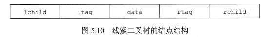

标志域含义如下：

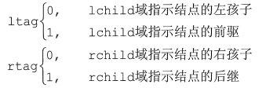

```c++
// 线索二叉树存储结构如下
typedef struct ThreadNode{
    ElemType data;
    struct ThreadNode *lchild, *rchild;
    int ltag, rtag;
}
```

以这种结点结构构成的二叉链表作为二叉树的存储结构，称为线索链表，其中指向结点前驱和后继的指针称为线索。加上线索的二叉树称为线索二叉树。


### 3.2 中序线索二叉树的构造

二叉树的线索化是将二叉链表中的空指针改为指向前驱或后继的线索。而前驱或后继的信息只有在遍历时才能得到，因此线索化的实质就是遍历一次二叉树。

以中序线索二叉树的建立为例。附设指针 pre 指向刚刚访问过的结点，指针 p 指向正在访问的结点，即 pre 指向 p 的前驱。在中序遍历的过程中，检查p的左指针是否为空，若为空就将它指向pre;检查pre的右指针是否为空，若为空就将它指向p。

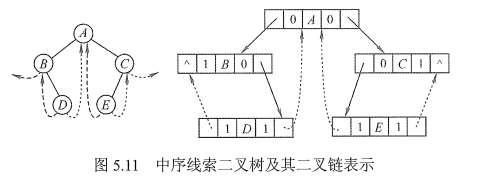

```c++
void CreateInThread(ThreadTree T) {
    ThreadTree pre = NULL;
    if(T != NULL) {
        InThread(T, pre);
        pre->rchild = NULL:
        pre->rtag = 1;
    }
}

void InThread(ThreadTree &p, ThreadTree &pre) {
    if(p != NULL) {
        InThread(p->lchild, pre);
        if(p->lchild == NULL){  // 左子树为空，建立前驱线索
            p->lchild = pre;
            p->ltag = 1;
        }
        if(pre != NULL && pre->rchild == NULL) {
            pre->rchild = p;    // 建立前驱节点的后继线索
            pre->rtag = 1;
        }
        pre = p;  // 标记当前节点为刚刚访问过的节点
        InThread(p->rchild, pre);
    }
}
```


### 3.3 中序线索二叉树的遍历

中序线索二叉树的结点中隐含了线索二叉树的前驱和后继信息。

在对其进行遍历时，只要先找到序列中的第一个结点，然后依次找结点的后继，直至其后继为空。

在中序线索二叉树中找结点后继的规律是:若其右标志为“1”，则右链为线索，指示其后继，否则遍历右子树中第一个访问的结点（右子树中最左下的结点）为其后继。

```c++
void InOrder(ThreadNode *T) {
    for(ThreadNode *p = FirstNode(T); p != NULL; p = NextNode(p)) 
        visit(p);
}

// 求中序线索二叉树中中序序列的第一个节点
ThreadNode *FirstNode(ThreadNode *p) {
    while(p->ltag == 0) p = p->lchild;
    return p;
}

// 求中序线索二叉树中节点p在中序序列中的后继
ThreadNode *NextNode(ThreadNOde *p) {
    if(p->rtag == 0)
        return FirstNode(p->rchild);
    else  // rtag==1，直接返回其后继线索
        return p->rchild;
}
```


## 4 树、森林

### 4.1 树的存储结构

> 双亲表示法

这种存储方式采用一组连续空间来存储每个结点，同时在每个结点中增设一个伪指针，指示其双亲结点在数组中的位置。根结点下标为0，其伪指针域为-1。

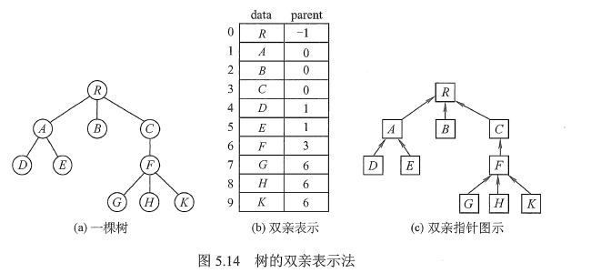

该存储结构利用了每个结点（根结点除外）只有唯一双亲的性质，可以很快得到每个结点的双亲结点，但求结点的孩子时需要遍历整个结构。

注意:区别树的顺序存储结构与二叉树的顺序存储结构。在树的顺序存储结构中，数组下标代表结点的编号，下标中所存的内容指示了结点之间的关系。而在二叉树的顺序存储结构中，数组下标既代表了结点的编号，又指示了二叉树中各结点之间的关系。当然，二叉树属于树，因此二叉树都可以用树的存储结构来存储，但树却不都能用二叉树的存储结构来存储。

```c++
#define MAX_TREE_SIZE 100
typedef struct {
    ElemType data;
    int parent;
}PTNode;
typedef struct {
    PTNode nodes[MAX_TREE_SIZE];
    int n;
}PTree;
```


> 孩子表示法

孩子表示法是将每个结点的孩子结点都用单链表链接起来形成一个线性结构，此时n个结点就有n个孩子链表(叶子结点的孩子链表为空表)。

这种存储方式寻找子女的操作非常直接，而寻找双亲的操作需要遍历n个结点中孩子链表指针域所指向的n个孩子链表。

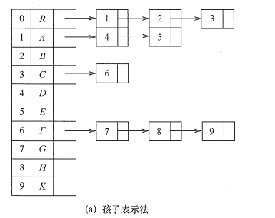


> 孩子兄弟表示法

孩子兄弟表示法又称二叉树表示法，即以二叉链表作为树的存储结构。孩子兄弟表示法使每个结点包括三部分内容:结点值、指向结点第一个孩子结点的指针，及指向结点下一个兄弟结点的指针（沿此域可以找到结点的所有兄弟结点)。

**常用来将树/森林转换为二叉树**

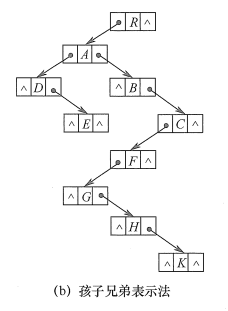

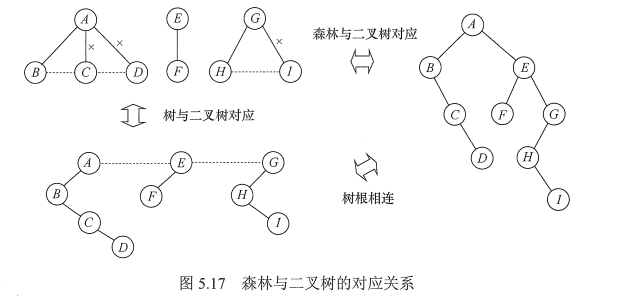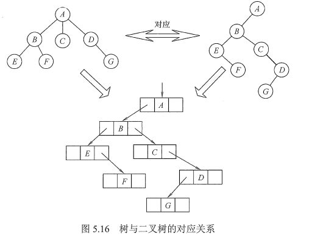


### 4.2 树和森林的遍历

> 树

树的遍历是指用某种方式访问树中的每个结点，且仅访问一次。主要有两种方式:

1）先根遍历。若树非空，先访问根结点，再依次遍历根结点的每棵子树，遍历子树时仍遵循先根后子树的规则。其遍历序列与这棵树相应二叉树的先序序列相同。

2）后根遍历。若树非空，先依次遍历根结点的每棵子树，再访问根结点，遍历子树时仍遵循先子树后根的规则。其遍历序列与**这棵树相应**二叉树的中序序列相同。

另外，树也有层次遍历，与二叉树的层次遍历基本相同。

> 森林

按照森林和树相互递归的定义，可得到森林的两种遍历方法：

1）先序遍历森林。若森林为非空，则按如下规则进行遍历:

- 访问森林中第一棵树的根结点。
- 先序遍历第一棵树中根结点的子树森林。
- 先序遍历除去第一棵树之后剩余的树构成的森林。

2）中序遍历森林。森林为非空时，按如下规则进行遍历:

- 中序遍历森林中第一棵树的根结点的子树森林。
- 访问第一棵树的根结点。
- 中序遍历除去第一棵树之后剩余的树构成的森林。


## 5 树的应用-并查集

并查集是一种简单的集合表示，它支持以下3种操作:
1) Union(S,Root1,Root2):把集合s中的子集合Root2并入子集合Root1。要求Root1和Root2互不相交，否则不执行合并。
2) Find(s, x):查找集合s中单元素x所在的子集合，并返回该子集合的名字。
2) Initial(S):将集合s中的每个元素都初始化为只有一个单元素的子集合。

通常用树（森林）的双亲表示作为并查集的存储结构，每个子集合以一棵树表示。所有表示子集合的树，构成表示全集合的森林，存放在双亲表示数组内。通常用数组元素的下标代表元素名，用根结点的下标代表子集合名，根结点的双亲结点为负数。

下图演示了一些合并的过程：

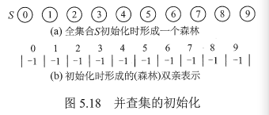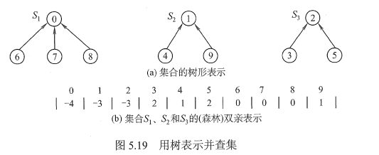

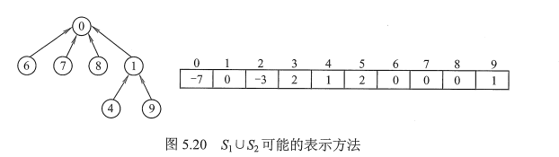


```c++
#define SIZE 100
int UFSets[SIZE];
// 初始化操作，s为并查集
void Initial(int S[]) {
    for(int i=0; i<size; i++)
        S[i] = -1;
}
// FInd操作，函数在并查集S中查找并返回元素x的树的根
int Find(int S[], int x) {
    while(S[x] >= 0)
        x = S[x];
    return x;
}
// Union操作，函数求两个不相交子集合的并集
void Union(int S[], int Root1, int Root2) {
    // 要求两个根是不同的，且表示子集合的名字
    S[Root2] = Root1;  // 将根Root2连接到根Root1下面
}
```


> 重量权衡合并规则

两棵树归并时，将节点较少的树的根节点指向节点较多的树的根节点，当两棵树规模同样大时，使节点值大的根节点指向节点值小的根节点

- ——可降低树的高度
- ——可以把树的整体深度限制在O(logn)


> 路径压缩

每一次路径压缩，在该路径的所有节点都要作为最终根节点的直接节点

具体方法

- 尝试着在执行**Find操作**(自底向上，不断溯源)时，如果没有找到根节点，就想办法把这些节点向上挪—挪，称这个过程为路径压缩(Path Compression)
- 即判断当前节点是否为根，如果不是（即没有找到)，就把以当前节点为根的子树整体向上挪，挪到当前节点的父亲的父亲处，下次再判断当前节点的父亲(即原来的祖先)是否为根...相当于跳了一步，所以叫路径压缩」

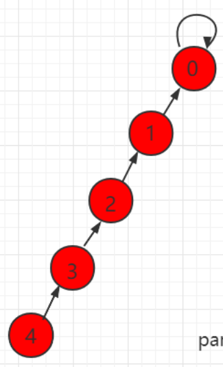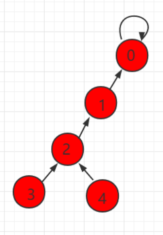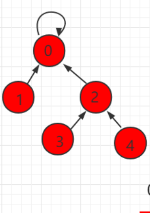

```c++
// FIND with path compression
int ParPtrTree ::FIND(int curr) {
    if(array[curr] == ROOT)
        return curr;
    array[curr] = FIND(array[curr]);
    return array[curr];
}
```


## 6 树与二叉树应用

### 6.1 二叉排序树BST(搜索树)

> 定义

二叉排序树（也称二叉查找树）或者是一棵空树，或者是具有下列特性的二叉树:

- 若左子树非空，则**左子树**上所有结点的值均**小于**根结点的值。
- 若右子树非空，则**右子树**上所有结点的值均**大于**根结点的值。
- 左、右子树也分别是一棵二叉排序树。

根据二叉排序树的定义，左子树结点值<根结点值<右子树结点值，所以对二叉排序树进行**中序遍历，可以得到一个递增的有序序列**。


> 查找

二叉排序树的查找是从根结点开始，沿某个分支逐层向下比较的过程。若二叉排序树非空，先将给定值与根结点的关键字比较，若相等，则查找成功;若不等，如果小于根结点的关键字，则在根结点的左子树上查找，否则在根结点的右子树上查找。

```c++
BSTNode* BST_Search(BiTree T, ElemType key) {
    while(T != NULL && key != T->data) {
        if(key < T->data)
            T = T->lchild;
        else
            T = T->rchild;
    }
    return T;
}
```


> 插入

插入结点的过程如下:若原二叉排序树为空，则直接插入结点;否则，若关键字k小于根结点值，则插入到左子树，若关键字k大于根结点值，则插入到右子树。插入的结点一定是一个新添加的叶结点，且是查找失败时的查找路径上访问的最后一个结点的左孩子或右孩子。

```c
int BST_Insert(BiTree &T, KeyType k) {
    if(T == NULL) {
        T = (BiTree) malloc(sizeof(BSTNode));
        T->key = k;
        T->lchild = T->rchild = NULL;
        return 1;   // insert success
    } else if(k == T->key) {
        return 0;     // insert fail
    } else if(k < T->key) {
        return BST_Insert(T->lchild, key);
    } else {
        return BST_Insert(T->rchild, key);
    }
}
```


> 构造二叉排序树

从一棵空树出发，依次输入元素，将它们插入二叉排序树中的合适位置。

```c
void Create_BST(BiTree &T, KeyType str[], int n) {
    T = NULL;
    int i = 0;
    while(i < n) {
        BST_Insert(T, str[i]);
        i++;
    }
}
```


> 删除

在二叉排序树中删除一个结点时，不能把以该结点为根的子树上的结点都删除，必须先把被删除结点从存储二叉排序树的链表上摘下，将因删除结点而断开的二叉链表重新链接起来，同时确保二叉排序树的性质不会丢失。删除操作的实现过程按3种情况来处理:

若被删除结点z是叶结点，则直接删除，不会破坏二叉排序树的性质。

若结点z只有一棵左子树或右子树，则让z的子树成为z父结点的子树，替代z的位置。

若结点z有左、右两棵子树，则令z的直接后继（或直接前驱）替代z，然后从二叉排序树中删去这个直接后继（或直接前驱)，这样就转换成了第一或第二种情况。（其实就是找左边最大的，或者右边最小的）

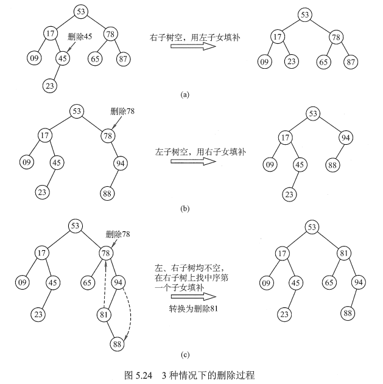


> 查找效率分析

二叉排序树的查找效率，主要取决于树的高度。

若二叉排序树的左、右子树的高度之差的绝对值不超过1，则这样的二叉排序树称为平衡二叉树，它的平均查找长度为O(log~2~n)。若二叉排序树是一个只有右（左）孩子的单支树（类似于有序的单链表)，则其平均查找长度为O(n)。

在最坏情况下，即构造二叉排序树的输入序列是有序的，则会形成一个倾斜的单支树，此时二叉排序树的性能显著变坏，树的高度也增加为元素个数n。


### 6.2 平衡二叉树AVL

> 定义

为避免树的高度增长过快，降低二叉排序树的性能，规定在插入和删除二叉树结点时，要保证任意结点的左、右子树高度差的绝对值不超过1，将这样的二叉树称为平衡二叉树(Balanced Binary Tree),简称平衡树。

定义结点**左子树与右子树的高度差**为该结点的平衡因子，则平衡二叉树结点的平衡因子的值只可能是-1、0或1。

因此，平衡二叉树可定义为或者是一棵空树，或者是具有下列性质的二叉树：它的左子树和右子树都是平衡二叉树，且左子树和右子树的高度差的绝对值不超过1。


> 插入

插入和BST的操作类似，只不过每次插入都要检查是否破坏了树的平衡性，如果破坏，就需要进行平衡旋转

四种旋转

**1）LL平衡旋转（右单旋转)**。由于在结点A的左孩子(L)的左子树(L)上插入了新结点,A的平衡因子由1增至2，导致以A为根的子树失去平衡，需要一次向右的旋转操作。

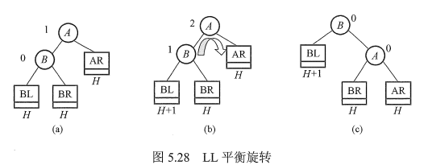

**2）RR平衡旋转（左单旋转)**。由于在结点A的右孩子(R）的右子树(R)上插入了新结点，A的平衡因子由-1减至-2，导致以A为根的子树失去平衡，需要一次向左的旋转操作。

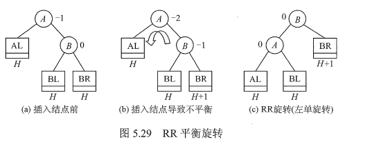

**3）LR平衡旋转(先左后右双旋转)**。由于在A的左孩子(L)的右子树(R)上插入新结点，A的平衡因子由1增至2，导致以A为根的子树失去平衡，需要进行两次旋转操作，先左旋转后右旋转。

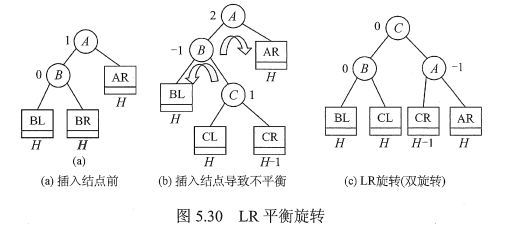

**4）RL平衡旋转(先右后左双旋转)**。由于在A的右孩子(R)的左子树(L)上插入新结点，A的平衡因子由-1减至-2，导致以A为根的子树失去平衡，需要进行两次旋转操作，先右旋转后左旋转。

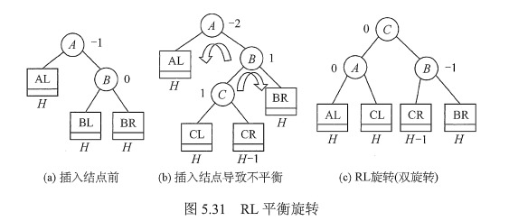


一个简单的例子

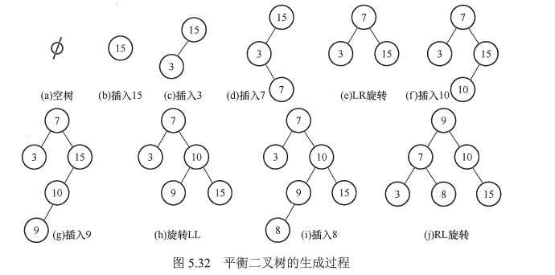


> 查找

和二叉排序树查找一样，含有n个结点的平衡二叉树的最大深度为O(log2n)，因此平衡二叉树的平均查找长度为O(log2n)。


### 6.3 哈夫曼树和哈夫曼编码

> 定义

在许多应用中，树中结点常常被赋予一个表示某种意义的数值，称为该结点的权。从树的根到任意结点的路径长度（经过的边数）与该结点上权值的乘积，称为该结点的带权路径长度。树中所有叶结点的带权路径长度之和称为该树的带权路径长度，记为

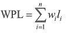

在含有n个带权叶结点的二叉树中，其中带权路径长度(WPL)最小的二叉树称为哈夫曼树，也称最优二叉树。


> 构造

给定n个权值分别为w~1~, w~2~,......, w~n~的结点，构造哈夫曼树的算法描述如下:

- 1）将这n个结点分别作为n棵仅含一个结点的二叉树，构成森林F。
- 2）构造一个新结点，从F中选取两棵根结点权值最小的树作为新结点的左、右子树，并且将新结点的权值置为左、右子树上根结点的权值之和。
- 3）从F中删除刚才选出的两棵树，同时将新得到的树加入F中。
- 4）重复步骤2）和3)，直至F中只剩下一棵树为止。

从上述构造过程中可以看出哈夫曼树具有如下特点:

- 1）每个初始结点最终都成为叶结点，且权值越小的结点到根结点的路径长度越大。
- 2）构造过程中共新建了n-1个结点（双分支结点)，因此哈夫曼树的结点总数为2n-1。
- 3）每次构造都选择2棵树作为新结点的孩子，因此哈夫曼树中不存在度为1的结点。


> 哈夫曼编码

在数据通信中，若对每个字符用相等长度的二进制位表示,称这种编码方式为固定长度编码。若允许对不同字符用不等长的二进制位表示，则这种编码方式称为可变长度编码。可变长度编码比固定长度编码要好得多，其特点是对频率高的字符赋以短编码，而对频率较低的字符则赋以较长一些的编码，从而可以使字符的平均编码长度减短，起到压缩数据的效果。哈夫曼编码是一种被广泛应用而且非常有效的数据压缩编码。

若没有一个编码是另一个编码的前缀，则称这样的编码为前缀编码。哈夫曼编码是总长度最短的二进制前缀编码。

由哈夫曼树得到哈夫曼编码是很自然的过程。首先，将每个出现的字符当作一个独立的结点，其权值为它出现的频度（或次数)，构造出对应的哈夫曼树。显然，所有字符结点都出现在叶结点中。我们可将字符的编码解释为从根至该字符的路径上边标记的序列，其中边标记为0表示“转向左孩子”，标记为1表示“转向右孩子”。


### 6.4 堆树

> 定义

堆由两条性质来定义：

首先，它是一颗完全二叉树，所以往往用数组来表示堆数据结构

其次，堆中存储的数据是局部有序的，也就是说节点存储的值与其子节点存储的值之间存在某种关系。


> 两种不同的堆

最大堆max heap：任意一个节点存储的值都大于或者等于其任意一个子节点存储的值。由于根节点包含大于或等于其子节点存储的值，而其子节点又依次大于或等于各自子节点存储的值，所以根节点存储着该树所有节点中的最大值。

最小堆min heap：任意一个节点存储的值都小于或者等于其任意一个子节点存储的值。由于根节点包含小于或等于其子节点存储的值，而其子节点又依次小于或等于各自子节点存储的值，所以根节点存储着该树所有节点中的最小值。


> 建堆

从数组的较大序号节点向较小序号结点顺序访问，每个结点执行下拉（siftdown）操作。实际上，建堆过程不必访问叶结点，由于他们已经在最底层，不能再往下移了，所以建堆算法是从数组中部的第一个分支结点开始。也就是最后一个非叶结点。

```c
void buildHeap() {
    for(int i=n/2-1; i>=0; i--)
        siftdown(i);
}
// 重要的siftdown函数
void siftdown(int pos) {
    while(!isLeaf(pos)) {
        int j = leftChild(pos);
        int rc = rightChild(pos);
        if((rc < n) && Comp::prior(Heap[rc], Heap[j]))
            j = rc;  // set j to greater child's value
        if(Comp::prior(Heap[pos], Heap[j]))
            return;   //done
        swap(Heap, pos, j);
        pos = j;   // move down
    }
}
// 是与两个子节点值较大的那个交换位置
```


> 删除（最大值堆）

删除最大值：

- 保存最大值，交换堆的根节点的值和堆的最后一个结点的值，堆的元素个数减一。
- 对新的根节点执行下拉操作即可（若新树不空）。

复杂度即下拉操作复杂度，最差logn，最佳不需要移动，平均O(logn)。


删除任意值：

- 遍历最大值堆，查找被删除的值，记录结点地址
- 交换该节点与堆最后一个结点的值，堆元素个数减一
- 结点位置新的值可能比父节点大，需上推，直至其小于或等于其父节点的值，或是到达跟结点
- 然后，其新的位置又可能比他的另一个子树节点值小，需要执行下拉操作

基于数组实现，堆删除的时间复杂度取决于查找、交换和维持堆性质的时间复杂度。堆是完全二叉树，n个节点高度为logn，查找时间复杂度为O（n），交换时间开销为常数，上推和下拉操作时间复杂度为O（logn），所以总的时间复杂度为O(n)。