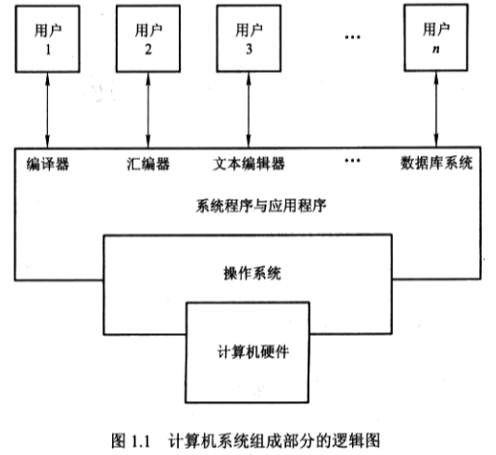
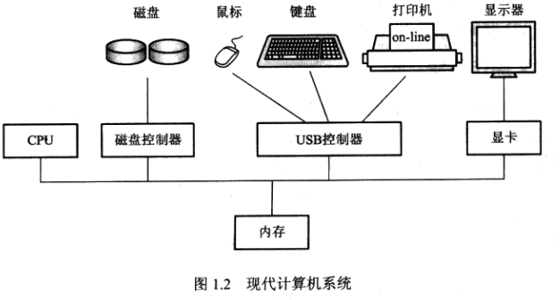
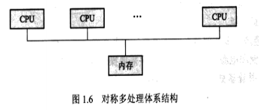
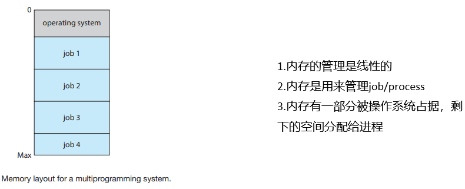
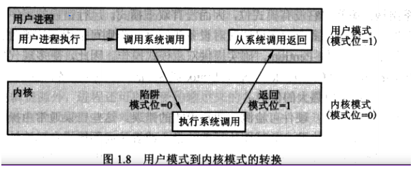
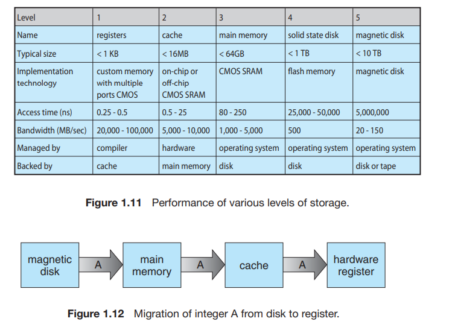

# 操作系统导论

## 操作系统概念（Operating system）

### 1.定义

（一般来说，目前没有一个关于操作系统的完全准确的定义，也没有一个广泛接受的什么属于操作系统的定义）

  操作系统是作为计算机硬件和计算机用户之间的中介的程序

一个比较公认的定义是，操作系统是一直运行在计算机上的程序（通常称为内核(kernel)）

### 2.目的

   操作系统的目的是为用户提供方便且有效的执行程序的环境。

execute（执行） convenient（方便） efficient（有效）

   大型机的操作系统设计的主要目的是为了充分优化硬件的使用率，个人计算机的操作系统是为了能支持从复杂游戏到商业应用的各种事务，移动计算机的操作系统是为了给用户提供一个可以与计算机方便的交互并执行程序的环境

   1、执行用户程序

   2、方便用户使用

   3、有效管理计算机资源

 

## 操作系统做什么

### 计算机系统组成

  计算机硬件（hardware），操作系统（OS），系统程序与应用程序(Application programs and system programs)，用户（users）

  计算机系统的根本目的是，执行用户程序并且更容易解决用户问题

  1.1硬件

   中央处理单元（CPU），内存（memory），输入输出设备（I/O devices）

​    为系统提供基本的计算资源

 1.2应用程序

​    规定了用户按何种方式使用这些资源

 1.3操作系统

   控制和协调各个用户应用程序对硬件的使用

## 用户视角&系统视角

###   1. 用户视角 

​    用户视角因使用界面不同而不同。

​    PC机，这类系统让单个用户单独使用资源，其目的是优化用户进行的工作。

操作系统设计的主要目的是让用户使用方便（ease of use），次要的是性能，不在乎的是资源利用（resource utilization）。

​    大型机和小型机相连的终端。这种操作系统的设计目标是优化资源利用率，确保所有的CPU时间、内存和I/O都能得到有效使用，并且确保没有用户使用超过限额以外的资源。

​    用户坐在工作站前。这类操作系统的设计需要兼顾使用方便性和资源利用率。 

###  2. 系统视角

   从计算机的角度来看，操作系统是与硬件紧密相连的程序。因此，可以讲操作系统看作资源分配器（resource allocator）操作系统管理计算机的资源。

   另一个视角，强调控制各种I/O设备和用户程序的需求。操作系统是个控制程序。控制程序（control program）管理用户程序的执行。

  

## 计算机系统组织

### 1.1计算机系统操作

   1、现代通用计算机系统有一个或多个CPU和若干设备控制器通过共同的总线相连而成，改总线提供了对共享内存的访问。

   2、每个设备控制器负责一种特定类型的设备。

   3、CPU与设备控制器可以并发工作，并竞争内存周期。

   4、为了确保对共享内存的有序访问，需要内存控制器来协调对内存的访问。

   5、打开电源时，计算机开始运行，需要运行一个引导程序（bootstrap program），他初始化系统中的所有部分，其需要定位操作系统内核并把它装入内存。

   6、事件的发生通常通过硬件或软件中断（interrupt）来表示，硬件可以随时通过系统总线向CPU发出信号，以触发中断；软件通过执行特别操作如系统调用（system call，也称监视器调用monitor call）也能触发中断；

  7、中断是计算机结构的重要部分，每个计算机都有自己的中断机制，终端必须将控制转移到合适的中断处理程序。

​       Load 将设备数据-------->内存  store将内存数据------->外部设备

## 存储结构storage structure

### 内存概念

  1.计算机程序必须在内存（随机访问内存，RAM，random-access memory）中以便于运行。

  2.内存是处理器可以直接访问的唯一的大容量存储区域，通常用动态随机访问内存（dynamic random access memory DRAM）的半导体技术来实现

  3.内存通过对特定内存地址执行一系列load 或者 store 指令来实现交互，load 将内存中的字移到CPU的寄存器，store则相反

### 存储定义与符号

  计算机存储的基本单位是位或比特 一字节（byte) = 8位（bit）

   还有另一种单位为字（word）

  1KB= 1024B 1MB=1024KB 1GB=1024MB 1TB=1024GB

  此处的B为Byte字节

### 内存特性

  1.内存太小，不能永久的存储所需要的程序和数据

  2.内存是易失性（volatile）存储设备，当掉电时会失去所有内容

​    因此需要提供外存（secondary storage）以作为内存的扩充，他能够永久地存储大量的数据，最常用的是磁盘（magnetic disk）。

### 存储设备层次（storage-device hierarchy）

   磁带（magnetic tapes）----光盘（optical disk）----硬盘（magnetic disk）----固态磁盘（solid-state disk）----主存、内存（main memory）----高速缓存（Cache）----寄存器（registers）

## I/O 结构

### 设备控制器：

  1、每个设备控制器负责控制特定类型的设备，可有多个设备与其相连；

  2、设备控制器维护一定量的本地缓冲存储（local buffer）和一组特定用途的寄存器；

  3、设备控制器负责在其所控制的外部设备与本地缓冲存储之间进行数据传递；

  4、通常，操作系统为每个设备控制器提供一个设备驱动程序（device driver）。

 

## 计算机系统体系结构

（采用通用处理器数量即CPU的数量进行分类）

### 1、单处理器系统 signal-processor

   1、在单处理器系统中，有一个主CPU能够执行一个通用指令集，包括来自于用户进程的指令；

   2、如果只有一个通用CPU，系统则为单处理器系统。

### 2、多处理器系统 mutiprocessing-system

  1、多处理器系统也称并行系统（parallel system）或者紧耦合系统（tightly coupled system）；

  2、这类系统有多个紧密通信的CPU，她们共享计算机总线，有时还有时钟，内存，和外设等；

  3、多处理器系统的三个优点：

​      a、增加吞吐量（increased throughput）：通过增加处理器的数量，希望在更短的时间内左更多的事情，用N个处理器的加速比小于N；处理器之间的互相协调需要消耗一定的性能开销，

​      b、规模经济（economy of scale）：多处理器系统能节省资金，他们能共享外设、大容量存储和电源供给；

​      c、增加可靠性(increased reliability)：将功能分布在多个处理器上，单个处理器的失灵将不会使得整个系统停止，只会使他变慢

  4、多处理器系统的类型：

​     a、非对称多处理（asymmetric multiprocessing），即每个处理器都有各自特定的任务，一个主处理器控制系统，其他处理器或者向主处理器要任务或做预先定义的任务，这种方案称为主从关系，主处理器调度从处理器并安排工作

​     b、对称多处理（symmetric multiprocessing，SMP），每个处理器都要完成操作系统中的所有任务，所有处理器对等，没有主从关系；

### 3、集群系统（clustered system）

   集群系统将多个CPU集中起来完成计算任务，由两个或者多个独立的系统耦合起来的

**现在CPU的设计趋势是集成多个计算核到单个芯片，即多核。**

## 操作系统结构

### 多道程序系统(multiprogram)

 1、操作系统最重要的一点是要有多道程序处理能力，单个用户通常不能总使得CPU和I/O设备都忙，多道程序设备通过组织作业（编码或数据code and data）使CPU总有一个作业可执行，从而提高CPU利用率。

 2、思想如下：

   操作系统同时将多个任务保存在内存中，该作业集可以是作业池( job pool )中作业集的子集（作业池中包括所有进入系统的作业）。

   操作系统选择一个位于内存中的作业并开始执行；

   对于多道程序系统，当作业需要等待时，CPU就会切换到另外一个作业，只要有一个任务可以执行，CPU就不会空闲；

 3、优点：

​    提供了一个可以充分使用各种系统资源（如CPU，内存，外设）的环境

 4、不足：

​    但是她们没有提供与计算机系统直接交互的能力

### 分时系统

  1、分时系统(time-sharing system)（或多任务）是多道程序设计的延申，在分时系统中，虽然CPU还是通过在作业之间的切换来执行多个作业，但是由于切换频率很高，用户可以在程序运行期间进行交互；

  2、共享需要一种交互计算机系统，它能提供用户与系统之间的直接通信，用户通过输入设备，向操作系统或程序直接发出指令，并等待输出设备立即出来的结果。相应的，响应时间（response time）应该比较短，通常小于 1 秒；

### 进程

  装入到内存并执行的程序通常称为进程（process）

### 作业调度（job scheduling）

   如果多个作业需要调入内存但没有足够的内存，那么系统必须在这些作业中做出选择，这样的决策成为作业调度

### CPU调度（CPU调度）

   如果有多个任务同时需要执行，那么系统必须做出选择，这样的选择称为CPU调度

### 虚拟内存（virtual memory）

​    在分时操作系统中，操作系统必须保证合理的响应时间，这有时需要通过交换(swaping)得到，交换时进程被换入内存或者由内存换出到磁盘，实现这一目的方法是采用虚拟内存，允许将一个执行的作业不完全放在内存中。

## 操作系统操作

​    事件总是由中断或陷阱引起的。陷阱（trap）或异常（exception）是一种由软件中断，源于出错（如除数为零或无效的存储访问），或者源于用户程序的一个特别请求（完成操作系统服务），硬件触发的我们称为中断，两者都称为中断。

   这种操作系统的的中断特性定义了系统的通用结构。

### 1、双重模式操作

   两种单独的运行模式：用户模式（user mode）和内核模式（kernel mode）（也称为监视模式supervisor mode）或者系统模式（system mode）或特权模式（privileged mode）

计算机硬件可以通过一个模式位（mode bit）来表示当前模式

### 2、定时器timer

- 操作系统应该维持控制CPU，防止用户程序陷入死循环，或不调用系统服务并且不将控制返给操作系统，为了实现这一目标，可以使用定时器
- 定时器可设置为在指定周期后中断计算机
- 对于10位的计数器和1ms精度的时钟，可按步长为1ms和时间间隔为1ms~1024ms来产生中断

 

## 进程管理process management

- 执行的程序称为进程，进程可以通过系统调用来创建子进程以并发执行execute     concurrently；

- 进程为了完成任务accomplish     its task，需要一定的资源resourses，包括CPU时间、内存、文件、I/O设备等，这些资源可以在进程创建时赋予，也可以在执行进程时分配；

- 除了创建时得到的各种物理和逻辑physical     and logical资源外，进程还可以接受传输过来的各种初始化数据various initialization data;

- 当进程终止时，操作系统会收回reclaim所有可在利用reusable的资源

- 程序本身不是进程，程序是个被动实体passive entity，如同存储在磁盘上的文件，而进程是一个主动实体active     entity;

- 单线程single-threaded进程有一个程序计数器program counter，指定了下一个所要执行的指令，这样一个进程的执行是顺序sequential的，CPU一个接一个的执行进程的指令，直至进程完成；而多线程multithreaded进程有多个程序计数器，每一个指向下一个给定线程需要执行的指令；

- 系统由多个进程组成，，其中有的是操作系统进程，有的是用户进程，所有这些进程都会并发执行，例如通过在单CPU上采用多路复用multiplexing来实现；

- 操作系统负责进程管理的以下活动activities：

- 1. 在CPU上调度进程和线程scheduling processes and threads
  2. 创建和删除用户进程和系统进程
  3. 挂起和重启进程 suspending and resuming
  4. 提供进程同步机制 mechanisms for process      synchronization
  5. 提供进程通信机制 mechanisms for process      communication

 

## 内存管理 memory management

- 内存是现代计算机执行的中心，他是一个很大的字节数组，大小从数十万到数十亿，每个字节都有地址；

- 内存是个快速访问quickly     accessible的数据仓库，并被CPU和I/O设备所共享；

- 如果一个程序需要执行，那么他必须映射到绝对地址mapped to absolute     addresses，并且加载到loaded into内存，随着程序执行，进程可以通过产生绝对地址来访问内存的程序指令和数据；

- 为改进CPU的利用率和用户的计算机相应速度，通用计算机应在内存中保留多个程序，这就是内存管理；

- 操作系统负责内存管理的以下活动：

- 1. 记录keeping track of内存的哪部分在被使用以及被谁使用
  2. 决定哪些进程（或其部分）会调入或调出move into and out内存
  3. 根据需要分配和释放allocate and      deallocate内存空间

Memory ----- precesses

Disk------------ files

 

## 存储管理storage management

​    为了方便计算机用户，操作系统提供信息存储的统一逻辑视图uniform logic view，操作系统对存储设备的物理属性physical properties进行了抽象abstract，并定义了逻辑存储单元unit，及文件file；

### 文件系统管理file-system manegement

- 计算机可以在多种类型的物理介质medium上存储信息，最常用的有磁盘、光盘、和磁带等，每种介质都有各自的特点和物理组织organization，每个介质都由一个设备device来控制，如磁盘驱动器和磁带驱动器drive等；

- 为方便用户使用，文件可以组织成目录organized     into directories；

- 操作系统负责文件管理的以下活动：

- 1. 创建和删除文件
  2. 创建和删除文件目录，以便组织文件
  3. 提供文件和目录的操作原语primitives for      manipulating
  4. 映射文件到外存mapping files      onto secondary storage
  5. 备份文件到稳定（非易失的）存储介质backing up files      on stable(nonvolatile) storage media

### 大容量存储器管理mass-storage management

- 内存太小不能容纳所有数据和程序，再加上掉电会失去数据，所以计算机系统应该提供外存secondary storage以备份内存；

- 大多数现代计算机系统采用硬盘disk作为主要在线存储介质，来存储程序和数据；

- 计算机运行的最终速度entire speed与硬盘子系统的速度和管理该子系统的算法algorithms that manipulate subsystem有很大关系；

- 操作系统负责有关硬盘管理的以下活动：

- 1. 空闲空间管理free-space management
  2. 存储空间分配 storage      allocation
  3. 硬盘调度disk scheduling

 

## 高速缓存caching

- 高速缓存又是也称缓存，是计算机系统的一条重要原理
- 由于高速缓存的大小有限，因此高速缓存管理的设计就很重要，慎重选择高速缓存大小与置换策略，可以极大提高性能；
- 固态盘也可作为高速缓存，并可通过文件系统接口来访问

## I/O系统

- 操作系统的目的之一就是为用户隐藏具体设备的特性

- I/O子系统包括以下几个组件：

- 1. 包括缓冲、高速缓存和假脱机的内存管理组件
  2. 设备驱动器的通用接口
  3. 特定硬件设备的驱动程序