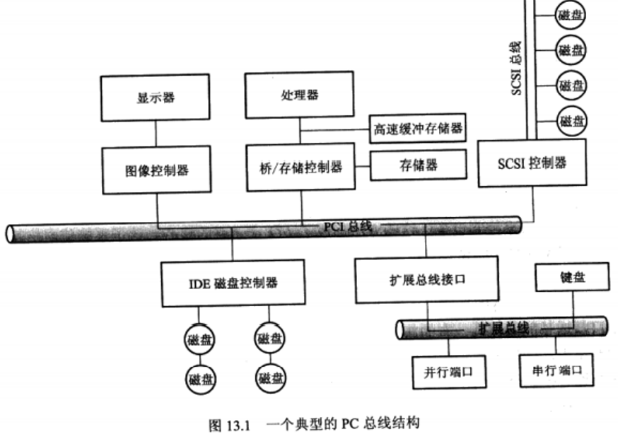
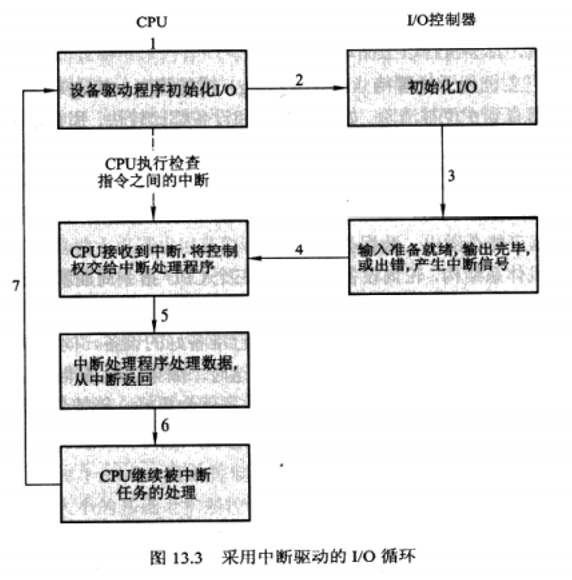
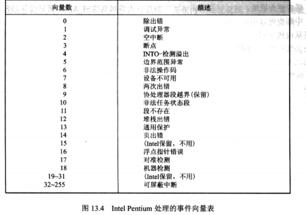
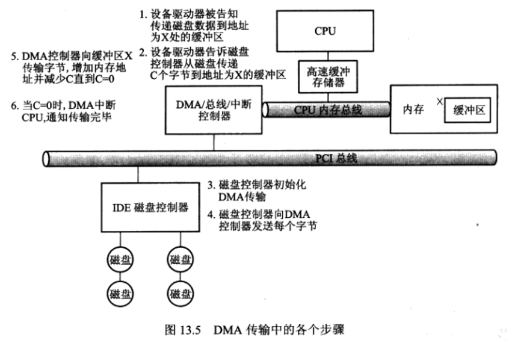

# I/O系统

- 操作系统在计算机I/O方面的作用是管理和控制I/O操作和I/O设备。

## 概述

- 对与计算机相连设备的控制是操作系统设计者的主要任务之一。因为IO设备在其功能与速度方面存在很大差异
- IO设备技术呈现两个相矛盾的趋势。一方面，可以看到硬件与软件接口日益增长的标准化。这一趋势有助于将设备集成到现有计算机和操作系统。另一方面，也可以看到IO设备日益增长的多样性。设备驱动程序为IO子系统提供了统一设备访问接口，就像系统调用为应用程序与操作系统之间提供了统一的标准接口一样。

## I/O硬件

- 设备与计算机通信通过一个连接点(或端口)，例如串行端口。如果一个或多个设备使用一组共同的线，那么这种连接则称为总线。总线(bus)是一组线和一组严格定义的可以描述在线上传输信息的协议。总线在计算机体系结构中使用很广。该图显示了一个PCI总线（最为常用的PC系统总线〉用以连接处理器-内存子系统与快速设备扩展总线(expansion bus）用于连接串行、并行端口和相对较慢的设备（如键盘)。在该图的右上角，4块硬盘一起连到与SCSI 控制器相连的SCSI（小型计算机系统接口）总线。

## 轮询

- 下面举例解释握手概念。假定有两个位来协调控制器与主机之间的生产者与消费者的关系。控制器通过状态寄存器的忙位(busy bit)来显示其状态（记住置位(set a bit）就是将1写到位中，而清位(clear a bit)就是将О写到位中)。控制器工作忙时就置忙位，而可以接收下一命令时就清忙位。主机通过命令寄存器中命令就绪位来表示其意愿。当主机有命令需要控制器执行时，就置命令就绪位。例如，当主机需要通过端口来写输出数据时，主机与控制器之间握手协调如下:

- - 1主机不断地读取忙位，直到该位被清除。
  - 2主机设置命令寄存器中的写位并向数据输出寄存器中写入一个字节。
  - 3主机设置命令就绪位。
  - 4当控制器注意到命令就绪位已被设置，则设置忙位。
  - 5控制器读取命令寄存器，并看到写命令。它从数据输出寄存器中读取一个字节，并向设备执行I/O操作。
  - 6控制器清除命令就绪位，清除状态寄存器的故障位表示设备IO成功，清除忙位表示完成。

- 在步骤1中，主机处于忙等待( busy-waiting）或轮询（ polling):在该循环中，不断地读取状态寄存器直到忙位被清除。

- 对许多计算机体系结构，轮询设备只要使用三个CPU指令周期就足够了:读取设备寄存器，逻辑AND以提取状态位，如果不为О进行跳转。很明显，基本轮询操作还是效率很高的。但是如不断地重复轮询，主机很少会发现已准备好的设备，同时其他需要使用处理器处理的工作又不能完成，轮询效率就会变差。这时，如果让设备准备好时再通知处理器而不是由CPU轮询外设IO是否已完成，那么效率就会更好。能使外设通知CPU的硬件机制称为中断（ interrupt)。

## 中断

- 基本中断机制工作如下。CPU硬件有一条中断请求线(Interrupt-request line, IRL)。CPU在执行完每条指令后，都将检测IRL。当CPU检测到已经有控制器通过中断请求线发送了信号,CPU将保存当前状态并且跳转到内存固定位置的中断处理程序(interrupt-controller)。中断处理程序判断中断原因，进行必要的处理，重新恢复状态，最后执行中断返回(returnfrom interrupt）指令以便使CPU返回中断以前的执行状态，即设备控制器通过中断请求线发送信号而引起(raise)中断，CPU捕获( catch）中断并分发( dispatch）到中断处理程序中，中断处理程序通过处理设备请求来清除（clear）中断。

- 对于现代操作系统，需要更为成熟的中断处理特性:

- - 在进行关键处理时，能够延迟中断处理。
  - 更有效地将中断分发到合适的中断处理程序，而不是检查所有设备以决定哪个引起中断。
  - 需要多级中断，操作系统能区分高或低优先级的中断，能根据紧迫性的程度来响应。

- 绝大多数CPU有两个中断请求线。一个是非屏蔽中断，主要用来处理如不可恢复内存错误等事件。另一个是可屏蔽中断，这可以由CPU在执行关键的不可中断的指令序列前加以屏蔽。可屏蔽中断可以被设备控制器用来请求服务。

- 中断机制接受一个地址，以用来从一小集合内选择特定的中断处理程序。对绝大多数体系机构，这个地址是一个称为中断向量(interrupt vector）的表中偏移量。

## 直接访问内存

- 对于需要做大量传输的设备，例如磁盘驱动器，如果使用昂贵的通用处理器来观察状态位并按字节来向控制器寄存器送入数据—一个称为程序控制IO     (Programmed lO,PIO)的过程，那么就浪费了。许多计算机为了避免用PIO增加 CPU的负担，将一部分任务下放给一个的专用处理器，称之为直接内存访问(direct-memory access，DMA)控制器。在开始DMA传输时，主机向内存中写入 DMA命令块。该块包括传输的源地址指针、传输的目的地指针、传输的字节数。CPU在将该命令块的地址写入到DMA控制器中后，就继续其他工作。DMA 控制器则继续下去直接操作内存总线，无须主CPU的帮助，就可以将地址放到总线以开始传输。

## 应用程序I/O接口

- 本节讨论操作系统的组织技术与接口，以便IO设备可以按统一的标准方式来对待。
- 与其他复杂软件工程问题一样，这里的方式包括抽象、封装与软件分层。具体地说，可以从详细而不同的IO设备中抽象出一些通用类型。每个通用类型都可以通过一组标准函数（即接口）来访问。具体的差别被内核模块（称为设备驱动程序）所封装，这些设备驱动程序一方面可以定制以适合各种设备，另一方面也提供了一组标准接口。
- 设备驱动程序层的作用是为内核IO子系统隐藏设备控制器之间的差异，就如同IO系统调用通用类型封装了设备行为，为应用程序隐藏了硬件差异。
- 绝大多数操作系统存在后门(escape或back door)，这允许应用程序将任何命令透明地传递到设备控制器。
- 网络I/O接口为网络套接字（socket）接口。

## 时钟与定时器

- 许多计算机都有硬件时钟和定时器以提供如下三个基本函数:

- - 获取当前时间。
  - 获取已经逝去的时间。
  - 设置定时器，以在T时触发操作X。

- 这些函数被操作系统和时间敏感的应用程序大量使用。不过，实现这些函数的系统调用并没有在操作系统之间实现标准化。

- 测量逝去时间和触发操作的硬件称为可编程间隔定时器（ programmable intervaltimer)。它可被设置为等待一定的时间，然后触发中断。它也可以设置成做一次或重复多次，以产生周期性中断。调度程序可以使用这种机制来产生中断，以抢占时间片用完的进程。

## 阻塞与非阻塞I/O

- 系统调用接口的另一方面与阻塞与非阻塞 IO 的选择有关。当应用程序发出一个阻塞系统调用时，应用程序的执行就被挂起。应用程序将会从操作系统的运行队列移到等待队列上去。在系统调用完成后，应用程序就移回到运行队列，并在适合的时候继续执行并能收到系统调用返回的值。由于IO设备执行的物理动作常常是异步的:其执行时间可变或不可预计。然而，绝大多数操作系统为应用程序接口使用阻塞系统调用，这是因为阻塞应用代码比非阻塞应用代码更容易理解。
- 有的用户级进程需要使用非阻塞IO。用户接口是其中的一个例子，它用来接收键盘和鼠标输入，同时还要处理并在屏幕上显示数据。另一个例子是一个视频应用程序，它用来从磁盘文件上读取帧，同时解压缩并在显示器上显示输出。
- 应用程序重叠IO执行的方法之一是编写多线程应用程序。有的线程执行阻塞系统调用，而其他线程继续执行。有的操作系统提供非阻塞系统调用。一个非阻塞调用在程序执行过长时间时并不中止应用程序，它会很快返回，其返回值表示已经传输了多少字节。

## 内核I/O子系统

### I/O调度

- 调度一组I/O请求就是确定一个合适的顺序来执行这些请求。应用程序所发布的系统调用的顺序并不一定总是最佳选择。调度能改善系统整体性能，能在进程之间公平地共享设备访问，能减少IO完成所需要的平均等待时间。
- 操作系统开发人员通过为每个设备维护一个请求队列来实现调度。当一个应用程序执行阻塞IO系统调用时，该请求就加到相应设备的队列上。I/O调度重新安排队列顺序改善系统总体效率和应用程序的平均响应时间。操作系统可以平均分配，这样没有应用程序会得到特别不良的服务;也可以将服务优先权给予那些对延迟很敏感的请求。

### 缓冲

- 缓冲区是用来保存两个设备之间或在设备和应用程序之间所传输数据的内存区域。
- 采用缓冲有三个理由。一个理由是处理数据流的生产者与消费者之间的速度差异。当调制解调器填满第一个缓冲区后就可以请求写磁盘。接着调制解调器开始填写第二个缓冲区，而这时第一个缓冲区正被写入磁盘。等到调制解调器写满第二个缓冲区时，第一个缓冲区应已写入磁盘，因此调制解调器可以切换到第一个缓冲区，而磁盘可以写第二个缓冲区。这种双缓冲将生产者与消费者进行分离解耦，因而缓和两者之间的时序要求。
- 缓冲的第二个用途是协调传输数据大小不一致的设备。
- 缓冲的第三个用途是支持应用程序IO的复制语义。假如某应用程序需要将缓冲区内的数据写入到磁盘上。当系统调用返回时，如果应用程序改变了缓冲区中的内容，一个简单解决方法就是操作系统在 write()系统调用返回到应用程序之前将应用程序缓冲区复制到内核缓冲区中。磁盘写会在内核缓冲区中执行。操作系统常常使用内核缓冲和应用程序数据空间之间的数据复制,尽管这会有一定的开销，但是却获得了简洁的语义。

### 高速缓存

- 高速缓存（cache〉是可以保留数据副本的高速存储器。高速缓冲区副本的访问要比原始数据访问要更为高效。缓冲与高速缓存的差别是缓冲可能是数据项的唯一的副本，而根据定义高速缓存只是提供了一个驻留在其他地方的数据在高速存储上的一个副本。

### 假脱机与设备预留

- 假脱机（Spooling）是用来保存设备输出的缓冲区，这些设备（如打印机）不能接收交叉的数据流。应用程序的输出先是假脱机到一个独立的磁盘文件上。当应用程序完成打印时，假脱机系统将对相应的待送打印机的假脱机文件进行排队。假脱机系统一次复制一个已排队的假脱机文件到打印机上。有的设备，如磁带和打印机，不能有效地多路复用多个并发应用程序的IO请求。假脱机是一种操作系统可以用来协调并发输出的方法。

### 流

- 流(STREAMS)能让应用程序动态地组合驱动程序代码流水线。流是在设备驱动程序和用户级进程之间的全双工连接。流开始、驱动程序结尾和流模块都有一对队列:读队列和写队列。队列之间的数据传输使用消息传递。

### 性能

- I/O是影响系统性能的重要因素之一。
- 网络传输也能导致高上下文切换率。

