# 期末重点复习

### 内核线程和用户线程

#### <u>两者差别</u>

有两种方法来提供线程支持：用户层的用户线程或内核层的内核线程，用户线程位于内核之上，他的管理无需内核支持，对程序员来说是可见的，而对内核来说却是未知的，而内核线程由操作系统来直接支持与管理

通常，用户线程跟内核线程相比，创建和管理要更快，因为它不需要内核干预。

#### 两者模型

##### 多对一模型

- 多对一模型映射多个用户级线程到一个内核线程。线程管理是由用户空间的线程库来完成的，因此效率更高。不过，如果一个线程执行阻塞系统调用，那么整个进程将会阻塞。再者因为任一时间只有一个线程可以访问内核，所以多个线程不能并行运行在多处理核系统上。

##### 一对一模型

- 一对一模型映射每个用户线程到一个内核线程。该模型在一个线程执行阻塞系统调用时，能够允许另一个线程继续执行。所以它提供了比多对一模型更好的并发功能；他也允许多个线程并行运行在多处理器系统上。这种模型的唯一缺点是，创建一个用户线程就要创建一个相应的内核线程。由于创建内核线程的开销会影响应用程序的性能，所以这种模型的大多数实现限制的系统支持的线程数量。

##### 多对多模型

- 多对多模型多路复用多个用户级线程到同样数量或更少数量的内核线程。内核线程的数量可能与特定应用程序或特定机器有关，应用程序在多处理器上比在单处理器上可能分配到更多数量的线程。开发人员可以创建任意多的用户线程，并且相应内核线程能在多处理器系统上并发执行。而且当一个线程执行阻塞系统调用时，内核可以调度另一个线程来执行。

##### 双层模型

- 多对多模型的一个变种仍然多路复用多个用户级线程到同样数量或更少数量的内核线程，但也允许绑定某个用户线程到一个内核线程。这个变种有时称为双层模型two-level     model

### 中断

#### 定义

中断是指处理机处理程序运行中出现的紧急事件的整个过程

#### 来源

事件的发生通常通过硬件或软件中断（interrupt）来表示，硬件可以随时通过系统总线向CPU发出信号，以触发中断；软件通过执行特别操作如系统调用（system call，也称监视器调用monitor call）也能触发中断；

触发中断的事件有一个特点：这些事件导致操作系统执行紧急的自包含的程序

#### 处理

当CPU被中断时，他停止正在做的事，并立即转到固定位置再继续执行，该固定位置通常包含中断服务程序的开始地址，中断服务程序开始执行，再执行完后，CPU重新执行被中断的计算。

#### 意义

中断是计算机结构的重要部分，每个计算机都有自己的中断机制，现代操作系统通过中断处理异步事件，并且陷阱进入内核的管理态程序

在I/O期间，各种设备控制器在准备好服务时触发中断，这些中断表示：输出完成，或输入数据可用，或故障已检测到。

中断机制也被用来处理各种异常，例如除以0，访问保护的或不存在的内存地址，或尝试执行源自用户模式的特权指令（应该就是指系统调用）

#### 硬件中断与软件断的区分

事件总是由中断或陷阱引起的。陷阱（trap）或异常（exception）是一种由软件中断，源于出错（如除数为零或无效的存储访问），或者源于用户程序的一个特别请求（完成操作系统服务），硬件触发的我们称为中断，两者都称为中断。

### 死锁

#### 来源

如果单个进程所申请的资源被其他等待进程占有，那么该等待进程有可能再也无法改变状态。这种情况称为死锁（deadlock)。

当一组进程内的每个进程都在等待一个事件，而这一事件只能由这一组进程的另一个进程引起，那么这组进程就处于死锁状态。

#### 特征

##### 必要条件

- 互斥( mutual     exclusion):至少有一个资源必须处于非共享模式，即一次只有一个进程可使用。如果另一进程申请该资源，那么申请进程应等到该资源释放为止。
- 占有并等待(hold and wait):一个进程应占有至少一个资源，并等待另一个资源，而该资源为其他进程所占有。
- 非抢占(no preemption):资源不能被抢占，即资源只能被进程在完成任务后自愿释放。
- 循环等待（(circular wait):有一组等待进程{P0,P1,…,Pn.}) ,P0等待的资源为P1占有，P1等待的资源为P2占有，……，Pn-1等待的资源为Pn占有,Pn等待的资源为P0占有。我们强调所有四个条件必须同时成立才会出现死锁。循环等待条件意味着占有并等待条件，这样四个条件并不完全独立。

##### 判断方法

- 如果资源分配图没有环，那么系统就没有进程死锁。
- 如果分配图有环,那么可能存在死锁。
  - 如果每个资源类型刚好有一个实例，那么有环就意味着已经出现死锁。环上的进程就死锁。在这种情况下，图中的环就是死锁存在的充分且必要条件。
  - 如果每个资源类型有多个实例，那么有环并不意味着已经出现了死锁。在这种情况下，图中的环就是死锁存在的必要条件而不是充分条件。
- 总而言之，如果资源分配图没有环，那么系统就不处于死锁状态。如果有环，那么系统可能会也可能不会处于死锁状态。

#### 处理方法

- 通过协议来预防或避免死锁,确保系统不会进入死锁状态。
- 可以允许系统进入死锁状态，然后检测它，并加以恢复。
- 可以忽视这个问题,认为死锁不可能在系统内发生。

#### 死锁不发生的方法

- 为了确保死锁不会发生，系统可以采用死锁预防或死锁避免方案。
- 死锁预防(     deadlock prevention)方法确保至少有一个必要条件不成立。这些方法通过限制如何申请资源的方法来预防死锁。
- 死锁避免（ deadlock avoidance)要求，操作系统事先得到有关进程申请资源和使用资源的额外信息。有了这些额外信息，系统可以确定:对于每个申请，进程是否应等待。
- 死锁检测与恢复，在不使用死锁预防或死锁避免算法情况下，系统可以提供一个算法来检查系统状态以确定死锁是否发生，提供另一个算法来从死锁中恢复(如果死锁确实已经发生)。
- 人工处理，当系统处于死锁，而又没有方法检测到底发生了什么。在这种情况下，未被发现的死锁会导致系统性能下降，因为资源被不能运行的进程占有，而越来越多的进程会因申请资源而进入死锁。最后，整个系统会停止工作,且需要人工重新启动。

##### 死锁预防-设备使用率低和系统吞吐率低

只要确保至少一个必要条件不成立，就能预防死锁发生

###### 互斥

互斥条件必须成立，通常不能通过否定互斥条件来预防死锁，因为有的资源本身就是非共享的

###### 占有并等待

保证:当每个进程申请一个资源时，它不能占有其他资源

两种方法

一种可以采用的协议是，每个进程在执行前申请并获得所有资源

另外一种协议允许进程仅在有资源时才可申请资源

缺点

第一，资源利用率可能比较低

第二，可能发生饥饿

###### 非抢占

采用如下协议:如果一个进程持有资源并申请另一个不能立即分配的资源（也就是说，这个进程应等待)，那么它现在分配的资源都可被抢占

###### 循环等待

一个方法是:对所有资源类型进行完全排序，而且要求每个进程按递增顺序来申请资源

一个进程开始可申请任何数量的资源类型Ri的实例。之后，当且仅当F(Rj)>F(Ri)时，该进程才可以申请资源类型Rj的实例

换句话说，要求当一个进程申请资源类型R时，它应先释放所有资源Ri(F(Ri)≥ F(Rj))

##### 死锁避免

最简单且最有用的模型要求，每个进程都应声明可能需要的每种类型资源的最大数量。死锁避免算法动态检查资源分配状态，以便确保循环等待条件不能成立，两个死锁避免算法

###### 安全状态得先知

如果系统能按一定顺序为每个进程分配资源(不超过它的最大需求)，仍然避免死锁，那么系统的状态就是安全的( safe)

当有进程申请一个可用资源时，系统应确定:这一资源申请是可以立即分配，还是应让进程等待。只有在分配后系统仍处于安全状态，才能允许申请。

更为正式地说，只有存在一个安全序列( safesequence)，系统才处于安全状态

###### 资源分配图算法-单个实例

- 除了申请边和分配边外，我们引入一新类型的边，称为需求边(claim edge)。需求边Pi→Rj,表示，进程Pi可能在将来某个时候申请资源Rj。这种边类似于同一方向的申请边，但是用虚线表示。当进程Pi申请资源Rj时，需求边Pi→Rj,变成了申请边。类似地，当进程Pi释放Rj时，分配边Rj→Pi,变成了需求边Pi→Rj
- 请注意，系统资源的需求应事先说明。即当进程Pi开始执行时，所有需求边应先处于资源分配图内。
- 现在，假设进程Pi申请资源Rj。只有在将申请边Pi→Rj变成分配边Rj→Pi;并且不会导致资源分配图形成环时，才能允许申请。通过采用环检测算法，检查安全性。检测图中是否有环的算法需要n^2^数量级的操作，其中n^2^是系统的进程数量。
- 如果没有环存在，那么资源的分配会使得系统处于安全状态。如果有环存在，那么分配会导致系统处于非安全状态。在这种情况下，进程Pi应等待资源申请。注意需求边也应在环的考虑范围

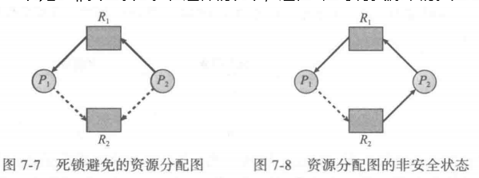

###### 银行家算法-多个实例

<u>思想</u>：

当一个新的进程进入系统时，它应声明可能需要的每种类型资源实例的最大数量，这一数量不能超过系统资源的总和。当用户申请一组资源时，系统应确定这些资源的分配是否仍会使系统处于安全状态。如果会，就可分配资源;否则，进程应等待，直到某个其他进程释放足够多的资源为止。

<u>数据结构</u>

这些数据结构对资源分配系统的状态进行了记录。我们需要以下数据结构，这里n为系统进程的数量,m为资源类型的种类:

- - Available :长度为m的向量，表示每种资源的可用实例数量。如果 Available[j]=k,那么资源类型Rj有k个可用实例。
  - Max :      nxm矩阵，定义每个进程的最大需求。如果Max[i] [j]= k，那么进程Pi最多可申请资源类型Rj的k个实例。
  - Allocation : n×m矩阵，定义每个进程现在分配的每种资源类型的实例数量。如果Allocation[i] [j]=k，那么进程Pi现在已分配了资源类型Rj的k个实例。
  - Need : nxm矩阵，表示每个进程还需要的剩余资源。如果 Need[i] [j]= k，那么进程Pi还可能申请k个资源类型Rj的实例。注意Need[i] [j]=Max[i] [j]-Allocation[i] [j]。这些数据结构的大小和值会随着时间而改变。

- 为了简化银行家算法的描述，下面采用一些符号。设X和Y为长度为n的向量。我们说:X≤Y当且仅当对所有i= 1，2，…，n，X[i]≤Y[i]。此外，如果Y≤X且Y≠X，那么Y<X。

- 可以将矩阵 Allocation和 Need 的每行作为向量，并分别用Allocationi和     Needi来表示。向量Allocationi表示分配给进程Pi的资源;向量 Needi表示进程为完成任务可能仍然需要申请的额外资源。

<u>安全算法</u>

- 现在我们介绍这个算法，以求出系统是否处于安全状态。该算法可以描述如下:

- - 1.令 Work和Finish分别为长度m和n的向量。对于i=0，1，…， n-1，初始化 Work =Available和 Finish[i] = false。

  - 2.查找这样的i使其满足

  - - a.Finish[i]== false
    - b. Needi≤Work
    - 如果没有这样的i存在,那么就转到第4步。

  - 3.Work = Work      +Allocationi

  - - Finish[i] = true
    - 返回到第2步。

  - 4.如果对所有i，Finish[i]= true，那么系统处于安全状态。

- 这个算法可能需要m×n^2数量级的操作，以确定系统状态是否安全。

<u>资源请求算法</u>

- 现在,我们描述判断是否安全允许请求的算法。

- 设Requesti为进程Pi的请求向量。如果Requesti[j]== k，那么进程Pi需要资源类型Rj的实例数量为k。当进程Pi作出这一资源请求时，就采取如下动作:

- - 1.如果Requcsti≤ Needi，转到第2步。否则，生成出错条件，这是因为进程Pi已超过了其最大需求。

  - 2.如果Requesti≤ Available，转到第3步。否则，Pi应等待，这是因为没有资源可用。

  - 3.假定系统可以分配给进程Pi请求的资源，并按如下方式修改状态:

  - - Available =  Available-Requesti
    - Allocationi = Allocationi+ Requesti
    - Needi = Needi-Requesti

- 如果新的资源分配状态是安全的，那么交易完成且进程Pi可分配到需要的资源。然而,如果新状态不安全，那么进程Pi应等待Requesti并恢复到原来的资源分配状态。

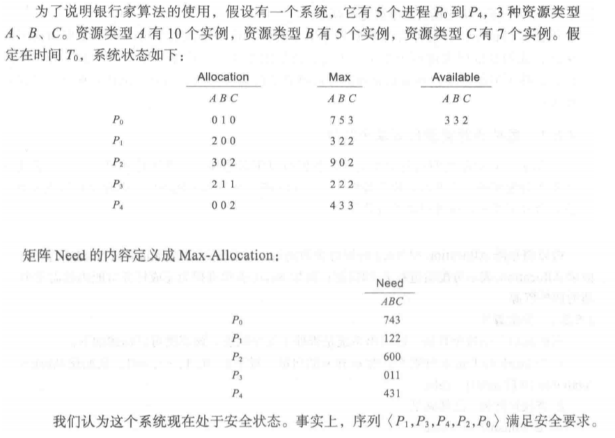

##### 死锁检测与恢复

如果一个系统既不采用死锁预防算法也不采用死锁避免算法，那么死锁可能出现。在这种环境下，系统可以提供:

- 一个用来检查系统状态从而确定是否出现死锁的算法;
- 一个用来从死锁状态中恢复的算法。

不过，这里需要注意，检测并恢复的方案会有额外开销，这些不但包括维护所需信息和执行检测算法的运行开销，而且也包括死锁恢复引起的损失。

###### 死锁检测算法-单个实例

- 如果所有资源类型只有单个实例，我们可以定义这样一个死锁检测算法，该算法使用了资源分配图的一个变形，称为等待( wait-for)图。从资源分配图中，删除所有资源类型节点，合并适当边，就可以得到等待图。

- 更确切地说，等待图的从Pi到Pj的边意味着:进程Pi等待进程Pj释放一个Pi所需的资源。

  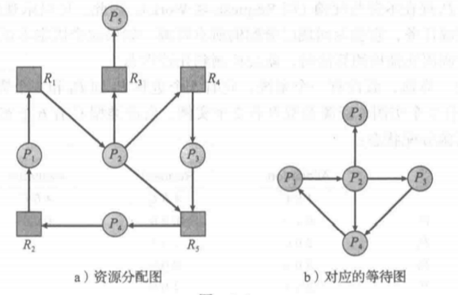

- 与以前一样，当且仅当在等待图中有一个环，系统死锁。为了检测死锁，系统需要维护等待图，并周期调用用于搜索图中环的算法。从图中检测环的算法需要n^2数量级的操作，其中n为图的节点数。

###### 死锁检测算法-多个实例

- 该算法使用了一些随时间而变化的数据结构，类似于银行家算法:

- - Available:长度为m的向量,表示各种资源的可用实例数量。
  - Allocation: n×m矩阵,表示每个进程的每种资源的当前分配数量。
  - Request:n×m矩阵，表示当前每个进程的每种资源的当前请求。如果Request[i] [j]=k，那么Pi现在正在请求资源类型Rj的k个实例。

- 两向量的≤关系与银行家定义的一样。为了简化起见，将Allocation和 Request的行作为向量，并分别称为Allocationi和Requesti。

- - 1.设Work 和 Finish分别为长度为m和n的向量。初始化 Work = Available。对i= 0,l，…，n-1，如果Allocationi不为0，则 Finish[i] = false;否则，Finish[i] = true。

  - 2.找这样的i，同时满足

  - - a. Finish[i]== false
    - b.Requesti≤ Work
    - 如果没有这样的i,则转到第4步

  - 3.Work = Work +Allocationi

  - - Finish[i] = true
    - 转到第2步。

  - 4.如果对某个i(0≤ i <n)，Finish[i]== false，则系统死锁。而且，如果Finish[i] ==false，则进程Pi死锁。

- 该算法需要m×n^2数量级的操作，来检测系统是否处于死锁状态。

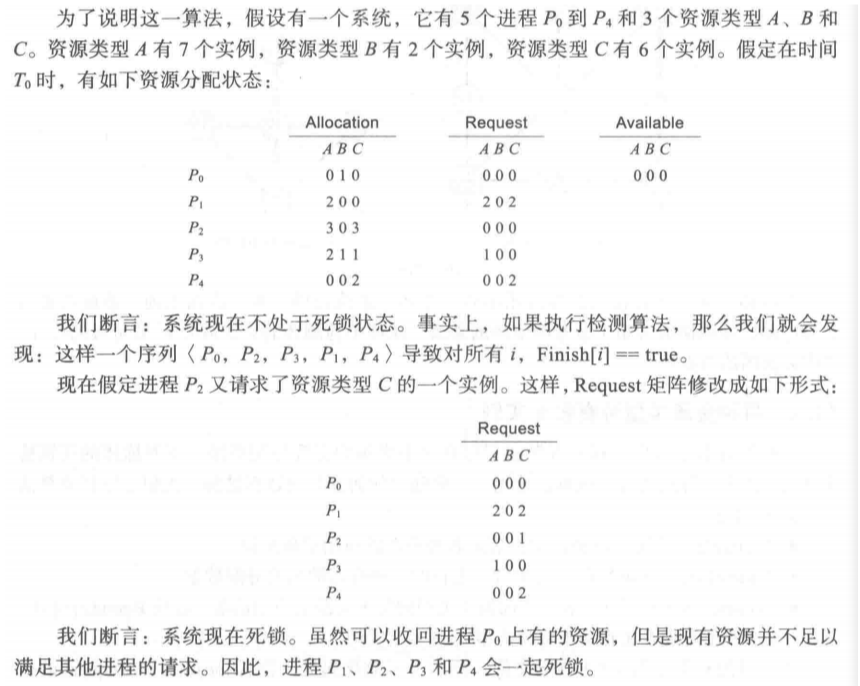

##### 死锁恢复

当检测算法确定已有死锁时，存在多种可选方案。一种可能是，通知操作员死锁已发生，并且让操作员人工处理死锁。另一种可能是，让系统从死锁状态中自动恢复(recover)过来。打破死锁有两个选择。一个是，简单地中止一个或多个进程来打破循环等待。另一个是，从一个或多个死锁进程那里抢占一个或多个资源。

### 虚拟内存技术

进程的虚拟地址空间就是进程如何在内存中存放的逻辑(或虚拟）视图

##### 背景

- 许多情况下不需要将整个程序放到内存中。例如:

- - 程序通常有处理异常错误条件的代码。这种代码几乎不执行。
  - 数组、链表和表通常分配了比实际所需要的更多的内存
  - 程序的某些选项或功能可能很少使用
  - 即使在需要完整程序时，也并不是同时需要所有的程序。

- 能够执行只有部分在内存中的程序可带来很多好处:

- - 程序不再受现有的物理内存空间限制。用户可以为一个巨大的虚拟地址空间(virtualaddress space）编写程序，简化了编程工作量。
  - 每个用户程序使用更少的物理内存，更多程序可以同时执行，CPU使用率也相应增加，而响应时间或周转时间并不增加
  - 由于载入或交换每个用户程序到内存内所需的IO会更少，用户程序会运行得更快。

##### 优点

- 虚拟内存技术允许执行进程不必完全在内存中，程序可以比物理内存大。而且，虚拟内存将内存抽象成一个巨大的、统一的存储数组，将用户看到的逻辑内存与物理内存分开。这允许程序员不受内存存储的限制，编程变得更加容易。
- 虚拟内存也允许进程容易地共享文件和地址空间（如系统库），还为创建进程提供了有效的机制，可以加快进程创建。

~~虚拟内存（virtual memory〉将用户逻辑内存与物理内存分开。物理内存有限情况下，为程序员提供了巨大的虚拟内存。虚拟内存使编程更加容易，因为程序员不需要担心可用的有限物理内存空间，只需要关注所要解决的问题。~~

##### 采用模式

###### 按需调页

对于按需调页虚拟内存，只有程序执行需要时才载入页，那些从未访问的页不会调入到物理内存。

*有效访问时间*=(1-p) ×ma +p ×页错误时间

###### 写时复制

这种方法允许父进程与子进程开始时共享同一页面。这些页面标记为写时复制页，即如果任何一个进程需要对页进行写操作，那么就创建一个共享页的副本

###### 页面置换

内存的过度分配会产生问题，所以需要有置换算法，对页面进行置换

### 内存管理

#### 基本硬件

CPU可以直接访问的通用存储只有内存和处理器内置的寄存器

确保该进程只能访问这些合法地址：通过两个寄存器，通常为基地址和界限地址，基地址寄存器base register)含有最小的合法的物理内存地址,而界限地址寄存器（ limit register)指定了范围的大小

内存空间保护的实现是通过CPU硬件对在用户模式下产生的地址与寄存器的地址进行比较来完成的。当在用户模式下执行的程序试图访问操作系统内存或其他用户内存时，会陷入操作系统,而操作系统则将它作为致命错误来处理。这种方案防止用户程序无意或故意修改操作系统或其他用户的代码或数据结构

只有操作系统可以通过特殊的特权指令，才能加载基地址寄存器和界限地址寄存器

在内核模式下执行的操作系统可以无限制地访问操作系统及用户的内存

#### 地址绑定

- 编译器通常将这些符号地址绑定( bind)到可重定位的地址。链接程序或加载程序再将这些可重定位的地址绑定到绝对地址。每次绑定都是从一个地址空间到另一个地址空间的映射。
- 通常，指令和数据绑定到存储器地址可在沿途的任何一步中进行:
  - 编译时（ compile time):如果在编译时就已知道进程将在内存中的驻留地址,那么就可以生成绝对代码（ absolute code)。
  - 加载时( load time):如果在编译时并不知道进程将驻留在何处，那么编译器就应生成可重定位代码( relocatable code)。对这种情况，最后绑定会延迟到加载时才进行。如果开始地址发生变化，那么只需重新加载用户代码以合并更改的值。
  - 执行时( runtime time):如果进程在执行时可以从一个内存段移到另一个内存段，那么绑定应延迟到执行时才进行。采用这种方案需要特定硬件才行。

编译时和加载时的地址绑定方法生成相同的逻辑地址和物理地址。然而，执行时的地址绑定方案生成不同的逻辑地址和物理地址

#### 动态加载

动态加载的优点是，只有一个程序被需要时，它才会被加载。可能虽然整个程序可能很大,但是所用的（和加载的)部分可能很小，可获得更好的内存空间利用率

#### 交换

进程必须在内存中以便执行。不过,进程可以暂时从内存交换( swap)到备份存储( backing store)，当再次执行时再调回到内存中。

交换有可能让所有进程的总的物理地址空间超过真实系统的物理地址空间,从而增加了系统的多道程序程度

标准交换在内存与备份存储之间移动进程

#### 管理方式

##### 连续内存分配

在采用连续内存分配( contiguous memory allocation)时,每个进程位于一个连续的内存区域，与包含下一个进程的内存相连

需要重定位寄存器（含有最小的物理地址值）和界限寄存器（含有逻辑地址的范围值）的保护，每个逻辑地址应在界限寄存器规定的范围内。

##### 分段

逻辑地址空间是由一组段构成。每个段都有名称和长度。地址指定了段名称和段内偏移。逻辑地址由有序对(two tuple）组成:<段号，偏移>

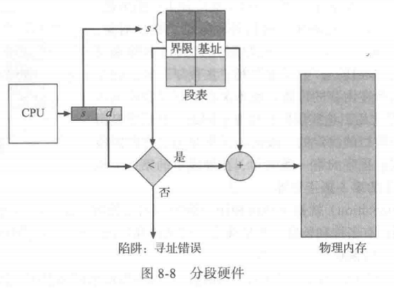

##### 分页

实现分页的基本方法涉及将物理内存分为固定大小的块，称为帧或页帧(frame);而将逻辑内存也分为同样大小的块，称为页或页面（ page)。当需要执行一个进程时，它的页从文件系统或备份存储等源处，加载到内存的可用帧。备份存储划分为固定大小的块，它与单个内存帧或与多个内存帧(簇)的大小一样。

由CPU生成的每个地址分为两部分:页码（ pagenumber)(p)和页偏移(page offset)(d)。页码作为页表的索引。页表包含每页所在物理内存的基地址。这个基地址与页偏移的组合就形成了物理内存地址，可发送到物理单元。

分页硬件支持

- 最为简单的一种方法是，将页表作为一组专用的寄存器来实现，但不适合页表很大的情况
- 将页表放在内存中，并将页表基地址寄存器（Page-TableBase Register，PTBR)指向页表，改变页表只需要改变这一寄存器就可以，这也大大降低了上下文切换的时间，但需要访问内存两次，延迟严重
- 采用专用的、小的、查找快速的高速硬件缓冲，它称为转换表缓冲区（Translation Look-aside Buffer，TLB)，结合页表一起使用----高效     TLB的有效访问时间=（访问内存时间 + 访问页表TLB时间）* 命中率 +（访问内存时间 * 2 + 访问TLB时间）*（1 - 命中率）

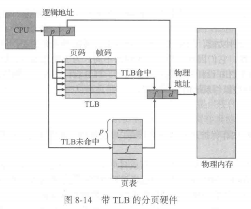

#### 页表结构

##### 分层分页

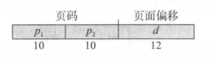

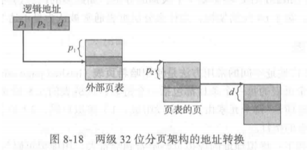

##### 哈希页表-常用

哈希页表的每一个条目都包括一个链表，该链表的元素哈希到同一位置(该链表用来解决处理碰撞)。每个元素由三个字段组成:1)虚拟页码，2)映射的帧码，3）指向链表内下一个元素的指针

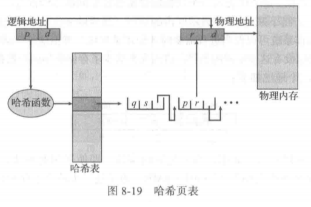

##### 倒置页表-查找时间长，共享困难

对于每个真正的内存页或帧，倒置页表才有一个条目。每个条目包含保存在真正内存位置上的页的虚拟地址，以及拥有该页进程的信息。因此，整个系统只有一个页表，并且每个物理内存的页只有一条相应的条目

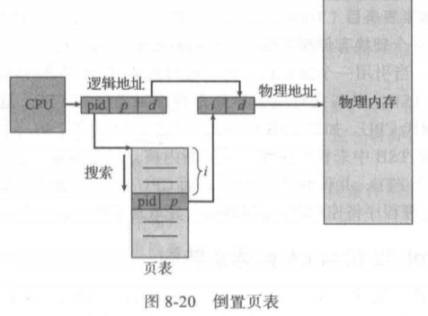

#### 碎片

##### 分类

###### 外部碎片

用于内存分配的首次适应和最优适应算法都有外部碎片( external fragmentation)的问题。随着进程加载到内存和从内存退出，空闲内存空间被分为小的片段。当总的可用内存之和可以满足请求但并不连续时，这就出现了外部碎片问题:存储被分成了大量的小孔。

###### 内部碎片

按固定大小的块为单位(而不是字节)来分配内存。采用这种方案，进程所分配的内存可能比所需的要大。这两个数字之差称为内部碎片(internal fragmentation)，这部分内存在分区内部，但又不能用。

##### 解决方法

外部碎片问题的一种解决方法是紧缩( compaction)。它的目的是移动内存内容，以便将所有空闲空间合并成一整块。然而，紧缩并非总是可能的。如果重定位是静态的，并且在汇编时或加载时进行的，那么就不能紧缩。只有重定位是动态的（换入与换出后的地址可以不同），并且在运行时进行的，才可采用紧缩。

外部碎片化问题的另一个可能的解决方案是:允许进程的逻辑地址空间是不连续的;这样，只要有物理内存可用，就允许为进程分配内存。有两种互补的技术可以实现这个解决方案:分段和分页。这两个技术也可以组合起来。

### 调度

进程在整个生命周期中，会在各种调度队列之间迁移。操作系统为了调度必须按一定方式从这些队列中选择进程。进程选择通过适当调度器或调度程序来执行。

#### 调度队列

进程在进入系统时，会被加入到作业队列中，这个队列包括系统内的所有进程。

##### 就绪队列

驻留在内存中的、就绪的、等待运行的进程保存在就绪队列中，等待CPU调度，这个队列通常用链表实现，其头节点有两个指针，用于指向链表的第一个和最后一个PCB块，每个PCB还包括一个指针，指向就绪队列的下一个PCB。

##### 设备队列

系统还有其他队列，当一个进程被分配了CPU后，他执行一段时间，最终退出，或者被中断，或者等待特定事件发生如I/O请求的完成。等待特定I/O设备的进程列表，称为设备列表，每个设备都有自己的设备队列。

#### 分类

通常，对于批处理系统，提交的进程多于可以立即执行的。这些进程会被保存到大容量存储设备（通常为磁盘）得缓冲池，以便以后执行。

##### 长期

长期调度程序或作业调度程序从该池中选择进程加到内存以便执行。

##### 短期

短期调度程序或<u>CPU调度程序</u>从准备执行的进程中选择进程，并分配CPU。

##### 中期

有的操作系统如分时系统，可能引入一个额外的中期调度程序。中期调度程序的核心思想是可将进程从内存中（或从CPU竞争）移出，从而降低多道程序程度。之后，进程可被重新调入内存，并从中断处继续执行。这种方案称为交换。

#### 三者比较

长期和短期调度程序的主要区别就是执行频率。

##### 短期

短期调度程序必须经常为CPU选择新的进程。进程可能执行几毫秒，就会等待I/O请求。通常，短期调度程序每100ms至少执行一次，由于执行的时间短，短期调度程序必须快速。如果花费10ms来确定执行一个运行100ms的进程，那么10/(100+10)=9%的CPU时间就会浪费在调度工作上。

##### 长期

长期调度程序执行并不频繁，在新进程的创建之间，可能有几分钟间隔。长期调度程序控制多道程序程度，也就是内存中的进程数量。如果多道程序程度稳定那么创建进程的平均速度必须等于进程离开系统的平均速度。因此，只有在进程离开系统时，才需要长期调度程序的调度。由于每次执行之间的更长时间间隔长期调度程序可以负担起更多时间，以便决定应该选择执行哪个进程。

重要的是，长期调度程序必须认真选择，I/O密集型进程，执行I/O比执行计算需要花费更多时间，相反，CPU密集型进程很少产生I/O请求，而是将更多的时间用于执行计算。因此为了使得性能最佳，系统的长期调度程序应该选择I/O密集型和CPU密集型的合理进程组合。如果所有进程都是I/O密集型的，那么就绪队列几乎总是空的，从而短期调度程序没有什么进程可做，如果所有的进程都是CPU密集型的，那么I/O等待队列几乎总是为空，从而设备没有得到使用，系统会不平衡。

##### 中期

通过中期调度程序，进程可换出，并在后来可换入。为了改善进程组合，或者由于内存需求改变导致过度使用内存从而需要释放内存，就有必要使用交换。

#### CPU-I/O执行周期burst

进程执行包括周期进行CPU执行和io等待，burst实际就是指的时间

#### 调度准则

CPU使用率：应使CPU尽可能的忙碌。对于一个实际系统，它的范围应从40%（轻负荷系统）到90%（重负荷系统）。

吞吐量：一个时间单元内进程完成的数量，对于长进程，吞吐量可能为每小时一个进程；对于短进程，吞吐量可能为每秒10个进程。

周转时间：从进程提交到进程完成的时间段称为周转时间turnaround time，周转时间为所有时间段之和，包括等待进入内存、在就绪队列中等待、在CPU上执行和i/o执行。

等待时间：等待时间为在就绪队列中等待所花的时间之和。

响应时间：因此另一时间是从提交请求到产生第一响应的时间，称为响应时间

### 状态变迁

#### 状态分类

进程在执行时会改变状态，进程状态部分取决于进程的当前活动，状态有如下

新的：进程正在创建

运行：指令正在执行

等待：进程等待发生某个事件（如I/O完成或收到信号）

就绪：进程等待分配处理器

终止：进程已经完成执行

重要的是认识到：一次只能有一个进程可在处理器上运行，但许多进程可处在就绪或等待状态。

#### 变迁图

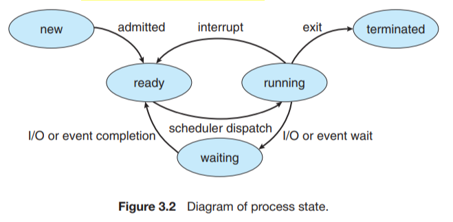

最初，新进程被加到就绪队列中，等待，直到被选中执行或被分配，当该进程分配到CPU执行时，以下事件可能发生：

- 进程可能发出I/O请求，并被放到I/O队列
- 进程可能创建一个新的子进程，并等待其终止
- 进程可能由于中断而被强制释放CPU，并被放回到就绪队列

对于前两种情况，进程最终从等待状态切换到就绪状态，并放回到就绪队列，进程重复这一循环直到终止，然后它会从所有队列中删除，释放他的CPU和资源。

### 同步操作

#### 临界区

每个进程有一个代码段称为临界区(critical section)，在该区中进程可能改变共同变量、更新一个表、写一个文件等。

#### 临界区三要求

互斥(mutual exclusion):如果进程P在其临界区内执行，那么其他进程都不能在其临界区内执行。

前进(progress)空闲让进:如果没有进程在其临界区内执行且有进程需进入临界区，那么只有那些不在剩余区内执行的进程可参加选择，以确定谁能下一个进入临界区，且这种选择不能无限推迟。CPU至少有一个可选

有限等待(bounded     waiting):从一个进程做出进入临界区的请求，直到该请求允许为止，其他进程允许进入其临界区的次数有上限。任何一个不能永久等待

#### 原子操作

##### wait

等待信号量（计数）或者互斥量（二进制信号量）

##### signal

释放信号量（计数）或者互斥量（二进制信号量）

#### 经典同步问题

##### 有界缓冲

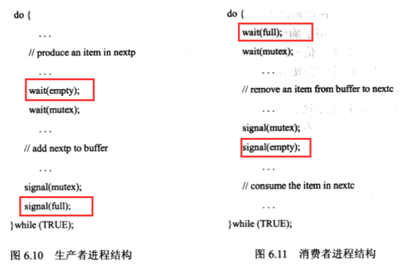

##### 读写者问题

第一读写者问题-读者优先

第二读写者问题-写者优先

下面是第一问题的代码

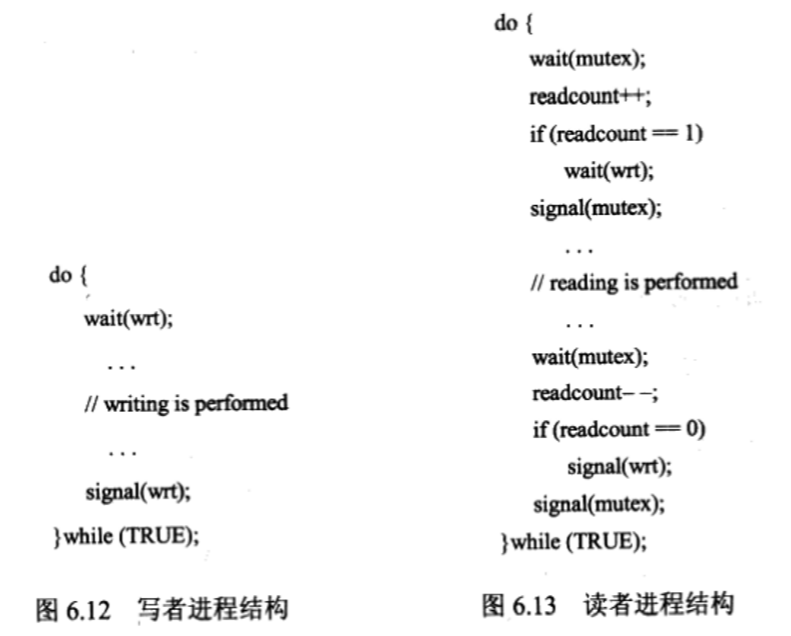

##### 哲学家就餐问题

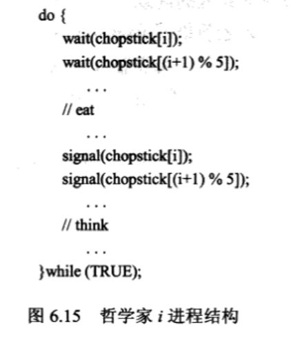

- 存在问题

- - 如果五个哲学家同时拿起左边筷子，那么就会出现死锁，一直等待；

- 解决方法

- - 最多只允许4个哲学家同时坐在桌子上。
  - 只有两只筷子都可用时才允许一个哲学家拿起它们（他必须在临界区内拿起两只筷子)。
  - 使用非对称解决方法，即奇数哲学家先拿起左边的筷子，接着拿起右边的筷子，而偶数哲学家先拿起右边的筷子，接着拿起左边的筷子。

### 算法

#### 进程调度算法-甘特图

##### 先到先服务调度（等待时间长）

采用这种方案，先请求CPU的进程首先分配到CPU。FCFS策略可以通过FIFO队列容易的实现。

FCFS策略的缺点是，平均等待时间往往很长。由于所有其他进程都等待一个大进程释放CPU，称这种情况护航效果convoy effect

也要注意FCFS调度算法是非抢占的

##### 最短作业优先调度（等待时间短，但是存在饥饿）

这个算法将每个进程与其下次CPU执行的长度关联起来。当CPU变为空闲时，他会被赋给具有最短CPU执行的进程。如果2个进程具有同样长度的CPU执行，那么可以由FCFS来处理

可以证明SJF调度算法是最优的。SJF算法的平均等待时间最小。通常将短进程移到长进程之前，短进程的等待时间减少大于长进程的等待时间增加。因而，平均等待时间减少。

SJF调度经常用于长期调度

SJF算法可以是抢占的或非抢占的，抢占SJF算法就会抢占当前运行进程，而非抢占SJF算法会允许当前运行进程可以先完成CPU执行，抢占SJF调度有时称为最短剩余时间优先shortest-remaining-time-first调度

##### 优先级调度算法

每个进程都有一个优先级与其关联，而只有最高优先级的进程会分配到CPU。相同优先级的进程按FCFS顺序调度。

优先级调度算法的一个主要问题是无穷阻塞indefinite blocking或饥饿starvation。

无穷等待问题的解决方案之一是老化aging。老化逐渐增加在系统中等待很长时间的进程的优先级。可以选择每隔多长时间提升等待进程的优先级

##### 轮转调度

轮转调度算法是专门为分时系统设计的。将一个较小时间单元定义为时间量time quantum或时间片time slice。时间片的大小通常为10到100毫秒。就绪队列作为循环队列。CPU调度程序循环整个就绪队列，为每个进程分配不超过一个时间片的CPU。

如果进程的CPU执行超过一个时间片，那么该进程就会被抢占，并被放回到就绪队列中，因此，RR调度算法是抢占的。

RR算法的性能很大程度上取决于时间片的大小，在一种极端情况下，如果时间片很大，那么RR算法就与FCFS算法一样，如果时间片很小，那么RR算法可能导致大量的上下文切换。

##### 多级队列调度-调度开销低，但是不够灵活

多级队列调度算法（multilevel queue）将就绪队列分成多个单独队列，一个进程永久的分配到一个队列，每个队列都有自己的调度算法，

此外队列之间应有调度，通常采用固定优先级抢占调度

另一种可能是，在队列之间划分时间片，每个队列都有一定比例的CPU时间，可用于调度队列内的进程，但是不同的队列，时间比例不同

##### 多级反馈队列调度

多级反馈队列（multilevel feedback queue）调度算法允许进程在队列间迁移

在较低优先级队列中等待过长的进程会被移到更高优先级队列，这种形式的老化阻止饥饿的发生

多级反馈队列调度程序的定义使其成为最通用的CPU调度算法，也是最复杂的算法。

#### 动态存储分配算法

动态存储分配问题(dynamic     storage-allocation problem)从一组可用孔中选择一个空闲孔的方法包括:首次适应(first-fit)、最优适应(best-fit)及最差适应（worst-fit)。

##### 首次适应

首次适应:分配首个足够大的孔。查找可以从头开始（首次适应，一般是这个），也可以从上次首次适应（下次适应）结束时开始。一旦找到足够大的空闲孔,就可以停止。

##### 最优适应

最优适应:分配最小的足够大的孔。这种方法可以产生最小剩余孔。（空间最优，时间多）

##### 最差适应

最差适应:分配最大的孔。这种方法可以产生最大剩余孔，但是该空的剩余空间大，可可重用性大。（空间时间均不优）

首次适应和最优适应在执行时间和利用空间方面都好于最差适应。首次适应和最优适应在利用空间方面难分伯仲,但是首次适应要更快些。

#### 页面置换算法

注意最开始冷不命中错误

##### FIFO页置换

FIFO页置换算法为每个页记录着该页调入内存的时间。当必须置换一页时，将选择最旧的页。

FIFO页置换算法容易理解和实现。其性能并不总是很好。所替代的页可能是很久以前使用的、现已不再使用的初始化模块。也可能包含一个以前初始化的并且不断使用的常用变量。一个不好的替代选择会增加页错误率，减慢进程执行，但是并不会造成不正确执行。

存在Belady 异常

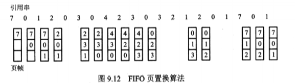

##### 最优置换

它会置换最长时间不会使用的页

产生页错误率最低的,且绝没有Belady 异常的问题

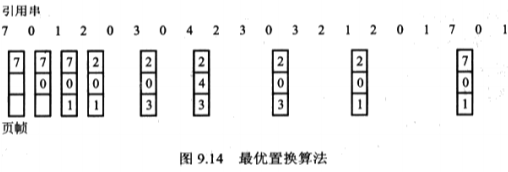

##### LRU页置换

如果使用离过去最近作为不远将来的近似，那么可置换最长时间没有使用的页，这种方法称为最近最少使用算法

需要一定的硬件支持，有两种可行实现:时间的计数器或页的使用情况的栈

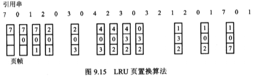

近似LRU页置换

附加引用位算法，二次机会算法，增强型二次机会算法

基于计数的页置换

页缓冲算法

这几个应该都不会考

#### 磁盘调度算法

##### FCFS调度

最简单的磁盘调度形式当然是先来先服务算法(FCFS)

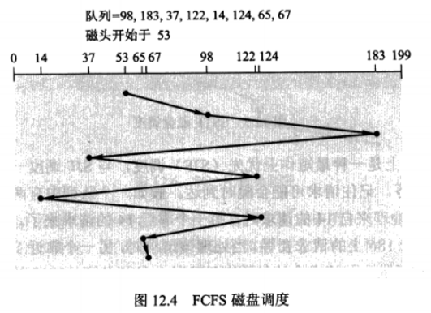

##### SSTF调度

最短寻道时间优先算法（shortest-seek-time-first，SSTF）选择距当前磁头位置由最短寻道时间的请求来处理

大大提高了性能，但是并不是最优的

会导致一些请求得不到服务

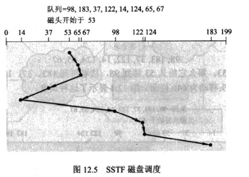

##### SCAN调度

对于SCAN算法，磁臂从磁盘的一端向另一端移动，同时当磁头移过每个柱面时，处理位于该柱面上的服务请求。当到达另一端时，磁头改变移动方向，处理继续

不但需要知道磁头当前位置(53)，还需知道磁头移动方向

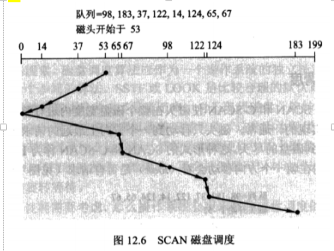

##### C-SCAN算法

与SCAN一样，C-SCAN将磁头从磁盘一端移到磁盘的另一端，随着移动不断地处理请求。不过，当磁头移到另一端时，它会马上返回到磁盘开始，返回时并不处理请求

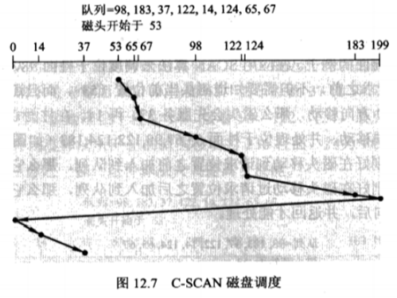

##### LOOK算法和C-LOOK算法

通常，磁头只移动到一个方向上最远的请求为止。接着，它马上回头,而不是继续到磁盘的尽头

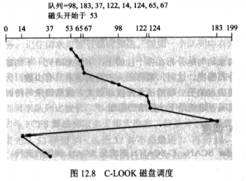

##### 一般选择

SSTF较为普通且很有吸引力,因为它比FCFS 的性能要好。SCAN和 C-SCAN对于磁盘负荷较大的系统会执行得更好，这是因为它不可能产生饿死问题。

#### 文件空间分配算法

##### 连续分配

连续分配（contiguous allocation）方法要求每个文件在磁盘上占有一组连续的块。磁盘地址为磁盘定义了一个线性序列。因此，用于访问连续分配文件所需要的寻道数最小，在确实需要寻道时所需要的寻道时间也最小。

文件的连续分配可以用第一块的磁盘地址和连续块的数量来定义

连续分配支持顺序访问和直接访问

一个困难是为新文件找到空间，有外部碎片（ external fragmentation）问题

连续分配的另一个问题是确定一个文件需要多少空间，如果为一个文件分配太小的空间，那么可能会发现文件不能扩展

##### 链接分配

采用链接分配，每个文件是磁盘块的链表;磁盘块分布在磁盘的任何地方。目录包括文件第一块的指针和最后一块的指针。每一块都有一个指向下一块的指针。

采用链接分配没有外部碎片，空闲空间列表上的任何块可以用来满足请求

只能有效地用于文件的顺序访问，不能有效地支持文件的直接访问

另一缺点是指针需要空间

常用解决方法是将多个块组成簇（cluster)，并按簇而不是按块来分配

另一个问题是可靠性，指针丢失或损坏

一个采用链接分配方法的变种是文件分配表（FAT)的使用

链接分配解决了连续分配的外部碎片和大小声明问题

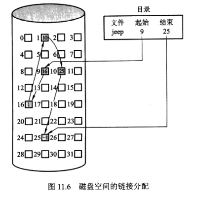

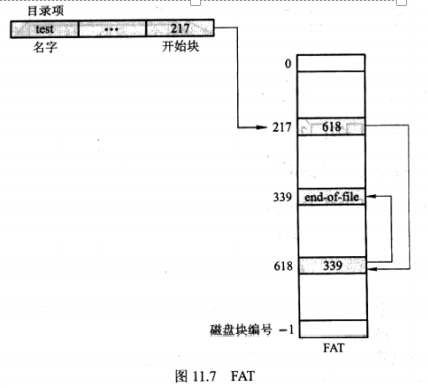

##### 索引分配

索引分配（ indexed allocation〉通过把所有指针放在一起，即通过索引块解决了有效支持直接访问这个问题。

每个文件都有其索引块，这是一个磁盘块地址的数组。索引块的第i个条目指向文件的第i个块。目录条目包括索引块的地址。要读第i块，通过索引块的第i个条目的指针来查找和读入所需的块。

索引分配支持直接访问，且没有外部碎片问题

索引分配会浪费空间。索引块指针的开销通常要比链接分配指针的开销大

一个问题:索引块究竟应为多大

三个解决机制

链接方案:一个索引块通常为一个磁盘块。可以将多个索引块链接起来，下一个地址（索引块的最后一个词）为nil（对于小文件)或指向另一个索引块(大文件)

多层索引:链接表示的一种变种是用第一层索引块指向一组第二层的索引块，第二层索引块再指向文件块

组合方案

将索引块的头15个指针存在文件的inode中。这其中的头12个指针指向直接块，其他3个指针指向间接块：一级间接块，二级和三级

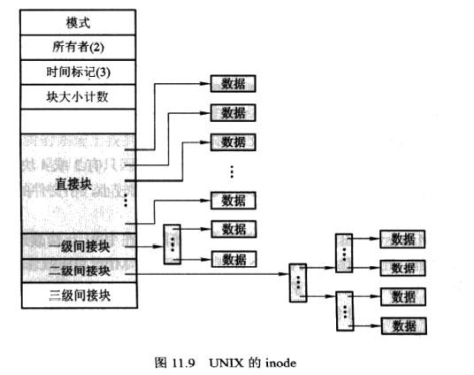

