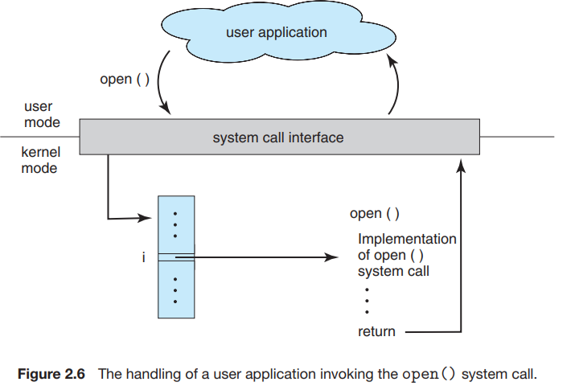
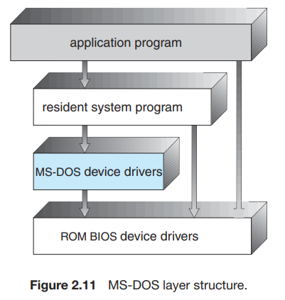
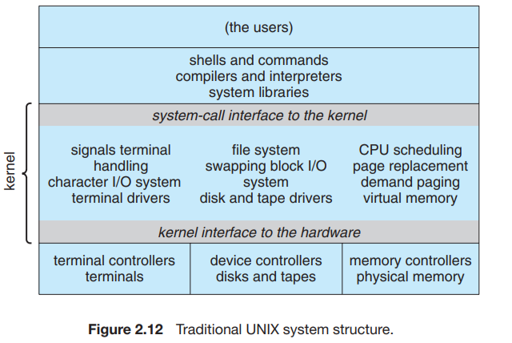
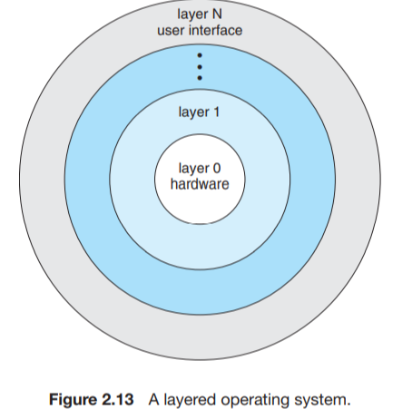
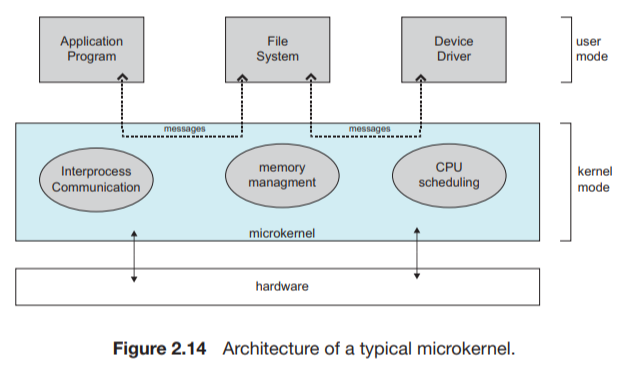
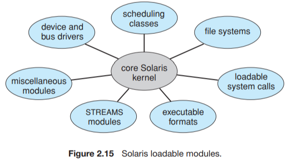
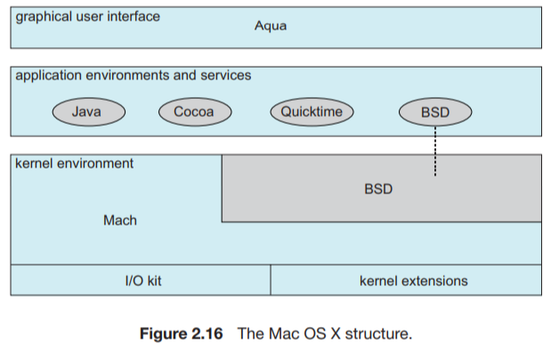
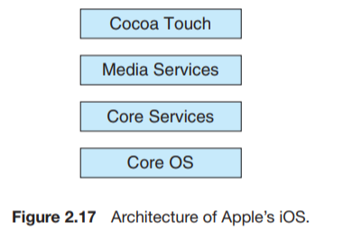
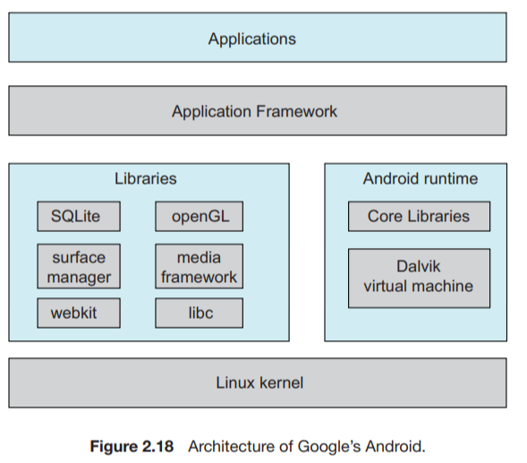

# 操作系统结构

## 操作系统的服务

### 用户服务

操作系统有一套服务，用于提供用户功能：

- 用户界面：

几乎所有操作系统都有用户界面user interface，UI；

这种界面有多种形式：

1. 命令行界面command-line interface,CLI，它采用文本命令，并用某一方法输入；
2. 批处理界面batch interface，命令以及控制这些命令的指令可以编成文件以便执行；
3. 图形用户界面graphical user interface,GUI，最常用，是一种视窗系统，具有通过定位设备控制I/O，通过菜单选择，通过键盘输入文本和选择等；

- 程序执行program execution

系统应能加载程序到内存，并运行load a program into memory and to run that program，程序应能够结束执行，包括正常或者不正常；

- I/O操作I/O operation

操作系统需要提供手段以便执行I/O

- 文件系统操作file-system     manipulation

操作系统提供多种文件系统，有的允许个人选择，有的提供特殊功能或性能

- 通信communication

一个进程可能需要与另一个进程交换信息；

通信实现可以通过内存共享shared memory，也可以通过消息交换message passing,前者为两个或多个进程共享内存区域，后者符合预先定义格式的信息分组可以通过操作系统在进程之间移动；

- 错误检测error detection

操作系统需要不断检测错误和更正错误，对于每类错误，操作系统必须采取适当动作，确保计算的正确和一致

###  系统服务

还有一组操作系统服务是为了确保系统本身运行高效，多用户系统可以通过共享计算机资源提高效率

- 资源分配resource     allocation

当多个用户或多个作业同时运行时，每个都应分配资源，操作系统管理许多不同类型的资源

- 记账accounting

记录用户使用资源的类型和数量

- 保护和安全protection and     security

保护应该确保可以控制系统资源的所有访问，安全要求用户向系统认证自己，以获得系统资源的访问权限，安全还包括保护外部I/O设备不受非法访问，并记录所有非法的闯入企图

 

## 用户与操作系统的界面

### 1、命令解释程序command interpreters

- 对于具有多个可选命令解释程序的系统，解释程序称为外壳shell
- 命令解释程序的主要功能是，获取并执行用户指定的下一条命令，提供了许多命令来操作文件：创建，删除，列出，打印，复制，执行等等。

### 2、图形用户界面graphical user interface GUI

- 用户不是通过命令行界面直接输入命令，而是利用桌面desktop概念，即采用基于鼠标的视窗和菜单系统window-and-menu     system；

### 3、界面的选择

- 取决于个人喜好
- 管理计算机的系统管理员system     administrator和了解系统很透彻have deep knowledge of a system的高级用户power user经常使用命令行界面

 

## 系统调用system calls

### 概念

- 系统调用提供操作系统服务接口，这些调用通常以C或C++编写，当然，某些底层low-level任务（如需直接访问硬件hardware must be     accessed directly的任务），可能应以汇编语言指令assembly-language instructions编写
- 即使简单程序也可能大量使用make heavy use of操作系统，通常，系统每秒执行成千上万的系统调用
- 通常，应用程序开发人员application     developers根据应用编程接口application programming interface,API，来设计程序，API为方便应用程序员规定了一组函数，包括每个函数的输入参数parameters和返回值return values
- 在后台，API函数通常为应用程序员application     programmer调用实际的系统调用

- 对大多数的程序设计语言，运行时支持系统the run-time     support system（由编译器直接提供的函数库a set of functions）提供了系统调用接口system-call     interface，以链接到操作系统的系统调用，系统调用接口intercepts截取API函数的调用，并调用invokes操作系统中的所需系统调用
- 调用者无需知道know nothing about如何实现implements系统调用，而只需obey遵循API，并知道在调用系统调用之后操作系统做了什么，因此，通过API，操作系统接口的大多数细节most of the details可隐藏hide     from起来，并且可有运行时库the run-time support library来管理

### 传递参数

向操作系统传递参数pass parameters有三种常用方法：

- 通过寄存器，最简单，不过，有时参数数量会比寄存器多，
- 这时参数通常存放在内存的块与表block or table中，而块或表的地址通过寄存器来传递
- 放在placed或压入pushed到堆栈stack中，并通过操作系统弹出poped
- 第二个和第三个方法approaches不限制limit     the number or length传递参数的数量或长度

 

### 系统调用的六大类型

#### 进程控制 process control

- 结束、中止end(), abort()
- 加载、执行 load(), execute()
- 创建进程、终止进程
- 获取进程属性、设置进程属性
- 等待时间
- 等待事件、信号事件
- 分配和释放内存

#### 文件管理 file manipulation

- 创建文件、删除文件create delete
- 打开、关闭
- 读、写、重新定位reposition
- 获取文件属性、设置文件属性get_file_attributes(),     set_file_attributes

#### 设备管理 device manipulation

- 请求设备、释放设备request(),     release()
- 读、写、重新定位
- 获取设备属性、设置设备属性
- 逻辑附加或分离设备

#### 信息维护 information manitenance

- 获取时间或日期、设置时间或日期time() and date()
- 获取系统数据、设置系统数据
- 获取进程、文件或设备属性
- 设置进程、文件或设备属性

#### 通信 communication

- 创建、删除通信连接open_connection()
- 发送、接收消息
- 传送状态信息
- 附加或分离远程设备

#### 保护 protection

设置资源权限 set_permission(), get_permission 

允许和拒绝特定用户访问资源 allow_user(), deny_user()

 

## 系统程序

现代操作系统的另一特点是一组系统程序

系统程序system program 也称为系统工具system utility, 为程序开发和执行提供了一个方便的环境

系统程序类型：

- 文件管理：

这些程序创建、删除、复制、重新命名、打印、转储dump、列出、操作文件和目录

- 状态信息：status information

得到各种状态信息，比如时间，日期，内存等等

- 文件修改：file modification

创建修改文件，查找文件内容，文本转换

- 程序语言支持：programming-language     support

常用语言的的编译程序，汇编程序assemblers，测试程序debuggers，和解释程序interpreters

- 程序加载与执行：program loading     and execution

系统提供绝对加载程序，重定位加载程序，链接编辑器，覆盖式加载程序，还提供高级语言的或机器语言的调试程序

- 通信：

这些程序提供在进程、用户和计算机系统之间创建虚拟连接的机制

- 后台服务：background     services

一直运行的系统进程，称为服务service、子系统subsystem或守护进程daemons

 

## 操作系统的设计与实现

### 设计目标

- 用户目标user     goal ：

用户要求系统具有一定的优良性能：系统应该便于使用、易于学习和使用、可靠、安全和快速

- 系统要求system     goal:

操作系统应该易于设计、实现和维护、也应灵活、可靠、正确且高效

### 机制与策略

1. 一个重要的原则就是策略policy和机制mechanism的分离
2. 机制决定如何做how to do someting，策略决定做什么what will be done，例如定时器就是一种保护CPU的机制，但是为了某个特定用户应将定时器设置成多长时间，这就是个策略问题
3. 对于灵活性flexibility，策略与机制的分离至关重要，策略可随时间或地点而改变，在最坏情况下，每次策略的改变都可能只需要改变底层机制underlying mechanism，对策略不敏感的通用机制将是更可取的，这样策略的改变就只需要重新定义一些系统参数。

### 实现implementation

- 采用高级语言或至少系统实现语言来实现操作系统的优势与用高级语言来编写应用程序相同：代码编写更快，更为紧凑compact，更容易理解和调试；另外，编译技术的改进使得只要通过重新编译，就可以改善整个操作系统的生成代码；最后，采用高级语言，操作系统容易移植到其他硬件。
- 采用高级语言的缺点仅仅在于速度的降低和存储的增加reduced speed and increased storage requirements
- 与其他操作系统一样，操作系统的重大性能改善很可能是来源于更好的数据结构和算法better data     structure and algorithm，并不是优秀的汇编语言代码；
- 操作系统虽然很大，但是只有一小部分代码是对高性能high performance很关键critical的：中断处理器、I/O管理器、内存管理器、以及CPU调度器；
- 在系统编写完成并能正确工作后，可找出瓶颈程序，并用相应的汇编语言程序来替换；

 

## 操作系统的结构

### 简单结构 

#### MS-DOS 

- 利用最小空间而提供最多功能，因此并没有被仔细划分成模块；
- 没有很好的区分功能的接口与层次；interfaces and      levels of functionality are not well saperated
- 应用程序能够直接访问基本的I/O程序，并直接写到显示器和磁盘驱动，这种自由使得MS-DOS易受错误或恶意程序errant or malicious programs的伤害vulnerable，因此，用户程序出错回导致整个系统奔溃crash；
- 当然此系统还受限于当时的硬件；

#### 最初的Unix操作系统

- 采用有限结构；
- 分内核和系统程序；
- 系统调用接口之下和物理硬件之上的所有部分称为内核，内核通过系统调用，可提供文件系统，CPU调度内存管理和其他操作系统功能，总的来说，这一层包括了大量功能；
- 这种单片机结构使得UNIX难以实现与设计；
- 独特性能优势：系统调用接口和内核通信的开销overhead非常小，UNIX，Linux，Windows仍然采用这种简单的单片机结构；

### 分层方法

- 有了适当的硬件支持，操作系统可以分成很多块，这些块更小更合适，这使得操作系统可以更好的控制计算机和使用计算机的应用程序；

- 模块化方法-----分层法layered approach

- 1. 将操作系统分成若干层（级），最低层为the bottom layer硬件，最高层the highest layer为用户接口
  2. 采用抽象对象，以包括这些数据和操纵这些数据的操作，每一层包括数据结构的一组可为更高层所调用的程序集，而这一层可调用invoke更低层的操作
  3. 优点：简化了构造和调试simplicity of      construction and debugging，所选层次要求每层只能调用更低层的功能和服务；每层要为更高层隐藏一定的数据结构、操作和硬件
  4. 难点：在于合理定义各层，有必要仔细规划；效率稍差less efficient；

### 微内核

- 微内核microkernel技术对内核进行模块化

- 从内核中删去所有不必要的部件，而将他们当作系统级与用户级的程序来实现，内核更小

- 主要功能：为客户端程序和运行在用户空间中的各种服务提供通信，通过消息传递message passing来实现；

- 优点：

- - 便于扩展操作系统，所有新服务可在用户空间内增加，不需要修改内核，需要修改，所做修改也小；
  - 很容易从一种硬件平台移植到另一种硬件平台；
  - 提供了更好的安全性和可靠性，这是由于大大多数服务是作为用户进程而不是内核进程来运行的，如果一个服务出错，其他部分不会受影响

- 遗憾的是，由于增加的系统功能的开销，微内核的性能会受损

### 模块

- 目前，实现操作系统的最好方法就是采用可加载的内核模块loadable kernel module
- 这里，内核有一组核心组件，无论启动或运行时，内核都可以通过模块链入额外服务
- 设计思想是：内核提供核心服务，而其他服务可在内核运行时动态实现
- 比分层系统更灵活，任何模块都可以调用其他任何模块；
- 比微内核更加有效，模块无需调用消息传递来进行通信
- 常见于现代UNIX，Solaris, Linux，Mac OS X, Windows的实现
- 七种类型的可加载内核模块

调度类、文件系统、可加载系统调用、可执行格式、STREAMS模块、其他模块、设备和总线驱动程序

### 混合系统

#### MAC OS X 

- 顶层包括Aqua用户界面以及一组应用程序环境与服务，特别是Cocoa环境规定了用于Object-C编程语言的API，以编写Mac OS X的应用程序
- 下面是内核环境kernel environment，它主要包括Mach微内核和BSD UNIX内核

#### 两个移动操作系统

 iOS

- Cocoa Touch 支持移动设备的都有硬件，如触摸屏
- 媒体服务提供图形、音频和视频方面的服务
- 核心服务提供多种功能，包括云计算和数据库
- 核心操作系统基于内核环境

 Android

- Linux主要用于支持进程、内存以及硬件设备的驱动程序，且已经增加了电源管理
- 运行环境包括一套核心库以及Dalvik 虚拟机
- 应用程序库包括用于开发web浏览器的框架（webkit）、数据库支持（SQLite）以及多媒体等

## 操作系统的生成

- 对于某个特定的计算机场所，应配置configure和生成操作系统，这一过程有时称为系统生成。SYStem GENeration (SYSGEN)
- 操作系统的发行通常采用磁盘、CD-ROM、DVD-ROM、或“IOS”镜像image（采用CD-ROM或DVD-ROM格式化的文件）；
- 为了生成操作系统，使用一个特殊的SYSGEN程序，这个程序从给定文件读取或询问系统操作员有关硬件系统的特定配置specific     configuration，或直接检测硬件以决定determine有什么部件components；

 

## 系统引导

- 加载内核以启动计算机的过程，称为系统引导booting；
- 大多数计算机系统都有一小块代码，称之为引导程序bootstrap program或引导加载程序bootstrap loader；这段代码能够定位内核，并加载到内存以开始执行；
- 有的计算机（如PC）采用两个步骤：一个简单引导程序从磁盘上调用一个更复杂的引导程序，而后者再加载内核；
- 当CPU收到一个重置事件时，例如重启，上电开机，指令寄存器会加载某个预先定义的内存位置，并从该位置开始执行，该位置就是初始引导程序所在，这个程序为只读存储器Read-only Memory,ROM,形式；关机不丢失

