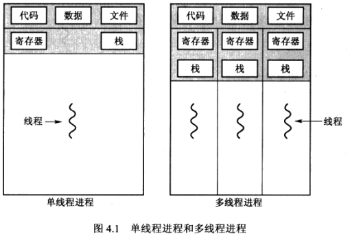
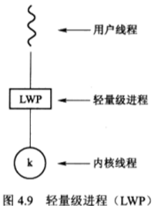

# 多线程编程

## 概述

### 导言

- 每个线程是CPU使用的一个基本单元：它包括线程ID、程序计数器、寄存器组和堆栈。他与同一进程的其他线程共享代码段、数据段和其他操作系统资源。每个传统或重量级进程只有单个控制线程，如果一个进程具有多个控制线程，那么它能同时执行多个任务。

### 动机

- 有时需要并行执行多个任务，但是创建一个新的进程要比创建一个新的线程会耗费更多的资源和时间；服务器就可以同时监听多个请求；并且大多数的操作系统内核现在都是多线程的，每个线程执行一个特定任务；

### 优点

- 响应性：如果一个交互程序采用多线程，那么即使部分阻塞或者执行冗长操作，他仍然可以继续执行，从而增加对用户的响应程度；
- 资源共享：进程只能通过如共享内存和消息传递之类的技术共享资源，这些技术由程序员显式地安排，但是，线程默认共享他们所属进程的内存和资源。代码和数据共享的优点：它允许一个应用程序在同一个地址空间内有多个不同活动线程；
- 经济：进程创建所需要的内存和资源分配非常昂贵，由于线程能够共享他们所属进程的资源，所以创建和切换线程更加经济；进程创建和管理比线程创建和管理要花费更多时间；
- 可伸缩性：对于多处理器体系结构，多线程的优点更大，因为线程可在多处理核上并行运行；

## 多核编程

### 导言

- 无论多少个计算核是在多个CPU芯片上还是在单个CPU芯片上，我们称之为多核或多处理器系统；多线程编程提供机制以便更有效地使用这些多个计算核改进的并发性；
- 并发和并行区别：并行系统可以同时执行多个任务，但是并发系统虽然支持多个任务，允许所有任务都能取得进展，但是并能让多个任务同时执行，只是依赖于CPU调度器快速切换系统内的进程；

### 编程挑战

- 多核系统编程五个挑战：

- - 识别任务，平衡，数据分割，数据依赖，调试与测试

### 并行类型

- 数据并行和任务并行；数据并行注重将数据分布于多个计算核上，并在每个核上执行相同的操作；任务并行设计将任务（线程）而不是数据分配到多个计算核上，每个线程都执行一个独特的操作，不同线程可以使用相同的数据，也可以操作不同的数据；

## 多线程模型

### 导言

- 有两种方法来提供线程支持：用户层的用户线程或内核层的内核线程，用户线程位于内核之上，他的管理无需内核支持，而内核线程由操作系统来直接支持与管理；两者之间存在三种模型。

### 多对一模型

- 多对一模型映射多个用户级线程到一个内核线程。线程管理是由用户空间的线程库来完成的，因此效率更高。不过，如果一个线程执行阻塞系统调用，那么整个进程将会阻塞。再者因为任一时间只有一个线程可以访问内核，所以多个线程不能并行运行在多处理核系统上。

### 一对一模型

- 一对一模型映射每个用户线程到一个内核线程。该模型在一个线程执行阻塞系统调用时，能够允许另一个线程继续执行。所以它提供了比多对一模型更好的并发功能；他也允许多个线程并行运行在多处理器系统上。这种模型的唯一缺点是，创建一个用户线程就要创建一个相应的内核线程。由于创建内核线程的开销会影响应用程序的性能，所以这种模型的大多数实现限制的系统支持的线程数量。

### 多对多模型

- 多对多模型多路复用多个用户级线程到同样数量或更少数量的内核线程。内核线程的数量可能与特定应用程序或特定机器有关，应用程序在多处理器上比在单处理器上可能分配到更多数量的线程。开发人员可以创建任意多的用户线程，并且相应内核线程能在多处理器系统上并发执行。而且当一个线程执行阻塞系统调用时，内核可以调度另一个线程来执行。

### 双层模型

- 多对多模型的一个变种仍然多路复用多个用户级线程到同样数量或更少数量的内核线程，但也允许绑定某个用户线程到一个内核线程。这个变种有时称为双层模型two-level     model

## 线程库

- 线程库为程序员创建和管理线程的API。实现线程库的主要方法有两种。第一种方法是在用户空间中提供一个没有内核支持的库，这种库的所有代码和数据结构都位于用户空间，这意味着调用库类的一个函数只是导致了用户空间内的一个本地函数的调用，而不是系统调用。第2种方法是实现由操作系统直接支持的内核级的一个库。对于这种情况，库类的代码和数据结构位于内核空间。调用库中的一个API函数通常会导致对内核的系统调用。

## 隐式多线程

### 导言

- 为了更好的支持设计多线程程序，有一种方法是将多线程的创建与管理交给编译器核运行时库来完成，这种策略称为隐式线程。

### 线程池

- 对于一个多线程的web服务器，在这种情况下，每当服务器接收到一个请求时,它都会创建一个单独线程来处理请求。虽然创建一个单独线程肯定优于创建一个单独进程，但是多线程服务器仍然有些潜在的问题。第一个问题是创建线程所需的时间多少,以及线程来完成工作之后会被丢弃的事实.第2个问题更为麻烦：如果允许所有并发请求都通过新线程来处理，那么我们没有限制系统内的并发执行线程的数量。无限制的线程可能耗尽系统资源如CPU时间和内存。解决这个问题的一种方法是使用线程池thread     pool。

- 线程池的主要思想是，在进程开始时创建一定数量的线程，并加到池中以等待工作。当服务器收到请求时，它会唤醒池内的一个线程（如果有可用线程），并将需要服务的请求传递给它。一旦线程完成了服务，它会返回到池中再等待工作。如果池内没有可用线程，那么服务器会等待直到有空线程为止。

- 线程池具有以下优点:

- - 用现用线程服务请求比等待创建一个线程更快。
  - 线程池限制了任何时候可用线程的数量，这对那些不能支持大量并发线程的系统非常重要。
  - 将要执行任务从创建任务的机制中分离出来，允许我们采用不同策略运行任务，例如任务可以被安排在某一个时间延迟后执行或定期执行。

- 现池内线程的数量可以通过一些因素来加以估算，如系统CPU的数量、物理内存的大小和并发客户请求数量的期望值等。更为高级的线程池架构可以根据使用模式动态调整此类线程数量。这一架构在系统负荷低时提供了较小的池，从而减低内存消耗。

## 多线程问题

### 系统调用fork()和exec()

- 对于多线程程序，系统调用fork和exec的语义有所改变，有的UNIX系统有两种形式的fork，一种复制所有线程，另一种仅仅复制调用了系统调用fork的线程。
- 如果一个线程调用exec系统调用，exec的参数指定的程序将会取代整个进程，包括所有线程。
- 两种形式fork的使用取决于应用程序。如果分叉之后立即调用exec，那么没有必要复制所有线程，因为exec参数指定的程序会替代整个进程。在这种情况下，仅仅复制调用线程比较合适，不过如果新的进程在分叉后并不调用exec，新进程应该重复所有线程。

### 信号处理

- Unix信号用于通知进程某个特定事件已经发生。信号的接收可以是同步的或是异步的，这取决于事件信号的来源和原因。所有信号无论是同步的还是异步的，遵循相同的模式：

- - 信号是由特定事件的发生而产生的
  - 信号被传递给某个进程
  - 信号一旦收到就应处理

- 信号处理程序可以分为两种：

- - 缺省的信号处理程序
  - 用户定义的信号处理程序

- 每个信号都有一个缺省信号处理程序在处理信号时的话它由内核来运行。这种缺省动作可以通过用户定义信号处理程序来改写。信号可按不同方式处理，有的信号可以忽略，其它的可能要通过终止程序来处理。

- 信号被传递到哪里通常具有如下选择：

- - 传递信号到信号所使用的线程
  - 传递信号到进程内的每个线程
  - 传递信号到进程内的某些线程
  - 规定一个特定线程以接受进程的所有信号

- 信号传递的方法取决于产生信号的类型。

### 线程撤销

- 线程撤销是在线程完成之前终止线程。需要撤销的线程通常称为目标线程。

- 目标线程的撤销可以有两种情况：

- - 异步撤销asynchronous cancellation：一个线程立即终止目标线程
  - 延迟撤消deferred cancellation：目标线程不断检查它是否应终止，这允许目标线程有机会有序终止自己

- 在有些情况下，如资源已分配给已撤销的线程，或者需要撤销的线程正在更新与其他线程一起共享的数据等，撤销会有困难。对于异步撤销这尤其麻烦。通常，操作系统收回撤销线程的系统资源，但是并不回收所有资源。因此异步撤销线程可能不会释放必要的系统资源。

- 相反对于延迟撤消，一个线程指示目标线程会被撤销，不过，仅当目标线程检查到一个标志以确定它是否应该撤销时，撤销才会发生。线程可以执行这个检查：它是否位于安全的撤销点。

- Pthreads文档并不推荐使用异步撤销

### 线程本地存储

- 在某些情况下，每个线程可能需要他自己的某些数据，我们称这种数据为线程本地存储（TLS），局部变量只在单个函数调用时才可见，而TLS数据在多个函数调用时都可见，在某些方面，TLS类似于静态数据。不同的是，TLS数据是每个线程独特的。

### 调度程序激活

- 多线程编程需要考虑的最后一个问题涉及内核与线程库间的通信，多对多和双层模型可能需要这种通信，这种协调允许动态调整内核线程的数量，以便确保最优性能。
- 许多系统在实现多对多或双层模型时，在用户和内核线程之间增加一个中间数据结构，这个数据结构通常称为轻量级线程LWP，对于用户级线程库，LWP表现为虚拟处理器，以便应用程序调度并运行用户线程。每个LWP与一个内核线程相连，而只有内核线程才能通过操作系统调度以便运行于物理处理器。如果内核线程阻塞，比如在等待一个io操作结束时，LWP也会阻塞。这个链的上面，连到L WP的用户级线程也会阻塞。
- 为了运行高效，应用程序可能需要一定数量的LWP。假设一个应用程序为CPU密集型的，并且运行在单个处理器上。在这种情况下，同一时间只有一个线程可以运行，所以一个LWP就够了。不过一个io密集型的应用程序可能需要多个LWP来执行。通常每个并发的、阻塞的系统调用需要一个LWP。例如假设有5个不同的文件读请求可能同时发生就需要5个LWP，因为每个都需要等待内核io的完成
- 用户线程库与内核之间的一种通信方案称为调度器激活。他工作如下：内核提供一组虚拟处理器LWP给应用程序，应用程序可以调度用户线程到任何一个可用虚拟处理器。此外内核应将有关特定事件通知应用程序，这个步骤称为回调，它由线程库通过回调处理程序来处理。当一个应用程序的线程要阻塞时，一个触发回调的事件会发生。

