# 进程同步

## 前言

- 协作进程是可以与在系统内执行的其他进程互相影响的进程。互相协作的进程可以直接共享逻辑地址空间(即代码和数据)，或者只通过文件或消息来共享数据。前者可通过轻量级进程或线程来实现。共享数据的并发访问可能会产生数据的不一致。本章将讨论各种机制，以用于确保共享同一逻辑地址空间的协作进程可有序地执行，从而能维护数据的一致性。

### 背景

- 前面设计的生产者-消费者解决方式是通过比较in和out的值来判断，这种解决方案只允许在缓冲区内最多只有BUFFER_SIZE-1项，存在空间的浪费；
- 一种解决方案是增加一个整数变量counter，并初始化为0。每当向缓冲区增加一项时，counter就递增。
- 生成者代码可修改如下：

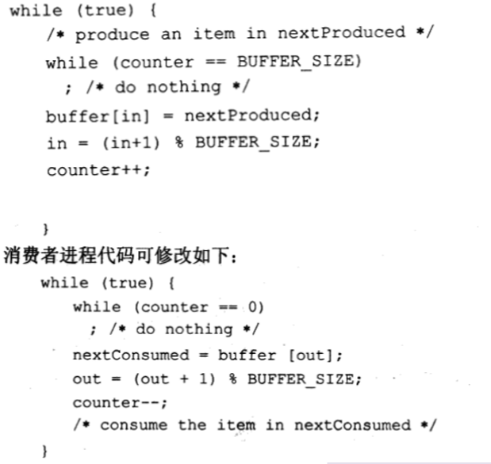

- 虽然生产者或消费者程序各自正确，但是并发执行时他们可能不能正确执行，生产者进程和消费者进程可能并发执行语句counter++和counter--，从而发生冲突，最后counter的值是随机不确定的。
- 之所以得到了不正确状态，是因为允许两个进程并发操作变量counter。像这样的情况，即多个进程并发访问和操作同一数据且执行结果与访问发生的特定顺序有关，称为竞争条件(race condition)。为了避免竞争条件，需要确保一段时间内只有一个进程能操作变量counter。为了实现这种保证，要求进行一定形式的进程同步。

## 临界区问题

### 概念

- 假设某个系统有n个进程{Po, P1…,Pn1}。每个进程有一个代码段称为临界区(critical section)，在该区中进程可能改变共同变量、更新一个表、写一个文件等。这种系统的重要特征是当一个进程进入临界区，没有其他进程可被允许在临界区内执行，即没有两个进程可同时在临界区内执行。临界区问题(critical-section problem）是设计一个以便进程协作的协议。每个进程必须请求允许进入其临界区。实现这一请求的代码段称为进入区(entrysection)，临界区之后可有退出区(exit section)，其他代码为剩余区（remainder section)。

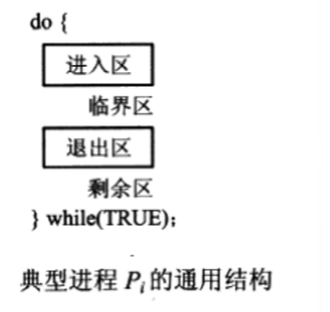

### 要求

- 临界区问题的解答必须满足如下三项要求:

- - 互斥( mutual      exclusion):如果进程P在其临界区内执行，那么其他进程都不能在其临界区内执行。
  - 前进(      progress)空闲让进:如果没有进程在其临界区内执行且有进程需进入临界区，那么只有那些不在剩余区内执行的进程可参加选择，以确定谁能下一个进入临界区，且这种选择不能无限推迟。CPU至少有一个可选
  - 有限等待(bounded waiting):从一个进程做出进入临界区的请求，知道该请求允许为止，其他进程允许进入其临界区的次数有上限。任何一个不能永久等待

## 解决方法

### 抢占内核和非抢占内核

- 有两种方法用于处理操作系统内的临界区问题:抢占内核(preemptive kernel）与非抢占内核(nonpreemptive     kernel)。
- 抢占内核允许处于内核模式的进程被抢占，非抢占内核不允许处于内核模式的进程被抢占。处于内核模式运行的进程会一直运行，直到它退出内核模式、阻塞或自动退出CPU的控制。显然，非抢占内核的内核数据结构从根本上不会导致竞争条件，因为某个时刻只有一个进程处于内核模式。然而，对于抢占内核，就不能这样简单说了，这些抢占内核需要认真设计以确保其内核数据结构不会导致竞争条件。对于SMP体系结构，抢占内核更难设计，因为两个处于内核模式的进程可同时运行在不同的处理器上。
- 抢占内核会比非抢占内核更受欢迎。抢占内核更适合实时编程，因为它能允许实时进程抢占处于内核模式运行的其他进程。再者，抢占内核的响应更快，因为处于内核模式的进程在释放CPU之前不会运行过久。当然，可以通过设计内核代码以最小化响应时间，从而避免出现这种情况。

### Peterson算法（基于软件）

- 由于现代计算机体系架构执行基本机器语言指令，如 load 与 store 的不同方式，Peterson算法在这类机器上不能确保正确运行。但是这一算法提供了解决临界区问题的一个很好算法，并能说明满足互斥、前进、有限等待等要求的软件设计的复杂性
- Peterson算法适用于两个进程在临界区与剩余区间交替执行。两个进程为p0和p1，为了方便,当使用P时,用P,来表示另一个进程,即j = 1-i。
- Peterson算法需要在两个进程之间共享两个数据项;

int turn;

boolean flag [2];

- 变量turn表示哪个进程可以进入其临界区。即如果turn= =i，那么进程P;允许在其临界区内执行。数组flag 表示哪个进程想要进入其临界区。例如，如果 flag[i]为true，即进程P想要进入其临界区。

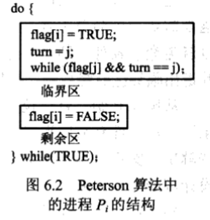

- 为了进入临界区，进程P首先设置flag[i]的值为true，且设置turn的值为j，从而表示如果另一个进程P希望进入临界区，那么P能进入。如果两个进程同时试图进入,那么turn会几乎在同时设置成i和j。只有一个赋值语句的结果会保持，另一个也会设置，但会立即被重写。最终turn值决定了哪个进程能允许先进入其临界区。

- 评判一个解决临界区问题的算法，都需要证明三个条件：

- - 互斥成立。
  - 前进要求满足。
  - 有限等待要求满足。

## 硬件同步

（硬件特性可以简化编程任务且提高系统效率）

### 前言

- 一般来说，可以说任何临界区问题都需要一个简单工具——锁，通过要求临界区用锁来防护，就可以避免竞争条件，即一个进程在进入临界区之前必须得到锁，而在其退出临界区时释放锁。

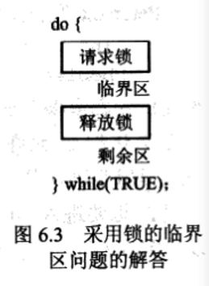

### 一般解决方案

- 对于单处理器环境，临界区问题可简单地加以解决:在修改共享变量时要禁止中断出现。这样，就能确保当前指令序列的执行不会被中断。由于其他指令不可能执行，所以共享变量也不会被意外修改。这种方法通常为非抢占内核所采用。
- 然而，在多处理器环境下，这种解决方案是不可行的。在多处理器上由于要将消息传递给所有处理器，所以禁止中断可能很费时。这种消息传递导致进入每个临界区都会延迟，进而会降低系统效率。而且，该方法影响了系统时钟(如果时钟是通过中断来加以更新的)。
- 因此，许多现代计算机系统提供了特殊硬件指令以允许能原子地（不可中断地）检查和修改字的内容或交换两个字的内容(作为不可中断的指令)。可以使用这些特殊指令来相对简单地解决临界区问题。

#### TestAndSet

- 其主要特点是该指令能原子地执行。因此，如果两个指令TestAndSet()同时执行在不同的CPU 上,那么它们会按任意顺序来顺序执行。如果机器支持指令TestAndSet()，那么可这样实现互斥:声明一个Boolean变量lock，初始化为false。下图是指令定义和进程P的结构。

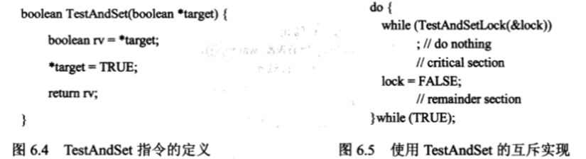

#### Swap

- 与指令TestAndSet 相比,指令Swap操作两个数据，与指令TestAndSet一样，它也原子执行。如果机器支持指令Swap，那么互斥可按如下方式实现。声明一个全局布尔变量lock，初始化为false。另外，每个进程也有一个局部 Boolean变量key。

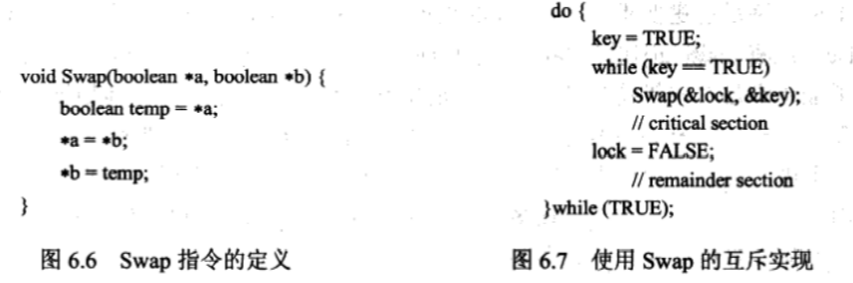

**以上两种方法解决了互斥，但是没有解决有限等待要求**

#### 基于TestAndSet的满足三个条件的算法

- TestAndSet 的算法，如图所示。该算法满足所有临界区问题的三个要求。共用数据结构如下:

boolean waiting[n] ;//等待队列

boolean lock;

- 这些数据结构均初始化 false。为了证明满足互斥要求,注意,只有waiting[i]== false 或key ==flase时，进程P;才进入临界区。只有当TestAndSet执行时，key 的值才变成false。执行TestAndSet 的第一个进程会发现key =- false;所有其他进程必须等待。只有其他进程离开其临界区时,变量waiting[i]的值才能变成false;每次只有一个waiting[i]被设置为false，以满足互斥要求。

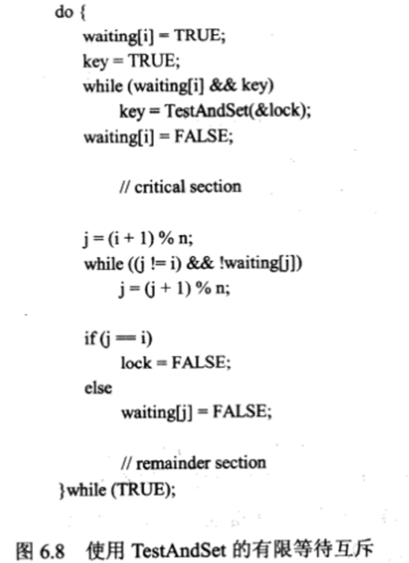

- 为了证明满足前进要求,有关互斥的论证也适用。由于进程在退出其临界区时或将lock设为 false，或将waiting[i]设为false。这两种情况都允许等待进程进入临界区以执行。
- 为了证明满足有限等待，当一个进程退出其临界区时，它会循环地扫描数组waiting[i](i+1, i+2，…",     n-1,0，…,i-1)，并根据这一顺序而指派第一个等待进程.( waiting]==true)作为下一个进入临界区的进程。因此，任何等待进入临界区的进程只需要等待n-1次。


## 信号量semaphore

### 前言

- 信号量S是个整数变量,除了初始化外,它只能通过两个标准原子操作: wait()和signal()来访问。这些操作原来被称为Р(荷兰语proberen，测试）和V(荷兰语verhogen，增加)。
- wait()的定义可表示为

```c
wait(s){
	while (S<=0); 
    || no-op
	S--;
}
```

- signal的定义可表示为

```c
signal (S){
    S++;
}
```

- 在wait()和signal()操作中，对信号量整型值的修改必须不可分地执行，即当一个进程修改信号量值时，不能有其他进程同时修改同一信号量的值。另外，对于wait(S)，对S的整型值的测试(S<=O)和对其可能的修改(S--)，也必须不被中断地执行。

### 用法

- 通常操作系统区分计数信号量与二进制信号量。计数信号量的值域不受限制，而二进制信号量的值只能为0或1。有的系统，将二进制信号量称为互斥锁，因为它们可以提供互斥。

- 二进制信号量应用

- - 可以使用二进制信号量来处理多进程的临界区问题。这n个进程共享一个信号量mutex，并初始化为1。每个进程的结构如图。

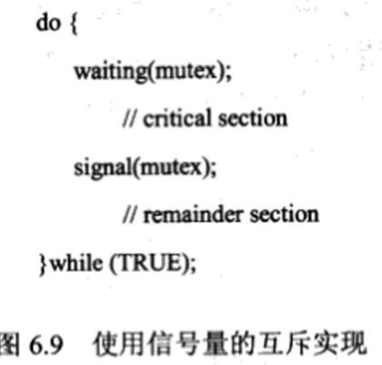

- 计数信号量的两个应用

- - 计数信号量可以用来控制访问具有若干个实例的某种资源。该信号量初始化为可用资源的数量。当每个进程需要使用资源时，需要对该信号量执行wait()操作（减少信号量的计数)。当进程释放资源时，需要对该信号量执行signal()操作（增加信号量的计数)。当信号量的计数为О时，所有的资源都被使用。之后，需要使用资源的进程将会阻塞，直到其计数大于0。
  - 也可以使用信号量来解决各种同步问题。例如，有两个并发进程:P1有语句S1而 P2有语句S2，假设要求只有在S1执行完之后才执行S2。可以很容易地实现这一要求:让P1和P2共享一个共同信号量synch，且将其初始化为0，进程P1中插入语句:
  - S1;

  - signal (synch) ;

  - 进程P2中插入语句:

  - wait (synch) ;

  - S2;

  - 因为synch初始化为0，P2只有在P1调用signal(synch)(即S1）之后，才会执行S2。

### 实现

- #### 背景

- - 这里所定义的信号量的主要缺点是都要求忙等待(busy      waiting)。当一个进程位于其临界区内时，任何其他试图进入其临界区的进程都必须在其进入代码中连续地循环。这种连续循环在实际多道程序系统中显然是个问题，因为这里只有一个处理器为多个进程所共享。忙等待浪费了CPU时钟，这本来可有效地为其他进程所使用。
  - 这种类型的信号量也称为自旋锁（spinlock)，这是因为进程在其等待锁时还在运行（自旋锁有其优点，进程在等待锁时不进行上下文切换，而上下文切换可能需要花费相当长的时间。因此，如果锁的占用时间短，那么自旋锁就有用了;自旋锁常用于多处理器系统中，这样一个线程在一个处理器自旋时，另一线程可在另一处理器上在其临界区内执行)。

- #### 实现

- - 为了克服忙等，可以修改信号量操作 wait()和 signal()的定义。
  - 当一个进程执行wait()操作时，发现信号量值不为正，则它必须等待。然而，该进程不是忙等而是阻塞自己。阻塞操作将一个进程放入到与信号量相关的等待队列中,并将该进程的状态切换成等待状态。接着，控制转到CPU 调度程序，以选择另一个进程来执行。
  - 一个被阻塞在等待信号量S上的进程，可以在其他进程执行signal()操作之后被重新执行。该进程的重新执行是通过wakeup()操作来进行的，该操作将进程从等待状态切换到就绪状态。接着，该进程被放入到就绪队列中（根据CPU调度算法的不同，CPU有可能会、也可能不会从正在运行的进程切换到刚刚就绪的进程)。
  - 为了实现此种定义的信号量，将信号量定义为如下一个“C”结构:

- ```c
  typedef struct {
      int value;
  	struct process *list;
  }semaphore;
  ```

- - 每个信号量都有一个整型值和一个进程链表。当一个进程必须等待信号量时，就加入到进程链表上。操作signal()会从等待进程链表中取一个进程以唤醒。

  - 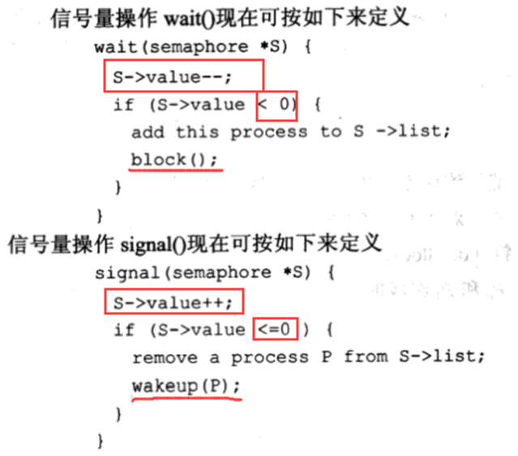

  - 操作 block()挂起调用它的进程。操作wakeup(P)重新启动阻塞进程Р的执行。这两个操作都是由操作系统作为基本系统调用来提供的。

  - 注意，在具有忙等的信号量的经典定义下，信号量的值不可能为负，但是本实现可能产生负的信号量值。如果信号量的值为负，那么其绝对值就是等待该信号量的进程的个数。出现这种情况是因为waitQ)操作实现中递减和测试次序的互换。

  - 等待进程的链表可以使用进程控制块PCB的一个链接域来实现，每个信号量包括一个整型值和一个PCB链表的指针。向链表中增加和删除一个进程以确保有限等待的一种方法是使用FIFO队列，即信号量包括队列的首指针和尾指针。

  - 信号量的关键之处是它们原子地执行。必须确保没有两个进程能同时对同一信号量执行操作wait()和signal()。这属于临界区问题，可通过两种方法来解决。

  - - 在单处理器环境下(即只有一个CPU存在时)，可以在执行wait()和signal()操作时简单地禁止中断。这种方案在单处理器环境下能工作，这是因为一旦禁止中断，不同进程指令不会交织在一起。只有当前运行讲程执行，直到中断重新允许和调度器能重新获得控制为止。
    - 在多处理器环境下，必须禁止每个处理器的中断;否则，运行在不同处理器上的不同进程可能会以任意不同方式交织在一起执行。但是，禁止每个处理器的中断不仅会很困难,而且还会严重影响性能。因为，SMP系统必须提供其他加锁技术(如自旋锁),以确保wait)与signal()可原子地执行。

  - 必须承认对于这里的wait()和signal()操作的定义，并没有完全取消忙等，而是取消了应用程序进入临界区的忙等。相当于在进程链表中等待。


## 死锁与饥饿

- 具有等待队列的信号量的实现可能导致这样的情况:两个或多个进程无限地等待一个事件，而该事件只能由这些等待进程之一来产生。这里的事件是signal(O)操作的执行。当出现这样的状态时，这些进程就称为死锁（deadlocked)。
- 为了说明，考虑一个由两个进程P0和P1组成的系统，每个都访问共享信号量S和Q,这两个信号量的初值均为1:

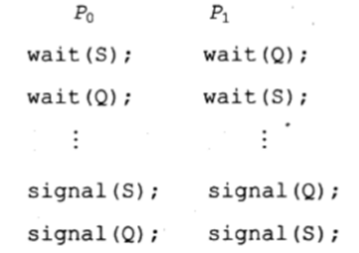

- 假设Р0执行 wait(S)，接着P1执行 wait(Q)。当P0执行wait(Q)时，它必须等待，直到P1执行signal(Q)。类似地，当P1执行 wait(S)，它必须等待，直到P0执行signal(S)。由于这两个操作都不能执行，那么P0和P1就死锁了。
- 说一组进程处于死锁状态，即组内的每个进程都等待一个事件，而该事件只可能由组内的另一个进程产生。这里主要关心的事件是资源获取和释放（resource . acquisition     andrelease)。
- 与死锁相关的另一个问题是无限期阻塞（indefinite     blocking）或饥饿(starvation)，即进程在信号量内无限期等待。如果对与信号量相关的链表按LIFO顺序（后进先出）来增加和移动进程,那么可能会发生无限期阻塞。


## 经典同步问题

### 有界缓冲问题

- 假定缓冲池有n个缓冲项，每个缓冲项能存一个数据项。信号量mutex提供了对缓冲池访问的互斥要求，并初始化为1。信号量empty 和 full分别用来表示空缓冲项和满缓冲项的个数。信号量empty初始化为n;而信号量full 初始化为0;
- 生产者进程和消费者进程的代码如图所示。注意生产者和消费者之间的对称性。可以这样来理解代码:生产者为消费者生产满缓冲项，而消费者为生产者生产空缓冲项。

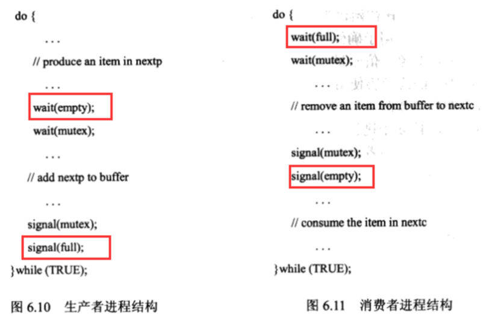

### 读者-写者问题

- 一个数据库可以为多个并发进程所共享，其中，有的进程可能只需要读数据库，即读者，有些进程可能需要更新数据库，这类进程称为写者。可以允许多个读者同时访问数据，但是不允许多个写者同时更改数据。为了保证不会产生混乱，这一同步问题称为读者-写者问题。

- 分类（与优先级有关）

- - 第一读者-写者问题，最简单，要求没有读者需要保持等待，除非已有一个写者已获得允许以使用共享数据库。换句话说，没有读者会因为有一个写者在等待而会等待其他读者的完成。读者优先
  - 第二读者-写者问题要求，一旦写者就绪，那么写者会尽可能快地执行其写操作。换句话说，如果一个写者等待访问对象，那么不会有新读者开始读操作。写者优先

- 存在问题

- - 对于第一种情况，可能出现写者饥饿；对于第二种情况，可能出现读者饥饿；

- 一种实现

- - 对于第一读者-写者问题的解决，读者进程共享以下数据结构:
  - semaphore mutex, wrt;

  - int readcount;

- 信号量mutex和 wrt初始化为1; readcount初始化为0。信号量wrt为读者和写者进程所共用。信号量mutex用于确保在更新变量readcount时的互斥。变量readcount用来跟踪有多少进程正在读对象。信号量wrt供写者作为互斥信号量。它为第一个进入临界区和最后一个离开临界区的读者所使用，而不被其他读者所使用。

- 注意，如果有一个进程在临界区内，且n个进程处于等待，那么一个读者在wrt上等待，而n-1个在mutex上等待。而且，当一个写者执行signal(wrt)时，可以重新启动等待读者或写者的执行。这一选择由调度程序所做。

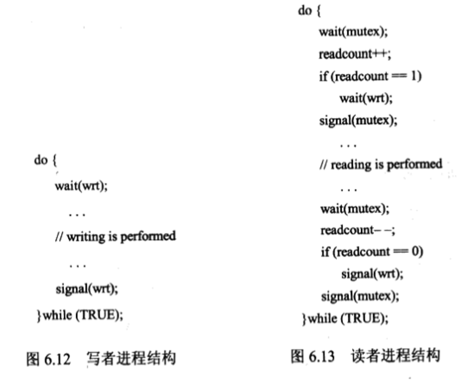

- 推广

- - 读者-写者问题及其解答可以进行推广，用来对某些系统提供读写锁。在获取读写锁时，需要指定锁的模式:读访问或写访问。当一个进程只希望读共享数据时，可申请读模式的读写锁;当一个进程希望修改数据时，则必须申请写模式的读写锁。多个进程可允许并发获取读模式的读写锁;而只有一个进程可为写操作而获取读写锁。

  - 读写锁适用场景：

  - - 当可以区分哪些进程只需要读共享数据而哪些进程只需要写共享数据。
    - 当读者进程数比写进程多时。这是因为读写锁的建立开销通常比信号量或互斥锁要大，而这一开销可以通过允许多个读者来增加并发度的方法进行弥补。

### 哲学家进餐问题

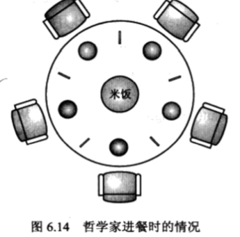

- 五个哲学家，一个哲学家依次只能拿起一只筷子，先拿左边，再拿右边，只有拿到两只筷子，才能吃，吃完再放下两只筷子；

- 一种简单的解决方法是每只筷子都用一个信号量来表示。一个哲学家通过执行wait()操作试图获取相应的筷子，他会通过执行signal()操作以释放相应的筷子。因此，共享数据

  semaphore chopstick [ 5];

- 其中所有chopstick的元素初始化为1。

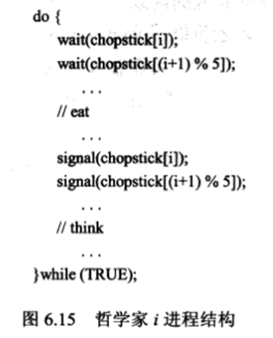

- 存在问题

- - 如果五个哲学家同时拿起左边筷子，那么就会出现死锁，一直等待；

- 解决方法

- - 最多只允许4个哲学家同时坐在桌子上。
  - 只有两只筷子都可用时才允许一个哲学家拿起它们（他必须在临界区内拿起两只筷子)。
  - 使用非对称解决方法，即奇数哲学家先拿起左边的筷子，接着拿起右边的筷子，而偶数哲学家先拿起右边的筷子，接着拿起左边的筷子。

## 管程

### 背景

- 虽然信号量提供了一种方便且有效的机制以处理进程同步，但是会出现使用不正确的情况

### 错误类型

- 假设一个进程交换了对信号量 mutex 的 wait()和signal)操作的顺序，从而产生了如下结构:

  signal (mutex);

  ...

  critical section

  …

  wait(mutex);

这样，多个进程可能同时在其临界区内执行，因而违反了互斥要求。这种错误只有在多个进程同时在其临界区内执行时才会被发现。注意，这种情况并不是总能再现的。

- 假设一个进程用wait(mutex)替代了signal(mutex)，即

  wait (mutex) ;

  ...

  critical section

  …

  wait (mutex);

这样，会出现死锁。

- 假设一个进程省略了wait(mutex)或signal(mutex)或两者都省略了。

这样，可能会出现死锁，也可能会破坏互斥。

### 解决

- 为了处理刚才这些类型的错误，研究者提出了一些高级语言构造。一种基本的、高级的同步构造，即管程（monitor）类型，可以提供解决方案。

 

## 其他知识

- 执行单个逻辑功能的一组指令或操作称为事务(transaction)。处理事务的主要问题是不管出现什么计算机系统的可能失败，都要保证事务的原子性。
- 可以认为事务是访问且可能更新各种驻留在磁盘文件中的数据项的程序单元。从用户观点来看，事务只是一系列read操作和 write操作，并以commit 操作或abort 操作终止。操作commit表示事务已成功执行;操作abort 表示因各种逻辑错误，事务必须停止执行。已成功完成执行的终止事务称为提交（ committed);否则，称为撤销(aborted)。
- 由于被中止的事务可能已改变了它所访问的数据，这些数据的状态与事务在原子执行情况下是不一样的。被中止的事务必须对其所修改的数据不产生任何影响，以便确保原子特性。因此，被中止的事务所访问的数据状态必须恢复到事务刚刚开始执行之前，即这个事务已经回退（(rolled back)。确保这一属性是系统的责任。