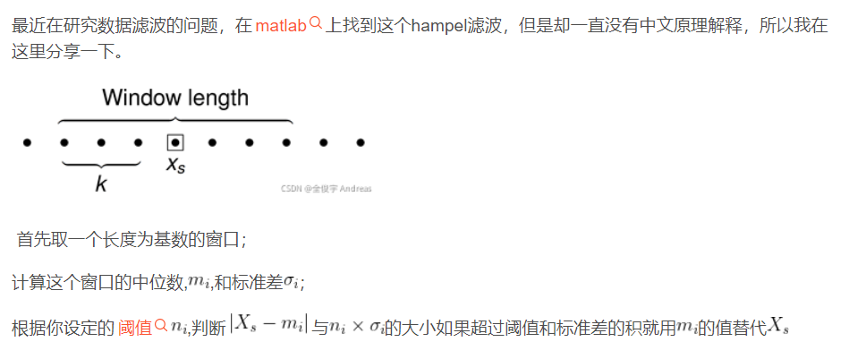
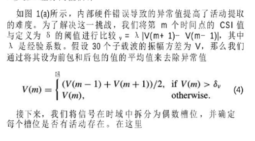
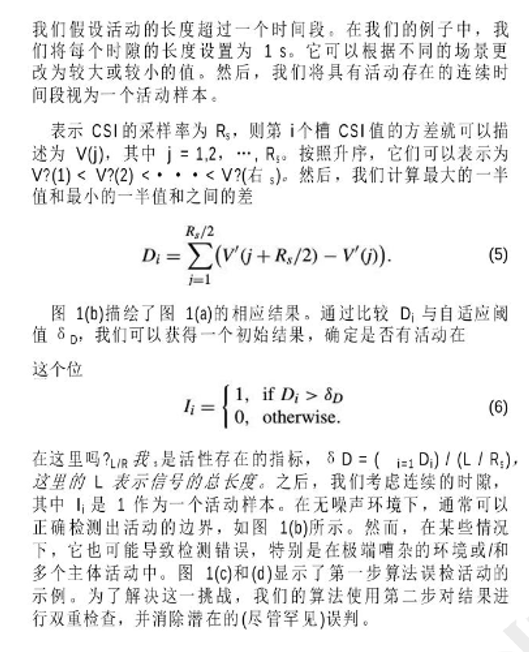

# 简历知识

## 1、springcloud

Spring Cloud是一系列框架的有序集合。它利用Spring Boot的开发便利性巧妙地简化了分布式系统基础设施的开发，如服务发现注册、配置中心、消息总线、负载均衡、断路器、数据监控等，都可以用Spring Boot的开发风格做到一键启动和部署。Spring Cloud并没有重复制造轮子，它只是将各家公司开发的比较成熟、经得起实际考验的服务框架组合起来，通过Spring Boot风格进行再封装屏蔽掉了复杂的配置和实现原理，最终给开发者留出了一套简单易懂、易部署和易维护的分布式系统开发工具包。

稳定、迭代速度快、使用门槛低，支持springboot java，微服务架构的一个优秀落地方案


## 3、微服务

微服务是一些协同工作的小而自治的服务，这个服务是高凝聚力和松散耦合的

微服务的基本思想在于考虑围绕着业务领域组件来创建应用，这些应用可独立地进行开发、管理和加速。在分散的组件中使用微服务云架构和平台，使部署、管理和服务功能交付变得更加简单。

基于业务


## 2、nacos

Nacos 是阿里巴巴推出来的一个新开源项目，这是一个更易于构建云原生应用的动态服务发现、配置管理和服务管理平台。

Nacos 致力于帮助您发现、配置和管理微服务。Nacos 提供了一组简单易用的特性集，帮助您快速实现动态服务发现、服务配置、服务元数据及流量管理。

Nacos 帮助您更敏捷和容易地构建、交付和管理微服务平台。 Nacos 是构建以“服务”为中心的现代应用架构 (例如微服务范式、云原生范式) 的服务基础设施

背景：当在微服务项目中不同模块之间需要实现服务调用时，如何实现服务注册与发现？

feign client


## 3、nginx

*Nginx* (engine x) 是一个高性能的HTTP和反向代理web服务器，

占内存少，稳定性高，并发能力强，可以实现负载均衡等

主要配置的是http块

`http `全局块配置的指令包括：文件引入、`MIME-TYPE` 定义、日志自定义、连接超时时间、单链接请求数上限等

`server`相当于一个虚拟主机，监听某个端口，主机ip配置，通过配置`location`来处理请求，实现地址定向、数据缓存和应答控制等功能


## 4、正向代理和反向代理

**正向代理代理客户端，反向代理代理服务器**

正向代理：

现在国内是访问不了 Google的，那么怎么才能访问 Google呢？如果我们电脑的对外公网 IP 地址能变成美国的 IP 地址，那不就可以访问 Google了。VPN 就是这样产生的。我们在访问 Google 时，先连上 VPN 服务器将我们的 IP 地址变成美国的 IP 地址，然后就可以顺利的访问了。

这里的 VPN 就是做正向代理的。正向代理服务器位于客户端和服务器之间，为了向服务器获取数据，客户端要向代理服务器发送一个请求，并指定目标服务器，代理服务器将目标服务器返回的数据转交给客户端。这里客户端是要进行一些正向代理的设置的。

反向代理：

反向代理，其实客户端对代理是无感知的，因为客户端不需要任何配置就可以访问，我们只需要将请求发送到反向代理服务器，由反向代理服务器去选择目标服务器获取数据后，在返回给客户端，此时反向代理服务器和目标服务器对外就是一个服务器，暴露的是代理服务器地址，隐藏了真实服务器IP地址。


## 5、gateway

网关的角色是作为一个 API 架构，用来保护、增强和控制对于 API 服务的访问。

API 网关是一个处于应用程序或服务（提供 REST API 接口服务）之前的系统，用来管理授权、访问控制和流量限制等，这样 REST API 接口服务就被 API 网关保护起来，对所有的调用者透明。因此，隐藏在 API 网关后面的业务系统就可以专注于创建和管理服务，而不用去处理这些策略性的基础设施。

Spring Cloud Gateway旨在为微服务架构提供一种简单而有效的统一的API路由管理方式。


## 6、jwt

JWT(全称：Json Web Token)是一个开放标准，它定义了一种紧凑的、自包含的方式，用于作为JSON对象在各方之间安全地传输信息。该信息可以被验证和信任，因为它是数字签名的。

实际就是一种认证机制，用户登录鉴权

为什么要有？

之前的session认证，需要服务器保存用户信息，客户端通过cookie进行验证，不能分布式共享，服务器压力大，一般移动端也没有cookie这个东西

后面的token + redis，每次都需要请求redis，影响性能

所以出现了jwt，有客户端保存并发送，服务器只需要解析，易于扩展，数据量小，传输快，适用性广，跨语言通用，

分为，jwt头（签名算法和令牌类型）+payload有效载荷（用户自定义数据）+签名（根据密码字符串对头和载荷根据算法进行计算签名哈希）


## 7、docker

Docker 是一个开源的应用容器引擎，基于go语言开发，Docker可以让开发者打包他们的应用依赖包，到一个轻量级、可移植的容器中，然后发布到任何流行的系统

组成：

- Docker 主机(Host)：一个物理机或虚拟机，用于运行Docker服务进程和容器，也称为宿主机，node节点
- Docker 服务端(Server)：Docker守护进程，运行docker容器
- Docker 客户端(Client)：客户端使用docker 命令或其他工具调用docker API
- Docker 仓库(Registry): 保存镜像的仓库，官方仓库: https://hub.docker.com/，可以搭建私有仓库
- Docker 镜像(Images)：镜像可以理解为创建实例使用的模板
- Docker 容器(Container): 容器是从镜像生成对外提供服务的一个或一组服务

特点：

通过对应用组件的封装（Packaging）、分发（Distribution）、部署（Deployment）、运行（Runtime）等生命周期的管理，达到应用组件级别的“一次封装，到处运行”。这里的应用组件，既可以是一个Web应用，也可以是一套数据库服务，甚至是一个操作系统。

将应用运行在Docker 容器上，可以实现跨平台，跨服务器，只需一次配置准备好相关的应用环境，即可实现到处运行，保证研发和生产环境的一致性，解决了应用和运行环境的兼容性问题，从而极大提升了部署效率，减少故障的可能性

优点：

- 资源利用率更高：一台物理机可以运行数百个容器，但是一般只能运行数十个虚拟机
- 开销更小：不需要启动单独的虚拟机OS内核占用硬件资源
- 启动速度更快：可以在数秒内完成启动
- 集成性更好：和CI/CD（持续集成/持续部署）相关技术结合性更好，实现自动化管理


## 7、容器

容器是用于将应用与其所有必要文件捆绑到一个运行时环境中的技术。作为一个单元，容器可以在任何环境下的任何操作系统上轻松移动和运行。


## 8、netty

Netty 是一个高性能、异步事件驱动的 NIO 框架，基于 JAVA NIO 提供的 API 实现。它提供了对TCP、UDP 和文件传输的支持，作为一个异步 NIO 框架，Netty 的所有 IO 操作都是异步非阻塞的

Netty是JBOSS提供的一个java开源框架，现为 Github上的独立项目。Netty提供异步的、事件驱动的网络应用程序框架和工具，用以快速开发高性能、高可靠性的网络服务器和客户端程序。

内部实现是基于线程池，每个线程池里面的线程都有一个任务队列，可以处理多个socket网络通道IO事件

内部串行化：读取->解码->处理->编码->发送


## 9、shiro

Apache Shiro是一个强大且易用的Java安全框架,执行身份验证、授权、密码和会话管理

应用代码直接交互的对象是 Subject，也就是说 Shiro 的对外 API 核心就是 Subject；其每个 API 的含义：

**Subject**：主体，代表了当前 “用户”，这个用户不一定是一个具体的人，与当前应用交互的任何东西都是 Subject，如网络爬虫，机器人等；即一个抽象概念；所有 Subject 都绑定到 SecurityManager，与 Subject 的所有交互都会委托给 SecurityManager；可以把 Subject 认为是一个门面；SecurityManager 才是实际的执行者；

**SecurityManager**：安全管理器；即所有与安全有关的操作都会与 SecurityManager 交互；且它管理着所有 Subject；可以看出它是 Shiro 的核心，它负责与后边介绍的其他组件进行交互，如果学习过 SpringMVC，你可以把它看成 DispatcherServlet 前端控制器；

**Realm**：域，Shiro 从 Realm 获取安全数据（如用户、角色、权限），就是说 SecurityManager 要验证用户身份，那么它需要从 Realm 获取相应的用户进行比较以确定用户身份是否合法；也需要从 Realm 得到用户相应的角色 / 权限进行验证用户是否能进行操作；可以把 Realm 看成 DataSource，即安全数据源。

也就是说对于我们而言，最简单的一个 Shiro 应用：

1. 应用代码通过 Subject 来进行认证和授权，而 Subject 又委托给 SecurityManager；
2. 我们需要给 Shiro 的 SecurityManager 注入 Realm，从而让 SecurityManager 能得到合法的用户及其权限进行判断。

Shiro 不提供维护用户 / 权限，而是通过 Realm 让开发人员自己注入


## 10、sit

### 项目背景

传统的人体动作识别方法主要分为两类。第一种基于携带式设备的方法，例如传感器等，代价较高，同时对平台和设备也有比较高的要求，携带不变，需要安装，比较麻烦。第二种是非携带式的光学设备的方法， 这种方法目前比较成熟，例如摄像头等，但是光学设备会受到光的影响，在昏暗环境下成像可能会有误差，同时也会有隐私泄露的风险，存在视觉盲区，视角易被遮蔽，大规模的部署需要比较昂贵的代价。


### 实验环境

 CSI Tool 工具包，CSI Tool是一种基于 802.11n 协议（无线协议）基础上的开源工具包，主要用来测量信道状态信息(CSI)。该工具的使用有两种模式，一种是 AP 模式，即发送方 由路由器充当，另一种就是 Monitor 模式，即数据由安装了 CSI Tool 的电脑发送。由于使用 AP 模式时 ping 命令速度比较慢，且不能准确控制发送数据包的速率，因此本文的实验采用的是 Monitor 模式。

 Linux Ubuntu12.04 LTS操作系统，并且安装网卡 为 Intel WiFi NIC 5300 网络适配器。

同时，两台电脑均需安装 CSI Tool 工具包和 lorcon 工具，以用来收集和发送数据，其中，lorcon 为一个开源的为对于无线数据包进行注入的工具。在本次实验中，我们两台电脑处于 Monitor 模式(可以自己设置参数)下，两台电脑均在 802.11n 网络协议下工作运行，频段信号设置为 2.4GHz。

可以设置发包间隔，发包数量，包大小。

配置了csi tool之后，是不能联网的，实时传送只能通过有线的方式进行传输

每一个发送天线和每一个接收天线之间存在一条链路，每条链路上存在 30 个子信道，一个信道上会传播发送天线到接收天线的一根子载波，每一根子 载波上都会携带一个信道系数，记录每条子载波的衰减和衰落情况，我们记 H=|h|(sina+cosa)，其中 h 是该信道系数的幅度，a 是该信道系数的相位角。


### 数据收集

首先初始传送十秒左右，之后每隔15秒运动三秒，依次重复7到8次，完成一次数据收集，保存至文件中`.dat`，后面采用转发，直接转发至python程序，里面是字节数据


### csi结构

CSI，全称为 Channel State Information，信道状态信息。在无线通信领域，CSI 指的是通信链路的信道属性。它描述了信号在每条传输路径上的衰弱因子，即信道增益矩阵 H 中每个元素的值，如信号散射,环境衰弱,距离衰减等信息。CSI 可以使通信系统适应当 前的信道条件，在多天线系统中为高可靠性高速率的通信提供了保障。

一个包对应于一个bfee，分为`filed_len`，`code`，`filed`

其中 field_len 为两个字节，代表整个 bfee 的长度，field_len 的长度等于 code 加 field 的字节长之和，code 长度为一个字节，field 长度可变。当 code 等于 187 时，表示 field 中为可用的信道信息，当 code 不是 187 时，表示 field 中是其他信息。

其中filed中记录了csi的主要信息，类似于tcp报文端等网络数据包的格式，分为头部和负载payload，

头部主要记录了一些报的配置信息，比如发送端使用天线数量，接收端使用天线数量，发送包的速率，RSSI值，噪声值，天线的选择等等

负载部分就是30个子载波的数据，每个子载波都有三个bit的头部，这是处理起来麻烦的点，只能按bit去处理，不能直接转换为字节数据，然后每个数据是一个复数，包含实部和虚部，都是八位，一个字节


### 巴特沃斯滤波

采用巴特沃斯低通滤波过滤到高频部分，因为噪音一般都是比较高频的，人的活动频率比较低

四阶，0.5，low

python提供了相关函数

```py
b, a = signal.butter(8, 0.8, 'lowpass')   #配置滤波器 8 表示滤波器的阶数
filtedData = signal.filtfilt(b, a, data)  #data为要过滤的信号
```


### hampel滤波原理

使用hampel滤波去除巴特沃斯滤波之后的异常值




差分阈值估计

去除异常值

第m个时间点方差的阈值是他后一个时间点的方差减去其哪一个的方差的绝对值*2



如果大于，我们设置为平均值



然后更具时隙进行划分，选择1s，将这一秒钟的所有包的子载波的方差全部计算出来，并排序，然后计算后一半与前一半的方差的差，作为这个时隙槽的方差结果值，然后计算所有这些槽的平均值，如果大于就说明是运动区间，否则是静止区间，

然后可能要消除异常值，遍历所有区间，如果他前后都是静止，而他是运动，则设置为静止。类推
