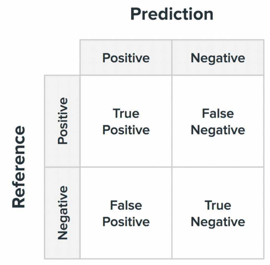
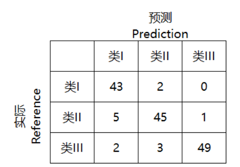
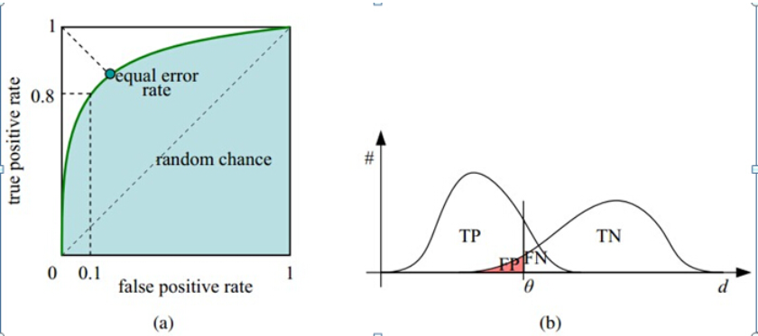

# Base Concept

> 记录了应用机器学习和深度学习时的一些核心概念和框架细节


## 数据集分割

在机器学习和深度学习中，训练集（Training Set）、验证集（Validation Set）、和测试集（Test Set）是常见的数据集分割方式，用于训练和评估模型的性能。以下是它们的详细解释：

1. **训练集（Training Set）：**
   - **定义：** 训练集是用于训练模型的数据集。模型通过学习训练集中的样本数据来适应数据的模式和特征。
   - **使用：** 训练集的主要目的是使模型学到数据的模式、关系和特征，从而能够做出准确的预测或分类。
   - **大小：** 通常，训练集的大小相对较大，因为模型需要足够的样本来进行有效的学习。

2. **验证集（Validation Set）：**
   - **定义：** 验证集是用于<u>调整模型超参数和进行模型选择</u>的数据集。在训练过程中，通过验证集评估模型的性能，但模型并不直接从验证集中学习。
   - **使用：** 验证集用于避免过拟合（overfitting），调整模型的超参数（例如学习率、正则化项等），并选择最佳的模型。
   - **大小：** 验证集的大小通常比较小，因为它主要用于模型的调整和选择。

3. **测试集（Test Set）：**
   - **定义：** 测试集是用于评估模型在实际应用中的性能的数据集。模型在测试集上进行评估，以检查其在未见过的数据上的泛化能力。
   - **使用：** 测试集用于最终评估模型的性能，验证模型在实际场景中是否能够进行准确的预测或分类。
   - **大小：** 测试集的大小通常与验证集相当，足够大以反映模型在真实场景中的表现。

4. **重要注意事项：**
   - **随机性：** 数据集的划分通常涉及到随机选择样本，确保每个集合都能代表整体数据的特征。
   - **独立性：** 确保训练集、验证集和测试集之间没有重叠，每个样本只属于一个集合，以确保模型评估的客观性。
   - **数据分布：** 确保这三个集合的数据分布与实际应用场景相符，以避免在真实场景中模型表现不佳的情况。

这种数据集的划分方式有助于评估模型在不同阶段的性能，确保模型在训练过程中不仅仅是记住了训练数据，而是能够泛化到未见过的新数据。


## 交叉验证

交叉验证是一种用于评估统计模型性能的技术，特别适用于数据集较小的情况。其主要思想是将数据集分成若干个互不重叠的子集，然后多次训练和评估模型，每次使用不同的子集作为验证集，其余的作为训练集。这有助于更全面地评估模型的性能，减少对单次划分的依赖。

以下是一般情况下常用的 k 折交叉验证（k-fold cross-validation）：

1. **步骤：**
   - 将数据集分成 k 个子集（折），每个子集称为一个折。
   - 进行 k 次模型训练和评估，每次选择一个不同的折作为验证集，其余的作为训练集。
   - 计算 k 次评估的平均值，得到最终的性能评估。

2. **优点：**
   - 更全面：使用了数据集的所有部分进行训练和验证，减少了对数据划分的敏感性。
   - 更可靠：通过多次训练和验证，可以更可靠地评估模型性能。

3. **注意事项：**
   - **数据的随机性：** 在进行 k 折划分时，要确保数据的随机性，避免特定顺序对模型评估结果的影响。
   - **计算开销：** k 折交叉验证需要进行 k 次训练和评估，因此计算开销相对较大。

4. **变种：**
   - **分层 k 折交叉验证（Stratified k-fold cross-validation）：** 在划分时保持类别分布的一致性，对于分类问题特别有用。
   - **留一交叉验证（Leave-One-Out Cross-Validation，LOOCV）：** 将每个样本单独作为验证集，对于小数据集很耗时，但对于极小的数据集可能是一种选择。

交叉验证是一种有效的模型评估技术，特别适用于数据集有限或需要更可靠性能评估的情况。


## 负采样

负采样（Negative Sampling）是一种用于改进训练效率的技术，特别是在处理大规模数据集时，如图神经网络中的链接预测任务。在链接预测中，模型的目标是学会给定两个节点之间是否存在边的概率。

在传统的训练中，我们需要为每个节点对（正例）生成一个与之相对应的负例（即，两个节点之间没有边）。然而，当图规模很大时，生成所有负例可能变得非常昂贵。负采样通过随机选择一小部分负例来近似损失，从而提高了训练效率。

具体来说，对于每个正例，负采样过程包括从未连接的节点对中随机选择一些负例。这样，正例和负例的比例由负采样的比率（通常称为负例比率）来控制。如果负例比率为 1，那么每个正例将有一个负例，如果为 2，则每个正例将有两个负例，以此类推。

负采样的优势在于：
1. **训练速度提高：** 通过只考虑部分负例，大大降低了训练的计算开销。
2. **稀疏性处理：** 对于大规模图，未连接的节点对可能非常庞大，负采样使得模型可以更集中地学习有关连接和非连接节点对的信息。

在链接预测任务中，负采样通常与二元交叉熵损失函数结合使用。这使得模型在训练时不仅能够学习如何预测正例，还能够有效地区分负例。

需要注意的是，负采样可能引入了一些偏差，因为并非所有未连接的节点对都被考虑。因此，选择合适的负例比率是一个需要平衡的超参数。


## 激活函数

激活函数是神经网络中一种非线性变换，它为神经网络引入非线性因素，使得神经网络能够更好地学习和逼近复杂的函数。**<u>激活函数通常被应用在神经网络的每一层的输出上</u>**。


### Sigmoid

Sigmoid 函数，也称为 Logistic 函数，是一种常用的激活函数，通常用于二分类问题中的输出层。其数学表达式为：

$\sigma(x) = \frac{1}{1 + e^{-x}}$

其中：
- $\sigma(x)$ 是 Sigmoid 函数的输出，
- $e$ 是自然对数的底。

Sigmoid 函数的图形呈 S 形状，其输出范围在 (0, 1) 之间。具体来说，当输入 $x$ 趋近正无穷大时， $\sigma(x)$ ) 趋近于 1；当输入 $x$ 趋近负无穷大时，$\sigma(x)$ 趋近于 0。

在深度学习中，Sigmoid 函数常用于二分类任务，将模型的原始输出转换为概率值。例如，在链接预测任务中，Sigmoid 函数通常被用于将图神经网络的输出（表示两个节点之间存在边的概率）映射到 (0, 1) 范围内。**如果输出值大于某个阈值（通常是 0.5），则预测存在边，否则预测不存在边。**

Sigmoid 函数还常用于神经网络中的隐藏层单元的激活函数，但在某些情况下，如深度神经网络中的梯度消失问题，使用 ReLU（Rectified Linear Unit）等激活函数可能更为常见。

在 PyTorch 中，Sigmoid 函数通常以 `torch.nn.functional.sigmoid` 或 `torch.sigmoid` 的形式使用。例如：

```python
import torch
import torch.nn.functional as F

# 模型的原始输出
raw_score = torch.tensor([2.0])

# 使用 Sigmoid 函数进行概率转换
prob = F.sigmoid(raw_score)

print(prob)
```

在上述代码中，`F.sigmoid` 和 `torch.sigmoid` 都是等效的。这将输出一个范围在 0 到 1 之间的概率值。


### Softmax

Softmax 函数是一种常用的激活函数，通常用于**多分类问题的输出层**，将模型的原始输出转换为概率分布。Softmax 函数的数学表达式如下：

$\text{Softmax}(x)_i = \frac{e^{x_i}}{\sum_{j=1}^{N} e^{x_j}}$

其中：
- $\text{Softmax}(x)_i$是 Softmax 函数的输出中的第 \( $i$ \) 个元素，
- \( $x_i$ \) 是输入向量 \( $x$ \) 的第 \( $i$ \) 个元素，
- \( $N$ \) 是向量 \( $x$ \) 的长度（元素个数）。

**Softmax 函数的作用是将输入向量 \( $x$ \) 转换成一个概率分布，使得每个元素的取值在 (0, 1) 范围内，且所有元素的和等于 1。这样，Softmax 函数的输出可以解释为多个类别的概率，最大的概率对应的类别即为模型的预测结果。**

在深度学习中，Softmax 函数通常用于神经网络的输出层，特别是在多分类任务中。在多分类问题中，模型的最后一层输出一个分数向量，Softmax 函数将这个分数向量转换成一个概率分布，然后通过对概率值进行 argmax 操作，确定最终的预测类别。

在 PyTorch 中，Softmax 函数通常以 `torch.nn.functional.softmax` 的形式使用。例如：

```python
import torch
import torch.nn.functional as F

# 模型的原始输出
raw_scores = torch.tensor([2.0, 1.0, 0.1])

# 使用 Softmax 函数进行概率转换
probs = F.softmax(raw_scores, dim=0)

print(probs)
```

这将输出一个概率分布，确保概率之和为 1。在上述代码中，`dim=0` 表示 Softmax 在输入的第一个维度上进行操作，通常是对分类分数的维度进行 Softmax 操作。


### ReLU

ReLU（Rectified Linear Unit）是一种常用的激活函数，它将输入值 $x$ 映射到 $\max(0, x)$ 。ReLU 函数的数学表达式如下：

$f(x) = \max(0, x)$

其中：
- $f(x)$ 是 ReLU 函数的输出，
- $x$ 是输入值。

ReLU 的主要特点是在输入为正时，输出保持不变；在输入为负时，输出为零。这使得 ReLU 对比其他激活函数来说**计算简单且执行速度快**。ReLU 的**非线性特性对于神经网络的学习能力有积极的影响**。

在深度学习中，ReLU 函数通常用作隐藏层的激活函数。它的引入有助于网络学习更复杂的函数，提高模型的表达能力。ReLU 还有一种变体称为 Leaky ReLU，它在输入为负时引入了一个小的斜率，以缓解**由于输入为负导致的神经元“死亡”问题**。

在 PyTorch 中，ReLU 函数通常以 `torch.nn.functional.relu` 或 `torch.relu` 的形式使用。例如：

```python
import torch
import torch.nn.functional as F

# 模型的原始输出
raw_score = torch.tensor([-2.0, 1.0, 0.5])

# 使用 ReLU 函数进行激活
activated_values = F.relu(raw_score)

print(activated_values)
```

这将输出一个在输入为正时保持不变，在输入为负时为零的张量。


### Leak ReLU

Leaky ReLU 是对 Rectified Linear Unit (ReLU) 的一种改进，旨在解决 ReLU 可能出现的神经元“死亡”问题。在 Leaky ReLU 中，当输入为负数时，不再直接输出零，而是乘以一个小的正斜率  $\alpha$ 。数学表达式如下：

$\text{Leaky ReLU}(x) = \begin{cases} x & \text{if } x > 0 \\ \alpha x & \text{otherwise} \end{cases}$

其中 $\alpha$ 是一个小的正数，通常取很小的值，如 0.01。

Leaky ReLU 的引入主要是为了解决 ReLU 在输入为负时输出恒为零的问题，导致相应神经元失活（dead neurons）的情况。**通过引入一个小的斜率，Leaky ReLU 允许负值通过，这有助于保持激活的多样性，从而减轻了“死亡”神经元的问题**。

在 PyTorch 中，Leaky ReLU 函数通常以 `torch.nn.functional.leaky_relu` 或 `torch.nn.LeakyReLU` 的形式使用。例如：

```python
import torch
import torch.nn.functional as F

# 模型的原始输出
raw_score = torch.tensor([-2.0, 1.0, 0.5])

# 使用 Leaky ReLU 函数进行激活，alpha 默认为 0.01
activated_values = F.leaky_relu(raw_score)

print(activated_values)
```

也可以通过 `torch.nn.LeakyReLU` 类进行使用，例如：

```python
import torch
import torch.nn as nn

# 创建 LeakyReLU 实例，指定 alpha 值
leaky_relu = nn.LeakyReLU(negative_slope=0.01)

# 模型的原始输出
raw_score = torch.tensor([-2.0, 1.0, 0.5])

# 使用 Leaky ReLU 函数进行激活
activated_values = leaky_relu(raw_score)

print(activated_values)
```

这将输出一个经过 Leaky ReLU 激活的张量。


## 损失函数

### 交叉熵损失函数

交叉熵损失（Cross Entropy Loss）是一种用于度量模型输出与实际目标之间的差异的损失函数，通常用于分类任务。它有两个主要的变体，分别是二元交叉熵损失（Binary Cross Entropy Loss）和多类别交叉熵损失（Categorical Cross Entropy Loss）。

1. **二元交叉熵损失（Binary Cross Entropy Loss）：**
   适用于二分类问题，其中模型的输出是一个概率值（一般经过 Sigmoid 函数处理后的概率值），表示属于正类别的概率，在链接预测等二分类问题中，通常使用这个损失函数。二元交叉熵损失函数衡量了模型输出与真实标签之间的差异。
   
   $\text{BCELoss}(y, \hat{y}) = - [y \cdot \log(\hat{y}) + (1 - y) \cdot \log(1 - \hat{y})]$
   
   其中：
   - \( $y$ \) 是实际标签（0 或 1），
   -  $\hat{y}$ 是模型的输出概率。

2. **多类别交叉熵损失（Categorical Cross Entropy Loss）：**
   适用于多分类问题，其中模型的输出是一个概率分布，表示属于每个类别的概率。
   
   $\text{CELoss}(y, \hat{y}) = - \sum_{i=1}^{C} y_i \cdot \log(\hat{y}_i)$
   
   其中：
   - ( $C$ ) 是类别的数量，
   - ( $y$ ) 是实际的标签概率分布（一个独热编码向量），
   - ( $\hat{y}$ ) 是模型的输出概率分布。

在 PyTorch 中，交叉熵损失通常以 `torch.nn.functional.cross_entropy` 函数的形式使用。对于二分类问题，可以使用 `torch.nn.functional.binary_cross_entropy`。通常，在训练过程中，该损失函数会与激活函数（如 Sigmoid）一起使用。

例如，在多类别分类问题中使用交叉熵损失：

```python
import torch
import torch.nn.functional as F

# 模型的原始输出（假设有3个类别）
raw_scores = torch.tensor([[2.0, -1.0, 0.1]])

# 实际标签（独热编码）
target_labels = torch.tensor([0])

# 使用交叉熵损失函数
loss = F.cross_entropy(raw_scores, target_labels)

print(loss)
```

在二分类问题中使用二元交叉熵损失：

```python
import torch
import torch.nn.functional as F

# 模型的原始输出
raw_score = torch.tensor([0.8])

# 实际标签
target_label = torch.tensor([1.0])

# 使用二元交叉熵损失函数
loss = F.binary_cross_entropy_with_logits(raw_score, target_label)

print(loss)
```

这些函数通常接受模型的原始输出和实际标签，并返回计算的损失。


## Batch

`Batch`

"Batch"（批次）是指训练深度学习模型时一次传递给模型的一组输入数据。具体来说，一个批次包含多个样本，每个样本都是模型的输入。在每个批次上，模型的参数都根据这一组样本进行更新。

使用批处理的主要目的之一是利用硬件的并行性。在深度学习中，特别是在使用图形处理单元（GPU）进行加速时，可以并行处理批次中的多个样本。这可以显著提高训练速度，尤其是对于大型数据集和复杂的模型。

批处理的大小由 `batch_size` 参数来定义。例如，如果 `batch_size` 设置为 64，则每次模型更新时，它将使用 64 个样本进行前向传播、计算梯度和更新权重。

`batch_size`

`batch_size` 是深度学习中的一个重要概念，它指的是每次迭代（或每个批次）训练模型时使用的样本数量。引入 `batch_size` 的主要原因有几个：

1. **内存效率：** 大规模数据集往往无法一次性加载到内存中，尤其是在处理图像、文本等大型数据时。通过将数据划分为小的批次，模型只需要在每个批次上进行前向和反向传播，从而减少了内存的需求。
2. **计算效率：** 批量处理可以利用硬件加速（如GPU）的并行性。在每个批次上进行并行计算，可以显著加快训练速度，特别是对于大型模型和大规模数据集。
3. **权重更新：** 批量梯度下降（Batch Gradient Descent）使用整个训练集计算梯度和更新权重。然而，随着数据集规模的增加，计算梯度和更新权重的成本也会增加。使用小批量样本的梯度估计来更新权重，是随机梯度下降（Stochastic Gradient Descent, SGD）和小批量梯度下降（Mini-batch Gradient Descent）的核心思想之一。
4. **更稳定的收敛：** 使用小批量样本进行权重更新通常能够提供更稳定的模型收敛，因为每个批次的样本都是随机选择的，可以降低陷入局部最小值的风险，并有助于跳出局部最小值。

在实际应用中，选择适当的 `batch_size` 可以根据硬件性能、模型结构和数据集规模进行调整。较小的 `batch_size` 可能会增加训练的噪声，但更频繁的更新可以更快地逼近全局最小值。较大的 `batch_size` 可以提高计算效率，但可能导致内存需求较大。因此，`batch_size` 的选择通常需要在实验中进行调整，以找到在给定问题上效果最好的值。


## 优化算法

在深度学习中，有许多优化算法可用于训练神经网络。每个算法都有其独特的性质，选择适当的优化算法取决于具体的问题、模型结构和数据集。以下是一些常见的优化算法：

1. **随机梯度下降（Stochastic Gradient Descent, SGD）：**
   - **基本思想：** 在每个训练步骤中，使用单个样本或一个小批次样本计算梯度并更新参数。
   - **特点：** 简单，易于实现。但对于某些问题，可能收敛较慢。

2. **带动量的随机梯度下降（SGD with Momentum）：**
   - **基本思想：** 在梯度更新中引入动量，即使用之前的梯度的加权平均来调整当前梯度。
   - **特点：** 增加动量有助于加速收敛，减少参数更新的方差。

3. **Adagrad：**
   - **基本思想：** 对每个参数使用不同的学习率，根据历史梯度进行自适应调整。
   - **特点：** 适应性学习率可以自动调整参数的更新，但可能导致学习率过早衰减。

4. **RMSProp：**
   - **基本思想：** 对 Adagrad 进行改进，引入衰减系数来平滑学习率的变化。
   - **特点：** 通过引入衰减系数，RMSProp 可以更好地适应动态变化的学习率。

5. **Adam：**
   - **基本思想：** 结合了动量梯度下降和RMSProp，同时维护动量的指数衰减平均和梯度的平方的指数衰减平均。
   - **特点：** 自适应学习率，对超参数的选择相对较为鲁棒，通常在实践中表现良好。

6. **Adadelta：**
   - **基本思想：** 是 Adagrad 和 RMSProp 的结合，同时考虑了累积梯度平方的平均和参数更新的平均。
   - **特点：** 不需要设置全局学习率，对超参数的选择相对较为鲁棒。

7. **Nadam：**
   - **基本思想：** 结合了 Nesterov 动量和 Adam，是 Adam 的一种变体。
   - **特点：** 具有 Nesterov 动量的收敛性，同时兼具 Adam 的自适应学习率。

在实践中，**Adam 等自适应学习率算法通常表现良好，但在某些情况下，SGD 或 SGD with Momentum 仍然是有效的选择。**选择优化算法通常需要根据具体问题的性质和实验结果进行调整。


### SGD

随机梯度下降（Stochastic Gradient Descent, SGD）是深度学习中最基本的优化算法之一。它是梯度下降的一种随机化版本，**每次迭代只使用一个样本（或一个小批次样本）来计算梯度并更新模型参数**。

SGD的更新规则如下：

$\theta_{t+1} = \theta_t - \eta \cdot \nabla J(\theta_t; x^{(i)}, y^{(i)})$

其中：
- ($\theta_t$ )是当前迭代的参数向量。
- \($\eta$\) 是学习率。
- \($J(\theta_t; x^{(i)}, y^{(i)})$\) 是损失函数，根据输入 \($x^{(i)}$\) 和对应的标签 \($y^{(i)}$\) 计算出来的损失。
- \($\nabla J(\theta_t; x^{(i)}, y^{(i)})$\) 是损失函数对参数的梯度。

SGD的主要特点包括：
- **随机性：** 每次迭代只使用一个样本（或一个小批次），这使得算法具有一定的随机性，可以帮助模型跳出局部最小值。
- **在线学习：** SGD可用于在线学习，即模型可以逐渐适应新的数据。
- **简单：** 相对于一些复杂的优化算法，SGD的实现相对简单。

SGD的缺点包括：
- **震荡：** SGD可能因为噪声较大的梯度而导致参数的震荡。
- **学习率选择：** 需要仔细选择学习率，学习率太大可能导致不稳定，学习率太小可能收敛缓慢。

在实践中，通常会使用带动量的随机梯度下降（SGD with Momentum）以及自适应学习率的优化算法（如Adam）来改进SGD的表现。这些算法对于处理SGD的一些缺点提供了改进，尤其是在训练深度神经网络时。


### torch.optim.Adam

`torch.optim.Adam` 是 PyTorch 中实现的一种优化算法，用于训练神经网络。Adam（Adaptive Moment Estimation）是一种自适应学习率的优化算法，它结合了动量梯度下降和RMSProp算法。

在 Adam 优化算法中，每个参数都有两个移动平均数（momentum和RMSProp），这些平均数用于自适应地调整学习率。这使得 Adam 在处理不同参数或在训练过程中变化较大的数据时更为鲁棒。

在 PyTorch 中使用 Adam 优化器的示例：

```python
import torch
import torch.optim as optim

# 假设有一个神经网络模型
model = torch.nn.Linear(10, 2)

# 定义 Adam 优化器，传入模型的参数和学习率
optimizer = optim.Adam(model.parameters(), lr=0.001)

# 假设有一些训练数据
inputs = torch.randn((64, 10))
labels = torch.randint(0, 2, (64,))

# 清空梯度
optimizer.zero_grad()

# 前向传播
outputs = model(inputs)

# 计算损失
criterion = torch.nn.CrossEntropyLoss()
loss = criterion(outputs, labels)

# 反向传播
loss.backward()

# 权重更新
optimizer.step()
```

在上述示例中，`optim.Adam` 的参数是模型的参数 `model.parameters()` 和学习率 `lr`。然后，通过 `optimizer.zero_grad()` 来清空之前的梯度，进行前向传播、损失计算、反向传播，最后使用 `optimizer.step()` 来执行权重更新。

Adam 通常在深度学习中是一种较为常用的优化算法之一，尤其在训练深度神经网络时。


## 学习率

学习率（Learning Rate）是深度学习中一个重要的超参数，它控制模型参数在每次迭代中的更新幅度。学习率的选择对于训练模型的性能和速度至关重要。

学习率的大小直接影响模型的收敛速度和最终性能。以下是一些关于学习率的一般性原则：

1. **学习率过大：** 如果学习率设置得太大，可能导致模型在训练过程中发散，损失函数值不断增加。参数更新的幅度太大可能使得模型在损失函数的曲面上跳跃，无法找到最优解。
2. **学习率过小：** 如果学习率设置得太小，模型参数更新的步伐太小，导致训练过程缓慢，可能会陷入局部最小值而无法跳出。
3. **学习率的调整：** 学习率通常需要在训练过程中进行调整。一种常见的方法是使用学习率调度器（learning rate scheduler）或自适应学习率算法，如Adam。学习率调度器可以在训练的不同阶段动态地调整学习率，例如每个epoch或在损失不再显著降低时减小学习率。
4. **网格搜索或随机搜索：** 为了找到最佳的学习率，可以使用网格搜索或随机搜索的方法，在一定范围内尝试不同的学习率值并观察模型的性能。
5. **学习率的选择依赖于问题和数据：** 不同的问题和数据集可能需要不同的学习率。通常，较大的数据集和复杂的模型可能需要较小的学习率，而较小的数据集可能需要较大的学习率。
5. **初始学习率：** 通常，初始学习率可以设置为一个较小的值，例如 0.1、**0.01** 或更小，然后根据实验结果进行调整。

在实际应用中，学习率的选择是一个需要仔细调整的超参数。一般来说，可以从一个较小的学习率开始，观察模型的表现，然后逐渐调整。一些深度学习框架提供了学习率调度器，也可以使用回调函数进行学习率的自适应调整。


## 评价指标

在图神经网络（GNN）中进行链接预测时，通常使用一些常见的评价指标来评估模型的性能。以下是一些常见的评价指标：

1. **准确度（Accuracy）**：
   - **定义：** 正确预测的链接数除以总链接数。
   - **适用性：** 适用于平衡类别分布的情况。但对于高度不平衡的数据集，准确度可能不是一个很好的指标，因为即使模型将所有链接预测为负类别，也可能获得较高的准确度。

2. **精确度（Precision）和召回率（Recall）**：
   - **定义：** 精确度表示正确预测为正类别的链接占所有预测为正类别的链接的比例；召回率表示正确预测为正类别的链接占所有实际正类别的链接的比例。
   - **适用性：** 精确度关注的是模型预测为正类别的链接中有多少是真正的正类别，召回率关注的是实际的正类别中有多少被模型成功预测。这两者的权衡可以通过 F1 分数等指标来衡量。

3. **F1 分数（F1 Score）**：
   - **定义：** 精确度和召回率的调和平均值，用于平衡二者之间的关系。
   - **适用性：** 在不同阈值下权衡精确度和召回率。

4. **AUC-ROC（曲线下面积）**：
   - **定义：** ROC 曲线（接收者操作特征曲线）下的面积，用于衡量二分类模型在不同阈值下的性能。
   - **适用性：** AUC-ROC 对于不同类别分布的数据集都是一个比较鲁棒的指标，特别适用于高度不平衡的情况。

5. **AUC-PR（精确度-召回率曲线下的面积）**：
   - **定义：** 精确度-召回率曲线下的面积，更关注正类别的分类性能。
   - **适用性：** 当数据集不平衡且关注正类别的性能时，AUC-PR 通常比 AUC-ROC 更有意义。

在进行 GNN 的链接预测时，具体选择哪些评价指标取决于问题的特性和关注的重点。例如，如果数据集中正类别和负类别的比例差异较大，可能更关注 AUC-PR 或 F1 分数。


### 混淆矩阵

混淆矩阵，又称为可能性矩阵或错误矩阵，是机器学习中总结分类模型预测结果的情形分析表，以矩阵形式将数据集中的记录按照真实的类别与分类模型作出的分类判断两个标准进行汇总。这个名字来源于它可以非常容易的表明多个类别是否有混淆（正类预测成负类）。

混淆矩阵是可视化工具，特别用于监督学习，在无监督学习一般叫做匹配矩阵。在图像精度评价中，主要用于比较分类结果和实际测得值，可以把分类结果的精度显示在一个混淆矩阵里面。

混淆矩阵要表达的含义：



混淆矩阵的每一列代表了预测类别，每一列的总数表示预测为该类别的数据的数目；

每一行代表了数据的真实归属类别，每一行的数据总数表示该类别的数据实例的数目；每一列中的数值表示真实数据被预测为该类的数目。

- 
   True Positive（TP）：真正类。样本的真实类别是正类，并且模型识别的结果也是正类。

-  False Negative（FN）：假负类。样本的真实类别是正类，但是模型将其识别为负类。

-  False Positive（FP）：假正类。样本的真实类别是负类，但是模型将其识别为正类。

-  True Negative（TN）：真负类。样本的真实类别是负类，并且模型将其识别为负类。 


该矩阵可用于易于理解的二类分类问题，但通过向混淆矩阵添加更多行和列，可轻松应用于具有3个或更多类值的问题。

举例
如有150个样本数据，预测为类I，类II，类III 各为50个。分类结束后得到的混淆矩阵为：



每一行之和表示该类别的真实样本数量，每一列之和表示被预测为该类别的样本数量。

第一行第一列中的43表示有43个实际归属第一类的实例被预测为第一类，同理，第一行第二列的2表示有2个实际归属为第一类的实例被错误预测为第二类。

混淆矩阵是对分类问题的预测结果的总结。使用计数值汇总正确和不正确预测的数量，并按每个类进行细分，这是混淆矩阵的关键所在。混淆矩阵显示了分类模型的在进行预测时会对哪一部分产生混淆。它不仅可以了解分类模型所犯的错误，更重要的是可以了解哪些错误类型正在发生。正是这种对结果的分解克服了仅使用分类准确率所带来的局限性。


### F1-Score

F1 分数是精确度（Precision）和召回率（Recall）的调和平均值，用于综合评估二分类模型的性能。F1 分数的计算公式为：

$F1 = \frac{2 \cdot \text{Precision} \cdot \text{Recall}}{\text{Precision} + \text{Recall}} $

其中，Precision 和 Recall 的计算如下：

$ \text{Precision} = \frac{\text{True Positives}}{\text{True Positives} + \text{False Positives}}$

$\text{Recall} = \frac{\text{True Positives}}{\text{True Positives} + \text{False Negatives}} $

其中：
- True Positives（TP）表示模型正确预测为正类别的样本数量。
- False Positives（FP）表示模型错误地将负类别的样本预测为正类别的数量。
- False Negatives（FN）表示模型错误地将正类别的样本预测为负类别的数量。

具体步骤如下：

1. 计算 Precision：$\text{Precision} = \frac{\text{TP}}{\text{TP} + \text{FP}}$

2. 计算 Recall：$ \text{Recall} = \frac{\text{TP}}{\text{TP} + \text{FN}}$

3. 计算 F1 分数：$F1 = \frac{2 \cdot \text{Precision} \cdot \text{Recall}}{\text{Precision} + \text{Recall}}$

F1 分数是一个介于 0 和 1 之间的值，越接近 1 表示模型在 Precision 和 Recall 之间取得了更好的平衡。 F1 分数对于不平衡数据集中的二分类问题特别有用，因为它同时考虑了 Precision 和 Recall。


### AUC-ROC

面试的时候，一句话说明AUC的本质和计算规则：

AUC：一个正例，一个负例，预测为正的概率值比预测为负的概率值还要大的可能性。

所以根据定义：我们最直观的有两种计算AUC的方法

1. 绘制ROC曲线，ROC曲线下面的面积就是AUC的值
2. 假设总共有（m+n）个样本，其中正样本m个，负样本n个，总共有m * n个样本对，计数，正样本预测为正样本的概率值大于负样本预测为正样本的概率值记为1，累加计数，然后除以（m*n）就是AUC的值

PS：百度百科，随机挑选一个正样本以及一个负样本，当前的分类算法根据计算得到的Score值将这个正样本排在负样本前面的概率就是AUC值。这里的score值就是预测为正的概率的值，排在前面表示的是正样本的预测为正的概率值大于负样本的预测为正的概率值

#### roc曲线

1、roc曲线：接收者操作特征(receiveroperating characteristic)，roc曲线上每个点反映着对同一信号刺激的感受性。

横轴：负正类率(false postive rate FPR)特异度，划分实例中所有负例占所有负例的比例；(1-Specificity)

纵轴：真正类率(true postive rate TPR)灵敏度，Sensitivity（正类覆盖率）

针对一个二分类问题，将实例分成正类(postive)或者负类(negative)。但是实际中分类时，会出现四种情况.

1. 若一个实例是正类并且被预测为正类，即为真正类(True Postive TP)

2. 若一个实例是正类，但是被预测成为负类，即为假负类(False Negative FN)

3. 若一个实例是负类，但是被预测成为正类，即为假正类(False Postive FP)

4. 若一个实例是负类，但是被预测成为负类，即为真负类(True Negative TN)


可得出横，纵轴的计算公式：

- 真正类率(True Postive Rate)TPR: TP/(TP+FN)，代表分类器预测的正类中实际正实例占所有正实例的比例。Sensitivity

- 负正类率(False Postive Rate)FPR: FP/(FP+TN)，代表分类器预测的正类中实际负实例占所有负实例的比例。1-Specificity

- 真负类率(True Negative Rate)TNR: TN/(FP+TN)，代表分类器预测的负类中实际负实例占所有负实例的比例，TNR=1-FPR。Specificity


假设采用逻辑回归分类器，其给出针对每个实例为正类的概率，那么通过设定一个阈值如0.6，概率大于等于0.6的为正类，小于0.6的为负类。对应的就可以算出一组(FPR,TPR),在平面中得到对应坐标点。随着阈值的逐渐减小，越来越多的实例被划分为正类，但是这些正类中同样也掺杂着真正的负实例，即TPR和FPR会同时增大。阈值最大时，对应坐标点为(0,0)，阈值最小时，对应坐标点(1,1)。这也是画ROC图像的方法：选取不同的阈值，得到多组的(FPR,TPR)

如下面这幅图，(a)图中实线为ROC曲线，**线上每个点对应一个阈值**。

 

横轴FPR：1-TNR,1-Specificity，FPR越大，预测正类中实际负类越多。

纵轴TPR：Sensitivity(正类覆盖率)，TPR越大，预测正类中实际正类越多。

理想目标：TPR=1，FPR=0,即图中(0,1)点，故ROC曲线越靠拢(0,1)点，越偏离45度对角线越好，Sensitivity、Specificity越大效果越好。等于0.5的时候是最差的，不具备分类能力。

#### AUC

AUC(Area under Curve)：Roc曲线下的面积，介于0.1和1之间。Auc作为数值可以直观的评价分类器的好坏，值越大越好。

首先AUC值是一个概率值，当你随机挑选一个正样本以及负样本，当前的分类算法根据计算得到的Score值将这个正样本排在负样本前面的概率就是AUC值，AUC值越大，当前分类算法越有可能将正样本排在负样本前面，从而能够更好地分类。


## 样本不均衡

### 问题

样本不均衡是指在训练数据集中不同类别的样本数量差异较大。这种情况可能会对机器学习模型的性能产生影响，以下是一些可能的影响：

1. **模型偏向性（Bias）：** 如果一个类别的样本数量远远超过其他类别，模型可能更容易学到这个类别的特征，而忽略其他类别。这可能导致模型在处理不同类别时出现偏向，使其在少数类别上的性能较差。

2. **性能评估不准确：** 常用的性能指标如准确率可能不再是一个有效的评估标准。在样本不均衡的情况下，模型可能会偏向于预测出现频率较高的类别，而准确率高但对于少数类别的识别却较差。因此，需要考虑其他评估指标，如精确度、召回率、F1分数等。

3. **过拟合：** 模型可能更容易过拟合到出现频率较高的类别，而对于出现频率较低的类别过度拟合。这可能导致模型在新数据上的泛化性能较差。

4. **样本选择偏差：** 在不均衡的数据集中，模型更有可能在训练过程中选择那些出现频率较高的样本。这可能导致模型对于少数类别的学习不足，无法很好地泛化到新的、相对较少出现的样本。

为了应对样本不均衡，可以考虑采取以下一些方法：

- **过采样（Oversampling）：** 增加少数类别的样本数量，使各个类别的样本数量更加平衡。
  
- **欠采样（Undersampling）：** 减少多数类别的样本数量，使各个类别的样本数量更加平衡。
  
- **生成合成样本（Synthetic Sample Generation）：** 使用生成模型（如SMOTE）生成合成的少数类别样本，以增加样本数量。
  
- **使用不平衡学习算法（Imbalanced Learning Algorithms）：** 一些算法在设计时考虑了样本不均衡的情况，例如Cost-sensitive learning等。

选择合适的方法取决于具体的问题和数据集。在实践中，通常需要尝试不同的方法，并通过交叉验证等手段来评估它们的效果。


### 解决方法

#### 欠采样

欠采样是一种处理样本不均衡的方法，其主要思想是减少样本数较多的类别的样本数量，使得各个类别的样本数更加平衡。这有助于防止模型过度偏向样本数较多的类别，提高对样本数较少类别的识别性能。然而，欠采样也存在一些潜在的问题，需要谨慎使用。

以下是一些欠采样的常见方法和一些潜在问题：

**欠采样方法**

1. **随机欠采样（Random Undersampling）：** 随机去除样本数较多类别的一些样本，以使两个类别的样本数更加平衡。

2. **基于聚类的欠采样（Cluster-based Undersampling）：** 使用聚类方法，将样本数较多的类别划分为若干簇，然后从每个簇中选择代表性样本，以减少样本数。

3. **基于反馈的欠采样（Feedback-based Undersampling）：** 根据模型的预测结果，增加模型对样本数较少类别的关注度，然后再进行欠采样。

**潜在问题**：

1. **信息丢失：** 欠采样可能导致样本信息的丢失，特别是在删除样本时，可能会放弃样本数较多类别中的一些重要信息。

2. **过拟合：** 如果欠采样不当，模型可能过度拟合样本数较少的类别，导致在新数据上的泛化性能下降。

3. **类别不平衡依然存在：** 即使通过欠采样减少了样本数较多类别的样本数量，但仍然可能存在类别不平衡的问题，导致模型仍然偏向于样本数较多的类别。

4. **选择合适的阈值：** 在欠采样后，模型可能需要重新选择预测的阈值，以平衡精确度和召回率等指标。

在使用欠采样时，需要仔细权衡上述问题，并根据具体问题的特点进行调整和优化。通常，结合其他处理不均衡数据的方法，如过采样或生成合成样本，以及使用适当的评估指标，可以提高模型性能。