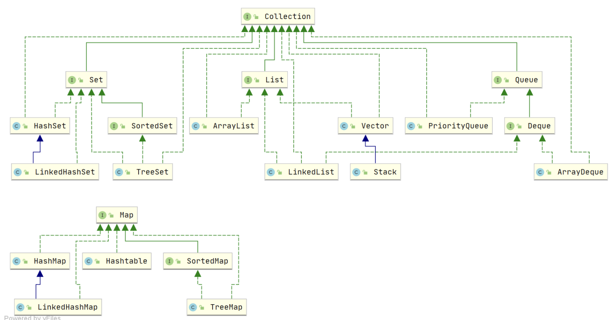
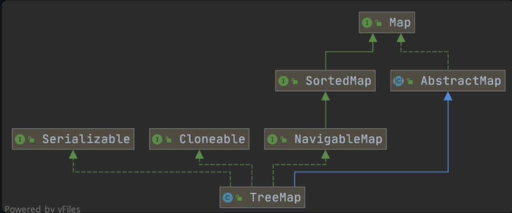
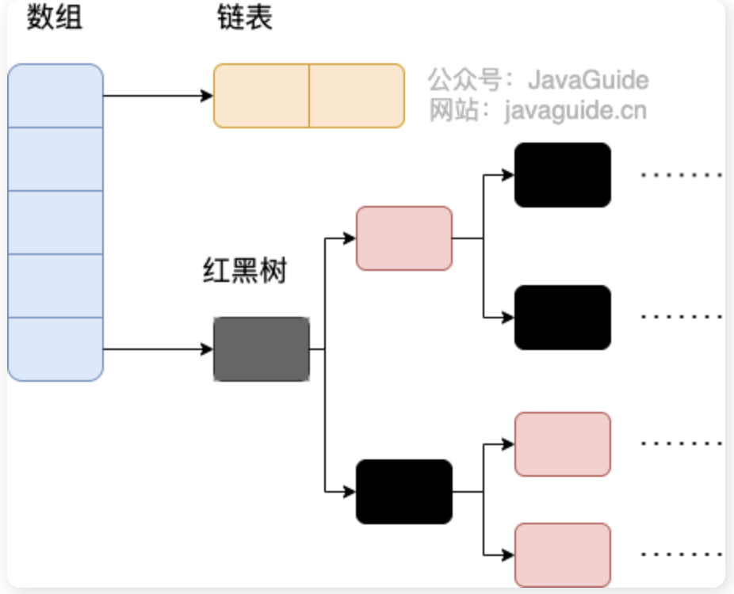
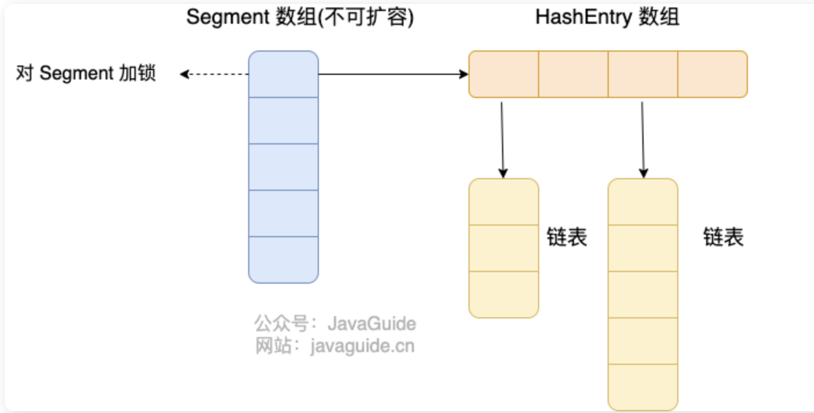
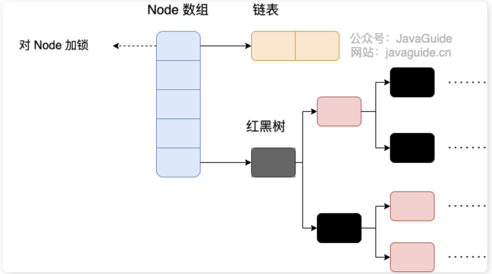
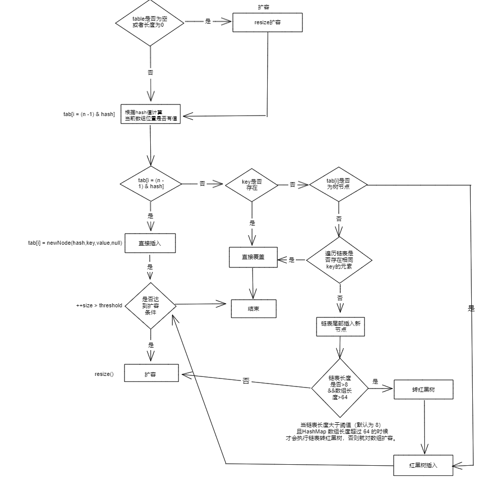

# Java集合

### 集合框架懂？

Java 集合， 也叫作容器，主要是由两大接口派生而来：一个是 `Collection`接口，主要用于存放单一元素；另一个是 `Map` 接口，主要用于存放键值对。对于`Collection` 接口，下面又有三个主要的子接口：`List`、`Set` 和 `Queue`。




### 说说 List, Set, Queue, Map 四者的区别？

- `List`: 存储的元素是有序的、可重复的。
- `Set`: 存储的元素不可重复的。
- `Queue`: 按特定的排队规则来确定先后顺序，存储的元素是有序的、可重复的。
- `Map`: 使用键值对（key-value）存储，key 是无序的、不可重复的，value 是无序的、可重复的，每个键最多映射到一个值。


### 底层数据结构懂？

List

- `ArrayList`：`Object[]` 数组。
- `Vector`：`Object[]` 数组。线程安全
- `LinkedList`：双向链表(JDK1.6 之前为循环链表，JDK1.7 取消了循环)。

Set

- `HashSet`(无序，唯一): 基于 `HashMap` 实现的，底层采用 `HashMap` 来保存元素。
- `LinkedHashSet`: `LinkedHashSet` 是 `HashSet` 的子类，并且其内部是通过 `LinkedHashMap` 来实现的。
- `TreeSet`(有序，唯一): 红黑树(自平衡的排序二叉树)。

Queue

- `PriorityQueue`: `Object[]` 数组来实现小顶堆。
- `DelayQueue`:`PriorityQueue`。
- `ArrayDeque`: 可扩容动态双向数组。

Map

- `HashMap`：JDK1.8 之前 `HashMap` 由数组+链表组成的，数组是 `HashMap` 的主体，链表则是主要为了解决哈希冲突而存在的（“拉链法”解决冲突）。JDK1.8 以后在解决哈希冲突时有了较大的变化，当链表长度大于阈值（默认为 8）（将链表转换成红黑树前会判断，如果当前数组的长度小于 64，那么会选择先进行数组扩容，而不是转换为红黑树）时，将链表转化为红黑树，以减少搜索时间。
- `LinkedHashMap`：`LinkedHashMap` 继承自 `HashMap`，所以它的底层仍然是基于拉链式散列结构即由数组和链表或红黑树组成。另外，`LinkedHashMap` 在上面结构的基础上，增加了一条双向链表，使得上面的结构可以保持键值对的插入顺序。同时通过对链表进行相应的操作，实现了访问顺序相关逻辑。
- `Hashtable`：数组+链表组成的，数组是 `Hashtable` 的主体，链表则是主要为了解决哈希冲突而存在的。线程安全。
- `TreeMap`：红黑树（自平衡的排序二叉树）。


### 如何选用集合？

- 我们需要根据键值获取到元素值时就选用 `Map` 接口下的集合，需要排序时选择 `TreeMap`,不需要排序时就选择 `HashMap`,需要保证线程安全就选用 `ConcurrentHashMap`。
- 我们只需要存放元素值时，就选择实现`Collection` 接口的集合，需要保证元素唯一时选择实现 `Set` 接口的集合比如 `TreeSet` 或 `HashSet`，不需要就选择实现 `List` 接口的比如 `ArrayList` 或 `LinkedList`，然后再根据实现这些接口的集合的特点来选用。


### 为啥要用集合？

当我们需要存储一组类型相同的数据时，数组是最常用且最基本的容器之一。但是，使用数组存储对象存在一些不足之处，因为在实际开发中，存储的数据类型多种多样且数量不确定。

与数组相比，Java 集合提供了更灵活、更有效的方法来存储多个数据对象。Java 集合框架中的各种集合类和接口可以存储不同类型和数量的对象，同时还具有多样化的操作方式。相较于数组，Java 集合的优势在于它们的**大小可变、支持泛型、具有内建算法**等。总的来说，Java 集合提高了数据的存储和处理灵活性，可以更好地适应现代软件开发中多样化的数据需求，并支持高质量的代码编写。


### ArrayList和数组有啥不同？

`ArrayList` 内部基于动态数组实现，比 `Array`（静态数组） 使用起来更加灵活：

- `ArrayList`会根据实际存储的元素**动态地扩容或缩容**，而 `Array` 被创建之后就不能改变它的长度了。
- `ArrayList` 允许你使用泛型来确保类型安全，`Array` 则不可以。
- `ArrayList` 中只能存储**对象**。对于基本类型数据，需要使用其对应的包装类（如 Integer、Double 等）。`Array` 可以直接存储基本类型数据，也可以存储对象。
- `ArrayList` 支持插入、删除、遍历等常见操作，并且提供了丰富的 **API 操作**方法，比如 `add()`、`remove()`等。`Array` 只是一个固定长度的数组，只能按照下标访问其中的元素，不具备动态添加、删除元素的能力。
- `ArrayList`创建时不需要指定大小，而`Array`创建时必须指定大小。


### Vector 和 Stack 的区别?

- `Vector` 和 `Stack` 两者都是线程安全的，都是使用 `synchronized` 关键字进行同步处理。
- `Stack` 继承自 `Vector`，是一个后进先出的栈，而 `Vector` 是一个列表。

随着 Java 并发编程的发展，`Vector` 和 `Stack` 已经被淘汰，推荐使用并发集合类（**例如 `ConcurrentHashMap`、`CopyOnWriteArrayList` 等**）或者手动实现线程安全的方法来提供安全的多线程操作支持。


### LinkedList 为什么不能实现 RandomAccess 接口？

`RandomAccess` 是一个标记接口，用来表明实现该接口的类支持**随机访问**（即可以通过索引快速访问元素）。由于 `LinkedList` 底层数据结构是链表，内存地址不连续，只能通过指针来定位，不支持随机快速访问，所以不能实现 `RandomAccess` 接口。


### ***懂RandomAccess 接口？

```java
public interface RandomAccess {
}
```

查看源码我们发现实际上 `RandomAccess` 接口中什么都没有定义。所以，在我看来 `RandomAccess` 接口不过是一个标识罢了。标识什么？ **标识实现这个接口的类具有随机访问功能。**

在 `binarySearch（)` 方法中，它要判断传入的 list 是否 `RandomAccess` 的实例，如果是，调用`indexedBinarySearch()`方法，如果不是，那么调用`iteratorBinarySearch()`方法

```java
    public static <T>
    int binarySearch(List<? extends Comparable<? super T>> list, T key) {
        if (list instanceof RandomAccess || list.size()<BINARYSEARCH_THRESHOLD)
            return Collections.indexedBinarySearch(list, key);
        else
            return Collections.iteratorBinarySearch(list, key);
    }
```


### Comparable 和 Comparator 的区别？

`Comparable` 接口和 `Comparator` 接口都是 Java 中用于排序的接口，它们在实现类对象之间比较大小、排序等方面发挥了重要作用：

- `Comparable` 接口实际上是出自`java.lang`包 它有一个 `compareTo(Object obj)`方法用来排序
- `Comparator`接口实际上是出自 `java.util` 包它有一个`compare(Object obj1, Object obj2)`方法用来排序

compatable实际是在类实现的接口，然后在定义一个类的时候重写compareTo方法

Comparator是在调用sort函数的时候传入的自定义规则


### Queue和Deque？

`Queue` 是单端队列，只能从一端插入元素，另一端删除元素，实现上一般遵循 **先进先出（FIFO）** 规则。

`Queue` 扩展了 `Collection` 的接口，根据 **因为容量问题而导致操作失败后处理方式的不同** 可以分为两类方法: 一种在操作失败后会抛出异常，另一种则会返回特殊值。

| `Queue` 接口 | 抛出异常  | 返回特殊值 |
| ------------ | --------- | ---------- |
| 插入队尾     | add(E e)  | offer(E e) |
| 删除队首     | remove()  | poll()     |
| 查询队首元素 | element() | peek()     |

`Deque` 是双端队列，在队列的两端均可以插入或删除元素。

`Deque` 扩展了 `Queue` 的接口, 增加了在队首和队尾进行插入和删除的方法，同样根据失败后处理方式的不同分为两类：

| `Deque` 接口 | 抛出异常      | 返回特殊值      |
| ------------ | ------------- | --------------- |
| 插入队首     | addFirst(E e) | offerFirst(E e) |
| 插入队尾     | addLast(E e)  | offerLast(E e)  |
| 删除队首     | removeFirst() | pollFirst()     |
| 删除队尾     | removeLast()  | pollLast()      |
| 查询队首元素 | getFirst()    | peekFirst()     |
| 查询队尾元素 | getLast()     | peekLast()      |

事实上，`Deque` 还提供有 `push()` 和 `pop()` 等其他方法，可用于模拟栈。


### ArrayDeque 与 LinkedList 的区别？

`ArrayDeque` 和 `LinkedList` 都实现了 `Deque` 接口，两者都具有队列的功能，但两者有什么区别呢？

- `ArrayDeque` 是基于可变长的数组和双指针来实现，而 `LinkedList` 则通过链表来实现。
- `ArrayDeque` 不支持存储 `NULL` 数据，但 `LinkedList` 支持。
- `ArrayDeque` 是在 JDK1.6 才被引入的，而`LinkedList` 早在 JDK1.2 时就已经存在。
- `ArrayDeque` 插入时可能存在扩容过程, 不过均摊后的插入操作依然为 O(1)。虽然 `LinkedList` 不需要扩容，但是每次插入数据时均需要申请新的堆空间，均摊性能相比更慢。

从性能的角度上，选用 `ArrayDeque` 来实现队列要比 `LinkedList` 更好。此外，`ArrayDeque` 也可以用于实现栈。


### 说一说 PriorityQueue

`PriorityQueue` 是在 JDK1.5 中被引入的, 其与 `Queue` 的区别在于元素出队顺序是与优先级相关的，即总是优先级最高的元素先出队。

这里列举其相关的一些要点：

- `PriorityQueue` 利用了二叉堆的数据结构来实现的，底层使用可变长的数组来存储数据
- `PriorityQueue` 通过堆元素的上浮和下沉，实现了在 O(logn) 的时间复杂度内插入元素和删除堆顶元素。
- `PriorityQueue` 是非线程安全的，且不支持存储 `NULL` 和 `non-comparable` 的对象。
- `PriorityQueue` 默认是小顶堆，但可以接收一个 `Comparator` 作为构造参数，从而来自定义元素优先级的先后。

`PriorityQueue` 在面试中可能更多的会出现在手撕算法的时候，典型例题包括堆排序、求第 K 大的数、带权图的遍历等，所以需要会熟练使用才行。


### 阻塞队列懂？

`BlockingQueue` （阻塞队列）是一个接口，继承自 `Queue`。`BlockingQueue`阻塞的原因是其支持当队列没有元素时一直阻塞，直到有元素才取**take**；还支持如果队列已满，一直等到队列可以放入新元素时再放入**put**。

```java
public interface BlockingQueue<E> extends Queue<E> {
  // ...
}
```

`BlockingQueue` 常用于生产者-消费者模型中，生产者线程会向队列中添加数据，而消费者线程会从队列中取出数据进行处理。


### ***BlockingQueue有哪些实现类？

Java 中常用的阻塞队列实现类有以下几种：

1. `ArrayBlockingQueue`：使用数组实现的有界阻塞队列。在创建时需要指定容量大小，并支持公平和非公平两种方式的锁访问机制。
2. `LinkedBlockingQueue`：使用单向链表实现的可选有界阻塞队列。在创建时可以指定容量大小，如果不指定则默认为`Integer.MAX_VALUE`。和`ArrayBlockingQueue`不同的是， 它仅支持非公平的锁访问机制。
3. `PriorityBlockingQueue`：支持优先级排序的无界阻塞队列。元素必须实现`Comparable`接口或者在构造函数中传入`Comparator`对象，并且不能插入 null 元素。
4. `SynchronousQueue`：同步队列，是一种不存储元素的阻塞队列。每个插入操作都必须等待对应的删除操作，反之删除操作也必须等待插入操作。因此，`SynchronousQueue`通常用于线程之间的直接传递数据。
5. `DelayQueue`：延迟队列，其中的元素只有到了其指定的延迟时间，才能够从队列中出队。
6. ……

日常开发中，这些队列使用的其实都不多，了解即可。


### ***ArrayBlockingQueue 和 LinkedBlockingQueue 有什么区别？

`ArrayBlockingQueue` 和 `LinkedBlockingQueue` 是 Java 并发包中常用的两种阻塞队列实现，它们都是线程安全的。不过，不过它们之间也存在下面这些区别：

- 底层实现：`ArrayBlockingQueue` 基于数组实现，而 `LinkedBlockingQueue` 基于链表实现。
- 是否有界：`ArrayBlockingQueue` 是有界队列，必须在创建时指定容量大小。`LinkedBlockingQueue` 创建时可以不指定容量大小，默认是`Integer.MAX_VALUE`，也就是无界的。但也可以指定队列大小，从而成为有界的。
- 锁是否分离： `ArrayBlockingQueue`中的锁是没有分离的，即生产和消费用的是**同一个**锁；`LinkedBlockingQueue`中的锁是分离的，即生产用的是`putLock`，消费是`takeLock`，这样可以防止生产者和消费者线程之间的锁争夺。
- 内存占用：`ArrayBlockingQueue` 需要提前分配数组内存，而 `LinkedBlockingQueue` 则是动态分配链表节点内存。这意味着，`ArrayBlockingQueue` 在创建时就会占用一定的内存空间，且往往申请的内存比实际所用的内存更大，而`LinkedBlockingQueue` 则是根据元素的增加而逐渐占用内存空间。


### ***HashMap和Hashtable区别懂？

- **线程是否安全：** `HashMap` 是非线程安全的，`Hashtable` 是线程安全的,因为 `Hashtable` 内部的方法基本都经过`synchronized` 修饰。（如果你要保证线程安全的话就使用 `ConcurrentHashMap` 吧！）；
- **效率：** 因为线程安全的问题，`HashMap` 要比 `Hashtable` 效率高一点。另外，`Hashtable` 基本被淘汰，不要在代码中使用它；
- **对 Null key 和 Null value 的支持：** `HashMap` 可以存储 null 的 key 和 value，但 null 作为键只能有一个，null 作为值可以有多个；Hashtable 不允许有 null 键和 null 值，否则会抛出 `NullPointerException`。
- **初始容量大小和每次扩充容量大小的不同：** ① 创建时如果不指定容量初始值，`Hashtable` 默认的初始大小为 11，之后每次扩充，容量变为原来的 2n+1。`HashMap` 默认的初始化大小为 16。之后每次扩充，容量变为原来的 2 倍。② 创建时如果给定了容量初始值，那么 `Hashtable` 会直接使用你给定的大小，而 `HashMap` 会将其扩充为 2 的幂次方大小（`HashMap` 中的`tableSizeFor()`方法保证，下面给出了源代码）。也就是说 `HashMap` 总是使用 2 的幂作为哈希表的大小,后面会介绍到为什么是 2 的幂次方。
- **底层数据结构：** JDK1.8 以后的 `HashMap` 在解决哈希冲突时有了较大的变化，当链表长度大于阈值（默认为 8）时，将链表转化为红黑树（将链表转换成红黑树前会判断，如果当前数组的长度小于 64，那么会选择先进行数组扩容，而不是转换为红黑树），以减少搜索时间（后文中我会结合源码对这一过程进行分析）。`Hashtable` 没有这样的机制。

`HashMap` 中带有初始容量的构造函数：

```java
  public HashMap(int initialCapacity, float loadFactor) {
      if (initialCapacity < 0)
          throw new IllegalArgumentException("Illegal initial capacity: " +
                                             initialCapacity);
      if (initialCapacity > MAXIMUM_CAPACITY)
          initialCapacity = MAXIMUM_CAPACITY;
      if (loadFactor <= 0 || Float.isNaN(loadFactor))
          throw new IllegalArgumentException("Illegal load factor: " +
                                             loadFactor);
      this.loadFactor = loadFactor;
      this.threshold = tableSizeFor(initialCapacity);
  }
   public HashMap(int initialCapacity) {
      this(initialCapacity, DEFAULT_LOAD_FACTOR);
  }
```

```java
/**
 * Returns a power of two size for the given target capacity.
 * 保证了 HashMap 总是使用 2 的幂作为哈希表的大小。
 */
static final int tableSizeFor(int cap) {
    int n = cap - 1;
    n |= n >>> 1;
    n |= n >>> 2;
    n |= n >>> 4;
    n |= n >>> 8;
    n |= n >>> 16;
    return (n < 0) ? 1 : (n >= MAXIMUM_CAPACITY) ? MAXIMUM_CAPACITY : n + 1;
}
```


### ***HashMap和TreeMap懂？

`TreeMap` 和`HashMap` 都继承自`AbstractMap` ，但是需要注意的是`TreeMap`它还实现了`NavigableMap`接口和`SortedMap` 接口。



实现 `NavigableMap` 接口让 `TreeMap` 有了对集合内元素的搜索的能力。

实现`SortedMap`接口让 `TreeMap` 有了对集合中的元素根据键排序的能力。**默认是按 key 的升序排序**，不过我们也可以指定排序的比较器。

底层HashMap是数组+链表+红黑树，TreeMap底层是红黑树

```java
TreeMap<Person, String> treeMap = new TreeMap<>((person1, person2) -> {
  int num = person1.getAge() - person2.getAge();
  return Integer.compare(num, 0);
});
TreeMap<Person, String> treeMap = new TreeMap<>(new Comparator<Person>() {
    @Override
    public int compare(Person person1, Person person2) {
        int num = person1.getAge() - person2.getAge();
        return Integer.compare(num, 0);
    }
});
```


### HashSet如何去重？

当你把对象加入`HashSet`时，`HashSet` 会先计算对象的`hashcode`值来判断对象加入的位置，同时也会与其他加入的对象的 `hashcode` 值作比较，如果没有相符的 `hashcode`，`HashSet` 会假设对象没有重复出现。但是如果发现有相同 `hashcode` 值的对象，这时会调用`equals()`方法来检查 `hashcode` 相等的对象是否真的相同。如果两者相同，`HashSet` 就不会让加入操作成功。

在 JDK1.8 中，**实际上无论`HashSet`中是否已经存在了某元素，`HashSet`都会直接插入，只是会在`add()`方法的返回值处告诉我们插入前是否存在相同元素。如果存在就会返回已经有的元素，不存在会返回null**，所以他的源码如下：

```java
// Returns: true if this set did not already contain the specified element
// 返回值：当 set 中没有包含 add 的元素时返回真
public boolean add(E e) {
        return map.put(e, PRESENT)==null;
}
```


### ***HashMap底层实现？

JDK1.8 之前 `HashMap` 底层是 **数组和链表** 结合在一起使用也就是 **链表散列**，JDK1.8后新增了一个红黑树来提高查找效率。HashMap 通过 key 的 `hashcode` 经过扰动函数处理过后得到 hash 值，然后通过 `(n - 1) & hash` 判断当前元素存放的位置（这里的 n 指的是数组的长度），如果当前位置存在元素的话，就判断该元素与要存入的元素的 hash 值以及 key 是否相同，如果相同的话，直接覆盖，不相同就通过拉链法解决冲突。所谓 **“拉链法”** 就是：将链表和数组相结合。也就是说创建一个链表数组，数组中每一格就是一个链表。若遇到哈希冲突，则将冲突的值加到链表中即可。

所谓扰动函数指的就是 HashMap 的 `hash` 方法。使用 `hash` 方法也就是扰动函数是为了防止一些实现比较差的 `hashCode()` 方法 换句话说使用扰动函数之后可以减少碰撞。

```java
static final int hash(Object key) {
    int h;
    // key.hashCode()：返回散列值也就是hashcode
    // ^：按位异或
    // >>>:无符号右移，忽略符号位，空位都以0补齐
    return (key == null) ? 0 : (h = key.hashCode()) ^ (h >>> 16);
} // 1.8
static int hash(int h) {
  h ^= (h >>> 20) ^ (h >>> 12);
  return h ^ (h >>> 7) ^ (h >>> 4);
} // 1.7
// 相比于 JDK1.8 的 hash 方法 ，JDK 1.7 的 hash 方法的性能会稍差一点点，因为毕竟扰动了 4 次。
```

相比于之前的版本， JDK1.8 之后在解决哈希冲突时有了较大的变化，当链表长度大于阈值（默认为 8）（将链表转换成红黑树前会判断，如果当前数组的长度小于 64，那么会选择先进行数组扩容，而不是转换为红黑树）时，将链表转化为红黑树，以减少搜索时间。



> TreeMap、TreeSet 以及 JDK1.8 之后的 HashMap 底层都用到了红黑树。红黑树就是为了解决二叉查找树的缺陷，因为二叉查找树在某些情况下会退化成一个线性结构。

**如果当链表长度达到8，回去调用红黑树转换的函数，函数内会判断如果当前数组的长度小于 64，那么会选择先进行数组扩容，而不是转换为红黑树。每次扩容都会重新hash**

首先和hashcode碰撞次数的泊松分布有关，主要是为了寻找一种时间和空间的平衡。在负载因子0.75（HashMap默认）的情况下，单个hash槽内元素个数为8的概率小于百万分之一，将7作为一个分水岭，等于7时不做转换，**大于等于8才转红黑树，小于等于6才转链表**。链表中元素个数为8时的概率已经非常小，再多的就更少了，所以**原作者在选择链表元素个数时选择了8，是根据概率统计而选择的。**


### **HashMap的长度为什么是2的幂次方？

为了能让 HashMap 存取高效，尽量较少碰撞，也就是要尽量把数据分配均匀。Hash 值（int类型）的范围值-2147483648 到 2147483647，前后加起来大概 40 亿的映射空间，只要哈希函数映射得比较均匀松散，一般应用是很难出现碰撞的。但问题是一个 40 亿长度的数组，内存是放不下的。hash散列值用之前还要先做对数组的长度取模运算，得到的余数才能用来要存放的位置也就是对应的数组下标。这个数组下标的计算方法是“ `(n - 1) & hash`”。（n 代表数组长度）。这也就解释了 HashMap 的长度为什么是 2 的幂次方。n-1的二进制的每一位都必须是1.

我们首先可能会想到采用%取余的操作来实现。但是，重点来了：“取余(%)操作中如果除数是 2 的幂次则等价于与其除数减一的与(&)操作（也就是说 hash%length==hash&(length-1)的前提是 length 是 2 的 n 次方；）。” 并且 采用二进制位操作 &，相对于%能够提高运算效率，这就解释了 HashMap 的长度为什么是 2 的幂次方。

总结：散列效率更高


### HashMap多线程死循环问题？

JDK1.7 及之前版本的 `HashMap` 在多线程环境下扩容操作可能存在死循环问题，这是由于当一个桶位中有多个元素需要进行扩容时，多个线程同时对链表进行操作，头插法可能会导致链表中的节点指向错误的位置，从而形成一个环形链表，进而使得查询元素的操作陷入死循环无法结束。

为了解决这个问题，JDK1.8 版本的 HashMap 采用了**尾插法**而不是头插法来避免链表倒置，使得插入的节点永远都是放在链表的末尾，避免了链表中的环形结构。但是还是不建议在多线程下使用 `HashMap`，因为多线程下使用 `HashMap` 还是会存在数据覆盖的问题。并发环境下，推荐使用 `ConcurrentHashMap` 。


### ***HashMap为什么线程不安全？

并发修改公共变量

JDK 1.8 后，在 `HashMap` 中，多个键值对可能会被分配到同一个桶（bucket），并以链表或红黑树的形式存储。多个线程对 `HashMap` 的 `put` 操作会导致线程不安全，具体来说会有数据覆盖或丢失的风险。

覆盖：两个线程散列的值一样，后面插入的会覆盖前面插入的（因为计算散列和插入不是原子性的操作）

丢失：在更新size时，使用的是++，这不是一个原子操作（取值，计算，赋值），多个线程可能计算得到同样的值，所以会出现插入了多个，size值只增加了1


### ***HashMap常见的遍历方式？

HashMap **遍历从大的方向来说，可分为以下 4 类**：

1. 迭代器（Iterator）方式遍历；
2. For Each 方式遍历；
3. Lambda 表达式遍历（JDK 1.8+）;
4. Streams API 遍历（JDK 1.8+）。

但每种类型下又有不同的实现方式，因此具体的遍历方式又可以分为以下 7 种：

1. 使用迭代器（Iterator）EntrySet 的方式进行遍历；

2. 使用迭代器（Iterator）KeySet 的方式进行遍历；

3. 使用 For Each EntrySet 的方式进行遍历；

4. 使用 For Each KeySet 的方式进行遍历；

5. 使用 Lambda 表达式的方式进行遍历，也是得到key，value；

   ```java
   map.forEach((key, value) -> {
     System.out.println(key);
     System.out.println(value);
   });
   ```

6. 使用 Streams API 单线程的方式进行遍历，得到entry；

   ```java
   map.entrySet().stream().forEach((entry) -> {
     System.out.println(entry.getKey());
     System.out.println(entry.getValue());
   });
   ```

7. 使用 Streams API 多线程的方式进行遍历。

> entrySet速度要比keySet速度要快，所以尽量使用entrySet遍历，使用迭代器和for Each性能差不多，他们生成的字节码是一样的


### ***ConcurrentHashMap 和 Hashtable区别？

在 JDK1.7 的时候，`ConcurrentHashMap` 对整个桶数组进行了分割分段(`Segment`，分段锁)，每一把锁只锁容器其中一部分数据（下面有示意图），多线程访问容器里不同数据段的数据，就不会存在锁竞争，提高并发访问率。

到了 JDK1.8 的时候，`ConcurrentHashMap` 已经摒弃了 `Segment` 的概念，而是直接用 `Node` 数组+链表+红黑树的数据结构来实现，并发控制使用 `synchronized` 和 CAS 来操作。数组中的节点上锁

**`Hashtable`(同一把锁)** :使用 `synchronized` 来保证线程安全，效率非常低下。当一个线程访问同步方法时，其他线程也访问同步方法，可能会进入阻塞或轮询状态，如使用 put 添加元素，另一个线程不能使用 put 添加元素，也不能使用 get，竞争会越来越激烈效率越低。而且没有红黑树


### ***ConcurrentHashMap底层原理？

- **线程安全实现方式**：JDK 1.7 采用 `Segment` 分段锁来保证安全， Segment 通过继承 ReentrantLock 来进行加锁。JDK1.8 放弃了 `Segment` 分段锁的设计，采用 `Node + CAS + synchronized` 保证线程安全，锁粒度更细，`synchronized` 只锁定当前链表或红黑二叉树的首节点。
- **Hash 碰撞解决方法** : JDK 1.7 采用拉链法，JDK1.8 采用拉链法结合红黑树（链表长度超过一定阈值时，将链表转换为红黑树）。
- **并发度**：JDK 1.7 **最大并发度concurrencyLevel是 Segment 的个数，默认是 16**，并且一旦设定，不可改变。JDK 1.8 **最大并发度是 Node 数组的大小，并发度更大**。

1.7



1.8



Java 8 中，锁粒度更细，`synchronized` 只锁定当前链表或红黑二叉树的首节点，这样**只要 hash 不冲突，就不会产生并发，就不会影响其他 Node 的读写，效率大幅提升。**

**java1.7 之前：在进行添加和删除时，调用tryLock请求获取锁，获取失败就轮询请求，他有一个最大循环次数，如果一直拿不到，就直接lock进入阻塞拿锁**

**java1.8 之后：加锁方式CAS和synchronized：当要修改容量时，有一个size变量，对他进行cas，保证只有一个线程能改大小。加入元素时，如果位置为空，使用cas保证只有一个能放进去，如果不为空，则使用synchronized方法锁住第一个元素。**


### ***concurrenthashmap为什么不支持null？

拿 get 方法取值来说，返回的结果为 null 存在两种情况：值没有在集合中 ；值本身就是 null。这样就会有二义性。

hashMap之所以支持，是因为他可以使用containsKey来判断这个key是否存在

但是多线程的时候就无法保证containsKey一定判断正确，在并发环境下，你一开始get方法获取到null之后，再去调用containsKey方法，没法确保get方法和containsKey方法之间，没有别的线程来捣乱，刚好把你要查询的对象设置了进去或者删除掉了。


### ***concurrenthashmap能保证操作的原子性吗？

不能！复合操作是指由多个基本操作(如`put`、`get`、`remove`、`containsKey`等)组成的操作，例如先判断某个键是否存在`containsKey(key)`，然后根据结果进行插入或更新`put(key, value)`。这种操作在执行过程中可能会被其他线程打断，导致结果不符合预期。

 `ConcurrentHashMap` 复合操作的原子性的保证有解决方案？

`ConcurrentHashMap` **提供了一些原子性的复合操作**，如 `putIfAbsent`、`compute`、`computeIfAbsent` 、`computeIfPresent`、`merge`等。这些方法都可以接受一个函数作为参数，根据给定的 key 和 value 来计算一个新的 value，并且将其更新到 map 中。

```java
// 线程 A
map.putIfAbsent(key, value);
// 线程 B
map.putIfAbsent(key, anotherValue);
// 线程 A
map.computeIfAbsent(key, k -> value);
// 线程 B
map.computeIfAbsent(key, k -> anotherValue);
```

不建议使用自己加锁来实现，这样违背了使用 `ConcurrentHashMap` 的初衷


### ArrayList底层懂？

`ArrayList` 的底层是数组队列，相当于动态数组。与 Java 中的数组相比，它的容量能动态增长。在添加大量元素前，应用程序可以使用`ensureCapacity`操作来增加 `ArrayList` 实例的容量。这可以减少递增式再分配的数量。

`ArrayList` 继承于 `AbstractList` ，实现了 `List`, `RandomAccess`, `Cloneable`, `java.io.Serializable` 这些接口。

- `List` : 表明它是一个列表，支持添加、删除、查找等操作，并且可以通过下标进行访问。
- `RandomAccess` ：这是一个标志接口，表明实现这个接口的 `List` 集合是支持 **快速随机访问** 的。在 `ArrayList` 中，我们即可以通过元素的序号快速获取元素对象，这就是快速随机访问。
- `Cloneable` ：表明它具有拷贝能力，可以进行深拷贝或浅拷贝操作。
- `Serializable` : 表明它可以进行序列化操作，也就是可以将对象转换为字节流进行持久化存储或网络传输，非常方便。

扩容机制：

**初始容量为10，每次满了之后，使用该规则扩容`int newCapacity = oldCapacity + (oldCapacity >> 1)`,所以 ArrayList 每次扩容之后容量都会变为原来的 1.5 倍左右**

**以无参数构造方法创建 `ArrayList` 时，实际上初始化赋值的是一个空数组。当真正对数组进行添加元素操作时，才真正分配容量。即向数组中添加第一个元素时，数组容量扩为 10。 如果传递了，就用它传递的。**

```java
public ArrayList(int initialCapacity) {
  if (initialCapacity > 0) {//初始容量大于0
      //创建initialCapacity大小的数组
      this.elementData = new Object[initialCapacity];
  } else if (initialCapacity == 0) {//初始容量等于0
      //创建空数组
      this.elementData = EMPTY_ELEMENTDATA;
  } else {//初始容量小于0，抛出异常
      throw new IllegalArgumentException("Illegal Capacity: " + initialCapacity);
  }
}
```


### ****HashMap底层？

HashMap 主要用来存放键值对，它基于哈希表的 Map 接口实现，是常用的 Java 集合之一，是非线程安全的。

`HashMap` 可以存储 null 的 key 和 value，但 null 作为键只能有一个，null 作为值可以有多个

JDK1.8 之前 HashMap 由 数组+链表 组成的，数组是 HashMap 的主体，链表则是主要为了解决哈希冲突而存在的（“拉链法”解决冲突）。 JDK1.8 以后的 `HashMap` 在解决哈希冲突时有了较大的变化，当链表长度大于等于阈值（默认为 8）（将链表转换成红黑树前会判断，如果当前数组的长度小于 64，那么会选择先进行数组扩容，而不是转换为红黑树）时，将链表转化为红黑树，以减少搜索时间。当小于6的时候，又会将红黑树转回链表。

`HashMap` 默认的初始化大小为 16。之后每次扩充（达到负载因子，默认是0.75），容量变为原来的 2 倍。并且， `HashMap` 总是使用 2 的幂作为哈希表的大小。扩容这个过程涉及到 rehash、复制数据等操作，所以非常消耗性能。

增加一个元素过程：应该是等于8和等于64，不是大于。




### ***CopyOnWriteArrayList懂？

对于大部分业务场景来说，读取操作往往是远大于写入操作的。由于读取操作不会对原有数据进行修改，因此，对于每次读取都进行加锁其实是一种资源浪费。相比之下，我们应该允许多个线程同时访问 `List` 的内部数据，毕竟对于读取操作来说是安全的。

这种思路与 `ReentrantReadWriteLock` 读写锁的设计思想非常类似，即读读不互斥、读写互斥、写写互斥（只有读读不互斥）。`CopyOnWriteArrayList` 更进一步地实现了这一思想。为了将读操作性能发挥到极致，`CopyOnWriteArrayList` 中的读取操作是完全无需加锁的。更加厉害的是，写入操作也不会阻塞读取操作，只有写写才会互斥。这样一来，读操作的性能就可以大幅度提升。

`CopyOnWriteArrayList` 线程安全的核心在于其采用了 **写时复制（Copy-On-Write）** 的策略，从 `CopyOnWriteArrayList` 的名字就能看出了。

当需要修改（ `add`，`set`、`remove` 等操作） `CopyOnWriteArrayList` 的内容时，不会直接修改原数组，而是会先创建底层数组的副本，对副本数组进行修改，修改完之后再将修改后的数组赋值回去，这样就可以保证写操作不会影响读操作了。这里会加锁

写时复制机制依然存在一些缺点，下面列举几点：

1. 内存占用：每次写操作都需要复制一份原始数据，会占用额外的内存空间，在数据量比较大的情况下，可能会导致内存资源不足。
2. 写操作开销：每一次写操作都需要复制一份原始数据，然后再进行修改和替换，所以写操作的开销相对较大，在写入比较频繁的场景下，性能可能会受到影响。
3. 数据一致性问题：修改操作不会立即反映到最终结果中，还需要等待复制完成，这可能会导致一定的数据一致性

CopyOnWriteArrayList在遍历时会创建一个COWIterator，COWIterator表示迭代器，其也有一个Object类型的数组作为CopyOnWriteArrayList数组的快照，这种快照风格的迭代器方法在创建迭代器时使用了对当时数组状态的引用。此数组在迭代器的生存期内不会更改，因此不可能发生冲突，并且迭代器保证不会抛出 ConcurrentModificationException。创建迭代器以后，迭代器就不会反映列表的添加、移除或者更改。在迭代器上进行的元素更改操作(remove、set 和 add)不受支持。这些方法将直接抛出 UnsupportedOperationException。


### ***阻塞队列懂？

阻塞队列就是典型的生产者-消费者模型，它可以做到以下几点:

1. 当阻塞队列数据为空时，所有的消费者线程都会被阻塞，等待队列非空。
2. 当生产者往队列里填充数据后，队列就会通知消费者队列非空，消费者此时就可以进来消费。
3. 当阻塞队列因为消费者消费过慢或者生产者存放元素过快导致队列填满时无法容纳新元素时，生产者就会被阻塞，等待队列非满时继续存放元素。
4. 当消费者从队列中消费一个元素之后，队列就会通知生产者队列非满，生产者可以继续填充数据了。

总结一下：阻塞队列就说基于非空和非满两个条件实现生产者和消费者之间的交互，尽管这些交互流程和等待通知的机制实现非常复杂，好在 Doug Lea 的操刀之下已将阻塞队列的细节屏蔽，我们只需调用 `put`、`take`、`offer`、`poll` 等 API 即可实现多线程之间的生产和消费。

阻塞：take，put；非阻塞：add，remove，peek；等待时间：offer，poll

这也使得阻塞队列在多线程开发中有着广泛的运用，最常见的例子无非是我们的线程池,从源码中我们就能看出当核心线程无法及时处理任务时，这些任务都会扔到 `workQueue` 中。

```java
public ThreadPoolExecutor(int corePoolSize,
                          int maximumPoolSize,
                          long keepAliveTime,
                          TimeUnit unit,
                          BlockingQueue<Runnable> workQueue,
                          ThreadFactory threadFactory,
                          RejectedExecutionHandler handler) {
// ...
}
```

可以看put源码

**实际上是使用了ReentrantLock可重入锁，然后上锁循环等待，enqueue中会有`notEmpty.signal();`来释放锁并唤醒等待的线程，通过 `Condition` 实现线程间的等待和唤醒操作。**应该是dequeue的时候会有notFull.signal。

```java
public void put(E e) throws InterruptedException {
    //确保插入的元素不为null
    checkNotNull(e);
    //加锁
    final ReentrantLock lock = this.lock;
    //这里使用lockInterruptibly()方法而不是lock()方法是为了能够响应中断操作，如果在等待获取锁的过程中被打断则该方法会抛出InterruptedException异常。
    lock.lockInterruptibly();
    try {
            //如果count等数组长度则说明队列已满，当前线程将被挂起放到AQS队列中，等待队列非满时插入（非满条件）。
       //在等待期间，锁会被释放，其他线程可以继续对队列进行操作。
        while (count == items.length) // 如果是非阻塞，这里是if，会直接返回
            notFull.await();
           //如果队列可以存放元素，则调用enqueue将元素入队
        enqueue(e);
    } finally {
        //释放锁
        lock.unlock();
    }
}
```


### 并发修改异常ConcurrentModificationException？

- 异常产生原因：并发修改异常指的是在并发环境下，当方法检测到对象的并发修改，但不允许这种修改时，抛出该异常。
- 实际上，在单线程也会发生，如果在使用iterator遍历的时候执行了增加和删除元素，就会报这个异常

在调用next方法时会调用checkForComodification()方法，方法比较modCount 变量值不等于expectedModCount变量值时，就会触发此异常。每add和remove一次，modCount会+1，而在调用iterater()获取迭代器方法时，会将modCount赋值给expectedModCount。

解决：使用iterator.remove()不会产生并发修改异常，迭代器调用remove()方法删除元素，底层还是调用的集合的删除元素的方法；在调用remove()方法后，都会将modCount的值赋值给expectedModCount，保证了它两的值永远都是相等的，所以也就不会产生并发修改异常

