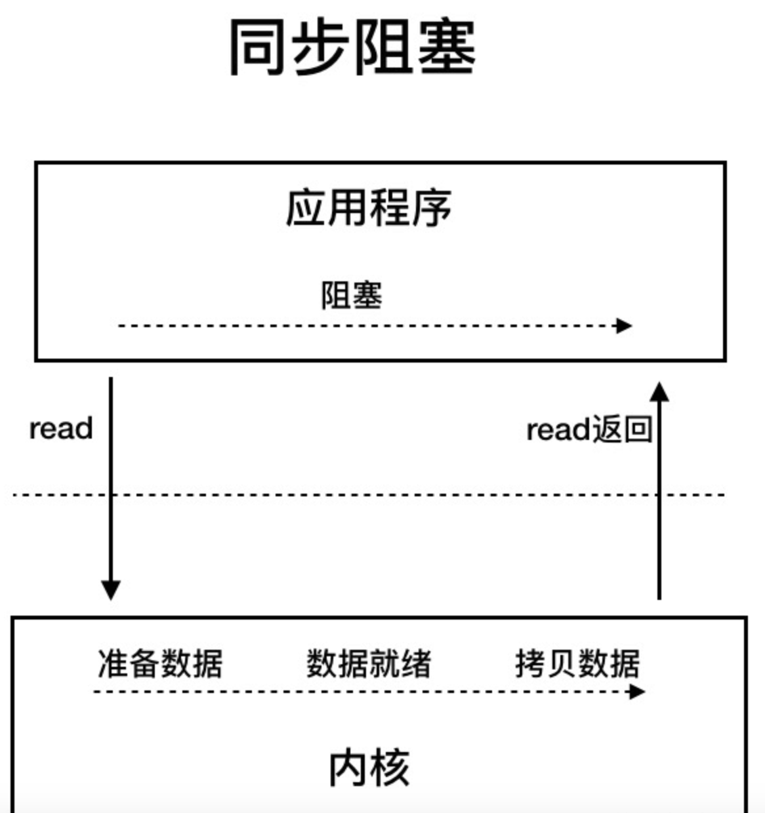
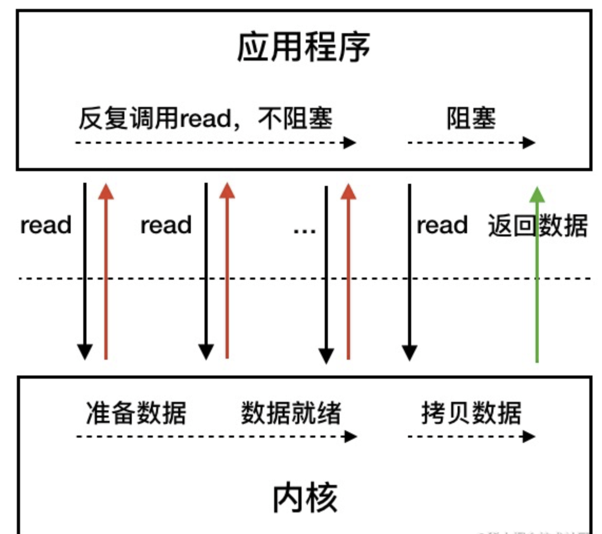
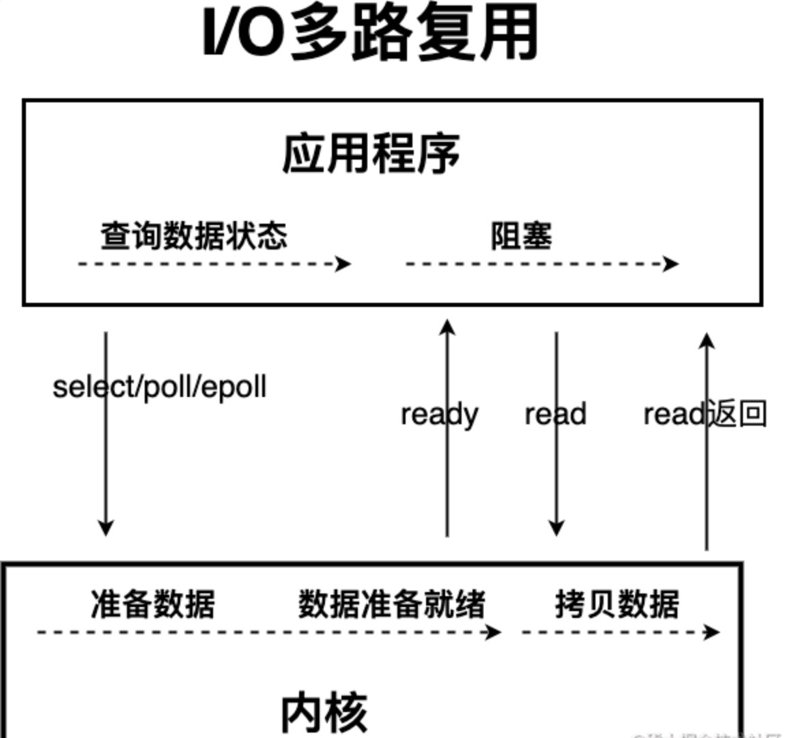
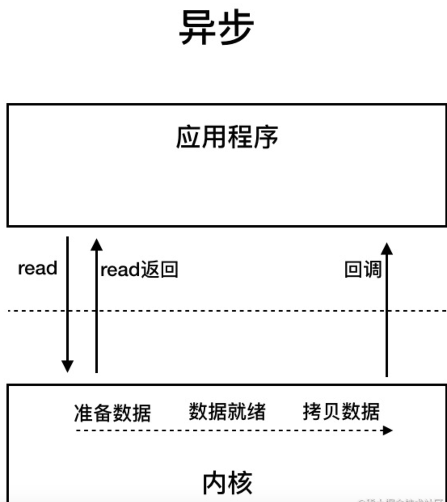

# IO

IO 即 `Input/Output`，输入和输出。数据输入到计算机内存的过程即输入，反之输出到外部存储（比如数据库，文件，远程主机）的过程即输出。数据传输过程类似于水流，因此称为 IO 流。IO 流在 Java 中分为输入流和输出流，而根据数据的处理方式又分为字节流和字符流。

Java IO 流的 40 多个类都是从如下 4 个抽象类基类中派生出来的。

- `InputStream`/`Reader`: 所有的输入流的基类，前者是字节输入流，后者是字符输入流。
- `OutputStream`/`Writer`: 所有输出流的基类，前者是字节输出流，后者是字符输出流。


### 字节输入流？

`FileInputStream` 是一个比较常用的字节输入流对象，可直接指定文件路径，可以直接读取单字节数据，也可以读取至字节数组中。

`FileInputStream` 代码示例：

```java
try (InputStream fis = new FileInputStream("input.txt")) {
    System.out.println("Number of remaining bytes:"
            + fis.available());
    int content;
    long skip = fis.skip(2);
    System.out.println("The actual number of bytes skipped:" + skip);
    System.out.print("The content read from file:");
    while ((content = fis.read()) != -1) {
        System.out.print((char) content);
    }
} catch (IOException e) {
    e.printStackTrace();
}
```

不过，一般我们是不会直接单独使用 `FileInputStream` ，通常会配合 `BufferedInputStream`（字节缓冲输入流）来使用。

像下面这段代码在我们的项目中就比较常见，我们通过 `readAllBytes()` 读取输入流所有字节并将其直接赋值给一个 `String` 对象。

```java
// 新建一个 BufferedInputStream 对象
BufferedInputStream bufferedInputStream = new BufferedInputStream(new FileInputStream("input.txt"));
// 读取文件的内容并复制到 String 对象中
String result = new String(bufferedInputStream.readAllBytes());
System.out.println(result);
```

`DataInputStream` 用于读取指定类型数据，不能单独使用，必须结合其它流，比如 `FileInputStream` 。

```java
FileInputStream fileInputStream = new FileInputStream("input.txt");
//必须将fileInputStream作为构造参数才能使用
DataInputStream dataInputStream = new DataInputStream(fileInputStream);
//可以读取任意具体的类型数据
dataInputStream.readBoolean();
dataInputStream.readInt();
dataInputStream.readUTF();
```

`ObjectInputStream` 用于从输入流中读取 Java 对象（反序列化），`ObjectOutputStream` 用于将对象写入到输出流(序列化)。

```java
ObjectInputStream input = new ObjectInputStream(new FileInputStream("object.data"));
MyClass object = (MyClass) input.readObject();
input.close();
```

另外，用于序列化和反序列化的类必须实现 `Serializable` 接口，对象中如果有属性不想被序列化，使用 `transient` 修饰。

### 字节输出流？

输出流和输入流是相对应的

`FileOutputStream` 是最常用的字节输出流对象，可直接指定文件路径，可以直接输出单字节数据，也可以输出指定的字节数组。

`FileOutputStream` 代码示例：

```java
try (FileOutputStream output = new FileOutputStream("output.txt")) {
    byte[] array = "JavaGuide".getBytes();
    output.write(array);
} catch (IOException e) {
    e.printStackTrace();
}
```

类似于 `FileInputStream`，`FileOutputStream` 通常也会配合 `BufferedOutputStream`（字节缓冲输出流，后文会讲到）来使用。

```java
FileOutputStream fileOutputStream = new FileOutputStream("output.txt");
BufferedOutputStream bos = new BufferedOutputStream(fileOutputStream)
```

**`DataOutputStream`** 用于写入指定类型数据，不能单独使用，必须结合其它流，比如 `FileOutputStream` 。

```java
// 输出流
FileOutputStream fileOutputStream = new FileOutputStream("out.txt");
DataOutputStream dataOutputStream = new DataOutputStream(fileOutputStream);
// 输出任意数据类型
dataOutputStream.writeBoolean(true);
dataOutputStream.writeByte(1);
```

`ObjectInputStream` 用于从输入流中读取 Java 对象（`ObjectInputStream`,反序列化），`ObjectOutputStream`将对象写入到输出流(`ObjectOutputStream`，序列化)。

```java
ObjectOutputStream output = new ObjectOutputStream(new FileOutputStream("file.txt")
Person person = new Person("xxx", "xxxx");
output.writeObject(person);
```


### 常用字符编码所占字节数？

`utf8` :英文占 1 字节，中文占 3 字节，`unicode`：任何字符都占 2 个字节，`gbk`：英文占 1 字节，中文占 2 字节。


### 字符输入流？

`Reader`用于从源头（通常是文件）读取数据（字符信息）到内存中，`java.io.Reader`抽象类是所有字符输入流的父类。

`InputStreamReader` 是字节流转换为字符流的桥梁，其子类 `FileReader` 是基于该基础上的封装，可以直接操作字符文件。

```java
// 字节流转换为字符流的桥梁
public class InputStreamReader extends Reader {
}
// 用于读取字符文件
public class FileReader extends InputStreamReader {
}
```

```java
try (FileReader fileReader = new FileReader("input.txt");) {
    int content;
    long skip = fileReader.skip(3);
    System.out.println("The actual number of bytes skipped:" + skip);
    System.out.print("The content read from file:");
    while ((content = fileReader.read()) != -1) {
        System.out.print((char) content);
    }
} catch (IOException e) {
    e.printStackTrace();
}

```


### 字符输出流？

`Writer`用于将数据（字符信息）写入到目的地（通常是文件），`java.io.Writer`抽象类是所有字符输出流的父类。

`OutputStreamWriter` 是字符流转换为字节流的桥梁，其子类 `FileWriter` 是基于该基础上的封装，可以直接将字符写入到文件。

```java
// 字符流转换为字节流的桥梁
public class OutputStreamWriter extends Writer {
}
// 用于写入字符到文件
public class FileWriter extends OutputStreamWriter {
}
```

`FileWriter` 代码示例：

```java
try (Writer output = new FileWriter("output.txt")) {
    output.write("你好，xxxx。");
} catch (IOException e) {
    e.printStackTrace();
}
```


### 字节缓冲流？

IO 操作是很消耗性能的，缓冲流将数据加载至缓冲区，一次性读取/写入多个字节，从而避免频繁的 IO 操作，提高流的传输效率。

字节缓冲流这里采用了装饰器模式来增强 `InputStream` 和`OutputStream`子类对象的功能。


### 字节缓冲输入流？

`BufferedInputStream` 从源头（通常是文件）读取数据（字节信息）到内存的过程中不会一个字节一个字节的读取，而是会先将读取到的字节存放在缓存区，并从内部缓冲区中单独读取字节。这样大幅减少了 IO 次数，提高了读取效率。

`BufferedInputStream` 内部维护了一个缓冲区，这个缓冲区实际就是一个字节数组，通过阅读 `BufferedInputStream` 源码即可得到这个结论。

缓冲区的大小默认为 **8192** 字节，当然了，你也可以通过 `BufferedInputStream(InputStream in, int size)` 这个构造方法来指定缓冲区的大小。

```java
// 新建一个 BufferedInputStream 对象
BufferedInputStream bufferedInputStream = new BufferedInputStream(new FileInputStream("input.txt"));
```


### 字节缓冲输出流？

`BufferedOutputStream` 将数据（字节信息）写入到目的地（通常是文件）的过程中不会一个字节一个字节的写入，而是会先将要写入的字节存放在缓存区，并从内部缓冲区中单独写入字节。这样大幅减少了 IO 次数，提高了读取效率

```java
try (BufferedOutputStream bos = new BufferedOutputStream(new FileOutputStream("output.txt"))) {
    byte[] array = "JavaGuide".getBytes();
    bos.write(array);
} catch (IOException e) {
    e.printStackTrace();
}
```

类似于 `BufferedInputStream` ，`BufferedOutputStream` 内部也维护了一个缓冲区，并且，这个缓存区的大小也是 **8192** 字节。


### 字符缓冲流？

`BufferedReader` （字符缓冲输入流）和 `BufferedWriter`（字符缓冲输出流）类似于 `BufferedInputStream`（字节缓冲输入流）和`BufferedOutputStream`（字节缓冲输入流），内部都维护了一个字节数组作为缓冲区。不过，前者主要是用来操作字符信息。


### 打印流？

```java
System.out.print("Hello！");
System.out.println("Hello！");
```

`System.out` 实际是用于获取一个 `PrintStream` 对象，`print`方法实际调用的是 `PrintStream` 对象的 `write` 方法。

`PrintStream` 属于字节打印流，与之对应的是 `PrintWriter` （字符打印流）。`PrintStream` 是 `OutputStream` 的子类，`PrintWriter` 是 `Writer` 的子类。

```java
public class PrintStream extends FilterOutputStream
    implements Appendable, Closeable {
}
public class PrintWriter extends Writer {
}
```


### ***随机访问流？

这里要介绍的随机访问流指的是支持随意跳转到文件的任意位置进行读写的 `RandomAccessFile` 。

`RandomAccessFile` 的构造方法如下，我们可以指定 `mode`（读写模式）。

```java
// openAndDelete 参数默认为 false 表示打开文件并且这个文件不会被删除
public RandomAccessFile(File file, String mode)
    throws FileNotFoundException {
    this(file, mode, false);
}
// 私有方法
private RandomAccessFile(File file, String mode, boolean openAndDelete)  throws FileNotFoundException{
  // 省略大部分代码
}
```

读写模式主要有下面四种：

- `r` : 只读模式。
- `rw`: 读写模式
- `rws`: 相对于 `rw`，`rws` 同步更新对“文件的内容”或“元数据”的修改到外部存储设备。
- `rwd` : 相对于 `rw`，`rwd` 同步更新对“文件的内容”的修改到外部存储设备。

文件内容指的是文件中实际保存的数据，元数据则是用来描述文件属性比如文件的大小信息、创建和修改时间。

`RandomAccessFile` 中有一个文件指针用来表示下一个将要被写入或者读取的字节所处的位置。我们可以通过 `RandomAccessFile` 的 `seek(long pos)` 方法来设置文件指针的偏移量（距文件开头 `pos` 个字节处）。如果想要获取文件指针当前的位置的话，可以使用 `getFilePointer()` 方法。

```java
RandomAccessFile randomAccessFile = new RandomAccessFile(new File("input.txt"), "rw");
System.out.println("读取之前的偏移量：" + randomAccessFile.getFilePointer() + ",当前读取到的字符" + (char) randomAccessFile.read() + "，读取之后的偏移量：" + randomAccessFile.getFilePointer());
// 指针当前偏移量为 6
randomAccessFile.seek(6);
System.out.println("读取之前的偏移量：" + randomAccessFile.getFilePointer() + ",当前读取到的字符" + (char) randomAccessFile.read() + "，读取之后的偏移量：" + randomAccessFile.getFilePointer());
// 从偏移量 7 的位置开始往后写入字节数据
// RandomAccessFile 的 write 方法在写入对象的时候如果对应的位置已经有数据的话，会将其覆盖掉。
randomAccessFile.write(new byte[]{'H', 'I', 'J', 'K'});
// 指针当前偏移量为 0，回到起始位置
randomAccessFile.seek(0);
System.out.println("读取之前的偏移量：" + randomAccessFile.getFilePointer() + ",当前读取到的字符" + (char) randomAccessFile.read() + "，读取之后的偏移量：" + randomAccessFile.getFilePointer());
```

`RandomAccessFile` 比较常见的一个应用就是实现大文件的 **断点续传** 。何谓断点续传？简单来说就是上传文件中途暂停或失败（比如遇到网络问题）之后，不需要重新上传，只需要上传那些未成功上传的文件分片即可。分片（先将文件切分成多个文件分片）上传是断点续传的基础


### ***IO设计模式有哪些？

**装饰器模式**：在外面包装一层

**装饰器（Decorator）模式** 可以在不改变原有对象的情况下拓展其功能。

装饰器模式通过组合替代继承来扩展原始类的功能，在一些继承关系比较复杂的场景（IO 这一场景各种类的继承关系就比较复杂）更加实用。

对于字节流来说， `FilterInputStream` （对应输入流）和`FilterOutputStream`（对应输出流）是装饰器模式的核心，分别用于增强 `InputStream` 和`OutputStream`子类对象的功能。

我们常见的`BufferedInputStream`(字节缓冲输入流)、`DataInputStream` 等等都是`FilterInputStream` 的子类，`BufferedOutputStream`（字节缓冲输出流）、`DataOutputStream`等等都是`FilterOutputStream`的子类。

举个例子，我们可以通过 `BufferedInputStream`（字节缓冲输入流）来增强 `FileInputStream` 的功能。


适配器模式？

**适配器（Adapter Pattern）模式** 主要用于接口互不兼容的类的协调工作，你可以将其联想到我们日常经常使用的电源适配器。

适配器模式中存在被适配的对象或者类称为 **适配者(Adaptee)** ，作用于适配者的对象或者类称为**适配器(Adapter)** 。适配器分为对象适配器和类适配器。类适配器使用继承关系来实现，对象适配器使用组合关系来实现。

IO 流中的字符流和字节流的接口不同，它们之间可以协调工作就是基于适配器模式来做的，更准确点来说是对象适配器。通过适配器，我们可以将字节流对象适配成一个字符流对象，这样我们可以直接通过字节流对象来读取或者写入字符数据。

`InputStreamReader` 和 `OutputStreamWriter` 就是两个适配器(Adapter)， 同时，它们两个也是字节流和字符流之间的桥梁。`InputStreamReader` 使用 `StreamDecoder` （流解码器）对字节进行解码，**实现字节流到字符流的转换，** `OutputStreamWriter` 使用`StreamEncoder`（流编码器）对字符进行编码，实现字符流到字节流的转换。

`InputStream` 和 `OutputStream` 的子类是被适配者， `InputStreamReader` 和 `OutputStreamWriter`是适配器。

```java
// InputStreamReader 是适配器，FileInputStream 是被适配的类
InputStreamReader isr = new InputStreamReader(new FileInputStream(fileName), "UTF-8");
// BufferedReader 增强 InputStreamReader 的功能（装饰器模式）
BufferedReader bufferedReader = new BufferedReader(isr);
```


工厂模式？

工厂模式用于创建对象，NIO 中大量用到了工厂模式，比如 `Files` 类的 `newInputStream` 方法用于创建 `InputStream` 对象（静态工厂）、 `Paths` 类的 `get` 方法创建 `Path` 对象（静态工厂）、`ZipFileSystem` 类（`sun.nio`包下的类，属于 `java.nio` 相关的一些内部实现）的 `getPath` 的方法创建 `Path` 对象（简单工厂）。

```java
InputStream is = Files.newInputStream(Paths.get(generatorLogoPath))
```


观察者模式？

NIO 中的文件目录监听服务使用到了观察者模式。

NIO 中的文件目录监听服务基于 `WatchService` 接口和 `Watchable` 接口。`WatchService` 属于观察者，`Watchable` 属于被观察者。

`Watchable` 接口定义了一个用于将对象注册到 `WatchService`（监控服务） 并绑定监听事件的方法 `register` 。

```java
public interface Path
    extends Comparable<Path>, Iterable<Path>, Watchable{
}

public interface Watchable {
    WatchKey register(WatchService watcher,
                      WatchEvent.Kind<?>[] events,
                      WatchEvent.Modifier... modifiers)
        throws IOException;
}
```

`WatchService` 用于监听文件目录的变化，同一个 `WatchService` 对象能够监听多个文件目录。

```java
// 创建 WatchService 对象
WatchService watchService = FileSystems.getDefault().newWatchService();

// 初始化一个被监控文件夹的 Path 类:
Path path = Paths.get("workingDirectory");
// 将这个 path 对象注册到 WatchService（监控服务） 中去
WatchKey watchKey = path.register(watchService, StandardWatchEventKinds...);
```

`Path` 类 `register` 方法的第二个参数 `events` （需要监听的事件）为可变长参数，也就是说我们可以同时监听多种事件。

```java
WatchKey register(WatchService watcher, WatchEvent.Kind<?>... events) throws IOException;
```

常用的监听事件有 3 种：

- `StandardWatchEventKinds.ENTRY_CREATE`：文件创建。
- `StandardWatchEventKinds.ENTRY_DELETE` : 文件删除。
- `StandardWatchEventKinds.ENTRY_MODIFY` : 文件修改。

`register` 方法返回 `WatchKey` 对象，通过`WatchKey` 对象可以获取事件的具体信息比如文件目录下是创建、删除还是修改了文件、创建、删除或者修改的文件的具体名称是什么。

```java
WatchKey key;
while ((key = watchService.take()) != null) {
    for (WatchEvent<?> event : key.pollEvents()) {
      // 可以调用 WatchEvent 对象的方法做一些事情比如输出事件的具体上下文信息
    }
    key.reset();
}
```

`WatchService` 内部是通过一个 daemon thread（守护线程）采用定期轮询的方式来检测文件的变化，简化后的源码如下所示。

```java
class PollingWatchService extends AbstractWatchService {
    // 定义一个 daemon thread（守护线程）轮询检测文件变化
    private final ScheduledExecutorService scheduledExecutor;

    PollingWatchService() {
        scheduledExecutor = Executors
            .newSingleThreadScheduledExecutor(new ThreadFactory() {
                 @Override
                 public Thread newThread(Runnable r) {
                     Thread t = new Thread(r);
                     t.setDaemon(true);
                     return t;
                 }});
    }
  void enable(Set<? extends WatchEvent.Kind<?>> events, long period) {
    synchronized (this) {
      // 更新监听事件
      this.events = events;
      // 开启定期轮询
      Runnable thunk = new Runnable() { public void run() { poll(); }};
      this.poller = scheduledExecutor
        .scheduleAtFixedRate(thunk, period, period, TimeUnit.SECONDS);
    }
  }
}
```


### ***Java IO模型？

当应用程序发起 I/O 调用后，会经历两个步骤：

1. 内核等待 I/O 设备准备好数据
2. 内核将数据从内核空间拷贝到用户空间。

UNIX 系统下， IO 模型一共有 5 种：**同步阻塞 I/O**、**同步非阻塞 I/O**、**I/O 多路复用**、**信号驱动 I/O** 和**异步 I/O**。

> 同步阻塞IO

**BIO 属于同步阻塞 IO 模型** 。

同步阻塞 IO 模型中，应用程序发起 read 调用后，会一直阻塞，直到内核把数据拷贝到用户空间。



> 同步非阻塞 IO 模型

同步非阻塞 IO 模型中，应用程序会一直发起 read 调用，等待数据从内核空间拷贝到用户空间的这段时间里，线程依然是阻塞的，直到在内核把数据拷贝到用户空间。

相比于同步阻塞 IO 模型，同步非阻塞 IO 模型确实有了很大改进。通过轮询操作，避免了一直阻塞。

但是，这种 IO 模型同样存在问题：**应用程序不断进行 I/O 系统调用轮询数据是否已经准备好的过程是十分消耗 CPU 资源的。**



> IO多路复用模型

IO 多路复用模型中，线程首先发起 select 调用，询问内核数据是否准备就绪，等内核把数据准备好了，用户线程再发起 read 调用。read 调用的过程（数据从内核空间 -> 用户空间）还是阻塞的。

> 目前支持 IO 多路复用的系统调用，有 select，epoll 等等。select 系统调用，目前几乎在所有的操作系统上都有支持。
>
> - **select 调用**：内核提供的系统调用，它支持一次查询多个系统调用的可用状态。几乎所有的操作系统都支持。
> - **epoll 调用**：linux 2.6 内核，属于 select 调用的增强版本，优化了 IO 的执行效率。

**IO 多路复用模型，通过减少无效的系统调用，减少了对 CPU 资源的消耗。**

Java 中的 NIO ，有一个非常重要的**选择器 ( Selector )** 的概念，也可以被称为 **多路复用器**。通过它，只需要一个线程便可以管理多个客户端连接。当客户端数据到了之后，才会为其服务。



> 异步 IO 

异步 IO 是基于事件和回调机制实现的，也就是应用操作之后会直接返回，不会堵塞在那里，当后台处理完成，操作系统会通知相应的线程进行后续的操作。AIO就是这个原理, AIO 也就是 NIO 2。Java 7 中引入了 NIO 的改进版 NIO 2,它是异步 IO 模型。




### ***NIO懂？

使用 NIO 并不一定意味着高性能，它的性能优势主要体现在高并发和高延迟的网络环境下。当连接数较少、并发程度较低或者网络传输速度较快时，NIO 的性能并不一定优于传统的 BIO 。

NIO 主要包括以下三个核心组件：

- **Buffer（缓冲区）**：NIO 读写数据都是通过缓冲区进行操作的。读操作的时候将 Channel 中的数据填充到 Buffer 中，而写操作时将 Buffer 中的数据写入到 Channel 中。
- **Channel（通道）**：Channel 是一个双向的、可读可写的数据传输通道，NIO 通过 Channel 来实现数据的输入输出。通道是一个抽象的概念，它可以代表文件、套接字或者其他数据源之间的连接。
- **Selector（选择器）**：允许一个线程处理多个 Channel，基于事件驱动的 I/O 多路复用模型。所有的 Channel 都可以注册到 Selector 上，由 Selector 来分配线程来处理事件。

Buffer

NIO 在读取数据时，它是直接读到缓冲区中的。在写入数据时，写入到缓冲区中。 使用 NIO 在读写数据时，都是通过缓冲区进行操作。

最常用的是 `ByteBuffer`，它可以用来存储和操作字节数据。`IntBuffer`、`FloatBuffer`、`CharBuffer` 等分别对应 `int[]`、`float[]`、`char[]` 等。

为了更清晰地认识缓冲区，我们来简单看看`Buffer` 类中定义的四个成员变量：

```java
public abstract class Buffer {
    // Invariants: mark <= position <= limit <= capacity
    private int mark = -1;
    private int position = 0;
    private int limit;
    private int capacity;
}
```

这四个成员变量的具体含义如下：

1. 容量（`capacity`）：`Buffer`可以存储的最大数据量，`Buffer`创建时设置且不可改变；
2. 界限（`limit`）：`Buffer` 中可以读/写数据的边界。写模式下，`limit` 代表最多能写入的数据，一般等于 `capacity`（可以通过`limit(int newLimit)`方法设置）；读模式下，`limit` 等于 Buffer 中实际写入的数据大小。
3. 位置（`position`）：下一个可以被读写的数据的位置（索引）。从写操作模式到读操作模式切换的时候（flip），`position` 都会归零，这样就可以从头开始读写了。
4. 标记（`mark`）：`Buffer`允许将位置直接定位到该标记处，这是一个可选属性；

`Buffer` 对象不能通过 `new` 调用构造方法创建对象 ，只能通过静态方法实例化 `Buffer`。

这里以 `ByteBuffer`为例进行介绍：

```java
// 分配堆内存
public static ByteBuffer allocate(int capacity);
// 分配直接内存
public static ByteBuffer allocateDirect(int capacity);
```

Buffer 最核心的两个方法：

1. `get` : 读取缓冲区的数据
2. `put` ：向缓冲区写入数据

除上述两个方法之外，其他的重要方法：

- `flip` ：将缓冲区从写模式切换到读模式，它会将 `limit` 的值设置为当前 `position` 的值，将 `position` 的值设置为 0。
- `clear`: 清空缓冲区，将缓冲区从读模式切换到写模式，并将 `position` 的值设置为 0，将 `limit` 的值设置为 `capacity` 的值。


Channel

Channel 是一个通道，它建立了与数据源（如文件、网络套接字等）之间的连接。我们可以利用它来读取和写入数据，就像打开了一条自来水管，让数据在 Channel 中自由流动。

BIO 中的流是单向的，分为各种 `InputStream`（输入流）和 `OutputStream`（输出流），数据只是在一个方向上传输。通道与流的不同之处在于通道是双向的，它可以用于读、写或者同时用于读写。

Channel 与前面介绍的 Buffer 打交道，读操作的时候将 Channel 中的数据填充到 Buffer 中，而写操作时将 Buffer 中的数据写入到 Channel 中。

最常用的是以下几种类型的通道：

- `FileChannel`：文件访问通道；
- `SocketChannel`、`ServerSocketChannel`：TCP 通信通道；
- `DatagramChannel`：UDP 通信通道；

Channel 最核心的两个方法：

1. `read` ：读取数据并写入到 Buffer 中。
2. `write` ：将 Buffer 中的数据写入到 Channel 中。

这里我们以 `FileChannel` 为例演示一下是读取文件数据的。

```java
RandomAccessFile reader = new RandomAccessFile("/Users/guide/Documents/test_read.in", "r"))
FileChannel channel = reader.getChannel();
ByteBuffer buffer = ByteBuffer.allocate(1024);
channel.read(buffer);
```


Selector

Selector（选择器） 是 NIO 中的一个关键组件，它允许一个线程处理多个 Channel。Selector 是基于事件驱动的 I/O 多路复用模型，主要运作原理是：通过 Selector 注册通道的事件，Selector 会不断地轮询注册在其上的 Channel。当事件发生时，比如：某个 Channel 上面有新的 TCP 连接接入、读和写事件，这个 Channel 就处于就绪状态，会被 Selector 轮询出来。Selector 会将相关的 Channel 加入到就绪集合中。通过 SelectionKey 可以获取就绪 Channel 的集合，然后对这些就绪的 Channel 进行响应的 I/O 操作。

一个多路复用器 Selector 可以同时轮询多个 Channel，由于 JDK 使用了 `epoll()` 代替传统的 `select` 实现，所以它并没有最大连接句柄 `1024/2048` 的限制。这也就意味着只需要一个线程负责 Selector 的轮询，就可以接入成千上万的客户端。

Selector 可以监听以下四种事件类型：

1. `SelectionKey.OP_ACCEPT`：表示通道接受连接的事件，这通常用于 `ServerSocketChannel`。
2. `SelectionKey.OP_CONNECT`：表示通道完成连接的事件，这通常用于 `SocketChannel`。
3. `SelectionKey.OP_READ`：表示通道准备好进行读取的事件，即有数据可读。
4. `SelectionKey.OP_WRITE`：表示通道准备好进行写入的事件，即可以写入数据。

`Selector`是抽象类，可以通过调用此类的 `open()` 静态方法来创建 Selector 实例。Selector 可以同时监控多个 `SelectableChannel` 的 `IO` 状况，是非阻塞 `IO` 的核心。

一个 Selector 实例有三个 `SelectionKey` 集合：

1. 所有的 `SelectionKey` 集合：代表了注册在该 Selector 上的 `Channel`，这个集合可以通过 `keys()` 方法返回。
2. 被选择的 `SelectionKey` 集合：代表了所有可通过 `select()` 方法获取的、需要进行 `IO` 处理的 Channel，这个集合可以通过 `selectedKeys()` 返回。
3. 被取消的 `SelectionKey` 集合：代表了所有被取消注册关系的 `Channel`，在下一次执行 `select()` 方法时，这些 `Channel` 对应的 `SelectionKey` 会被彻底删除，程序通常无须直接访问该集合，也没有暴露访问的方法。

示例：

```java
Set<SelectionKey> selectedKeys = selector.selectedKeys();
Iterator<SelectionKey> keyIterator = selectedKeys.iterator();
while (keyIterator.hasNext()) {
    SelectionKey key = keyIterator.next();
    if (key != null) {
        if (key.isAcceptable()) {
            // ServerSocketChannel 接收了一个新连接
        } else if (key.isConnectable()) {
            // 表示一个新连接建立
        } else if (key.isReadable()) {
            // Channel 有准备好的数据，可以读取
        } else if (key.isWritable()) {
            // Channel 有空闲的 Buffer，可以写入数据
        }
    }
    keyIterator.remove();
}
```


### ***NIO零拷贝懂？

零拷贝是提升 IO 操作性能的一个常用手段，像 ActiveMQ、Kafka 、RocketMQ、QMQ、Netty 等顶级开源项目都用到了零拷贝。

零拷贝是指计算机执行 IO 操作时，CPU 不需要将数据从一个存储区域复制到另一个存储区域，从而可以减少上下文切换以及 CPU 的拷贝时间。也就是说，零拷贝主主要解决操作系统在处理 I/O 操作时频繁复制数据的问题。零拷贝的常见实现技术有： `mmap+write`、`sendfile`和 `sendfile + DMA gather copy` 。

下图展示了各种零拷贝技术的对比图：

|                            | CPU 拷贝 | DMA 拷贝 | 系统调用   | 上下文切换 |
| -------------------------- | -------- | -------- | ---------- | ---------- |
| 传统方法                   | 2        | 2        | read+write | 4          |
| mmap+write                 | 1        | 2        | mmap+write | 4          |
| sendfile                   | 1        | 2        | sendfile   | 2          |
| sendfile + DMA gather copy | 0        | 2        | sendfile   | 2          |

可以看出，无论是传统的 I/O 方式，还是引入了零拷贝之后，2 次 DMA(Direct Memory Access) 拷贝是都少不了的。因为两次 DMA 都是依赖硬件完成的。**零拷贝主要是减少了 CPU 拷贝及上下文的切换。**

Java 对零拷贝的支持：

- `MappedByteBuffer` 是 NIO 基于内存映射（`mmap`）这种零拷⻉⽅式的提供的⼀种实现，底层实际是调用了 Linux 内核的 `mmap` 系统调用。它可以将一个文件或者文件的一部分映射到内存中，形成一个虚拟内存文件，这样就可以直接操作内存中的数据，而不需要通过系统调用来读写文件。
- `FileChannel` 的`transferTo()/transferFrom()`是 NIO 基于发送文件（`sendfile`）这种零拷贝方式的提供的一种实现，底层实际是调用了 Linux 内核的 `sendfile`系统调用。它**可以直接将文件数据从磁盘发送到网络，而不需要经过用户空间的缓冲区**。

```java
private void loadFileIntoMemory(File xmlFile) throws IOException {
  FileInputStream fis = new FileInputStream(xmlFile);
  // 创建 FileChannel 对象
  FileChannel fc = fis.getChannel();
  // FileChannel.map() 将文件映射到直接内存并返回 MappedByteBuffer 对象
  MappedByteBuffer mmb = fc.map(FileChannel.MapMode.READ_ONLY, 0, fc.size());
  xmlFileBuffer = new byte[(int)fc.size()];
  mmb.get(xmlFileBuffer);
  fis.close();
}
```

