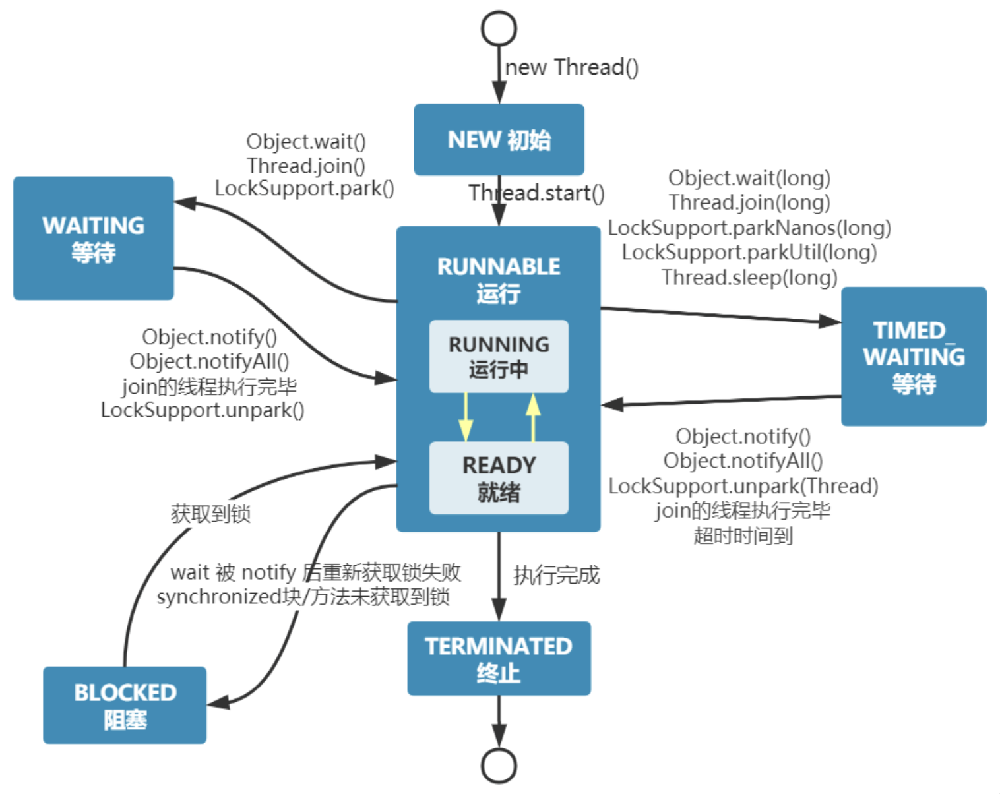
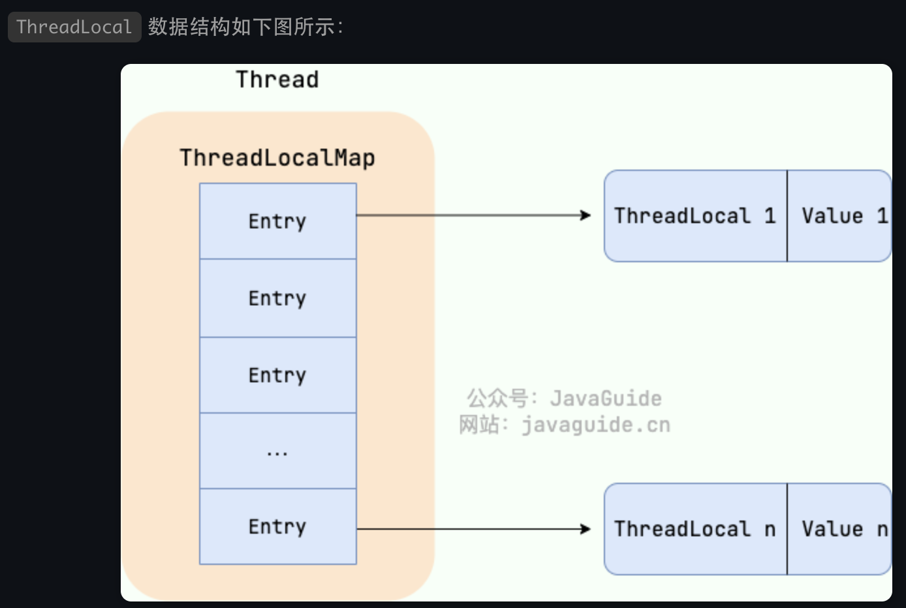
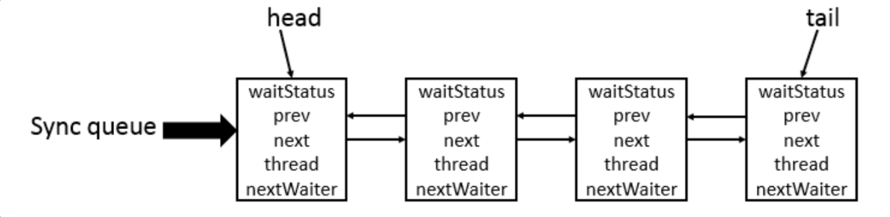
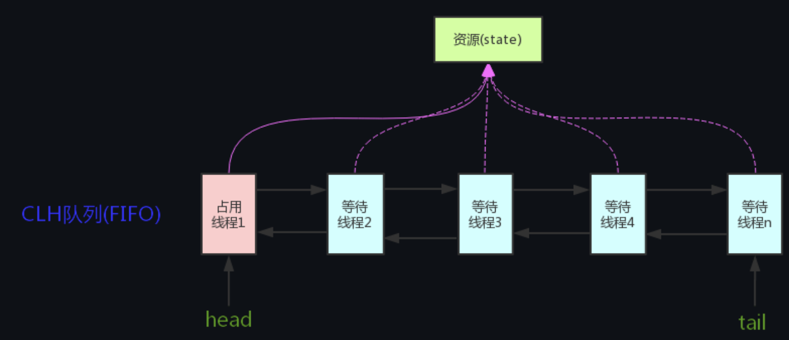
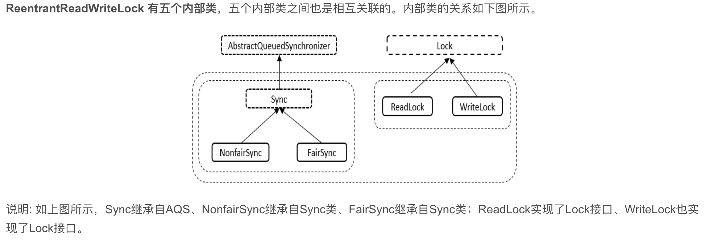

# JUC并发编程

### 懂java中的进程和线程？

在 Java 中，当我们启动 main 函数时其实就是启动了一个 JVM 的进程，而 main 函数所在的线程就是这个进程中的一个线程，也称主线程。

线程与进程相似，但线程是一个比进程更小的执行单位。一个进程在其执行的过程中可以产生多个线程。与进程不同的是同类的多个线程共享进程的**堆**和**方法区**资源，但每个线程有自己的**程序计数器**、**虚拟机栈**和**本地方法栈**，所以系统在产生一个线程，或是在各个线程之间作切换工作时，负担要比进程小得多，也正因为如此，线程也被称为轻量级进程。

一个普通的java程序就包含多个线程。


### ***Java线程的状态懂？

Java 线程在运行的生命周期中的指定时刻只可能处于下面 6 种不同状态的其中一个状态：

- NEW: 初始状态，线程被创建出来但没有被调用 `start()` 。
- RUNNABLE: 运行状态，线程被调用了 `start()`等待运行的状态。
- BLOCKED：阻塞状态，需要等待锁释放。
- WAITING：等待状态，表示该线程需要等待其他线程做出一些特定动作（通知或中断）。
- TIME_WAITING：超时等待状态，可以在指定的时间后自行返回而不是像 WAITING 那样一直等待。
- TERMINATED：终止状态，表示该线程已经运行完毕。




### 啥是死锁？

多个线程同时被阻塞，在互相等待某个资源被释放。

死锁条件：

- 互斥( mutual exclusion):至少有一个资源必须处于非共享模式，即一次只有一个进程可使用。如果另一进程申请该资源，那么申请进程应等到该资源释放为止。
- 占有并等待(hold and wait):一个进程应占有至少一个资源，并等待另一个资源，而该资源为其他进程所占有。
- 非抢占(no preemption):资源不能被抢占，即资源只能被进程在完成任务后自愿释放。
- 循环等待（(circular wait):有一组等待进程{P0,P1,…,Pn.}) ,P0等待的资源为P1占有，P1等待的资源为P2占有，……，Pn-1等待的资源为Pn占有,Pn等待的资源为P0占有。我们强调所有四个条件必须同时成立才会出现死锁。循环等待条件意味着占有并等待条件，这样四个条件并不完全独立。


### ***sleep和await区别懂？

**共同点**：两者都可以暂停线程的执行。

**区别**：

- **`sleep()` 方法没有释放锁，而 `wait()` 方法释放了锁** 。
- `wait()` 通常被用于线程间交互/通信，`sleep()`通常被用于暂停执行。
- `wait()` 方法被调用后，线程不会自动苏醒，需要别的线程调用同一个对象上的 `notify()`或者 `notifyAll()` 方法。`sleep()`方法执行完成后，线程会自动苏醒，或者也可以使用 `wait(long timeout)` 超时后线程会自动苏醒。
- `sleep()` 是 `Thread` 类的静态本地方法，`wait()` 则是 `Object` 类的本地方法。


### 为啥await是Object中的？

`wait()` 是让获得对象锁的线程实现等待，会自动释放当前线程占有的对象锁。每个对象（`Object`）都拥有对象锁，既然要释放当前线程占有的对象锁并让其进入 WAITING 状态，自然是要操作对应的对象（`Object`）而非当前的线程（`Thread`）。

类似的问题：**为什么 `sleep()` 方法定义在 `Thread` 中？**

因为 `sleep()` 是让当前线程暂停执行，不涉及到对象类，也不需要获得对象锁。


### ***volatile干嘛的？

在 Java 中，`volatile` 关键字可以保证变量的可见性，如果我们将变量声明为 **`volatile`** ，这就指示 JVM，这个变量是共享且不稳定的，每次使用它都到主存中进行读取，从主存拷贝一份新的到本地内存。

`volatile` 关键字其实并非是 Java 语言特有的，在 C 语言里也有，它最原始的意义就是禁用 CPU 缓存。如果我们将一个变量使用 `volatile` 修饰，这就指示 编译器，这个变量是共享且不稳定的，每次使用它都到主存中进行读取。

`volatile` 关键字能保证数据的可见性，但不能保证数据的原子性(++自增的例子，他不是一个原子操作，多个线程加到1000次，但实际可能不到)。`synchronized` 关键字两者都能保证。

**在 Java 中，`volatile` 关键字除了可以保证变量的可见性，还有一个重要的作用就是防止 JVM 的指令重排序。例子在下面那个问题，如果我们将变量声明为 **`volatile`，在对这个变量进行读写操作的时候，会通过插入特定的 **内存屏障** 的方式来禁止指令重排序。实际就是在这个语句前面的指令不会放到他后面，后面的不会放到他前面去，但是前面和后面内部的顺序他无法保证不会变，然后这个语句他本身的指令也是不会改变顺序的。


### ***重检验锁方式实现单例模式的原理懂？

```java
public class Singleton {

  private volatile static Singleton uniqueInstance;

  private Singleton() {
  }

  public static Singleton getUniqueInstance() {
     //先判断对象是否已经实例过，没有实例化过才进入加锁代码
      if (uniqueInstance == null) {
          //类对象加锁
          synchronized (Singleton.class) {
              if (uniqueInstance == null) {
                  uniqueInstance = new Singleton();
              }
          }
      }
      return uniqueInstance;
  }
}
```

`uniqueInstance` 采用 `volatile` 关键字修饰也是很有必要的， `uniqueInstance = new Singleton();` 这段代码其实是分为三步执行：

1. 为 `uniqueInstance` 分配内存空间
2. 初始化 `uniqueInstance`
3. 将 `uniqueInstance` 指向分配的内存地址

但是由于 JVM 具有指令重排的特性，执行顺序有可能变成 1->3->2。指令重排在单线程环境下不会出现问题，但是在多线程环境下会导致一个线程获得还没有初始化的实例。例如，线程 T1 执行了 1 和 3，此时 T2 调用 `getUniqueInstance`() 后发现 `uniqueInstance` 不为空，因此返回 `uniqueInstance`，但此时 `uniqueInstance` 还未被初始化。


### 乐观锁和悲观锁懂？

悲观锁总是假设最坏的情况，认为共享资源每次被访问的时候就会出现问题(比如共享数据被修改)，所以每次在获取资源操作的时候都会上锁，这样其他线程想拿到这个资源就会阻塞直到锁被上一个持有者释放。也就是说，**共享资源每次只给一个线程使用，其它线程阻塞，用完后再把资源转让给其它线程**。像 Java 中`synchronized`和`ReentrantLock`等独占锁就是悲观锁思想的实现。高并发的场景下，激烈的锁竞争会造成线程阻塞，大量阻塞线程会导致系统的上下文切换，增加系统的性能开销。并且，悲观锁还可能会存在死锁问题，影响代码的正常运行。

乐观锁总是假设最好的情况，认为共享资源每次被访问的时候不会出现问题，线程可以不停地执行，无需加锁也无需等待，只是在提交修改的时候去验证对应的资源（也就是数据）是否被其它线程修改了（具体方法可以使用版本号机制或 CAS 算法）。高并发的场景下，乐观锁相比悲观锁来说，不存在锁竞争造成线程阻塞，也不会有死锁的问题，在性能上往往会更胜一筹。但是，如果冲突频繁发生（写占比非常多的情况），会频繁失败和重试，这样同样会非常影响性能，导致 CPU 飙升。


### ***乐观锁实现懂？

版本号机制

一般是在数据表中加上一个数据版本号 `version` 字段，表示数据被修改的次数。当数据被修改时，`version` 值会加一。当线程 A 要更新数据值时，在读取数据的同时也会读取 `version` 值，在提交更新时，若刚才读取到的 version 值为当前数据库中的 `version` 值相等时才更新，否则重试更新操作，直到更新成功。

CAS

CAS 的全称是 **Compare And Swap（比较与交换）** ，用于实现乐观锁，被广泛应用于各大框架中。CAS 的思想很简单，就是用一个预期值和要更新的变量值进行比较，两值相等才会进行更新。

CAS 是一个原子操作，底层依赖于一条 CPU 的原子指令。

> **原子操作** 即最小不可拆分的操作，也就是说操作一旦开始，就不能被打断，直到操作完成。

CAS 涉及到三个操作数：

- **V**：要更新的变量值(Var)
- **E**：预期值(Expected)
- **N**：拟写入的新值(New)

当且仅当 V 的值等于 E 时，CAS 通过原子方式用新值 N 来更新 V 的值。如果不等，说明已经有其它线程更新了 V，则当前线程放弃更新。

当多个线程同时使用 CAS 操作一个变量时，只有一个会胜出，并成功更新，其余均会失败，但失败的线程并不会被挂起，仅是被告知失败，并且允许再次尝试，当然也允许失败的线程放弃操作。

Java 语言并没有直接实现 CAS，CAS 相关的实现是通过 C++ 内联汇编的形式实现的（JNI 调用）。因此， CAS 的具体实现和操作系统以及 CPU 都有关系。


### ***乐观锁有啥问题？

**ABA**

如果一个变量 V 初次读取的时候是 A 值，并且在准备赋值的时候检查到它仍然是 A 值，那我们就能说明它的值没有被其他线程修改过了吗？很明显是不能的，因为在这段时间它的值可能被改为其他值，然后又改回 A，那 CAS 操作就会误认为它从来没有被修改过。这个问题被称为 CAS 操作的 **"ABA"问题。**

ABA 问题的解决思路是在变量前面追加上**版本号或者时间戳**。JDK 1.5 以后的 `AtomicStampedReference` 类就是用来解决 ABA 问题的，其中的 `compareAndSet()` 方法就是首先检查当前引用是否等于预期引用，并且当前标志是否等于预期标志，如果全部相等，则以原子方式将该引用和该标志的值设置为给定的更新值。

```java
public boolean compareAndSet(V   expectedReference,
                           V   newReference,
                           int expectedStamp,
                           int newStamp) {
  Pair<V> current = pair;
  return
      expectedReference == current.reference &&
      expectedStamp == current.stamp &&
      ((newReference == current.reference &&
        newStamp == current.stamp) ||
       casPair(current, Pair.of(newReference, newStamp)));
}
```

**循环时间长开销大**

CAS 经常会用到**自旋操作**来进行重试，也就是不成功就一直循环执行直到成功。如果长时间不成功，会给 CPU 带来非常大的执行开销。

**只能保证一个共享变量的原子操作**

CAS 只对单个共享变量有效，当操作涉及跨多个共享变量时 CAS 无效。但是从 JDK 1.5 开始，提供了`AtomicReference`类来保证引用对象之间的原子性，你可以把多个变量放在一个对象里来进行 CAS 操作.所以我们可以使用锁或者利用`AtomicReference`类把多个共享变量合并成一个共享变量来操作。


### Synchronized懂？

`synchronized` 是 Java 中的一个关键字，翻译成中文是同步的意思，主要解决的是多个线程之间访问资源的同步性，可以保证被它修饰的方法或者代码块在任意时刻只能有一个线程执行。

可以修饰：实例方法，静态方法，和同步代码块


### ***synchronized原理懂？

**`synchronized` 同步语句块的实现使用的是 `monitorenter` 和 `monitorexit` 指令，其中 `monitorenter` 指令指向同步代码块的开始位置，`monitorexit` 指令则指明同步代码块的结束位置。**

上面的字节码中包含一个 `monitorenter` 指令以及两个 `monitorexit` 指令，这是为了保证锁在同步代码块代码**正常执行**以及出现**异常**的这两种情况下都能被正确释放。

当执行 `monitorenter` 指令时，线程试图获取锁也就是获取 **对象监视器 `monitor`** 的持有权。

monitorenter判断当前锁计数器是否为0，如果是他就回去获取锁，然后给锁计数器加1，monitorexit相反，使得锁计数器减1.如果获取对象锁失败，那当前线程就要阻塞等待，直到锁被另外一个线程释放为止。

`synchronized` 修饰的方法并没有 `monitorenter` 指令和 `monitorexit` 指令，取得代之的确实是 `ACC_SYNCHRONIZED` 标识，该标识指明了该方法是一个同步方法。JVM 通过该 `ACC_SYNCHRONIZED` 访问标志来辨别一个方法是否声明为同步方法，从而执行相应的同步调用。

如果是实例方法，JVM 会尝试获取实例对象的锁。如果是静态方法，JVM 会尝试获取当前 class 的锁。


### ***synchronized和volatile有什么区别？

`synchronized` 关键字和 `volatile` 关键字是两个互补的存在，而不是对立的存在！

- `volatile` 关键字是线程同步的轻量级实现，所以 `volatile`性能肯定比`synchronized`关键字要好 。但是 `volatile` 关键字只能用于变量而 `synchronized` 关键字可以修饰方法以及代码块 。
- `volatile` 关键字能保证数据的可见性，但不能保证数据的原子性。`synchronized` 关键字两者都能保证。
- `volatile`关键字主要用于解决变量在多个线程之间的可见性，而 `synchronized` 关键字解决的是多个线程之间访问资源的同步性。


### ***ReentrantLock懂？

`ReentrantLock` 实现了 `Lock` 接口，是一个可重入且独占式的锁，和 `synchronized` 关键字类似。不过，`ReentrantLock` 更灵活、更强大，增加了轮询、超时、中断、公平锁和非公平锁等高级功能。

```java
public class ReentrantLock implements Lock, java.io.Serializable {}
```

`ReentrantLock` 里面有一个内部类 `Sync`，`Sync` 继承 AQS（`AbstractQueuedSynchronizer`），添加锁和释放锁的大部分操作实际上都是在 `Sync` 中实现的。`Sync` 有公平锁 `FairSync` 和非公平锁 `NonfairSync` 两个子类。所以 `ReentrantLock` 的底层就是由 AQS 来实现的

`ReentrantLock` 默认使用非公平锁，也可以通过构造器来显式的指定使用公平锁。

```java
ReentrantLock lock = new ReentrantLock();
Condition producerCondition = lock.newCondition();
Condition consumerCondition = lock.newCondition();
```


### ***公平锁和非公平锁懂？

- **公平锁** : 锁被释放之后，先申请的线程先得到锁。性能较差一些，因为公平锁为了保证时间上的绝对顺序，上下文切换更频繁。
- **非公平锁**：锁被释放之后，后申请的线程可能会先获取到锁，是随机或者按照其他优先级排序的。性能更好，但可能会导致某些线程永远无法获取到锁。


### ***synchronized 和 ReentrantLock 有什么区别？

两者都是可重入锁：**可重入锁** 也叫递归锁，指的是线程可以再次获取自己的内部锁。比如一个线程获得了某个对象的锁，此时这个对象锁还没有释放，当其再次想要获取这个对象的锁的时候还是可以获取的，如果是不可重入锁的话，就会造成死锁，他一直拿不到。JDK 提供的所有现成的 `Lock` 实现类，包括 `synchronized` 关键字锁都是可重入的。

synchronized 依赖于 JVM 而 ReentrantLock 依赖于 API：`synchronized` 是依赖于 JVM 实现的，前面我们也讲到了虚拟机团队在 JDK1.6 为 `synchronized` 关键字进行了很多优化，但是这些优化都是在虚拟机层面实现的，并没有直接暴露给我们。`ReentrantLock` 是 JDK 层面实现的（也就是 API 层面，需要 lock() 和 unlock() 方法配合 try/finally 语句块来完成），所以我们可以通过查看它的源代码，来看它是如何实现的。


### ***ReentrantLock比synchronized有哪些高级点？

相比`synchronized`，`ReentrantLock`增加了一些高级功能。主要来说主要有三点：

- **等待可中断** : `ReentrantLock`提供了一种能够中断等待锁的线程的机制，通过 `lock.lockInterruptibly()` 来实现这个机制。也就是说正在等待的线程可以选择放弃等待，改为处理其他事情。
- **可实现公平锁** : `ReentrantLock`可以指定是公平锁还是非公平锁。而`synchronized`只能是非公平锁。所谓的公平锁就是先等待的线程先获得锁。`ReentrantLock`默认情况是非公平的，可以通过 `ReentrantLock`类的`ReentrantLock(boolean fair)`构造方法来指定是否是公平的。
- **可实现选择性通知（锁可以绑定多个条件）**: `synchronized`关键字与`wait()`和`notify()`/`notifyAll()`方法相结合可以实现等待/通知机制。`ReentrantLock`类当然也可以实现，但是需要借助于`Condition`接口与`newCondition()`方法。

想使用上述功能，那么选择 `ReentrantLock` 是一个不错的选择。

关于 `Condition`接口的补充：

> `Condition`是 JDK1.5 之后才有的，它具有很好的灵活性，比如可以实现多路通知功能也就是在一个`Lock`对象中可以创建多个`Condition`实例（即对象监视器），线程对象可以注册在指定的`Condition`中，从而可以有选择性的进行线程通知，在调度线程上更加灵活。 在使用`notify()/notifyAll()`方法进行通知时，被通知的线程是由 JVM 选择的，用`ReentrantLock`类结合`Condition`实例可以实现“选择性通知” ，这个功能非常重要，而且是 `Condition` 接口默认提供的。而`synchronized`关键字就相当于整个 `Lock` 对象中只有一个`Condition`实例，所有的线程都注册在它一个身上。如果执行`notifyAll()`方法的话就会通知所有处于等待状态的线程，这样会造成很大的效率问题。而`Condition`实例的`signalAll()`方法，只会唤醒注册在该`Condition`实例中的所有等待线程。


### ***可中断锁和不可中断锁有什么区别？

注意中断只能中断正在阻塞的线程，不能中断已经获得锁在运行的线程

- **可中断锁**：获取锁的过程中可以被中断，不需要一直等到获取锁之后 才能进行其他逻辑处理。`ReentrantLock` 就属于是可中断锁。
- **不可中断锁**：一旦线程申请了锁，就只能等到拿到锁以后才能进行其他的逻辑处理。 `synchronized` 就属于是不可中断锁。


### ***ReentrantReadWriteLock懂？

`ReentrantReadWriteLock` 实现了 `ReadWriteLock` ，是一个可重入的读写锁，既可以保证多个线程同时读的效率，同时又可以保证有写入操作时的线程安全。

- 一般锁进行并发控制的规则：读读互斥、读写互斥、写写互斥。
- 读写锁进行并发控制的规则：读读不互斥、读写互斥、写写互斥（只有读读不互斥）。

`ReentrantReadWriteLock` 其实是两把锁，一把是 `WriteLock` (写锁)，一把是 `ReadLock`（读锁） 。读锁是共享锁，写锁是独占锁。读锁可以被同时读，可以同时被多个线程持有，而写锁最多只能同时被一个线程持有。

和 `ReentrantLock` 一样，`ReentrantReadWriteLock` 底层也是基于 AQS 实现的。内部类

由于 `ReentrantReadWriteLock` 既可以保证多个线程同时读的效率，同时又可以保证有写入操作时的线程安全。因此，在读多写少的情况下，使用 `ReentrantReadWriteLock` 能够明显提升系统性能。


### 写锁降级懂？

在线程持有读锁的情况下，该线程不能取得写锁(因为获取写锁的时候，如果发现当前的读锁被占用，就马上获取失败，不管读锁是不是被当前线程持有)。

在线程持有写锁的情况下，该线程可以继续获取读锁，其他线程不行。这就是写锁降级，

但是读锁不能升级：

- 写锁可以降级为读锁，但是读锁却不能升级为写锁。这是因为读锁升级为写锁会引起线程的争夺，毕竟写锁属于是独占锁，这样的话，会影响性能。
- 另外，还可能会有死锁问题发生。举个例子：假设两个线程的读锁都想升级写锁，则需要对方都释放自己锁，而双方都不释放，就会产生死锁。


### ******ThreadLocal懂？

通常情况下，我们创建的变量是可以被任何一个线程访问并修改的。如果想实现每一个线程都有自己的专属本地变量该如何解决呢？

JDK 中自带的`ThreadLocal`类正是为了解决这样的问题。 **`ThreadLocal`类主要解决的就是让每个线程绑定自己的值，可以将`ThreadLocal`类形象的比喻成存放数据的盒子，盒子中可以存储每个线程的私有数据。**

如果你创建了一个`ThreadLocal`变量，那么访问这个变量的**每个线程都会有这个变量的本地副本**，这也是`ThreadLocal`变量名的由来。他们可以使用 `get()` 和 `set()` 方法来获取默认值或将其值更改为当前线程所存的副本的值，从而避免了线程安全问题。

使用：

```java
import java.text.SimpleDateFormat;
import java.util.Random;

public class ThreadLocalExample implements Runnable{

   // SimpleDateFormat 不是线程安全的，所以每个线程都要有自己独立的副本
  private static final ThreadLocal<SimpleDateFormat> formatter = ThreadLocal.withInitial(() -> new SimpleDateFormat("yyyyMMdd HHmm"));

  public static void main(String[] args) throws InterruptedException {
      ThreadLocalExample obj = new ThreadLocalExample();
      for(int i=0 ; i<5; i++){
          Thread t = new Thread(obj, ""+i);
          Thread.sleep(new Random().nextInt(1000));
          t.start();
      }
  }

  @Override
  public void run() {
      System.out.println("Thread Name= "+Thread.currentThread().getName()+" default Formatter = "+formatter.get().toPattern());
      try {
          Thread.sleep(new Random().nextInt(1000));
      } catch (InterruptedException e) {
          e.printStackTrace();
      }
      //formatter pattern is changed here by thread, but it won't reflect to other threads
      formatter.set(new SimpleDateFormat());
      System.out.println("Thread Name= "+Thread.currentThread().getName()+" formatter = "+formatter.get().toPattern());
  }
}
/*Thread Name= 0 default Formatter = yyyyMMdd HHmm
Thread Name= 0 formatter = yy-M-d ah:mm
Thread Name= 1 default Formatter = yyyyMMdd HHmm
Thread Name= 2 default Formatter = yyyyMMdd HHmm
Thread Name= 1 formatter = yy-M-d ah:mm
Thread Name= 3 default Formatter = yyyyMMdd HHmm
Thread Name= 2 formatter = yy-M-d ah:mm
Thread Name= 4 default Formatter = yyyyMMdd HHmm
Thread Name= 3 formatter = yy-M-d ah:mm
Thread Name= 4 formatter = yy-M-d ah:mm
可见，每个线程互不影响*/
private static final ThreadLocal<SimpleDateFormat> formatter = new ThreadLocal<SimpleDateFormat>(){
    @Override
    protected SimpleDateFormat initialValue(){
        return new SimpleDateFormat("yyyyMMdd HHmm");
    }
};
```


### *******ThreadLocal原理懂？

从 `Thread`类源代码入手。

```java
public class Thread implements Runnable {
    //......
    //与此线程有关的ThreadLocal值。由ThreadLocal类维护
    ThreadLocal.ThreadLocalMap threadLocals = null;

    //与此线程有关的InheritableThreadLocal值。由InheritableThreadLocal类维护
    ThreadLocal.ThreadLocalMap inheritableThreadLocals = null;
    //......
}
```

从上面`Thread`类 源代码可以看出`Thread` 类中有一个 `threadLocals` 和 一个 `inheritableThreadLocals` 变量，它们都是 `ThreadLocalMap` 类型的变量,我们可以把 `ThreadLocalMap` 理解为`ThreadLocal` 类实现的定制化的 `HashMap`。默认情况下这两个变量都是 null，只有当前线程调用 `ThreadLocal` 类的 `set`或`get`方法时才创建它们，实际上调用这两个方法的时候，我们调用的是`ThreadLocalMap`类对应的 `get()`、`set()`方法。

`ThreadLocal`类的`set()`方法

```java
public void set(T value) {
    //获取当前请求的线程
    Thread t = Thread.currentThread();
    //取出 Thread 类内部的 threadLocals 变量(哈希表结构)
    ThreadLocalMap map = getMap(t);
    if (map != null)
        // 将需要存储的值放入到这个哈希表中
        map.set(this, value);
    else
        createMap(t, value);
}
ThreadLocalMap getMap(Thread t) {
    return t.threadLocals;
}
```

通过上面这些内容，我们足以通过猜测得出结论：最终的变量是放在了当前线程的 `ThreadLocalMap` 中，并不是存在 `ThreadLocal` 上，`ThreadLocal` 可以理解为只是`ThreadLocalMap`的封装，传递了变量值。 `ThrealLocal` 类中可以通过`Thread.currentThread()`获取到当前线程对象后，直接通过`getMap(Thread t)`可以访问到该线程的`ThreadLocalMap`对象。

每个`Thread`中都具备一个`ThreadLocalMap`，而`ThreadLocalMap`可以存储以`ThreadLocal`为 key ，Object 对象为 value 的键值对。

```java
ThreadLocalMap(ThreadLocal<?> firstKey, Object firstValue) {
    //......
}
```

比如我们在同一个线程中声明了两个 `ThreadLocal` 对象的话， `Thread`内部都是使用仅有的那个`ThreadLocalMap` 存放数据的，`ThreadLocalMap`的 key 就是 `ThreadLocal`对象，value 就是 `ThreadLocal` 对象调用`set`方法设置的值。



总结：他就是操作了Thread类中的ThreadLocalMap来保存和操作数据，他本身并不保存数据，ThreadLocalMap中如果没有，那就调用setInitialValue进行初始化，保存到Thread类中的ThreadLocalMap去，并返回初始化的值。


### ****ThreadLocal为啥有内存泄漏？

`ThreadLocalMap` 中使用的 key 为 `ThreadLocal` 的弱引用，而 value 是强引用。所以，如果 `ThreadLocal` 没有被外部强引用的情况下，在垃圾回收的时候，key 会被清理掉，而 value 不会被清理掉。

这样一来，`ThreadLocalMap` 中就会出现 key 为 null 的 Entry。假如我们不做任何措施的话，value 永远无法被 GC 回收，这个时候就可能会产生内存泄露。`ThreadLocalMap` 实现中已经考虑了这种情况，在调用 `set()`、`get()`、`remove()` 方法的时候，会清理掉 key 为 null 的记录。使用完 `ThreadLocal`方法后最好手动调用`remove()`方法

在保存用户信息的时候，可以在拦截器的preHandler里设置ThreadLocal，然后在完成方法里移除ThreadLocal

```java
static class Entry extends WeakReference<ThreadLocal<?>> {
  /** The value associated with this ThreadLocal. */
  Object value;

  Entry(ThreadLocal<?> k, Object v) {
      super(k);
      value = v;
  }
}
```

> 如果一个对象只具有弱引用，那就类似于可有可无的生活用品。弱引用与软引用的区别在于：只具有弱引用的对象拥有更短暂的生命周期。在垃圾回收器线程扫描它 所管辖的内存区域的过程中，一旦发现了只具有弱引用的对象，不管当前内存空间足够与否，都会回收它的内存。不过，由于垃圾回收器是一个优先级很低的线程， 因此不一定会很快发现那些只具有弱引用的对象。弱引用可以和一个引用队列（ReferenceQueue）联合使用，如果弱引用所引用的对象被垃圾回收，Java 虚拟机就会把这个弱引用加入到与之关联的引用队列中。

发生条件：

- ①ThreadLocal引用被设置为null，且后面没有set，get，remove操作；
- ②线程一直运行，不停止；
- ③触发了垃圾回收（Minor GC或Full GC）


### ***线程池懂？为撒要用？

线程池就是管理一系列线程的资源池。当有任务要处理时，直接从线程池中获取线程来处理，处理完之后线程并不会立即被销毁，而是等待下一个任务。

池化技术想必大家已经屡见不鲜了，线程池、数据库连接池、HTTP 连接池等等都是对这个思想的应用。池化技术的思想主要是为了减少每次获取资源的消耗，提高对资源的利用率。

**线程池**提供了一种限制和管理资源（包括执行一个任务）的方式。 每个**线程池**还维护一些基本统计信息，例如已完成任务的数量。

**使用线程池的好处**：

- **降低资源消耗**。通过**重复利用**已创建的线程降低线程创建和销毁造成的消耗。
- **提高响应速度**。当任务到达时，任务可以不需要等到线程创建就能立即执行。
- **提高线程的可管理性**。线程是稀缺资源，如果无限制的创建，不仅会消耗系统资源，还会降低系统的稳定性，使用线程池可以进行统一的分配，调优和监控。


### ***怎么创建线程池？

**方式一：通过ThreadPoolExecutor**

```java
public void ThreadPoolExecutor() throws Exception {
      // 创建一个线程池
      ThreadPoolExecutor threadPoolExecutor = new ThreadPoolExecutor(2, 4,
              60, TimeUnit.SECONDS, new ArrayBlockingQueue<>(300));

      // 创建两个任务
      Runnable firstRunnable = new Runnable() {
          @Override
          public void run() {
              System.out.println("第一个任务执行");
          }
      };
      Runnable secondRunnable = new Runnable() {
          @Override
          public void run() {
              System.out.println("第二个任务执行");
          }
      };

      // 让线程池执行任务
      threadPoolExecutor.execute(firstRunnable);
      threadPoolExecutor.execute(secondRunnable);
}
```

**方式二：通过 `Executor` 框架的工具类 `Executors` 来创建。**

我们可以创建多种类型的 `ThreadPoolExecutor`：

- **`FixedThreadPool`**：该方法返回一个固定线程数量的线程池。该线程池中的线程数量始终不变。当有一个新的任务提交时，线程池中若有空闲线程，则立即执行。若没有，则新的任务会被暂存在一个任务队列中，待有线程空闲时，便处理在任务队列中的任务。
- **`SingleThreadExecutor`：** 该方法返回一个只有一个线程的线程池。若多余一个任务被提交到该线程池，任务会被保存在一个任务队列中，待线程空闲，按先入先出的顺序执行队列中的任务。
- **`CachedThreadPool`：** 该方法返回一个可根据实际情况调整线程数量的线程池。初始大小为 0。当有新任务提交时，如果当前线程池中没有线程可用，它会创建一个新的线程来处理该任务。如果在一段时间内（默认为 60 秒）没有新任务提交，核心线程会超时并被销毁，从而缩小线程池的大小。
- **`ScheduledThreadPool`**：该方法返回一个用来在给定的延迟后运行任务或者定期执行任务的线程池。

但他有弊端

- **`FixedThreadPool` 和 `SingleThreadExecutor`**：使用的是无界的 `LinkedBlockingQueue`，任务队列最大长度为 `Integer.MAX_VALUE`,可能**堆积大量的请求**，从而导致 OOM。
- **`CachedThreadPool`**：使用的是同步队列 `SynchronousQueue`, 允许创建的线程数量为 `Integer.MAX_VALUE` ，如果任务数量过多且执行速度较慢，可能会**创建大量的线程**，从而导致 OOM。
- **`ScheduledThreadPool` 和 `SingleThreadScheduledExecutor`** : 使用的无界的延迟阻塞队列`DelayedWorkQueue`，任务队列最大长度为 `Integer.MAX_VALUE`,可能**堆积大量的请求**，从而导致 OOM。

所以建议使用ThreadPoolExecutor自己定义最大线程数和阻塞队列长度


### ***线程池常用参数懂？

```java
  /**
   * 用给定的初始参数创建一个新的ThreadPoolExecutor。
   */
  public ThreadPoolExecutor(int corePoolSize,//线程池的核心线程数量
                            int maximumPoolSize,//线程池的最大线程数
                            long keepAliveTime,//当线程数大于核心线程数时，多余的空闲线程存活的最长时间,线程池回收线程时，会对核心线程和非核心线程一视同仁，直到线程池中线程的数量等于 corePoolSize ，回收过程才会停止。
                            TimeUnit unit,//时间单位
                            BlockingQueue<Runnable> workQueue,//任务队列，用来储存等待执行任务的队列
                            ThreadFactory threadFactory,//线程工厂，用来创建线程，一般默认即可
                            RejectedExecutionHandler handler//拒绝策略，当提交的任务过多而不能及时处理时，我们可以定制策略来处理任务
                             )
```


### ***线程池拒绝策略有哪些？

如果当前同时运行的线程数量达到最大线程数量并且队列也已经被放满了任务时，`ThreadPoolExecutor` 定义一些策略:

- **`ThreadPoolExecutor.AbortPolicy`：** 抛出 `RejectedExecutionException`来拒绝新任务的处理。
- **`ThreadPoolExecutor.CallerRunsPolicy`：** 将任务回退给调用者，使用调用者的线程来执行任务，如果执行程序已关闭，则会丢弃该任务。因此这种策略会降低对于新任务提交速度，影响程序的整体性能。如果您的应用程序可以承受此延迟并且你要求任何一个任务请求都要被执行的话，你可以选择这个策略。
- **`ThreadPoolExecutor.DiscardPolicy`：** 不处理新任务，直接丢弃掉。
- **`ThreadPoolExecutor.DiscardOldestPolicy`：** 此策略将丢弃最早的未处理的任务请求。


### ***线程池处理任务流程懂？

1. 如果当前运行的线程数小于核心线程数，那么就会新建一个线程来执行任务。
2. 如果当前运行的线程数等于或大于核心线程数，但是小于最大线程数，那么就把该任务放入到任务队列里等待执行。
3. 如果向任务队列投放任务失败（任务队列已经满了），但是当前运行的线程数是小于最大线程数的，就新建一个线程来执行任务。
4. 如果当前运行的线程数已经等同于最大线程数了，新建线程将会使当前运行的线程超出最大线程数，那么当前任务会被拒绝，拒绝策略会调用`RejectedExecutionHandler.rejectedExecution()`方法。


### 如何给线程池命名？

实现ThreadFactory接口

```java
import java.util.concurrent.ThreadFactory;
import java.util.concurrent.atomic.AtomicInteger;

/**
 * 线程工厂，它设置线程名称，有利于我们定位问题。
 */
public final class NamingThreadFactory implements ThreadFactory {

    private final AtomicInteger threadNum = new AtomicInteger();
    private final String name;

    /**
     * 创建一个带名字的线程池生产工厂
     */
    public NamingThreadFactory(String name) {
        this.name = name;
    }

    @Override
    public Thread newThread(Runnable r) {
        Thread t = new Thread(r);
        t.setName(name + " [#" + threadNum.incrementAndGet() + "]");
        return t;
    }
}

```

然后创建ThreadPoolExcutor线程池的时候作为倒数第二个参数穿入


### 讲讲Future？

`Future` 类是异步思想的典型运用，主要用在一些需要执行耗时任务的场景，避免程序一直原地等待耗时任务执行完成，执行效率太低。具体来说是这样的：当我们执行某一耗时的任务时，可以将这个耗时任务交给一个子线程去异步执行，同时我们可以干点其他事情，不用傻傻等待耗时任务执行完成。等我们的事情干完后，我们再通过 `Future` 类获取到耗时任务的执行结果。这样一来，程序的执行效率就明显提高了。

这其实就是多线程中经典的 **Future 模式**，你可以将其看作是一种设计模式，核心思想是异步调用，主要用在多线程领域，并非 Java 语言独有。

在 Java 中，`Future` 类只是一个泛型接口，位于 `java.util.concurrent` 包下，其中定义了 5 个方法，主要包括下面这 4 个功能：

- 取消任务；
- 判断任务是否被取消;
- 判断任务是否已经执行完成;
- 获取任务执行结果。

```java
// V 代表了Future执行的任务返回值的类型
public interface Future<V> {
    // 取消任务执行
    // 成功取消返回 true，否则返回 false
    boolean cancel(boolean mayInterruptIfRunning);
    // 判断任务是否被取消
    boolean isCancelled();
    // 判断任务是否已经执行完成
    boolean isDone();
    // 获取任务执行结果
    V get() throws InterruptedException, ExecutionException;
    // 指定时间内没有返回计算结果就抛出 TimeOutException 异常
    V get(long timeout, TimeUnit unit)
        throws InterruptedException, ExecutionException, TimeoutExceptio
}
```


### **callable和Future有什么关系？

我们可以通过 `FutureTask` 来理解 `Callable` 和 `Future` 之间的关系。

`FutureTask` 提供了 `Future` 接口的基本实现，常用来封装 `Callable` 和 `Runnable`，具有取消任务、查看任务是否执行完成以及获取任务执行结果的方法。

`FutureTask` 不光实现了 `Future`接口，还实现了`Runnable` 接口，因此可以作为任务直接被线程执行。

`FutureTask` 有两个构造函数，可传入 `Callable` 或者 `Runnable` 对象。实际上，传入 `Runnable` 对象也会在方法内部转换为`Callable` 对象。

`FutureTask`相当于对`Callable` 进行了封装，管理着任务执行的情况，存储了 `Callable` 的 `call` 方法的任务执行结果。

```java
FutureTask<Integer> futureTask = new FutureTask<>(callable);
ExecutorService executor = Executors.newSingleThreadExecutor();
executor.execute(futureTask);
Integer result = futureTask.get();
// 通过调用get()方法，主线程将会阻塞等待，直到任务执行完成并返回结果。
```

`Future` 在实际使用过程中存在一些局限性比如不支持异步任务的编排组合、获取计算结果的 `get()` 方法为阻塞调用。

Java 8 才被引入`CompletableFuture` 类可以解决`Future` 的这些缺陷。太难了妈的，根本没用过


### AQS懂？

AQS 的全称为 `AbstractQueuedSynchronizer` ，翻译过来的意思就是抽象队列同步器。这个类在 `java.util.concurrent.locks` 包下面。

AQS，是一个抽象类， 为构建锁和同步器提供了一些通用功能的实现，因此，使用 AQS 能简单且高效地构造出应用广泛的大量的同步器，比如我们提到的 `ReentrantLock`，`Semaphore`，其他的诸如 `ReentrantReadWriteLock`，`SynchronousQueue`等等皆是基于 AQS 的。


### ****AQS原理懂？

主要用到了**模版模式**

AQS是一个用来构建锁和同步器的框架，使用AQS能简单且高效地构造出应用广泛的大量的同步器，比如我们提到的ReentrantLock，Semaphore，其他的诸如 ReentrantReadWriteLock，SynchronousQueue，FutureTask等等，皆是基于AQS的。当然，我们自己也能利用AQS非常轻松容易地构造出符合我们自己需求的同步器。

**AQS 核心思想是，如果被请求的共享资源空闲，则将当前请求资源的线程设置为有效的工作线程，并且将共享资源设置为锁定状态。如果被请求的共享资源被占用，那么就需要一套线程阻塞等待以及被唤醒时锁分配的机制，这个机制 AQS 是用 CLH 队列锁 实现的，即将暂时获取不到锁的线程加入到队列中。**

CLH(Craig,Landin,and Hagersten) 队列是一个虚拟的双向队列（虚拟的双向队列即不存在队列实例，仅存在结点之间的关联关系）。AQS 是将每条请求共享资源的线程封装成一个 CLH 锁队列的一个结点（Node）来实现锁的分配。在 CLH 同步队列中，一个节点表示一个线程，它保存着线程的引用（thread）、 当前节点在队列中的状态（waitStatus）、前驱节点（prev）、后继节点（next）。

如果使用了Condition的话，还会有一个条件队列，signal会将条件队列的第一个元素加到同步队列中，排队获取锁执行，signalAll会讲条件队列的所有元素都唤醒，加到同步队列中去。

1、调用await和signal方法都需要先获得锁，否则会抛异常。
2、调用await方法会新建一个waitStatus为CONDITION、线程为当前线程的节点到条件队列尾部，然后当前线程会释放掉锁，并进入阻塞状态，直到该节点被移到同步队列或者被中断。该节点被移动到同步队列，并不代表该节点线程能立马获得锁，还是需要在同步队列中排队并在必要时候（前驱节点为head）调用tryAcquire方法去获取，如果获取成功则代表获得了锁。
3、调用signal方法会将条件队列的头节点移动到同步队列。





AQS 使用 **int 成员变量 `state` 表示同步状态**，通过内置的 **线程等待队列** 来完成获取资源线程的排队工作。

`state` 变量由 `volatile` 修饰，用于展示当前临界资源的获锁情况。

AQS使用一个int成员变量来表示同步状态，通过内置的FIFO**线程等待队列**队列来完成获取资源线程的排队工作。**AQS使用CAS对该同步状态进行原子操作实现对其值的修改**。

```java
// 共享变量，使用volatile修饰保证线程可见性
private volatile int state;
```

状态信息通过protected类型的 getState，setState，compareAndSetState 进行操作

```java
// 返回同步状态的当前值
protected final int getState() {
  	return state;
}
// 设置同步状态的值
protected final void setState(int newState) {
  	state = newState;
}
// 原子地(CAS操作)将同步状态值设置为给定值update 如果当前同步状态的值等于expect(期望值)
protected final boolean compareAndSetState(int expect, int update) {
  	return unsafe.compareAndSwapInt(this, stateOffset, expect, update);
}
```

以 `ReentrantLock` 为例，`state` 初始值为 0，表示未锁定状态。A 线程 `lock()` 时，会调用 `tryAcquire()` 独占该锁并将 `state+1` 。此后，其他线程再 `tryAcquire()` 时就会失败，直到 A 线程 `unlock()` 到 `state=`0（即释放锁）为止，其它线程才有机会获取该锁。当然，释放锁之前，A 线程自己是可以重复获取此锁的（`state` 会累加），这就是可重入的概念。但要注意，获取多少次就要释放多少次，这样才能保证 state 是能回到零态的。

再以 `CountDownLatch` 以例，任务分为 N 个子线程去执行，`state` 也初始化为 N（注意 N 要与线程个数一致）。这 N 个子线程是并行执行的，每个子线程执行完后`countDown()` 一次，state 会 CAS(Compare and Swap) 减 1。等到所有子线程都执行完后(即 `state=0` )，会 `unpark()` 主调用线程，然后主调用线程就会从 `await()` 函数返回，继续后余动作。


### ****Semaphore/CountDownLatch/CyclicBarrier？

Semaphore信号量，允许多个线程同时运行，也是有一个计数器，拿到一个锁就-1，释放一个锁就+1，否则需要阻塞等待

CountDownLatch又一个初始值，这个线程调用await就会阻塞，然后需要别的线程或者程序调用countDown，直到计数减少为0，改线程才会唤醒，这样只会阻塞当前对象的线程

CyclicBarrier也是有一个屏障，需要有n个线程调用改对象的await方法，才会将所有线程唤醒，并去执行创建这个对象是定义的任务，这样会阻塞n个线程

countDownLatch应用场景：需要处理多个文件，必须要等多个文件全局处理完了，才能返回结果，可以开n个线程去处理文件，每个线程中处理文件完毕了，就countDown一次。

```java
public class CountDownLatchExample1 {
  // 处理文件的数量
  private static final int threadCount = 6;

  public static void main(String[] args) throws InterruptedException {
      // 创建一个具有固定线程数量的线程池对象（推荐使用构造方法创建）
      ExecutorService threadPool = Executors.newFixedThreadPool(10);
      final CountDownLatch countDownLatch = new CountDownLatch(threadCount);
      for (int i = 0; i < threadCount; i++) {
          final int threadnum = i;
          threadPool.execute(() -> {
              try {
                  //处理文件的业务操作
                  //......
              } catch (InterruptedException e) {
                  e.printStackTrace();
              } finally {
                  //表示一个文件已经被完成
                  countDownLatch.countDown();
              }
          });
      }
      countDownLatch.await();
      threadPool.shutdown();
      System.out.println("finish");
  }
}
```


### 并发编程三大特性？

原子性

一次操作或者多次操作，要么所有的操作全部都得到执行并且不会受到任何因素的干扰而中断，要么都不执行。

在 Java 中，可以借助`synchronized`、各种 `Lock` 以及各种原子类实现原子性。

`synchronized` 和各种 `Lock` 可以保证任一时刻只有一个线程访问该代码块，因此可以保障原子性。各种原子类是利用 CAS (compare and swap) 操作（可能也会用到 `volatile`或者`final`关键字）来保证原子操作。

可见性

当一个线程对共享变量进行了修改，那么另外的线程都是立即可以看到修改后的最新值。

在 Java 中，可以借助`synchronized`、`volatile` 以及各种 `Lock` 实现可见性。

如果我们将变量声明为 `volatile` ，这就指示 JVM，这个变量是共享且不稳定的，每次使用它都到主存中进行读取。

有序性

由于指令重排序问题，代码的执行顺序未必就是编写代码时候的顺序。

我们上面讲重排序的时候也提到过：

> **指令重排序可以保证串行语义一致，但是没有义务保证多线程间的语义也一致** ，所以在多线程下，指令重排序可能会导致一些问题。

在 Java 中，`volatile` 关键字可以禁止指令进行重排序优化。


### **Runnable vs Callable

`Runnable`自 Java 1.0 以来一直存在，但`Callable`仅在 Java 1.5 中引入,目的就是为了来处理`Runnable`不支持的用例。`Runnable` 接口不会**返回结果或抛出检查**异常，但是 `Callable` 接口可以。所以，如果任务不需要返回结果或抛出异常推荐使用 `Runnable` 接口，这样代码看起来会更加简洁。

工具类 `Executors` 可以实现将 `Runnable` 对象转换成 `Callable` 对象。（`Executors.callable(Runnable task)` 或 `Executors.callable(Runnable task, Object result)`）。


### **execute() vs submit()

- `execute()`方法用于提交不需要返回值的任务，所以无法判断任务是否被线程池执行成功与否；
- `submit()`方法用于提交需要返回值的任务。线程池会返回一个 `Future` 类型的对象，通过这个 `Future` 对象可以判断任务是否执行成功，并且可以通过 `Future` 的 `get()`方法来获取返回值，`get()`方法会阻塞当前线程直到任务完成，而使用 `get（long timeout，TimeUnit unit）`方法的话，如果在 `timeout` 时间内任务还没有执行完，就会抛出 `java.util.concurrent.TimeoutException`。


### **shutdown() VS shutdownNow()

- **`shutdown（）`** :关闭线程池，线程池的状态变为 `SHUTDOWN`。线程池不再接受新任务了，但是队列里的任务得执行完毕。
- **`shutdownNow（）`** :关闭线程池，线程池的状态变为 `STOP`。线程池会**终止**当前正在运行的任务，并停止处理排队的任务并返回正在等待执行的 List。


### isTerminated() VS isShutdown()

- **`isShutDown`** 当调用 `shutdown()` 方法后返回为 true。
- **`isTerminated`** 当调用 `shutdown()` 方法后，并且所有提交的任务完成后返回为 true


### CompletableFuture

CompletableFuture 在 Java 里面被用于异步编程，异步通常意味着非阻塞，可以使得我们的任务单独运行在与主线程分离的其他线程中，并且通过回调可以在主线程中得到异步任务的执行状态，是否完成，和是否异常等信息

- 异步调用没有返回值方法runAsync
- 异步调用有返回值方法supplyAsync

```java
public class CompletableFutureTest {
  public static void main(String[] args) throws ExecutionException, InterruptedException {
      // 异步调用没有返回值
      CompletableFuture<Void> completableFuture = CompletableFuture.runAsync(()->{
          // do something;
      });
      completableFuture.get();
      // 异步调用
      // mq消息队列
      CompletableFuture<Integer> completableFuture1 = CompletableFuture.supplyAsync(()->{
          // do something
          // 模拟异常
          int i = 10/0;
          return 1024;
      });
      // 完成之后调用
      completableFuture1.whenComplete((t,u)->{
          System.out.println("-----t:"+t);    // 方法的返回值
          System.out.println("-----u:"+u);    // 异常的返回信息
      }).get();
  }
}
```


### Future vs CompletableFuture

Future在Java5就引入了。

优点：一定程度上让一个线程池内的任务异步执行了
缺点：传统回调最大的问题就是不能将控制流分离到不同的事件处理器中。例如主线程等待各个异步执行的线程返回的结果来做下一步操作，则必须阻塞在future.get()的地方等待结果返回。这时候又变成同步了。

CompletableFuture在Java8引入。

实现了Future和CompletionStage接口，保留了Future的优点，并且弥补了其不足。即异步的任务完成后，需要用其结果继续操作时，无需等待。可以直接通过thenAccept、thenApply、thenCompose等方式将前面异步处理的结果交给另外一个异步事件处理线程来处理。可见，这种方式才是我们需要的异步处理。一个控制流的多个异步事件处理能无缝的连接在一起。


### interrupt&interrupted&isInterrupted？

interrupt()：将调用该方法的对象所表示的线程标记一个停止标记，并不是真的停止该线程。
interrupted()：获取当前线程的中断状态，并且会清除线程的状态标记。是一个是静态方法。
isInterrupted()：获取调用该方法的对象所表示的线程的中断状态，不会清除线程的状态标记。是一个实例方法。

所以如果想要杀死线程，需要在线程内部做逻辑处理，判断当前的状态，然后主动结束线程任务。

当阻塞sleep，wait方法收到中断请求的时候就会抛出InterruptedException异常


### lock&lockInterruptibly？

lock()方法是一种基本的锁定机制，当一个线程调用这个方法时，如果锁已经被其他线程持有，那么调用线程就会进入等待状态，直到锁被释放，在等待的过程中，这个线程会**无视中断请求**，也就是说，即使有其他线程调用了这个等待线程的interrupt()方法，它也不会有任何响应，依旧会“执着”地等待锁的释放。

而lockInterruptibly()方法则不同，它提供了一种更加“灵活”的锁定机制，当一个线程调用这个方法时，如果锁已经被其他线程持有，那么这个线程同样会进入等待状态，但是，在等待的过程中，如果这个线程收到了中断请求（即有其他线程调用了它的interrupt()方法），那么它就会立即响应中断，不再等待锁的释放，而是**抛出一个InterruptedException异常**。这使得线程能够更灵活地处理中断，例如，可以在被中断时执行一些清理操作或通知其他线程。


### JUC框架包含几个部分？

- Lock框架和Tools类
- Collections: 并发集合
- Atomic: 原子类
- Executors: 线程池


### CAS问题及解决方案？

CAS 方式为乐观锁，synchronized 为悲观锁。因此使用 CAS 解决并发问题通常情况下性能更优。

但使用 CAS 方式也会有几个问题：

1、ABA问题
因为CAS需要在操作值的时候，检查值有没有发生变化，比如没有发生变化则更新，但是如果一个值原来是A，变成了B，又变成了A，那么使用CAS进行检查时则会发现它的值没有发生变化，但是实际上却变化了。

ABA问题的解决思路就是使用版本号。在变量前面追加上版本号，每次变量更新的时候把版本号加1，那么A->B->A就会变成1A->2B->3A。

从Java 1.5开始，JDK的Atomic包里提供了一个类AtomicStampedReference来解决ABA问题。这个类的compareAndSet方法的作用是首先检查当前引用是否等于预期引用，并且检查当前标志是否等于预期标志，如果全部相等，则以原子方式将该引用和该标志的值设置为给定的更新值。

2、循环时间长开销大
自旋CAS如果长时间不成功，会给CPU带来非常大的执行开销。如果JVM能支持处理器提供的pause指令，那么效率会有一定的提升。pause指令有两个作用：第一，它可以延迟流水线执行命令(de-pipeline)，使CPU不会消耗过多的执行资源，延迟的时间取决于具体实现的版本，在一些处理器上延迟时间是零；第二，它可以避免在退出循环的时候因内存顺序冲突(Memory Order Violation)而引起CPU流水线被清空(CPU Pipeline Flush)，从而提高CPU的执行效率。

3、只能保证一个共享变量的原子操作
当对一个共享变量执行操作时，我们可以使用循环CAS的方式来保证原子操作，但是对多个共享变量操作时，循环CAS就无法保证操作的原子性，这个时候就可以用锁。

从Java 1.5开始，JDK提供了AtomicReference类来保证引用对象之间的原子性，就可以把多个变量放在一个对象里来进行CAS操作。


### Unsafe？

Unsafe是位于sun.misc包下的一个类，主要提供一些用于执行低级别、不安全操作的方法，如**直接访问系统内存资源、自主管理内存资源，CAS操作**等，这些方法在提升Java运行效率、增强Java语言底层资源操作能力方面起到了很大的作用。但由于Unsafe类使Java语言拥有了类似C语言指针一样操作内存空间的能力，这无疑也增加了程序发生相关指针问题的风险。在程序中过度、不正确使用Unsafe类会使得程序出错的概率变大，使得Java这种安全的语言变得不再“安全”，因此对Unsafe的使用一定要慎重。


### AtomicInteger底层原理？

AtomicInteger底层代码

```java
private volatile int value;

//返回当前值
public final int get() {
    return value;
}

//递增加detla
public final int getAndAdd(int delta) {
    //三个参数，1、当前的实例 2、value实例变量的偏移量 3、当前value要加上的数(value+delta)。
    return unsafe.getAndAddInt(this, valueOffset, delta);
}

//递增加1
public final int incrementAndGet() {
    return unsafe.getAndAddInt(this, valueOffset, 1) + 1;
}
```

 AtomicInteger 底层用的是volatile的变量和CAS来进行更改数据的。

- volatile保证线程的可见性，多线程并发时，一个线程修改数据，可以保证其它线程立马看到修改后的值；
- CAS 保证数据更新的原子性。

```java
public final int getAndSetInt(Object paramObject, long paramLong, int paramInt){
    int i;
    do
      	i = getIntVolatile(paramObject, paramLong);
    while (!compareAndSwapInt(paramObject, paramLong, i, paramInt));
    return i;
}
```

原子操作其实只支持下面三个方法。

```java
public final native boolean compareAndSwapObject(Object paramObject1, long paramLong, Object paramObject2, Object paramObject3);

public final native boolean compareAndSwapInt(Object paramObject, long paramLong, int paramInt1, int paramInt2);

public final native boolean compareAndSwapLong(Object paramObject, long paramLong1, long paramLong2, long paramLong3);
```

我们发现Unsafe只提供了3种CAS方法：compareAndSwapObject、compareAndSwapInt和compareAndSwapLong。都是native方法。


### AtomicStampedReference解决ABA问题？

AtomicStampedReference主要维护包含一个对象引用以及一个可以自动更新的整数"stamp"的pair对象来解决ABA问题。

```java
public class AtomicStampedReference<V> {
    private static class Pair<T> {
        final T reference;  //维护对象引用
        final int stamp;  //用于标志版本
        private Pair(T reference, int stamp) {
            this.reference = reference;
            this.stamp = stamp;
        }
        static <T> Pair<T> of(T reference, int stamp) {
            return new Pair<T>(reference, stamp);
        }
    }
    private volatile Pair<V> pair;
    ....
    
/**
  * expectedReference ：更新之前的原始值
  * newReference : 将要更新的新值
  * expectedStamp : 期待更新的标志版本
  * newStamp : 将要更新的标志版本
  */
public boolean compareAndSet(V expectedReference,
                         V newReference,
                         int expectedStamp,
                         int newStamp) {
    // 获取当前的(元素值，版本号)对
    Pair<V> current = pair;
    return
        // 引用没变
        expectedReference == current.reference &&
        // 版本号没变
        expectedStamp == current.stamp &&
        // 新引用等于旧引用
        ((newReference == current.reference &&
        // 新版本号等于旧版本号
        newStamp == current.stamp) ||
        // 构造新的Pair对象并CAS更新
        casPair(current, Pair.of(newReference, newStamp)));
}

private boolean casPair(Pair<V> cmp, Pair<V> val) {
    // 调用Unsafe的compareAndSwapObject()方法CAS更新pair的引用为新引用
    return UNSAFE.compareAndSwapObject(this, pairOffset, cmp, val);
}
```
如果元素值和版本号都没有变化，并且和新的也相同，返回true；
如果元素值和版本号都没有变化，并且和新的不完全相同，就构造一个新的Pair对象并执行CAS更新pair。

可以看到，java中的实现跟我们上面讲的ABA的解决方法是一致的。

首先，使用版本号控制（自己传入版本号）；
其次，不重复使用节点(Pair)的引用，每次都新建一个新的Pair来作为CAS比较的对象，而不是复用旧的；
最后，外部传入元素值及版本号，而不是节点(Pair)的引用。

使用举例

```java
public class AtomicTester {
private static AtomicStampedReference<Integer> atomicStampedRef =
        new AtomicStampedReference<>(1, 0);

public static void main(String[] args){
    first().start();
    second().start();
}

private static Thread first() {
    return new Thread(() -> {
        System.out.println("操作线程" + Thread.currentThread() +",初始值 a = " + atomicStampedRef.getReference());
        int stamp = atomicStampedRef.getStamp(); //获取当前标识别
        try {
            Thread.sleep(1000); //等待1秒 ，以便让干扰线程执行
        } catch (InterruptedException e) {
            e.printStackTrace();
        }
        boolean isCASSuccess = atomicStampedRef.compareAndSet(1, 2, stamp, stamp +1);  //此时expectedReference未发生改变，但是stamp已经被修改了,所以CAS失败
        System.out.println("操作线程" + Thread.currentThread() +",CAS操作结果: " + isCASSuccess);
    },"主操作线程");
}

private static Thread second() {
    return new Thread(() -> {
        Thread.yield(); // 确保thread-first 优先执行
        atomicStampedRef.compareAndSet(1, 2, atomicStampedRef.getStamp(), atomicStampedRef.getStamp() + 1);
        System.out.println("操作线程" + Thread.currentThread() +",【increment】 ,值 = "+ atomicStampedRef.getReference());
        atomicStampedRef.compareAndSet(2,1,atomicStampedRef.getStamp(),atomicStampedRef.getStamp() +1);
        System.out.println("操作线程" + Thread.currentThread() +",【decrement】 ,值 = "+ atomicStampedRef.getReference());
    },"干扰线程");
}
```
输出结果：

操作线程Thread[主操作线程,5,main],初始值 a = 1
操作线程Thread[干扰线程,5,main],【increment】 ,值 = 2
操作线程Thread[干扰线程,5,main],【decrement】 ,值 = 1
操作线程Thread[主操作线程,5,main],CAS操作结果: false


### ReentrantLock公平和非公平怎么实现的？

ReentrantLock总共有三个内部类，并且三个内部类是紧密相关的，下面先看三个类的关系。


FairSync类的lock的方法只要资源被其他线程占用，该线程就会添加到sync queue中的尾部，而不会先尝试获取资源。这也是和Nonfair最大的区别，Nonfair每一次都会尝试去获取资源，如果此时该资源恰好被释放，则会被当前线程获取，这就造成了不公平的现象，当获取不成功，再加入队列尾部。

ReentrantLock() 型构造函数可以传递参数确定采用公平策略或者是非公平策略，参数为true表示公平策略，否则，采用非公平策略；

默认是非公平策略。

ReentrantLock对其操作都转化为对Sync对象的操作，由于Sync继承了AQS，所以基本上都可以转化为对AQS的操作。如将ReentrantLock的lock函数转化为对Sync的lock函数的调用，而具体会根据采用的策略(如公平策略或者非公平策略)的不同而调用到Sync的不同子类。


### ReentrantReadWriteLock底层结构？



读锁一般需要配合ThreadLocal使用，因为他是共享锁，需要记录各个线程的重入次数

读锁和写锁支持的最大数目如下：

```java
// 高16位为读锁，低16位为写锁
static final int SHARED_SHIFT   = 16;
// 读锁单位  2^16
static final int SHARED_UNIT    = (1 << SHARED_SHIFT);
// 读锁最大数量 2^16 - 1
static final int MAX_COUNT      = (1 << SHARED_SHIFT) - 1;
// 写锁最大数量 2^16 - 1
static final int EXCLUSIVE_MASK = (1 << SHARED_SHIFT) - 1;
```

sharedCount 函数
表示占有读锁的线程数量，源码如下

```java
static int sharedCount(int c)    { return c >>> SHARED_SHIFT; }
//说明：直接将state右移16位，就可以得到读锁的线程数量，因为state的高16位表示读锁，对应的低十六位表示写锁数量。
```

exclusiveCount函数
表示占有写锁的线程数量，源码如下

```java
static int exclusiveCount(int c) { return c & EXCLUSIVE_MASK; }
```

说明: 直接将状态state和(2^16 - 1)做与运算，其等效于将state模上2^16。写锁数量由state的低十六位表示。

所以通过一个count变量就记录了两个锁的线程占有个数。


### 为什么HashTable慢？

Hashtable之所以效率低下主要是因为其实现使用了synchronized关键字对put等操作进行加锁，而synchronized关键字加锁是对整个对象进行加锁，也就是说在进行put等修改Hash表的操作时，锁住了整个Hash表，从而使得其表现的效率低下。


