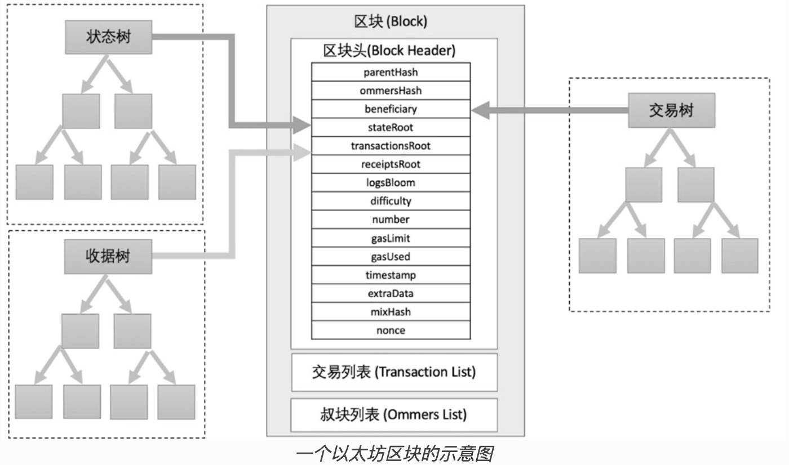

# 区块

区块是指一批交易的组合，并且包含链中上一个区块的哈希。 这将区块连接在一起（成为一个链），因为哈希是从区块数据中加密得出的。 这可以防止欺诈，因为以前的任何区块中的任何改变都会使后续所有区块无效，而且所有哈希都会改变，所有运行区块链的人都会注意到。

为了确保以太坊网络上的所有参与者保持同步状态并就交易的确切历史达成共识，我们将交易分为多个区块。 这意味着同时有数十个（甚至数百个）交易被提交、达成一致并同步。

通过间隔提交，所有网络参与者有足够时间达成共识：即使交易请求每秒发生数十次，但以太坊上的区块仅仅大约**每十二秒**创建并提交一次。


## 区块示意图




## 区块如何工作

为了保存交易历史，区块被严格排序（创建的每个新区块都包含一个其父块的引用），区块内的交易也严格排序。 除极少数情况外，在任何特定时间，网络上的所有参与者都同意区块的确切数目和历史， 并且正在努力将当前的活动交易请求分批到下一个区块。

随机选择的验证者在网络上构建完区块后，该区块将传播到整个网络；所有节点都将该区块添加至其区块链的末尾，然后挑选新的验证者来创建下一个区块。 目前，确切的区块构建过程和提交/共识过程由**以太坊的“权益证明”协议规定**（现在已经没有出块奖励了）。


## 权益证明协议

权益证明是指：

- 验证节点必须向存款合约中质押 32 个以太币，作为抵押品防止发生不良行为。 这有助于保护网络，因为如果发生不诚实活动且可以证实，部分甚至全部质押金额将被销毁。
- 在每个时隙（12 秒的时间间隔）中，会随机选择一个验证者作为区块提议者。 他们将交易打包并执行，然后确定一个新的“状态”。 他们将这些信息包装到一个区块中并传送给其他验证者。
- 其他获悉新区块的验证者再次执行区块中包含的交易，确定他们同意对全局状态提出的修改。 假设该区块是有效的，验证者就将该区块添加进各自的数据库。
- 如果验证者获悉在同一时隙内有两个冲突区块，他们会使用自己的分叉选择算法选择获得最多质押以太币支持的那一个区块。


## 区块头

```go
// Header represents a block header in the Ethereum blockchain.
type Header struct {
  // 父块的哈希值
	ParentHash  common.Hash    `json:"parentHash"       gencodec:"required"`
  // 叔父区块 hash 值，可能有多个叔父，是一起计算出一个 hash 值
	UncleHash   common.Hash    `json:"sha3Uncles"       gencodec:"required"`
  // 矿工地址，也就是在这个块中接收交易 fee 的地址
	Coinbase    common.Address `json:"miner"`
  // 应用此区块中的更改后，全局状态的根哈希 状态树的根哈希值。代表所有账户和他们状态的默克尔树根哈希值
	Root        common.Hash    `json:"stateRoot"        gencodec:"required"`
  // 有效载荷中交易的根哈希
	TxHash      common.Hash    `json:"transactionsRoot" gencodec:"required"`
  // 交易收据树的哈希
	ReceiptHash common.Hash    `json:"receiptsRoot"     gencodec:"required"`
  // 包含事件日志的数据结构 日志事件的布隆过滤器
	Bloom       Bloom          `json:"logsBloom"        gencodec:"required"`
  // 挖矿难度
	Difficulty  *big.Int       `json:"difficulty"       gencodec:"required"`
  // 当前区块的编号，也就是区块高度
	Number      *big.Int       `json:"number"           gencodec:"required"`
  // 此区块允许的最大燃料量 这里是单位，表示个数
	GasLimit    uint64         `json:"gasLimit"         gencodec:"required"`
  // 此区块中使用的实际燃料量 这里是单位，表示个数
	GasUsed     uint64         `json:"gasUsed"          gencodec:"required"`
  // 区块时间
	Time        uint64         `json:"timestamp"        gencodec:"required"`
  // 作为原始字节的任意附加数据
	Extra       []byte         `json:"extraData"        gencodec:"required"`
  // 用于验证工作量证明的混合摘要
	MixDigest   common.Hash    `json:"mixHash"`
  // 区块 nonce 值,作为工作量挖矿的证明，但是现在是权益证明，已经没用了，都是 0 了
	Nonce       BlockNonce     `json:"nonce"`

	// BaseFee was added by EIP-1559 and is ignored in legacy headers.
  // 基础费值
	BaseFee *big.Int `json:"baseFeePerGas" rlp:"optional"`

	// WithdrawalsHash was added by EIP-4895 and is ignored in legacy headers.
  // 有效负载中提款的根哈希
	WithdrawalsHash *common.Hash `json:"withdrawalsRoot" rlp:"optional"`

	// BlobGasUsed was added by EIP-4844 and is ignored in legacy headers.
	BlobGasUsed *uint64 `json:"blobGasUsed" rlp:"optional"`

	// ExcessBlobGas was added by EIP-4844 and is ignored in legacy headers.
	ExcessBlobGas *uint64 `json:"excessBlobGas" rlp:"optional"`

	// ParentBeaconRoot was added by EIP-4788 and is ignored in legacy headers.
	ParentBeaconRoot *common.Hash `json:"parentBeaconBlockRoot" rlp:"optional"`
}
```


## 区块整体

```go
type Block struct {
  // 区块头
	header       *Header
  // 叔父区块的区块头
	uncles       []*Header
  // 要执行交易的列表
  // type Transactions []*Transaction
	transactions Transactions
  // 提款对象列表
  // type Withdrawals []*Withdrawal
	withdrawals  Withdrawals

	// caches
	hash atomic.Pointer[common.Hash]
	size atomic.Uint64

	// These fields are used by package eth to track
	// inter-peer block relay.
	ReceivedAt   time.Time
	ReceivedFrom interface{}
}


// Withdrawal represents a validator withdrawal from the consensus layer.
type Withdrawal struct {
  // 提款索引值
	Index     uint64         `json:"index"`          // monotonically increasing identifier issued by consensus layer
  // 验证者索引值
	Validator uint64         `json:"validatorIndex"` // index of validator associated with withdrawal
  // 提款帐户地址
	Address   common.Address `json:"address"`        // target address for withdrawn ether
  // 提款金额
	Amount    uint64         `json:"amount"`         // value of withdrawal in Gwei
}
```


## 交易数据和提款数据

在以太坊区块链中，块（block）包含多个重要数据结构，其中交易数据和提款数据是关键组成部分。

> 交易数据（Transactions）

交易数据指的是在区块中记录的以太坊交易信息。每个交易包含以下主要字段：

1. **发送者（from）：** 交易的发起地址。
2. **接收者（to）：** 交易的接收地址。对于智能合约创建交易，此字段为空。
3. **金额（value）：** 发送的以太币数量。
4. **数据（data）：** 用于智能合约调用的附加数据。
5. **Gas 价格（gasPrice）：** 每单位 gas 的价格，表示交易发起者愿意支付的 gas 费用。
6. **Gas 限额（gasLimit）：** 交易允许消耗的最大 gas 数量。
7. **交易签名（signature）：** 由交易发起者的私钥生成的签名，用于验证交易的合法性。
8. **交易哈希（transactionHash）：** 交易的唯一标识符。

> 提款数据（Withdrawals）==看不懂==

提款数据是以太坊中的一种新型数据结构，主要用于从**信标链（Beacon Chain）提款**。在以太坊 2.0 中，这部分数据更加重要，尤其是在质押（staking）和验证者奖励相关的场景中。

1. **提款索引（withdrawalIndex）：** 提款操作的唯一标识符。
2. **验证者索引（validatorIndex）：** 发起提款的验证者标识符。
3. **提款地址（withdrawalAddress）：** 接收提款的以太坊地址。
4. **提款金额（withdrawalAmount）：** 提款的金额，以 gwei 为单位。

> 总结

- **交易数据**记录了每个交易的详细信息，包括发送者、接收者、金额、Gas费用、数据等。
- **提款数据**记录了验证者从信标链提款的详细信息，包括提款索引、验证者索引、提款地址和提款金额等。

这些数据共同组成了以太坊区块中关键的部分，确保了区块链网络的正常运行和透明性。


## 区块时间

区块时间是指两个区块之间的时间间隔。 在以太坊中，**时间划分为每 12 秒一个单位，称为“时隙”**。 在每个时隙内，选择一个单独的验证者提议区块。 假设所有验证者都在线且完全正常运行，则每个时隙内都会有一个区块产生，意味着区块时间是 12 秒。 但是，偶尔验证者在被要求提议区块时不在线，导致有时候一些时隙是空的。

这种实现与基于工作量证明的系统不同。**在工作量证明系统中，区块时间是带有概率性的，并由协议的目标挖矿难度调节**。 以太坊的[平均区块时间](https://etherscan.io/chart/blocktime)是一个很好的例子，根据不变的新的 12 秒区块时间，可以清楚地推断出从工作量证明到权益证明的过渡。


## 区块大小

最后一条重要提示是，区块本身的大小是有界限的。 **每个区块的目标大小为 1500 万单位燃料**，**但区块的大小将根据网络需求而增加或减少，直至达到 3000 万单位燃料的区块限制（目标区块大小的 2 倍**）。 **区块中所有交易消耗的总燃料量必须低于区块的燃料限制**。 这很重要，因为它可以确保区块不能任意扩大。 如果区块可以任意扩大，由于空间和速度方面的要求，性能较差的全节点将逐渐无法跟上网络。 区块越大，在下一个时隙中及时处理它们需要的算力就越强大。 这是一种集中化的因素，可以通过限制区块大小来抵制。


## 交易树和收据树

> 交易树（Transactions Tree）

交易树是一个默克尔树，包含了区块中所有交易的哈希值。每当有新的交易被包含在区块中时，交易树会根据这些交易数据实时更新并重新计算其根哈希值。

> 收据树（Receipts Tree）

收据树同样是一个默克尔树，包含了区块中所有交易的收据的哈希值。每个交易收据包含交易的结果状态、消耗的 gas 以及生成的日志等信息。当新的交易被处理完毕并生成相应的收据时，收据树会实时更新并重新计算其根哈希值。

> 实时计算过程

在区块生成过程中，以下步骤会实时进行：

1. **交易的加入**：每次新的交易被矿工打包进区块中。
2. **交易树的更新**：随着交易的加入，交易树会实时更新并重新计算其根哈希值。
3. **交易处理与收据生成**：每个交易被执行后，会生成相应的收据。
4. **收据树的更新**：随着交易收据的生成，收据树会实时更新并重新计算其根哈希值。

通过这种方式，区块在生成时会包含最新的交易树根哈希值和收据树根哈希值。这些根哈希值确保了区块中所有交易和交易收据数据的完整性和一致性，使得区块链能够有效验证和检索交易记录及其结果。

在以太坊的区块链中，区块本身并不包含整个交易树或收据树的数据结构。相反，区块头只保存了交易树和收据树的根哈希值。这些根哈希值可以唯一地代表整个树的结构和内容，因此区块中只需要保存这些根哈希值，而不是整个树。

> 树的重建和验证

虽然区块头只存储根哈希值，但完整的交易树和收据树是通过交易和收据数据实时构建的。这意味着：

1. **交易树和收据树的构建**：
   - 在区块生成过程中，矿工将交易打包进区块，并实时构建交易树，计算出交易树的根哈希值。
   - 执行每个交易，生成相应的收据，并实时构建收据树，计算出收据树的根哈希值。

2. **树的验证**：
   - 当区块被其他节点接收到时，这些节点会使用区块中的交易和收据数据重新构建交易树和收据树。
   - 通过计算得到的根哈希值与区块头中存储的根哈希值进行比对，验证区块中数据的完整性和正确性。

> 数据存储

- **区块本身**：存储在区块链中的区块只包含**区块头信息、交易列表和相关的收据数据**(只包含他这个区块的交易和收据列表)。
- **节点存储**：**完整节点会存储所有交易和收据数据**，因此可以在需要时重建交易树和收据树。
- **轻节点**：轻节点可能只存储区块头和少量必要的交易数据，通过验证根哈希值来确认交易的有效性。

> 树的用途

- **交易树（Transactions Tree）**：用于验证区块中的交易是否正确且完整。
- **收据树（Receipts Tree）**：用于验证交易的执行结果和生成的日志。

总结来说，区块中只包含交易树和收据树的根哈希值，而不是整个树结构。根哈希值足以保证数据的完整性和一致性，树的具体数据和结构是在区块生成和验证过程中实时构建和验证的。
