# Monitoring

记录在测试服务器上部署promethues和grafana的控制面板的过程，[geth](https://geth.ethereum.org/docs/monitoring/dashboards)。


## 服务器环境

Amazon Linux 2023版本，工具用的也是yum，但和centos不一样。

```sh
[root@ip-172-31-23-171 ~]# uname -a
Linux ip-172-31-23-171.ec2.internal 6.1.84-99.169.amzn2023.x86_64 #1 SMP PREEMPT_DYNAMIC Mon Apr  8 19:19:48 UTC 2024 x86_64 x86_64 x86_64 GNU/Linux
```


## docker知识

在 Docker 中，挂载数据卷（Volumes）和后挂载（Bind Mounts）都是将主机文件系统和容器文件系统关联的方式，但它们有以下区别：

**1. 数据卷 (Volume)**

数据卷是 Docker 管理的独立存储区，它们可以在多个容器之间共享和重用。通常情况下，数据卷由 Docker 管理，并且存储在 Docker 的内部文件系统中（例如 /var/lib/docker/volumes/）。

**特点**：

- 由 Docker 管理，因此独立于容器生命周期（容器删除后卷仍然保留）。
- 提供一致的存储路径（由 Docker 控制，避免了直接访问宿主机的路径）。
- 支持容器之间的数据共享：可以轻松地在多个容器间共享数据。
- 适合持久化容器数据，比如数据库文件、日志数据等。
- 具备额外的功能支持，比如备份、恢复、加密等。

**创建和挂载数据卷**：

通过 docker volume create 来创建独立的数据卷。

使用 docker run -v volume_name:/container_path 挂载到容器指定路径。

示例：

```sh
docker volume create my_volume
docker run -v my_volume:/app/data my_image
```


**2. 后挂载 (Bind Mount)**

后挂载是直接将宿主机的指定目录或文件挂载到容器的指定目录。这种方式更为灵活，但不受 Docker 管理，宿主机路径需要手动管理和指定。

**特点**：

- 不受 Docker 控制，直接访问宿主机文件系统的路径。
- 容器销毁后挂载的文件夹/文件依然存在。
- 适合需要容器实时访问宿主机数据的情况，比如调试、开发环境等。
- 更加灵活，可以挂载主机上的任意文件或目录。

**创建和挂载后挂载**：

使用 docker run -v /host/path:/container_path 挂载主机路径到容器。

示例：

```sh
docker run -v /host/data:/app/data my_image
```


**对比总结**

**特点**				**数据卷 (Volume)**								**后挂载 (Bind Mount)**

存储位置			由 Docker 管理（默认在 /var/lib/docker/volumes）     任何宿主机指定路径

容器共享数据		支持容器之间共享								 支持，但路径管理复杂

数据持久性		    持久化，容器删除不会影响数据					  取决于宿主机路径是否删除

数据一致性和隔离	Docker 管理更为一致和隔离性强					直接访问宿主机路径，灵活但隔离性较差

使用场景			数据持久化需求（如数据库、日志等）			      需要直接访问宿主机文件（如开发、调试等）

总结来说，**数据卷更适合持久化应用数据**，而 **后挂载更适合临时数据访问或需要实时同步主机数据的场景**。


## 开放geth metrics

只需要在启动的时候加上开启参数就行，可以看[文档](https://geth.ethereum.org/docs/monitoring/metrics)

```sh
nohup ./geth-linux --config ./config.toml --datadir ./node --cache 8000 --history.transactions=90000 --syncmode=full --db.engine=pebble --tries-verify-mode=none --http --http.port 80 --ws --metrics --metrics.expensive --metrics.addr 0.0.0.0 --metrics.port 6060 &
```


## 安装docker

要在 6.1.84-99.169.amzn2023.x86_64 服务器上安装 Docker，请按照以下步骤操作。此服务器可能运行的是 Amazon Linux 2023，以下步骤将基于此系统环境进行。

**1、更新软件包和系统**：

```sh
$ sudo yum update -y
```

**2、安装 Docker**：

Amazon Linux 提供了 Docker 的软件包，可以直接使用 yum 来安装 Docker。

```sh
sudo yum install -y docker
```

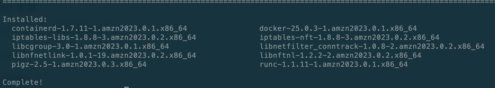

**3、启动 Docker 并将其设置为开机启动**：

```sh
sudo systemctl start docker
sudo systemctl enable docker
```

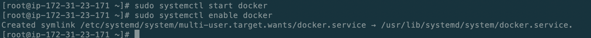

**4、验证 Docker 安装**：

检查 Docker 的版本，确保安装成功：

```sh
docker --version
```

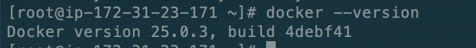

**5、配置权限（可选）**：

将当前用户添加到 docker 组中，以便无需 sudo 即可运行 Docker 命令：

```sh
sudo usermod -aG docker $USER
```

更改后需要重新登录才能生效。

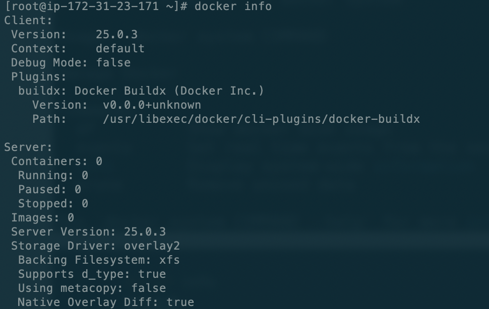


## 安装promethues

先准备启动prometheus需要的配置文件。需要准备两个文件：`prometheus.yml`和`record.geth.rules.yml`

`prometheus.yml`配置如下：

```yml
global:
  scrape_interval: 10s
  evaluation_interval: 10s

# Load and evaluate rules in this file every 'evaluation_interval' seconds.
rule_files:
  - 'record.geth.rules.yml'

# A scrape configuration containing exactly one endpoint to scrape.
scrape_configs:
  - job_name: 'bsc-dev'
    scrape_interval: 10s
    metrics_path: /debug/metrics/prometheus
    static_configs:
      - targets:
        - 34.226.211.254:6060
        labels:
          chain: bsc
```

`record.geth.rules.yml`配置如下：

```yml
groups:
  - name: geth_custom_rules
    rules:
      - record: geth_rpc_requests_success
        expr: label_replace({__name__=~"rpc_duration_.*_success"}, "method", "$1", "__name__", "rpc_duration_(.+)_success")
      - record: geth_rpc_requests_failure
        expr: label_replace({__name__=~"rpc_duration_.*_failure"}, "method", "$1", "__name__", "rpc_duration_(.+)_failure")
      - record: geth_rpc_requests_success_count
        expr: label_replace({__name__=~"rpc_duration_.*_success_count"}, "method", "$1", "__name__", "rpc_duration_(.+)_success_count")
      - record: geth_rpc_requests_failure_count
        expr: label_replace({__name__=~"rpc_duration_.*_failure_count"}, "method", "$1", "__name__", "rpc_duration_(.+)_failure_count")
      - record: rpc_count
        expr: label_replace({__name__=~"rpc_count_.*"}, "method", "$1", "__name__", "rpc_count_(.+)")
      - record: geth_rpc_success
        expr: label_replace({__name__=~"rpc_success_.*"}, "method", "$1", "__name__", "rpc_success_(.+)")
      - record: geth_rpc_failure
        expr: label_replace({__name__=~"rpc_failure_.*"}, "method", "$1", "__name__", "rpc_failure_(.+)")
```

这个文件的作用是设置一些修改规则，因为geth暴露的metrics是没有标签的，比如最后的rpc_count，表示每个rpc接口的请求次数，按道理来说这个metrics里面应该有一个label来表示统计的是那个rpc接口，如：`rpc_count{method="eth_call"}`，但实际上，他是将每个方法都看成了一个独立的metrics，如：`rpc_count_eth_call{}`。所以为了方便展示，需要将这些数据进行修改。

这里的含义是匹配所有`rpc_count_`开头的metrics，然后将他后面的api提取出来，作为一个method标签，然后重新构成为一个`rpc_count{method=}`的metrics.

具体的修改规则定义可以看[文档](https://prometheus.io/docs/prometheus/latest/configuration/recording_rules/)


[docker启动prometheus](https://prometheus.io/docs/prometheus/latest/installation/)

直接启动即可，他会自动去拉取，也可以使用docker pull先拉取，然后在启动

记得加-d让他后台运行

```sh
docker run -d \
    -p 9090:9090 \
    -v /root/monitor/prometheus:/etc/prometheus \
    prom/prometheus:latest
```

不加-d可以看到他的启动日志

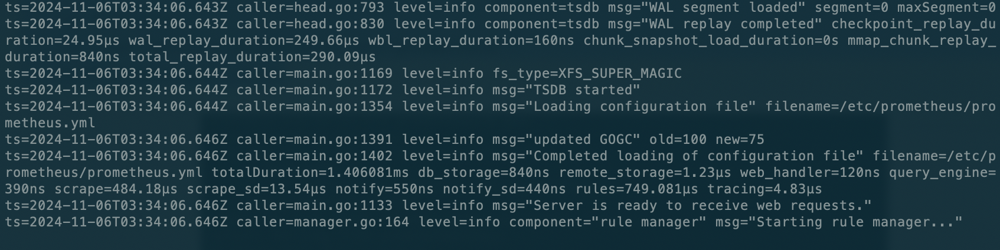

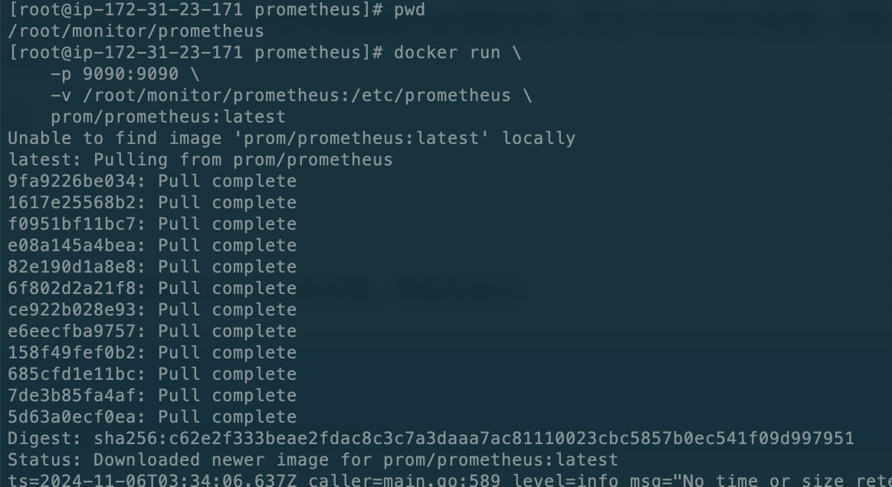

加上-d让他后台运行


然后请求一个接口查看一下：

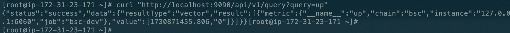

说明服务一起启动成功，如果开放了服务器端口，可以直接浏览器请求即可。

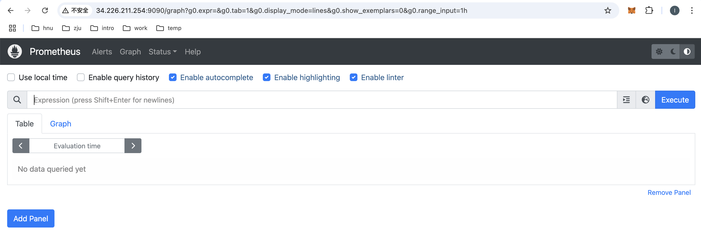

为了持久化数据，而不是在容器删除后，换个容器，数据就抹除，需要使用数据挂载。

```sh
docker volume create prometheus-data
docker run -d --name=prometheus \
    -p 9090:9090 \
    -v /root/monitor/prometheus:/etc/prometheus \
    -v prometheus-data:/prometheus \
    prom/prometheus:latest
```

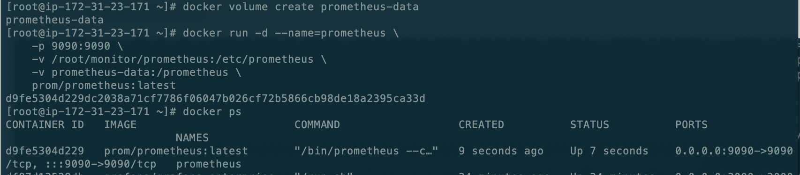

接下来就可以去安装配置面板了。


## 安装grafana

[官网](https://grafana.com/grafana/download?platform=docker),这个[更好](https://grafana.com/docs/grafana/latest/setup-grafana/installation/docker/)

```sh
docker run -d --name=grafana -p 3000:3000 grafana/grafana-enterprise
```

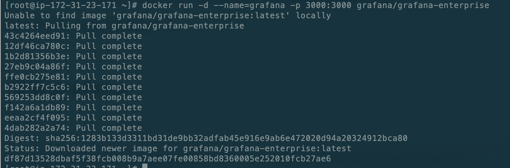

查看grafana的运行情况

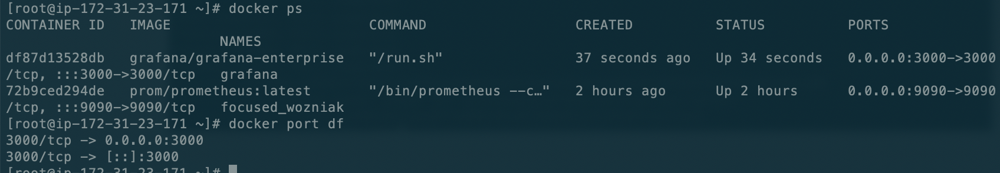

然后访问3000端口，就可以进入grafana的页面了，账号密码都是admin。

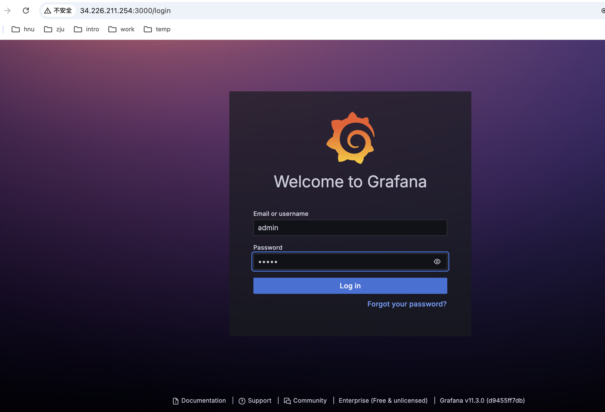

同样的，也需要数据持久化。

```sh
# create a persistent volume for your data
docker volume create grafana-storage

# verify that the volume was created correctly
# you should see some JSON output
docker volume inspect grafana-storage

# start grafana
docker run -d -p 3000:3000 --name=grafana \
  --volume grafana-storage:/var/lib/grafana \
  grafana/grafana-enterprise
```

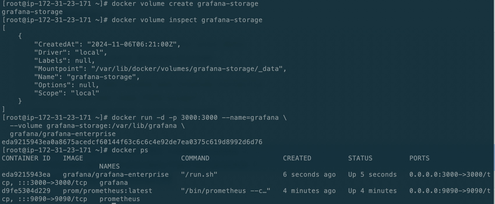

接下来就可以去配置面板了。


## 配置面板

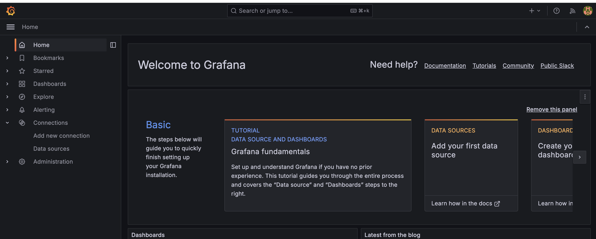

选择右下角的`Add your first data source`

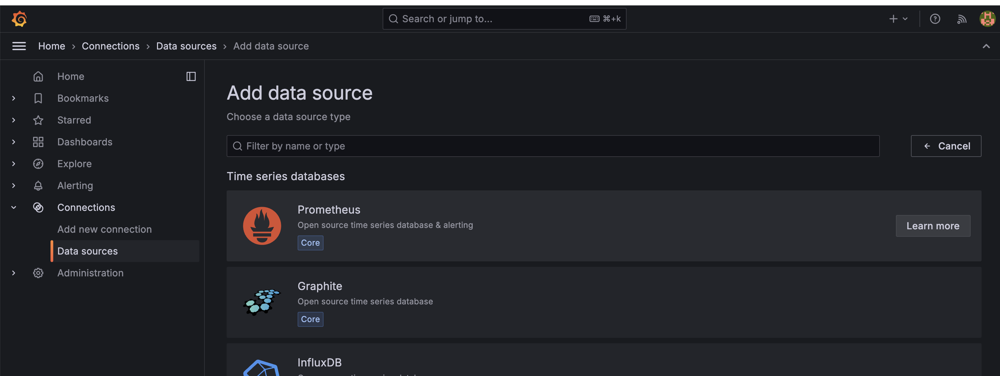

然后选择prometheus


然后就是配置各项信息。

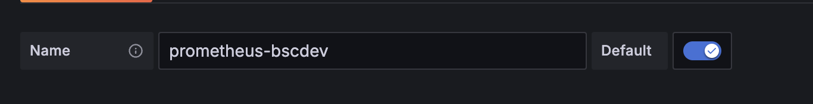

这里不能填localhost，和prometheus的配置一样，因为这个是在容器中运行的，用的网络和不互通，所以必须要指定ip，不然需要去[配置docker的网络](https://liushun-ing.github.io/home/master/prometheus/intro.html#node-exporter)。


然后这里可以使用`docker container logs prometheus`去看启动日志查看版本。

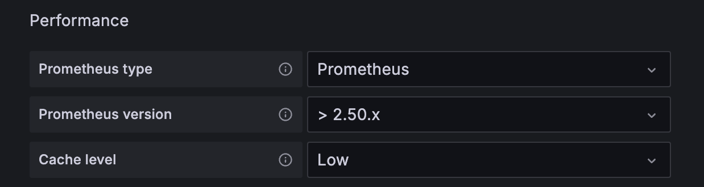

其他没啥需要配置的。

然后就可以去dashboards去创建一个控制面板了，可以直接导入[这个](https://grafana.com/grafana/dashboards/18463-go-ethereum-by-instance/)，然后选择刚刚配置好的数据源，就可以看到如下：**完美！！！**

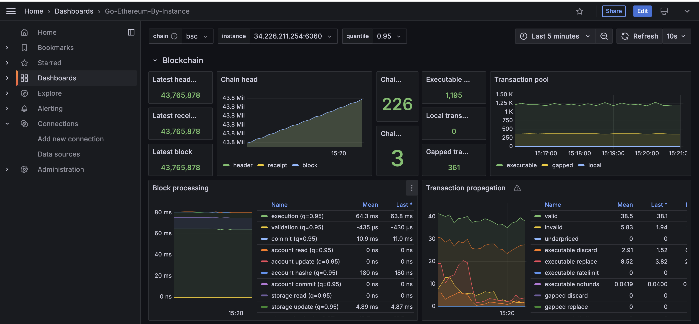


## docker compose

上面是服务配置有两个，需要启动两个服务，我们可以写一个配置文件，然后使用`docker compose`一键式配置和启动。

```sh
sudo curl -L "https://github.com/docker/compose/releases/latest/download/docker-compose-$(uname -s)-$(uname -m)" -o /usr/local/bin/docker-compose
```

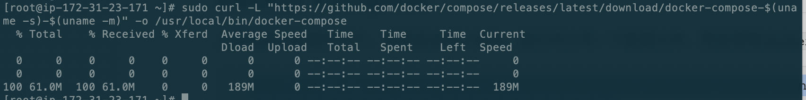

```sh
# 设置执行权限
sudo chmod +x /usr/local/bin/docker-compose

[root@ip-172-31-23-171 ~]# docker-compose --version
Docker Compose version v2.30.2
```

到这就安装成功啦。


因为使用的是官方镜像（prom/prometheus 和 grafana/grafana-enterprise），可以直接在 docker-compose.yml 中引用这些镜像，无需额外的 Dockerfile。如果需要构造自己的镜像，就需要自己写DockerFile文件来构造镜像文件了。


创建**docker-compose.yml**，docker compose就是根据这个文件去启动应用的。

```yml
services:
  prometheus:
    image: prom/prometheus:latest
    container_name: prometheus
    ports:
      - "9090:9090"
    volumes:
      - ./prometheus:/etc/prometheus       # 配置文件挂载
      - prometheus-data:/prometheus        # 数据卷

  grafana:
    image: grafana/grafana-enterprise
    container_name: grafana
    ports:
      - "3000:3000"
    volumes:
      - grafana-storage:/var/lib/grafana   # 数据卷

volumes:
  prometheus-data:
  grafana-storage:
```


然后在配置文件所在的目录执行一下命令即可。

> 注意：Docker Compose 无法找到用 docker run 创建的容器，这是因为 Docker Compose 仅管理它自己启动和定义的容器。它会根据 docker-compose.yml 文件来识别和管理服务，**不直接管理**通过 docker run 命令启动的容器，即使它们使用了相同的镜像或相同的名称。
>
> 所以在使用docker-compose之前，记得先把docker直接启动的容器停止并删了,还有数据卷也记得删了。

```sh
docker-compose up -d
# 运行完毕后，可以通过以下命令来检查容器状态
docker-compose ps
```

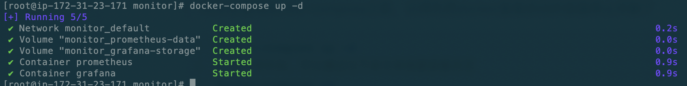


> **一些常用命令**

这条命令会启动所有定义在 `docker-compose.yml` 文件中的服务，如果容器已经在运行，Docker Compose 会**确认其状态**，而不会重复启动。

` docker-compose restart` **命令**：这会**重新启动**所有定义在 `docker-compose.yml` 文件中的容器，先停止再启动它们。

`docker-compose restart prometheus` 命令：这样只会重启该服务，而不会影响其他容器。

`docker-compose down` 停止所有服务,会把container删了，但数据卷不会受影响：

**注意**：使用 down 命令时，如果添加了 -v 参数（如 `docker-compose down -v`），会删除所有未使用的数据卷。确保不要在无备份的情况下误加 -v 参数。

**选择适合的方式**

​	•	**简单重启**：`docker-compose restart` 或 `docker-compose up -d`

​	•	**完整停用再启动**：`docker-compose down && docker-compose up -d`

`docker volume ls`：查看所有数据卷

日志相关：

运行以下命令可以查看所有容器的实时日志输出：

`docker-compose logs -f`

- -f 或 --follow：表示“跟随模式”，会实时输出新日志，就像使用 tail -f。
- 这将显示所有服务的日志，并实时更新。

如果只想查看某个服务的日志，可以在命令后指定服务名称。例如，要查看 prometheus 服务的日志：

`docker-compose logs -f prometheus`

如果只想查看最近的几行日志，可以使用 --tail 选项。例如，要查看 grafana 服务的最近 100 行日志：

`docker-compose logs --tail=100 grafana`


## 脚本

写了一个脚本，chatGPT就是好用

```sh
#!/usr/bin/env bash

# Color functions for output
color_text() { echo -e "\033[$1m$2\033[0m"; }
info() { color_text "0;34" "$1"; }    # Blue
success() { color_text "0;32" "$1"; } # Green
warning() { color_text "0;33" "$1"; } # Yellow
error() { color_text "0;31" "$1"; }   # Red

# Exit on error
error_exit() {
  error "$1"
  exit 1
}

# Display help message
usage() {
  echo "Usage: $0 -c <chain-name>"
  echo ""
  echo "Options:"
  echo "  -c <chain-name>   Specify the blockchain to monitor (e.g., bsc, eth)"
  echo "  -h                Display this help message"
}

# List of valid chain names
VALID_CHAINS=("bsc" "eth")

# Check for required parameters
if [ "$#" -eq 0 ]; then
  usage
  exit 1
fi

# Only allow -c or -h as valid options
while getopts ":c:h" opt; do
  case ${opt} in
    c)
      CHAIN_NAME="${OPTARG}"
      ;;
    h)
      usage
      exit 0
      ;;
    \?)
      error_exit "Invalid option: -$OPTARG. Use -h for help."
      ;;
  esac
done

# Shift away parsed options, check for any extra arguments
shift $((OPTIND -1))
if [ "$#" -ne 0 ]; then
  error_exit "Unexpected argument(s): $*. Only -c and -h options are allowed."
fi

# Ensure chain name is provided and is valid
if [ -z "$CHAIN_NAME" ]; then
  error_exit "Error: Chain name must be specified with -c."
fi

# Validate chain name
if [[ ! " ${VALID_CHAINS[@]} " =~ " ${CHAIN_NAME} " ]]; then
  error_exit "Error: Invalid chain name '$CHAIN_NAME'. Valid options are: ${VALID_CHAINS[*]}."
fi

# Docker installation check
if ! command -v docker &> /dev/null; then
  info "Installing Docker..."
  sudo yum update -y
  sudo yum install -y docker
  sudo systemctl start docker
  sudo systemctl enable docker
  sudo usermod -aG docker "$USER"
else
  success "Docker is already installed"
fi

# Docker Compose installation check
if ! command -v docker-compose &> /dev/null; then
  info "Installing Docker Compose..."
  sudo curl -L "https://github.com/docker/compose/releases/latest/download/docker-compose-$(uname -s)-$(uname -m)" -o /usr/local/bin/docker-compose
  sudo chmod +x /usr/local/bin/docker-compose
else
  success "Docker Compose is already installed"
fi

# Setup Prometheus and Grafana configuration files
info "Setting up Prometheus and Grafana configuration for chain: $CHAIN_NAME"
mkdir -p monitor/prometheus
cd monitor/prometheus || exit

# Get server IP address
ipAddress=$(curl -s ifconfig.me)

# Write Prometheus configuration
cat >prometheus.yml <<EOF
global:
  scrape_interval: 15s
  evaluation_interval: 15s

rule_files:
  - 'record.geth.rules.yml'

scrape_configs:
  - job_name: '$CHAIN_NAME-dev'
    scrape_interval: 15s
    metrics_path: /debug/metrics/prometheus
    static_configs:
      - targets:
        - $ipAddress:6060
        labels:
          chain: $CHAIN_NAME
EOF

# Write Prometheus recording rules
cat >record.geth.rules.yml <<EOF
groups:
  - name: geth_custom_rules
    rules:
      - record: geth_rpc_requests_success
        expr: label_replace({__name__=~"rpc_duration_.*_success"}, "method", "\$1", "__name__", "rpc_duration_(.+)_success")
      - record: geth_rpc_requests_failure
        expr: label_replace({__name__=~"rpc_duration_.*_failure"}, "method", "\$1", "__name__", "rpc_duration_(.+)_failure")
      - record: geth_rpc_requests_success_count
        expr: label_replace({__name__=~"rpc_duration_.*_success_count"}, "method", "\$1", "__name__", "rpc_duration_(.+)_success_count")
      - record: geth_rpc_requests_failure_count
        expr: label_replace({__name__=~"rpc_duration_.*_failure_count"}, "method", "\$1", "__name__", "rpc_duration_(.+)_failure_count")
      - record: rpc_count
        expr: label_replace({__name__=~"rpc_count_.*"}, "method", "\$1", "__name__", "rpc_count_(.+)")
      - record: geth_rpc_success
        expr: label_replace({__name__=~"rpc_success_.*"}, "method", "\$1", "__name__", "rpc_success_(.+)")
      - record: geth_rpc_failure
        expr: label_replace({__name__=~"rpc_failure_.*"}, "method", "\$1", "__name__", "rpc_failure_(.+)")
EOF

# Create Docker Compose file for Prometheus and Grafana
cd ..
cat >docker-compose.yml <<EOF
services:
  prometheus:
    image: prom/prometheus:latest
    container_name: prometheus
    ports:
      - "9090:9090"
    volumes:
      - ./prometheus:/etc/prometheus
      - prometheus-data:/prometheus

  grafana:
    image: grafana/grafana-enterprise
    container_name: grafana
    ports:
      - "3000:3000"
    volumes:
      - grafana-storage:/var/lib/grafana

volumes:
  prometheus-data:
  grafana-storage:
EOF

# Start Prometheus and Grafana
info "Starting Prometheus and Grafana containers..."
docker-compose up -d

# Final status message
success "Setup complete. Prometheus is running on port 9090 and Grafana on port 3000."
```

在新的服务器上跑的结果。

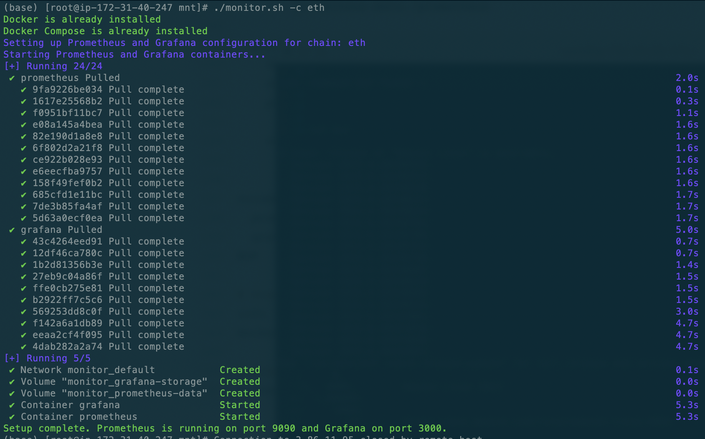


## geth增加新指标

### system metrics

go语言的监测库-[gopsutil](https://github.com/shirou/gopsutil)

```go
package metrics

import (
    "github.com/ethereum/go-ethereum/log"
    cpuv4 "github.com/shirou/gopsutil/v4/cpu"
)

// ReadScutumCPUStats retrieves the current CPU stats.
func ReadScutumCPUStats(stats *CPUStats) {
    // passing false to request all cpu times
    timeStats, err := cpuv4.Times(false)
    if err != nil {
       log.Error("Could not read cpu stats", "err", err)
       return
    }
    if len(timeStats) == 0 {
       log.Error("Empty cpu stats")
       return
    }
    // requesting all cpu times will always return an array with only one time stats entry
    timeStat := timeStats[0]
    stats.GlobalTime = timeStat.User + timeStat.Nice + timeStat.System
    stats.GlobalWait = timeStat.Iowait
    stats.LocalTime = getProcessCPUTime()
}
```


```go
package metrics

import (
    "fmt"
    "github.com/shirou/gopsutil/v4/disk"
    "github.com/shirou/gopsutil/v4/mem"
    "github.com/shirou/gopsutil/v4/process"
    "os"
    "os/exec"
    "runtime/metrics"
    "runtime/pprof"
    "strconv"
    "strings"
    "syscall"
    "time"

    "github.com/ethereum/go-ethereum/log"
)

type runtimeStats struct {
    GCPauses     *metrics.Float64Histogram
    GCAllocBytes uint64
    GCFreedBytes uint64

    MemTotal     uint64
    HeapObjects  uint64
    HeapFree     uint64
    HeapReleased uint64
    HeapUnused   uint64

    Goroutines   uint64
    SchedLatency *metrics.Float64Histogram
}

var runtimeSamples = []metrics.Sample{
    {Name: "/gc/pauses:seconds"}, // histogram
    {Name: "/gc/heap/allocs:bytes"},
    {Name: "/gc/heap/frees:bytes"},
    {Name: "/memory/classes/total:bytes"},
    {Name: "/memory/classes/heap/objects:bytes"},
    {Name: "/memory/classes/heap/free:bytes"},
    {Name: "/memory/classes/heap/released:bytes"},
    {Name: "/memory/classes/heap/unused:bytes"},
    {Name: "/sched/goroutines:goroutines"},
    {Name: "/sched/latencies:seconds"}, // histogram
}

func ReadRuntimeStats() *runtimeStats {
    r := new(runtimeStats)
    readRuntimeStats(r)
    return r
}

// CollectSystemMetrics 使用 gopsutil 收集系统信息：cpu, disk and memory.
func CollectSystemMetrics(refresh time.Duration) {
    // Create the various data collectors
    var (
       cpustats  = make([]CPUStats, 2)
       diskstats = make([]ScutumDiskStats, 2)
       rstats    = make([]runtimeStats, 2)
    )

    // Define the various metrics to collect
    var (
       cpuSysLoad       = GetOrRegisterGauge("scutum/system/cpu/sysload", DefaultRegistry)
       cpuSysWait       = GetOrRegisterGauge("scutum/system/cpu/syswait", DefaultRegistry)
       cpuProcLoad      = GetOrRegisterGauge("scutum/system/cpu/procload", DefaultRegistry)
       cpuSysLoadTotal  = GetOrRegisterCounterFloat64("scutum/system/cpu/sysload/total", DefaultRegistry)
       cpuSysWaitTotal  = GetOrRegisterCounterFloat64("scutum/system/cpu/syswait/total", DefaultRegistry)
       cpuProcLoadTotal = GetOrRegisterCounterFloat64("scutum/system/cpu/procload/total", DefaultRegistry)
       cpuThreads       = GetOrRegisterGauge("scutum/system/cpu/threads", DefaultRegistry)
       cpuGoroutines    = GetOrRegisterGauge("scutum/system/cpu/goroutines", DefaultRegistry)

       memTotal     = GetOrRegisterGauge("scutum/system/memory/total", DefaultRegistry)
       memFree      = GetOrRegisterGauge("scutum/system/memory/free", DefaultRegistry)
       memAvailable = GetOrRegisterGauge("scutum/system/memory/available", DefaultRegistry)
       memUsed      = GetOrRegisterGauge("scutum/system/memory/used", DefaultRegistry)
       memGethUsed  = GetOrRegisterGauge("scutum/system/memory/gethused", DefaultRegistry)

       diskReadCounter  = GetOrRegisterCounter("scutum/system/disk/readcount", DefaultRegistry)
       diskWriteCounter = GetOrRegisterCounter("scutum/system/disk/writecount", DefaultRegistry)
       readBytes        = GetOrRegisterCounter("scutum/system/disk/readbytes", DefaultRegistry)
       writeBytes       = GetOrRegisterCounter("scutum/system/disk/writebytes", DefaultRegistry)
    )

    // 使用 pgrep 查找进程名为 geth-linux 的进程 PID
    cmd := exec.Command("pgrep", "geth-linux")
    output, err := cmd.Output()
    if err != nil {
       fmt.Println("未找到进程或发生错误:", err)
       return
    }
    // 去除输出中的换行符
    pidStr := strings.TrimSpace(string(output))
    pid, err := strconv.Atoi(pidStr)
    if err != nil {
       fmt.Printf("geth-linux 进程 pid 解析失败")
       return
    }
    fmt.Printf("geth-linux 进程的 PID 是: %v\n", pid)

    var mountDirs []string
    gethProcess, err := process.NewProcess(int32(pid))
    if err != nil {
       gethProcess = nil
    }
    // 获取进程启动命令行
    if gethProcess != nil {
       workingDir, err := gethProcess.Cwd()
       if err == nil {
          mountDirs = extractMountDir(workingDir)
       }
    }

    var lastCollectTime time.Time

    // Iterate loading the different stats and updating the meters.
    now, prev := 0, 1
    for ; ; now, prev = prev, now {
       // Gather CPU times.
       ReadScutumCPUStats(&cpustats[now])
       collectTime := time.Now()
       secondsSinceLastCollect := collectTime.Sub(lastCollectTime).Seconds()
       lastCollectTime = collectTime
       if secondsSinceLastCollect > 0 {
          sysLoad := cpustats[now].GlobalTime - cpustats[prev].GlobalTime
          sysWait := cpustats[now].GlobalWait - cpustats[prev].GlobalWait
          procLoad := cpustats[now].LocalTime - cpustats[prev].LocalTime
          // Convert to integer percentage.
          cpuSysLoad.Update(int64(sysLoad / secondsSinceLastCollect * 100))
          cpuSysWait.Update(int64(sysWait / secondsSinceLastCollect * 100))
          cpuProcLoad.Update(int64(procLoad / secondsSinceLastCollect * 100))
          // increment counters (ms)
          cpuSysLoadTotal.Inc(sysLoad)
          cpuSysWaitTotal.Inc(sysWait)
          cpuProcLoadTotal.Inc(procLoad)
       }

       // Threads
       if gethProcess != nil {
          threads, err := gethProcess.NumThreads()
          if err == nil {
             cpuThreads.Update(int64(threads))
          }
          memoryInfo, err := gethProcess.MemoryInfo()
          if err == nil {
             memGethUsed.Update(int64(memoryInfo.RSS))
          }
       }

       // Go runtime metrics
       readScutumRuntimeStats(&rstats[now])
       cpuGoroutines.Update(int64(rstats[now].Goroutines))

       virtualMemory, err := mem.VirtualMemory()
       if err == nil {
          memAvailable.Update(int64(virtualMemory.Available))
          memFree.Update(int64(virtualMemory.Free))
          memUsed.Update(int64(virtualMemory.Used))
          memTotal.Update(int64(virtualMemory.Total))
       }

       // Disk
       collectDiskMetrics(mountDirs)
       if ReadScutumDiskStats(&diskstats[now]) == nil {
          diskReadCounter.Inc(diskstats[now].ReadCount - diskstats[prev].ReadCount)
          diskWriteCounter.Inc(diskstats[now].WriteCount - diskstats[prev].WriteCount)
          readBytes.Inc(diskstats[now].ReadBytes - diskstats[prev].ReadBytes)
          writeBytes.Inc(diskstats[now].WriteBytes - diskstats[prev].WriteBytes)
       }

       time.Sleep(refresh)
    }
}

func collectDiskMetrics(mounts []string) {
    for _, mount := range mounts {
       k := ""
       if mount == "/" {
          k = "/bscdev"
       } else if mount == "/mnt" {
          k = "/ethdev"
       } else if strings.HasPrefix(mount, "/mnt") {
          k = mount[4:]
       }
       var (
          diskTotal = GetOrRegisterGauge("scutum/system/disk"+k+"/total", DefaultRegistry)
          diskUsed  = GetOrRegisterGauge("scutum/system/disk"+k+"/used", DefaultRegistry)
          diskFree  = GetOrRegisterGauge("scutum/system/disk"+k+"/free", DefaultRegistry)
       )
       // Disk
       diskUsage, err := disk.Usage(mount)
       if err == nil {
          diskTotal.Update(int64(diskUsage.Total))
          diskUsed.Update(int64(diskUsage.Used))
          diskFree.Update(int64(diskUsage.Free))
       }
    }
}

func extractMountDir(workingDir string) []string {
    partitions, err := disk.Partitions(true)
    if err != nil {
       return []string{}
    }
    var mounts []string
    for _, partition := range partitions {
       if strings.Contains("/root/geth.fast", workingDir) {
          // bsc dev
          if partition.Mountpoint == "/" {
             mounts = append(mounts, partition.Mountpoint)
          }
       } else if strings.Contains("/mnt/data", workingDir) {
          // eth dev
          if partition.Mountpoint == "/mnt" {
             mounts = append(mounts, partition.Mountpoint)
          }
       } else {
          if strings.HasPrefix(partition.Mountpoint, "/mnt") {
             mounts = append(mounts, partition.Mountpoint)
          }
       }
    }
    return mounts
}

func readScutumRuntimeStats(v *runtimeStats) {
    metrics.Read(runtimeSamples)
    for _, s := range runtimeSamples {
       // Skip invalid/unknown metrics. This is needed because some metrics
       // are unavailable in older Go versions, and attempting to read a 'bad'
       // metric panics.
       if s.Value.Kind() == metrics.KindBad {
          continue
       }

       switch s.Name {
       case "/sched/goroutines:goroutines":
          v.Goroutines = s.Value.Uint64()
       }
    }
}

type ScutumDiskStats struct {
    ReadCount  int64 // Number of read operations executed
    ReadBytes  int64 // Total number of bytes read (include disk cache)
    WriteCount int64 // Number of write operations executed
    WriteBytes int64 // Total number of byte written
}

// ReadScutumDiskStats retrieves the disk IO stats for whole system disk.
func ReadScutumDiskStats(stats *ScutumDiskStats) error {
    counters, err := disk.IOCounters()
    if err != nil {
       fmt.Printf("获取 disk IOCounters 失败")
       return err
    }
    var totalReadCount, totalWriteCount, totalReadBytes, totalWriteBytes uint64
    for _, counter := range counters {
       totalReadCount += counter.ReadCount
       totalReadBytes += counter.ReadBytes
       totalWriteCount += counter.WriteCount
       totalWriteBytes += counter.WriteBytes
    }
    stats.ReadCount = int64(totalReadCount)
    stats.ReadBytes = int64(totalReadBytes)
    stats.WriteCount = int64(totalWriteCount)
    stats.WriteBytes = int64(totalWriteBytes)
    return nil
}
```


### api metrics

这个可以看作是个rpc的处理函数，可以看到他runMethod之后进行了metrics的统计。我们可以在这里分析成功和失败的请求的个数。也就是`newRPCFailureGauge(msg.Method).Inc(1)`和`newRPCSuccessGauge(msg.Method).Inc(1)`。

```go
// handleCall processes method calls.
func (h *handler) handleCall(cp *callProc, msg *jsonrpcMessage) *jsonrpcMessage {
    if msg.isSubscribe() {
       return h.handleSubscribe(cp, msg)
    }
    var callb *callback
    if msg.isUnsubscribe() {
       callb = h.unsubscribeCb
    } else {
       callb = h.reg.callback(msg.Method)
    }
    if callb == nil {
       return msg.errorResponse(&methodNotFoundError{method: msg.Method})
    }

    args, err := parsePositionalArguments(msg.Params, callb.argTypes)
    if err != nil {
       return msg.errorResponse(&invalidParamsError{err.Error()})
    }
    start := time.Now()
    answer := h.runMethod(cp.ctx, msg, callb, args)

    // Collect the statistics for RPC calls if metrics is enabled.
    // We only care about pure rpc call. Filter out subscription.
    if callb != h.unsubscribeCb {
       rpcRequestGauge.Inc(1)
       if answer.Error != nil {
          failedRequestGauge.Inc(1)
          newRPCFailureGauge(msg.Method).Inc(1)
       } else {
          successfulRequestGauge.Inc(1)
          newRPCSuccessGauge(msg.Method).Inc(1)
       }
       rpcServingTimer.UpdateSince(start)
       newRPCRequestGauge(msg.Method).Inc(1)
       updateServeTimeHistogram(msg.Method, answer.Error == nil, time.Since(start))
    }

    return answer
}

func newRPCRequestGauge(method string) metrics.Gauge {
	m := fmt.Sprintf("rpc/count/%s", method)
	return metrics.GetOrRegisterGauge(m, nil)
}

func newRPCSuccessGauge(method string) metrics.Gauge {
	m := fmt.Sprintf("rpc/success/%s", method)
	return metrics.GetOrRegisterGauge(m, nil)
}

func newRPCFailureGauge(method string) metrics.Gauge {
	m := fmt.Sprintf("rpc/failure/%s", method)
	return metrics.GetOrRegisterGauge(m, nil)
}
```

这两个指标也对了rules中的最后两条rules。

```
- record: geth_rpc_success
  expr: label_replace({__name__=~"rpc_success_.*"}, "method", "$1", "__name__", "rpc_success_(.+)")
- record: geth_rpc_failure
  expr: label_replace({__name__=~"rpc_failure_.*"}, "method", "$1", "__name__", "rpc_failure_(.+)")
```

这样，通过rate函数就可以查询最近一段时间内的接口请求个数的增长情况。


