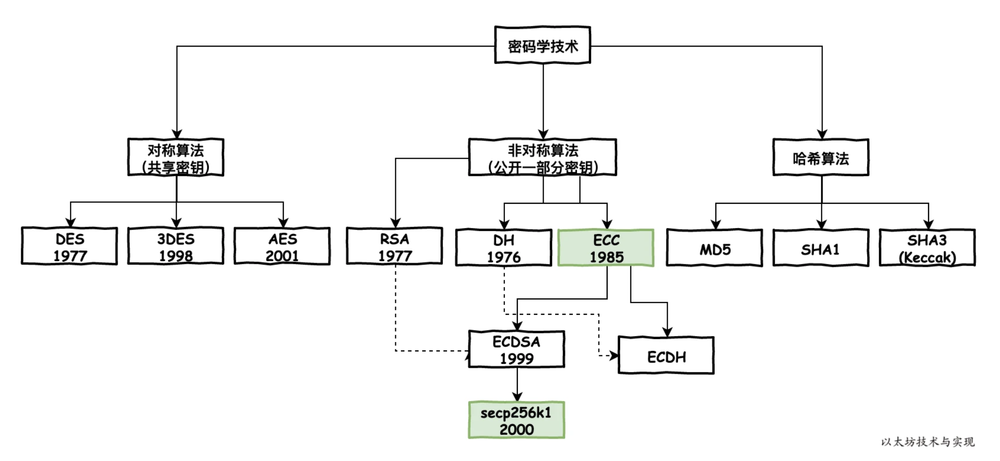
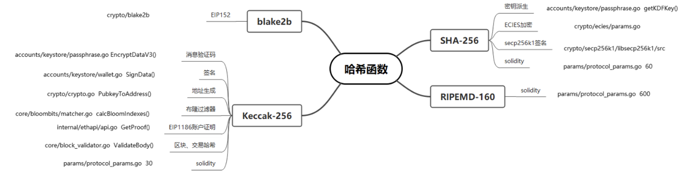
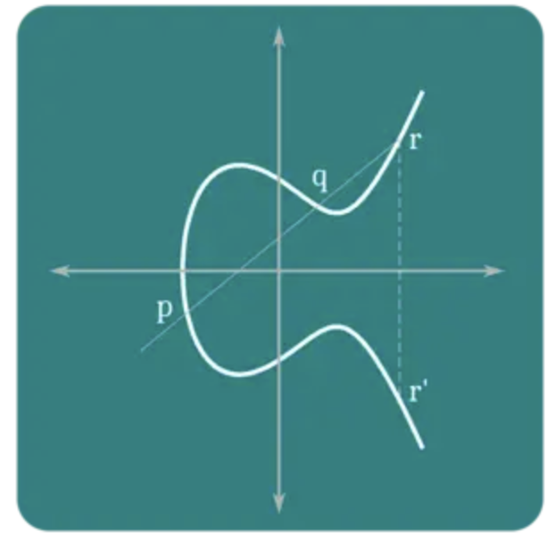
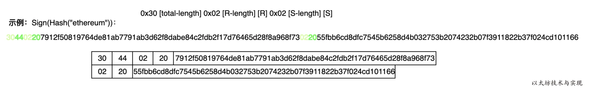
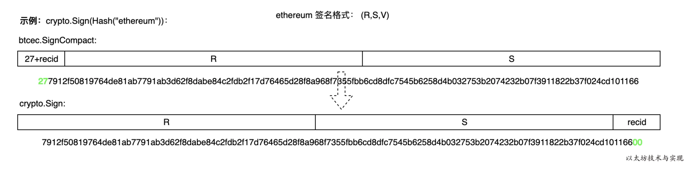

# 区块链中的密码学

## 基础架构






## 秘钥和地址

以太坊有两种不同类型的账户：外部账户(EOAs)和合约CA。以太币的所有权是通过私钥，以太坊地址，和数字签名建立的。私钥是每个用户与以太坊交互的中心。事实上，账户地址直接来源于私钥：它唯一确定了一个以太坊地址，也叫账户。


### 私钥

私钥只是一个随机选择的数字。私钥的所有权和控制权是用户控制相应以太坊地址所有资产的根本，此外，用户还可以访问授权该地址的合约。私钥用于在交易中进行签名，以证明所有权。

必须确保私钥，如果将它透露给第三方就等于交出了以太币和合约的控制权。并且，必须要备份，以免意外丢失。如果私钥遗失，是无法恢复的，它所保护的资产也就永远丢失了。

> 从随机数生成私钥

生成密钥的第一步，也是最重要的一步，就是找到一个安全的熵或者随机数的源。创建以太坊私钥涉及到要从1−2^256^中选择数字。以太坊软件使用底层操作系统的随机数生成器生成**256位随机数**。

私钥可以是任何非零的数字，可以大到只略小于2^256^的非常大的数——一个非常大的78位的数，大约1.158×10^77^。

> “2^256^——以太坊私钥空间的大小——是一个非常大的数字，十进制大约为10^77^”——Andreas Antonopoulo,《Mastering Ethereum: Building Smart Contracts and DApps》的作者

注意，私钥生成是离线的；它与以太坊网络没有任何通信，也不需要。

*不要自己编写代码来生成随机数或者用你的编程语言随机生成一个简单的随机数。*


### 公钥

以太坊公钥是椭圆曲线上的一个点，一个满足椭圆曲线等式的(x，y)坐标。

它由两个从私钥生成的数字组成，并且只能单向生成，这意味着，如果你有一个私钥，就可以计算出公钥，但是你不能从公钥计算出私钥。

公钥是私钥通过椭圆曲线乘法得来，是不可逆的：𝐾=𝑘×𝐺，这里的𝑘是私钥，𝐺是常数点(生成点)，𝐾是公钥。

> 椭圆曲线乘法(×)与普通的乘法不同。它是一种单向函数:一个方向很容易计算出结果(乘法)，而反方向则是不可能的(除法)。

> 以太坊使用与比特币相同的椭圆曲线，secp256k1——Andreas Antonopoulo,《Mastering Ethereum: Building Smart Contracts and DApps》的作者

看不懂椭圆曲线咋工作的。=_=




### 以太坊地址格式

以太坊地址是一个十六进制数，用公钥的 Keccak-256 哈希的后20字节表示。其中，Keccak256运算得到的值为32位。


### ECDSA

ECDSA（Elliptic Curve Digital Signature Algorithm）是一种从椭圆曲线密码学派生的数字签名算法，感觉就是基于椭圆曲线得到公私钥，然后使用该公私钥进行非对称加解密验证。

ECDSA处理过程：
1.参与数字签名的所有通信方都使用相同的全局参数，用于定义椭圆曲线以及曲线上的基点
2.签名者首先生成一对公私钥。对于私钥，选择一个随机数或者伪随机数作为私钥，利用随机数和基点算出另一点，作为公钥
3.对消息计算Hash值，用私钥、全局参数和Hash值生成签名
4.验证者用签名者的公钥、全局参数等验证。


## 单向散列函数

Hash函数（单向散列）是密码学的一个重要分支，它是一种将任意长度的输入变换为固定长度的输出且不可逆的单项密码体制，Hash函数在数字签名和消息完整性检测等方面有着广泛的应用。

单向散列函数的特点：

1. 任意长度的输入数据，输出值是固定长度，相当于输入数据的指纹。
2. 每一个特定的输入数据都对应到一个“唯一”的输出值。
3. 从输出值（散列值）无法反推出输入值。
4. 在给定时间和给定计算资源的条件下，以目前的技术水平，无法找到有同一个数据“指纹”的两条不同的数据。
5. 输入数据改变 1 bit（位），输出结果也会产生巨大变化。

常见的Hash函数有MD5、SHA1、SHA256。其中，MD5、SHA1都已被破解，有安全隐患。SHA256目前是安全的。

> Keccak256

由于MD5、SHA系列的Hash函数遭受到了碰撞攻击，NIST(National Institute of Standards and Technology)在2005年10月31日到11月1日和2006年8月24日至25日举办了两次Hash函数研讨会，评估了Hash函数当前的使用状况，征求了公众对Hash函数的新规则。经过讨论之后，在2007年11月，NIST决定通过公开竞赛，以高级加密标准AES的开发过程为范例开发新的Hash函数。经过一系列竞赛，NIST在2012年评选出最终算法并产生了新的Hash标准。Keccak算法由于其较强的安全性和软硬件实现性能，最终被选为新一代的标准Hash算法，并被命名为SHA-3。

以太坊采用的是Keccak256，也就是 SHA-3 的前身。

- SHA256 属于MD4 家族，使用同一结构的压缩函数引擎，所以，攻击MD5和SHA1的方法可以被扩展，用来攻击SHA256。虽然目前还没有爆出SHA256 被攻击成功的案例，但如果下一代单向散列函数还基于同一原理，系统风险会大大增加。
- Keccak 属于完全不同的框架（海绵函数引擎），可以分散被成功攻击的风险。Keccak256软件实现速度较慢， 但是对于硬件实现非常友好，基于硬件的算法实现数据处理速度很快。
- NIST接受原始的Keccak256设计后，更改了Padding的格式， 以太坊坚持使用了原始的方案，因为这一更改存在争议，导致了正式的SHA3实现和原始的Keccak不兼容。


## 签名和校验

### 以太坊和比特币的签名差异

虽然以太坊签名算法和比特币一样，都是 secp256k1 ，但是在签名的格式有所差异。

比特币在BIP66中对签名数据格式采用严格的[DER](https://www.itu.int/ITU-T/studygroups/com17/languages/X.690-0207.pdf)编码格式，其签名数据格式如下：

```
 0x30 [total-length] 0x02 [R-length] [R] 0x02 [S-length] [S]
```

这里的 0x30 、0x02 是DER数据格式中定义的Tag，不同Tag对应不同含义。以 secp256k1 算法来说：

- total-length： 1字节，表示签名字节总长度，其值等于：4byte(Tag total-length 后面的四个Tag)+R的长度+S的长度。而secp256k1算法是256长度，即32字节。因此签名字节总长度为0x44(68=4+32+32)。
- R-length： 1字节，表示R值长度。其值始终等于0x20(表示十进制32)。
- R： 32字节，secp256k1 算法中的R值。
- S-length: 1字节，表示S值长度。始终等于0x20。
- S：32字节，secp256k1 算法中的S值。

示例




对比比特币签名，以太坊的签名格式是`r+s+v`。 r 和 s 是ECDSA签名的原始输出，而末尾的一个字节为 recovery id 值，但在以太坊中用`V`表示，v 值为1或者0。recovery id 简称 recid，表示从内容和签名中成功恢复出公钥时需要查找的次数（因为根据`r`值在椭圆曲线中查找符合要求的坐标点可能有多个），但在比特币下最多需要查找两次。这样在签名校验恢复公钥时，不需要遍历查找，一次便可找准公钥，加速签名校验速度。

签名是针对32字节的byte，实际上是对应待签名内容的哈希值，以太坊中哈希值`common.Hash`长度固定为32。比如对交易签名时传入的是交易哈希`crypto.Sign(tx.Hash()[:], prv)`。注意是 tx.Hash()，不是整个数据。下面展示更清晰：

```go
data := []byte("hello")
hash := common.Hash(crypto.Keccak256(data))
hashedData := crypto.Keccak256Hash(data)
fmt.Println(hash.Hex())       // 0x1c8aff950685c2ed4bc3174f3472287b56d9517b9c948127319a09a7a36deac8
fmt.Println(hashedData.Hex()) // 0x1c8aff950685c2ed4bc3174f3472287b56d9517b9c948127319a09a7a36deac8
signature, err := crypto.Sign(hash.Bytes(), privateKey)
```

以太坊签名格式是`[R] [S] [V]`，和比特币不同。因此需要进行调换，将 R 和 S 值放到前面，将 recid 放到最后。



> 签名校验

```go
// 删除 signature 的最后一个字节，因为它是ECDSA恢复ID，不能包含它
signatureWithoutRecoverID := signature[:len(signature)-1]
// The signature should have the 64 byte [R || S] format.
// 这也就是为什么需要剃掉最后一个字节的原因，最后一个字节是 v，是 0 或者 1.
isVerified = crypto.VerifySignature(publicKeyBytes, hash.Bytes(), signatureWithoutRecoverID)
```


### 交易数据签名和校验

> ==流程图，重要，记住签名的过程==
>
> 数据都需要经过 RLP 编码之后，才计算 hash，然后对 hash 签名。


> 签名过程

首先调用types 的交易签名方法

```go
signedTx, err := types.SignTx(tx, types.LatestSignerForChainID(chainId), privateKey)

// SignTx signs the transaction using the given signer and private key.
func SignTx(tx *Transaction, s Signer, prv *ecdsa.PrivateKey) (*Transaction, error) {
	h := s.Hash(tx)
	sig, err := crypto.Sign(h[:], prv)
	if err != nil {
		return nil, err
	}
	return tx.WithSignature(s, sig)
}
```

在这个函数内部，会调用 s.Hash(tx)对整个交易进行 RLP 编码，并计算 Keccak256hash 值。下面是 signer 的 EIP155 提案的一种hash实现

```go
// Hash returns the hash to be signed by the sender.
// It does not uniquely identify the transaction.
func (s EIP155Signer) Hash(tx *Transaction) common.Hash {
	return rlpHash([]interface{}{
		tx.Nonce(),
		tx.GasPrice(),
		tx.Gas(),
		tx.To(),
		tx.Value(),
		tx.Data(),
		s.chainId, uint(0), uint(0),
	})
}
```

然后对这个 hash 值进行签名，得到 sig。得到 sig 后，需要解析出 r,s,v，并重新构造一个交易对象并返回。

```go

// WithSignature returns a new transaction with the given signature.
// This signature needs to be in the [R || S || V] format where V is 0 or 1.
func (tx *Transaction) WithSignature(signer Signer, sig []byte) (*Transaction, error) {
	r, s, v, err := signer.SignatureValues(tx, sig)
	if err != nil {
		return nil, err
	}
	if r == nil || s == nil || v == nil {
		return nil, fmt.Errorf("%w: r: %s, s: %s, v: %s", ErrInvalidSig, r, s, v)
	}
	cpy := tx.inner.copy()
	cpy.setSignatureValues(signer.ChainID(), v, r, s)
	return &Transaction{inner: cpy, time: tx.time}, nil
}
```

需要注意的是，这里的 V 的计算不在是简单返回 0 或者 1 了，从前面的签名算法过程，可以知道 R 和 S 是ECDSA签名的原始输出，V 值是 recid，其值是0或者1。但是在交易签名时，EIP155 的实现中，V 值不再是recid, 而是 recid+ chainID*2+ 35。


> 解析

签名交易后，如何才能获得交易签名者呢？这个是加密算法的逆向解签名者，是利用用户签名内容以及签名信息(R、S、V)得到用户私钥的公钥，从而得到签名者账户地址。最终比对账户地址判断是否交易有效。


