# 以太坊虚拟机EVM

以太坊虚拟机 (EVM) 是一个去中心化虚拟环境，它在所有以太坊节点上一种安全一致地方式执行代码。 节点运行以太坊虚拟机，以执行智能合约，利用“[燃料](https://ethereum.org/zh/gas/)”度量执行[操作](https://ethereum.org/zh/developers/docs/evm/opcodes/)所需的计算工作，从而确保高效的资源分配和网络安全性。

以太坊不是分布式账本，而是分布式[状态机器](https://wikipedia.org/wiki/Finite-state_machine)。 以太坊的状态是一个大型数据结构，它不仅保存所有帐户和余额，而且还保存一个*机器状态*，它可以根据预定义的一组规则在不同的区块之间进行更改，并且可以执行任意的机器代码。 在区块中更改状态的具体规则由 EVM 定义。


## 以太坊状态转换函数

EVM 的行为就像一个数学函数：在给定输入的情况下，它会产生确定性的输出。 因此，将以太坊更正式地描述为具有**状态转换函数**非常有帮助：

```
Y(S, T)= S'
```

给定一个旧的有效状态 `（S）`> 和一组新的有效交易 `（T）`，以太坊状态转换函数 `Y（S，T）` 产生新的有效输出状态` S'`

> 状态

在以太坊环境中，状态是一种称为[改进版默克尔帕特里夏树](https://ethereum.org/zh/developers/docs/data-structures-and-encoding/patricia-merkle-trie/)的巨大数据结构，它保存所有通过哈希关联在一起的帐户并可回溯到存储在区块链上的单个根哈希。

> 交易

交易是来自帐户的密码学签名指令。 交易分为两种：**一种是消息调用交易，另一种是合约创建交易**。

合约创建交易会创建一个新的合约帐户，其中包含已编译的智能合约字节码。 每当另一个帐户对该合约进行消息调用时，它都会**执行其字节码**。


## EVM说明

EVM 作为一个[堆栈机](https://wikipedia.org/wiki/Stack_machine)运行，其栈的深度为 1024 个项。 每个项目都是 256 位字，为了便于使用，选择了 256 位加密技术（如 Keccak-256 哈希或 secp256k1 签名）。

在执行期间，EVM 会维护一个瞬态*内存*（作为字可寻址的字节数组），该内存不会在交易之间持久存在。

然而，合约确实包含一个 Merkle Patricia *存储* trie（作为可字寻址的字数组），该 trie 与帐户和部分全局状态关联。

已编译的智能合约字节码作为许多 EVM opcodes执行，它们执行标准的堆栈操作，例如 `XOR`、`AND`、`ADD`、`SUB`等。 EVM 还实现了一些区块链特定的堆栈操作，如 `ADDRESS`、`BALANCE`、`BLOCKHASH` 等。这些操作指令都对应有自己的**燃料**，还有一些指令具有动态燃料

**每个以太坊执行客户端都包含了一个以太坊虚拟机的实现**。


## 详细说明

虚拟机用来执行以太坊上的交易，更改以太坊状态。交易分两种：普通交易和智能合约交易。在执行交易时需要支付油费。智能合约之间的调用有四种方式。

### 全局观

以太坊虚拟机，简称EVM，是用来执行以太坊上的交易的。业务流程如下图：

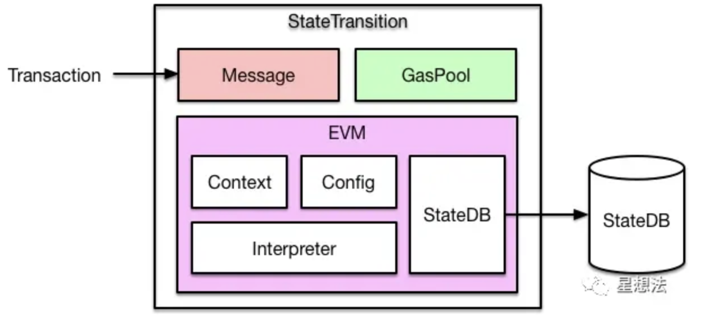

输入一笔交易，内部会转换成一个`Message`对象，传入`EVM`执行。

如果是一笔普通转账交易，那么直接修改`StateDB`中对应的账户余额即可。如果是智能合约的创建或者调用，则通过EVM中的解释器加载和执行字节码，执行过程中可能会查询或者修改`StateDB`。


### 固定邮费（Intrinsic Gas）

每笔交易过来，先需要收取一笔固定油费，计算方法如下：

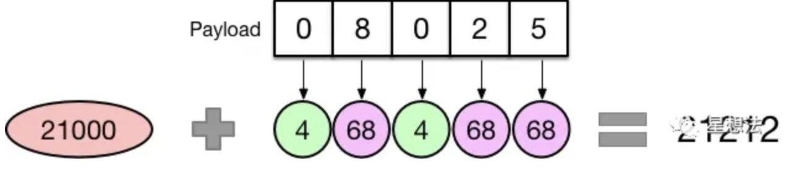

如果交易不带额外数据（Payload），比如普通转账，那么需要收取21000的油费。

如果交易携带额外数据，那么这部分数据也是需要收费的，具体来说是按字节收费：字节为0的收4块，字节不为0收68块，所以会看到很多做合约优化的，目的就是减少数据中不为0的字节数量，从而降低油费gas消耗。


### 生成 Contract 对象

交易会被转换成一个Message对象传入EVM，而EVM则会根据Message生成一个Contract对象，以便后续执行：

也就是说明 EVM 的执行都是根据 Contract 对象来进行的

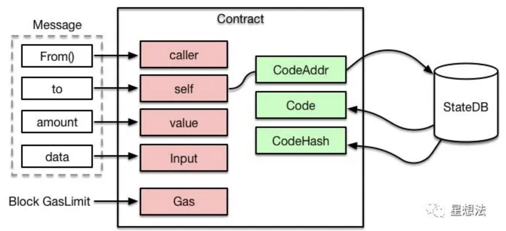

可以看到，Contract中会根据合约地址，从`StateDB`中加载对应的代码，后面送入解释器执行。

另外，执行合约能够消耗的油费有一个上限，就是节点配置的每个区块能够容纳的`GasLimit`。


### 解释器执行

代码和输入都有了，之后送入解释器执行。EVM是基于栈的虚拟机，解释器中需要操作四大组件：

- PC：类似于CPU中的PC寄存器，指向当前执行的指令
- Stack：执行堆栈，位宽为256 bits，最大深度为1024
- Memory：内存空间
- Gas：油费池，耗光邮费则交易执行失败

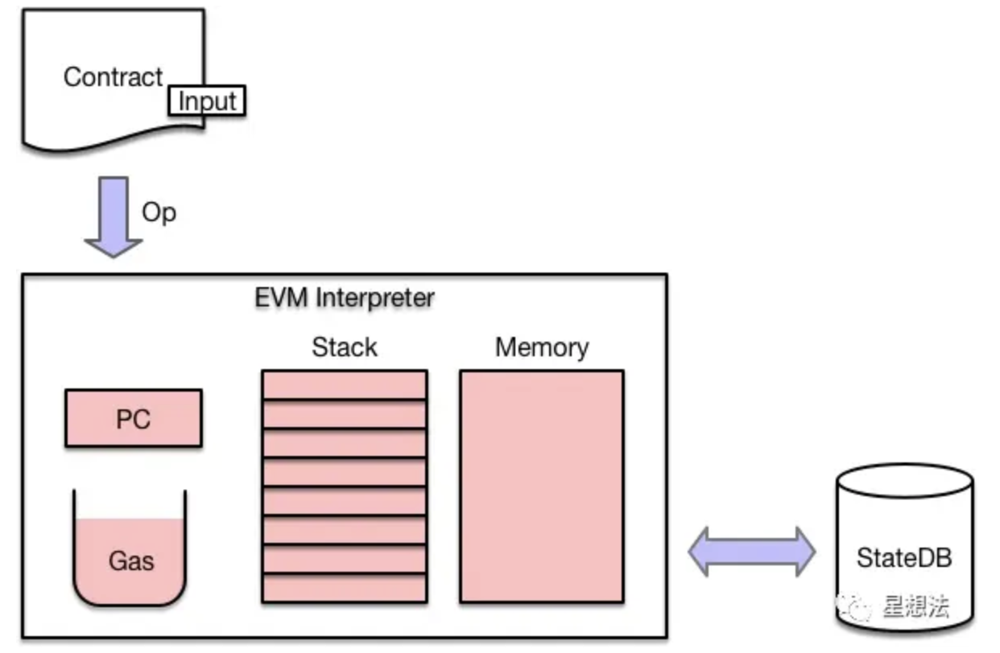

具体的执行过程如下：

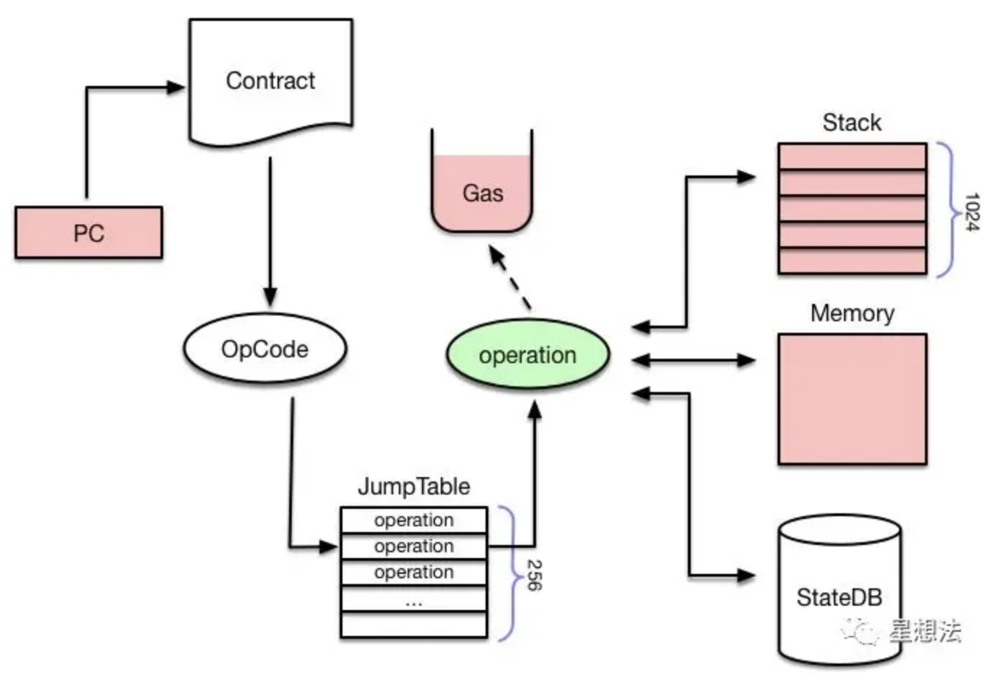

可以看到 JumpTable（这个表就可以看成是一个指令集的表格） 深度只有 256，EVM的每条指令称为一个OpCode，占用一个字节，所以指令集最多不超过256，[官网](https://ethervm.io/)。

下面是一个示例（PUSH1=0x60, MSTORE=0x52）：


首先PC会从合约代码中读取一个OpCode，然后从一个JumpTable中检索出对应的operation，也就是与其相关联的函数集合。接下来会计算该操作需要消耗的油费，如果油费耗光则执行失败，返回ErrOutOfGas错误。如果油费充足，则调用execute()执行该指令，根据指令类型的不同，会分别对Stack、Memory或者StateDB进行读写操作。


### 调用合约函数

EVM怎么知道交易想调用的是合约里的哪个函数呢？跟合约代码一起送到解释器里的还有一个Input，而这个Input数据是由交易提供的关于合约调用的信息。

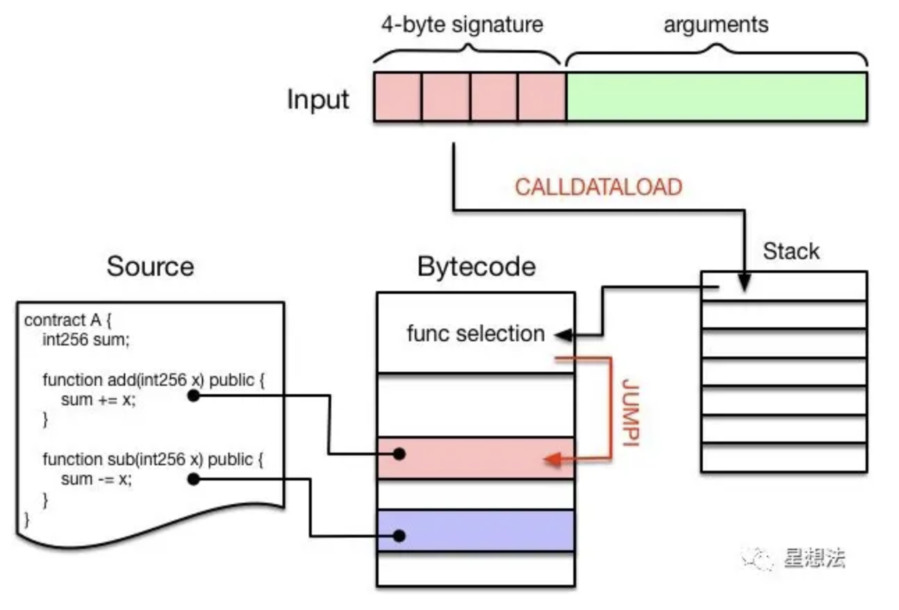

Input数据通常分为两个部分：

- 前面4个字节被称为“4-byte signature”，是某个函数签名的Keccak哈希值的前4个字节，作为该函数的唯一标识，也叫 Method ID。（可以在该网站[查询目前所有的函数签名](https://www.4byte.directory/)）
- 后面是调用该函数需要提供的参数，长度不定，每个参数都被编码为 32 字节长度。

举个例子：在部署完A合约后，调用add(1)对应的Input数据是

```undefined
0x87db03b70000000000000000000000000000000000000000000000000000000000000001
```

而在编译智能合约的时候，编译器会自动在生成的字节码的最前面增加一段函数选择逻辑：

首先通过`CALLDATALOAD`指令将“4-byte signature”压入堆栈中，然后依次跟该合约中包含的函数进行比对，如果匹配则调用JUMPI指令跳入该段代码继续执行。

他会有一个如下的数据结构来对应 MethodID 和方法：

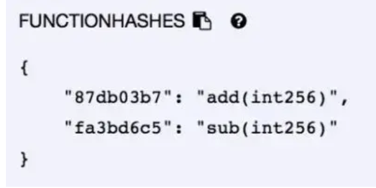

数据加载相关的指令，一共有4种：

- CALLDATALOAD：把输入数据加载到Stack中
- CALLDATACOPY：把输入数据加载到Memory中
- CODECOPY：把当前合约代码拷贝到Memory中
- EXTCODECOPY：把外部合约代码拷贝到Memory中

最后一个EXTCODECOPY不太常用，一般是为了审计第三方合约的字节码是否符合规范，消耗的gas一般也比较多。这些指令对应的操作如下图所示：

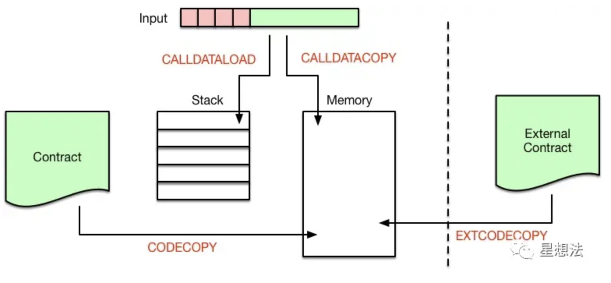


### 合约调用合约

在中大型的项目中，不可能在一个智能合约中实现所有的功能，而且这样也不利于分工合作。一般情况下，会把代码按功能划分到不同的库或者合约中，然后提供接口互相调用。

在`Solidity`中，如果只是为了代码复用，会把公共代码抽出来，部署到一个library中，后面就可以像调用C库、Java库一样使用了。但是library中不允许定义任何storage类型的变量，这就意味着library不能修改合约的状态。如果需要修改合约状态，需要部署一个新的合约，这就涉及到合约调用合约的情况。

合约内部调用另外一个合约，有4种调用方式：

- CALL
- CALLCODE
- DELEGATECALL
- STATICALL（这个暂时没用）

以下是 call 的工作图

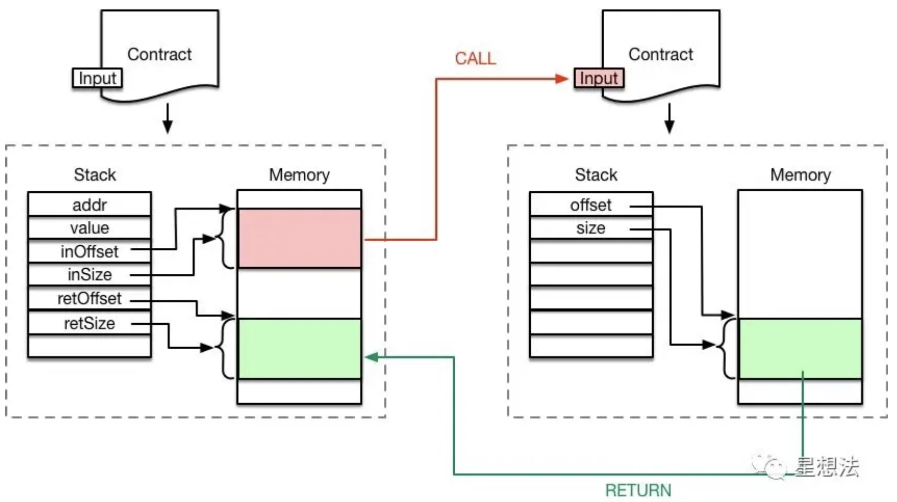

可以看到，调用者把调用参数存储在内存中，然后执行CALL指令。

CALL指令执行时会创建新的Contract对象，并以内存中的调用参数作为其Input。

解释器会为新合约的执行创建新的`Stack`和`Memory`，从而不会破环原合约的执行环境。

新合约执行完成后，通过RETURN指令把执行结果写入之前指定的内存地址，然后原合约继续向后执行。


#### CALL vs. CALLCODE

CALL和CALLCODE的区别在于：代码执行的上下文环境不同。

具体来说，CALL修改的是**被调用者**的storage，而CALLCODE修改的是**调用者**的storage。

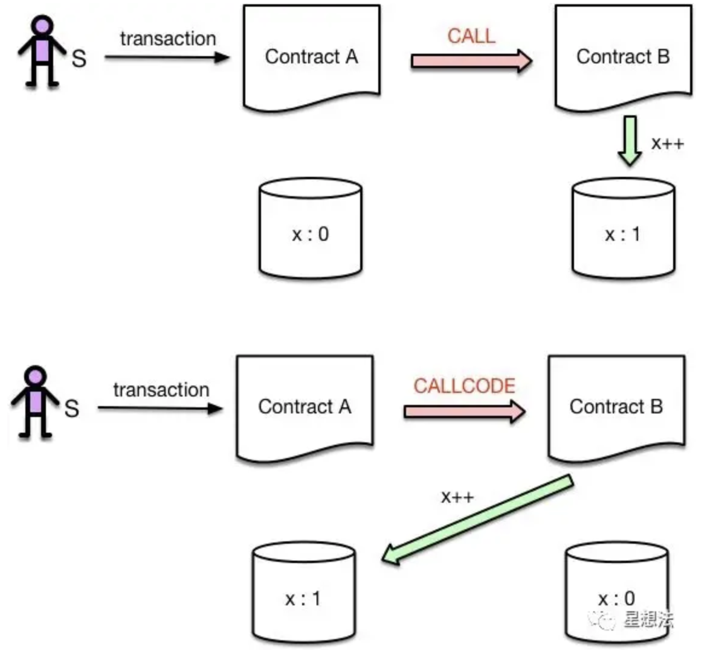

```solidity
pragma solidity ^0.4.25;

contract A {
  int public x;

  function inc_call(address _contractAddress) public {
      _contractAddress.call(bytes4(keccak256("inc()")));
  }
  function inc_callcode(address _contractAddress) public {
      _contractAddress.callcode(bytes4(keccak256("inc()")));
  }
}

contract B {
  int public x;

  function inc() public {
      x++;
  }
}
// 比如这个，inc_call改变的 B 的 x，inc_callcode改变的 A 的 x
```


#### CALLCODE vs. DELEGATECALL

实际上，可以认为DELEGATECALL是CALLCODE的一个bugfix版本，官方已经不建议使用CALLCODE了。

CALLCODE和DELEGATECALL的区别在于：`msg.sender`不同。

具体来说，DELEGATECALL会一直使用原始调用者的地址，而CALLCODE不会。

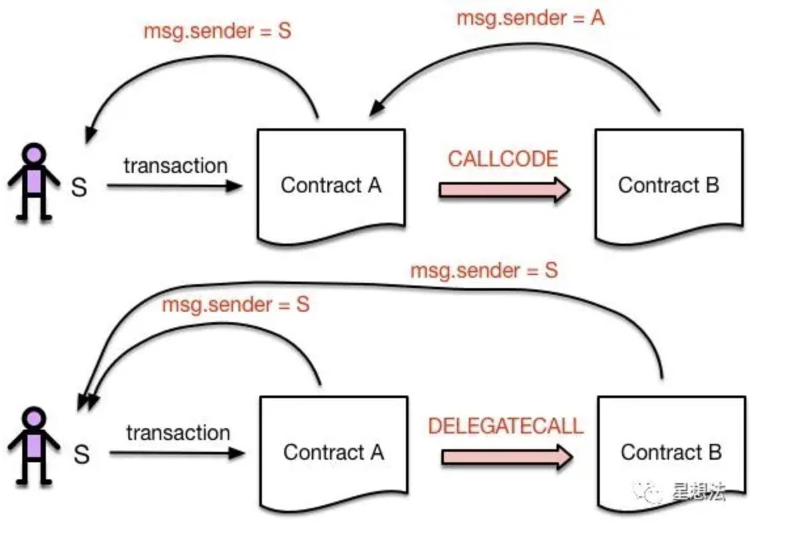

```go
pragma solidity ^0.4.25;

contract A {
  int public x;

  function inc_callcode(address _contractAddress) public {
      _contractAddress.callcode(bytes4(keccak256("inc()")));
  }
  function inc_delegatecall(address _contractAddress) public {
      _contractAddress.delegatecall(bytes4(keccak256("inc()")));
  }
}

contract B {
  int public x;

  event senderAddr(address);
  function inc() public {
      x++;
      emit senderAddr(msg.sender);
  }
}
// inc_callcode 的 sender 是 A，inc_delegatecall 的 sender 是 A 的调用者
```


### 创建合约

如果某一笔交易的to地址为nil，则表明该交易是用于创建智能合约的。

首先需要创建合约地址，采用下面的计算公式：`Keccak(RLP(call_addr, nonce))[12:]`。也就是说，对交易发起人的地址和nonce进行RLP编码，再算出Keccak哈希值，取后20个字节作为该合约的地址。

下一步就是根据合约地址创建对应的`stateObject`，然后存储交易中包含的合约代码。该合约的所有状态变化会存储在一个`storage trie`中，最终以`Key-Value`的形式存储到`StateDB`中。代码一经存储则无法改变，而`storage trie`中的内容则是可以通过调用合约进行修改的，比如通过`SSTORE`指令。

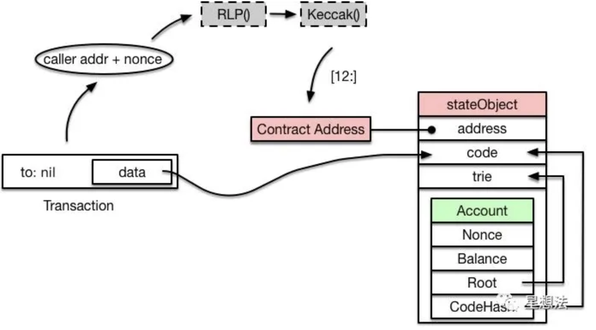
