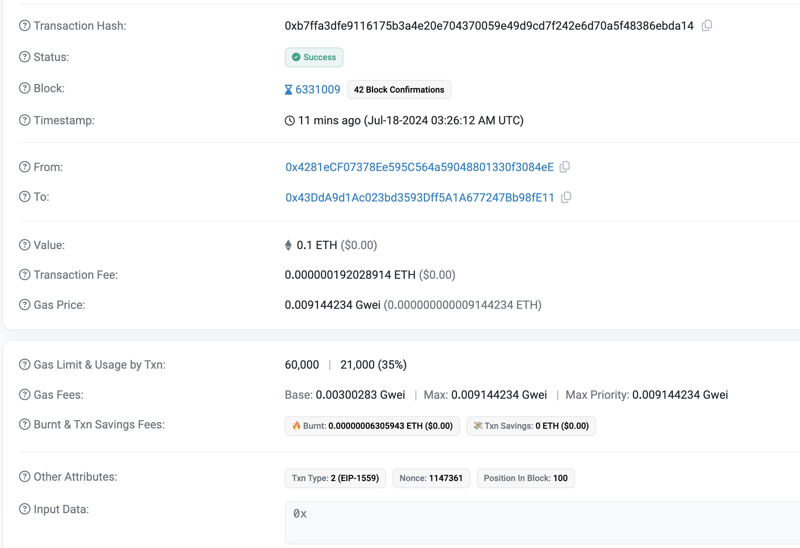
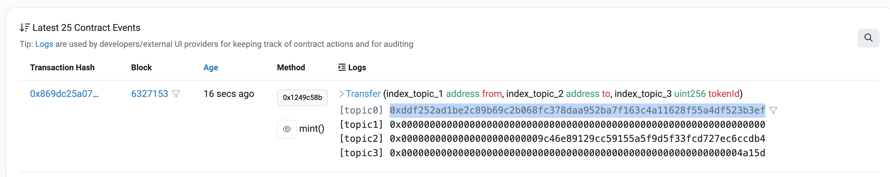
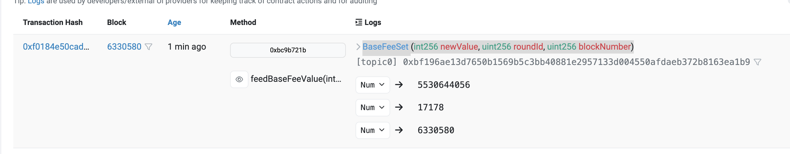

# Go Ehthereum编程

Go-ethereum，也被简称为Geth，是最流行的以太坊客户端（go 的官方以太坊实现）。因为它是用Go开发的，当使用Golang开发应用程序时，Geth提供了读写区块链的一切功能。


## geth 创建客户端

客户端是以太坊网络的入口。客户端需要广播交易和读取区块链数据。

用Go初始化以太坊客户端是和区块链交互所需的基本步骤。首先，导入go-etherem的`ethclient`包并通过调用接收区块链服务提供者URL的`Dial`来初始化它。

若没有现有以太坊客户端，可以连接到infura网关。Infura管理着一批安全，可靠，可扩展的以太坊[geth和parity]节点。

```go
client, err := ethclient.Dial("https://cloudflare-eth.com")
//client, err := ethclient.Dial("http://16.63.39.133:30303")
if err != nil {
	log.Fatal(err)
}
fmt.Println("Connected to Ethereum client")
// 获取最新区块号
header, err := client.HeaderByNumber(context.Background(), nil)
if err != nil {
    log.Fatalf("Failed to get latest block header: %v", err)
}
fmt.Println("Latest block number:", header.Number.String())
```

这里也可以 dial 任何一个本地或远程以太坊节点的 IP 和端口（也就是任何一个公开的以太坊全节点），但是需要确保节点已正确配置并启用了 HTTP 或 WebSocket 接口。可以选择运行自己的全节点或使用第三方服务，如Infura或Alchemy。


## 账户

以太坊上的账户要么是钱包地址要么是智能合约地址，是一个 160 位的字符串，转换为 16 进制就是 40 位的字符串，比如`0x9029A66890306B1811e66B968C35d2F13e8E38C6`。它们用于将ETH发送到另一个用户，并且还用于在需要和区块链交互时指一个智能合约。它们是唯一的，且是从私钥导出的。

要使用go-ethereum的账户地址，您必须先将它们转化为go-ethereum中的`common.Address`类型。

```go
account := common.HexToAddress("0x9029A66890306B1811e66B968C35d2F13e8E38C6")
fmt.Println("account address:")
fmt.Println(account.String())
fmt.Println(account.Hex())
fmt.Println(account.Bytes())
```

`type Address [20]byte` ：一个 address 其实就是 20 字节的 byte（160bit）。


### 获取账户余额

```go
// 获取最新区块的账户余额
balance, err := client.BalanceAt(context.Background(), account, nil)
if err != nil {
  log.Fatal(err)
  return
}

fmt.Println("most recently wei:", balance)

// 获取指定区块的账户余额
blockNumber := big.NewInt(20319544)
balance1, err := client.BalanceAt(context.Background(), account, blockNumber)
if err != nil {
  return
}
fmt.Println("block wei", blockNumber, balance1)

// 将以 wei 为单位的余额转换为 eth，也就是除 1^18
fBalance := new(big.Float)
fBalance.SetString(balance.String())
ethValue := new(big.Float).Quo(fBalance, big.NewFloat(math.Pow10(18)))
fmt.Println("eth value:", ethValue)

// 获取账户的待处理的余额
pendingBalanceAt, err := client.PendingBalanceAt(context.Background(), account)
if err != nil {
  return
}
fmt.Println("pending balance at (wei)", pendingBalanceAt)
```

待处理的账户余额（也称为潜在余额、预测余额或挂起余额）是指在某些交易正在进行、等待确认或尚未被包含在区块中时，账户的余额在未来的某个时间点可能会是多少。它考虑了已经提交但尚未被确认的交易。

**理解待处理余额**：其实就是真正还剩多少没有用作交易的。

**1. 已提交但未确认的交易**

当你提交一笔交易到以太坊网络，但交易还没有被矿工打包到区块中确认时，交易处于“待处理”状态。此时，交易的影响尚未反映在账户的当前余额中，但它会影响未来的余额。

**2. 示例场景**

假设你有一个账户余额为5 ETH，并提交了一笔发送3 ETH的交易。此时：

- **当前余额**：5 ETH（因为交易尚未确认）
- **待处理余额**：2 ETH（如果交易被确认后）


### 手动生成新钱包（账户）

```go
// 生成随机私钥
privateKey, err := crypto.GenerateKey()
if err != nil {
  log.Fatal(err)
}
fmt.Println("privateKey", privateKey)

// 使用FromECDSA方法将其转换为字节
keyBytes := crypto.FromECDSA(privateKey)
fmt.Println("keyBytes", keyBytes)

// 转换为十六进制字符串，然后我们在十六进制编码之后删除“0x”。
// ******这就是用于签署交易的私钥******
keyHexString := hexutil.Encode(keyBytes)[2:]
fmt.Println("keyHexString", keyHexString)

// 重新得到私钥，记住不需要 0x 前缀
fmt.Println(crypto.HexToECDSA(keyHexString))

// 公钥是从私钥派生的
publicKey := privateKey.Public()
fmt.Println("publicKey", publicKey)
publicKeyECDSA, ok := publicKey.(*ecdsa.PublicKey)
if !ok {
  log.Fatal("cannot assert type: publicKey is not of type *ecdsa.PublicKey")
}

// 将其转换为十六进制，我们剥离了0x和前2个字符04，它始终是EC前缀，不是必需的。
publicBytes := crypto.FromECDSAPub(publicKeyECDSA)
publicHexString := hexutil.Encode(publicBytes)[4:]
fmt.Println("publicHexString", publicHexString)

// 公共地址其实就是公钥的Keccak-256哈希，然后我们取最后40个字符（20个字节）并用“0x”作为前缀 一共 160 位
publicAddress := crypto.PubkeyToAddress(*publicKeyECDSA).Hex()
fmt.Println("publicAddress", publicAddress)

// 手动转换
hash := sha3.NewLegacyKeccak256()
hash.Write(publicBytes[1:])
publicAddressByHandler := hexutil.Encode(hash.Sum(nil)[12:])
fmt.Println("publicAddressByHandler", publicAddressByHandler)
```

这样，需要我们手动保存好公私钥。有`crypto.HexToECDSA()`方法帮助我们从一个十六进制字符串重新得到 privateKey。或者`crypto.ToECDSA()`从一个字节数组得到私钥。

```go
privateKey, err := crypto.HexToECDSA("fad9c8855b740a0b7ed4c221dbad0f33a83a49cad6b3fe8d5817ac83d38b6a19")
if err != nil {
  log.Fatal(err)
}
```


### keyStore密钥库

上面手动生成，转换，保存过于复杂了。于是就有了密钥库帮助我们生成公私钥，并保存到文件中，并提供了一些 api 帮助我们使用公私钥。

keystore是一个包含经过加密了的钱包私钥。go-ethereum中的keystore，每个文件只能包含一个钱包密钥对。调用`NewKeyStore`生成keystore，给它提供保存keystore的目录路径。然后，调用`NewAccount`方法创建新的钱包，并给它传入一个用于加密的口令。每次调用`NewAccount`，它将在磁盘上生成新的keystore文件。

```go
func createKs() {
    ks := keystore.NewKeyStore("./tmp", keystore.StandardScryptN, keystore.StandardScryptP)
    password := "secret"
    account, err := ks.NewAccount(password)
    if err != nil {
        log.Fatal(err)
    }

    fmt.Println(account.Address.Hex()) // 0x20F8D42FB0F667F2E53930fed426f225752453b3
}

func importKs() {
    file := "./tmp/UTC--2018-07-04T09-58-30.122808598Z--20f8d42fb0f667f2e53930fed426f225752453b3"
    ks := keystore.NewKeyStore("./tmp", keystore.StandardScryptN, keystore.StandardScryptP)
    jsonBytes, err := os.ReadFile(file)
    if err != nil {
      log.Fatal(err)
    }

    password := "secret"
  	// 第二个参数是用于加密私钥的口令。第三个参数是指定一个新的加密口令,他将生成新keystore文件，两个文件其实是一样的，所以需要删除一个
    account, err := ks.Import(jsonBytes, password, password)
    if err != nil {
        log.Fatal(err)
    }

    fmt.Println(account.Address.Hex()) // 0x20F8D42FB0F667F2E53930fed426f225752453b3

    if err := os.Remove(file); err != nil {
        log.Fatal(err)
    }
}
```

这样我们可以直接拿到 account，而不需要从私钥得到公钥，再从公钥进行 hash 然后截取得到地址

此外，如果需要使用私钥签名，他也提供了`ks.SignTx()`等api 进行签名，不需要我们得到具体的私钥进行签名，如`types.SignTx(tx, types.LatestSignerForChainID(chainId), privateKey)`。


### 地址验证，账户类型

```go
// 使用正则验证一个地址是否合法
re := regexp.MustCompile("^0x[0-9a-fA-F]{40}$")

fmt.Printf("is valid: %v\n", re.MatchString("0x323b5d4c32345ced77393b3530b1eed0f346429d"))

// 连接 Infura 第三方服务
client, err := ethclient.Dial("https://cloudflare-eth.com")
if err != nil {
  log.Fatal(err)
}
// 判断一个地址时都是智能合约地址 CA合约账户：若在该地址存储了字节码，该地址是智能合约
address := common.HexToAddress("0xe41d2489571d322189246dafa5ebde1f4699f498")
byteCode, err := client.CodeAt(context.Background(), address, nil) // nil is the latest block
if err != nil {
  log.Fatal(err)
}

isContract := len(byteCode) > 0

fmt.Printf("isContract: %v\n", isContract)
// 判断一个地址是否是账户地址 EOA以太坊外部账户
address1 := common.HexToAddress("0x8e215d06ea7ec1fdb4fc5fd21768f4b34ee92ef4")
byteCode1, err := client.CodeAt(context.Background(), address1, nil) // nil is the latest block
if err != nil {
  log.Fatal(err)
}

isContract1 := len(byteCode1) > 0

fmt.Printf("isContract1: %v\n", isContract1)
```

在以太坊中，账户拥有4个字段：{nonce,balance,codeHash,StorageRoot}。

一共分为2种账户：外部账户、合约账户。

外部账户，Externally Owned Accounts，简称EOA，它拥有私钥，其codeHash为空。

合约账户，Contact Account，简称CA，它没有私钥，其codeHash非空。


## 交易

### 查询区块

#### 区块头

```go
func test1(client *ethclient.Client) {
	header, err := client.HeaderByNumber(context.Background(), nil)
	if err != nil {
		log.Fatal(err)
	}
	fmt.Println(header.Number.String())
}
```

#### 整个区块

```go
// 获取指定区
blockNumber := big.NewInt(20317184)
block, err := client.BlockByNumber(context.Background(), blockNumber)
if err != nil {
  log.Fatal(err)
}
fmt.Println(block)
fmt.Println(block.Number().Uint64())
fmt.Println(block.Time())
fmt.Println(block.Difficulty().Uint64())
fmt.Println(block.Hash().Hex())
fmt.Println(block.Transactions().Len())
fmt.Println(block.GasLimit())
fmt.Println(block.GasUsed())
```


### 查询交易

> 已有块
>
> block.Transactions()

```go
// 获取交易数目
count, err := client.TransactionCount(context.Background(), block.Hash())
if err != nil {
  log.Fatal(err)
}
fmt.Println(count)
// 拿到块， 遍历块中所有交易
for _, tx := range block.Transactions() {
  fmt.Println("hash", tx.Hash().Hex())
  fmt.Println("value", tx.Value().String())
  fmt.Println("gas limit", tx.Gas())
  fmt.Println("gas price", tx.GasPrice().Uint64())
  fmt.Println("nonce", tx.Nonce())
  fmt.Println("data", tx.Data())
  fmt.Println("to", tx.To().Hex())

  // 发送方地址需要另外获取, 新版 api 如下：
  //chainId, err := client.NetworkID(context.Background())
  //if err != nil {
  //	log.Fatal(err)
  //}
  if from, err := types.Sender(types.LatestSignerForChainID(tx.ChainId()), tx); err != nil {
    log.Fatal(err)
  } else {
    fmt.Println("from", from.Hex())
  }

  // 获取收据
  receipt, err := client.TransactionReceipt(context.Background(), tx.Hash())
  if err != nil {
    log.Fatal(err)
  }
  fmt.Println(receipt.Status)
  fmt.Println(receipt.Logs)
}
```

> 直接通过 client 获取，只需要传入区块地址即可
>
> client.TransactionInBlock(context.Background(), blockHash, idx)

```go
blockHash := common.HexToHash("0x363e7fb967ebb8547b15d8ece12ab50def79e6e71fbfb41e2236699d672c4b10")
count, err := client.TransactionCount(context.Background(), blockHash)
if err != nil {
  log.Fatal(err)
}
fmt.Println(count)
count = 1
for idx := uint(0); idx < count; idx++ {
  tx, err := client.TransactionInBlock(context.Background(), blockHash, idx)
  if err != nil {
    log.Fatal(err)
  }
  fmt.Println(tx.Hash().Hex())
}

txHash := common.HexToHash("0x30427eadc4428fde98c664e5d127112d4cb80b587079445b2f9bb9aa30978321")
tx, isPending, err := client.TransactionByHash(context.Background(), txHash)
if err != nil {
  log.Fatal(err)
}
fmt.Println(tx.Hash().Hex())
fmt.Println(isPending)
```


### 查询交易收据

是用水龙头（[免费水龙头](https://faucets.chain.link/)）在自己的测试网络账户上拿到了0.1个以太币，现在查询余额和该交易的收据信息

```go
client, _ := ethclient.Dial("https://sepolia.infura.io/v3/d481f2467f41493c9d699a59f6e03213")

address := common.HexToAddress("0x43DdA9d1Ac023bd3593Dff5A1A677247Bb98fE11")

balanceAt, err := client.BalanceAt(context.Background(), address, nil)
if err != nil {
  return
}

fmt.Println("balanceAt:", balanceAt)

hash := common.HexToHash("0xb7ffa3dfe9116175b3a4e20e704370059e49d9cd7f242e6d70a5f48386ebda14")

receipt, err := client.TransactionReceipt(context.Background(), hash)
if err != nil {
  return
}

fmt.Println("receipt:", receipt)
/*
receipt: &{2 [] 1 12536552 [0 0 0 0 0 0 0 0 0 0 0 0 0 0 0 0 0 0 0 0 0 0 0 0 0 0 0 0 0 0 0 0 0 0 0 0 0 0 0 0 0 0 0 0 0 0 0 0 0 0 0 0 0 0 0 0 0 0 0 0 0 0 0 0 0 0 0 0 0 0 0 0 0 0 0 0 0 0 0 0 0 0 0 0 0 0 0 0 0 0 0 0 0 0 0 0 0 0 0 0 0 0 0 0 0 0 0 0 0 0 0 0 0 0 0 0 0 0 0 0 0 0 0 0 0 0 0 0 0 0 0 0 0 0 0 0 0 0 0 0 0 0 0 0 0 0 0 0 0 0 0 0 0 0 0 0 0 0 0 0 0 0 0 0 0 0 0 0 0 0 0 0 0 0 0 0 0 0 0 0 0 0 0 0 0 0 0 0 0 0 0 0 0 0 0 0 0 0 0 0 0 0 0 0 0 0 0 0 0 0 0 0 0 0 0 0 0 0 0 0 0 0 0 0 0 0 0 0 0 0 0 0 0 0 0 0 0 0 0 0 0 0 0 0 0 0 0 0 0 0 0 0 0 0 0 0] [] 0xb7ffa3dfe9116175b3a4e20e704370059e49d9cd7f242e6d70a5f48386ebda14 0x0000000000000000000000000000000000000000 21000 9144234 0 <nil> 0xaa9438ee11b6f4ef3e7c925e70140c7be3788df4a93751f56ad7344e446def00 6331009 100}
有挺多数据是交易中的信息，还有一些特有的必入status，type，logs等
*/
```




### ETH 转账

```go
// 得到私钥
privateKey, err := crypto.HexToECDSA("fad9c8855b740a0b7ed4c221dbad0f33a83a49cad6b3fe8d5817ac83d38b6a19")
if err != nil {
    log.Fatal(err)
}
// 手动从私钥得到公钥，然后计算 hash 得到地址
publicKey := privateKey.Public()
publicKeyECDSA, ok := publicKey.(*ecdsa.PublicKey)
if !ok {
    log.Fatal("cannot assert type: publicKey is not of type *ecdsa.PublicKey")
}

fromAddress := crypto.PubkeyToAddress(*publicKeyECDSA)
// 自动获取当前的 nouce，也就是该用户当前交易数 + 1
nonce, err := client.PendingNonceAt(context.Background(), fromAddress)
if err != nil {
    log.Fatal(err)
}
// 构造 transaction 交易对象
value := big.NewInt(1000000000000000000) // in wei (1 eth)
gasLimit := uint64(21000)                // in units
// 获取当前系统推荐的 gasPrice
gasPrice, err := client.SuggestGasPrice(context.Background())
if err != nil {
    log.Fatal(err)
}
toAddress := common.HexToAddress("0x4592d8f8d7b001e72cb26a73e4fa1806a51ac79d")

// New transaction 新的 api
tx := types.NewTx(&types.LegacyTx{
  Nonce:    nonce,
  GasPrice: gasPrice,
  Gas:      gasLimit,
  To:       &tokenAddress,
  Value:    value,
  Data:     nil,
})

// 使用发件人的私钥对 tx 进行签名
chainId, err := client.NetworkID(context.Background())
if err != nil {
  log.Fatal(err)
}
signedTx, err := types.SignTx(tx, types.LatestSignerForChainID(chainId), privateKey)
if err != nil {
  log.Fatal(err)
}

err = client.SendTransaction(context.Background(), signedTx)
if err != nil {
    log.Fatal(err)
}

fmt.Printf("tx sent: %s", signedTx.Hash().Hex())
```


### 代币转账

和 ETH 不同的地方：

- 交易的 to 方变成了调用的合约地址
- gasLimit 需要考虑智能合约执行的 gas 消耗，可以通过调用 `client.EstimateGas` 得到估算上限
- 需要构建 data 参数

```go
privateKey, err := crypto.HexToECDSA("fad9c8855b740a0b7ed4c221dbad0f33a83a49cad6b3fe8d5817ac83d38b6a19")
if err != nil {
  log.Fatal(err)
}

publicKey := privateKey.Public()
publicKeyECDSA, ok := publicKey.(*ecdsa.PublicKey)
if !ok {
  log.Fatal("error casting public key to ECDSA")
}
fromAddress := crypto.PubkeyToAddress(*publicKeyECDSA)
nonce, err := client.PendingNonceAt(context.Background(), fromAddress)
if err != nil {
  log.Fatal(err)
}
value := big.NewInt(0) // 代币传输不需要传输ETH，因此将交易“值”设置为“0”
// 硬编码 gasPrice 不好，时常会有波动
// gasPrice := big.NewInt(int64(math.Pow(3, 10)))
gasPrice, err := client.SuggestGasPrice(context.Background())
if err != nil {
  log.Fatal(err)
}
// 合约地址
tokenAddress := common.HexToAddress("0x28b149020d2152179873ec60bed6bf7cd705775d")
// 以上的操作都和 ETH 转账类似

// 下面需要构建交易的 data 部分。
// 函数选择器 函数名的keccak-256哈希来检索方法ID
transferFnSignature := []byte("transfer(address,uint256")
hash := sha3.NewLegacyKeccak256()
hash.Write(transferFnSignature)
methodID := hash.Sum(nil)[:4] // 只取前四个字节即可
fmt.Println("methodID", hexutil.Encode(methodID))
// 然后是两个参数
// 两个数据都需要构建成 16 进制的 32 字节大小，不够的用 0 填充
// 代币接收地址
toAddress := common.HexToAddress("0x4592d8f8d7b001e72cb26a73e4fa1806a51ac79d")
paddedAddress := common.LeftPadBytes(tokenAddress.Bytes(), 32)
fmt.Println("paddedAddress", hexutil.Encode(paddedAddress))
// 转账金额
amount := new(big.Int)
amount.SetString("1000000000000000000000", 10)
paddedAmount := common.LeftPadBytes(amount.Bytes(), 32)
fmt.Println("paddedAmount", hexutil.Encode(paddedAmount))
// 构建 data 的字节切片对象
var data []byte
data = append(data, methodID...)
data = append(data, paddedAddress...)
data = append(data, paddedAmount...)
// 燃气上限制将取决于交易数据的大小和智能合约必须执行的计算步骤。 幸运的是，客户端提供了EstimateGas方法，它可以为我们估算所需的燃气量。 这个函数从ethereum包中获取CallMsg结构，我们在其中指定数据和地址。 它将返回我们估算的完成交易所需的估计燃气上限。
gasLimit, err := client.EstimateGas(context.Background(), ethereum.CallMsg{
  To:   &toAddress,
  Data: data,
})
if err != nil {
  log.Fatal(err)
}
fmt.Println("gasLimit", gasLimit)

// New transaction 新的 api
tx := types.NewTx(&types.LegacyTx{
  Nonce:    nonce,
  GasPrice: gasPrice,
  Gas:      gasLimit,
  To:       &tokenAddress,
  Value:    value,
  Data:     data,
})

// 使用发件人的私钥对 tx 进行签名
chainId, err := client.NetworkID(context.Background())
if err != nil {
  log.Fatal(err)
}
// 签名 hash
signedTx, err := types.SignTx(tx, types.LatestSignerForChainID(chainId), privateKey)
if err != nil {
  log.Fatal(err)
}
fmt.Printf("%v", signedTx)
// 广播交易
err = client.SendTransaction(context.Background(), signedTx)
if err != nil {
  log.Fatal(err)
}
fmt.Println("signedTx send", signedTx.Hash().Hex())
```


### 监听新区块

这里选择的服务提供商是[infura](https://app.infura.io/key/d481f2467f41493c9d699a59f6e03213/active-endpoints)

主网的一直连不上，测试网的可以

注意使用的是 wss 也就是 websocket 服务

```go
func main() {
    // 订阅新块的产生，需要有以太坊服务提供商提供接口
    client, err := ethclient.Dial("wss://sepolia.infura.io/ws/v3/your-api-key")
    if err != nil {
       log.Fatal(err)
    }

    headers := make(chan *types.Header)

    sub, err := client.SubscribeNewHead(context.Background(), headers)
    if err != nil {
       log.Fatal(err)
    }
    for {
       select {
       case err := <-sub.Err():
          log.Fatal(err)
       case header := <-headers:
          fmt.Println(header.Hash().Hex())
          block, err := client.BlockByHash(context.Background(), header.Hash())
          if err != nil {
             log.Fatal(err)
          }
          fmt.Println(block.Hash().Hex())
          fmt.Println(block.Number().Uint64())
          fmt.Println(block.Transactions().Len())
       }
    }
}
```


### 裸交易Raw Transaction

这是在告诉我们怎么从一个已签名的 transaction 得到他的 rlp 编码字符串，然后再怎么反序列化为一个 transaction 对象。

```go
// 假设我们已经得到了一个已签名的 transaction
// 交易的原始字节数据，新 api 调用 EncodeIndex，即可将其序列化为 RLP 编码的字节数据
ts := types.Transactions{signedTx}
b := new(bytes.Buffer)
ts.EncodeIndex(0, b)
rawTxBytes := b.Bytes()
// 然后可以反序列化为交易对象
tx = new(types.Transaction)
err = rlp.DecodeBytes(rawTxBytes, tx)
if err != nil {
  return
}
fmt.Println(tx.Hash().Hex()) // 这样打印的数据和 signedTx 一样
// 字节数组也可以转换为 16 进制字符串
rawTxHex := hexutil.Encode(rawTxBytes)
fmt.Println("rawTxHex", rawTxHex)
// or hex.EncodeToString()
```

之后，同样可以使用 `client.SendTransaction(context.Background(), tx)` 广播交易。


## 智能合约

### 编译和 ABI

与智能合约交互，我们要先生成相应智能合约的应用二进制接口ABI(application binary interface)，并把ABI编译成我们可以在Go应用中调用的格式（也就是生成合约对象的 go 文件，可以根据这个生成合约实例 instance）。

安装 solidity 编译器 sloc

```bash
brew update # 可选，不知道为啥，执行不成功
brew tap ethereum/ethereum
brew install solidity
```

安装`abigen`工具，来从solidity智能合约生成ABI。假设已经在计算机上设置了Go，只需运行以下命令即可安装`abigen`工具。

```bash
go get -u github.com/ethereum/go-ethereum # 安装好 geth 库
cd $GOPATH/pkg/mod/github.com/ethereum/go-ethereum@v1.14.7 # 这里不一定是这个地址，需要换成自己的
make
make devtools
```

然后生成 ABI 文件和 bin 文件

```bash
solc --abi --bin -o ./build Store.sol # 输出到 build 目录
```

不知道为啥他自动生成的abi 文件和 bin 文件叫 HelloWorld，抽象了，==还没找到怎么重命名==

然后根据这两个文件，生成 go 文件

```bash
abigen --bin=./build/HelloWorld.bin --abi=./build/HelloWorld.abi --pkg=store --out=store.go  
```

新文件将包含我们可以用来与Go应用程序中的智能合约进行交互的所有可用方法，包括deploy方法。


### 部署智能合约

部署智能合约需要有账号，并且账号上还要有以太币才行

```go
client, err := ethclient.Dial("https://cloudflare-eth.com")
if err != nil {
  log.Fatal(err)
}
// 根据私钥得到地址
privateKey, err := crypto.HexToECDSA("fad9c8855b740a0b7ed4c221dbad0f33a83a49cad6b3fe8d5817ac83d38b6a19")
if err != nil {
  log.Fatal(err)
}
publicKey := privateKey.Public()
publicKeyECDSA, ok := publicKey.(*ecdsa.PublicKey)
if !ok {
  log.Fatal("cannot assert type: publicKey is not of type *ecdsa.PublicKey")
}
fromAddress := crypto.PubkeyToAddress(*publicKeyECDSA)

nonce, err := client.PendingNonceAt(context.Background(), fromAddress)
if err != nil {
  log.Fatal(err)
}
gasPrice, err := client.SuggestGasPrice(context.Background())
if err != nil {
  log.Fatal(err)
}
chainId, err := client.NetworkID(context.Background())
if err != nil {
  log.Fatal(err)
}
// 创建一个有配置密匙的交易发送器(tansactor)
auth, _ := bind.NewKeyedTransactorWithChainID(privateKey, chainId)
auth.Nonce = big.NewInt(int64(nonce))
auth.Value = big.NewInt(0)     // in wei
auth.GasLimit = uint64(300000) // in units
auth.GasPrice = gasPrice

input := "1.0" // 合约的初始数据 
// instance 是生成的合约实例 Deployxxx,后面生成合约 go 文件时指定的名字
address, tx, instance, err := store.DeployStore(auth, client, input)
if err != nil {
  log.Fatal(err)
}

fmt.Println(address.Hex())   // 生成的智能合约的地址
fmt.Println(tx.Hash().Hex()) // 生成的交易

_ = instance
```


### 加载智能合约

```go
address := common.HexToAddress("合约地址") // 0x1111...
// Newxxx,后面生成合约 go 文件时指定的名字
instance, err := store.NewStore(address, client)
if err != nil {
  log.Fatal(err)
}
```

实际上，我们只需要有 abi 和 bin 文件，即可生成 go 文件，并从以太坊得到 instance（可以从以太坊上找一个智能合约（比如[这个](https://etherscan.io/address/0x1111111254eeb25477b68fb85ed929f73a960582#code)），然后赋值他的abi 文件（Contract ABI字段，可以认为是接口说明文档）和 bin 文件（Contract Creation Code字段，这个是执行指令的编码）内容即可）

```go
client, err := ethclient.Dial("https://cloudflare-eth.com")
if err != nil {
    log.Fatal(err)
}

address := common.HexToAddress("0x1111111254EEB25477B68fb85Ed929f73A960582")

balanceAt, err := client.BalanceAt(context.Background(), address, nil)
if err != nil {
    return
}
fmt.Println(balanceAt)
instance, err := a.NewA(address, client)
if err != nil {
    log.Fatal(err)
}

fmt.Println(instance)
fmt.Println(instance.ACaller)
/*
输出如下：确实可以生成实例，并拿到合约上的内容
1
&{{0x14000358a08} {0x14000358a08} {0x14000358a08}}
{0x14000358a08}
*/
```


### 写智能合约

上面我们可以读取合约的一些公共值，也就是不需要私钥签名就能读的值，如果要对合约进行写操作（调用智能合约做事情），我们就需要用到私钥了

```go
auth, _ := bind.NewKeyedTransactorWithChainID(privateKey, chainId)
auth.Nonce = big.NewInt(int64(nonce))
auth.Value = big.NewInt(0)     // in wei
auth.GasLimit = uint64(300000) // in units
auth.GasPrice = gasPrice

message, err := instance.Destroy(nil)
if err != nil {
  log.Fatal(err)
}
// 生成的 go 源码如下
// Destroy is a paid mutator transaction binding the contract method 0x83197ef0.
//
// Solidity: function destroy() returns()
func (_A *ATransactor) Destroy(opts *bind.TransactOpts) (*types.Transaction, error) {
	return _A.contract.Transact(opts, "destroy")
}
```

这些合约的方法第一个参数都是需要传递一个`*TransactOpts`对象，TransactOpts is the collection of authorization data required to create a valid Ethereum transaction.。

```go
type TransactOpts struct {
    From      common.Address
    Nonce     *big.Int
    Signer    SignerFn
    Value     *big.Int
    GasPrice  *big.Int
    GasFeeCap *big.Int
    GasTipCap *big.Int
    GasLimit  uint64
    Context   context.Context
    NoSend    bool
}
```

**这实际上就是发生了一个智能合约调用的交易。调用的这些函数在幕后将使用它的参数对此函数调用进行编码，将其设置为事务的`data`属性，并使用私钥对其进行签名。 结果将是一个已签名的事务对象。然后叫交易广播出去。**


### 读智能合约二进制码

```go
bytecode, err := client.CodeAt(context.Background(), contractAddress, nil) // nil is latest block
if err != nil {
  log.Fatal(err)
}
fmt.Println(hex.EncodeToString(bytecode))
```

打印的结果将和以太坊浏览器etherscan上的 Deployed Bytecode 字段相同，只不过没有 0x 前缀。

**这个是对代码本身进行了编码**


## 事件日志

事件有方法执行时调用 emit 产生。如

```solidity
contract Example {
    // 事件定义中包含两个 indexed 参数
    event Transfer(address indexed from, address indexed to, uint256 value);
    function transfer(address _to, uint256 _value) public {
        // 一些转账逻辑
        // ...
        // 发布日志事件
        emit Transfer(msg.sender, _to, _value);
    }
}
```

**智能合约具有在执行期间“发出”事件的能力**。 事件在以太坊中也称为“日志”。 事件的输出存储在日志部分下的事务处理中。 事件已经在以太坊智能合约中被广泛使用，以便在发生相对重要的动作时记录，特别是在代币合约（即ERC-20）中，以指示代币转账已经发生。 这些部分将引导您完成从区块链中读取事件以及订阅事件的过程，以便交易事务被矿工打包入块的时候及时收到通知。


### 监听事件日志

```go
client, err := ethclient.Dial("wss://sepolia.infura.io/ws/v3/d481f2467f41493c9d699a59f6e03213")
if err != nil {
    log.Fatal(err)
}

contractAddress := common.HexToAddress("0x2a0f1C1cE263202f629bF41FA7Caa3D5F8FD52C4")
// 创建筛选查询
query := ethereum.FilterQuery{
    Addresses: []common.Address{contractAddress},
}

logs := make(chan types.Log)
sub, err := client.SubscribeFilterLogs(context.Background(), query, logs)
if err != nil {
    log.Fatal(err)
}

for {
    select {
    case err := <-sub.Err():
       log.Fatal(err)
    case vLog := <-logs:
       fmt.Printf("logs: %v\n", vLog)
    }
}
```

这样好像不可以在设置多余的筛选条件，试了一下没成功。（傻逼了，这是订阅事件，他会传过来订阅之后的新事件，这样增加新条件肯定没用）


### 读取事件日志

智能合约可以可选地释放“事件”，其作为交易收据的一部分存储日志。通过构建过滤查询FilterQuery即可

可选地筛选条件如下：

```go
type FilterQuery struct {
    BlockHash *common.Hash
    FromBlock *big.Int
    ToBlock   *big.Int
    Addresses []common.Address
    Topics    [][]common.Hash
}
```

示例代码如下：

```go
client, err := ethclient.Dial("wss://sepolia.infura.io/ws/v3/d481f2467f41493c9d699a59f6e03213")
if err != nil {
    log.Fatal(err)
}

contractAddress := common.HexToAddress("0x2a0f1C1cE263202f629bF41FA7Caa3D5F8FD52C4")
query := ethereum.FilterQuery{
    FromBlock: big.NewInt(6154872),
    ToBlock:   big.NewInt(6154880),
    //BlockHash: (*common.Hash)(common.Hex2Bytes("8e291243080ce85fe9e93d89935021eb116a13c0e902bbcb7f99a87f13a2f07d")),
    Addresses: []common.Address{contractAddress},
}
// 接收我们的查询并将返回所有的匹配事件日志,返回的所有日志将是ABI编码,需要解码
logs, err := client.FilterLogs(context.Background(), query)
if err != nil {
    log.Fatal(err)
}
// 新 api，拿到 contractAbi 对象
contractAbi, err := a.AMetaData.GetAbi()
if err != nil {
    log.Fatal(err)
}

for _, vLog := range logs {
    //fmt.Println(vLog)
    event, err := contractAbi.Unpack("Transfer", vLog.Data) // mint没有非 indexed 参数，所以解析出来为空
    if err != nil {
       log.Fatal(err)
    }

    fmt.Println(event)
}
```

此外，日志结构体包含附加信息，例如，区块摘要，区块号和交易摘要。

```go
fmt.Println(vLog.BlockHash.Hex())
fmt.Println(vLog.BlockNumber)
fmt.Println(vLog.TxHash.Hex())
```

若solidity事件包含`indexed`事件类型比如`event Transfer(address indexed from, address indexed to, uint256 indexed tokenId);包含了 indexed关键字，所有这些数据都成了 topics，而不是数据属性`，那么它们将成为*主题*而不是日志的数据属性的一部分。在solidity中最多只能有4个主题，但只有3个可索引的事件类型。第一个主题总是事件的签名。

```go
for _, vLog := range logs {
  fmt.Println("------")
  //fmt.Println(vLog)
  fmt.Println(vLog.BlockHash.Hex())
  fmt.Println(vLog.BlockNumber)
  fmt.Println(vLog.TxHash.Hex())

  event, err := contractAbi.Unpack("Transfer", vLog.Data) 
  if err != nil {
    log.Fatal(err)
  }
  fmt.Println(event) // 为空切片
  // 拿到 topic
  var topics [4]string
  for i := range vLog.Topics {
    topics[i] = vLog.Topics[i].Hex() // 有值
  }

  fmt.Println(topics[0])
}
eventSignature := []byte("Transfer(address,address,uint256)")
hash := crypto.Keccak256Hash(eventSignature)
fmt.Println(hash.Hex())
// 这个值要和 topics[0] 一样
```

可以看到展示的数据和我们刚刚的分析是相匹配的，包含四个 topics




比如换一个存在非 indexed 参数的[合约](https://sepolia.etherscan.io/address/0x4eb6fc083d36d1986fbd75960c9796e019faf9b1)，复制他的 abi 文件和 bin 文件内容（如果只是单纯拿日志，是不需要 bin 文件的），然后 abigen 得到 go 文件，执行下面代码：

```go
for _, vLog := range logs {
  fmt.Println("------")
  //fmt.Println(vLog)
  fmt.Println(vLog.BlockHash.Hex())
  fmt.Println(vLog.BlockNumber)
  fmt.Println(vLog.TxHash.Hex())

  event, err := contractAbi.Unpack("BaseFeeSet", vLog.Data)
  if err != nil {
    log.Fatal(err)
  }
  fmt.Println(event) // 输出 [5530644056 17178 6330580]

  var topics [4]string
  for i := range vLog.Topics {
    topics[i] = vLog.Topics[i].Hex() // 这里是没有值的
  }

  fmt.Println(topics[0]) // 输出0xbf196ae13d7650b1569b5c3bb40881e2957133d004550afdaeb372b8163ea1b9
}
eventSignature := []byte("BaseFeeSet(int256,uint256,uint256)")
hash := crypto.Keccak256Hash(eventSignature)
fmt.Println(hash.Hex()) // 输出0xbf196ae13d7650b1569b5c3bb40881e2957133d004550afdaeb372b8163ea1b9
```



以上的输出都是对的上的。


## 签名

数字签名允许不可否认性，因为这意味着签署消息的人必须拥有私钥，来证明消息是真实的。 任何人都可以验证消息的真实性，只要它们具有原始数据的散列和签名者的公钥即可。

### 生成签名

用于生成签名的组件是：签名者私钥，以及将要签名的数据的哈希。 只要输出为32字节，就可以使用任何哈希算法。 以太坊常用Keccak-256作为哈希算法

```go
func sign() {
	privateKey, err := crypto.HexToECDSA("fad9c8855b740a0b7ed4c221dbad0f33a83a49cad6b3fe8d5817ac83d38b6a19")
	if err != nil {
		log.Fatal(err)
	}

	fmt.Println("privateKey", privateKey)

	data := []byte("hello")
	hash := common.Hash(crypto.Keccak256(data)) // 类转转换
	hashedData := crypto.Keccak256Hash(data) // 直接帮我们转换了

	fmt.Println(hash.Hex()) // 0x1c8aff950685c2ed4bc3174f3472287b56d9517b9c948127319a09a7a36deac8
	fmt.Println(hashedData.Hex()) // 0x1c8aff950685c2ed4bc3174f3472287b56d9517b9c948127319a09a7a36deac8

	signature, err := crypto.Sign(hash.Bytes(), privateKey) // hash 后的数据的字节
	if err != nil {
		log.Fatal(err)
	}

	fmt.Println("signature", hex.EncodeToString(signature)) // 没有 0x 前缀
	fmt.Println("signature", hexutil.Encode(signature))     // 有 0x 前缀
}
```

注意交易的签名调用的是`types.SignTx`，简单的对数据签名是调用的`crypto.Sign`。实际上`types.SignTx`底层也是调用`crypto.Sign`对数据进行签名，只不过他需要重新生成一个交易对象，给他里面的`r, s, v`赋值

```go
func SignTx(tx *Transaction, s Signer, prv *ecdsa.PrivateKey) (*Transaction, error) {
	h := s.Hash(tx)
	sig, err := crypto.Sign(h[:], prv)
	if err != nil {
		return nil, err
	}
	return tx.WithSignature(s, sig)
}
func (tx *Transaction) WithSignature(signer Signer, sig []byte) (*Transaction, error) {
	r, s, v, err := signer.SignatureValues(tx, sig)
	if err != nil {
		return nil, err
	}
	if r == nil || s == nil || v == nil {
		return nil, fmt.Errorf("%w: r: %s, s: %s, v: %s", ErrInvalidSig, r, s, v)
	}
	cpy := tx.inner.copy()
	cpy.setSignatureValues(signer.ChainID(), v, r, s)
	return &Transaction{inner: cpy, time: tx.time}, nil
}
```

### 验证签名

- 使用数据编码后的 hash 的字节数据和签名后的字节数据可以恢复出公钥
- 然后使用私钥得到公钥，对比公钥是否相等就行

```go
func verify() {
    privateKey, err := crypto.HexToECDSA("fad9c8855b740a0b7ed4c221dbad0f33a83a49cad6b3fe8d5817ac83d38b6a19")
    if err != nil {
       log.Fatal(err)
    }
    // 得到公钥
    publicKey := privateKey.Public().(*ecdsa.PublicKey)
    publicKeyBytes := crypto.FromECDSAPub(publicKey)
    // 数据
    data := []byte("hello")
    hash := common.Hash(crypto.Keccak256(data))
    // 签名后的数据
    // The produced signature is in the [R || S || V] format where V is 0 or 1. 包含三个数据
    signature, err := crypto.Sign(hash.Bytes(), privateKey)
    // 恢复公钥
    // 直接返回 bytes
    recoverPublicKeyBytes, err := crypto.Ecrecover(hash.Bytes(), signature)
    if err != nil {
       return
    }
    isVerified := bytes.Equal(publicKeyBytes, recoverPublicKeyBytes)
    fmt.Println("isVerified", isVerified)

    // 返回 *ecdsa.PublicKey
    recoverPublicKey, err := crypto.SigToPub(hash.Bytes(), signature)
    if err != nil {
       return
    }
    recoverPublicKeyBytes = crypto.FromECDSAPub(recoverPublicKey)
    isVerified = bytes.Equal(publicKeyBytes, recoverPublicKeyBytes)
    fmt.Println("isVerified", isVerified)

    // 直接验证
    // 删除 signature 的最后一个字节，因为它是ECDSA恢复ID，不能包含它
    signatureWithoutRecoverID := signature[:len(signature)-1]
    // The signature should have the 64 byte [R || S] format.
    // 这也就是为什么需要剔除最后一个字节的原因，最后一个字节是 v，是 0 或者 1.
    isVerified = crypto.VerifySignature(publicKeyBytes, hash.Bytes(), signatureWithoutRecoverID)
    fmt.Println("isVerified", isVerified)
}
```
