# Go 分布式系统

Go语言号称是互联网时代的C语言。现在的互联网系统已经不是以前的一个主机搞定一切的时代，互联网时代的后台服务由大量的分布式系统构成，任何单一后台服务器节点的故障并不会导致整个系统的停机。同时以阿里云、腾讯云为代表的云厂商崛起标志着云时代的到来，在云时代分布式编程将成为一个基本技能。而基于Go语言构建的Docker、K8s等系统推动了云时代的提前到来。


## 分布式id生成器

有时需要能够生成类似MySQL自增ID这样不断增大，同时又不会重复的id。以支持业务中的高并发场景。比较典型的，电商促销时，短时间内会有大量的订单涌入到系统，比如每秒10w+。明星出轨时，会有大量热情的粉丝发微博以表心意，同样会在短时间内产生大量的消息。

在插入数据库之前，需要给这些消息、订单先打上一个ID，然后再插入到数据库。对这个id的要求是希望其中能带有一些时间信息，这样即使后端的系统对消息进行了分库分表，也能够以时间顺序对这些消息进行排序。

Twitter的snowflake算法是这种场景下的一个典型解法。先来看看snowflake是怎么一回事：

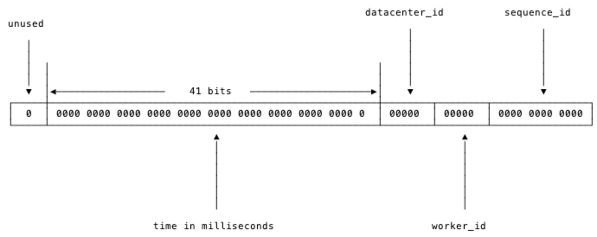

数值是64位，int64类型，被划分为四部分，不含开头的第一个bit，因为这个bit是符号位。用41位来表示收到请求时的时间戳，单位为毫秒，然后五位来表示数据中心的id，然后再五位来表示机器的实例id，最后是12位的循环自增id（到达1111,1111,1111后会归0）。

这样的机制可以支持在同一台机器上，同一毫秒内产生`2 ^ 12 = 4096`条消息。一秒共409.6万条消息。从值域上来讲完全够用了。

数据中心加上实例id共有10位，可以支持每数据中心部署32台机器，所有数据中心共1024台实例。

表示`timestamp`的41位，可以支持使用69年。这里的`timestamp`只是相对于某个时间的增量，可以设置为系统上线的时间戳，如`2024-08-01 00:00:00.000`的偏移量。


### worker_id分配

`timestamp`，`datacenter_id`，`worker_id`和`sequence_id`这四个字段中，`timestamp`和`sequence_id`是由程序在运行期生成的。但`datacenter_id`和`worker_id`需要在部署阶段就能够获取得到，并且一旦程序启动之后，就是不可更改的了。

一般不同数据中心的机器，会提供对应的获取数据中心id的API，所以`datacenter_id`可以在部署阶段轻松地获取到。而worker_id是逻辑上给机器分配的一个id，这个要怎么办呢？比较简单的想法是由能够提供这种自增id功能的工具来支持，比如MySQL:

```shell
mysql> insert into a (ip) values("10.1.2.101");
Query OK, 1 row affected (0.00 sec)

mysql> select last_insert_id();
+------------------+
| last_insert_id() |
+------------------+
|                2 |
+------------------+
1 row in set (0.00 sec)
```

从MySQL中获取到`worker_id`之后，就把这个`worker_id`直接持久化到本地，以避免每次上线时都需要获取新的`worker_id`。让单实例的`worker_id`可以始终保持不变。

当然，使用MySQL相当于给简单的id生成服务增加了一个外部依赖。依赖越多，服务的可运维性就越差。

考虑到集群中即使有单个id生成服务的实例挂了，也就是损失一段时间的一部分id，所以也可以更简单暴力一些，把`worker_id`直接写在worker的配置中，上线时，由部署脚本完成`worker_id`字段替换。


### 实现

> 实现 1

`github.com/bwmarrin/snowflake` 是一个相当轻量化的snowflake的Go实现。

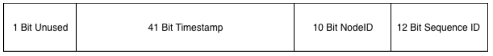

和标准的snowflake完全一致


> 实现 2

[sonyflake](https://github.com/sony/sonyflake)是Sony公司的一个开源项目，基本思路和snowflake差不多，不过位分配上稍有不同

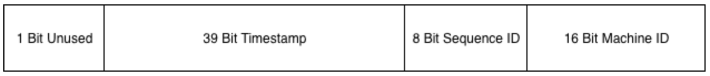

这里的时间只用了39个bit，但时间的单位变成了10ms，所以理论上比41位表示的时间还要久(174年)。

`Sequence ID`和之前的定义一致，`Machine ID`其实就是节点id。


## 分布式锁

在单机程序并发或并行修改全局变量时，需要对修改行为加锁以创造临界区。

### 并发计数器加锁

```go
var wg sync.WaitGroup
var l sync.Mutex
for i := 0; i < 1000; i++ {
    wg.Add(1)
    go func() {
        defer wg.Done()
        l.Lock()
        counter++
        l.Unlock()
    }()
}

wg.Wait() // 等待所有 goroutine 结束
println(counter)
```


### tryLock

在某些场景，希望一个任务有单一的执行者。而不像计数器场景一样，所有goroutine都执行成功。后来的goroutine在抢锁失败后，需要放弃其流程。这时候就需要trylock了。

trylock顾名思义，尝试加锁，加锁成功执行后续流程，如果加锁失败的话也不会阻塞，而会直接返回加锁的结果。在Go语言中可以用大小为1的Channel来模拟trylock：

```go
package main

import "sync"

type Lock struct {
    c chan struct{}
}

func NewLock() Lock {
    var l Lock
    l.c = make(chan struct{}, 1)
    l.c <- struct{}{} // 需要先放入一个值，表示该锁可用
    return l
}

func (l Lock) Lock() (lockResult bool) {
    select {
    case <-l.c:
       lockResult = true
    default:
       lockResult = false
    }
    return
}

func (l Lock) UnLock() {
    l.c <- struct{}{}
}

var counter int // 最终的 counter 一般小于 10.

func main() {
    l := NewLock()
    wg := sync.WaitGroup{}

    for i := 0; i < 10; i++ {
       wg.Add(1)
       go func() {
          defer wg.Done()
          if !l.Lock() {
             println("lock failed")
             return
          }
          counter++
          println("current counter:", counter)
          l.UnLock()
       }()
    }

    wg.Wait()
}
```


### 分布式锁

> 基于Redis的setnx

远程调用`setnx`运行流程上和单机的trylock非常相似，如果获取锁失败，那么相关的任务逻辑就不应该继续向前执行。

`setnx`很适合在高并发场景下，用来争抢一些“唯一”的资源。比如交易撮合系统中卖家发起订单，而多个买家会对其进行并发争抢。这种场景没有办法依赖具体的时间来判断先后，因为不管是用户设备的时间，还是分布式场景下的各台机器的时间，都是没有办法在合并后保证正确的时序的。哪怕是我们同一个机房的集群，不同的机器的系统时间可能也会有细微的差别。


> 基于ZooKeeper

基于ZooKeeper的锁与基于Redis的锁的不同之处在于Lock成功之前会一直阻塞，这与单机场景中的`mutex.Lock`很相似。

其原理以后再看吧。

这种分布式的阻塞锁比较适合分布式任务调度场景，但不适合高频次持锁时间短的抢锁场景。按照Google的Chubby论文里的阐述，基于强一致协议的锁适用于`粗粒度`的加锁操作。这里的粗粒度指锁占用时间较长。


> 基于etcd

etcd是分布式系统中，功能上与ZooKeeper类似的组件，也可以实现阻塞分布式锁。

etcd中没有像ZooKeeper那样的Sequence节点。所以其锁实现和基于ZooKeeper实现的有所不同。etcdsync的Lock流程是：

1. 先检查`/lock`路径下是否有值，如果有值，说明锁已经被别人抢了
2. 如果没有值，那么写入自己的值。写入成功返回，说明加锁成功。写入时如果节点被其它节点写入过了，那么会导致加锁失败，这时候到 3
3. watch `/lock`下的事件，此时陷入阻塞
4. 当`/lock`路径下发生事件时，当前进程被唤醒。检查发生的事件是否是删除事件（说明锁被持有者主动unlock），或者过期事件（说明锁过期失效）。如果是的话，那么回到 1，走抢锁流程。


### 选择

业务还在单机就可以搞定的量级时，那么按照需求使用任意的单机锁方案就可以。

如果发展到了分布式服务阶段，但业务规模不大，qps很小的情况下，使用哪种锁方案都差不多。如果公司内已有可以使用的ZooKeeper、etcd或者Redis集群，那么就尽量在不引入新的技术栈的情况下满足业务需求。

业务发展到一定量级的话，就需要从多方面来考虑了。首先是锁是否在任何恶劣的条件下都不允许数据丢失，如果不允许，那么就不要使用Redis的`setnx`的简单锁。

对锁数据的可靠性要求极高的话，那只能使用etcd或者ZooKeeper这种通过一致性协议保证数据可靠性的锁方案。但可靠的背面往往都是较低的吞吐量和较高的延迟。需要根据业务的量级对其进行压力测试，以确保分布式锁所使用的etcd或ZooKeeper集群可以承受得住实际的业务请求压力。需要注意的是，etcd和Zookeeper集群是没有办法通过增加节点来提高其性能的。要对其进行横向扩展，只能增加搭建多个集群来支持更多的请求。这会进一步提高对运维和监控的要求。多个集群可能需要引入proxy，没有proxy那就需要业务去根据某个业务id来做分片。如果业务已经上线的情况下做扩展，还要考虑数据的动态迁移。这些都不是容易的事情。


## 延时任务系统

在做系统时，很多时候是处理实时的任务，请求来了马上就处理，然后立刻给用户以反馈。但有时也会遇到非实时的任务，比如确定的时间点发布重要公告。或者需要在用户做了一件事情的X分钟/Y小时后，对其特定动作，比如通知、发券等等。

一般有两种思路来解决这个问题：

1. 实现一套分布式定时任务管理系统。
2. 实现一个支持定时发送消息的消息队列。

两种思路进而衍生出了一些不同的系统，但其本质是差不多的。都是需要实现一个定时器（timer）。


### 定时器的实现

定时器（timer）的实现在工业界已经是有解的问题了。常见的就是时间堆和时间轮。

> 时间堆

最常见的时间堆一般用小顶堆实现，小顶堆其实就是一种特殊的二叉树

小顶堆的好处是什么呢？对于定时器来说，如果堆顶元素比当前的时间还要大，那么说明堆内所有元素都比当前时间大。进而说明这个时刻还没有必要对时间堆进行任何处理。定时检查的时间复杂度是`O(1)`。

当发现堆顶的元素小于当前时间时，那么说明可能已经有一批事件已经开始过期了，这时进行正常的弹出和堆调整操作就好。每一次堆调整的时间复杂度都是`O(LgN)`。

Go自身的内置定时器就是用时间堆来实现的，不过并没有使用二叉堆，而是使用了扁平一些的四叉堆。在最近的版本中，还加了一些优化，先不说优化，先来看看四叉的小顶堆长什么样：

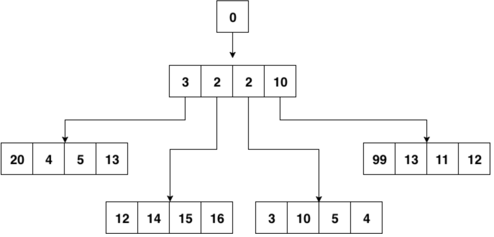

小顶堆的性质，父节点比其4个子节点都小，子节点之间没有特别的大小关系要求。

四叉堆中元素超时和堆调整与二叉堆没有什么本质区别。


> 时间轮

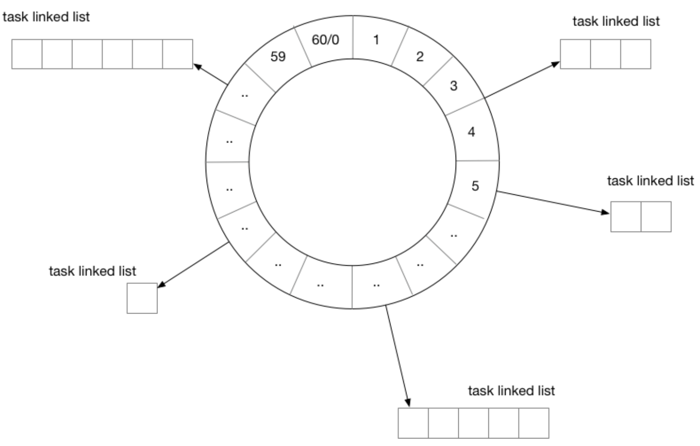

用时间轮来实现定时器时，需要定义每一个格子的“刻度”，可以将时间轮想像成一个时钟，中心有秒针顺时针转动。每次转动到一个刻度时，就需要去查看该刻度挂载的任务列表是否有已经到期的任务。

从结构上来讲，时间轮和哈希表很相似，如果把哈希算法定义为：触发时间%时间轮元素大小。那么这就是一个简单的哈希表。在哈希冲突时，采用链表挂载哈希冲突的定时器。

除了这种单层时间轮，业界也有一些时间轮采用多层实现。


### 任务分发

有了基本的定时器实现方案，如果开发的是单机系统，那么就可以撸起袖子开干了，不过距离“分布式”还稍微有一些距离。还需要把这些“定时”或是“延时”（本质也是定时）任务分发出去。下面是一种思路：

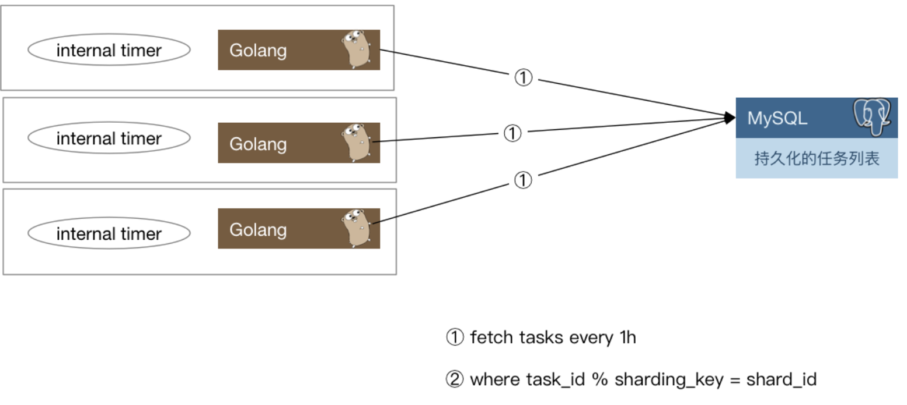

每一个实例每隔一小时，会去数据库里把下一个小时需要处理的定时任务捞出来，捞取的时候只要取那些`task_id % shard_count = shard_id`的那些任务即可。==是不是可以理解为每个节点自己去拿下一个小时的任务，然后组织成一个时间树或者时间轮，然后不断检测定时任务是否需要被触发==

当这些定时任务被触发之后需要通知用户侧，有两种思路：

1. 将任务被触发的信息封装为一条消息，发往消息队列，由用户侧对消息队列进行监听。
2. 对用户预先配置的回调函数进行调用。

两种方案各有优缺点，如果采用1，那么如果消息队列出故障会导致整个系统不可用，当然，现在的消息队列一般也会有自身的高可用方案，大多数时候我们不用担心这个问题。其次一般业务流程中间走消息队列的话会导致**延时增加**，定时任务若必须在触发后的几十毫秒到几百毫秒内完成，那么采用消息队列就会有一定的风险。如果采用2，会加重定时任务系统的负担。单机的定时器执行时最害怕的就是回调函数执行时间过长，这样会阻塞后续的任务执行。在分布式场景下，这种忧虑依然是适用的。一个不负责任的业务回调可能就会直接拖垮整个定时任务系统。所以还要考虑在回调的基础上增加经过测试的超时时间设置，并且对由用户填入的超时时间做慎重的审核。


### 数据再平衡和幂等考量

当任务执行集群有机器故障时，需要对任务进行重新分配。按照之前的求模策略，对这台机器还没有处理的任务进行重新分配就比较麻烦了。如果是实际运行的线上系统，还要在故障时的任务平衡方面花更多的心思。

下面给出一种思路：

可以参考Elasticsearch的数据分布设计，每份任务数据都有多个副本，这里假设两副本，如图所示：

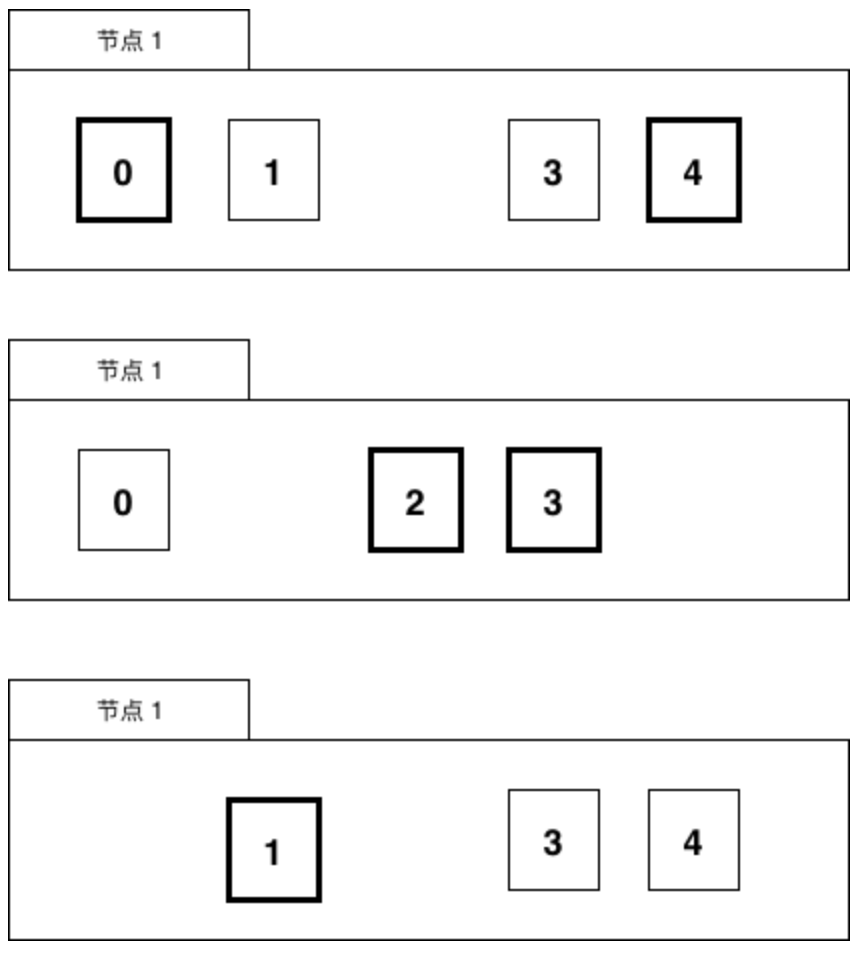

一份数据虽然有两个持有者，但持有者持有的副本会进行区分，比如持有的是主副本还是非主副本，主副本在图中为粗黑部分，非主副本为正常线条。

**一个任务只会在持有主副本的节点上被执行。**

当有机器故障时，任务数据需要进行数据再平衡的工作，比如节点1挂了

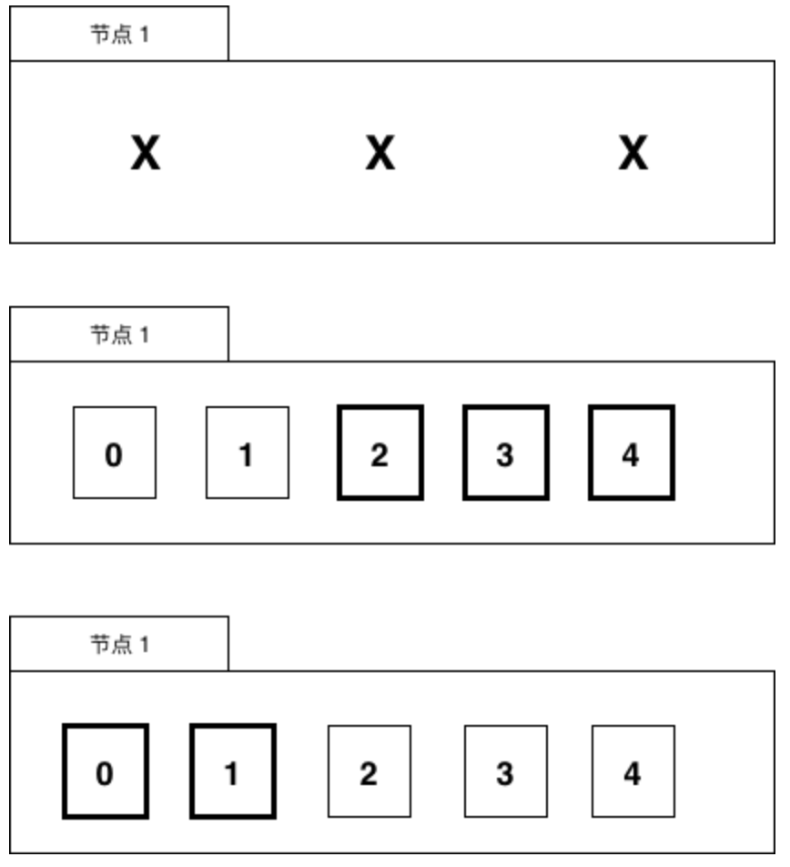

节点1的数据会被迁移到节点2和节点3上。

当然，也可以用稍微复杂一些的思路，比如对集群中的节点进行角色划分，由协调节点来做这种故障时的任务重新分配工作，考虑到高可用，协调节点可能也需要有1至2个备用节点以防不测。


## 分布式搜索引擎

数据库系统本身要保证实时和强一致性，所以其功能设计上都是为了满足这种一致性需求。比如write ahead log的设计，基于B+树实现的索引和数据组织，以及基于MVCC实现的事务等等。

在互联网的业务场景中，也有一些实时性要求不高(可以接受多秒的延迟)，但是查询复杂性却很高的场景。举个例子，在电商的WMS系统中，或者在大多数业务场景丰富的CRM或者客服系统中，可能需要提供几十个字段的随意组合查询功能。如果经营的是一个大型电商，每天有千万级别的订单，那么在这个数据库中查询和建立合适的索引都是一件非常难的事情。

在CRM或客服类系统中，常常有根据关键字进行搜索的需求，大型互联网公司每天会接收数以万计的用户投诉。而考虑到事件溯源，用户的投诉至少要存2~3年。又是千万级甚至上亿的数据。根据关键字进行一次like查询，可能整个MySQL就直接挂掉了。

这时候就需要搜索引擎来救场了。


### 搜索引擎

Elasticsearch是开源分布式搜索引擎的霸主，其依赖于Lucene实现，在部署和运维方面做了很多优化。当今搭建一个分布式搜索引擎比起Sphinx的时代已经是容易很多很多了。只要简单配置客户端IP和端口就可以了。

### 倒排列表

虽然es是针对搜索场景来定制的，但实际应用中常常用es来作为database来使用，就是因为倒排列表的特性。可以用比较朴素的观点来理解倒排索引：

key 是关键词，value 是文档，也就是数据

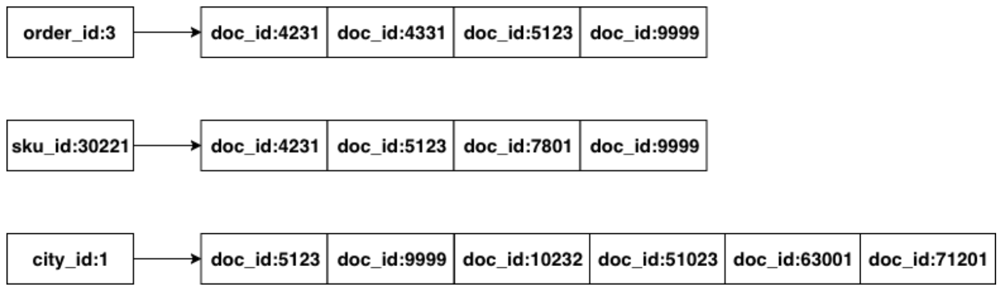

> 下面是一个更易懂的解释倒排索引的例子
>
> 倒排索引（Inverted Index）是搜索引擎中的一种关键数据结构，用于快速全文检索。其基本原理是将文档内容中的每个词条（Token）映射到包含该词条的文档列表中，从而加快查询速度。倒排索引的结构与传统的正向索引（如关系数据库中的索引）不同，后者是将文档映射到其内容。
>
> ### 倒排索引的工作原理
>
> 1. **文档处理**：
>    - 文档被解析成词条。假设有三个文档，内容如下：
>      - 文档1："Elasticsearch 是一个搜索引擎"
>      - 文档2："搜索引擎 用于快速检索"
>      - 文档3："快速 搜索 的 搜索引擎"
>
> 2. **词条提取**：
>    - 从每个文档中提取词条，忽略常见的停用词（如"是"、"的"等）并进行词干提取（如"快速"和"检索"）。
>
> 3. **创建倒排索引**：
>    - 将每个词条映射到包含该词条的文档ID列表：
>      ```
>      "Elasticsearch" -> [1]
>      "搜索引擎" -> [1, 2, 3]
>      "快速" -> [2, 3]
>      "检索" -> [2]
>      ```
>
> ### 倒排索引的结构
>
> 倒排索引通常由两部分组成：
> 1. **词典（Dictionary）**：存储所有出现过的词条。
> 2. **倒排列表（Posting List）**：记录每个词条出现在哪些文档中以及在文档中的位置。
>
> 例如，词典可以如下表示：
> ```
> 词典：
> "Elasticsearch" -> 倒排列表地址1
> "搜索引擎" -> 倒排列表地址2
> "快速" -> 倒排列表地址3
> "检索" -> 倒排列表地址4
> ```
>
> 倒排列表可能如下表示：
> ```
> 倒排列表地址1：
> 1
> 
> 倒排列表地址2：
> 1, 2, 3
> 
> 倒排列表地址3：
> 2, 3
> 
> 倒排列表地址4：
> 2
> ```
>
> ### 查询过程
>
> 当用户查询一个词条时，搜索引擎会：
> 1. 在词典中查找该词条，找到对应的倒排列表。
> 2. 根据倒排列表，快速定位到包含该词条的所有文档。
> 3. 如果是多个词条的查询，则合并各个词条的倒排列表，找到符合条件的文档。
>
> 例如，查询 "快速 搜索引擎" 时，搜索引擎会：
> 1. 在词典中查找 "快速" 和 "搜索引擎"，找到对应的倒排列表：
>    ```
>    "快速" -> [2, 3]
>    "搜索引擎" -> [1, 2, 3]
>    ```
> 2. 合并这两个倒排列表，找到同时包含这两个词条的文档：
>    ```
>    [2, 3]
>    ```
>
> 最终，返回文档2和文档3，因为它们同时包含 "快速" 和 "搜索引擎"。
>
> 倒排索引是搜索引擎能够快速、准确地进行全文搜索的关键技术。它通过预先构建的数据结构，大大加速了查询过程，使得在大规模数据集上进行实时搜索成为可能。

对Elasticsearch中的数据进行查询时，本质就是求多个排好序的序列求交集。非数值类型字段涉及到分词问题，大多数内部使用场景下，可以直接使用默认的bi-gram分词。什么是bi-gram分词呢：

即将所有`Ti`和`T(i+1)`组成一个词（在Elasticsearch中叫term），然后再编排其倒排列表，这样倒排列表大概就是这样的：

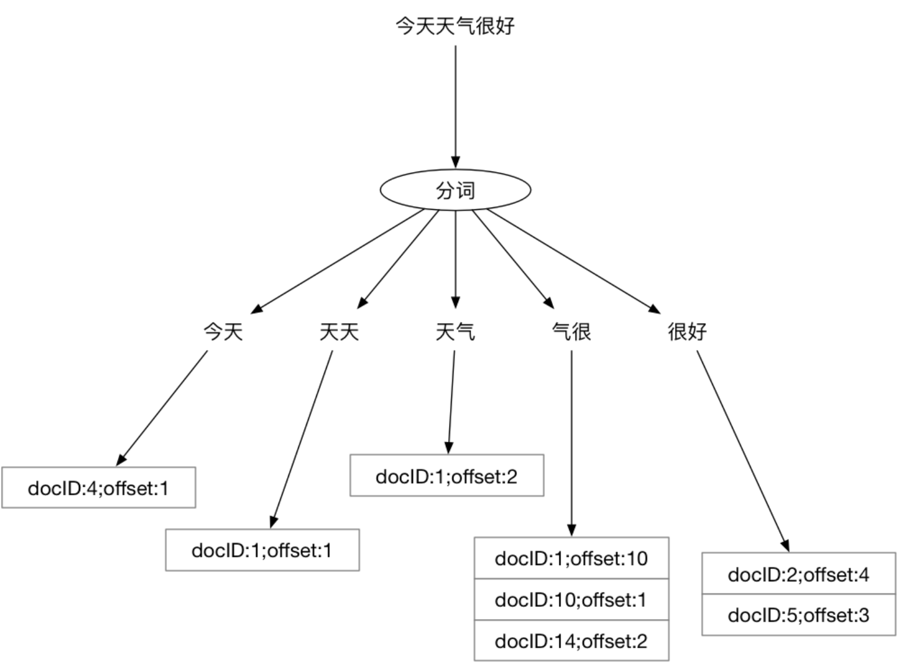

至于他如何搜索，查询之后再看吧 ==有一个 todo 咯==


### 异构数据同步

==也是看看罢了，了解一下==

在实际应用中，很少直接向搜索引擎中写入数据。更为常见的方式是，将MySQL或其它关系型数据中的数据同步到搜索引擎中。而**搜索引擎的使用方只能对数据进行查询，无法进行修改和删除**。

常见的同步方案有两种：

> 通过时间戳进行增量数据同步

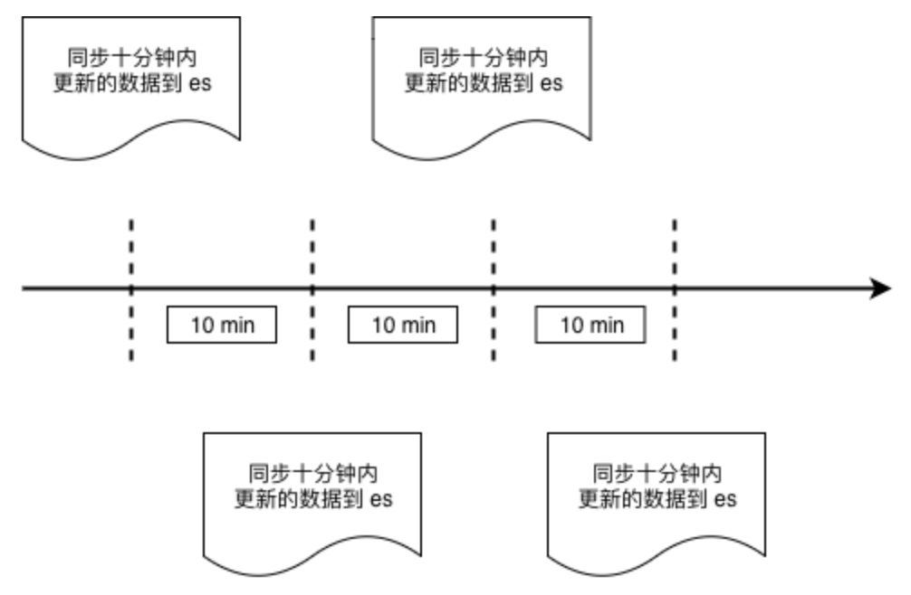

这种同步方式与业务强绑定，例如WMS系统中的出库单，并不需要非常实时，稍微有延迟也可以接受，那么可以每分钟从MySQL的出库单表中，把最近十分钟创建的所有出库单取出，批量存入es中。


> 通过 binlog 进行数据同步
>
> ==不懂不懂不懂==

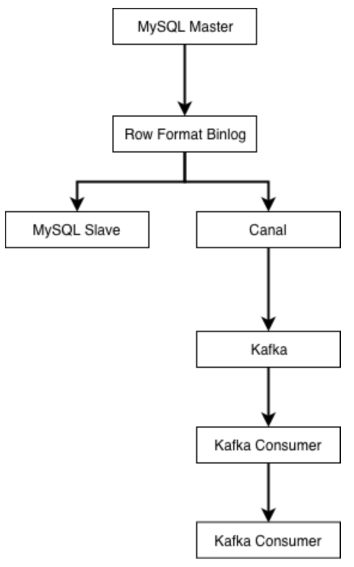

业界使用较多的是阿里开源的Canal，来进行binlog解析与同步。canal会伪装成MySQL的从库，然后解析好行格式的binlog，再以更容易解析的格式（例如json）发送到消息队列。

由下游的Kafka消费者负责把上游数据表的自增主键作为es的文档的id进行写入，这样可以保证每次接收到binlog时，对应id的数据都被覆盖更新为最新。MySQL的Row格式的binlog会将每条记录的所有字段都提供给下游，所以在向异构数据目标同步数据时，不需要考虑数据是插入还是更新，只要一律按id进行覆盖即可。

这种模式同样需要业务遵守一条数据表规范，即表中必须有唯一主键id来保证进入es的数据不会发生重复。一旦不遵守该规范，那么就会在同步时导致数据重复。


## 负载均衡

### 常见的负载均衡思路

如果不考虑均衡的话，现在有n个服务节点，完成业务流程只需要从这n个中挑出其中的一个。有几种思路:

1. 按顺序挑: 例如上次选了第一台，那么这次就选第二台，下次第三台，如果已经到了最后一台，那么下一次从第一台开始。这种情况下可以把服务节点信息都存储在数组中，每次请求完成下游之后，将一个索引后移即可。在移到尽头时再移回数组开头处。
2. 随机挑一个: 每次都随机挑，真随机伪随机均可。假设选择第 x 台机器，那么x可描述为`rand.Intn()%n`。
3. 根据某种权重，对下游节点进行排序，选择权重最大/小的那一个。

实际场景不可能无脑轮询或者无脑随机，如果对下游请求失败了，还需要某种机制来进行重试，如果纯粹的随机算法，存在一定的可能性在下一次仍然随机到这次的问题节点。


### 基于洗牌算法的负载均衡

考虑到需要随机选取每次发送请求的节点，同时在遇到下游返回错误时换其它节点重试。所以设计一个大小和节点数组大小一致的索引数组，每次来新的请求，对索引数组做洗牌，然后取第一个元素作为选中的服务节点，如果请求失败，那么选择下一个节点重试，以此类推:

```go
var endpoints = []string {
    "100.69.62.1:3232",
    "100.69.62.32:3232",
    "100.69.62.42:3232",
    "100.69.62.81:3232",
    "100.69.62.11:3232",
    "100.69.62.113:3232",
    "100.69.62.101:3232",
}

// 重点在这个 shuffle
func shuffle(slice []int) {
    for i := 0; i < len(slice); i++ {
        a := rand.Intn(len(slice))
        b := rand.Intn(len(slice))
        slice[a], slice[b] = slice[b], slice[a]
    }
}

func request(params map[string]interface{}) error {
    var indexes = []int {0,1,2,3,4,5,6}
    var err error

    shuffle(indexes)
    maxRetryTimes := 3

    idx := 0
    for i := 0; i < maxRetryTimes; i++ {
        err = apiRequest(params, endpoints[indexes[idx]])
        if err == nil {
            break
        }
        idx++
    }

    if err != nil {
        // logging
        return err
    }

    return nil
}
```

> 错误的洗牌导致的负载不均衡

这段简短的程序里有两个隐藏的隐患:

1. 没有随机种子。在没有随机种子的情况下，`rand.Intn()`返回的伪随机数序列是固定的。==这里的意思应该是会有多个程序运行这一个代码，然后每个程序得到的随机序列是一样的，一般来说是由多个程序来负责负载均衡的，应该可以这样理解==
2. 洗牌不均匀，会导致整个数组第一个节点有大概率被选中，并且多个节点的负载分布不均衡。

第一点比较简单，应该不用在这里给出证明了。关于第二点，可以用概率知识来简单证明一下。假设每次挑选都是真随机，我们假设第一个位置的节点在`len(slice)`次交换中都不被选中的概率是`((6/7)*(6/7))^7 ≈ 0.34`。而分布均匀的情况下，肯定希望被第一个元素在任意位置上分布的概率均等，所以其被随机选到的概率应该约等于`1/7≈0.14`。

显然，这里给出的洗牌算法对于任意位置的元素来说，有30%的概率不对其进行交换操作。所以所有元素都倾向于留在原来的位置。因为每次对`shuffle`数组输入的都是同一个序列，所以第一个元素有更大的概率会被选中。在负载均衡的场景下，也就意味着节点数组中的第一台机器负载会比其它机器高不少(这里至少是3倍以上)。

> 修正洗牌算法

从数学上得到过证明的还是经典的fisher-yates算法，主要思路为每次随机挑选一个值，放在数组末尾。然后在n-1个元素的数组中再随机挑选一个值，放在数组末尾，以此类推。

```go
func shuffle(indexes []int) {
    for i:=len(indexes); i>0; i-- {
        lastIdx := i - 1
        idx := rand.Int(i)
        indexes[lastIdx], indexes[idx] = indexes[idx], indexes[lastIdx]
    }
}
```

在Go的标准库中已经内置了该算法:

```go
func shuffle(n int) []int {
    b := rand.Perm(n)
    return b
}
```

在当前的场景下，只要用`rand.Perm`就可以得到想要的索引数组了。

==这个就可以做到比较均衡的随机选择节点了。==

> ZooKeeper 集群的随机节点挑选问题

场景是从N个节点中选择一个节点发送请求，初始请求结束之后，后续的请求会重新对数组洗牌，所以每两个请求之间没有什么关联关系。因此上面的洗牌算法，理论上不初始化随机库的种子也是不会出什么问题的。

但在一些特殊的场景下，例如使用ZooKeeper时，客户端初始化从多个服务节点中挑选一个节点后，是会向该节点建立长连接的。之后客户端请求都会发往该节点去。直到该节点不可用，才会在节点列表中挑选下一个节点。在这种场景下，初始连接节点选择就要求必须是“真”随机了。否则，所有客户端起动时，都会去连接同一个ZooKeeper的实例，根本无法起到负载均衡的目的。如果在日常开发中，业务也是类似的场景，也务必考虑一下是否会发生类似的情况。为rand库设置种子的方法:

```go
rand.Seed(time.Now().UnixNano())
```

之所以会有上面这些结论，是因为某个使用较广泛的开源ZooKeeper库的早期版本就犯了上述错误，直到2016年早些时候，这个问题才被修正。


