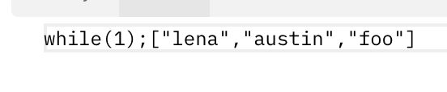
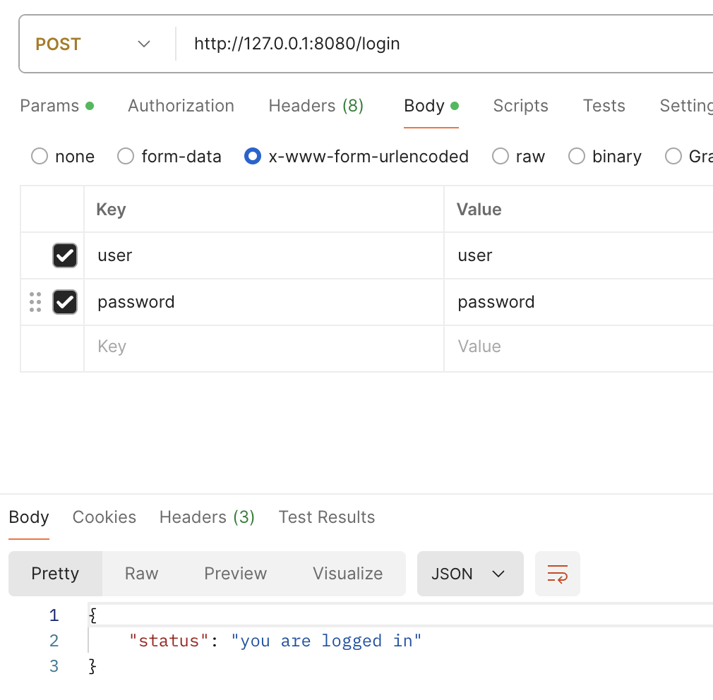
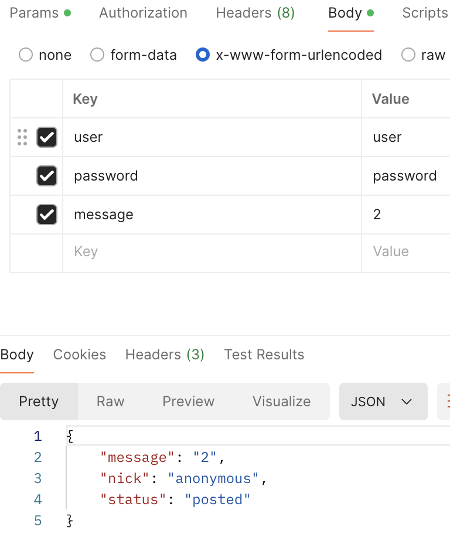
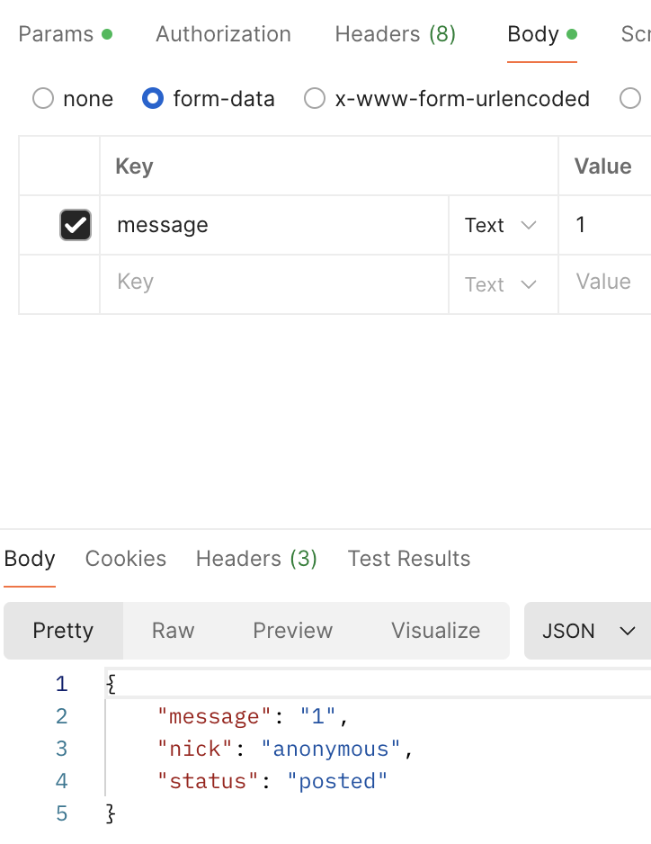
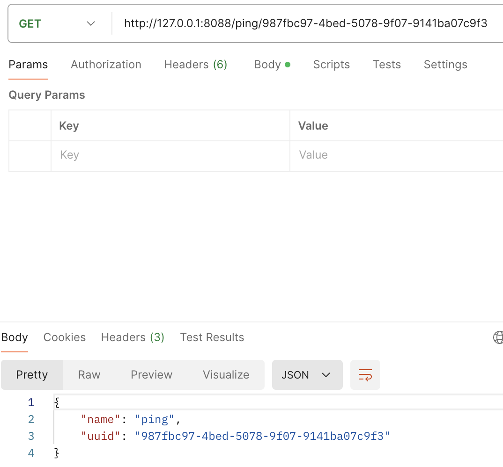
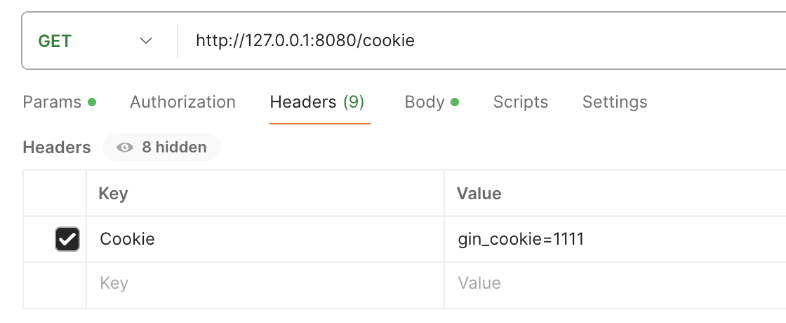

# Gin Web 框架

## 介绍

Gin 是一个用 Go (Golang) 编写的 Web 框架。 它具有类似 martini 的 API，性能要好得多，多亏了 [httprouter](https://github.com/julienschmidt/httprouter)，速度提高了 40 倍。

> 特性

**快速**：基于 Radix 树的路由，小内存占用。没有反射。可预测的 API 性能。

**支持中间件**：传入的 HTTP 请求可以由一系列中间件和最终操作来处理。 例如：Logger，Authorization，GZIP，最终操作 DB。

**Crash 处理**：Gin 可以 catch 一个发生在 HTTP 请求中的 panic 并 recover 它。这样，服务器将始终可用。

**JSON 验证**：Gin 可以解析并验证请求的 JSON，例如检查所需值的存在。

**路由组**：更好地组织路由。是否需要授权，不同的 API 版本…… 此外，这些组可以无限制地嵌套而不会降低性能。

**错误管理**：Gin 提供了一种方便的方法来收集 HTTP 请求期间发生的所有错误。最终，中间件可以将它们写入日志文件，数据库并通过网络发送。

**内置渲染**：Gin 为 JSON，XML 和 HTML 渲染提供了易于使用的 API。

**可扩展性**：新建一个中间件非常简单


## API

### AsciiJSON

```go
func main() {
	r := gin.Default()

	r.GET("/someJSON", func(c *gin.Context) {
		data := map[string]interface{}{
			"lang": "GO语言",
			"tag":  "<br>",
		}

		// 输出 : {"lang":"GO\u8bed\u8a00","tag":"\u003cbr\u003e"}
		c.AsciiJSON(http.StatusOK, data)
	})

  str := `{"lang":"GO\u8bed\u8a00","tag":"\u003cbr\u003e"}`
	var msg map[string]interface{} 
  json.Unmarshal([]byte(str), &msg) // 使用 json 库进行反序列化
	fmt.Println(msg)
  
	// 监听并在 0.0.0.0:8080 上启动服务
	r.Run(":8080")
}
```


### PureJSON

通常，JSON 使用 unicode 替换特殊 HTML 字符，例如 < 变为 \ u003c。如果要按字面对这些字符进行编码，则可以使用 PureJSON。Go 1.6 及更低版本无法使用此功能。

```go
func main() {
	r := gin.Default()
	
	// 提供 unicode 实体
	r.GET("/json", func(c *gin.Context) {
		c.JSON(200, gin.H{
			"html": "<b>Hello, world!</b>",
		})
	})
	// {"html":"\u003cb\u003eHello, world!\u003c/b\u003e"}

	// 提供字面字符
	r.GET("/purejson", func(c *gin.Context) {
		c.PureJSON(200, gin.H{
			"html": "<b>Hello, world!</b>",
		})
	})
	// {"html":"<b>Hello, world!</b>"}
	
	r.Run(":8080")
}
```


### SecureJSON

使用 SecureJSON 防止 json 劫持。如果给定的结构是**数组值**，则默认预置 `"while(1),"` 到响应体。

```go
func main() {
	r := gin.Default()

	// 你也可以使用自己的 SecureJSON 前缀
	// r.SecureJsonPrefix(")]}',\n")

	r.GET("/someJSON", func(c *gin.Context) {
		names := []string{"lena", "austin", "foo"}

		// 将输出：while(1);["lena","austin","foo"]
		c.SecureJSON(http.StatusOK, names)
	})

	// 监听并在 0.0.0.0:8080 上启动服务
	r.Run(":8080")
}
```



### XML/JSON/YAML/ProtoBuf 渲染

```go
func main() {
	r := gin.Default()

	// gin.H 是 map[string]interface{} 的一种快捷方式
	r.GET("/someJSON", func(c *gin.Context) {
		c.JSON(http.StatusOK, gin.H{"message": "hey", "status": http.StatusOK})
	})

	r.GET("/moreJSON", func(c *gin.Context) {
		// 你也可以使用一个结构体
		var msg struct {
			Name    string `json:"user"`
			Message string
			Number  int
		}
		msg.Name = "Lena"
		msg.Message = "hey"
		msg.Number = 123
		// 注意 msg.Name 在 JSON 中变成了 "user"
		// 将输出：{"user": "Lena", "Message": "hey", "Number": 123}
		c.JSON(http.StatusOK, msg)
	})

	r.GET("/someXML", func(c *gin.Context) {
		c.XML(http.StatusOK, gin.H{"message": "hey", "status": http.StatusOK})
    // <map><message>hey</message><status>200</status></map>
	})

	r.GET("/someYAML", func(c *gin.Context) {
		c.YAML(http.StatusOK, gin.H{"message": "hey", "status": http.StatusOK})
    // message: hey
		// status: 200
	})

  // 这个不知道数据在哪，蚌埠住了
	r.GET("/someProtoBuf", func(c *gin.Context) {
		reps := []int64{int64(1), int64(2)}
		label := "test"
		// protobuf 的具体定义写在 testdata/protoexample 文件中。
		data := &protoexample.Test{
			Label: &label,
			Reps:  reps,
		}
		// 请注意，数据在响应中变为二进制数据
		// 将输出被 protoexample.Test protobuf 序列化了的数据
		c.ProtoBuf(http.StatusOK, data)
	})

	// 监听并在 0.0.0.0:8080 上启动服务
	r.Run(":8080")
}
```


### 安全页眉Header

使用安全标头保护网络应用程序免受常见安全漏洞的攻击非常重要。下面是 Gin 应用程序中如何添加安全标头，以及如何避免与主机标头注入相关的攻击（SSRF、开放重定向）。

```go
func main() {
	r := gin.Default()

	expectedHost := "localhost:8080"

	// Setup Security Headers 实际上是添加了一个中间件
	r.Use(func(c *gin.Context) {
		if c.Request.Host != expectedHost {
			c.AbortWithStatusJSON(http.StatusBadRequest, gin.H{"error": "Invalid host header"})
			return
		}
		c.Header("X-Frame-Options", "DENY")
		c.Header("Content-Security-Policy", "default-src 'self'; connect-src *; font-src *; script-src-elem * 'unsafe-inline'; img-src * data:; style-src * 'unsafe-inline';")
		c.Header("X-XSS-Protection", "1; mode=block")
		c.Header("Strict-Transport-Security", "max-age=31536000; includeSubDomains; preload")
		c.Header("Referrer-Policy", "strict-origin")
		c.Header("X-Content-Type-Options", "nosniff")
		c.Header("Permissions-Policy", "geolocation=(),midi=(),sync-xhr=(),microphone=(),camera=(),magnetometer=(),gyroscope=(),fullscreen=(self),payment=()")
		c.Next()
	})

	r.GET("/ping", func(c *gin.Context) {
		c.JSON(200, gin.H{
			"message": "pong",
		})
	})

	r.Run() // listen and serve on 0.0.0.0:8080
}
```

```shell
# -I 表示发送一个 HEAD 请求，只获取响应头部信息而不获取响应体。这个选项通常用于检查服务器的响应状态和头部信息，而不下载整个响应内容。
liushun@liushun ~ % curl localhost:8080/ping -I
HTTP/1.1 404 Not Found
Content-Security-Policy: default-src 'self'; connect-src *; font-src *; script-src-elem * 'unsafe-inline'; img-src * data:; style-src * 'unsafe-inline';
Content-Type: text/plain
Permissions-Policy: geolocation=(),midi=(),sync-xhr=(),microphone=(),camera=(),magnetometer=(),gyroscope=(),fullscreen=(self),payment=()
Referrer-Policy: strict-origin
Strict-Transport-Security: max-age=31536000; includeSubDomains; preload
X-Content-Type-Options: nosniff
X-Frame-Options: DENY
X-Xss-Protection: 1; mode=block
Date: Fri, 26 Jul 2024 10:21:29 GMT
Content-Length: 18

liushun@liushun ~ % curl localhost:8080/ping -I -H "Host:neti.ee"
HTTP/1.1 400 Bad Request
Content-Type: application/json; charset=utf-8
Date: Fri, 26 Jul 2024 10:21:49 GMT
Content-Length: 31
```


### 解析 body 参数

`ShouldBind`绑定到结构体

```go
type LoginForm struct {
	User     string `form:"user" binding:"required"`
	Password string `form:"password" binding:"required"`
}

func main() {
	router := gin.Default()
	router.POST("/login", func(c *gin.Context) {
		// 可以使用显式绑定声明绑定 multipart form：
		// c.ShouldBindWith(&form, binding.Form)
		// 或者简单地使用 ShouldBind 方法自动绑定：
		var form LoginForm
		// 在这种情况下，将自动选择合适的绑定
		if c.ShouldBind(&form) == nil {
			if form.User == "user" && form.Password == "password" {
				c.JSON(200, gin.H{"status": "you are logged in"})
			} else {
				c.JSON(401, gin.H{"status": "unauthorized"})
			}
		}
	})
	router.Run(":8080")
}
```



提供了 PostForm 等函数从 body 中拿数据，取特定值

```go
func main() {
	router := gin.Default()

	router.POST("/form_post", func(c *gin.Context) {
		message := c.PostForm("message")
		nick := c.DefaultPostForm("nick", "anonymous") // 不存在就填充一个默认值

		c.JSON(200, gin.H{
			"status":  "posted",
			"message": message,
			"nick":    nick,
		})
	})
	router.Run(":8080")
}
```



两种类型都支持


### 解析 params 参数

通过 Query 拿到 param 参数，通过 PostForm 拿到 body 函数，两者可以同时存在

```sh
POST /post?id=112&page=1 HTTP/1.1
Content-Type: application/x-www-form-urlencoded

name=shunliu&message=message

func main() {
	router := gin.Default()

	router.POST("/post", func(c *gin.Context) {

		id := c.Query("id")
		page := c.DefaultQuery("page", "0")
		name := c.PostForm("name")
		message := c.PostForm("message")

		fmt.Printf("id: %s; page: %s; name: %s; message: %s", id, page, name, message)
	})
	router.Run(":8080")
}
// 打印 id: 112; page: 1; name: shunliu; message: message
```


### 绑定 Uri，命名 params

```go
type Person struct {
	ID   string `uri:"id" binding:"required,uuid"`
	Name string `uri:"name" binding:"required"`
}

func main() {
	route := gin.Default()
	route.GET("/:name/:id", func(c *gin.Context) {
		var person Person
		if err := c.ShouldBindUri(&person); err != nil {
			c.JSON(400, gin.H{"msg": err.Error()})
			return
		}
		c.JSON(200, gin.H{"name": person.Name, "uuid": person.ID})
	})
	route.Run(":8088")
}
```



```go
func main() {
	router := gin.Default()

	// 此 handler 将匹配 /user/john 但不会匹配 /user/ 或者 /user
	router.GET("/user/:name", func(c *gin.Context) {
		name := c.Param("name")
		c.String(http.StatusOK, "Hello %s", name)
	})

	// 此 handler 将匹配 /user/john/ 和 /user/john/send
	// 如果没有其他路由匹配 /user/john，它将重定向到 /user/john/
	router.GET("/user/:name/*action", func(c *gin.Context) {
		name := c.Param("name")
		action := c.Param("action")
		message := name + " is " + action
		c.String(http.StatusOK, message)
	})

	router.Run(":8080")
}
```

> :参数是一定要有，*参数是可选项


### params 参数到嵌套结构体

==注意这里解析的是 params 参数，不是 body 参数，使用的 api 是 **Bind** 函数==

以下示例使用自定义结构体：

```go
type StructA struct {
	FieldA string `form:"field_a"`
}

type StructB struct {
	NestedStruct StructA
	FieldB       string `form:"field_b"`
}

type StructC struct {
	NestedStructPointer *StructA
	FieldC              string `form:"field_c"`
}

type StructD struct {
	NestedAnonyStruct struct {
		FieldX string `form:"field_x"`
	}
	FieldD string `form:"field_d"`
}

func GetDataB(c *gin.Context) {
	var b StructB
	c.Bind(&b)
	c.JSON(200, gin.H{
		"a": b.NestedStruct,
		"b": b.FieldB,
	})
}
// {"a":{"FieldA":"field_a"},"b":"field_b"}

func GetDataC(c *gin.Context) {
	var b StructC
	c.Bind(&b)
	c.JSON(200, gin.H{
		"a": b.NestedStructPointer,
		"c": b.FieldC,
	})
}
// {"a":{"FieldA":"field_a"},"c":"field_c"}

func GetDataD(c *gin.Context) {
	var b StructD
	c.Bind(&b)
	c.JSON(200, gin.H{
		"x": b.NestedAnonyStruct,
		"d": b.FieldD,
	})
}
// {"d":"field_d","x":{"FieldX":"field_x"}}

func main() {
	r := gin.Default()
	r.GET("/getb", GetDataB)
	r.GET("/getc", GetDataC)
	r.GET("/getd", GetDataD)

	r.Run()
}
```

上面这些格式都能解析出来

但是如下不能解析，不能在内嵌结构提上直接写 form 标签，总之, 目前仅支持没有 form 的嵌套结构体。

```go
type StructX struct {
    X struct {} `form:"name_x"` // 有 form
}
type StructY struct {
    Y StructX `form:"name_y"` // 有 form
}
type StructZ struct {
    Z *StructZ `form:"name_z"` // 有 form
}
```


### 解析params或body

```go
type Person struct {
	Name     string    `form:"name"`
	Address  string    `form:"address"`
	Birthday time.Time `form:"birthday" time_format:"2006-01-02" time_utc:"1"`
}

func main() {
	route := gin.Default()
	route.GET("/testing", startPage)
	route.Run(":8085")
}

func startPage(c *gin.Context) {
	var person Person
	// 如果是 `GET` 请求，只使用 `Form` 绑定引擎（`query`）。
	// 如果是 `POST` 请求，首先检查 `content-type` 是否为 `JSON` 或 `XML`，然后再使用 `Form`（`form-data`）。
	// 查看更多：https://github.com/gin-gonic/gin/blob/master/binding/binding.go#L88
	if c.ShouldBind(&person) == nil {
		log.Println(person.Name)
		log.Println(person.Address)
		log.Println(person.Birthday)
	}

	c.String(200, "Success")
}
```

```
2024/07/26 18:45:27 appleboy
2024/07/26 18:45:27 xyz
2024/07/26 18:45:27 1992-03-15 00:00:00 +0000 UTC
[GIN] 2024/07/26 - 18:45:27 | 200 |     754.291µs |       127.0.0.1 | GET      "/testing?name=appleboy&address=xyz&birthday=1992-03-15"
2024/07/26 18:47:47 appleboy
2024/07/26 18:47:47 xyz
2024/07/26 18:47:47 1992-03-15 00:00:00 +0000 UTC
[GIN] 2024/07/26 - 18:47:47 | 200 |     213.541µs |       127.0.0.1 | GET      "/testing"
```

发送 params 参数和表单数据，都可以使用`ShouldBind`函数解析，注意到上面，`Bind` 函数不能解析表单数据


### params和 body 的 map 形式

```sh
POST /post?ids[a]=1234&ids[b]=hello HTTP/1.1
Content-Type: application/x-www-form-urlencoded

names[first]=thinkerou&names[second]=tianou

func main() {
	router := gin.Default()

	router.POST("/post", func(c *gin.Context) {

		ids := c.QueryMap("ids")
		names := c.PostFormMap("names")

		fmt.Printf("ids: %v; names: %v", ids, names)
	})
	router.Run(":8080")
}

ids: map[b:hello a:1234], names: map[second:tianou first:thinkerou]
```


### 模型绑定总结

要将请求体绑定到结构体中，使用模型绑定。 Gin目前支持JSON、XML、YAML和标准表单值的绑定（foo=bar＆boo=baz）。

Gin使用 [**go-playground/validator/v10**](https://github.com/go-playground/validator) 进行验证。 查看标签用法的全部[文档](https://pkg.go.dev/github.com/go-playground/validator/v10#hdr-Baked_In_Validators_and_Tags).

使用时，需要在要绑定的所有字段上，设置相应的tag（不一定需要指定，只是一般结构体中字段为大写开头，前后端传递时一般是小写开头，所以需要设置 tag 转换一下）。 例如，使用 JSON 绑定时，设置字段标签为 `json:"fieldname"`。

Gin提供了两类绑定方法：

- Type： Must bind
  - **Methods** - `Bind`（这是默认为 form，tag 中可以设置 form 来指定名字）, `BindJSON`, `BindXML`, `BindQuery`, `BindYAML`
  - **Behavior** - 这些方法属于 `MustBindWith` 的具体调用。 如果发生绑定错误，则请求终止，并触发 `c.AbortWithError(400, err).SetType(ErrorTypeBind)`。响应状态码被设置为 400 并且 `Content-Type` 被设置为 `text/plain; charset=utf-8`。 如果您在此之后尝试设置响应状态码，Gin会输出日志 `[GIN-debug] [WARNING] Headers were already written. Wanted to override status code 400 with 422`。 如果希望更好地控制绑定，考虑使用 `ShouldBind` 等效方法。
- Type ：Should bind
  - **Methods** - `ShouldBind`, `ShouldBindJSON`, `ShouldBindXML`, `ShouldBindQuery`, `ShouldBindYAML`
  - **Behavior** - 这些方法属于 `ShouldBindWith` 的具体调用。 如果发生绑定错误，Gin 会返回错误并由开发者处理错误和请求。

使用 Bind 方法时，Gin 会尝试根据 Content-Type 推断如何绑定。 如果明确知道要绑定什么，可以使用 `MustBindWith` 或 `ShouldBindWith`。

也可以指定必须绑定的字段。 如果一个字段的 tag 加上了 `binding:"required"`，但绑定时是空值, Gin 会报错。

==实际上，关于 bind 什么格式，是针对请求中的 content-type 决定的，如果自己明确知道是什么，可以自己指定，如果不知道，gin 会自己拿到 content-type，然后调用相应的 bind 函数==，可以看 ShouldBind 的源码，很清楚。

```go
func (c *Context) ShouldBind(obj any) error {
	b := binding.Default(c.Request.Method, c.ContentType())
	return c.ShouldBindWith(obj, b)
}
```


==**此外还有：`ShouldBindQuery` 函数只绑定 url 查询参数而忽略 post 数据。而其他的会使用两种数据来填充结构体**==


### 不使用默认的中间件

使用

```go
r := gin.New()
```

代替

```go
// Default 使用 Logger 和 Recovery 中间件
r := gin.Default()
```


### 路由日志

> 定制日志格式

默认的路由日志格式：

```
[GIN-debug] POST   /foo                      --> main.main.func1 (3 handlers)
[GIN-debug] GET    /bar                      --> main.main.func2 (3 handlers)
[GIN-debug] GET    /status                   --> main.main.func3 (3 handlers)
```

如果想要以指定的格式（例如 JSON，key values 或其他格式）记录信息，则可以使用 `gin.DebugPrintRouteFunc` 指定格式。 在下面的示例中，使用标准日志包记录所有路由，也可以使用其他满足需求的日志工具。

```go
r := gin.Default()
gin.DebugPrintRouteFunc = func(httpMethod, absolutePath, handlerName string, nuHandlers int) {
  log.Printf("endpoint %v %v %v %v\n", httpMethod, absolutePath, handlerName, nuHandlers)
}
```

> 记录日志到文件中

```go
func main() {
    // 禁用控制台颜色，将日志写入文件时不需要控制台颜色。
    gin.DisableConsoleColor()
  	// 强制日志颜色化
    // gin.ForceConsoleColor()

    // 记录到文件。
    f, _ := os.Create("gin.log")
    gin.DefaultWriter = io.MultiWriter(f)

    // 如果需要同时将日志写入文件和控制台，请使用以下代码。
    // gin.DefaultWriter = io.MultiWriter(f, os.Stdout)

    router := gin.Default()
    router.GET("/ping", func(c *gin.Context) {
        c.String(200, "pong")
    })

    router.Run(":8080")
}
```

> 自定义日志文件

```go
func main() {
	router := gin.New()
	// LoggerWithFormatter 中间件会写入日志到 gin.DefaultWriter
	// 默认 gin.DefaultWriter = os.Stdout
	router.Use(gin.LoggerWithFormatter(func(param gin.LogFormatterParams) string {
		// 你的自定义格式
		return fmt.Sprintf("%s - [%s] \"%s %s %s %d %s \"%s\" %s\"\n",
				param.ClientIP,
				param.TimeStamp.Format(time.RFC1123),
				param.Method,
				param.Path,
				param.Request.Proto,
				param.StatusCode,
				param.Latency,
				param.Request.UserAgent(),
				param.ErrorMessage,
		)
	}))
	router.Use(gin.Recovery())
	router.GET("/ping", func(c *gin.Context) {
		c.String(200, "pong")
	})
	router.Run(":8080")
}
```


> 注意区分日志格式和日志文件

```
日志格式是服务启动时，打印的路由信息
2024/07/27 15:15:45 endpoint GET /json main.main.func3 4
2024/07/27 15:15:45 endpoint GET /purejson main.main.func4 4
[GIN-debug] [WARNING] You trusted all proxies, this is NOT safe. We recommend you to set a value.
Please check https://pkg.go.dev/github.com/gin-gonic/gin#readme-don-t-trust-all-proxies for details.
[GIN-debug] Listening and serving HTTP on :8080
日志文件是服务处理请求是打印的请求信息
127.0.0.1 - [Sat, 27 Jul 2024 15:16:17 CST] "GET /json HTTP/1.1 200 128.208µs "PostmanRuntime/7.40.0" "
[GIN] 2024/07/27 - 15:16:17 | 200 |      227.25µs |       127.0.0.1 | GET      "/json"
```


### 重复使用 body

一般通过调用 `c.Request.Body` 方法绑定数据，但不能多次调用这个方法。值只能解析一次

```go
type formA struct {
  Foo string `json:"foo" xml:"foo" binding:"required"`
}

type formB struct {
  Bar string `json:"bar" xml:"bar" binding:"required"`
}

func SomeHandler(c *gin.Context) {
  objA := formA{}
  objB := formB{}
  // c.ShouldBind 使用了 c.Request.Body，不可重用。
  if errA := c.ShouldBind(&objA); errA == nil {
    c.String(http.StatusOK, `the body should be formA`)
  // 因为现在 c.Request.Body 是 EOF，所以这里会报错。
  } else if errB := c.ShouldBind(&objB); errB == nil {
    c.String(http.StatusOK, `the body should be formB`)
  } else {
    ...
  }
}
```

要想多次绑定，可以使用 `c.ShouldBindBodyWith`.

```go
func SomeHandler(c *gin.Context) {
  objA := formA{}
  objB := formB{}
  // 读取 c.Request.Body 并将结果存入上下文。
  if errA := c.ShouldBindBodyWith(&objA, binding.JSON); errA == nil {
    c.String(http.StatusOK, `the body should be formA`)
  // 这时, 复用存储在上下文中的 body。
  } else if errB := c.ShouldBindBodyWith(&objB, binding.JSON); errB == nil {
    c.String(http.StatusOK, `the body should be formB JSON`)
  // 可以接受其他格式
  } else if errB2 := c.ShouldBindBodyWith(&objB, binding.XML); errB2 == nil {
    c.String(http.StatusOK, `the body should be formB XML`)
  } else {
    ...
  }
}
```

- `c.ShouldBindBodyWith` 会在绑定之前将 body 存储到上下文中。 这会对性能造成轻微影响，如果调用一次就能完成绑定的话，那就不要用这个方法。
- 只有某些格式需要此功能，如 `JSON`, `XML`, `MsgPack`, `ProtoBuf`（因为这些数据涉及到序列化和反序列化，可能会影响性能）。 对于其他格式, 如 `Query`, `Form`, `FormPost`, `FormMultipart` 可以多次调用 `c.ShouldBind()` 而不会造成任任何性能损失。


### 静态文件服务

```go
func main() {
	router := gin.Default()
  // 将本地文件系统中的 ./assets 目录映射到 URL 路径 /assets。
	router.Static("/assets", "./assets")
  // 将 /more_static 映射到本地 my_file_system 目录
  // http.Dir 用于将本地文件系统的目录封装为一个 http.FileSystem 接口，以便于在 HTTP 服务器中使用
	router.StaticFS("/more_static", http.Dir("my_file_system"))
  // 将单个文件 ./resources/favicon.ico 映射到 URL 路径 /favicon.ico。
	router.StaticFile("/favicon.ico", "./resources/favicon.ico")

	// 监听并在 0.0.0.0:8080 上启动服务
	router.Run(":8080")
}
```


### 路由组

```go
func Hello(c *gin.Context) {
	c.JSON(200, gin.H{"hello": "world"})
}

func main() {
	router := gin.Default()

	// 简单的路由组: v1
	v1 := router.Group("/v1")
	{
		v1.POST("/login", Hello)
		v1.POST("/submit", Hello)
		v1.POST("/read", Hello)
	}

	// 简单的路由组: v2
	v2 := router.Group("/v2")
	{
		v2.POST("/login", Hello)
		v2.POST("/submit", Hello)
		v2.POST("/read", Hello)
	}

	router.Run(":8080")
}

```

匹配路由如下：

```
[GIN-debug] POST   /v1/login                 --> main.Hello (3 handlers)
[GIN-debug] POST   /v1/submit                --> main.Hello (3 handlers)
[GIN-debug] POST   /v1/read                  --> main.Hello (3 handlers)
[GIN-debug] POST   /v2/login                 --> main.Hello (3 handlers)
[GIN-debug] POST   /v2/submit                --> main.Hello (3 handlers)
[GIN-debug] POST   /v2/read                  --> main.Hello (3 handlers)
```


### 上传文件

```go
// 单文件
func main() {
	router := gin.Default()
	// 为 multipart forms 设置较低的内存限制 (默认是 32 MiB)
	router.MaxMultipartMemory = 8 << 20  // 8 MiB
	router.POST("/upload", func(c *gin.Context) {
		// 单文件
		file, _ := c.FormFile("file") // *FileHeader
		log.Println(file.Filename)

		dst := "./" + file.Filename
		// 上传文件至指定的完整文件路径
		c.SaveUploadedFile(file, dst)

		c.String(http.StatusOK, fmt.Sprintf("'%s' uploaded!", file.Filename))
	})
	router.Run(":8080")
}

// 多文件
func main() {
	router := gin.Default()
	// 为 multipart forms 设置较低的内存限制 (默认是 32 MiB)
	router.MaxMultipartMemory = 8 << 20  // 8 MiB
	router.POST("/upload", func(c *gin.Context) {
		// Multipart form
		form, _ := c.MultipartForm()
		files := form.File["upload[]"] // form.File对象的类型是：map[string][]*FileHeader

		for _, file := range files {
			log.Println(file.Filename)

			// 上传文件至指定目录
			dst := "./" + file.Filename
			c.SaveUploadedFile(file, dst)
		}
		c.String(http.StatusOK, fmt.Sprintf("%d files uploaded!", len(files)))
	})
	router.Run(":8080")
}
样例：
curl -X POST http://localhost:8080/upload \
  -F "upload[]=@/Users/appleboy/test1.zip" \
  -F "upload[]=@/Users/appleboy/test2.zip" \
  -H "Content-Type: multipart/form-data"
```


### Cookie

```go
func main() {
    router := gin.Default()
    router.GET("/cookie", func(c *gin.Context) {
        cookie, err := c.Cookie("gin_cookie")
        if err != nil {
            cookie = "NotSet"
            c.SetCookie("gin_cookie", "test", 3600, "/", "localhost", false, true)
        }
        fmt.Printf("Cookie value: %s \n", cookie)
    })
    router.Run()
}
```



postman 设置 cookie 方法如上


### 使用 http 方法

```go
func main() {
	// 禁用控制台颜色
	// gin.DisableConsoleColor()

	// 使用默认中间件（logger 和 recovery 中间件）创建 gin 路由
	router := gin.Default()
  
  // 默认的是 http.HandleFunc()

	router.GET("/someGet", getting)
	router.POST("/somePost", posting)
	router.PUT("/somePut", putting)
	router.DELETE("/someDelete", deleting)
	router.PATCH("/somePatch", patching)
	router.HEAD("/someHead", head)
	router.OPTIONS("/someOptions", options)

	router.Run() // 默认 8080
}
```


### 中间件

#### 基本使用

```go
func main() {
	// 新建一个没有任何默认中间件的路由
	r := gin.New() 

	// 全局中间件
	// Logger 中间件将日志写入 gin.DefaultWriter，即使你将 GIN_MODE 设置为 release。
	// By default gin.DefaultWriter = os.Stdout
	r.Use(gin.Logger())
	// Recovery 中间件会 recover 任何 panic。如果有 panic 的话，会写入 500。
	r.Use(gin.Recovery())
  // gin.Default会默认使用这两个中间件

	// 可以为每个路由添加任意数量的中间件。
	r.GET("/benchmark", MyBenchLogger(), benchEndpoint)

	// 认证路由组
	// authorized := r.Group("/", AuthRequired())
	// 和使用以下两行代码的效果完全一样:
	authorized := r.Group("/")
	// 路由组中间件! 在此例中，我们在 "authorized" 路由组中使用自定义创建的 AuthRequired() 中间件
	authorized.Use(AuthRequired())
	{
		authorized.POST("/login", loginEndpoint)
		authorized.POST("/submit", submitEndpoint)
		authorized.POST("/read", readEndpoint)

		// 嵌套路由组
		testing := authorized.Group("testing")
		testing.GET("/analytics", analyticsEndpoint)
	}

	// 监听并在 0.0.0.0:8080 上启动服务
	r.Run(":8080")
}
```

gin.Default

```go
// Default returns an Engine instance with the Logger and Recovery middleware already attached.
func Default(opts ...OptionFunc) *Engine {
	debugPrintWARNINGDefault()
	engine := New()
	engine.Use(Logger(), Recovery())
	return engine.With(opts...)
}
```


#### 在中间件中使用 goroutine

当在**中间件或 handler** 中启动新的 Goroutine 时，**不能**使用原始的上下文，**必须使用只读副本**。

这是因为上下文在父Goroutine中可能会被取消或超时，而在子Goroutine中如果继续使用这个上下文可能会引发竞争条件或未定义的行为。

**上下文的生命周期**：

上下文可能在父Goroutine中被取消或超时，在这种情况下，子Goroutine直接使用原始上下文可能会导致子Goroutine收到取消信号。

**数据竞争**：

如果多个Goroutine同时访问和修改上下文，可能会引发数据竞争问题，导致不可预测的行为。

```go
func main() {
	r := gin.Default()

	r.GET("/long_async", func(c *gin.Context) {
		// 创建在 goroutine 中使用的副本
		cCp := c.Copy()
		go func() {
			// 用 time.Sleep() 模拟一个长任务。
			time.Sleep(5 * time.Second)

			// 请注意您使用的是复制的上下文 "cCp"，这一点很重要
			log.Println("Done! in path " + cCp.Request.URL.Path)
		}()
	})

	r.GET("/long_sync", func(c *gin.Context) {
		// 用 time.Sleep() 模拟一个长任务。
		time.Sleep(5 * time.Second)

		// 因为没有使用 goroutine，不需要拷贝上下文
		log.Println("Done! in path " + c.Request.URL.Path)
	})

	// 监听并在 0.0.0.0:8080 上启动服务
	r.Run(":8080")
}
```

#### 自定义中间件

```go
// 定义中间件函数 返回值需要是一个函数
func Logger() gin.HandlerFunc {
	return func(c *gin.Context) {
		t := time.Now()
		// 设置 example 变量
		c.Set("example", "12345")
		// 请求前
    
		c.Next() // 交给下一个中间件处理

		// 请求后
		latency := time.Since(t)
		log.Print(latency)

		// 获取发送的 status
		status := c.Writer.Status()
		log.Println(status)
	}
}

func main() {
	r := gin.New()
	r.Use(Logger()) // 注册中间件

	r.GET("/test", func(c *gin.Context) {
		example := c.MustGet("example").(string)

		// 打印："12345"
		log.Println(example)
	})

	// 监听并在 0.0.0.0:8080 上启动服务
	r.Run(":8080")
}
```


Use的作用就是`group.Handlers = append(group.Handlers, middleware...)`朝 Handlers 中添加一个方法。

然后 Handle 注册路由时，就是将这注册的 handlers 和当前路由的处理函数进行拼接，得到一个切片，最终就是顺序调用这些 handles。

```go
copy(mergedHandlers, group.Handlers)
copy(mergedHandlers[len(group.Handlers):], handlers) // 这里的 Handlers 指的是注册路由时候写的处理函数，他也可以是多个。 如 router.Get("/", xxx, xxx) handlers = [xxx, xxx]
```


### 优雅的关闭服务器

```go
func main() {
	router := gin.Default()
	router.GET("/", func(c *gin.Context) {
		time.Sleep(5 * time.Second)
		c.String(http.StatusOK, "Welcome Gin Server")
	})

	srv := &http.Server{
		Addr:    ":8080",
		Handler: router,
	}

	go func() {
		// 服务连接
		if err := srv.ListenAndServe(); err != nil && err != http.ErrServerClosed {
			log.Fatalf("listen: %s\n", err)
		}
	}()

	// 等待中断信号以优雅地关闭服务器（设置 5 秒的超时时间）
	quit := make(chan os.Signal, 1) // 创建一个名为quit的通道，用于接收操作系统信号。通道的缓冲大小为1。
	signal.Notify(quit, os.Interrupt) // 使用signal.Notify函数来监听操作系统发送的中断信号（例如Ctrl+C）。当收到中断信号时，会将该信号发送到quit通道。
	<-quit // 阻塞等待
	log.Println("Shutdown Server ...")

	ctx, cancel := context.WithTimeout(context.Background(), 5*time.Second) // 创建一个带有超时机制的上下文（context），超时时间为5秒。
	defer cancel()
  // 如果srv.Shutdown(ctx)方法在5秒内没有完成关闭操作，ctx会被取消，从而终止关闭操作。并且 Shutdown 返回 error
	if err := srv.Shutdown(ctx); err != nil {
		log.Fatal("Server Shutdown:", err)
	}
	log.Println("Server exiting")
}
```


### 运行多个服务

由于 gin.run 是阻塞的，所有如果需要运行多个服务，需要使用 goroutine

```go
var (
	g errgroup.Group
)

func router01() http.Handler {
	e := gin.New()
	e.Use(gin.Recovery())
	e.GET("/", func(c *gin.Context) {
		c.JSON(
			http.StatusOK,
			gin.H{
				"code":  http.StatusOK,
				"error": "Welcome server 01",
			},
		)
	})

	return e
}

func router02() http.Handler {
	e := gin.New()
	e.Use(gin.Recovery())
	e.GET("/", func(c *gin.Context) {
		c.JSON(
			http.StatusOK,
			gin.H{
				"code":  http.StatusOK,
				"error": "Welcome server 02",
			},
		)
	})

	return e
}

func main() {
	server01 := &http.Server{
		Addr:         ":8080",
		Handler:      router01(),
		ReadTimeout:  5 * time.Second,
		WriteTimeout: 10 * time.Second,
	}

	server02 := &http.Server{
		Addr:         ":8081",
		Handler:      router02(),
		ReadTimeout:  5 * time.Second,
		WriteTimeout: 10 * time.Second,
	}

	g.Go(func() error {
		return server01.ListenAndServe()
	})

	g.Go(func() error {
		return server02.ListenAndServe()
	})

	if err := g.Wait(); err != nil {
		log.Fatal(err)
	}
}
```

分析一下：errgroup.Group里实际上有一个 `wg      sync.WaitGroup`，然后再每次调用 Go 函数时，会使计数器加 1，然后启动一个 goroutine 运行传递的函数参数。最后，使用 g.Wait使主 goroutine 等待所有子 goroutine 即可。

```go
func (g *Group) Go(f func() error) {
    if g.sem != nil {
       g.sem <- token{}
    }

    g.wg.Add(1)
    go func() {
       defer g.done()

       if err := f(); err != nil {
          g.errOnce.Do(func() {
             g.err = err
             if g.cancel != nil {
                g.cancel(g.err)
             }
          })
       }
    }()
}
```


### 支持 Let's Encrypt

一行代码支持 LetsEncrypt HTTPS servers 示例。

Let’s Encrypt 是一个免费、自动化、开放的证书颁发机构 (CA)，其目的是使得获取和管理 SSL/TLS 证书变得更加容易，从而让网站能够使用 HTTPS 加密来保护用户的数据和隐私。

http监听 80 端口，https 监听 443 端口

安装：go get github.com/gin-gonic/autotls

```go
package main

import (
	"log"

	"github.com/gin-gonic/autotls"
	"github.com/gin-gonic/gin"
)

func main() {
	r := gin.Default()

	// Ping handler
	r.GET("/ping", func(c *gin.Context) {
		c.String(200, "pong")
	})

	log.Fatal(autotls.Run(r, "example1.com", "example2.com"))
}
```

自定义 autocert manager 示例。

```go
package main

import (
	"log"

	"github.com/gin-gonic/autotls"
	"github.com/gin-gonic/gin"
	"golang.org/x/crypto/acme/autocert"
)

func main() {
	r := gin.Default()

	// Ping handler
	r.GET("/ping", func(c *gin.Context) {
		c.String(200, "pong")
	})

	m := autocert.Manager{
		Prompt:     autocert.AcceptTOS,
		HostPolicy: autocert.HostWhitelist("example1.com", "example2.com"),
		Cache:      autocert.DirCache("/var/www/.cache"),
	}

	log.Fatal(autotls.RunWithManager(r, &m))
}
```


### 自定义 http 配置

直接使用 `http.ListenAndServe()`，如下所示：

```go
import "net/http"

func main() {
	router := gin.Default()
	http.ListenAndServe(":8080", router)
}
```

或

```go
import "net/http"

func main() {
	router := gin.Default()

	s := &http.Server{
		Addr:           ":8080",
		Handler:        router,
		ReadTimeout:    10 * time.Second,
		WriteTimeout:   10 * time.Second,
		MaxHeaderBytes: 1 << 20,
	}
	s.ListenAndServe()
}
```

`router.Run`实际上也是调用的`http.ListenAndServe()`


### 自定义验证器

```go
// Booking 包含绑定和验证的数据。
type Booking struct {
    CheckIn  time.Time `form:"check_in" binding:"required,bookabledate" time_format:"2006-01-02"`
    CheckOut time.Time `form:"check_out" binding:"required,gtfield=CheckIn,bookabledate" time_format:"2006-01-02"`
}
// gtfield=CheckIn 说明 checkOut 要大于等于 CheckIn

// 定义验证器
var bookableDate validator.Func = func(fl validator.FieldLevel) bool {
    date, ok := fl.Field().Interface().(time.Time)
    if ok {
       today := time.Now()
       if today.After(date) {
          return true
       }
    }
    return false
}

func main() {
    route := gin.Default()

    // 注册验证器
    if v, ok := binding.Validator.Engine().(*validator.Validate); ok {
       v.RegisterValidation("bookabledate", bookableDate)
    }

    route.GET("/bookable", getBookable)
    route.Run()
}

func getBookable(c *gin.Context) {
    var b Booking
    if err := c.ShouldBindWith(&b, binding.Query); err == nil {
       c.JSON(http.StatusOK, gin.H{"message": "Booking dates are valid!"})
    } else {
       c.JSON(http.StatusBadRequest, gin.H{"error": err.Error()})
    }
}
```