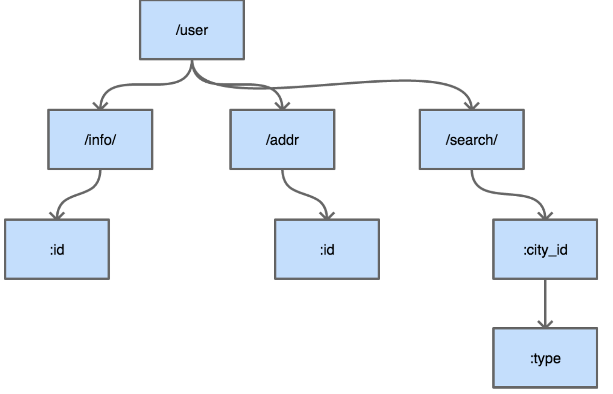
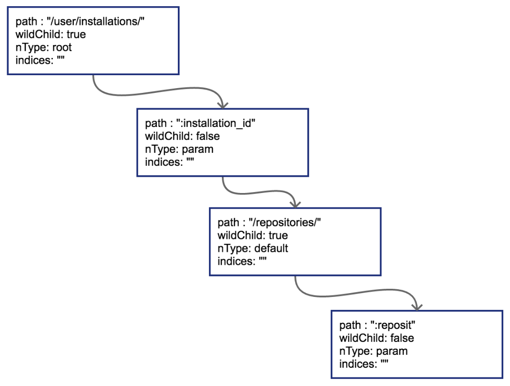
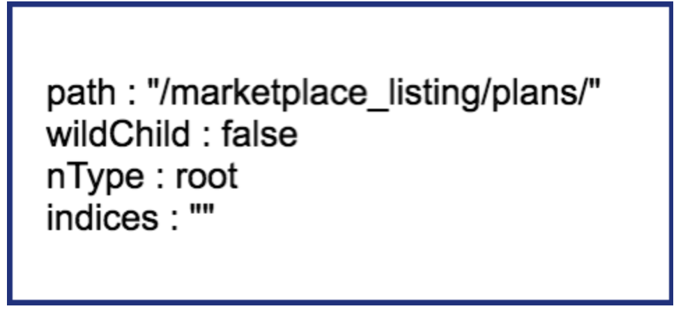
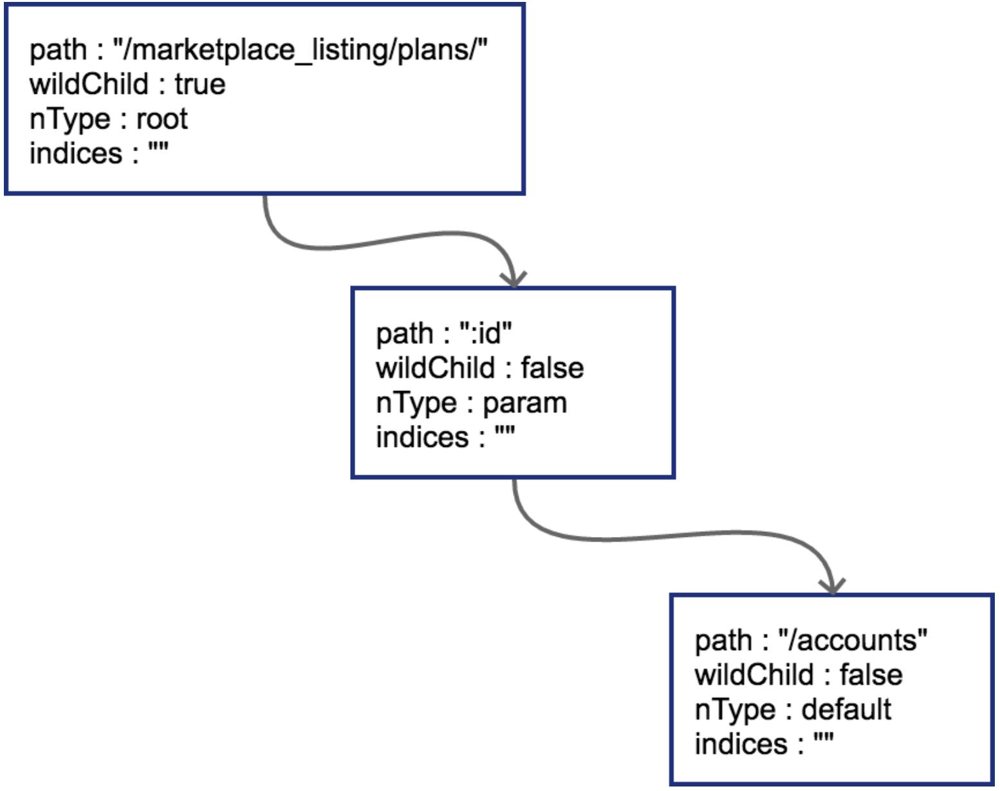
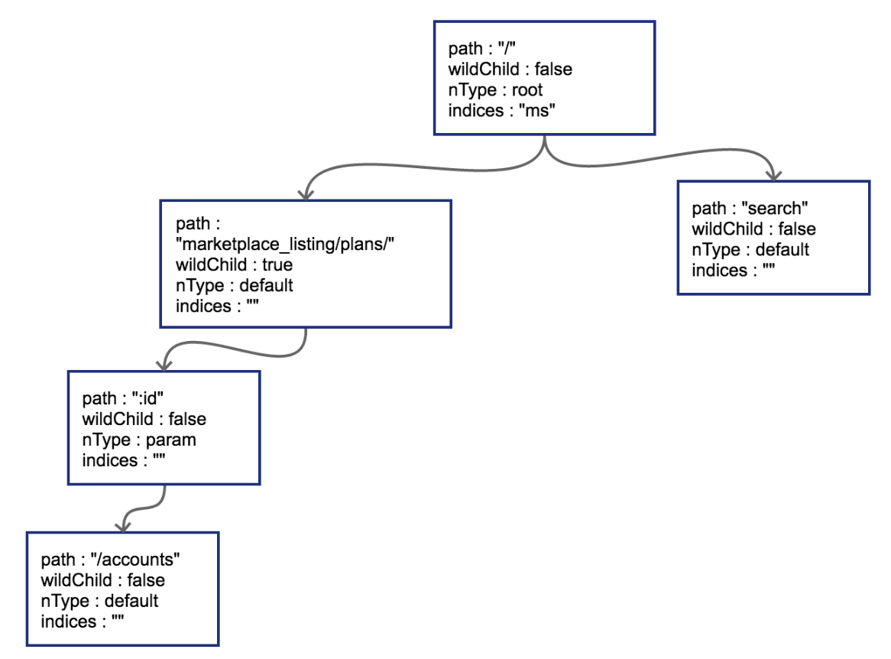
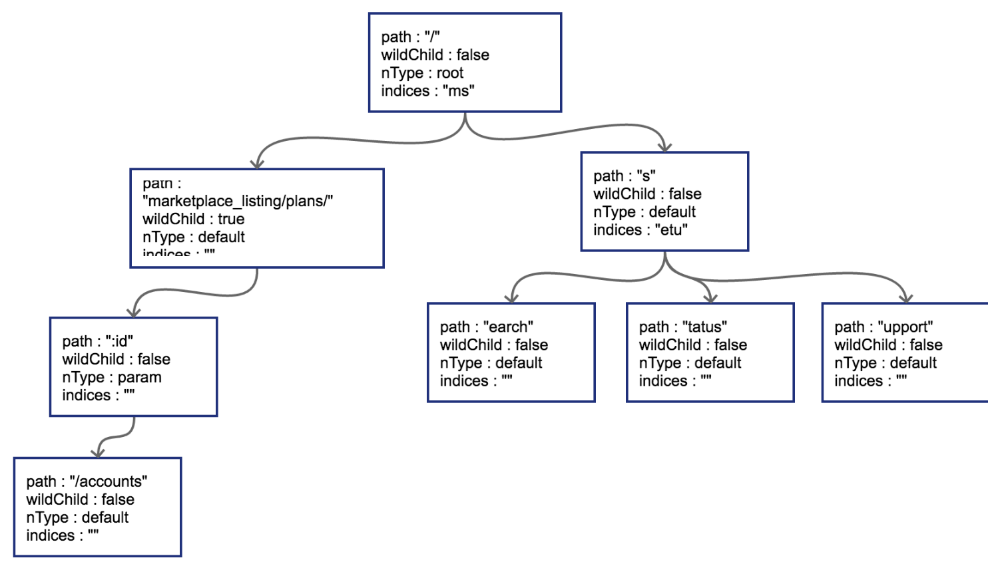
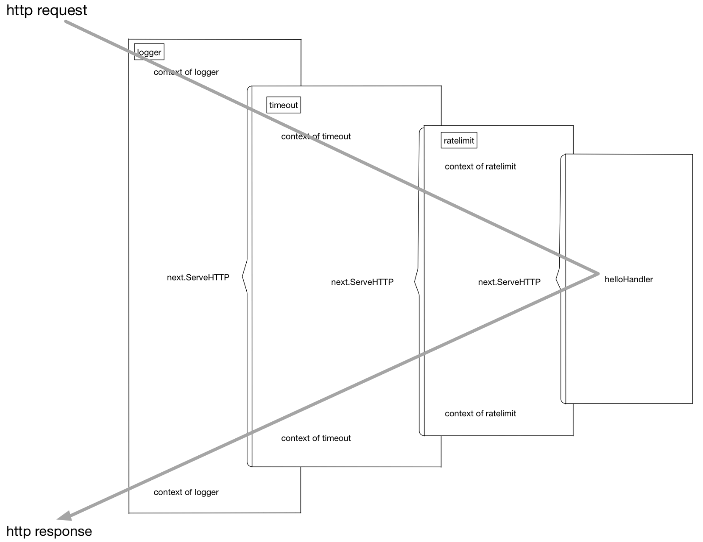
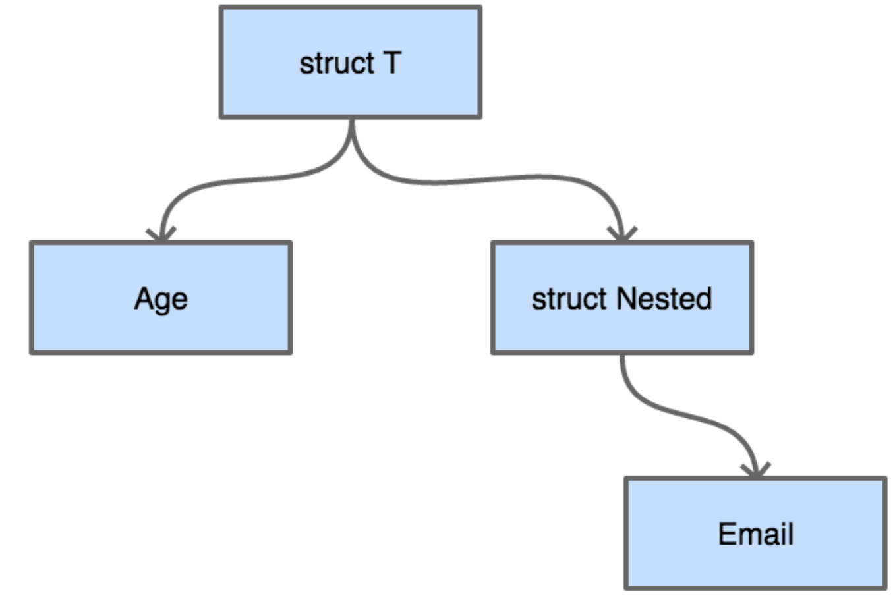
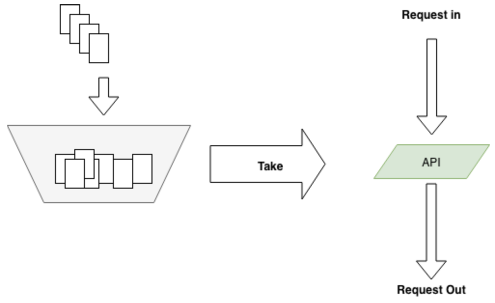

# Go-Web

## 简介

因为Go的`net/http`包提供了基础的路由函数组合与丰富的功能函数。所以在社区里流行一种用Go编写API不需要框架的观点，如果项目的路由在个位数、URI固定且不通过URI来传递参数，那么确实使用官方库也就足够。但在复杂场景下，官方的http库还是有些力有不逮。例如下面这样的路由：

```
GET   /card/:id
POST  /card/:id
DELTE /card/:id
GET   /card/:id/name
...
GET   /card/:id/relations
```

可见是否使用框架还是要具体问题具体分析的。

Go的Web框架大致可以分为这么两类：

1. Router框架
2. MVC类框架

在框架的选择上，大多数情况下都是依照个人的喜好和公司的技术栈。例如公司有很多技术人员是PHP出身，那么他们一定会非常喜欢像beego这样的框架，但如果公司有很多C程序员，那么他们的想法可能是越简单越好。比如很多大厂的C程序员甚至可能都会去用C语言去写很小的CGI程序，他们可能本身并没有什么意愿去学习MVC或者更复杂的Web框架，他们需要的只是一个非常简单的路由（甚至连路由都不需要，只需要一个基础的HTTP协议处理库来帮他省掉没什么意思的体力劳动）。

Go的`net/http`包提供的就是这样的基础功能，下面是一个简单的`http echo server`。

```go
func echo(wr http.ResponseWriter, r *http.Request) {
    msg, err := ioutil.ReadAll(r.Body)
    if err != nil {
        wr.Write([]byte("echo error"))
        return
    }

    writeLen, err := wr.Write(msg)
    if err != nil || writeLen != len(msg) {
        log.Println(err, "write len:", writeLen)
    }
}

func main() {
    http.HandleFunc("/", echo)
    err := http.ListenAndServe(":8080", nil)
    if err != nil {
        log.Fatal(err)
    }
}
```

如果面临的情况比较复杂，例如几十个接口的企业级应用，直接用`net/http`库就显得不太合适了。

我们来看看开源社区中一个Kafka监控项目中的做法==实际上，新版的实现已经改为使用 router 了 hhhhh==：

```go
//Burrow: http_server.go
func NewHttpServer(app *ApplicationContext) (*HttpServer, error) {
    ...
    server.mux.HandleFunc("/", handleDefault)

    server.mux.HandleFunc("/burrow/admin", handleAdmin)

    server.mux.Handle("/v2/kafka", appHandler{server.app, handleClusterList})
    server.mux.Handle("/v2/kafka/", appHandler{server.app, handleKafka})
    server.mux.Handle("/v2/zookeeper", appHandler{server.app, handleClusterList})
    ...
}
// 新版代码：
// This is a healthcheck and readiness URLs. Please don't change it
hc.router.GET("/burrow/admin", hc.handleAdmin)
hc.router.GET("/burrow/admin/ready", hc.handleReady)
hc.router.Handler(http.MethodGet, "/metrics", hc.handlePrometheusMetrics())
// All valid paths go here.......
hc.router.GET("/v3/kafka", hc.handleClusterList)
hc.router.GET("/v3/kafka/:cluster", hc.handleClusterDetail)
hc.router.GET("/v3/kafka/:cluster/topic", hc.handleTopicList)
hc.router.GET("/v3/kafka/:cluster/topic/:topic", hc.handleTopicDetail)
hc.router.GET("/v3/kafka/:cluster/topic/:topic/consumers", hc.handleTopicConsumerList)
hc.router.GET("/v3/kafka/:cluster/consumer", hc.handleConsumerList)
hc.router.GET("/v3/kafka/:cluster/consumer/:consumer", hc.handleConsumerDetail)
hc.router.GET("/v3/kafka/:cluster/consumer/:consumer/status", hc.handleConsumerStatus)
hc.router.GET("/v3/kafka/:cluster/consumer/:consumer/lag", hc.handleConsumerStatusComplete)
```

上面这段代码来自大名鼎鼎的linkedin公司的Kafka监控项目Burrow，没有使用任何router框架，只使用了`net/http`。只看上面这段代码似乎非常优雅，项目里大概只有这五个简单的URI，所以提供的服务就是下面这个样子：

```go
/
/burrow/admin
/v2/kafka
/v2/kafka/
/v2/zookeeper
```

如果确实这么想的话就被骗了。再进`handleKafka()`这个函数一探究竟：

```go
func handleKafka(app *ApplicationContext, w http.ResponseWriter, r *http.Request) (int, string) {
    pathParts := strings.Split(r.URL.Path[1:], "/")
    if _, ok := app.Config.Kafka[pathParts[2]]; !ok {
        return makeErrorResponse(http.StatusNotFound, "cluster not found", w, r)
    }
    if pathParts[2] == "" {
        // Allow a trailing / on requests
        return handleClusterList(app, w, r)
    }
    if (len(pathParts) == 3) || (pathParts[3] == "") {
        return handleClusterDetail(app, w, r, pathParts[2])
    }

    switch pathParts[3] {
    case "consumer":
        switch {
        case r.Method == "DELETE":
            switch {
            case (len(pathParts) == 5) || (pathParts[5] == ""):
                return handleConsumerDrop(app, w, r, pathParts[2], pathParts[4])
            default:
                return makeErrorResponse(http.StatusMethodNotAllowed, "request method not supported", w, r)
            }
        case r.Method == "GET":
            switch {
            case (len(pathParts) == 4) || (pathParts[4] == ""):
                return handleConsumerList(app, w, r, pathParts[2])
            case (len(pathParts) == 5) || (pathParts[5] == ""):
                // Consumer detail - list of consumer streams/hosts? Can be config info later
                return makeErrorResponse(http.StatusNotFound, "unknown API call", w, r)
            case pathParts[5] == "topic":
                switch {
                case (len(pathParts) == 6) || (pathParts[6] == ""):
                    return handleConsumerTopicList(app, w, r, pathParts[2], pathParts[4])
                case (len(pathParts) == 7) || (pathParts[7] == ""):
                    return handleConsumerTopicDetail(app, w, r, pathParts[2], pathParts[4], pathParts[6])
                }
            case pathParts[5] == "status":
                return handleConsumerStatus(app, w, r, pathParts[2], pathParts[4], false)
            case pathParts[5] == "lag":
                return handleConsumerStatus(app, w, r, pathParts[2], pathParts[4], true)
            }
        default:
            return makeErrorResponse(http.StatusMethodNotAllowed, "request method not supported", w, r)
        }
    case "topic":
        switch {
        case r.Method != "GET":
            return makeErrorResponse(http.StatusMethodNotAllowed, "request method not supported", w, r)
        case (len(pathParts) == 4) || (pathParts[4] == ""):
            return handleBrokerTopicList(app, w, r, pathParts[2])
        case (len(pathParts) == 5) || (pathParts[5] == ""):
            return handleBrokerTopicDetail(app, w, r, pathParts[2], pathParts[4])
        }
    case "offsets":
        // Reserving this endpoint to implement later
        return makeErrorResponse(http.StatusNotFound, "unknown API call", w, r)
    }

    // If we fell through, return a 404
    return makeErrorResponse(http.StatusNotFound, "unknown API call", w, r)
}
```

因为默认的`net/http`包中的`mux`不支持带参数的路由，所以Burrow这个项目使用了非常蹩脚的字符串`Split`和乱七八糟的 `switch case`来达到自己的目的，但却让本来应该很集中的路由管理逻辑变得复杂，散落在系统的各处，难以维护和管理。而系统总是从这样微不足道的混乱开始积少成多，最终变得难以收拾。

根据经验，简单地来说，只要路由带有参数，并且这个项目的API数目超过了10，就尽量不要使用`net/http`中默认的路由。在Go开源界应用最广泛的router是httpRouter，很多开源的router框架都是基于httpRouter进行一定程度的改造的成果。

再来回顾一下开头说的，开源界有这么几种框架，第一种是对httpRouter进行简单的封装，然后提供定制的中间件和一些简单的小工具集成比如gin，主打轻量，易学，高性能。第二种是借鉴其它语言的编程风格的一些MVC类框架，例如beego，方便从其它语言迁移过来的程序员快速上手，快速开发。还有一些框架功能更为强大，除了数据库schema设计，大部分代码直接生成，例如goa。不管哪种框架，适合开发者背景的就是最好的。


## router 请求路由

在常见的Web框架中，router是必备的组件。Go语言圈子里router也时常被称为`http`的multiplexer。通过对Burrow代码的简单学习，已经知道如何用`http`标准库中内置的mux来完成简单的路由功能了。

RESTful是几年前刮起的API设计风潮，在RESTful中除了GET和POST之外，还使用了HTTP协议定义的几种其它的标准化语义。具体包括：

```go
const (
    MethodGet     = "GET"
    MethodHead    = "HEAD"
    MethodPost    = "POST"
    MethodPut     = "PUT"
    MethodPatch   = "PATCH" // RFC 5789
    MethodDelete  = "DELETE"
    MethodConnect = "CONNECT"
    MethodOptions = "OPTIONS"
    MethodTrace   = "TRACE"
)
```

来看看RESTful中常见的请求路径：

```shell
GET /repos/:owner/:repo/comments/:id/reactions

POST /projects/:project_id/columns

PUT /user/starred/:owner/:repo

DELETE /user/starred/:owner/:repo
```

RESTful风格的API重度依赖请求路径。会将很多参数放在请求URI中。除此之外还会使用很多并不那么常见的HTTP状态码。

如果系统也想要这样的URI设计，使用标准库的`mux`显然就力不从心了。


### httprouter

较流行的开源go Web框架大多使用httprouter，或是基于httprouter的变种对路由进行支持。前面提到的github的参数式路由在httprouter中都是可以支持的。

因为httprouter中使用的是显式匹配，所以在设计路由的时候需要规避一些会导致路由冲突的情况，例如：

```
conflict:
GET /user/info/:name
GET /user/:id

no conflict:
GET /user/info/:name
POST /user/:id
```

简单来讲的话，如果两个路由拥有一致的http方法(指 GET/POST/PUT/DELETE)和请求路径前缀，且在某个位置出现了A路由是wildcard（指:id这种形式）参数，B路由则是普通字符串，那么就会发生路由冲突。路由冲突会在初始化阶段直接panic：

```shell
panic: wildcard route ':id' conflicts with existing children in path '/user/:id'
```

还有一点需要注意，因为httprouter考虑到字典树的深度，在初始化时会对参数的数量进行限制，所以在路由中的参数数目不能超过255，否则会导致httprouter无法识别后续的参数。不过这一点上也不用考虑太多，毕竟URI是人设计且给人来看的，相信没有长得夸张的URI能在一条路径中带有200个以上的参数。

除支持路径中的wildcard参数之外，httprouter还可以支持`*`号来进行通配，不过`*`号开头的参数只能放在路由的结尾，例如下面这样：

```shell
Pattern: /src/*filepath

 /src/                     filepath = ""
 /src/somefile.go          filepath = "somefile.go"
 /src/subdir/somefile.go   filepath = "subdir/somefile.go"
```

这种设计在RESTful中可能不太常见，主要是为了能够使用httprouter来做简单的HTTP静态文件服务器。

除了正常情况下的路由支持，httprouter也支持对一些特殊情况下的回调函数进行定制，例如404的时候：

```go
r := httprouter.New()
r.NotFound = http.HandlerFunc(func(w http.ResponseWriter, r *http.Request) {
    w.Write([]byte("oh no, not found"))
})
```

或者内部panic的时候：

```go
r.PanicHandler = func(w http.ResponseWriter, r *http.Request, c interface{}) {
    log.Printf("Recovering from panic, Reason: %#v", c.(error))
    w.WriteHeader(http.StatusInternalServerError)
    w.Write([]byte(c.(error).Error()))
}
```

目前开源界最为流行（star数最多）的Web框架[gin](https://github.com/gin-gonic/gin)使用的就是httprouter的变种。


### 原理

**httprouter和众多衍生router使用的数据结构被称为压缩字典树（Radix Tree）**。

字典树常用来进行字符串检索，例如用给定的字符串序列建立字典树。对于目标字符串，只要从根节点开始深度优先搜索，即可判断出该字符串是否曾经出现过，时间复杂度为`O(n)`，n可以认为是目标字符串的长度。为什么要这样做？字符串本身不像数值类型可以进行数值比较，两个字符串对比的时间复杂度取决于字符串长度。如果不用字典树来完成上述功能，要对历史字符串进行排序，再利用二分查找之类的算法去搜索，时间复杂度只高不低。可认为字典树是一种空间换时间的典型做法。

普通的字典树有一个比较明显的缺点，就是每个字母都需要建立一个孩子节点，这样会导致字典树的层数比较深，**压缩字典树相对好地平衡了字典树的优点和缺点**。是典型的压缩字典树结构：



每个节点上不只存储一个字母了，这也是压缩字典树中“压缩”的主要含义。**使用压缩字典树可以减少树的层数，同时因为每个节点上数据存储也比通常的字典树要多，所以程序的局部性较好（一个节点的path加载到cache即可进行多个字符的对比），从而对CPU缓存友好**。


### 压缩字典树创建过程

跟踪一下httprouter中，一个典型的压缩字典树的创建过程，路由设定如下：

```
PUT /user/installations/:installation_id/repositories/:repository_id

GET /marketplace_listing/plans/
GET /marketplace_listing/plans/:id/accounts
GET /search
GET /status
GET /support

补充路由：
GET /marketplace_listing/plans/ohyes
```


#### root 节点创建

httprouter的Router结构体中存储压缩字典树使用的是下述数据结构：

```go
// 略去了其它部分的 Router struct
type Router struct {
    // ...
    trees map[string]*node
    // ...
}
const (
	static nodeType = iota // default
	root
	param
	catchAll
)

type node struct {
	path      string
	indices   string
	wildChild bool
	nType     nodeType
	priority  uint32
	children  []*node
	handle    Handle
}
```

`trees`中的`key`即为HTTP 1.1的RFC中定义的各种方法，具体有：

```shell
GET
HEAD
OPTIONS
POST
PUT
PATCH
DELETE
```

**每一种方法对应的都是一棵独立的压缩字典树，这些树彼此之间不共享数据。具体到我们上面用到的路由，`PUT`和`GET`是两棵树而非一棵。**

简单来讲，某个方法第一次插入的路由就会导致对应字典树的根节点被创建，按顺序，先是一个`PUT`：

```go
r := httprouter.New()
r.PUT("/user/installations/:installation_id/repositories/:reposit", Hello)
```

这样`PUT`对应的根节点就会被创建出来。把这棵`PUT`的树画出来：



节点类型为`*httprouter.node`，为了说明方便，留下了目前关心的几个字段：

```
path: 当前节点对应的路径中的字符串

wildChild: 子节点是否为参数节点，即 wildcard node，或者说 :id 这种类型的节点

nType: 当前节点类型，有四个枚举值: 分别为 static/root/param/catchAll。
    static                   // 非根节点的普通字符串节点
    root                     // 根节点
    param                    // 参数节点，例如 :id
    catchAll                 // 通配符节点，例如 *anyway

indices：子节点索引，当子节点为非参数类型，即本节点的wildChild为false时，会将每个子节点的首字母放在该索引数组。说是数组，实际上是个string。
```

当然，`PUT`路由只有唯一的一条路径。

#### 子节点插入

当插入`GET /marketplace_listing/plans`时，类似前面PUT的过程，



因为第一个路由没有参数，path都被存储到根节点上了。所以只有一个节点。

然后插入`GET /marketplace_listing/plans/:id/accounts`，新的路径与之前的路径有共同的前缀，且可以直接在之前叶子节点后进行插入



由于`:id`这个节点只有一个字符串的普通子节点，所以indices还依然不需要处理。

上面这种情况比较简单，新的路由可以直接作为原路由的子节点进行插入。


#### 边分裂

接下来插入`GET /search`，这时会导致树的边分裂



原有路径和新的路径在初始的`/`位置发生分裂，这样需要把原有的root节点内容下移，再将新路由 `search`同样作为子节点挂在root节点之下。这时候因为子节点出现多个，root节点的indices提供子节点索引，这时候该字段就需要派上用场了。"ms"代表子节点的首字母分别为m（marketplace）和s（search）。

把`GET /status`和`GET /support`也插入到树中。这时候会导致在`search`节点上再次发生分裂



#### 子节点冲突处理

在路由本身只有字符串的情况下，不会发生任何冲突。只有当路由中含有wildcard（类似 :id）或者catchAll的情况下才可能冲突。

子节点的冲突处理很简单，分几种情况：

1. 在插入wildcard节点时，父节点的children数组非空且wildChild被设置为false。例如：`GET /user/getAll`和`GET /user/:id/getAddr`，或者`GET /user/*aaa`和`GET /user/:id`。
2. 在插入wildcard节点时，父节点的children数组非空且wildChild被设置为true，但该父节点的wildcard子节点要插入的wildcard名字不一样。例如：`GET /user/:id/info`和`GET /user/:name/info`。
3. 在插入catchAll节点时，父节点的children非空。例如：`GET /src/abc`和`GET /src/*filename`，或者`GET /src/:id`和`GET /src/*filename`。
4. 在插入static节点时，父节点的wildChild字段被设置为true。
5. 在插入static节点时，父节点的children非空，且子节点nType为catchAll。

**只要发生冲突，都会在初始化的时候panic**。例如，在插入路由`GET /marketplace_listing/plans/ohyes`时，出现第4种冲突情况：它的父节点`marketplace_listing/plans/`的wildChild字段为true。


## 中间件

对现在流行的Web框架中的中间件(middleware)技术原理进行分析，并介绍如何使用中间件技术将业务和非业务代码功能进行解耦。

### 代码泥潭

先来看一段代码：

```go
// middleware/hello.go
package main

func hello(wr http.ResponseWriter, r *http.Request) {
    wr.Write([]byte("hello"))
}

func main() {
    http.HandleFunc("/", hello)
    err := http.ListenAndServe(":8080", nil)
    ...
}
```

这是一个典型的Web服务，挂载了一个简单的路由。线上服务一般也是从这样简单的服务开始逐渐拓展开去的。

现在突然来了一个新的需求，想要统计之前写的hello服务的处理耗时，需求很简单，对上面的程序进行少量修改：

```go
// middleware/hello_with_time_elapse.go
var logger = log.New(os.Stdout, "", 0)

func hello(wr http.ResponseWriter, r *http.Request) {
    timeStart := time.Now()
    wr.Write([]byte("hello"))
    timeElapsed := time.Since(timeStart)
    logger.Println(timeElapsed)
}
```

这样便可以在每次接收到http请求时，打印出当前请求所消耗的时间。

完成了这个需求之后，继续进行业务开发，提供的API逐渐增加，每一个handler里都有之前提到的记录运行时间的代码，每次增加新的路由我们也同样需要把这些看起来长得差不多的代码拷贝到需要的地方去。因为代码不太多，所以实施起来也没有遇到什么大问题。

渐渐的系统增加到了30个路由和`handler`函数，每次增加新的handler，第一件工作就是把之前写的所有和业务逻辑无关的周边代码先拷贝过来。

一旦有一天，需求发生变化，统计时间不能只是打印，需要上传服务器，或者有任何其它的非功能或统计需求，修改必然牵一发而动全身。只要增加一个非常简单的非业务统计，就需要去几十个handler里增加这些业务无关的代码。


### 使用中间件剥离非业务逻辑

**犯的最大的错误，是把业务代码和非业务代码揉在了一起**。对于大多数的场景来讲，非业务的需求都是在http请求处理前做一些事情，并且在响应完成之后做一些事情。有没有办法使用一些重构思路把这些公共的非业务功能代码剥离出去呢？回到刚开头的例子，需要给我们的`helloHandler()`增加超时时间统计，**可以使用一种叫`function adapter`的方法来对`helloHandler()`进行包装**：

```go
func hello(wr http.ResponseWriter, r *http.Request) {
    wr.Write([]byte("hello"))
}

func timeMiddleware(next http.Handler) http.Handler {
    return http.HandlerFunc(func(wr http.ResponseWriter, r *http.Request) {
        timeStart := time.Now()

        // next handler
        next.ServeHTTP(wr, r)

        timeElapsed := time.Since(timeStart)
        logger.Println(timeElapsed)
    })
}

func main() {
    http.Handle("/", timeMiddleware(http.HandlerFunc(hello)))
    err := http.ListenAndServe(":8080", nil)
    ...
}
```

这样就非常轻松地实现了业务与非业务之间的剥离，魔法就在于这个`timeMiddleware`。可以从代码中看到，的`timeMiddleware()`也是一个函数，其参数为`http.Handler`，`http.Handler`的定义在`net/http`包中：

```go
type Handler interface {
    ServeHTTP(ResponseWriter, *Request)
}
```

任何方法实现了`ServeHTTP`，即是一个合法的`http.Handler`，先来梳理一下http库的`Handler`，`HandlerFunc`和`ServeHTTP`的关系：

```go
type Handler interface {
    ServeHTTP(ResponseWriter, *Request)
}

type HandlerFunc func(ResponseWriter, *Request)

func (f HandlerFunc) ServeHTTP(w ResponseWriter, r *Request) {
    f(w, r)
}
```

只要handler函数签名是：

```go
func (ResponseWriter, *Request)
```

那么这个`handler`和`http.HandlerFunc()`就有了一致的函数签名，可以将该`handler()`函数进行类型转换，转为`http.HandlerFunc`。而`http.HandlerFunc`实现了`http.Handler`这个接口。在`http`库需要调用handler函数来处理http请求时，会调用`HandlerFunc()`的`ServeHTTP()`函数，可见一个请求的基本调用链是这样的：

```go
h = getHandler() => h.ServeHTTP(w, r) => h(w, r)
```

上面提到的把自定义`handler`转换为`http.HandlerFunc()`这个过程是必须的，因为`handler`没有直接实现`ServeHTTP`这个接口。上面的代码中看到的HandleFunc(注意HandlerFunc和HandleFunc的区别)里也可以看到这个强制转换过程：

```go
func HandleFunc(pattern string, handler func(ResponseWriter, *Request)) {
    DefaultServeMux.HandleFunc(pattern, handler)
}

// 调用
func (mux *ServeMux) HandleFunc(pattern string, handler func(ResponseWriter, *Request)) {
    mux.Handle(pattern, HandlerFunc(handler)) // 源码也转了
}
```

知道handler是怎么一回事，中间件通过包装handler，再返回一个新的handler就好理解了。

总结一下，中间件要做的事情就是通过一个或多个函数对handler进行包装，返回一个包括了各个中间件逻辑的函数链。把上面的包装再做得复杂一些：

```go
customizedHandler = logger(timeout(ratelimit(helloHandler)))
```

这个函数链在执行过程中的上下文可以用下图表示



再直白一些，这个流程在进行请求处理的时候就是不断地进行函数压栈再出栈，有一些类似于递归的执行流：

```
[exec of logger logic]           函数栈: []

[exec of timeout logic]          函数栈: [logger]

[exec of ratelimit logic]        函数栈: [timeout/logger]

[exec of helloHandler logic]     函数栈: [ratelimit/timeout/logger]

[exec of ratelimit logic part2]  函数栈: [timeout/logger]

[exec of timeout logic part2]    函数栈: [logger]

[exec of logger logic part2]     函数栈: []
```

功能实现了，但在上面的使用过程中也看到，这种函数套函数的用法不是很美观，同时也不具备什么可读性。


### 更优雅的中间件写法

上一节中解决了业务功能代码和非业务功能代码的解耦，但也提到了，看起来并不美观，如果需要修改这些函数的顺序，或者增删中间件还是有点费劲，下面进行一些“写法”上的优化。

看一个例子：

```go
r = NewRouter()
r.Use(logger)
r.Use(timeout)
r.Use(ratelimit)
r.Add("/", helloHandler)
```

通过多步设置，拥有了和上一节差不多的执行函数链。胜在直观易懂，如果要增加或者删除中间件，只要简单地增加删除对应的`Use()`调用就可以了。非常方便。

从框架的角度来讲，怎么实现这样的功能呢？也不复杂==太牛逼了==：

```go
type middleware func(http.Handler) http.Handler

type Router struct {
    middlewareChain [] middleware
    mux map[string] http.Handler
}

func NewRouter() *Router{
    return &Router{}
}

func (r *Router) Use(m middleware) {
    r.middlewareChain = append(r.middlewareChain, m)
}

func (r *Router) Add(route string, h http.Handler) {
    var mergedHandler = h

    for i := len(r.middlewareChain) - 1; i >= 0; i-- {
        mergedHandler = r.middlewareChain[i](mergedHandler)
    }

    r.mux[route] = mergedHandler
}
```

注意代码中的`middleware`数组遍历顺序，和用户希望的调用顺序应该是"相反"的。


## 请求校验 Validator

### 重构请求校验函数

假设数据已经通过某个开源绑定库绑定到了具体的结构体上。

```go
type RegisterReq struct {
    Username       string   `json:"username"`
    PasswordNew    string   `json:"password_new"`
    PasswordRepeat string   `json:"password_repeat"`
    Email          string   `json:"email"`
}

func register(req RegisterReq) error{
    if len(req.Username) > 0 {
        if len(req.PasswordNew) > 0 && len(req.PasswordRepeat) > 0 {
            if req.PasswordNew == req.PasswordRepeat {
                if emailFormatValid(req.Email) {
                    createUser()
                    return nil
                } else {
                    return errors.New("invalid email")
                }
            } else {
                return errors.New("password and reinput must be the same")
            }
        } else {
            return errors.New("password and password reinput must be longer than 0")
        }
    } else {
        return errors.New("length of username cannot be 0")
    }
}
```

这种代码一般怎么进行优化呢？

很简单，在《重构》一书中已经给出了方案：[Guard Clauses](https://refactoring.com/catalog/replaceNestedConditionalWithGuardClauses.html)。

```go
func register(req RegisterReq) error{
    if len(req.Username) == 0 {
        return errors.New("length of username cannot be 0")
    }

    if len(req.PasswordNew) == 0 || len(req.PasswordRepeat) == 0 {
        return errors.New("password and password reinput must be longer than 0")
    }

    if req.PasswordNew != req.PasswordRepeat {
        return errors.New("password and reinput must be the same")
    }

    if emailFormatValid(req.Email) {
        return errors.New("invalid email")
    }

    createUser()
    return nil
}
```

代码更清爽，看起来也不那么别扭了。这是比较通用的重构理念。虽然使用了重构方法使校验过程代码看起来优雅了，但还是得为每一个`http`请求都去写这么一套差不多的`validate()`函数，有没有更好的办法来帮助解除这项体力劳动？答案就是validator。


### 用validator解放体力劳动

从设计的角度讲，一般会为每个请求都声明一个结构体。前文中提到的校验场景都可以通过validator完成工作。

这里我们引入一个新的validator库：

> https://github.com/go-playground/validator

使用 `go get github.com/go-playground/validator/v10` 可以下载 validator 库。

```go
import "github.com/go-playground/validator/v10"

type RegisterReq struct {
    // 字符串的 gt=0 表示长度必须 > 0，gt = greater than
    Username       string   `validate:"gt=0"`
    // 同上
    PasswordNew    string   `validate:"gt=0"`
    // eqfield 跨字段相等校验
    PasswordRepeat string   `validate:"eqfield=PasswordNew"`
    // 合法 email 格式校验
    Email          string   `validate:"email"`
}

var validate = validator.New()

func validateFunc(req RegisterReq) error {
    err := validate.Struct(req)
    if err != nil {
        doSomething()
        return err
    }
    ...
}
```


### 原理

从结构上来看，每一个结构体都可以看成是一棵树。假如有如下定义的结构体：

```go
type Nested struct {
    Email string `validate:"email"`
}
type T struct {
    Age    int `validate:"eq=10"`
    Nested Nested
}
```

把这个结构体画成一棵树



从字段校验的需求来讲，无论采用深度优先搜索还是广度优先搜索来对这棵结构体树来进行遍历，都是可以的。

下面是递归的深度优先搜索方式的遍历示例：

```go
package main

import (
    "fmt"
    "reflect"
    "regexp"
    "strconv"
    "strings"
)

type Nested struct {
    Email string `validate:"email"`
}
type T struct {
    Age    int `validate:"eq=10"`
    Nested Nested
}

func validateEmail(input string) bool {
    if pass, _ := regexp.MatchString(
        `^([\w\.\_]{2,10})@(\w{1,}).([a-z]{2,4})$`, input,
    ); pass {
        return true
    }
    return false
}

func validate(v interface{}) (bool, string) {
    validateResult := true
    errmsg := "success"
    vt := reflect.TypeOf(v)
    vv := reflect.ValueOf(v)
    for i := 0; i < vv.NumField(); i++ {
        fieldVal := vv.Field(i)
        tagContent := vt.Field(i).Tag.Get("validate")
        k := fieldVal.Kind()

        switch k {
        case reflect.Int:
            val := fieldVal.Int()
            tagValStr := strings.Split(tagContent, "=")
            tagVal, _ := strconv.ParseInt(tagValStr[1], 10, 64)
            if val != tagVal {
                errmsg = "validate int failed, tag is: "+ strconv.FormatInt(
                    tagVal, 10,
                )
                validateResult = false
            }
        case reflect.String:
            val := fieldVal.String()
            tagValStr := tagContent
            switch tagValStr {
            case "email":
                nestedResult := validateEmail(val)
                if nestedResult == false {
                    errmsg = "validate mail failed, field val is: "+ val
                    validateResult = false
                }
            }
        case reflect.Struct:
            // 递归
            valInter := fieldVal.Interface()
            nestedResult, msg := validate(valInter)
            if nestedResult == false {
                validateResult = false
                errmsg = msg
            }
        }
    }
    return validateResult, errmsg
}

func main() {
    var a = T{Age: 10, Nested: Nested{Email: "abc@abc.com"}}

    validateResult, errmsg := validate(a)
    fmt.Println(validateResult, errmsg)
}
```

这里简单地对`eq=x`和`email`这两个tag进行了支持。

开源校验组件在功能上要远比这里复杂的多。**但原理很简单，就是用反射对结构体进行树形遍历**。这时候可能会产生一个问题，对结构体进行校验时大量使用了反射，而Go的反射在性能上不太出众，有时甚至会影响到程序的性能。这样的考虑确实有一些道理，但需要对结构体进行大量校验的场景往往出现在Web服务，这里并不一定是程序的性能瓶颈所在。

如果基于反射的校验真的成为了服务的性能瓶颈怎么办？现在也有一种思路可以避免反射：使用Go内置的Parser对源代码进行扫描，然后根据结构体的定义生成校验代码。


## 服务流量限制

### 流量限制手段

流量限制的手段有很多，最常见的：漏桶、令牌桶两种：

1. 漏桶是指有一个一直装满了水的桶，每过固定的一段时间即向外漏一滴水。如果接到了这滴水，那么就可以继续服务请求，如果没有接到，那么就需要等待下一滴水。
2. 令牌桶则是指匀速向桶中添加令牌，服务请求时需要从桶中获取令牌，令牌的数目可以按照需要消耗的资源进行相应的调整。如果没有令牌，可以选择等待，或者放弃。

这两种方法看起来很像，不过还是有区别的。漏桶流出的速率固定，而令牌桶只要在桶中有令牌，那就可以拿。也就是说令牌桶是允许一定程度的并发的，比如同一个时刻，有100个用户请求，只要令牌桶中有100个令牌，那么这100个请求全都会放过去。令牌桶在桶中没有令牌的情况下也会退化为漏桶模型。



实际应用中令牌桶应用较为广泛，开源界流行的限流器大多数都是基于令牌桶思想的。并且在此基础上进行了一定程度的扩充，比如`github.com/juju/ratelimit`提供了几种不同特色的令牌桶填充方式：

```go
func NewBucket(fillInterval time.Duration, capacity int64) *Bucket
```

默认的令牌桶，`fillInterval`指每过多长时间向桶里放一个令牌，`capacity`是桶的容量，超过桶容量的部分会被直接丢弃。桶初始是满的。

```go
func NewBucketWithQuantum(fillInterval time.Duration, capacity, quantum int64) *Bucket
```

和普通的`NewBucket()`的区别是，每次向桶中放令牌时，是放`quantum`个令牌，而不是一个令牌。

```go
func NewBucketWithRate(rate float64, capacity int64) *Bucket
```

这个就有点特殊了，会按照提供的比例，每秒钟填充令牌数。例如`capacity`是100，而`rate`是0.1，那么每秒会填充10个令牌。

从桶中获取令牌也提供了几个API：

```go
func (tb *Bucket) Take(count int64) time.Duration {}
func (tb *Bucket) TakeAvailable(count int64) int64 {}
func (tb *Bucket) TakeMaxDuration(count int64, maxWait time.Duration) (
    time.Duration, bool,
) {}
func (tb *Bucket) Wait(count int64) {}
func (tb *Bucket) WaitMaxDuration(count int64, maxWait time.Duration) bool {}
```

相比于开源界更为有名的Google的Java工具库Guava中提供的ratelimiter，这个库不支持令牌桶预热，且无法修改初始的令牌容量，所以可能个别极端情况下的需求无法满足。但在明白令牌桶的基本原理之后，如果没办法满足需求，也可以很快对其进行修改并支持自己的业务场景。


### 原理

从功能上来看，令牌桶模型就是对全局计数的加减法操作过程，但使用计数需要加读写锁。Go语言可以用buffered channel来完成简单的加令牌取令牌操作：

```go
var tokenBucket = make(chan struct{}, capacity)
```

每过一段时间向`tokenBucket`中添加`token`，如果`bucket`已经满了，那么直接放弃：

```go
package main

import (
    "fmt"
    "time"
)

func main() {
    var fillInterval = time.Millisecond * 10
    var capacity = 100
    var tokenBucket = make(chan struct{}, capacity)

    fillToken := func() {
        ticker := time.NewTicker(fillInterval)
        for {
            select {
            case <-ticker.C:
                select {
                case tokenBucket <- struct{}{}:
                default:
                }
                fmt.Println("current token cnt:", len(tokenBucket), time.Now())
            }
        }
    }

    go fillToken()
    time.Sleep(time.Hour)
}
```

看看运行结果：

```shell
current token cnt: 98 2024-07-25 14:53:00.838811 +0800 CST m=+0.981385292
current token cnt: 99 2024-07-25 14:53:00.848822 +0800 CST m=+0.991396584
current token cnt: 100 2024-07-25 14:53:00.858807 +0800 CST m=+1.001381376
current token cnt: 100 2024-07-25 14:53:00.868807 +0800 CST m=+1.011381834
current token cnt: 100 2024-07-25 14:53:00.877826 +0800 CST m=+1.020400084
```

在1s钟的时候刚好填满100个，没有太大的偏差。不过这里可以看到，Go的定时器存在大约0.001s的误差，所以如果令牌桶大小在1000以上的填充可能会有一定的误差。对于一般的服务来说，这一点误差无关紧要。

上面的令牌桶的取令牌操作实现起来也比较简单：

```go
func TakeAvailable(block bool) bool{
    var takenResult bool
    if block {
        select {
        case <-tokenBucket:
            takenResult = true
        }
    } else {
      	// 非阻塞，如果当前 tokenBucket 没有数据，就会直接走 default
        select {
        case <-tokenBucket:
            takenResult = true
        default:
            takenResult = false
        }
    }
    return takenResult
}
```

一些公司自己造的限流的轮子就是用上面这种方式来实现的，不过如果开源版 ratelimit 也如此的话，那也没什么可说的了。现实并不是这样的。

思考一下，令牌桶每隔一段固定的时间向桶中放令牌，如果记下上一次放令牌的时间为 t1，和当时的令牌数k1，放令牌的时间间隔为ti，每次向令牌桶中放x个令牌，令牌桶容量为cap。现在如果有人来调用`TakeAvailable`来取n个令牌，这个时刻记为t2。在t2时刻，令牌桶中理论上应该有多少令牌呢？伪代码如下：

```go
cur = k1 + ((t2 - t1)/ti) * x
cur = cur > cap ? cap : cur
```

用两个时间点的时间差，再结合其它的参数，理论上在取令牌之前就完全可以知道桶里有多少令牌了。那劳心费力地向channel里填充token的操作，理论上是没有必要的。只要在每次`Take`的时候，再对令牌桶中的token数进行简单计算，就可以得到正确的令牌数。

在得到正确的令牌数之后，再进行实际的`Take`操作就好，这个`Take`操作只需要对令牌数进行简单的减法即可，记得加锁以保证并发安全。`github.com/juju/ratelimit`这个库就是这样做的。


