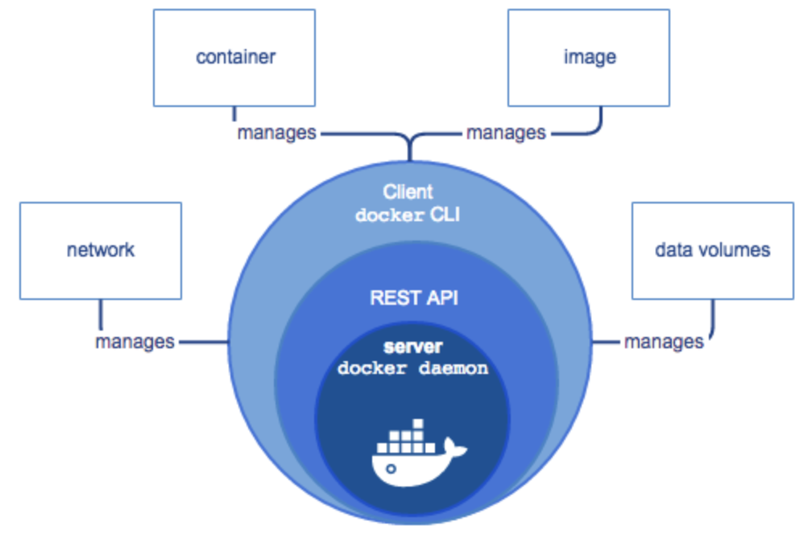
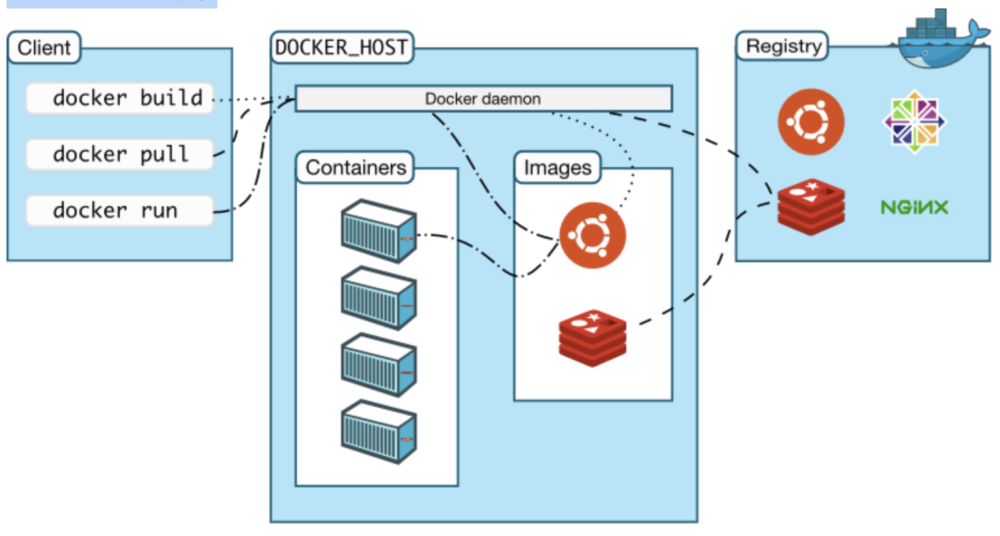
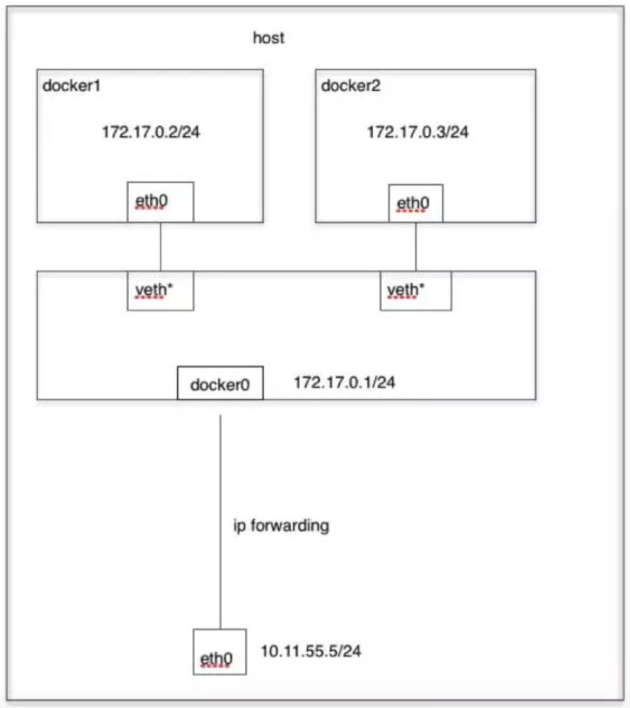
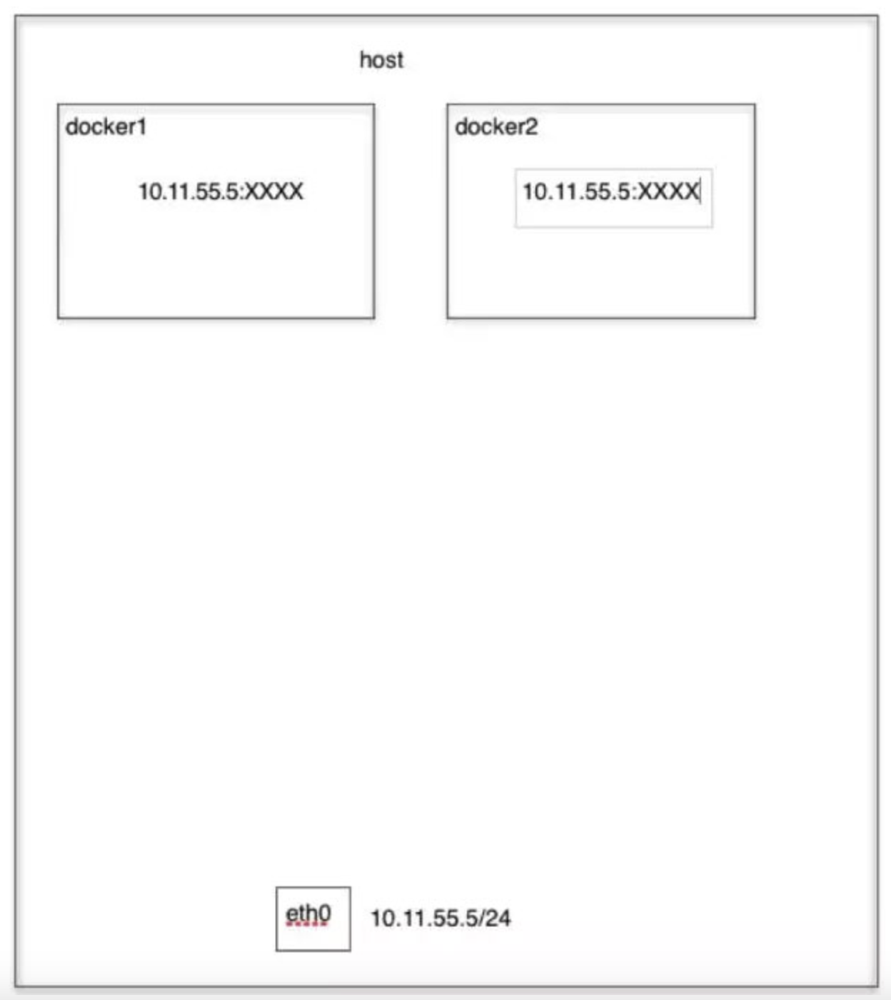
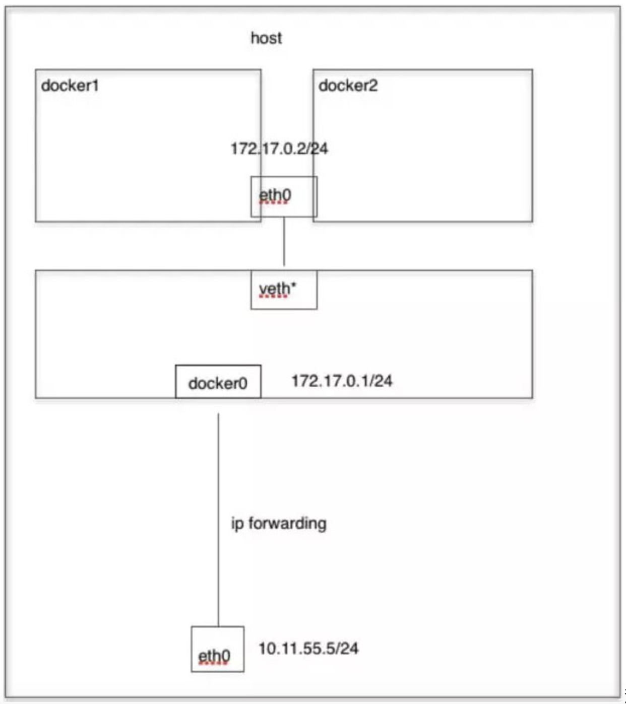

# Docker基础

## intro

`Docker`的英文翻译是“搬运工”的意思，他搬运的东西就是常说的集装箱`Container`，Container 里面装的是任意类型的 App，开发人员可以通过 Docker 将App 变成一种标准化的、可移植的、自管理的组件，可以在任何主流的操作系统中开发、调试和运行。

从概念上来看 Docker 和传统的虚拟机比较类似，只是更加轻量级，更加方便使，Docker 和虚拟机最主要的区别有以下几点：

- 虚拟化技术依赖的是物理CPU和内存，是硬件级别的；而 Docker 是构建在操作系统层面的，利用操作系统的容器化技术，所以 Docker 同样的可以运行在虚拟机上面。
- 虚拟机中的系统就是常说的操作系统镜像，比较复杂；而 Docker 比较轻量级，可以用 Docker 部署一个独立的 Redis，就类似于在虚拟机当中安装一个 Redis 应用，但是用 Docker 部署的应用是完全隔离的。
- 传统的虚拟化技术是通过快照来保存状态的；而 Docker 引入了类似于源码管理的机制，将容器的快照历史版本一一记录下来，切换成本非常之低。
- 传统虚拟化技术在构建系统的时候非常复杂；而 Docker 可以通过一个简单的 Dockerfile 文件来构建整个容器，更重要的是 Dockerfile 可以手动编写，这样应用程序开发人员可以通过发布 Dockerfile 来定义应用的环境和依赖，这样对于持续交付非常有利。

### docker engine

`Docker Engine`是一个**C/S**架构的应用程序，主要包含下面几个组件：

- 常驻后台进程`Dockerd`
- 一个用来和 Dockerd 交互的 REST API Server
- 命令行`CLI`接口，通过和 REST API 进行交互（即 docker 命令）



### docker 架构

Docker 使用 C/S （客户端/服务器）体系的架构，Docker 客户端与 Docker 守护进程通信，Docker 守护进程负责构建，运行和分发 Docker 容器。Docker 客户端和守护进程可以在同一个系统上运行，也可以将 Docker 客户端连接到远程 Docker 守护进程。Docker 客户端和守护进程使用 REST API 通过`UNIX`套接字或网络接口进行通信。



- Docker Damon：dockerd，用来监听 Docker API 的请求和管理 Docker 对象，比如镜像、容器、网络和 Volume。
- Docker Client：docker，docker client 是和 Docker 进行交互的最主要的方式方法，比如可以通过 docker run 命令来运行一个容器，然后这个 client 会把命令发送给上面的 Dockerd，让他来做真正事情。
- Docker Registry：用来存储 Docker 镜像的仓库，Docker Hub 是 Docker 官方提供的一个公共仓库，而且 Docker 默认也是从 Docker Hub 上查找镜像的，也可以运行一个私有仓库，当使用 docker pull 或者 docker run 命令时，就会从配置的 Docker 镜像仓库中去拉取镜像，使用 docker push 命令时，会将构建的镜像推送到对应的镜像仓库中。
- Images：镜像，镜像是一个只读模板，带有创建 Docker 容器的说明，一般来说的，镜像会基于另外的一些基础镜像并加上一些额外的自定义功能。比如，构建一个基于 Centos 的镜像，然后在这个基础镜像上面安装一个 Nginx 服务器。
- Containers：容器，容器是一个镜像的可运行的实例，可以使用 Docker REST API 或者 CLI 来操作容器，容器的实质是进程，但与直接在宿主执行的进程不同，容器进程运行于属于自己的独立的[命名空间](https://en.wikipedia.org/wiki/Linux_namespaces)。因此容器可以拥有自己的 **root 文件系统、自己的网络配置、自己的进程空间，甚至自己的用户 ID 空间**。容器内的进程是运行在一个隔离的环境里，使用起来，就好像是在一个独立于宿主的系统下操作一样。这种特性使得容器封装的应用比直接在宿主运行更加安全。
- 底层技术支持：Namespaces（做隔离）、CGroups（做资源限制）、UnionFS（镜像和容器的分层） the-underlying-technology Docker 底层架构分析


## 镜像大小

`docker image ls`列表中的镜像体积总和并非是所有镜像实际硬盘消耗。由于 Docker 镜像是多层存储结构，并且可以继承、复用，因此不同镜像可能会因为使用相同的基础镜像，从而拥有共同的层。由于 Docker 使用`Union FS`，相同的层只需要保存一份即可，因此实际镜像硬盘占用空间很可能要比这个列表镜像大小的总和要小的多。可以通过以下命令来便捷的查看镜像、容器、数据卷所占用的空间。

```sh
docker system df
```

## 进入容器

在使用`-d`参数时，容器启动后会进入后台。某些时候需要进入容器进行操作：**exec 命令 -i -t 参数**。

只用`-i`参数时，由于没有分配伪终端，界面没有`Linux`命令提示符，但命令执行结果仍然可以返回。 当`-i -t`参数一起使用时，则可以看到熟悉的 `Linux`命令提示符。

```shell
$ docker run -dit ubuntu:16.04
69d137adef7a8a689cbcb059e94da5489d3cddd240ff675c640c8d96e84fe1f6

$ docker container ls
CONTAINER ID        IMAGE               COMMAND             CREATED             STATUS              PORTS               NAMES
69d137adef7a        ubuntu:16.04       "/bin/bash"         18 seconds ago      Up 17 seconds                           zealous_swirles

$ docker exec -i 69d1 bash
ls
bin
boot
dev
...

$ docker exec -it 69d1 bash
root@69d137adef7a:/#
```

如果从这个 stdin 中 exit，不会导致容器的停止。这就是为什么推荐大家使用`docker exec`的原因。

## 镜像构建上下文（Context）

如果注意，会看到 docker build 命令最后有一个`.`。`.`表示当前目录，而 Dockerfile 就在当前目录，因此不少初学者以为这个路径是在指定 Dockerfile 所在路径，这么理解其实是不准确的，这是在指定上下文路径。那么什么是上下文呢？

首先要理解 docker build 的工作原理。Docker 在运行时分为 Docker 引擎（也就是服务端守护进程）和客户端工具。Docker 的引擎提供了一组 REST API，被称为 Docker Remote API，而如 docker 命令这样的客户端工具，则是通过这组 API 与 Docker 引擎交互，从而完成各种功能。因此，虽然表面上好像是在本机执行各种 docker 功能，但实际上，一切都是使用的远程调用形式在服务端（Docker 引擎）完成。也因为这种 C/S 设计，让操作远程服务器的 Docker 引擎变得轻而易举。

当进行镜像构建的时候，并非所有定制都会通过 RUN 指令完成，经常会需要将一些本地文件复制进镜像，比如通过 COPY 指令、ADD 指令等。而 docker build 命令构建镜像，其实并非在本地构建，而是在服务端，也就是 Docker 引擎中构建的。那么在这种客户端/服务端的架构中，如何才能让服务端获得本地文件呢？

这就引入了上下文的概念。当构建的时候，用户会指定构建镜像上下文的路径，docker build 命令得知这个路径后，**会将路径下的所有内容打包，然后上传给 Docker 引擎**。这样 Docker 引擎收到这个上下文包后，展开就会获得构建镜像所需的一切文件。如果在 Dockerfile 中这么写：

```docker
COPY ./package.json /app/
```

这并不是要复制执行 docker build 命令所在的目录下的 package.json，也不是复制 Dockerfile 所在目录下的 package.json，而是复制 上下文（context） 目录下的 package.json。

因此，`COPY`这类指令中的源文件的路径都是相对路径。这也是初学者经常会问的为什么 COPY ../package.json /app 或者 COPY /opt/xxxx /app 无法工作的原因，因为这些**路径已经超出了上下文的范围**，Docker 引擎无法获得这些位置的文件。如果真的需要那些文件，应该将它们复制到上下文目录中去。

现在就可以理解命令`docker build -t nginx:v3 .`中的这个`.`，实际上是在指定上下文的目录，docker build 命令会将该目录下的内容打包交给 Docker 引擎以帮助构建镜像。

理解构建上下文对于镜像构建是很重要的，可以避免犯一些不应该的错误。比如有些初学者在发现 COPY /opt/xxxx /app 不工作后，于是干脆将 Dockerfile 放到了硬盘根目录去构建，结果发现 docker build 执行后，在发送一个几十 GB 的东西，极为缓慢而且很容易构建失败。那是因为这种做法是在让 docker build 打包整个硬盘，这显然是使用错误。

一般来说，应该会将 Dockerfile 置于一个空目录下，或者项目根目录下。如果该目录下没有所需文件，那么应该把所需文件复制一份过来。如果目录下有些东西确实不希望构建时传给 Docker 引擎，那么**可以用 .gitignore 一样的语法写一个`.dockerignore`**，该文件是用于剔除不需要作为上下文传递给 Docker 引擎的。

那么为什么会有人误以为 **.** 是指定 Dockerfile 所在目录呢？这是因为在默认情况下，如果不额外指定 Dockerfile 的话，会将上下文目录下的名为 Dockerfile 的文件作为 Dockerfile。

这只是默认行为，实际上 Dockerfile 的文件名并不要求必须为 Dockerfile，而且并不要求必须位于上下文目录中，比如可以用`-f ../Dockerfile.php`参数指定某个文件作为 Dockerfile。

当然，一般大家习惯性的会使用默认的文件名 Dockerfile，以及会将其置于镜像构建上下文目录中。

## 数据共享和持久化

### 数据卷

`数据卷`是一个可供一个或多个容器使用的特殊目录，它绕过`UFS`，可以提供很多有用的特性：

- 数据卷 可以在容器之间共享和重用
- 对 数据卷 的修改会立马生效
- 对 数据卷 的更新，不会影响镜像
- 数据卷 默认会一直存在，即使容器被删除

> 注意：数据卷 的使用，类似于 Linux 下对目录或文件进行 mount，镜像中的被指定为挂载点的目录中的文件会隐藏掉，能显示看的是挂载的 数据卷。

创建一个数据卷：

```shell
$ docker volume create xxxx
```

查看所有的 数据卷：

```shell
$ liushun@liushun ~ % docker volume ls
DRIVER    VOLUME NAME
local     59c7246b01ad2856f5c65bafd6774b0465a89b9572e2db318c59c86b912d831e
local     71f69c428bd706b35640e09b4c5033b9893ec997f80f4edb7cc873a1368d3c92
```

在主机里使用以下命令可以查看指定 数据卷 的信息

```shell
$ liushun@liushun ~ % docker volume inspect 59c7246b01ad2856f5c65bafd6774b0465a89b9572e2db318c59c86b912d831e
[
    {
        "CreatedAt": "2024-08-06T02:22:55Z",
        "Driver": "local",
        "Labels": {
            "com.docker.volume.anonymous": ""
        },
        "Mountpoint": "/var/lib/docker/volumes/59c7246b01ad2856f5c65bafd6774b0465a89b9572e2db318c59c86b912d831e/_data",
        "Name": "59c7246b01ad2856f5c65bafd6774b0465a89b9572e2db318c59c86b912d831e",
        "Options": null,
        "Scope": "local"
    }
]
```

启动一个挂载数据卷的容器：在用`docker run`命令的时候，使用`--mount`标记来将 数据卷 挂载到容器里。在一次`docker run`中可以挂载多个 数据卷。下面创建一个名为 web 的容器，并加载一个 数据卷 到容器的 /webapp 目录。

```shell
$ docker run -d -P \
    --name prometheus \
    # -v my-vol:/wepapp \
    --mount source=xxx,target=/prometheus \
    prometheus
```

查看数据卷的具体信息：在主机里使用以下命令可以查看 web 容器的信息

```shell
$ docker inspect prometheus
...
"Mounts": [
    {
        "Type": "volume",
        "Name": "59c7246b01ad2856f5c65bafd6774b0465a89b9572e2db318c59c86b912d831e",
        "Source": "/var/lib/docker/volumes/59c7246b01ad2856f5c65bafd6774b0465a89b9572e2db318c59c86b912d831e/_data",
        "Destination": "/prometheus",
        "Driver": "local",
        "Mode": "",
        "RW": true,
        "Propagation": ""
    }
],
...
```

删除数据卷：

```sh
$ docker volume rm xxx
```

数据卷 是被设计用来持久化数据的，它的生命周期独立于容器，Docker 不会在容器被删除后自动删除 数据卷，并且也不存在垃圾回收这样的机制来处理没有任何容器引用的 数据卷。如果需要在删除容器的同时移除数据卷。可以在删除容器的时候使用`docker rm -v`这个命令。 无主的数据卷可能会占据很多空间，要清理请使用以下命令

```sh
$ docker volume prune
```

### 挂载主机目录

挂载一个主机目录（也可以是文件）作为数据卷：使用 `--mount` 标记可以指定挂载一个本地主机的目录到容器中去。

```shell
$ docker run -d -P \
    --name web \
    # -v /src/webapp:/dst/webapp \
    --mount type=bind,source=/src/webapp,target=/dst/webapp \
    training/webapp \
    python app.py
```

上面的命令加载主机的 /src/webapp 目录到容器的 /dst/webapp目录。这个功能在进行测试的时候十分方便，比如用户可以放置一些程序到本地目录中，来查看容器是否正常工作。**本地目录的路径必须是绝对路径**，以前使用 -v 参数时如果本地目录不存在 Docker 会自动为你创建一个文件夹，现在使用 --mount 参数时如果本地目录不存在，Docker 会报错。

Docker 挂载主机目录的默认权限是 读写，用户也可以通过增加`readonly`指定为 只读,如果在容器内 /opt/webapp 目录新建文件，会报错。

```shell
$ docker run -d -P \
    --name web \
    # -v /src/webapp:/dst/webapp:ro \
    --mount type=bind,source=/src/webapp,target=/dst/webapp,readonly \
    training/webapp \
    python app.py
```

可以看到type 不一样，默认为 volume，如果是 bind 需要手动指定

```shell
$ docker inspect web
...
"Mounts": [
    {
        "Type": "bind",
        "Source": "/src/webapp",
        "Destination": "/opt/webapp",
        "Mode": "",
        "RW": true,
        "Propagation": "rprivate"
    }
],
```


## docker 网络模式

[这篇文章](https://blog.csdn.net/succing/article/details/122433770)写的很详细

### Bridge模式

当`Docker`进程启动时，会在主机上创建一个名为`docker0`的虚拟网桥，此主机上启动的`Docker`容器会连接到这个虚拟网桥上。虚拟网桥的工作方式和物理交换机类似，这样主机上的所有容器就通过交换机连在了一个二层网络中。从`docker0`子网中分配一个 IP 给容器使用，并设置 docker0 的 IP 地址为容器的**默认网关**。在主机上创建一对虚拟网卡`veth pair`设备，Docker 将 veth pair 设备的一端放在新创建的容器中，并命名为`eth0`（容器的网卡），另一端放在主机中，以`vethxxx`这样类似的名字命名，并将这个网络设备加入到 docker0 网桥中。

`bridge`模式是 docker 的默认网络模式，不写`–net`参数，就是`bridge`模式。使用`docker run -p`时，docker 实际是在`iptables`做了`DNAT`规则，实现端口转发功能。`bridge`模式如下图所示：



### Host 模式

如果启动容器的时候使用`host`模式，那么这个容器将不会获得一个独立的`Network Namespace`，而是和宿主机共用一个 Network Namespace。容器将不会虚拟出自己的网卡，配置自己的 IP 等，而是使用宿主机的 IP 和端口。但是，容器的其他方面，如文件系统、进程列表等还是和宿主机隔离的。 Host模式如下图所示：



### Container 模式

这个模式指定新创建的容器和已经存在的一个容器共享一个 Network Namespace，而不是和宿主机共享。新创建的容器不会创建自己的网卡，配置自己的 IP，而是和一个指定的容器共享 IP、端口范围等。同样，两个容器除了网络方面，其他的如文件系统、进程列表等还是隔离的。两个容器的进程可以通过 lo 网卡设备通信。 Container模式示意图：



### None模式

使用`none`模式，Docker 容器拥有自己的 Network Namespace，但是，并不为Docker 容器进行任何网络配置。也就是说，这个 Docker 容器没有网卡、IP、路由等信息。需要自己为 Docker 容器添加网卡、配置 IP 等。