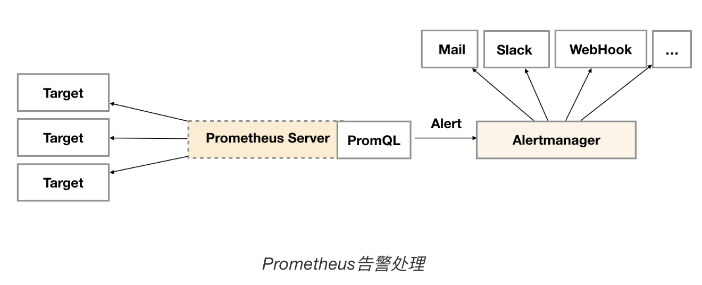
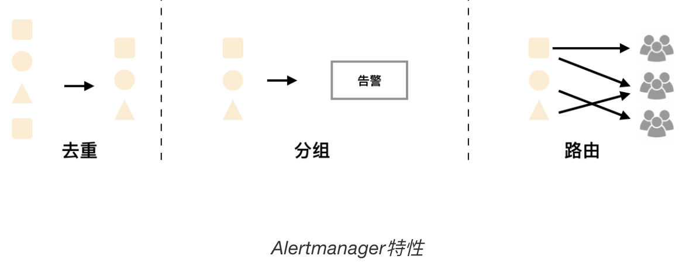
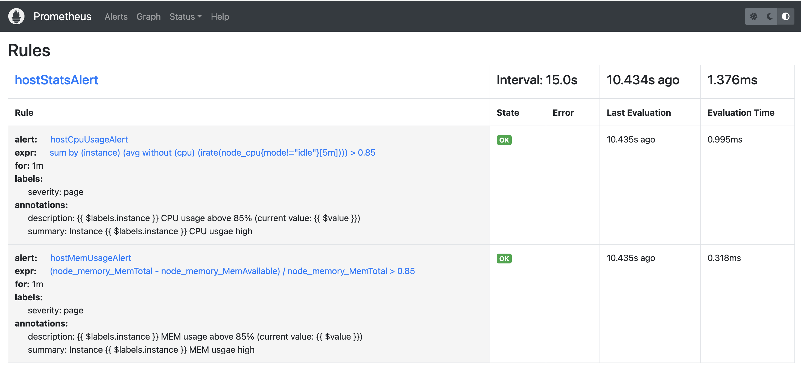
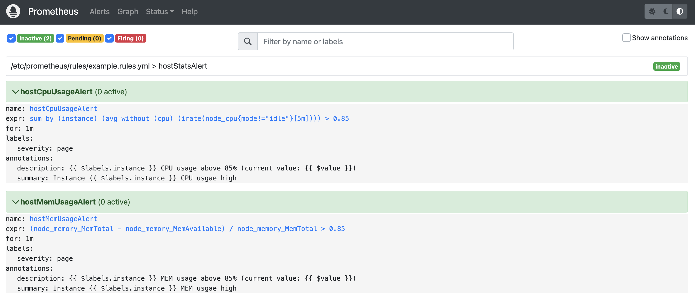
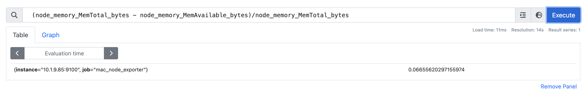
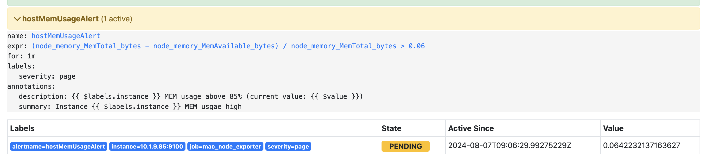
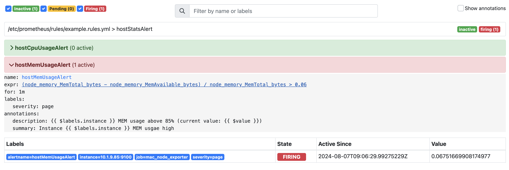
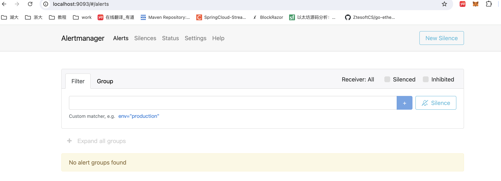
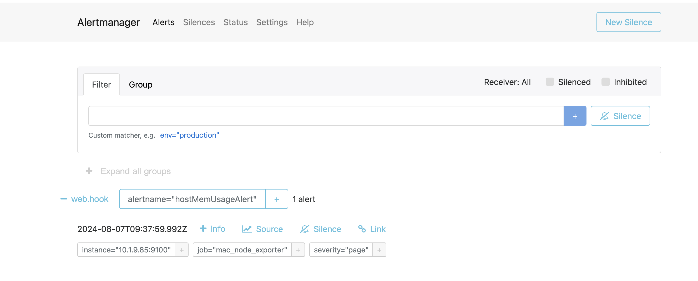
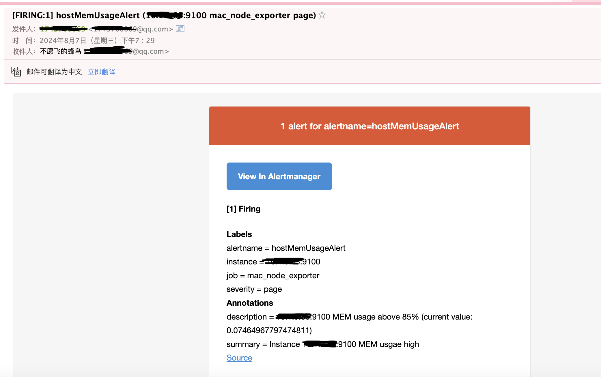

# Prometheus告警处理

告警能力在Prometheus的架构中被划分为两个部分，在Prometheus Server中定义告警规则以及产生告警，Alertmanager组件则用于处理这些由Prometheus产生的告警。Alertmanager即Prometheus体系中告警的统一处理中心。Alertmanager提供了多种内置第三方告警通知方式，同时还提供了对Webhook通知的支持，通过Webhook用户可以完成对告警更多个性化的扩展。


## 告警简介

告警能力在Prometheus的架构中被划分成两个独立的部分。如下所示，通过在Prometheus中定义AlertRule（告警规则），Prometheus会周期性的对告警规则进行计算，如果满足告警触发条件就会向Alertmanager发送告警信息。



在Prometheus中一条告警规则主要由以下几部分组成：

- 告警名称：用户需要为告警规则命名，当然对于命名而言，需要能够直接表达出该告警的主要内容
- 告警规则：告警规则实际上主要由PromQL进行定义，其实际意义是当表达式（PromQL）查询结果持续多长时间（During）后出发告警

在Prometheus中，还可以通过Group（告警组）对一组相关的告警进行统一定义。当然这些定义都是通过YAML文件来统一管理的。

Alertmanager作为一个独立的组件，负责接收并处理来自Prometheus Server(也可以是其它的客户端程序)的告警信息。Alertmanager可以对这些告警信息进行进一步的处理，比如当接收到大量重复告警时能够消除重复的告警信息，同时对告警信息进行分组并且路由到正确的通知方，Prometheus内置了对邮件，Slack等多种通知方式的支持，同时还支持与Webhook的集成，以支持更多定制化的场景。例如，目前Alertmanager还不支持钉钉，那用户完全可以通过Webhook与钉钉机器人进行集成，从而通过钉钉接收告警信息。同时AlertManager还提供了静默和告警抑制机制来对告警通知行为进行优化。


## Alertmanager特性

Alertmanager除了提供基本的告警通知能力以外，还主要提供了如：**分组、抑制以及静默等告警特性：**



### 分组

分组机制可以将详细的告警信息合并成一个通知。在某些情况下，比如由于系统宕机导致大量的告警被同时触发，在这种情况下分组机制可以将这些被触发的告警合并为一个告警通知，避免一次性接受大量的告警通知，而无法对问题进行快速定位。

例如，当集群中有数百个正在运行的服务实例，并且为每一个实例设置了告警规则。假如此时发生了网络故障，可能导致大量的服务实例无法连接到数据库，结果就会有数百个告警被发送到Alertmanager。

而作为用户，可能只希望能够在一个通知中中就能查看哪些服务实例收到影响。这时可以按照服务所在集群或者告警名称对告警进行分组，而将这些告警内聚在一起成为一个通知。

告警分组，告警时间，以及告警的接受方式可以通过Alertmanager的配置文件进行配置。

### 抑制

抑制是指当某一告警发出后，可以停止重复发送由此告警引发的其它告警的机制。

例如，当集群不可访问时触发了一次告警，通过配置Alertmanager可以忽略与该集群有关的其它所有告警。这样可以避免接收到大量与实际问题无关的告警通知。

抑制机制同样通过Alertmanager的配置文件进行设置。

### 静默

静默提供了一个简单的机制可以快速根据标签对告警进行静默处理。如果接收到的告警符合静默的配置，Alertmanager则不会发送告警通知。

静默设置需要在Alertmanager的Werb页面上进行设置。


## 自定义Prometheus告警规则

Prometheus中的告警规则允许你基于PromQL表达式定义告警触发条件，Prometheus后端对这些触发规则进行周期性计算，当满足触发条件后则会触发告警通知。默认情况下，用户可以通过Prometheus的Web界面查看这些告警规则以及告警的触发状态。当Promthues与Alertmanager关联之后，可以将告警发送到外部服务如Alertmanager中并通过Alertmanager可以对这些告警进行进一步的处理。

对于已经pending或者firing的告警，Prometheus也会将它们存储到时间序列ALERTS{}中。

可以通过表达式，查询告警实例：

```
ALERTS{alertname="<alert name>", alertstate="pending|firing", <additional alert labels>}
```

样本值为1表示当前告警处于活动状态（pending或者firing），当告警从活动状态转换为非活动状态时，样本值则为0。


### 告警规则定义文件

一条典型的告警规则如下所示：

```yaml
groups:
- name: example
  rules:
  - alert: HighErrorRate
    expr: job:request_latency_seconds:mean5m{job="myjob"} > 0.5
    for: 10m
    labels:
      severity: page
    annotations:
      summary: High request latency
      description: description info
```

在告警规则文件中，可以将一组相关的规则设置定义在一个group下。在每一个group中可以定义多个告警规则(rule)。一条告警规则主要由以下几部分组成：

- alert：告警规则的名称。
- expr：基于PromQL表达式告警触发条件，用于计算是否有时间序列满足该条件。
- for：评估等待时间，可选参数。用于表示只有当触发条件持续一段时间后才发送告警。在等待期间新产生告警的状态为pending。
- labels：自定义标签，允许用户指定要附加到告警上的一组附加标签。
- annotations：用于指定一组附加信息，比如用于描述告警详细信息的文字等，annotations的内容在告警产生时会一同作为参数发送到Alertmanager。

为了能够让Prometheus能够启用定义的告警规则，需要在Prometheus全局配置文件中通过**rule_files**指定一组告警规则文件的访问路径，Prometheus启动后会自动扫描这些路径下规则文件中定义的内容，并且根据这些规则计算是否向外部发送通知：

```
rule_files:
  [ - <filepath_glob> ... ]
```

默认情况下Prometheus会每分钟对这些告警规则进行计算，如果用户想定义自己的告警计算周期，则可以通过`evaluation_interval`来覆盖默认的计算周期：

```
global:
  [ evaluation_interval: <duration> | default = 1m ]
```


### 模版变量

一般来说，在告警规则文件的annotations中使用`summary`描述告警的概要信息，`description`用于描述告警的详细信息。同时Alertmanager的UI也会根据这两个标签值，显示告警信息。为了让告警信息具有更好的可读性，Prometheus支持模板化label和annotations的中标签的值。

通过`$labels.<labelname>`变量可以访问当前告警实例中指定标签的值。$value则可以获取当前PromQL表达式计算的样本值。

```yaml
# To insert a firing element's label values:
{{ $labels.<labelname> }}
# To insert the numeric expression value of the firing element:
{{ $value }}
```

例如，可以通过模板化优化summary以及description的内容的可读性：

```yaml
groups:
- name: example
  rules:

  # Alert for any instance that is unreachable for >5 minutes.
  - alert: InstanceDown
    expr: up == 0
    for: 5m
    labels:
      severity: page
    annotations:
      summary: "Instance {{ $labels.instance }} down"
      description: "{{ $labels.instance }} of job {{ $labels.job }} has been down for more than 5 minutes."

  # Alert for any instance that has a median request latency >1s.
  - alert: APIHighRequestLatency
    expr: api_http_request_latencies_second{quantile="0.5"} > 1
    for: 10m
    annotations:
      summary: "High request latency on {{ $labels.instance }}"
      description: "{{ $labels.instance }} has a median request latency above 1s (current value: {{ $value }}s)"
```


### 实战

修改Prometheus配置文件prometheus.yml,添加以下配置：

```yaml
rule_files:
  - /etc/prometheus/rules/*.rules.yml
```

可以在本地建一个rules文件夹，编写一个文件，然后上传到容器中，执行了几个指令cpu飙不上去，笑死，只能设置较低的内存阈值

```yml
groups:
- name: hostStatsAlert
  rules:
  - alert: hostCpuUsageAlert
    expr: sum(avg without (cpu)(irate(node_cpu_seconds_total{mode!='idle'}[5m]))) by (instance) > 0.1
    for: 1m
    labels:
      severity: page
    annotations:
      summary: "Instance {{ $labels.instance }} CPU usgae high"
      description: "{{ $labels.instance }} CPU usage above 85% (current value: {{ $value }})"
  - alert: hostMemUsageAlert
    expr: (node_memory_MemTotal_bytes - node_memory_MemAvailable_bytes)/node_memory_MemTotal_bytes > 0.06
    for: 1m
    labels:
      severity: page
    annotations:
      summary: "Instance {{ $labels.instance }} MEM usgae high"
      description: "{{ $labels.instance }} MEM usage above 85% (current value: {{ $value }})"
```

```sh
docker cp $PWD/Documents/docker/prometheus/rules/ prometheus:/etc/prometheus/rules/
```

然后查看Status/rules



然后查看Alerts



重启后，因为这个指令的条件一只满足



所以他会在重启之后就立马变成pending状态



然后持续一分钟后仍然达到条件，就会变成firing状态




## 部署AlertManager

目前为止，只能通过Prometheus UI查看当前告警的活动状态。接下来利用Prometheus体系中的另一个组件Alertmanager对这些触发的告警进行处理，实现告警通知。

docker安装并运行即可

```sh
docker pull prom/alertmanager
docker run -d -p 9093:9093  --name=alertmanager prom/alertmanager
```

Alertmanager有一个默认的alertmanager.yml配置文件，内容如下所示：

```yml
route:
  group_by: ['alertname']
  group_wait: 30s
  group_interval: 5m
  repeat_interval: 1h
  receiver: 'web.hook'
receivers:
  - name: 'web.hook'
    webhook_configs:
      - url: 'http://127.0.0.1:5001/'
inhibit_rules:
  - source_match:
      severity: 'critical'
    target_match:
      severity: 'warning'
    equal: ['alertname', 'dev', 'instance']
```

Alertmanager的配置主要包含两个部分：路由(route)以及接收器(receivers)。所有的告警信息都会从配置中的顶级路由(route)进入路由树，根据路由规则将告警信息发送给相应的接收器。

在Alertmanager中可以定义一组接收器，比如可以按照角色(比如系统运维，数据库管理员)来划分多个接收器。接收器可以关联邮件，Slack以及其它方式接收告警信息。

当前配置文件中定义了一个默认的接收者default-receiver由于这里没有设置接收方式，目前只相当于一个占位符。

在配置文件中使用route定义了顶级的路由，路由是一个基于标签匹配规则的树状结构。所有的告警信息从顶级路由开始，根据标签匹配规则进入到不同的子路由，并且根据子路由设置的接收器发送告警。目前配置文件中只设置了一个顶级路由route并且定义的接收器为default-receiver。因此，所有的告警都会发送给default-receiver。

部署好后，就可以访问



然后出发上面那个警告，可以看到这边就可以接收到了



## AlertManager配置

在Alertmanager中通过路由(Route)来定义告警的处理方式。路由是一个基于标签匹配的树状匹配结构。根据接收到告警的标签匹配相应的处理方式。

Alertmanager主要负责对Prometheus产生的告警进行统一处理，因此在Alertmanager配置中一般会包含以下几个主要部分：

- 全局配置（global）：用于定义一些全局的公共参数，如全局的SMTP配置，Slack配置等内容；
- 模板（templates）：用于定义告警通知时的模板，如HTML模板，邮件模板等；
- 告警路由（route）：根据标签匹配，确定当前告警应该如何处理；
- 接收人（receivers）：接收人是一个抽象的概念，它可以是一个邮箱也可以是微信，Slack或者Webhook等，接收人一般配合告警路由使用；
- 抑制规则（inhibit_rules）：合理设置抑制规则可以减少垃圾告警的产生

其完整配置格式如下：

```yml
global:
  [ resolve_timeout: <duration> | default = 5m ]
  [ smtp_from: <tmpl_string> ] 
  [ smtp_smarthost: <string> ] 
  [ smtp_hello: <string> | default = "localhost" ]
  [ smtp_auth_username: <string> ]
  [ smtp_auth_password: <secret> ]
  [ smtp_auth_identity: <string> ]
  [ smtp_auth_secret: <secret> ]
  [ smtp_require_tls: <bool> | default = true ]
  [ slack_api_url: <secret> ]
  [ victorops_api_key: <secret> ]
  [ victorops_api_url: <string> | default = "https://alert.victorops.com/integrations/generic/20131114/alert/" ]
  [ pagerduty_url: <string> | default = "https://events.pagerduty.com/v2/enqueue" ]
  [ opsgenie_api_key: <secret> ]
  [ opsgenie_api_url: <string> | default = "https://api.opsgenie.com/" ]
  [ hipchat_api_url: <string> | default = "https://api.hipchat.com/" ]
  [ hipchat_auth_token: <secret> ]
  [ wechat_api_url: <string> | default = "https://qyapi.weixin.qq.com/cgi-bin/" ]
  [ wechat_api_secret: <secret> ]
  [ wechat_api_corp_id: <string> ]
  [ http_config: <http_config> ]

templates:
  [ - <filepath> ... ]

route: <route>

receivers:
  - <receiver> ...

inhibit_rules:
  [ - <inhibit_rule> ... ]
```

在全局配置中需要注意的是`resolve_timeout`，该参数定义了当Alertmanager持续多长时间未接收到告警后标记告警状态为resolved（已解决）。该参数的定义可能会影响到告警恢复通知的接收时间，其默认值为5分钟。


### 告警路由

在Alertmanager的配置中会定义一个基于标签匹配规则的告警路由树，以确定在接收到告警后Alertmanager需要如何对其进行处理：

```yml
route: <route>
```

其中route中则主要定义了告警的路由匹配规则，以及Alertmanager需要将匹配到的告警发送给哪一个receiver，一个最简单的route定义如下所示：

```yml
route:
  group_by: ['alertname']
  receiver: 'web.hook'
receivers:
- name: 'web.hook'
  webhook_configs:
  - url: 'http://127.0.0.1:5001/'
```

如上所示：在Alertmanager配置文件中，只定义了一个路由，那就意味着所有由Prometheus产生的告警在发送到Alertmanager之后都会通过名为`web.hook`的receiver接收。这里的web.hook定义为一个webhook地址。当然实际场景下，告警处理可不是这么简单的一件事情，对于不同级别的告警，可能会不完全不同的处理方式，因此在route中，还可以定义更多的子Route，这些Route通过标签匹配告警的处理方式，route的完整定义如下：

```yml
[ receiver: <string> ]
[ group_by: '[' <labelname>, ... ']' ]
[ continue: <boolean> | default = false ]

match:
  [ <labelname>: <labelvalue>, ... ]

match_re:
  [ <labelname>: <regex>, ... ]

[ group_wait: <duration> | default = 30s ]
[ group_interval: <duration> | default = 5m ]
[ repeat_interval: <duration> | default = 4h ]

routes:
  [ - <route> ... ]
```

> 路由匹配

每一个告警都会从配置文件中顶级的route进入路由树，需要注意的是**顶级的route必须匹配所有告警(即不能有任何的匹配设置match和match_re)**，每一个路由都可以定义自己的接受人以及匹配规则。默认情况下，告警进入到顶级route后会遍历所有的子节点，直到找到最深的匹配route，并将告警发送到该route定义的receiver中。但如果route中设置continue的值为false，那么告警在匹配到第一个子节点之后就直接停止。如果continue为true，报警则会继续进行后续子节点的匹配。如果当前告警匹配不到任何的子节点，那该告警将会基于当前路由节点的接收器配置方式进行处理。

其中告警的匹配有两种方式可以选择。一种方式基于字符串验证，通过设置match规则判断当前告警中是否存在标签labelname并且其值等于labelvalue。第二种方式则基于正则表达式，通过设置match_re验证当前告警标签的值是否满足正则表达式的内容。

如果警报已经成功发送通知, 如果想设置再次发送告警通知之前要等待时间，则可以通过repeat_interval参数进行设置。

> 告警分组

Alertmanager可以对告警通知进行分组，将多条告警合合并为一个通知。这里可以使用group_by来定义分组规则。基于告警中包含的标签，如果满足group_by中定义标签名称，那么这些告警将会合并为一个通知发送给接收器。

有的时候为了能够一次性收集和发送更多的相关信息时，可以通过group_wait参数设置等待时间，如果在等待时间内当前group接收到了新的告警，这些告警将会合并为一个通知向receiver发送。

而group_interval配置，则用于定义相同的Group之间发送告警通知的时间间隔。

例如，当使用Prometheus监控多个集群以及部署在集群中的应用和数据库服务，并且定义以下的告警处理路由规则来对集群中的异常进行通知。

```yml
route:
  receiver: 'default-receiver'
  group_wait: 30s
  group_interval: 5m
  repeat_interval: 4h
  group_by: [cluster, alertname]
  routes:
  - receiver: 'database-pager'
    group_wait: 10s
    match_re:
      service: mysql|cassandra
  - receiver: 'frontend-pager'
    group_by: [product, environment]
    match:
      team: frontend
```

默认情况下所有的告警都会发送给集群管理员default-receiver，因此在Alertmanager的配置文件的根路由中，对告警信息按照集群以及告警的名称对告警进行分组。

如果告警时来源于数据库服务如MySQL或者Cassandra，此时则需要将告警发送给相应的数据库管理员(database-pager)。这里定义了一个单独子路由，如果告警中包含service标签，并且service为MySQL或者Cassandra,则向database-pager发送告警通知，由于这里没有定义group_by等属性，这些属性的配置信息将从上级路由继承，database-pager将会接收到按cluster和alertname进行分组的告警通知。

而某些告警规则来源可能来源于开发团队的定义，这些告警中通过添加标签team来标示这些告警的创建者。在Alertmanager配置文件的告警路由下，定义单独子路由用于处理这一类的告警通知，如果匹配到告警中包含标签team，并且team的值为frontend，Alertmanager将会按照标签product和environment对告警进行分组。此时如果应用出现异常，开发团队就能清楚的知道哪一个环境(environment)中的哪一个应用程序出现了问题，可以快速对应用进行问题定位。


### 内置告警接收器Receiver

在Alertmanager中路由负责对告警信息进行分组匹配，并向告警接收器发送通知。告警接收器可以通过以下形式进行配置：

```yml
receivers:
  - <receiver> ...
```

每一个receiver具有一个全局唯一的名称，并且对应一个或者多个通知方式：

```yml
name: <string>
email_configs:
  [ - <email_config>, ... ]
hipchat_configs:
  [ - <hipchat_config>, ... ]
pagerduty_configs:
  [ - <pagerduty_config>, ... ]
pushover_configs:
  [ - <pushover_config>, ... ]
slack_configs:
  [ - <slack_config>, ... ]
opsgenie_configs:
  [ - <opsgenie_config>, ... ]
webhook_configs:
  [ - <webhook_config>, ... ]
victorops_configs:
  [ - <victorops_config>, ... ]
```

目前官方内置的第三方通知集成包括：邮件、 即时通讯软件（如Slack、Hipchat）、移动应用消息推送(如Pushover)和自动化运维工具（例如：Pagerduty、Opsgenie、Victorops）。Alertmanager的通知方式中还可以支持Webhook，通过这种方式开发者可以实现更多个性化的扩展支持。

### 配置邮件服务

```yml
global:
  resolve_timeout: 5m
  smtp_from: 'xxxx@qq.com'
  smtp_smarthost: 'smtp.qq.com:465'
  smtp_auth_username: 'xxxx@qq.com'
  smtp_auth_password: 'qq开通smtp服务的key'
  smtp_require_tls: false
  smtp_hello: 'qq.com'
route:
  group_by: ['alertname']
  group_wait: 5s
  group_interval: 5s
  repeat_interval: 5m
  receiver: 'email'
receivers:
- name: 'email'
  email_configs:
  - to: 'xxx@qq.com'
    send_resolved: true
inhibit_rules:
  - source_match:
      severity: 'critical'
    target_match:
      severity: 'warning'
    equal: ['alertname', 'dev', 'instance']
```

修改好配置文件后，在此触发告警，就可以收到邮件了




### 其他

其他的配置信息，已经实战可以看[这这这这这这里](https://prometheus.wang/alert/alert-manager-use-receiver.html)