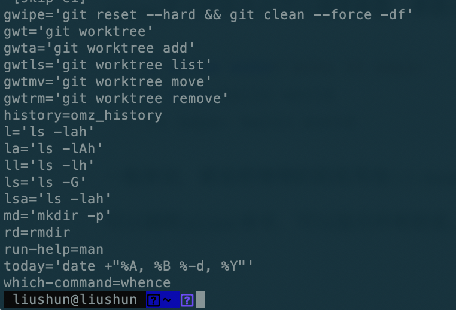
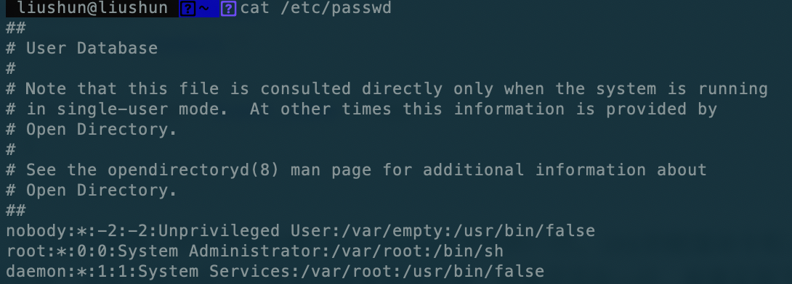

# Bash脚本

脚本（script）就是包含一系列命令的一个文本文件。Shell 读取这个文件，依次执行里面的所有命令，就好像这些命令直接输入到命令行一样。所有能够在命令行完成的任务，都能够用脚本完成。

脚本的好处是可以重复使用，也可以指定在特定场合自动调用，比如系统启动或关闭时自动执行脚本。


## 脚本入门

### Shebang 行

脚本的第一行通常是指定解释器，即这个脚本必须通过什么解释器执行。这一行以`#!`字符开头，这个字符称为 Shebang，所以这一行就叫做 Shebang 行。`#!`后面就是脚本解释器的位置，Bash 脚本的解释器一般是`/bin/sh`或`/bin/bash`。`#!`与脚本解释器之间有没有空格，都是可以的。

如果 Bash 解释器不放在目录`/bin`，脚本就无法执行了。为了保险，可以写成下面这样。

```bash
#!/usr/bin/env bash
```

上面命令使用`env`命令（这个命令总是在`/usr/bin`目录），返回 Bash 可执行文件的位置。

Shebang 行不是必需的，但是建议加上这行。如果缺少该行，就需要手动将脚本传给解释器。举例来说，脚本是`script.sh`，有 Shebang 行的时候，可以直接调用执行。

```sh
$ ./script.sh
```

如果没有 Shebang 行，就只能手动将脚本传给解释器来执行。

```sh
$ /bin/sh ./script.sh # 或者
$ bash ./script.sh
```


### 执行权限和路径

只要指定了 Shebang 行的脚本，可以直接执行。这有一个前提条件，就是脚本需要有执行权限。

```sh
# 给所有用户执行权限
$ chmod +x script.sh
# 给所有用户读权限和执行权限
$ chmod +rx script.sh# 或者
$ chmod 755 script.sh
# 只给脚本拥有者读权限和执行权限
$ chmod u+rx script.sh
```

脚本的权限通常设为`755`（拥有者有所有权限，其他人有读和执行权限）或者`700`（只有拥有者可以执行）。

除了执行权限，脚本调用时，一般需要指定脚本的路径（比如`path/script.sh`）。如果将脚本放在环境变量`$PATH`指定的目录中，就不需要指定路径了。因为 Bash 会自动到这些目录中，寻找是否存在同名的可执行文件。

建议在主目录新建一个`~/bin`子目录，专门存放可执行脚本，然后把`~/bin`加入`$PATH`。

```sh
export PATH=$PATH:~/bin
```

上面命令改变环境变量`$PATH`，将`~/bin`添加到`$PATH`的末尾。将这一行加到`~/.bashrc`文件里面.

以后不管在什么目录，直接输入脚本文件名，脚本就会执行。

```sh
$ script.sh
```


### env 命令

`env`命令总是指向`/usr/bin/env`文件，或者说，这个二进制文件总是在目录`/usr/bin`。

`#!/usr/bin/env NAME`这个语法的意思是，让 Shell 查找`$PATH`环境变量里面第一个匹配的`NAME`。

`/usr/bin/env bash`的意思就是，返回`bash`可执行文件的位置，前提是`bash`的路径是在`$PATH`里面。其他脚本文件也可以使用这个命令。比如 Node.js 脚本的 Shebang 行，可以写成下面这样。

```
#!/usr/bin/env node
```

`env`命令的参数如下。

- `-i`, `--ignore-environment`：不带环境变量启动。
- `-u`, `--unset=NAME`：从环境变量中删除一个变量。
- `--help`：显示帮助。
- `--version`：输出版本信息。

下面是一个例子，新建一个不带任何环境变量的 Shell。

```sh
$ env -i /bin/sh
```


### 脚本参数

脚本文件内部，可以使用特殊变量，引用这些参数。

- `$0`：脚本文件名，即`script.sh`。
- `$1`~`$9`：对应脚本的第一个参数到第九个参数。
- `$#`：参数的总数。
- `$@`：全部的参数，参数之间使用空格分隔。
- `$*`：全部的参数，参数之间使用变量`$IFS`值的第一个字符分隔，默认为空格，但是可以自定义。

如果脚本的参数多于9个，那么第10个参数可以用`${10}`的形式引用，以此类推。

注意，如果命令是`command -o foo bar`，那么`-o`是`$1`，`foo`是`$2`，`bar`是`$3`。

用户可以输入任意数量的参数，利用`for`循环，可以读取每一个参数。

```sh
#!/bin/bash
for i in "$@"; do
  echo $i
done
```

上面例子中，`$@`返回一个全部参数的列表，然后使用`for`循环遍历。


### shift 命令

`shift`命令可以改变脚本参数，每次执行都会移除脚本当前的第一个参数（`$1`），使得后面的参数向前一位，即`$2`变成`$1`、`$3`变成`$2`、`$4`变成`$3`，以此类推。

`while`循环结合`shift`命令，也可以读取每一个参数。

```sh
#!/bin/bash
echo "一共输入了 $# 个参数"
while [ "$1" != "" ]; do
  echo "剩下 $# 个参数"
  echo "参数：$1"
  shift
done
```

上面例子中，`shift`命令每次移除当前第一个参数，从而通过`while`循环遍历所有参数。

`shift`命令可以接受一个整数作为参数，指定所要移除的参数个数，默认为`1`。

```sh
shift 3
```

上面的命令移除前三个参数，原来的`$4`变成`$1`。


### 配置项参数终止符 `--`

变量当作命令的参数时，有时希望指定变量**只能作为实体参数，不能当作配置项参数**，这时可以使用配置项参数终止符`--`。

```sh
$ myPath="~/docs"
$ ls -- $myPath
```

上面例子中，`--`强制变量`$myPath`只能当作实体参数（即路径名）解释。

如果变量不是路径名，就会报错。

```sh
$ myPath="-l"
$ ls -- $myPath
ls: 无法访问'-l': 没有那个文件或目录
```

上面例子中，变量`myPath`的值为`-l`，不是路径。但是，`--`强制`$myPath`只能作为路径解释，导致报错“不存在该路径”。


### exit 命令

`exit`命令用于终止当前脚本的执行，并向 Shell 返回一个退出值。默认将最后一条命令的退出状态，作为整个脚本的退出状态。

`exit`命令后面可以跟参数，该参数就是退出状态。

```sh
# 退出值为0（成功）
$ exit 0
# 退出值为1（失败）
$ exit 1
```

退出时，脚本会返回一个退出值。脚本的退出值，`0`表示正常，`1`表示发生错误，`2`表示用法不对，`126`表示不是可执行脚本，`127`表示命令没有发现。如果脚本被信号`N`终止，则退出值为`128 + N`。简单来说，只要退出值非0，就认为执行出错。

`exit`与`return`命令的差别是，`return`命令是函数的退出，并返回一个值给调用者，脚本依然执行。`exit`是整个脚本的退出，如果在函数之中调用`exit`，则退出函数，并终止脚本执行。


### 命令执行结果

命令执行结束后，会有一个返回值。`0`表示执行成功，非`0`（通常是`1`）表示执行失败。环境变量`$?`可以读取前一个命令的返回值。

```sh
cd $some_directory
if [ "$?" = "0" ]; then
  rm *
else
  echo "无法切换目录！" 1>&2
  exit 1
fi
```

由于`if`可以直接判断命令的执行结果，执行相应的操作，上面的脚本可以改写成下面的样子。

```sh
if cd $some_directory; then
  rm *
else
  echo "Could not change directory! Aborting." 1>&2
  exit 1
fi
```

更简洁的写法是利用两个逻辑运算符`&&`（且）和`||`（或）。

```sh
# 第一步执行成功，才会执行第二步
cd $some_directory && rm *
# 第一步执行失败，才会执行第二步
cd $some_directory || exit 1
```


### source 命令

`source`命令用于执行一个脚本，通常用于重新加载一个配置文件。`source`命令最大的特点是**在当前 Shell 执行脚本**，不像直接执行脚本时，会新建一个子 Shell。所以，`source`命令执行脚本时，不需要`export`变量。

当前 Shell 的变量如果没有`export`，直接运行脚本时是没办法获取的，但是`source`执行可以读取。

`source`命令的另一个用途，是在脚本内部加载外部库。

```sh
#!/bin/bash
source ./lib.sh
function_from_lib
```

脚本在内部使用`source`命令加载了一个外部库，然后就可以在脚本里面，使用这个外部库定义的函数。

`source`有一个简写形式，可以使用**一个点（`.`）来表示**。

```sh
$ . .bashrc
```


### 别名，alias

`alias`命令用来为一个命令指定别名，这样更便于记忆。下面是`alias`的格式。

```
alias NAME=DEFINITION
```

`NAME`是别名的名称，`DEFINITION`是别名对应的原始命令。注意，等号两侧不能有空格，否则会报错。

`alias`可以用来为长命令指定一个更短的别名。下面是通过别名定义一个`today`的命令。

```bash
 liushun@liushun  ~  alias today='date +"%A, %B %-d, %Y"'
 liushun@liushun  ~  today                     
星期五, 十月 18, 2024
```

有时为了防止误删除文件，可以指定`rm`命令的别名。

```sh
$ alias rm='rm -i'
```

上面命令指定`rm`命令是`rm -i`，每次删除文件之前，都会让用户确认。

`alias`定义的别名也可以接受参数，参数会直接传入原始命令。

```sh
$ alias echo='echo It says: '
$ echo hello world
It says: hello world
```

一般来说，都会把常用的别名写在`~/.bashrc`的末尾。另外，只能为命令定义别名，为其他部分（比如很长的路径）定义别名是无效的。

可以调用`alias`命令，可以显示所有别名。`unalias`命令可以解除别名。




## read命令

### 使用

`read`命令，将用户的输入存入一个变量，方便后面的代码使用。用户按下回车键，就表示输入结束。

`read`命令的格式如下。

```
read [-options] [variable...]
```

上面语法中，`options`是参数选项，`variable`是用来保存输入数值的一个或多个变量名。如果没有提供变量名，环境变量`REPLY`会包含用户输入的一整行数据。

`read`可以接受用户输入的多个值，**是用空格划分的**。

```sh
#!/bin/bash
echo Please, enter your firstname and lastname
read FN LN
echo "Hi! $LN, $FN !"
```

如果用户的输入项少于`read`命令给出的变量数目，那么额外的变量值为空。如果用户的输入项多于定义的变量，那么多余的输入项会包含到最后一个变量中。

如果`read`命令之后没有定义变量名，那么环境变量`REPLY`会包含所有的输入。

```sh
#!/bin/bash
# read-single: read multiple values into default variable
echo -n "Enter one or more values > "
read
echo "REPLY = '$REPLY'"
```

read`命令除了读取键盘输入，可以用来读取文件。

```
while read myline
do
  echo "$myline"
done < $filename
```

通过`read`命令，读取一个文件的内容：`done`命令后面的定向符`<`，将文件导向`read`命令，每次读取一行，存入变量`myline`，直到文件读取完毕。


> 参数

**-t 参数**

`read`命令的`-t`参数，设置了超时的秒数。如果超过了指定时间，用户仍然没有输入，脚本将放弃等待，继续向下执行。

```sh
#!/bin/bash
echo -n "输入一些文本 > "
if read -t 3 response; then
  echo "用户已经输入了"
else
  echo "用户没有输入"
fi
```

环境变量`TMOUT`也可以起到同样作用，指定`read`命令等待用户输入的时间（单位为秒）。

```
$ TMOUT=3$ read response
```

**-p 参数**

`-p`参数指定用户输入的提示信息。

```sh
read -p "Enter one or more values > "
echo "REPLY = '$REPLY'"
```

**-a 参数**

`-a`参数把用户的输入赋值给一个数组，从零号位置开始。

```sh
$ read -a people
alice duchess dodo
$ echo ${people[2]}
dodo
```

**-n 参数**

`-n`参数指定只读取若干个字符作为变量值，而不是整行读取。

```sh
$ read -n 3 letter
abcdefghij
$ echo $letter
abc
```

**其他参数**

- `-d delimiter`：定义字符串`delimiter`的第一个字符作为用户输入的结束，而不是一个换行符。
- `-r`：raw 模式，表示不把用户输入的反斜杠字符解释为转义字符。
- `-s`：使得用户的输入不显示在屏幕上，这常常用于输入密码或保密信息。
- `-u fd`：使用文件描述符`fd`作为输入。


### IFS 变量

**`read`命令读取的值，默认是以空格分隔**。可以通过自定义环境变量`IFS`（内部字段分隔符，Internal Field Separator 的缩写），修改分隔标志。`IFS`的默认值是空格、Tab 符号、换行符号，通常取第一个（即空格）。

如果把`IFS`定义成冒号（`:`）或分号（`;`），就可以分隔以这两个符号分隔的值，这对读取文件很有用。

```sh
#!/bin/bash
# read-ifs: read fields from a file
FILE=/etc/passwd
read -p "Enter a username > " user_name
file_info="$(grep "^$user_name:" $FILE)"
if [ -n "$file_info" ]; then
  IFS=":" read user pw uid gid name home shell <<< "$file_info"
  echo "User = '$user'"
  echo "UID = '$uid'"
  echo "GID = '$gid'"
  echo "Full Name = '$name'"
  echo "Home Dir. = '$home'"
  echo "Shell = '$shell'"
else
  echo "No such user '$user_name'" >&2
  exit 1
fi
```



上面例子中，`IFS`设为冒号，然后用来分解`/etc/passwd`文件的一行。`IFS`的赋值命令和`read`命令写在一行，这样的话，`IFS`的改变仅对后面的命令生效，该命令执行后`IFS`会自动恢复原来的值。

如果`IFS`设为空字符串，就等同于将整行读入一个变量。

```sh
#!/bin/bash
input="/path/to/txt/file"
while IFS= read -r line
do
  echo "$line"
done < "$input"
```

上面的命令可以逐行读取文件，每一行存入变量`line`，打印出来以后再读取下一行，换行对于read来说就是读取结束了。


## 条件判断

### IF

```sh
if commands; then
  commands
[elif commands; then
  commands...]
[else
  commands]
fi
```

`if`和`then`写在同一行时，需要分号分隔。分号是 Bash 的命令分隔符。

除了多行的写法，`if`结构也可以写成单行。

```sh
$ if true; then echo 'hello world'; fi
hello world
$ if false; then echo "It's true."; fi
```

`if`关键字后面也可以是一条命令，该条命令执行成功（返回值`0`），就意味着判断条件成立。

`if`后面可以跟任意数量的命令。这时，所有命令都会执行，但是判断真伪只看最后一个命令，即使前面所有命令都失败，只要最后一个命令返回`0`，就会执行`then`的部分。


### test命令

`if`结构的判断条件，一般使用`test`命令，有三种形式。

```sh
# 写法一
if test -e /tmp/foo.txt ; then
  echo "Found foo.txt"
fi
# 写法二
if [ -e /tmp/foo.txt ] ; then
  echo "Found foo.txt"
fi
# 写法三
if [[ -e /tmp/foo.txt ]] ; then
  echo "Found foo.txt"
fi
```

上面三种形式是等价的，但是第三种形式还支持正则判断，前两种不支持。

上面的`expression`是一个表达式。这个表达式为真，`test`命令执行成功（返回值为`0`）；表达式为伪，`test`命令执行失败（返回值为`1`）。注意，第二种和第三种写法，`[`和`]`与内部的表达式之间必须有空格。

实际上，`[`这个字符是`test`命令的一种简写形式，可以看作是一个独立的命令，这解释了为什么它后面必须有空格。

> 常见字符串判断

以下表达式用来判断字符串。

- `[ string ]`：如果`string`不为空（长度大于0），则判断为真。
- `[ -n string ]`：如果字符串`string`的长度大于零，则判断为真。
- `[ -z string ]`：如果字符串`string`的长度为零，则判断为真。
- `[ string1 = string2 ]`：如果`string1`和`string2`相同，则判断为真。
- `[ string1 == string2 ]` 等同于`[ string1 = string2 ]`。
- `[ string1 != string2 ]`：如果`string1`和`string2`不相同，则判断为真。
- `[ string1 '>' string2 ]`：如果按照字典顺序`string1`排列在`string2`之后，则判断为真。
- `[ string1 '<' string2 ]`：如果按照字典顺序`string1`排列在`string2`之前，则判断为真。

**注意，`test`命令内部的`>`和`<`，必须用引号引起来（或者是用反斜杠转义）。否则，它们会被 shell 解释为重定向操作符。**

注意，**字符串判断时，变量要放在双引号之中，比如`[ -n "$COUNT" ]`**，否则变量替换成字符串以后，`test`命令可能会报错，提示参数过多。另外，如果不放在双引号之中，变量为空时，命令会变成`[ -n ]`，这时会判断为真。如果放在双引号之中，`[ -n "" ]`就判断为伪。

> 正则判断

`[[ expression ]]`这种判断形式，支持正则表达式。

```sh
[[ string1 =~ regex ]]
```

上面的语法中，`regex`是一个正则表示式，`=~`是正则比较运算符。

```sh
#!/bin/bash
INT=-5
if [[ "$INT" =~ ^-?[0-9]+$ ]]; then
  echo "INT is an integer."
  exit 0
else
  echo "INT is not an integer." >&2
  exit 1
fi
```

### test 判断的逻辑运算

通过逻辑运算，可以把多个`test`判断表达式结合起来，创造更复杂的判断。三种逻辑运算`AND`，`OR`，和`NOT`，都有自己的专用符号。

- `AND`运算：符号`&&`，也可使用参数`-a`。
- `OR`运算：符号`||`，也可使用参数`-o`。
- `NOT`运算：符号`!`。

使用否定操作符`!`时，最好用圆括号确定转义的范围。

```sh
if [ ! \( $INT -ge $MIN_VAL -a $INT -le $MAX_VAL \) ]; then
    echo "$INT is outside $MIN_VAL to $MAX_VAL."
else
    echo "$INT is in range."
fi
```

**`test`命令内部使用的圆括号，必须使用引号或者转义，否则会被 Bash 解释。**


### 算术判断

Bash 还提供了`((...))`作为算术条件，进行算术运算的判断。

```sh
if ((3 > 2)); then
  echo "true"
fi
# true
```

注意，算术判断不需要使用`test`命令，而是直接使用`((...))`结构。这个结构的返回值，决定了判断的真伪。

如果算术计算的结果是非零值，则表示判断成立。这一点跟命令的返回值正好相反，需要小心。

算术条件`((...))`也可以用于变量赋值。

```sh
$ if (( foo = 5 ));then echo "foo is $foo"; fi
foo is 5
```

`(( foo = 5 ))`完成了两件事情。首先把`5`赋值给变量`foo`，然后根据返回值`5`，判断条件为真。


### case 结构

`case`结构用于多值判断，可以为每个值指定对应的命令，跟包含多个`elif`的`if`结构等价，但是语义更好。它的语法如下。

```sh
case expression in
  pattern )
    commands ;;
  pattern )
    commands ;;
  ...
esac
```

`expression`是一个表达式，`pattern`是表达式的值或者一个模式，可以有多条，用来匹配多个值，每条以两个分号（`;`）结尾。

最后一条匹配语句的模式是`*`，相当于default。

```sh
#!/bin/bash
OS=$(uname -s)
case "$OS" in
  FreeBSD) echo "This is FreeBSD" ;;
  Darwin) echo "This is Mac OSX" ;;
  AIX) echo "This is AIX" ;;
  Minix) echo "This is Minix" ;;
  Linux) echo "This is Linux" ;;
  *) echo "Failed to identify this OS" ;;
esac
```

`case`的匹配模式可以使用各种通配符，下面是一些例子。

- `a)`：匹配`a`。
- `a|b)`：匹配`a`或`b`。
- `[[:alpha:]])`：匹配单个字母。
- `???)`：匹配3个字符的单词。
- `*.txt)`：匹配`.txt`结尾。
- `*)`：匹配任意输入，通常作为`case`结构的最后一个模式。

Bash 4.0之前，`case`结构只能匹配一个条件，然后就会退出`case`结构。Bash 4.0之后，允许匹配多个条件，这时可以用`;;&`终止每个条件块。不是4的话，会直接报错。

```sh
#!/bin/bash
# test.sh
read -n 1 -p "Type a character > "
echo
case $REPLY in
  [[:upper:]])    echo "'$REPLY' is upper case." ;;&
  [[:lower:]])    echo "'$REPLY' is lower case." ;;&
  [[:alpha:]])    echo "'$REPLY' is alphabetic." ;;&
  [[:digit:]])    echo "'$REPLY' is a digit." ;;&
  [[:graph:]])    echo "'$REPLY' is a visible character." ;;&
  [[:punct:]])    echo "'$REPLY' is a punctuation symbol." ;;&
  [[:space:]])    echo "'$REPLY' is a whitespace character." ;;&
  [[:xdigit:]])   echo "'$REPLY' is a hexadecimal digit." ;;&
esac
```

```sh
 liushun@liushun  ~/Documents/GoWorkspace/src/MyLearn/sh  bash --version
GNU bash, version 3.2.57(1)-release (arm64-apple-darwin23)
Copyright (C) 2007 Free Software Foundation, Inc.
 liushun@liushun  ~/Documents/GoWorkspace/src/MyLearn/sh  ./test1.sh 
Type a character > a
./test1.sh: line 26: syntax error near unexpected token `&'
./test1.sh: line 26: `  [[:upper:]])    echo "'$REPLY' is upper case." ;;&'
```


## 循环

Bash 提供三种循环语法`for`、`while`和`until`。Bash 提供了两个内部命令`break`和`continue`，用来在循环内部跳出循环。

> while

```sh
while condition; do
  commands
done
```

> util

```sh
until condition; do
  commands
done
```

> for…in 循环

```sh
for variable in list
do
  commands
done
```

`in list`的部分可以省略，这时`list`默认等于脚本的所有参数`$@`。但是，为了可读性，最好还是不要省略。

```sh
for i in word1 word2 word3; do
  echo $i
done
# 列表可以由通配符产生。
for i in *.png; do
  ls -l $i
done
# 列表也可以通过子命令产生
count=0
for i in $(cat ~/.bash_profile); do
  count=$((count + 1))
  echo "Word $count ($i) contains $(echo -n $i | wc -c) characters"
done
```

> for 循环

`for`循环还支持 C 语言的循环语法。

```sh
for (( expression1; expression2; expression3 )); do
  commands
done
```

`expression1`用来初始化循环条件，`expression2`用来决定循环结束的条件，`expression3`在每次循环迭代的末尾执行，用于更新值。

```sh
for (( i=0; i<5; i=i+1 )); do
  echo $i
done
```

`for`条件部分的三个语句，都可以省略。


## select 结构

`select`结构主要用来生成简单的菜单。它的语法与`for...in`循环基本一致。

```sh
select name
[in list]
do
  commands
done
```

Bash 会对`select`依次进行下面的处理。

1. `select`生成一个菜单，内容是列表`list`的每一项，并且每一项前面还有一个数字编号。
2. Bash 提示用户选择一项，输入它的编号。
3. 用户输入以后，Bash 会将该项的内容存在变量`name`，该项的编号存入环境变量`REPLY`。如果用户没有输入，就按回车键，Bash 会重新输出菜单，让用户选择。
4. 执行命令体`commands`。
5. 执行结束后，回到第一步，重复这个过程。

```sh
#!/bin/bash
echo "Which Operating System do you like?"
select os in Ubuntu LinuxMint Windows8 Windows7 WindowsXP
do
  case $os in
    "Ubuntu"|"LinuxMint")
      echo "I also use $os."
    ;;
    "Windows8" | "Windows10" | "WindowsXP")
      echo "Why don't you try Linux?"
    ;;
    *)
      echo "Invalid entry."
      break
    ;;
  esac
done
```

如果用户没有输入编号，直接按回车键。Bash 就会重新输出一遍这个菜单，直到用户按下`Ctrl + c`，退出执行。


## 函数

函数（function）是可以重复使用的代码片段，有利于代码的复用。它与别名（alias）的区别是，别名只适合封装简单的单个命令，函数则可以封装复杂的多行命令。

函数总是在当前 Shell 执行，这是跟脚本的一个重大区别，Bash 会新建一个子 Shell 执行脚本。如果函数与脚本同名，函数会优先执行。但是，函数的优先级不如别名，即如果函数与别名同名，那么别名优先执行。

函数定义

```sh
# 第一种
fn() {
  # codes
}
# 第二种
function fn() {
  # codes
}
```

函数体里面的`$1`表示函数调用时的第一个参数。调用时，就直接写函数名，参数跟在函数名后面。

删除一个函数，可以使用`unset`命令。

```sh
unset -f functionName
```

查看当前 Shell 已经定义的所有函数，可以使用`declare`命令。

```sh
$ declare -f
```

上面的`declare`命令不仅会输出函数名，还会输出所有定义。输出顺序是按照函数名的字母表顺序。由于会输出很多内容，最好通过管道命令配合`more`或`less`使用。

`declare`命令还支持查看单个函数的定义。

```sh
$ declare -f functionName
```


> 参数变量

函数体内可以使用参数变量，获取函数参数。函数的参数变量，与脚本参数变量是一致的。

- `$1`~`$9`：函数的第一个到第9个的参数。
- `$0`：函数所在的脚本名。
- `$#`：函数的参数总数。
- `$@`：函数的全部参数，参数之间使用空格分隔。
- `$*`：函数的全部参数，参数之间使用变量`$IFS`值的第一个字符分隔，默认为空格，但是可以自定义。

如果函数的参数多于9个，那么第10个参数可以用`${10}`的形式引用，以此类推。

函数将返回值返回给调用者。如果命令行直接执行函数，下一个命令可以用`$?`拿到返回值。

> local 命令

Bash 函数体内直接声明的变量，属于全局变量，整个脚本都可以读取。这一点需要特别小心。

函数体内不仅可以声明全局变量，还可以修改全局变量。

函数里面可以用`local`命令声明局部变量。


## 数组

数组（array）是一个包含多个值的变量。成员的编号从0开始，数量没有上限，也没有要求成员被连续索引。

**创建数组**

> 没有赋值的数组元素的默认值是空字符串

declare先声明：

```
declare -a ARRAYNAME
```

逐个赋值：

```sh
ARRAY[INDEX]=value
```

一次性赋值

```sh
array=(a b c) # or
array=([2]=c [0]=a [1]=b)
names=(hatter [5]=duchess alice)
# hatter是数组的0号位置，duchess是5号位置，alice是6号位置
mp3s=( *.mp3 )
# 将当前目录的所有 MP3 文件，放进一个数组。
```


**读取元素**

```sh
echo ${array[i]} 
$ echo ${array[0]}
# a
$ echo $array[0]
# a[0]
# 如果不加大括号，Bash 会直接读取$array首成员的值，然后将[0]按照原样输出。
$ foo=(a b c d e f)
$ echo ${foo[@]}
# a b c d e f
# @和*是数组的特殊索引，表示返回数组的所有成员
```

**`@`和`*`放不放在双引号之中，是有差别的。**这是啥语法规则，神经简直

```sh
$ activities=( swimming "water skiing" canoeing "white-water rafting" surfing )
$ for act in ${activities[@]}; \
do \
echo "Activity: $act"; \
done
Activity: swimming
Activity: water
Activity: skiing
Activity: canoeing
Activity: white-water
Activity: rafting
Activity: surfing
```

上面的例子中，数组`activities`实际包含5个元素，但是`for...in`循环直接遍历`${activities[@]}`，会导致返回7个结果。为了避免这种情况，一般把`${activities[@]}`放在双引号之中。

```sh
$ for act in "${activities[@]}"; \
do \
echo "Activity: $act"; \
done
Activity: swimming
Activity: water skiing
Activity: canoeing
Activity: white-water rafting
Activity: surfing
```

上面例子中，`${activities[@]}`放在双引号之中，遍历就会返回正确的结果。

`${activities[*]}`不放在双引号之中，跟`${activities[@]}`不放在双引号之中是一样的。

```sh
$ for act in ${activities[*]}; \
do \
echo "Activity: $act"; \
done
Activity: swimming
Activity: water
Activity: skiing
Activity: canoeing
Activity: white-water
Activity: rafting
Activity: surfing
```

`${activities[*]}`放在双引号之中，所有元素就会变成单个字符串返回。

```sh
$ for act in "${activities[*]}"; \
do \
echo "Activity: $act"; \
done
$ Activity: swimming water skiing canoeing white-water rafting surfing
```

所以，拷贝一个数组的最方便方法，就是写成下面这样。

```sh
$ hobbies=( "${activities[@]}" )
```

这种写法也可以用来为新数组添加成员。

```sh
$ hobbies=( "${activities[@]" diving )
```


**默认位置**

如果读取数组成员时，没有读取指定哪一个位置的成员，默认使用`0`号位置。

赋值的时候不指定位置，实际上是给`foo[0]`赋值。

引用一个不带下标的数组变量，则引用的是`0`号位置的数组元素。


**数组长度**

```sh
${#array[*]}
${#array[@]}
a[100]=foo
echo ${#a[*]} # 1
echo ${#a[@]} # 1
```


**提取数据序号**

`${!array[@]}`或`${!array[*]}`，可以返回数组的成员序号，即哪些位置是有值的。

```sh
arr=([5]=a [9]=b [23]=c)
echo "${!arr[@]}" # 5 9 23
echo "${!arr[*]}" # 5 9 23

# 数组遍历
arr=(a b c d)
for i in ${!arr[@]};do
  echo ${arr[i]}
done
```


**提取数组成员**

`${array[@]:position:length}`的语法可以提取数组成员。

```sh
food=( apples bananas cucumbers dates eggs fajitas grapes )
echo "${food[@]:1:1}"
echo "${food[@]:1:3}"
bananas
bananas cucumbers dates
```

如果省略长度参数`length`，则返回从指定位置开始的所有成员。


**追加数组成员**

数组末尾追加成员，可以使用`+=`赋值运算符。它能够自动地把值追加到数组末尾。否则，就需要知道数组的最大序号，比较麻烦。

```sh
$ foo=(a b c)
$ echo ${foo[@]}
a b c
$ foo+=(d e f)
$ echo ${foo[@]}
a b c d e f
```


**删除数组**

删除一个数组成员，使用`unset`命令。删除成员也可以将这个成员设为空值。由于空值就是空字符串，所以也可以直接赋值空值，但是不建议这种写法。

```sh
$ foo=(a b c d e f)
$ unset foo[2] # or foo[2]=''or foo[2]=
$ echo ${foo[@]}
a b d e f
```

直接将数组变量赋值为空字符串，相当于删除数组的第一个成员。

```sh
$ foo=(a b c d e f)
$ foo=''
$ echo ${foo[@]}
b c d e f
```

`unset ArrayName`可以清空整个数组。

```sh
$ unset ARRAY
$ echo ${ARRAY[*]}
<--no output-->
```


**关联数组**

Bash 的新版本支持关联数组。关联数组使用字符串而不是整数作为数组索引。

`declare -a`可以声明关联数组。

```sh
declare -a colors
colors["red"]="#ff0000"
colors["green"]="#00ff00"
colors["blue"]="#0000ff"
echo ${colors["blue"]}
```

整数索引的数组，可以直接使用变量名创建数组，关联数组则必须用带有`-A`选项的`declare`命令声明创建。


## Set命令

`set`命令是 Bash 脚本的重要环节，却常常被忽视，导致脚本的安全性和可维护性出问题。

Bash 执行脚本时，会创建一个子 Shell。这个子 Shell 就是脚本的执行环境，Bash 默认给定了这个环境的各种参数。

`set`命令用来修改子 Shell 环境的运行参数，即定制环境。

顺便提一下，如果命令行下不带任何参数，直接运行`set`，会显示所有的环境变量和 Shell 函数。

**set -u**

执行脚本时，如果遇到不存在的变量，Bash 默认忽略它。大多数情况下，这不是开发者想要的行为，遇到变量不存在，脚本应该报错，而不是一声不响地往下执行。

`set -u`就用来改变这种行为。脚本在头部加上它，遇到不存在的变量就会报错，并停止执行。

`-u`还有另一种写法`-o nounset`，两者是等价的。

```sh
set -o nounset
```

**set -x**

默认情况下，脚本执行后，只输出运行结果，没有其他内容。如果多个命令连续执行，它们的运行结果就会连续输出。有时会分不清，某一段内容是什么命令产生的。

`set -x`用来在运行结果之前，先输出执行的那一行命令。

```sh
set -x

declare -a colors
colors["red"]="#ff0000"
colors["green"]="#00ff00"
colors["blue"]="#0000ff"
echo ${colors["blue"]}

+ declare -a colors
+ colors["red"]='#ff0000'
+ colors["green"]='#00ff00'
+ colors["blue"]='#0000ff'
+ echo '#0000ff'
#0000ff
```

`-x`还有另一种写法`-o xtrace`。

```sh
set -o xtrace
```

脚本当中如果要关闭命令输出，可以使用`set +x`。

```sh
#!/bin/bash
number=1
set -x
if [ $number = "1" ]; then
  echo "Number equals 1"
else
  echo "Number does not equal 1"
fi
set +x
```

这样可以只对特定的代码段打开命令输出。


**Bash 的错误处理**

如果脚本里面有运行失败的命令（返回值非`0`），Bash 默认会继续执行后面的命令。这种行为很不利于脚本安全和除错。实际开发中，如果某个命令失败，往往需要脚本停止执行，防止错误累积。这时，一般采用下面的写法。

```sh
command || exit 1
```

如果停止执行之前需要完成多个操作，就要采用下面三种写法。

```sh
# 写法一
command || { echo "command failed"; exit 1; }
# 写法二
if ! command; then echo "command failed"; exit 1; fi
# 写法三
command
if [ "$?" -ne 0 ]; then echo "command failed"; exit 1; fi
```

另外，除了停止执行，还有一种情况。如果两个命令有继承关系，只有第一个命令成功了，才能继续执行第二个命令，那么就要采用下面的写法。

```sh
command1 && command2
```


**set -e**

`set -e`从根本上解决了这个问题，它使得脚本只要发生错误，就终止执行。

`set -e`根据返回值来判断，一个命令是否运行失败。但是，某些命令的非零返回值可能不表示失败，或者开发者希望在命令失败的情况下，脚本继续执行下去。这时可以暂时关闭`set -e`，该命令执行结束后，再重新打开`set -e`。

```sh
set +e
command1
command2
set -e
```

还有一种方法是使用`command || true`，使得该命令即使执行失败，脚本也不会终止执行。

```sh
#!/bin/bash
set -e
foo || true
echo bar
```

`-e`还有另一种写法`-o errexit`。

```sh
set -o errexit
```


**set -o pipefail**

`set -e`有一个例外情况，就是不适用于管道命令。

所谓管道命令，就是多个子命令通过管道运算符（`|`）组合成为一个大的命令。Bash 会把最后一个子命令的返回值，作为整个命令的返回值。也就是说，只要最后一个子命令不失败，管道命令总是会执行成功，因此它后面命令依然会执行，`set -e`就失效了。

```sh
#!/usr/bin/env bash
set -e
foo | echo a
echo bar
```

上面代码中，`foo`是一个不存在的命令，但是`foo | echo a`这个管道命令会执行成功，导致后面的`echo bar`会继续执行。

`set -o pipefail`用来解决这种情况，只要一个子命令失败，整个管道命令就失败，脚本就会终止执行。

```sh
#!/usr/bin/env bash
set -eo pipefail
foo | echo a
echo bar
```

**其他参数**

`set`命令还有一些其他参数。

- `set -n`：等同于`set -o noexec`，不运行命令，只检查语法是否正确。
- `set -f`：等同于`set -o noglob`，表示不对通配符进行文件名扩展。
- `set -v`：等同于`set -o verbose`，表示打印 Shell 接收到的每一行输入。

上面的`-f`和`-v`参数，可以分别使用`set +f`、`set +v`关闭。


**set 命令总结**

上面重点介绍的`set`命令的四个参数，一般都放在一起使用。

```sh
# 写法一
set -euxo pipefail
# 写法二
set -euxset -o pipefail
```

这两种写法建议放在所有 Bash 脚本的头部。

另一种办法是在执行 Bash 脚本的时候，从命令行传入这些参数。

```sh
$ bash -euxo pipefail script.sh
```


## 临时文件

Bash 脚本有时需要创建临时文件或临时目录。常见的做法是，在`/tmp`目录里面创建文件或目录，这样做有很多弊端，使用`mktemp`命令是最安全的做法。不一定是/temp目录，mac的zsh创建的目录在`/var/folders/lm`下

**临时文件的安全问题**

直接创建临时文件，尤其在`/tmp`目录里面，往往会导致安全问题。

首先，`/tmp`目录是所有人可读写的，任何用户都可以往该目录里面写文件。创建的临时文件也是所有人可读的。

其次，如果攻击者知道临时文件的文件名，他可以创建符号链接，链接到临时文件，可能导致系统运行异常。攻击者也可能向脚本提供一些恶意数据。因此，临时文件最好使用不可预测、每次都不一样的文件名，防止被利用。

最后，临时文件使用完毕，应该删除。但是，脚本意外退出时，往往会忽略清理临时文件。

生成临时文件应该遵循下面的规则。

> - 创建前检查文件是否已经存在。
> - 确保临时文件已成功创建。
> - 临时文件必须有权限的限制。
> - 临时文件要使用不可预测的文件名。
> - 脚本退出时，要删除临时文件（使用`trap`命令）。

### mktemp mingling

**mktemp 命令的用法**

`mktemp`命令就是为安全创建临时文件而设计的。虽然在创建临时文件之前，它不会检查临时文件是否存在，但是它支持唯一文件名和清除机制，因此可以减轻安全攻击的风险。直接运行`mktemp`命令，就能生成一个临时文件。

```sh
$ mktemp             
/var/folders/lm/xvx8xx2x3x79v46xyx96850w0000gn/T/tmp.2PGt5gBvMb
$ ls -l /var/folders/lm/xvx8xx2x3x79v46xyx96850w0000gn/T/tmp.2PGt5gBvMb
-rw-------  1 liushun staff 0 10 19 15:26 /var/folders/lm/xvx8xx2x3x79v46xyx96850w0000gn/T/tmp.2PGt5gBvMb
```

`mktemp`命令生成的临时文件名是随机的，而且权限是只有用户本人可读写。

脚本中使用：

```sh
#!/bin/bash
trap 'rm -f "$TMPFILE"' EXIT # 使用trap命令指定退出时的清除操作
TMPFILE=$(mktemp) || exit 1 # 保证创建失败时退出脚本
echo "Our temp file is $TMPFILE"
```

**mktemp 命令的参数**

`-d`参数可以创建一个临时目录。

```sh
$ mktemp -d
```

`-p`参数可以指定临时文件所在的目录。默认是使用`$TMPDIR`环境变量指定的目录，如果这个变量没设置，那么使用`/tmp`目录。

```sh
echo $TMPDIR         
/var/folders/lm/xvx8xx2x3x79v46xyx96850w0000gn/T/
```

`-t`参数可以指定临时文件的文件名模板，模板的末尾必须至少包含三个连续的`X`字符，表示随机字符，建议至少使用六个`X`。默认的文件名模板是`tmp.`后接十个随机字符。

```sh
$ mktemp -t mytemp.XXXXXXX
/tmp/mytemp.yZ1HgZV
```

### trap命令

`trap`命令用来在 Bash 脚本中响应系统信号。

最常见的系统信号就是 SIGINT（中断），即按 Ctrl + C 所产生的信号。

`trap`的命令格式如下。

```
$ trap [动作] [信号1] [信号2] ...
```

上面代码中，“动作”是一个 Bash 命令，“信号”常用的有以下几个。

> - HUP：编号1，脚本与所在的终端脱离联系。
> - INT：编号2，用户按下 Ctrl + C，意图让脚本中止运行。
> - QUIT：编号3，用户按下 Ctrl + 斜杠，意图退出脚本。
> - KILL：编号9，该信号用于杀死进程。
> - TERM：编号15，这是`kill`命令发出的默认信号。
> - EXIT：编号0，这不是系统信号，而是 Bash 脚本特有的信号，不管什么情况，只要退出脚本就会产生。

`trap`命令响应`EXIT`信号的写法如下。

```sh
$ trap 'rm -f "$TMPFILE"' EXIT
```

注意，`trap`命令必须放在脚本的开头。否则，它上方的任何命令导致脚本退出，都不会被它捕获。

如果`trap`需要触发多条命令，可以封装一个 Bash 函数。

```sh
function egress {
  command1
  command2
  command3
}
trap egress EXIT
```
