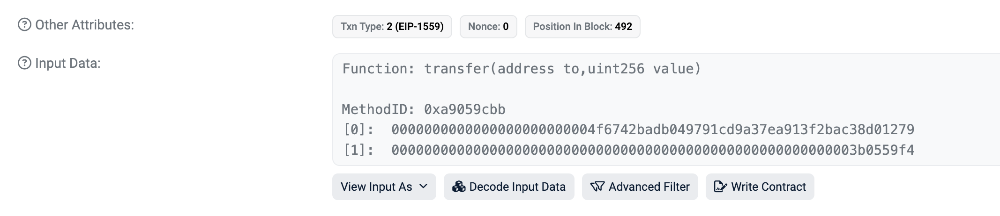

# 以太坊交易

交易是由帐户发出，带密码学签名的指令。 帐户将发起交易以更新以太坊网络的状态。 最简单的交易是将 ETH 从一个帐户转到另一个帐户。


## 交易是什么

以太坊交易是指由**外部持有帐户**发起的行动，换句话说，是指由人管理而不是智能合约管理的帐户。 例如，如果 Bob 发送 Alice 1 ETH，则 Bob 的帐户必须减少 1 ETH，而 Alice 的帐户必须增加 1 ETH。 交易会造成状态的改变。

**改变 EVM 状态的交易需要广播到整个网络**。 任何节点都可以广播在以太坊虚拟机上执行交易的请求；此后，**验证者将执行交易**并将由此产生的状态变化传播到网络的其他部分。

**交易需要付费并且必须包含在一个有效区块中。**


## 交易数据结构

所提交的交易包括下列信息：

- `from` - 发送者的地址，该地址将签署交易。 这将是一个外部帐户，因为合约帐户不能发送交易。
- `to` — 接收地址（如果是外部帐户，交易将传输值。 如果是合约帐户，交易将执行合约代码）
- `signature` – 发送者的标识符。 当发送者的私钥签署交易并确保发送者已授权此交易时，生成此签名。
- `nonce` - 一个有序递增的计数器，表示来自帐户的交易数量
- `value` – 发送者向接收者转移的以太币数量（面值为 WEI，1 个以太币 = 1e+18wei）
- `input data` – 可包括任意数据的可选字段
- `gasLimit` – 交易可以消耗的最大数量的燃料单位。 [以太坊虚拟机](https://ethereum.org/zh/developers/docs/evm/opcodes/)指定每个计算步骤所需的燃料单位
- `maxPriorityFeePerGas` - 作为小费提供给验证者的已消耗燃料的最高价格
- `maxFeePerGas` - 愿意为交易支付的每单位燃料的最高费用（包括 `baseFeePerGas` 和 `maxPriorityFeePerGas`）

燃料是指验证者处理交易所需的计算。 用户必须为此计算支付费用。 `gasLimit` 和 `maxPriorityFeePerGas` 决定支付给验证者的最高交易费。


## 示例

交易对象需要使用发送者的私钥签名。 这证明交易只可能来自发送者，而不是欺诈。

Geth 这样的以太坊客户端将处理此签名过程。

 [JSON-RPC](https://ethereum.org/zh/developers/docs/apis/json-rpc/) 调用：

```json
{
  "id": 2,
  "jsonrpc": "2.0",
  "method": "account_signTransaction",
  "params": [
    {
      "from": "0x1923f626bb8dc025849e00f99c25fe2b2f7fb0db",
      "gas": "0x55555",
      "maxFeePerGas": "0x1234",
      "maxPriorityFeePerGas": "0x1234",
      "input": "0xabcd",
      "nonce": "0x0",
      "to": "0x07a565b7ed7d7a678680a4c162885bedbb695fe0",
      "value": "0x1234"
    }
  ]
}
```

示例响应：

```json
{
  "jsonrpc": "2.0",
  "id": 2,
  "result": {
    "raw": "0xf88380018203339407a565b7ed7d7a678680a4c162885bedbb695fe080a44401a6e4000000000000000000000000000000000000000000000000000000000000001226a0223a7c9bcf5531c99be5ea7082183816eb20cfe0bbc322e97cc5c7f71ab8b20ea02aadee6b34b45bb15bc42d9c09de4a6754e7000908da72d48cc7704971491663",
    "tx": {
      "nonce": "0x0",
      "maxFeePerGas": "0x1234",
      "maxPriorityFeePerGas": "0x1234",
      "gas": "0x55555",
      "to": "0x07a565b7ed7d7a678680a4c162885bedbb695fe0",
      "value": "0x1234",
      "input": "0xabcd",
      "v": "0x26",
      "r": "0x223a7c9bcf5531c99be5ea7082183816eb20cfe0bbc322e97cc5c7f71ab8b20e",
      "s": "0x2aadee6b34b45bb15bc42d9c09de4a6754e7000908da72d48cc7704971491663",
      "hash": "0xeba2df809e7a612a0a0d444ccfa5c839624bdc00dd29e3340d46df3870f8a30e"
    }
  }
}
```

- `raw` 是采用[递归长度前缀 (RLP) ](https://ethereum.org/zh/developers/docs/data-structures-and-encoding/rlp/)编码形式的签名交易
- `tx` 是已签名交易的 JSON 形式。

如有签名哈希，可通过加密技术证明交易来自发送者并提交网络。验证过程就是，根据签名哈希得到公钥，计算出交易 from地址，然后比对两个地址是否相同


## data 字段

绝大多数交易都是从外部所有的帐户访问合约。 大多数合约用 Solidity 语言编写，并根据应用**程序二进制接口 (ABI)** 解释其`data`字段。

前四个字节使用函数名称和参数的哈希指定要调用的函数。 

调用数据的其余部分是参数，[按照应用程序二进制接口规范中的规定进行编码](https://docs.soliditylang.org/en/latest/abi-spec.html#formal-specification-of-the-encoding)。

一下是某个[交易](https://etherscan.io/tx/0xd0dcbe007569fcfa1902dae0ab8b4e078efe42e231786312289b1eee5590f6a1)的data 数据：`0xa9059cbb0000000000000000000000004f6742badb049791cd9a37ea913f2bac38d01279000000000000000000000000000000000000000000000000000000003b0559f4`

函数选择器是 `0xa9059cbb` （前四个字节）。

其余数据如下：

```
10000000000000000000000004f6742badb049791cd9a37ea913f2bac38d01279
2000000000000000000000000000000000000000000000000000000003b0559f4
```

根据应用程序二进制接口规范，整型值（例如地址，它是 20 字节整型）在应用程序二进制接口中显示为 **32 字节**的字，**前面用零填充**。 所以我们知道 `to` 地址是 `4f6742badb049791cd9a37ea913f2bac38d01279`。 `value` 是 0x3b0559f4 = 990206452。




## 交易类型

以太坊有几种不同类型的交易：

- 常规交易：从一个帐户到另一个帐户的交易。
- 合约部署交易：没有“to”地址的交易，数据字段用于合约代码。
- 执行合约：与已部署的智能合约进行交互的交易。 在这种情况下，“to”地址是智能合约地址。


## 燃料简介

执行交易需要耗费[燃料](https://ethereum.org/zh/developers/docs/gas/)。 简单的转账交易需要 21000 单位燃料。

因此，如果 Bob 要在 `baseFeePerGas` 为 190 Gwei 且 `maxPriorityFeePerGas` 为 10 Gwei 时给 Alice 发送一个以太币，Bob 需要支付以下费用：

```
(190 + 10) * 21000 = 4,200,000 gwei
--或--
0.0042 ETH
```

Bob 的帐户将会扣除 **1.0042 个以太币**（1 个以太币给 Alice，0.0042 个以太币作为燃料费用）

Alice 的帐户将会增加 **+1.0 ETH**

基础费将会燃烧 **-0.00399 ETH**

验证者获得 **0.000210 个以太币**的小费

**任何智能合约交互也需要燃料。任何未用于交易的燃料都会退还给用户帐户。**


## 交易生命周期

交易提交后，就会发生以下情况：

1. 以加密方式生成的交易哈希： `0x97d99bc7729211111a21b12c933c949d4f31684f1d6954ff477d0477538ff017`
2. 然后，该交易被广播到网络，并添加到由**所有其他待处理的网络交易组成的交易池中**。
3. **验证者必须选择你的交易并将它包含在一个区块中，以便验证交易并认为它“成功”。**
4. 随着时间的流逝，**包含你的交易的区块将升级成“合理”状态，然后变成“最后确定”状态**。 通过这些升级，可以进一步确定你的交易已经成功并将无法更改。 区块一旦“最终确定”，只能通过耗费数十亿美元的网络级攻击来更改。


## TYPED TRANSACTION ENVELOPE交易

这些还不懂，后面再看吧，总之就是他的定义在不断改变吧，但是里面大概的意思差不多。

随着 EIP 的提出，交易的格式一直在丰富

以太坊最初有一种交易形式。 每笔交易都包含 Nonce、燃料价格、燃料限制、目的地地址、价值、数据、v、r 和 s。 这些字段为 [RLP 编码](https://ethereum.org/zh/developers/docs/data-structures-and-encoding/rlp/)，看起来像这样：

```
RLP([nonce, gasPrice, gasLimit, to, value, data, v, r, s])
@dataclass
class TransactionLegacy:
	signer_nonce: int = 0
	gas_price: int = 0
	gas_limit: int = 0
	destination: int = 0
	amount: int = 0
	payload: bytes = bytes()
	v: int = 0
	r: int = 0
	s: int = 0
```

以太坊经过演变，已经支持多种类型的交易，从而能够在不影响传统交易形式的情况下实现访问列表和 [EIP-1559](https://eips.ethereum.org/EIPS/eip-1559) 等新功能。

```
@dataclass
class Transaction1559Payload:
	chain_id: int = 0
	signer_nonce: int = 0
	max_priority_fee_per_gas: int = 0
	max_fee_per_gas: int = 0
	gas_limit: int = 0
	destination: int = 0
	amount: int = 0
	payload: bytes = bytes()
	access_list: List[Tuple[int, List[int]]] = field(default_factory=list)
	signature_y_parity: bool = False
	signature_r: int = 0
	signature_s: int = 0
```

[EIP-2718](https://eips.ethereum.org/EIPS/eip-2718)是允许这种行为的。 交易解释如下：

```
TransactionType || TransactionPayload
@dataclass
class Transaction1559Payload:
	chain_id: int = 0
	signer_nonce: int = 0
	max_priority_fee_per_gas: int = 0
	max_fee_per_gas: int = 0
	gas_limit: int = 0
	destination: int = 0
	amount: int = 0
	payload: bytes = bytes()
	access_list: List[Tuple[int, List[int]]] = field(default_factory=list)
	signature_y_parity: bool = False
	signature_r: int = 0
	signature_s: int = 0

@dataclass
class Transaction1559Envelope:
	type: Literal[2] = 2
	payload: Transaction1559Payload = Transaction1559Payload()
```

其中，字段定义如下：

- `TransactionType` - 一个在 0 到 0x7f 之间的数字，总共为 128 种可能的交易类型。
- `TransactionPayload` - 由交易类型定义的任意字节数组。


## 交易源码

```go
type Transaction struct {
	inner TxData    // Consensus contents of a transaction
	time  time.Time // Time first seen locally (spam avoidance)

	// caches
	hash atomic.Pointer[common.Hash]
	size atomic.Uint64
	from atomic.Pointer[sigCache]
}
```

TxData 是个接口，目前有四个类，这也说明了上面的存在很多交易类型


最原始的交易类型

```go
// LegacyTx is the transaction data of the original Ethereum transactions.
type LegacyTx struct {
    Nonce    uint64          // nonce of sender account
    GasPrice *big.Int        // wei per gas
    Gas      uint64          // gas limit
    To       *common.Address `rlp:"nil"` // nil means contract creation
    Value    *big.Int        // wei amount
    Data     []byte          // contract invocation input data
    V, R, S  *big.Int        // signature values
}
```

EIP-1559 的交易类型

```go
// DynamicFeeTx represents an EIP-1559 transaction.
type DynamicFeeTx struct {
    ChainID    *big.Int
    Nonce      uint64
    GasTipCap  *big.Int // a.k.a. maxPriorityFeePerGas
    GasFeeCap  *big.Int // a.k.a. maxFeePerGas
  	// gas limit
    Gas        uint64
    To         *common.Address `rlp:"nil"` // nil means contract creation
    Value      *big.Int
    Data       []byte
    AccessList AccessList

    // Signature values
    V *big.Int `json:"v" gencodec:"required"`
    R *big.Int `json:"r" gencodec:"required"`
    S *big.Int `json:"s" gencodec:"required"`
}
```

还有一些其他的交易类型，还不懂啥意思，先不管了。


## 收据源码

```go
// Receipt represents the results of a transaction.
type Receipt struct {
	// Consensus fields: These fields are defined by the Yellow Paper
	Type              uint8  `json:"type,omitempty"`
	PostState         []byte `json:"root"`
	Status            uint64 `json:"status"`
	CumulativeGasUsed uint64 `json:"cumulativeGasUsed" gencodec:"required"`
	Bloom             Bloom  `json:"logsBloom"         gencodec:"required"`
	Logs              []*Log `json:"logs"              gencodec:"required"`

	// Implementation fields: These fields are added by geth when processing a transaction.
	TxHash            common.Hash    `json:"transactionHash" gencodec:"required"`
	ContractAddress   common.Address `json:"contractAddress"`
	GasUsed           uint64         `json:"gasUsed" gencodec:"required"`
	EffectiveGasPrice *big.Int       `json:"effectiveGasPrice"` // required, but tag omitted for backwards compatibility
	BlobGasUsed       uint64         `json:"blobGasUsed,omitempty"`
	BlobGasPrice      *big.Int       `json:"blobGasPrice,omitempty"`

	// Inclusion information: These fields provide information about the inclusion of the
	// transaction corresponding to this receipt.
	BlockHash        common.Hash `json:"blockHash,omitempty"`
	BlockNumber      *big.Int    `json:"blockNumber,omitempty"`
	TransactionIndex uint        `json:"transactionIndex"`
}
```

有许多数据和交易中的信息是一样的，其他的信息之后再看吧
