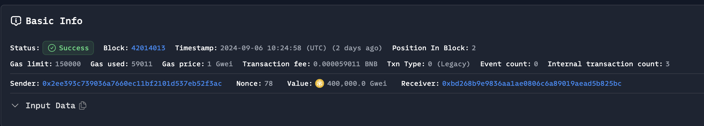
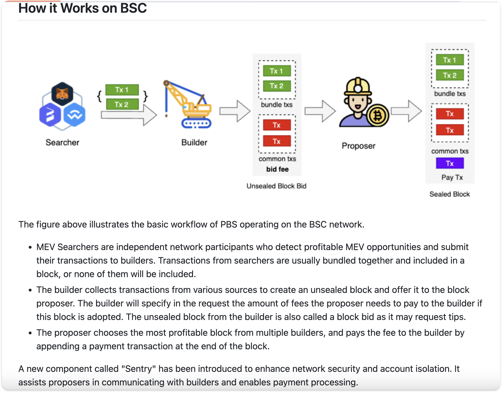
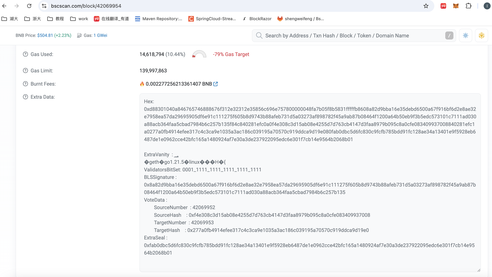

# Gas Fee


## 账号预热问题

该问题出现在 bsc 中发起一个合约交易，合约内部会给系统地址转账，该交易以 bundle 的形式发送，但是给 builder 的贿赂额很小的时候，会发现交易很难上链。

> 答：这是因为账号预热需要额外消耗 gas ，对于一个不存在的账户或者空账户而言，如果需要给该账户中转账，是需要额外支付 gas 费的，对应上面的问题，由于每个区块执行后会将系统地址的 balance 清空，所以系统地址对于每一个区块开始执行时，都是一个空账户，都需要预热，该合约交易如果放在块头执行，由于他给系统地址转账了，所以需要多消耗 gas，对于 builder 而言，价值量就更高，但是如果该交易不是在块头，他的 gas 消耗就会变少，应该他之前的交易一般都会有 gas 消耗，而 gas 将会转入系统地址中，所以系统地址就不是一个空账户了，对于 builder 而言，他的价值量就变低了。
>
> 所以，如果没有其他 bundle 来竞争，那么该 bundle 就会放在块头，价值量也更高，这也就是为什么该 bundle 很难上链的原因，他只能放在块头，这个时候价值量才高。

先来验证：

对于这笔[交易](https://bscscan.com/tx/0xf7bb720411ba4e20830db18de089144bf7d10c6e476840924718fb5ddfd313ea)，他是在块头位置，可以看到他目前的 gas 消耗是 84011，让他在第 3 条交易执行，可以看到模拟之后的 gas 消耗是 59011。这中间相差了 25000。这也说明了该交易放在块头执行对于 builder 而言，价值量更高。



接下来深入bsc源码分析：

在合约内部，使用 transfer 转账时，其实是使用到了 call 操作码。我们来看 call 操作码的源码：

```go
func gasCall(evm *EVM, contract *Contract, stack *Stack, mem *Memory, memorySize uint64) (uint64, error) {
	var (
		gas            uint64
		transfersValue = !stack.Back(2).IsZero()
		address        = common.Address(stack.Back(1).Bytes20())
	)
	if evm.chainRules.IsEIP158 {
		if transfersValue && evm.StateDB.Empty(address) {
			gas += params.CallNewAccountGas // 25000
		}
	} else if !evm.StateDB.Exist(address) {
		gas += params.CallNewAccountGas
	}
	if transfersValue {
		gas += params.CallValueTransferGas // 9000
	}
  ...
}
```

可以看到当账户不存在，或者账户为空时，需要额外支付 `params.CallNewAccountGas`,而这个值就是 25000。

账户为空的条件如下：

```go
// Empty returns whether the state object is either non-existent
// or empty according to the EIP161 specification (balance = nonce = code = 0)
func (s *StateDB) Empty(addr common.Address) bool {
	so := s.getStateObject(addr)
	return so == nil || so.empty()
}
// empty returns whether the account is considered empty.
func (s *stateObject) empty() bool {
	return s.data.Nonce == 0 && s.data.Balance.IsZero() && bytes.Equal(s.data.CodeHash, types.EmptyCodeHash.Bytes())
}
```

因为系统账户是没有转出交易的，所以 nonce 一直都为 0，这也说明了如果是首条交易，如果他给系统账户转钱，他是需要支付 25000gas 的。

**和上面的现象一样。这里需要注意：只有给系统地址转账才有账号预热问题，虽然，交易的 gas 消耗最终也是打到系统地址，这也会激活账户，但是这不算做交易发起者的消耗。通过源码也可以论证这一点，`gas += params.CallNewAccountGas // 25000`这一行代码只有在 call 操作码的函数中有。**

> 在以太坊智能合约中，执行转账操作（发送以太币）时，使用的是以下两种操作码之一：
>
> 1. **`CALL` 操作码**： 
>    `CALL` 是一种通用的操作码，用于合约之间的任意调用，包括发送以太币、调用其他合约函数等。它的使用非常广泛，灵活性较高。 
>    **操作码**：`0xF1`
>
>    转账的基本语法形式：
>    ```solidity
>    recipient.call{value: amount}("");
>    ```
>    这个方式虽然可以用来转账，但由于它是通用的调用方式，并不是专门为转账设计的，因此潜在的安全性问题会更多。开发者必须额外注意 `CALL` 返回值的处理，以防止潜在的攻击（例如重入攻击）。
>
> 2. **`TRANSFER` 函数（封装的安全性较高的转账方法）**： 
>    在 Solidity 中，`transfer` 函数是一个封装好的方法，底层同样使用 `CALL` 操作码实现。它会自动限制 `gas` 消耗在 2300 gas 以内，用于简单的以太币转账，避免复杂操作以增加安全性：
>    
>    ```solidity
>    recipient.transfer(amount);
>    ```
>    虽然 `transfer` 函数在 Solidity 中使用较多，但由于它限制了 `gas`，在某些高 `gas` 消耗的环境中（比如合约地址拥有 fallback 函数），可能会失败。
>    
> 3. **`SEND` 函数（更简单的转账方法）**： 
>    `send` 函数也是基于 `CALL` 操作码实现的，但和 `transfer` 不同，它不会抛出异常，而是返回 `true` 或 `false` 来表示转账是否成功：
>    
>    ```solidity
>    bool success = recipient.send(amount);
>    ```
>
> 总结：
> - 在 Solidity 及以太坊虚拟机（EVM）中，合约内部的转账最终都是通过 **`CALL` 操作码** 来实现的，即操作码 `0xF1`。
> - `TRANSFER` 和 `SEND` 是 Solidity 提供的封装，底层也是基于 `CALL` 操作码。


## 交易执行 gas 计算

接下来，我们来看一下一条交易执行时，他的 gas 是如果计算和统计的。源码是 bsc

执行一条交易，一般调用的都是下面这个函数

```go
// ApplyMessage computes the new state by applying the given message
// against the old state within the environment.
//
// ApplyMessage returns the bytes returned by any EVM execution (if it took place),
// the gas used (which includes gas refunds) and an error if it failed. An error always
// indicates a core error meaning that the message would always fail for that particular
// state and would never be accepted within a block.
func ApplyMessage(evm *vm.EVM, msg *Message, gp *GasPool) (*ExecutionResult, error) {
	return NewStateTransition(evm, msg, gp).TransitionDb()
}
```

他的主要逻辑是通过 TransitionDb 实现

```go
func (st *StateTransition) TransitionDb() (*ExecutionResult, error) {
	// First check this message satisfies all consensus rules before
	// applying the message. The rules include these clauses
	//
	// 1. the nonce of the message caller is correct
	// 2. caller has enough balance to cover transaction fee(gaslimit * gasprice)
	// 3. the amount of gas required is available in the block
	// 4. the purchased gas is enough to cover intrinsic usage
	// 5. there is no overflow when calculating intrinsic gas
	// 6. caller has enough balance to cover asset transfer for **topmost** call

	// Check clauses 1-3, buy gas if everything is correct
  // 第一部分，检查 balance 够不够gas，并将 balance 转换为 gas，保存在 st 中
	if err := st.preCheck(); err != nil {
		return nil, err
	}

	// Check clauses 4-5, subtract intrinsic gas if everything is correct
  // 第二部分，统计基本的 gas 消耗，并减去基本 gas
	gas, err := IntrinsicGas(msg.Data, msg.AccessList, contractCreation, rules.IsHomestead, rules.IsIstanbul, rules.IsShanghai)
	if err != nil {
		return nil, err
	}
	if st.gasRemaining < gas {
		return nil, fmt.Errorf("%w: have %d, want %d", ErrIntrinsicGas, st.gasRemaining, gas)
	}
	st.gasRemaining -= gas


  // 第三部分，交易执行，如果是合约相关，会进一步消耗 gas
	if contractCreation {
		ret, _, st.gasRemaining, vmerr = st.evm.Create(sender, msg.Data, st.gasRemaining, value)
	} else {
		// Increment the nonce for the next transaction
		st.state.SetNonce(msg.From, st.state.GetNonce(sender.Address())+1)
		ret, st.gasRemaining, vmerr = st.evm.Call(sender, st.to(), msg.Data, st.gasRemaining, value)
	}

  // 第四部分，返还 gas
	var gasRefund uint64
	if !rules.IsLondon {
		// Before EIP-3529: refunds were capped to gasUsed / 2
		gasRefund = st.refundGas(params.RefundQuotient)
	} else {
		// After EIP-3529: refunds are capped to gasUsed / 5
		gasRefund = st.refundGas(params.RefundQuotientEIP3529)
	}
  
  // 第五部分，分配利润
	effectiveTip := msg.GasPrice
	if rules.IsLondon {
		effectiveTip = cmath.BigMin(msg.GasTipCap, new(big.Int).Sub(msg.GasFeeCap, st.evm.Context.BaseFee))
	}
	effectiveTipU256, _ := uint256.FromBig(effectiveTip)

	fee := new(uint256.Int).SetUint64(st.gasUsed())
	fee.Mul(fee, effectiveTipU256)
	// consensus engine is parlia
	if st.evm.ChainConfig().Parlia != nil {
		st.state.AddBalance(consensus.SystemAddress, fee)
		// add extra blob fee reward
		if rules.IsCancun {
			blobFee := new(big.Int).SetUint64(st.blobGasUsed())
			blobFee.Mul(blobFee, st.evm.Context.BlobBaseFee)
			blobFeeU256, _ := uint256.FromBig(blobFee)
			st.state.AddBalance(consensus.SystemAddress, blobFeeU256)
		}
	} else {
		st.state.AddBalance(st.evm.Context.Coinbase, fee)
	}

	return &ExecutionResult{
		UsedGas:     st.gasUsed(),
		RefundedGas: gasRefund,
		Err:         vmerr,
		ReturnData:  ret,
	}, nil
}
```


代码主要有五部分构成。

第一部分，主要的逻辑是用 balance 去购买 gaslimit * gasprice 的 gas，用作合约执行时的可用 gas。

第二部分，计算基本 gas，这个可以看他的源码，从下面的源码中可以看出，普通转账交易的油费 21000 就是从这扣掉的

```go
// IntrinsicGas computes the 'intrinsic gas' for a message with the given data.
func IntrinsicGas(data []byte, accessList types.AccessList, isContractCreation bool, isHomestead, isEIP2028, isEIP3860 bool) (uint64, error) {
	// Set the starting gas for the raw transaction
	var gas uint64
	if isContractCreation && isHomestead {
		gas = params.TxGasContractCreation // 53000
	} else {
		gas = params.TxGas // 21000
	}
	dataLen := uint64(len(data))
	// Bump the required gas by the amount of transactional data
	if dataLen > 0 {
		// 各种计算 gas
	}
	if accessList != nil {
		gas += uint64(len(accessList)) * params.TxAccessListAddressGas
		gas += uint64(accessList.StorageKeys()) * params.TxAccessListStorageKeyGas
	}
	return gas, nil
}
```

第三部分执行交易，从下面精简的源码来看，如果是普通的转账，就直接对余额进行加减，就会返回，不会再次扣手续费了，但是如果是需要去执行合约，就需要去到虚拟机中执行，那里面会根据操作码一一扣除 gas。

```go
// Call executes the contract associated with the addr with the given input as
// parameters. It also handles any necessary value transfer required and takes
// the necessary steps to create accounts and reverses the state in case of an
// execution error or failed value transfer.
func (evm *EVM) Call(caller ContractRef, addr common.Address, input []byte, gas uint64, value *uint256.Int) (ret []byte, leftOverGas uint64, err error) {
	if !evm.StateDB.Exist(addr) {
		evm.StateDB.CreateAccount(addr)
	}
	evm.Context.Transfer(evm.StateDB, caller.Address(), addr, value)

	if isPrecompile {
		ret, gas, err = RunPrecompiledContract(p, input, gas)
	} else {
		// Initialise a new contract and set the code that is to be used by the EVM.
		// The contract is a scoped environment for this execution context only.
		code := evm.StateDB.GetCode(addr)
		if len(code) == 0 {
			ret, err = nil, nil // gas is unchanged
		} else {
			addrCopy := addr
			// If the account has no code, we can abort here
			// The depth-check is already done, and precompiles handled above
			contract := NewContract(caller, AccountRef(addrCopy), value, gas)
			contract.SetCallCode(&addrCopy, evm.StateDB.GetCodeHash(addrCopy), code)
			ret, err = evm.interpreter.Run(contract, input, false)
			gas = contract.Gas
		}
	}
	return ret, gas, err
}
```

第四部分，gasRefund，在这里会将没用完的 gas 返回给调用者，并且如果调用者在合约里删除一些数据，释放了存储空间，他会得到 gas 奖励，这部分也会打给调用者。这个机制的存在是为了激励开发者在智能合约执行中合理管理状态，避免不必要的数据占用区块链存储。可以看到，数据的存储其实都是在 stateDb 中进行的。

```go
func (st *StateTransition) refundGas(refundQuotient uint64) uint64 {
	// Apply refund counter, capped to a refund quotient
	refund := st.gasUsed() / refundQuotient
	if refund > st.state.GetRefund() {
		refund = st.state.GetRefund()
	}
	st.gasRemaining += refund

	// Return ETH for remaining gas, exchanged at the original rate.
	remaining := uint256.NewInt(st.gasRemaining)
	remaining = remaining.Mul(remaining, uint256.MustFromBig(st.msg.GasPrice))
	st.state.AddBalance(st.msg.From, remaining)

	// Also return remaining gas to the block gas counter so it is
	// available for the next transaction.
	st.gp.AddGas(st.gasRemaining)

	return refund
}
```

第五部分，就是对消耗的 gas 的分配，不同的共识机制分配规则不一样。下面就去看看出块奖励分配是如何进行的


## 出块奖励分配

我们从上面可以看到，对于[币安链来说，它采用Parlia共识算法](https://docs.bnbchain.org/bnb-smart-chain/validator/mev/overview/#what-is-more)，他会将 gas 消耗打入系统账户，但是其他共识算法，如以太坊，是直接打到区块打包者账户内，也就是 coinbase。

```go
// consensus engine is parlia
if st.evm.ChainConfig().Parlia != nil {
  st.state.AddBalance(consensus.SystemAddress, fee)
  // add extra blob fee reward
  if rules.IsCancun {
    blobFee := new(big.Int).SetUint64(st.blobGasUsed())
    blobFee.Mul(blobFee, st.evm.Context.BlobBaseFee)
    blobFeeU256, _ := uint256.FromBig(blobFee)
    st.state.AddBalance(consensus.SystemAddress, blobFeeU256)
  }
} else {
  st.state.AddBalance(st.evm.Context.Coinbase, fee)
}
```

其实在以太坊的源码中，他根本都么有 `consensus.SystemAddress`，因为这种模式是 Parlia 独有的。

```go
if st.evm.Config.NoBaseFee && msg.GasFeeCap.Sign() == 0 && msg.GasTipCap.Sign() == 0 {
	// Skip fee payment when NoBaseFee is set and the fee fields
	// are 0. This avoids a negative effectiveTip being applied to
	// the coinbase when simulating calls.
} else {
	fee := new(uint256.Int).SetUint64(st.gasUsed())
	fee.Mul(fee, effectiveTipU256)
	st.state.AddBalance(st.evm.Context.Coinbase, fee, tracing.BalanceIncreaseRewardTransactionFee)

	// add the coinbase to the witness iff the fee is greater than 0
	if rules.IsEIP4762 && fee.Sign() != 0 {
		st.evm.AccessEvents.BalanceGas(st.evm.Context.Coinbase, true)
	}
}
```

从这也可以看出，以太坊上的出块奖励（也就是交易的 gas 费）其实都是出块者拿了，而在PBS 模式下，以太坊的块由 builder 打包，validator 只是验证工作，所以出块奖励最终是 builder 的。

但是在币安链就不一样了，币安链上的块是由 validator 打包的。所以出块奖励其实是 validator 拿了。所以，币安链提出了自己的利润分配方式。



也就是 Proposer 接受了 builder 的unsealed block 后，需要给 builder 支付一笔费用。所以，币安链的实现中多了一个 bid 的逻辑。


接下来，我们来看一下 bsc-builder 的基本实现；

==首先看一下 miner 的实现：==

```go
func New(eth Backend, config *Config, chainConfig *params.ChainConfig, mux *event.TypeMux, engine consensus.Engine, isLocalBlock func(header *types.Header) bool) *Miner {
	miner := &Miner{
		mux:     mux,
		eth:     eth,
		engine:  engine,
		exitCh:  make(chan struct{}),
		startCh: make(chan struct{}),
		stopCh:  make(chan struct{}),
		worker:  newWorker(config, chainConfig, engine, eth, mux, isLocalBlock, false),
	}

	miner.bidSimulator = newBidSimulator(&config.Mev, config.DelayLeftOver, config.GasPrice, eth.BlockChain(), chainConfig, engine, miner.worker)
	miner.worker.setBestBidFetcher(miner.bidSimulator)

	miner.wg.Add(1)
	go miner.update()
	return miner
}
```

`miner`包含`bidSimulator`和`worker`对象。


==**先来看 bidSimulator。**==

```go
// builder info (warning: only keep status in memory!)
buildersMu sync.RWMutex
builders   map[common.Address]*builderclient.Client

// channels
simBidCh chan *simBidReq
newBidCh chan *types.Bid

pendingMu sync.RWMutex
pending   map[uint64]map[common.Address]map[common.Hash]struct{} // blockNumber -> builder -> bidHash -> struct{}

bestBidMu sync.RWMutex
bestBid   map[common.Hash]*BidRuntime // prevBlockHash -> bidRuntime
```

最主要的就是这几个属性。其中 builders 主要用来记录当前有哪些 builder 会给 proposal 发 bid block。只有在builders 里面的 builder 发的 bid block 才是有效的。miner 暴露了接口，builder 可以发 rpc 请求像 proposal 注册自己，并发 sendBid 请求发送 bid block。

```go
// sendBid checks if the bid is already exists or if the builder sends too many bids,
// if yes, return error, if not, add bid into newBid chan waiting for judge profit.
func (b *bidSimulator) sendBid(_ context.Context, bid *types.Bid) error {
	timer := time.NewTimer(1 * time.Second)
	defer timer.Stop()
	select {
	case b.newBidCh <- bid:
		b.AddPending(bid.BlockNumber, bid.Builder, bid.Hash())
		return nil
	case <-timer.C:
		return types.ErrMevBusy
	}
}
```

当有builder 发送了 Bid 过来时，会先调用 miner.SendBid 函数，然后完成各种校验（builder 存不存在，pending 容量够不够等）后，会调用该函数，将其加入到 newBidCh 管道中。

值得注意的是，builder 传过来的 BidArgs 类型，而 proposal 需要的是 Bid 类型，所以在 miner.SendBid中会调用`bid, err := bidArgs.ToBid(builder, signer)`完成转换。可以看到，该函数内部就会将 builder 发送的想要的 Pay 转换为一条交易添加到最后，所以我们可以看到在每个块的倒数第二条交易，都是一条给 builder 的转账。

```go
func (b *BidArgs) ToBid(builder common.Address, signer Signer) (*Bid, error) {
	txs, err := b.RawBid.DecodeTxs(signer)
	if err != nil {
		return nil, err
	}

	if len(b.RawBid.UnRevertible) > len(txs) {
		return nil, fmt.Errorf("expect NonRevertible no more than %d", len(txs))
	}
	unRevertibleHashes := mapset.NewThreadUnsafeSetWithSize[common.Hash](len(b.RawBid.UnRevertible))
	unRevertibleHashes.Append(b.RawBid.UnRevertible...)

	if len(b.PayBidTx) != 0 {
		var payBidTx = new(Transaction)
		err = payBidTx.UnmarshalBinary(b.PayBidTx)
		if err != nil {
			return nil, err
		}

		txs = append(txs, payBidTx)
	}

	bid := &Bid{
		Builder:      builder,
		BlockNumber:  b.RawBid.BlockNumber,
		ParentHash:   b.RawBid.ParentHash,
		Txs:          txs,
		UnRevertible: unRevertibleHashes,
		GasUsed:      b.RawBid.GasUsed + b.PayBidTxGasUsed,
		GasFee:       b.RawBid.GasFee,
		BuilderFee:   b.RawBid.BuilderFee,
		rawBid:       *b.RawBid,
	}

	if bid.BuilderFee == nil {
		bid.BuilderFee = big.NewInt(0)
	}

	return bid, nil
}
```


在 newBidLoop 函数中，会从`newBid := <-b.newBidCh`读取通道，然后封装为`BidRuntime`对象后调用内部的 commit 函数，通过如下操作`b.simBidCh <- &simBidReq{interruptCh: interruptCh, bid: bidRuntime}`加入到 simBidCh 管道中

在 mainLoop函数中，会读取`req := <-b.simBidCh`管道，并调用`b.simBid(req.interruptCh, req.bid)`函数

simBid 函数内部，会使用 bidWorker去提交打包收到的 Bid 中的交易，看看是否能执行成功，值得注意的是下面这段代码，这里就是给 builder 的分润，但其实，可以从现在的块上可以看出，验证者给 builder 的分润已经没有了，倒数第二笔交易 value 全是 0 了。

```go
// commit payBidTx at the end of the block
bidRuntime.env.gasPool.AddGas(params.PayBidTxGasLimit) // 25000
err = bidRuntime.commitTransaction(b.chain, b.chainConfig, payBidTx, true)
// 这里就是 proposal 给 builder 返利的交易。
```

全部执行成功后，就会得到一个模拟成功的bidRuntime，然后会与当前的 bestBid 比较，留下最好的 bid。然后也会通过 ReportIssue给 builder 报告执行的信息。

到此 bidSimulator 的任务基本就完成了。


==然后就是 worker 工作了==

worker 在commitWork函数中，会调用`bestBid := w.bidFetcher.GetBestBid(bestWork.header.ParentHash)`拿到当前价值最高的 bid。并将其封装成一个bestWork， 然后调用`w.commit(bestWork, w.fullTaskHook, true, start)`提交。

在该函数内部，会调用`block, receipts, err := w.engine.FinalizeAndAssemble(w.chain, types.CopyHeader(env.header), env.state, env.txs, nil, env.receipts, nil)`函数，将交易真正打包成一个区块，得到 block 对象。`w.engine`就是共识层算法的实现。币安链上就是 Parlia 对象。

在这个函数内，会调用`err := p.distributeIncoming(p.val, state, header, cx, &txs, &receipts, nil, &header.GasUsed, true)`，这个函数就是对区块奖励的分配逻辑。

```go
// distributeIncoming distributes system incoming of the block
func (p *Parlia) distributeIncoming(val common.Address, state *state.StateDB, header *types.Header, chain core.ChainContext,
	txs *[]*types.Transaction, receipts *[]*types.Receipt, receivedTxs *[]*types.Transaction, usedGas *uint64, mining bool) error {
	coinbase := header.Coinbase
	balance := state.GetBalance(consensus.SystemAddress)
	if balance.Cmp(common.U2560) <= 0 {
		return nil
	}
	state.SetBalance(consensus.SystemAddress, common.U2560)
	state.AddBalance(coinbase, balance)

	doDistributeSysReward := !p.chainConfig.IsKepler(header.Number, header.Time) &&
		state.GetBalance(common.HexToAddress(systemcontracts.SystemRewardContract)).Cmp(maxSystemBalance) < 0
	if doDistributeSysReward {
		rewards := new(uint256.Int)
		rewards = rewards.Rsh(balance, systemRewardPercent)
		if rewards.Cmp(common.U2560) > 0 {
			err := p.distributeToSystem(rewards.ToBig(), state, header, chain, txs, receipts, receivedTxs, usedGas, mining)
			if err != nil {
				return err
			}
			log.Trace("distribute to system reward pool", "block hash", header.Hash(), "amount", rewards)
			balance = balance.Sub(balance, rewards)
		}
	}
	log.Trace("distribute to validator contract", "block hash", header.Hash(), "amount", balance)
	return p.distributeToValidator(balance.ToBig(), val, state, header, chain, txs, receipts, receivedTxs, usedGas, mining)
}
```

可以看到首先会将系统地址的余额转给验证者，然后将余额清掉。接下来，会将利益分配给验证者`distributeToValidator`和系统`distributeToSystem`。这里面都是通过发起一笔调用合约的交易实现的，所以可以看到在区块的最后，也就是给 builder 转账的那笔交易后面，会再多一笔或两笔调用合约的交易。

单独分配一笔给系统的前提是，系统合约的余额小于 100bnb，目前已经超出了，所以不会再有这笔交易了。

所以接下来，主要分析`distributeToValidator`。

```go
func (p *Parlia) distributeToSystem(amount *big.Int, state *state.StateDB, header *types.Header, chain core.ChainContext,
	txs *[]*types.Transaction, receipts *[]*types.Receipt, receivedTxs *[]*types.Transaction, usedGas *uint64, mining bool) error {
	// get system message
	msg := p.getSystemMessage(header.Coinbase, common.HexToAddress(systemcontracts.SystemRewardContract), nil, amount)
	// apply message
	return p.applyTransaction(msg, state, header, chain, txs, receipts, receivedTxs, usedGas, mining)
}

// distributeToValidator deposits validator reward to validator contract
func (p *Parlia) distributeToValidator(amount *big.Int, validator common.Address,
	state *state.StateDB, header *types.Header, chain core.ChainContext,
	txs *[]*types.Transaction, receipts *[]*types.Receipt, receivedTxs *[]*types.Transaction, usedGas *uint64, mining bool) error {
	// method
	method := "deposit"

	// get packed data
	data, err := p.validatorSetABI.Pack(method,
		validator,
	)
	if err != nil {
		log.Error("Unable to pack tx for deposit", "error", err)
		return err
	}
	// get system message
	msg := p.getSystemMessage(header.Coinbase, common.HexToAddress(systemcontracts.ValidatorContract), data, amount)
	// apply message
	return p.applyTransaction(msg, state, header, chain, txs, receipts, receivedTxs, usedGas, mining)
}
```

系统合约

```
ValidatorContract          = "0x0000000000000000000000000000000000001000"
SystemRewardContract       = "0x0000000000000000000000000000000000001002"
```

可以看到，最终的利润分配就是通过调用 ValidatorContract 的 deposit 函数实现的。

```solidity
/**
 * @dev Collect all fee of transactions from the current block and deposit it to the contract
 *
 * @param valAddr The validator address who produced the current block
 */
function deposit(address valAddr) external payable onlyCoinbase onlyInit noEmptyDeposit onlyZeroGasPrice {
    uint256 value = msg.value;
    uint256 index = currentValidatorSetMap[valAddr];

    if (isSystemRewardIncluded == false) {
        systemRewardRatio = INIT_SYSTEM_REWARD_RATIO;
        burnRatio = INIT_BURN_RATIO;
        isSystemRewardIncluded = true;
    }

    if (value > 0 && systemRewardRatio > 0) {
        uint256 toSystemReward = msg.value.mul(systemRewardRatio).div(BLOCK_FEES_RATIO_SCALE);
        if (toSystemReward > 0) {
            address(uint160(SYSTEM_REWARD_ADDR)).transfer(toSystemReward);
            emit systemTransfer(toSystemReward);

            value = value.sub(toSystemReward);
        }
    }

    if (value > 0 && burnRatio > 0) {
        uint256 toBurn = msg.value.mul(burnRatio).div(BLOCK_FEES_RATIO_SCALE);
        if (toBurn > 0) {
            address(uint160(BURN_ADDRESS)).transfer(toBurn);
            emit feeBurned(toBurn);

            value = value.sub(toBurn);
        }
    }

    if (index > 0) {
        Validator storage validator = currentValidatorSet[index - 1];
        if (validator.jailed) {
            emit deprecatedDeposit(valAddr, value);
        } else {
            totalInComing = totalInComing.add(value);
            validator.incoming = validator.incoming.add(value);
            emit validatorDeposit(valAddr, value);
        }
    } else {
        // get incoming from deprecated validator;
        emit deprecatedDeposit(valAddr, value);
    }
}
```

可以看到，该函数内部就是将钱分成了两笔，一笔打给了系统合约`SystemRewardContract`，然后另一笔打给了黑洞地址`BURN_ADDRESS`，也就是0x 00...00dead。

并最终在该合约中，往对应的 validator 代币上增加了这笔利润`totalInComing = totalInComing.add(value);`，由此，我们也可以看到，validator 最终的利润其实是以验证者合约的代币形式保存的。


==以上都是针对 validator 而言，如果收到 builder 发送的 BidArgs，然后打包成区块，并最终分配利润。下面我们来看，buidler 是如何构建 BidArgs，然后是怎么发给验证者的。==

builder 的工作主要是依赖 Worker 完成。worker 中最重要的两个对象就是下面这两个

```go
// MEV
bidder      *Bidder
bundleCache *BundleCache
```

因此，我们先去看 Bidder 对象。

Bidder 的重要属性如下：

```go
validatorsMu sync.RWMutex
validators   map[common.Address]*validator // address -> validator

bestWorksMu sync.RWMutex
bestWorks   map[int64]*environment

newBidCh chan *environment
```

可以看到 Bidder 中维护了 validators，Bidder 在创建时，会读取配置中的 validators 信息，然后注册。

```go
func (b *Bidder) register(cfg ValidatorConfig) {
	b.validatorsMu.Lock()
	defer b.validatorsMu.Unlock()

	cl, err := validatorclient.DialOptions(context.Background(), cfg.URL, rpc.WithHTTPClient(client))
	if err != nil {
		log.Error("Bidder: failed to dial validator", "url", cfg.URL, "err", err)
		return
	}

	params, err := cl.MevParams(context.Background())
	if err != nil {
		log.Error("Bidder: failed to get mev params", "url", cfg.URL, "err", err)
		return
	}

	b.validators[cfg.Address] = &validator{
		Client:                cl,
		BidSimulationLeftOver: params.BidSimulationLeftOver,
		GasCeil:               params.GasCeil,
	}
}
```

注册其实就是创建与 validator 节点的链接，然后请求validator 的配置信息。

接下来重要的就是 newBidCh 了，worker 在 mainLoop 函数中会从该通道中不断取数据，然后调用 setBestWork 设置最优 Bid，他会判断是否可以发送给 validator，如果可以，就会触发 timer 通道事件。

worker也是在 commitWork 函数中调用`w.bidder.newWork(work)`，向该管道写入数据（==worker 会在 commitWork 函数中，根据设置选择性的执行 builder 逻辑还是 validator 逻辑==）

然后就是 bestWorks 了。

在 mainLoop 中，会监听 timer 通道事件，在这个事件触发时，会获取当前的 bestWork，然后调用 bid 函数。

```go
func (b *Bidder) bid(work *environment) {
	// construct bid from work
	{
		var txs []hexutil.Bytes
		for _, tx := range work.txs {
			var txBytes []byte
			var err error
			txBytes, err = tx.MarshalBinary()
			if err != nil {
				log.Error("Bidder: fail to marshal tx", "tx", tx, "err", err)
				return
			}
			txs = append(txs, txBytes)
		}

		bid := types.RawBid{
			BlockNumber:  parent.Number.Uint64() + 1,
			ParentHash:   parent.Hash(),
			GasUsed:      work.header.GasUsed,
			GasFee:       work.state.GetBalance(consensus.SystemAddress).ToBig(),
			Txs:          txs,
			UnRevertible: work.UnRevertible,
			// TODO: decide builderFee according to realtime traffic and validator commission
		}

		signature, err := b.signBid(&bid)
		if err != nil {
			log.Error("Bidder: fail to sign bid", "err", err)
			return
		}

		bidArgs = types.BidArgs{
			RawBid:    &bid,
			Signature: signature,
		}
	}

	_, err := cli.SendBid(context.Background(), bidArgs)
}
```

在该函数内，就会生成 RawBid 对象，然后用钱包对她签名，并构建发送给 validator 的 BidArgs 对象，并通过 cli 客户端发给 validator。

还有一个重要的信息就是work 中的 coinbase。在生成 work 时，需要设置 work 的 coinbase，作为将来块的 coinbase。

```go
// take the next in-turn validator as coinbase
coinbase, err = w.engine.NextInTurnValidator(w.chain, w.chain.CurrentBlock())

// NextInTurnValidator return the next in-turn validator for header
func (p *Parlia) NextInTurnValidator(chain consensus.ChainHeaderReader, header *types.Header) (common.Address, error) {
	snap, err := p.snapshot(chain, header.Number.Uint64(), header.Hash(), nil)
	if err != nil {
		return common.Address{}, err
	}

	return snap.inturnValidator(), nil
}

// inturnValidator returns the validator at a given block height. 
// 从这就可以看出，他就是轮流制的
func (s *Snapshot) inturnValidator() common.Address {
	validators := s.validators()
	offset := (s.Number + 1) % uint64(len(validators))
	return validators[offset]
}
```

==以上就是 builder 的逻辑啦。==


总结：

币安链上，出块奖励都是给到验证者，验证者通过在块尾加一条给 builder 的转账给 builder 分润，然后再调用验证者合约将奖励打给系统合约和黑洞地址，并将利润转换为自己的代币。

以太坊上，出块奖励直接给到 builder。


## validators 信息

可以看到 builder 在生成 work 时，设置的coinbase 其实就是下一个能够产生区块的验证者。如果继续追踪源码，可以看到验证者的信息是从区块头中解析出来的。

我们可以观察一个区块的 extra data，可以看到，在 data 中就记录了所有 validators 的信息。信息组成如下：

`|Extra Vanity | Validators Number and Validators Bytes (or Empty) | Vote Attestation (or Empty) | Extra Seal|`



而 worker 在调用 prepareWork 的时候，会有如下逻辑

```
if err := w.engine.Prepare(w.chain, header); err != nil {
    log.Error("Failed to prepare header for sealing", "err", err)
    return nil, err
}
```

在这个函数里面，就会准备该区块头的 validators，这些 validators 的信息会从验证者合约中去拿，他的源码也是构建一条交易，但其实并不需要发起交易。

> 如果你想从合约中获取数据，通常会通过调用合约中的 view 或 pure 修饰符标记的只读函数。这类函数不会修改区块链状态，因此不需要发起一笔真正的交易，而是可以通过**本地调用**来获取结果。这种调用不会消耗 gas，也不需要付费。
>
> **只读操作**（如查询合约信息、调用 view 或 pure 函数，获取账户信息等）不需要发起交易，也不消耗 gas。
>
> **修改状态的操作**（如写入存储或转账）需要发起实际交易，消耗 gas，并产生交易码。

