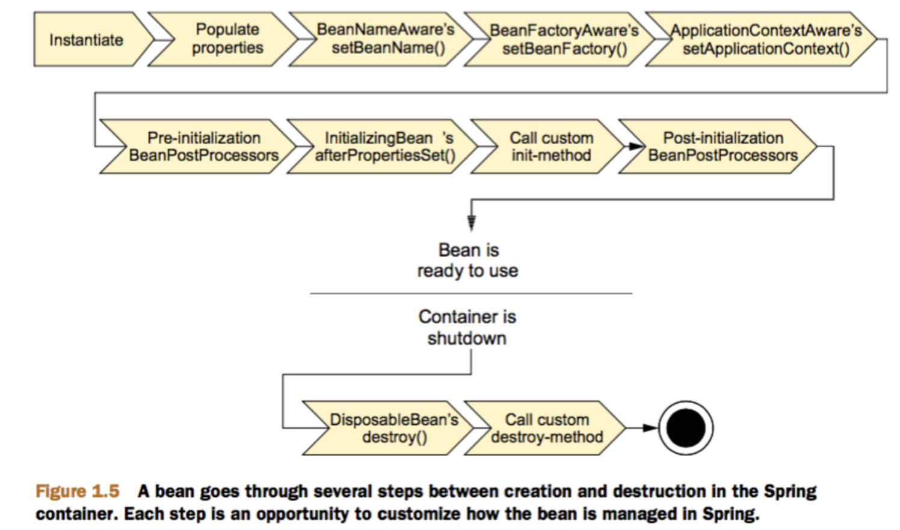
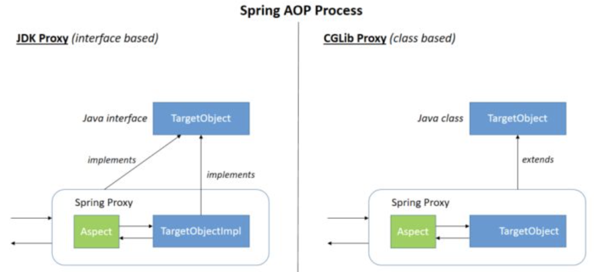
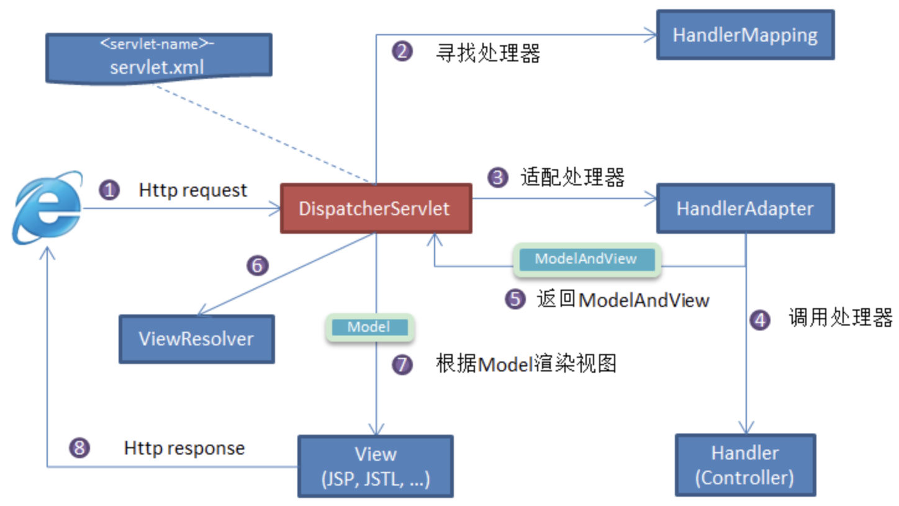
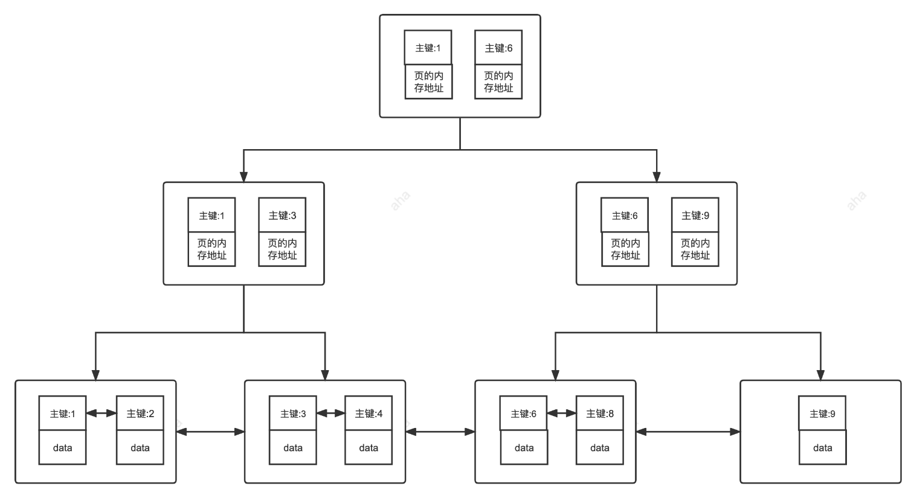
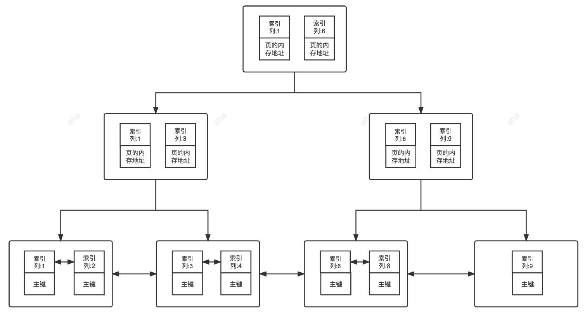

# Framework

## spring&springboot

### Spring是啥？

Spring 是一款开源的轻量级 Java 开发框架，旨在提高开发人员的开发效率以及系统的可维护性。

我们一般说 Spring 框架指的都是 Spring Framework，它是很多模块的集合，使用这些模块可以很方便地协助我们进行开发，比如说 Spring 支持 IoC（Inversion of Control:控制反转） 和 AOP(Aspect-Oriented Programming:面向切面编程)、可以很方便地对数据库进行访问、可以很方便地集成第三方组件（电子邮件，任务，调度，缓存等等）、对单元测试支持比较好、支持 RESTful Java 应用程序的开发。

Spring 最核心的思想就是不重新造轮子，开箱即用，提高开发效率。


### ***Spring有哪些模块？

Core Container

Spring 框架的核心模块，也可以说是基础模块，主要提供 IoC 依赖注入功能的支持。Spring 其他所有的功能基本都需要依赖于该模块，我们从上面那张 Spring 各个模块的依赖关系图就可以看出来。

- **spring-core**：Spring 框架基本的核心工具类。
- **spring-beans**：提供对 bean 的创建、配置和管理等功能的支持。
- **spring-context**：提供对国际化、事件传播、资源加载等功能的支持。
- **spring-expression**：提供对表达式语言（Spring Expression Language） SpEL 的支持，只依赖于 core 模块，不依赖于其他模块，可以单独使用。

AOP

- **spring-aspects**：该模块为与 AspectJ 的集成提供支持。
- **spring-aop**：提供了面向切面的编程实现。
- **spring-instrument**：提供了为 JVM 添加代理（agent）的功能。 具体来讲，它为 Tomcat 提供了一个织入代理，能够为 Tomcat 传递类文 件，就像这些文件是被类加载器加载的一样。没有理解也没关系，这个模块的使用场景非常有限。

Data Access/Integration

- **spring-jdbc**：提供了对数据库访问的抽象 JDBC。不同的数据库都有自己独立的 API 用于操作数据库，而 Java 程序只需要和 JDBC API 交互，这样就屏蔽了数据库的影响。
- **spring-tx**：提供对事务的支持。
- **spring-orm**：提供对 Hibernate、JPA、iBatis 等 ORM 框架的支持。
- **spring-oxm**：提供一个抽象层支撑 OXM(Object-to-XML-Mapping)，例如：JAXB、Castor、XMLBeans、JiBX 和 XStream 等。
- **spring-jms** : 消息服务。自 Spring Framework 4.1 以后，它还提供了对 spring-messaging 模块的继承。

Spring Web

- **spring-web**：对 Web 功能的实现提供一些最基础的支持。
- **spring-webmvc**：提供对 Spring MVC 的实现。
- **spring-websocket**：提供了对 WebSocket 的支持，WebSocket 可以让客户端和服务端进行双向通信。
- **spring-webflux**：提供对 WebFlux 的支持。WebFlux 是 Spring Framework 5.0 中引入的新的响应式框架。与 Spring MVC 不同，它不需要 Servlet API，是完全异步。

还有spring test等，提供单元测试支持


### Spring，SpringMVC，SpringBoot有何区别？

Spring MVC 是 Spring 中的一个很重要的模块，主要赋予 Spring 快速构建 MVC 架构的 Web 程序的能力。MVC 是模型(Model)、视图(View)、控制器(Controller)的简写，其核心思想是通过将业务逻辑、数据、显示分离来组织代码。

使用 Spring 进行开发各种配置过于麻烦比如开启某些 Spring 特性时，需要用 XML 或 Java 进行显式配置。于是，Spring Boot 诞生了！

Spring 旨在简化 J2EE 企业应用程序开发。Spring Boot 旨在简化 Spring 开发（减少配置文件，开箱即用！）。

Spring Boot 只是简化了配置，如果你需要构建 MVC 架构的 Web 程序，你还是需要使用 Spring MVC 作为 MVC 框架，只是说 Spring Boot 帮你简化了 Spring MVC 的很多配置，真正做到开箱即用！


### ***谈谈对IoC的理解？

**IoC（Inversion of Control:控制反转）** 是一种设计思想，而不是一个具体的技术实现。IoC 的思想就是将原本在程序中手动创建对象的控制权，交由 Spring 框架来管理。不过， IoC 并非 Spring 特有，在其他语言中也有应用。

将对象之间的相互依赖关系交给 IoC 容器来管理，并由 IoC 容器完成对象的注入。这样可以很大程度上简化应用的开发，把应用从复杂的依赖关系中解放出来。 IoC 容器就像是一个工厂一样，当我们需要创建一个对象的时候，只需要配置好配置文件/注解即可，完全不用考虑对象是如何被创建出来的。

在 Spring 中， IoC 容器是 Spring 用来实现 IoC 的载体， IoC 容器实际上就是个 Map（key，value），Map 中存放的是各种对象。

Spring 时代我们一般通过 XML 文件来配置 Bean，后来开发人员觉得 XML 文件来配置不太好，于是 SpringBoot 注解配置就慢慢开始流行起来。


### 什么是spring bean？

简单来说，Bean 代指的就是那些被 IoC 容器所管理的对象。

我们需要告诉 IoC 容器帮助我们管理哪些对象，这个是通过配置元数据来定义的。配置元数据可以是 XML 文件、注解或者 Java 配置类。

```xml
<!-- Constructor-arg with 'value' attribute -->
<bean id="..." class="...">
   <constructor-arg value="..."/>
</bean>
```


### 将一个类声明为 Bean 的注解有哪些?

- `@Component`：通用的注解，可标注任意类为 `Spring` 组件。如果一个 Bean 不知道属于哪个层，可以使用`@Component` 注解标注。
- `@Repository` : 对应持久层即 Dao 层，主要用于数据库相关操作。
- `@Service` : 对应服务层，主要涉及一些复杂的逻辑，需要用到 Dao 层。
- `@Controller` : 对应 Spring MVC 控制层，主要用于接受用户请求并调用 `Service` 层返回数据给前端页面。


### ***@Component和@Bean有啥区别？

- `@Component` 注解作用于类，而`@Bean`注解作用于方法。
- `@Component`通常是通过类路径扫描来自动侦测以及自动装配到 Spring 容器中（我们可以使用 `@ComponentScan` 注解定义要扫描的路径从中找出标识了需要装配的类自动装配到 Spring 的 bean 容器中）。`@Bean` 注解通常是我们在标有该注解的方法中定义产生这个 bean,`@Bean`告诉了 Spring 这是某个类的实例，当我需要用它的时候还给我。
- `@Bean` 注解比 `@Component` 注解的自定义性更强，而且很多地方我们只能通过 `@Bean` 注解来注册 bean。比如当我们引用第三方库中的类需要装配到 `Spring`容器时，则只能通过 `@Bean`来实现。

`@Bean`注解使用示例：

```java
@Configuration
public class AppConfig {
    @Bean
    public TransferService transferService() {
        return new TransferServiceImpl();
    }

}
```

上面的代码相当于下面的 xml 配置

```xml
<beans>
    <bean id="transferService" class="com.acme.TransferServiceImpl"/>
</beans>
```

下面这个例子是@Component无法实现的

```java
@Bean
public OneService getService(status) {
  case (status)  {
      when 1:
              return new serviceImpl1();
      when 2:
              return new serviceImpl2();
      when 3:
              return new serviceImpl3();
  }
}
```


### 注入 Bean 的注解有哪些？

Spring 内置的 `@Autowired` 以及 JDK 内置的 `@Resource` 和 `@Inject` 都可以用于注入 Bean。

| Annotation   | Package                            | Source       |
| ------------ | ---------------------------------- | ------------ |
| `@Autowired` | `org.springframework.bean.factory` | Spring 2.5+  |
| `@Resource`  | `javax.annotation`                 | Java JSR-250 |
| `@Inject`    | `javax.inject`                     | Java JSR-330 |

`@Autowired` 和`@Resource`使用的比较多一些。


### ***@Autowired和@Resource啥区别？

- `@Autowired` 是 Spring 提供的注解，`@Resource` 是 JDK 提供的注解。
- `Autowired` 默认的注入方式为`byType`（根据类型进行匹配），`@Resource`默认注入方式为 `byName`（根据名称进行匹配）。
- 当一个接口存在多个实现类的情况下，`@Autowired` 和`@Resource`都需要通过名称才能正确匹配到对应的 Bean。`Autowired` 可以通过 `@Qualifier` 注解来显式指定名称，`@Resource`可以通过 `name` 属性来显式指定名称。
- `@Autowired` 支持在构造函数、方法、字段和参数上使用。`@Resource` 主要用于字段和方法上的注入，不支持在构造函数或参数上使用。

@Autowired建议使用@Qualifier显示指定名称

```java
// 报错，byName 和 byType 都无法匹配到 bean
@Autowired
private SmsService smsService;
// 正确注入 SmsServiceImpl1 对象对应的 bean
@Autowired
private SmsService smsServiceImpl1;
// 正确注入  SmsServiceImpl1 对象对应的 bean
// smsServiceImpl1 就是我们上面所说的名称
@Autowired
@Qualifier(value = "smsServiceImpl1")
private SmsService smsService;
```

`@Resource` 有两个比较重要且日常开发常用的属性：`name`（名称）、`type`（类型）。如果仅指定 `name` 属性则注入方式为`byName`，如果仅指定`type`属性则注入方式为`byType`，如果同时指定`name` 和`type`属性（不建议这么做）则注入方式为`byType`+`byName`。

```java
// 报错，byName 和 byType 都无法匹配到 bean
@Resource
private SmsService smsService;
// 正确注入 SmsServiceImpl1 对象对应的 bean
@Resource
private SmsService smsServiceImpl1;
// 正确注入 SmsServiceImpl1 对象对应的 bean（比较推荐这种方式）
@Resource(name = "smsServiceImpl1")
private SmsService smsService;
```


### ***bean的作用域？

Spring 中 Bean 的作用域通常有下面几种：

- **singleton** : IoC 容器中只有唯一的 bean 实例。Spring 中的 bean 默认都是单例的，是对单例设计模式的应用。
- **prototype** : 每次获取都会创建一个新的 bean 实例。也就是说，连续 `getBean()` 两次，得到的是不同的 Bean 实例。
- **request** （仅 Web 应用可用）: 每一次 HTTP 请求都会产生一个新的 bean（请求 bean），该 bean 仅在当前 HTTP request 内有效。
- **session** （仅 Web 应用可用） : 每一次来自新 session 的 HTTP 请求都会产生一个新的 bean（会话 bean），该 bean 仅在当前 HTTP session 内有效。
- **application/global-session** （仅 Web 应用可用）：每个 Web 应用在启动时创建一个 Bean（应用 Bean），该 bean 仅在当前应用启动时间内有效。
- **websocket** （仅 Web 应用可用）：每一次 WebSocket 会话产生一个新的 bean。

如何配置 bean 的作用域呢？

xml 方式：

```xml
<bean id="..." class="..." scope="singleton"></bean>
```

注解方式：

```java
@Bean
@Scope(value = ConfigurableBeanFactory.SCOPE_PROTOTYPE)
public Person personPrototype() {
    return new Person();
}
```


### ***bean是线程安全的吗？

Spring 框架中的 Bean 是否线程安全，取决于其作用域和状态。

我们这里以最常用的两种作用域 prototype 和 singleton 为例介绍。几乎所有场景的 Bean 作用域都是使用默认的 singleton ，重点关注 singleton 作用域即可。

prototype 作用域下，每次获取都会创建一个新的 bean 实例，不存在资源竞争问题，所以不存在线程安全问题。singleton 作用域下，IoC 容器中只有唯一的 bean 实例，可能会存在资源竞争问题（取决于 Bean 是否有状态）。如果这个 bean 是有状态的话，那就存在线程安全问题（有状态 Bean 是指包含可变的成员变量的对象）。

不过，大部分 Bean 实际都是无状态（没有定义可变的成员变量）的（比如 Dao、Service），这种情况下， Bean 是线程安全的。

对于有状态单例 Bean 的线程安全问题，常见的有两种解决办法：

1. 在 Bean 中尽量避免定义可变的成员变量。
2. 在类中定义一个 `ThreadLocal` 成员变量，将需要的可变成员变量保存在 `ThreadLocal` 中（推荐的一种方式）。


### ****bean生命周期？

1. Bean 容器找到配置文件中 Spring Bean 的定义。
2. Bean 容器利用 Java Reflection API 创建一个 Bean 的实例。
3. 如果涉及到一些属性值 利用 `set()`方法设置一些属性值。
4. 如果 Bean 实现了 `BeanNameAware` 接口，调用 `setBeanName()`方法，传入 Bean 的名字。
5. 如果 Bean 实现了 `BeanClassLoaderAware` 接口，调用 `setBeanClassLoader()`方法，传入 `ClassLoader`对象的实例。
6. 如果 Bean 实现了 `BeanFactoryAware` 接口，调用 `setBeanFactory()`方法，传入 `BeanFactory`对象的实例。与上面的类似，如果实现了其他 `*.Aware`接口，就调用相应的方法。**Aware主要的作用是如果当前的组件中需要使用到spring内部的一些组件，如beanFactory和applicationContext等，就可以实现对应接口，然后通过他的set方法在该组件内将它保存起来，以方便使用。**
7. 如果有和加载这个 Bean 的 Spring 容器相关的 `BeanPostProcessor` 对象，执行`postProcessBeforeInitialization()` 方法，**后置处理器可用于bean对象初始化前后进行逻辑增强**。**Spring提供了BeanPostProcessor接口的很多实现类，例如AutowiredAnnotationBeanPostProcessor用于@Autowired注解的实现，AnnotationAwareAspectJAutoProxyCreator用于Spring AOP的动态代理等等。**
8. 如果 Bean 实现了`InitializingBean`接口，执行`afterPropertiesSet()`方法。
9. 如果 Bean 在配置文件中的定义包含 init-method 属性，执行指定的方法。**init-method和destroy-method主要场景在配置数据源时，在初始化的时候，会对很多的数据源的属性进行赋值操作；在销毁的时候，对数据源的连接等信息进行关闭和清理。然后init-method和InitializingBean是一样的作用，只不过init-method是通过反射，消除了对spring的依赖，但是InitializingBean效率更高，因为不用反射**
10. 如果有和加载这个 Bean 的 Spring 容器相关的 `BeanPostProcessor` 对象，执行`postProcessAfterInitialization()` 方法
11. 当要销毁 Bean 的时候，如果 Bean 实现了 `DisposableBean` 接口，执行 `destroy()` 方法。
12. 当要销毁 Bean 的时候，如果 Bean 在配置文件中的定义包含 destroy-method 属性，执行指定的方法。




### ***说说对AOP的理解？

AOP(Aspect-Oriented Programming:面向切面编程)能够将那些与业务无关，却为业务模块所共同调用的逻辑或责任（例如事务处理、日志管理、权限控制等）封装起来，便于减少系统的重复代码，降低模块间的耦合度，并有利于未来的可拓展性和可维护性。

Spring AOP 就是基于动态代理的，如果要代理的对象，实现了某个接口，那么 Spring AOP 会使用 **JDK Proxy**，去创建代理对象，而对于没有实现接口的对象，就无法使用 JDK Proxy 去进行代理了，这时候 Spring AOP 会使用 **Cglib** 生成一个被代理对象的子类来作为代理，如下图所示：[实例](https://juejin.cn/post/6844903925112373262)



当然你也可以使用 **AspectJ** ！Spring AOP 已经集成了 AspectJ ，AspectJ 应该算的上是 Java 生态系统中最完整的 AOP 框架了。

AOP 切面编程涉及到的一些专业术语：

| 术语              |                             含义                             |
| :---------------- | :----------------------------------------------------------: |
| 目标(Target)      |                         被通知的对象                         |
| 代理(Proxy)       |             向目标对象应用通知之后创建的代理对象             |
| 连接点(JoinPoint) |         目标对象的所属类中，定义的所有方法均为连接点         |
| 切入点(Pointcut)  | 被切面拦截 / 增强的连接点（切入点一定是连接点，连接点不一定是切入点） |
| 通知(Advice)      | 增强的逻辑 / 代码，也即拦截到目标对象的连接点之后要做的事情  |
| 切面(Aspect)      |                切入点(Pointcut)+通知(Advice)                 |
| Weaving(织入)     |       将通知应用到目标对象，进而生成代理对象的过程动作       |


### ***Spring AOP 和 AspectJ AOP 有什么区别？

**Spring AOP 属于运行时增强，而 AspectJ 是编译时增强。** Spring AOP 基于代理(Proxying)，而 AspectJ 基于字节码操作(Bytecode Manipulation)。

Spring AOP 已经集成了 AspectJ ，AspectJ 应该算的上是 Java 生态系统中最完整的 AOP 框架了。AspectJ 相比于 Spring AOP 功能更加强大，但是 Spring AOP 相对来说更简单，

如果我们的切面比较少，那么两者性能差异不大。但是，当切面太多的话，最好选择 AspectJ ，它比 Spring AOP 快很多。


### AspectJ 定义的通知类型有哪些？

- **Before**（前置通知）：目标对象的方法调用之前触发
- **After** （后置通知）：目标对象的方法调用之后触发
- **AfterReturning**（返回通知）：目标对象的方法调用完成，在返回结果值之后触发
- **AfterThrowing**（异常通知）：目标对象的方法运行中抛出 / 触发异常后触发。AfterReturning 和 AfterThrowing 两者互斥。如果方法调用成功无异常，则会有返回值；如果方法抛出了异常，则不会有返回值。
- **Around** （环绕通知）：编程式控制目标对象的方法调用。环绕通知是所有通知类型中可操作范围最大的一种，因为它可以直接拿到目标对象，以及要执行的方法，所以环绕通知可以任意的在目标对象的方法调用前后搞事，甚至不调用目标对象的方法


### 多个切面的执行顺序如何控制？

通常使用`@Order` 注解直接定义切面顺序

```java
// 值越小优先级越高
@Order(3)
@Component
@Aspect
public class LoggingAspect implements Ordered {
```

**2、实现`Ordered` 接口重写 `getOrder` 方法。**

```java
@Component
@Aspect
public class LoggingAspect implements Ordered {

    // ....

    @Override
    public int getOrder() {
        // 返回值越小优先级越高
        return 1;
    }
}
```


### 谈谈SpringMVC理解？

MVC 是模型(Model)、视图(View)、控制器(Controller)的简写，其核心思想是通过将业务逻辑、数据、显示分离来组织代码。

MVC 是一种设计模式，Spring MVC 是一款很优秀的 MVC 框架。Spring MVC 可以帮助我们进行更简洁的 Web 层的开发，并且它天生与 Spring 框架集成。Spring MVC 下我们一般把后端项目分为 Service 层（处理业务）、Dao 层（数据库操作）、Entity 层（实体类）、Controller 层(控制层，返回数据给前台页面)。


### ***SpringMVC有哪些核心组件？

- **`DispatcherServlet`**：**核心的中央处理器**，负责接收请求、分发，并给予客户端响应。
- **`HandlerMapping`**：**处理器映射器**，根据 URL 去匹配查找能处理的 `Handler` ，并会将请求涉及到的拦截器和 `Handler` 一起封装。
- **`HandlerAdapter`**：**处理器适配器**，根据 `HandlerMapping` 找到的 `Handler` ，适配执行对应的 `Handler`；
- **`Handler`**：**请求处理器**，处理实际请求的处理器。
- **`ViewResolver`**：**视图解析器**，根据 `Handler` 返回的逻辑视图 / 视图，解析并渲染真正的视图，并传递给 `DispatcherServlet` 响应客户端


### ***SpringMVC原理懂？



1. 客户端（浏览器）发送请求， `DispatcherServlet`拦截请求。
2. `DispatcherServlet` 根据请求信息调用 `HandlerMapping` 。`HandlerMapping` 根据 URL 去匹配查找能处理的 `Handler`（也就是我们平常说的 `Controller` 控制器） ，并会将请求涉及到的拦截器和 `Handler` 一起封装。
3. `DispatcherServlet` 调用 `HandlerAdapter`适配器执行 `Handler` 。
4. `Handler` 完成对用户请求的处理后，会返回一个 `ModelAndView` 对象给`DispatcherServlet`，`ModelAndView` 顾名思义，包含了数据模型以及相应的视图的信息。`Model` 是返回的数据对象，`View` 是个逻辑上的 `View`。
5. `ViewResolver` 会根据逻辑 `View` 查找实际的 `View`。
6. `DispaterServlet` 把返回的 `Model` 传给 `View`（视图渲染）。
7. 把 `View` 返回给请求者（浏览器）


### ***统一异常怎么做？

使用注解的方式统一异常处理，具体会使用到 `@ControllerAdvice` + `@ExceptionHandler` 这两个注解 。

```java
@ControllerAdvice
@ResponseBody
public class GlobalExceptionHandler {

    @ExceptionHandler(BaseException.class)
    public ResponseEntity<?> handleAppException(BaseException ex, HttpServletRequest request) {
      //......
    }

    @ExceptionHandler(value = ResourceNotFoundException.class)
    public ResponseEntity<ErrorReponse> handleResourceNotFoundException(ResourceNotFoundException ex, HttpServletRequest request) {
      //......
    }
}
```

这种异常处理方式下，会给所有或者指定的 `Controller` 织入异常处理的逻辑（AOP），当 `Controller` 中的方法抛出异常的时候，由被`@ExceptionHandler` 注解修饰的方法进行处理。

`ExceptionHandlerMethodResolver` 中 `getMappedMethod` 方法决定了异常具体被哪个被 `@ExceptionHandler` 注解修饰的方法处理异常。

```java
@Nullable
private Method getMappedMethod(Class<? extends Throwable> exceptionType) {
  List<Class<? extends Throwable>> matches = new ArrayList<>();
  //找到可以处理的所有异常信息。mappedMethods 中存放了异常和处理异常的方法的对应关系
  for (Class<? extends Throwable> mappedException : this.mappedMethods.keySet()) {
    if (mappedException.isAssignableFrom(exceptionType)) {
      matches.add(mappedException);
    }
  }
  // 不为空说明有方法处理异常
  if (!matches.isEmpty()) {
    // 按照匹配程度从小到大排序
    matches.sort(new ExceptionDepthComparator(exceptionType));
    // 返回处理异常的方法
    return this.mappedMethods.get(matches.get(0));
  }
  else {
    return null;
  }
}
```

从源代码看出：**`getMappedMethod()`会首先找到可以匹配处理异常的所有方法信息，然后对其进行从小到大的排序，最后取最小的那一个匹配的方法(即匹配度最高的那个)。**


### ***Spring中用到了那些模式？

- **工厂设计模式** : Spring 使用工厂模式通过 `BeanFactory`、`ApplicationContext` 创建 bean 对象。
- **代理设计模式** : Spring AOP 功能的实现。
- **单例设计模式** : Spring 中的 Bean 默认都是单例的。
- **模板方法模式** : Spring 中 `jdbcTemplate`、`hibernateTemplate` 等以 Template 结尾的对数据库操作的类，它们就使用到了模板模式。
- **包装器设计模式** : 我们的项目需要连接多个数据库，而且不同的客户在每次访问中根据需要会去访问不同的数据库。这种模式让我们可以根据客户的需求能够动态切换不同的数据源。
- **观察者模式:** Spring 事件驱动模型就是观察者模式很经典的一个应用。
- **适配器模式** : Spring AOP 的增强或通知(Advice)使用到了适配器模式、spring MVC 中也是用到了适配器模式适配`Controller`。
- ……


### Spring 管理事务的方式有几种？

- **编程式事务**：在代码中硬编码(在分布式系统中推荐使用) : 通过 `TransactionTemplate`或者 `TransactionManager` 手动管理事务，事务范围过大会出现事务未提交导致超时，因此事务要比锁的粒度更小。
- **声明式事务**：在 XML 配置文件中配置或者直接基于注解（单体应用或者简单业务系统推荐使用） : 实际是通过 AOP 实现（基于`@Transactional` 的全注解方式使用最多）


### ***spring事物的传播方式？

**事务传播行为是为了解决业务层方法之间互相调用的事务问题**。

当事务方法被另一个事务方法调用时，必须指定事务应该如何传播。例如：方法可能继续在现有事务中运行，也可能开启一个新事务，并在自己的事务中运行。

正确的事务传播行为可能的值如下:

**1.`TransactionDefinition.PROPAGATION_REQUIRED`**

使用的最多的一个事务传播行为，我们平时经常使用的`@Transactional`注解默认使用就是这个事务传播行为。如果当前存在事务，则加入该事务；如果当前没有事务，则创建一个新的事务。

**`2.TransactionDefinition.PROPAGATION_REQUIRES_NEW`**

创建一个新的事务，如果当前存在事务，则把当前事务挂起。也就是说不管外部方法是否开启事务，`Propagation.REQUIRES_NEW`修饰的内部方法会新开启自己的事务，且开启的事务相互独立，互不干扰。

**3.`TransactionDefinition.PROPAGATION_NESTED`**

如果当前存在事务，则创建一个事务作为当前事务的嵌套事务来运行；如果当前没有事务，则该取值等价于`TransactionDefinition.PROPAGATION_REQUIRED`。

**4.`TransactionDefinition.PROPAGATION_MANDATORY`**

如果当前存在事务，则加入该事务；如果当前没有事务，则抛出异常。（mandatory：强制性）。这个使用的很少。

若是错误的配置以下 3 种事务传播行为，事务将不会发生回滚：

- **`TransactionDefinition.PROPAGATION_SUPPORTS`**: 如果当前存在事务，则加入该事务；如果当前没有事务，则以非事务的方式继续运行。
- **`TransactionDefinition.PROPAGATION_NOT_SUPPORTED`**: 以非事务方式运行，如果当前存在事务，则把当前事务挂起。
- **`TransactionDefinition.PROPAGATION_NEVER`**: 以非事务方式运行，如果当前存在事务，则抛出异常。


### ***spring事物隔离级别

```java
public enum Isolation {
  DEFAULT(TransactionDefinition.ISOLATION_DEFAULT),
  READ_UNCOMMITTED(TransactionDefinition.ISOLATION_READ_UNCOMMITTED),
  READ_COMMITTED(TransactionDefinition.ISOLATION_READ_COMMITTED),
  REPEATABLE_READ(TransactionDefinition.ISOLATION_REPEATABLE_READ),
  SERIALIZABLE(TransactionDefinition.ISOLATION_SERIALIZABLE);

  private final int value;

  Isolation(int value) {
      this.value = value;
  }

  public int value() {
      return this.value;
  }
}
```

下面我依次对每一种事务隔离级别进行介绍：

- **`TransactionDefinition.ISOLATION_DEFAULT`** :使用后端数据库默认的隔离级别，MySQL 默认采用的 `REPEATABLE_READ` 隔离级别 Oracle 默认采用的 `READ_COMMITTED` 隔离级别.
- **`TransactionDefinition.ISOLATION_READ_UNCOMMITTED`** :最低的隔离级别，使用这个隔离级别很少，因为它允许读取尚未提交的数据变更，**可能会导致脏读、幻读或不可重复读**
- **`TransactionDefinition.ISOLATION_READ_COMMITTED`** : 允许读取并发事务已经提交的数据，**可以阻止脏读，但是幻读或不可重复读仍有可能发生**
- **`TransactionDefinition.ISOLATION_REPEATABLE_READ`** : 对同一字段的多次读取结果都是一致的，除非数据是被本身事务自己所修改，**可以阻止脏读和不可重复读，但幻读仍有可能发生。**
- **`TransactionDefinition.ISOLATION_SERIALIZABLE`** : 最高的隔离级别，完全服从 ACID 的隔离级别。所有的事务依次逐个执行，这样事务之间就完全不可能产生干扰，也就是说，**该级别可以防止脏读、不可重复读以及幻读**。但是这将严重影响程序的性能。通常情况下也不会用到该级别。


### ***@Transactional(rollbackFor = Exception.class)注解了解吗？

`Exception` 分为运行时异常 `RuntimeException` 和非运行时异常。事务管理对于企业应用来说是至关重要的，即使出现异常情况，它也可以保证数据的一致性。

当 `@Transactional` 注解作用于类上时，该类的所有 public 方法将都具有该类型的事务属性，同时，我们也可以在方法级别使用该标注来覆盖类级别的定义。只有@Transactional 注解应用到 public 方法，才能进行事务管理。在 Spring 的 AOP 代理下，只有目标方法由外部调用，目标方法才由 Spring 生成的代理对象来管理，这会造成自调用问题。若同一类中的其他没有@Transactional 注解的方法内部调用有@Transactional 注解的方法，有@Transactional 注解的方法的事务被忽略，不会发生回滚。要么都加注解，要么拿到ApplicationContext对象手动调用。

**`@Transactional` 注解默认回滚策略是只有在遇到`RuntimeException`(运行时异常) 或者 `Error` 时才会回滚事务**，而不会回滚 `Checked Exception`（受检查异常）。这是因为 Spring 认为`RuntimeException`和 Error 是不可预期的错误，而受检异常是可预期的错误，可以通过业务逻辑来处理。

如果想要修改默认的回滚策略，可以使用 `@Transactional` 注解的 `rollbackFor` 和 `noRollbackFor` 属性来指定哪些异常需要回滚，哪些异常不需要回滚。例如，如果想要让所有的异常都回滚事务，可以使用如下的注解：

```java
@Transactional(rollbackFor = Exception.class)
public void someMethod() {
// some business logic
}
```

如果想要让某些特定的异常不回滚事务，可以使用如下的注解：

```java
@Transactional(noRollbackFor = CustomException.class)
public void someMethod() {
// some business logic
}
```


### 如何使用 JPA 在数据库中非持久化一个字段？

假如我们有下面一个类：

```java
@Entity(name="USER")
public class User {
    @Id
    @GeneratedValue(strategy = GenerationType.AUTO)
    @Column(name = "ID")
    private Long id;

    @Column(name="USER_NAME")
    private String userName;

    @Column(name="PASSWORD")
    private String password;

    private String secrect;

}
```

如果我们想让`secrect` 这个字段不被持久化，也就是不被数据库存储怎么办？我们可以采用下面几种方法：

```java
static String transient1; // not persistent because of static
final String transient2 = "Satish"; // not persistent because of final
transient String transient3; // not persistent because of transient，阻止序列化也是这个关键字
@Transient
String transient4; // not persistent because of @Transient
```

一般使用后面两种方式比较多，推荐使用注解


### JPA审计功能？

审计功能主要是帮助我们记录数据库操作的具体行为比如某条记录是谁创建的、什么时间创建的、最后修改人是谁、最后修改时间是什么时候。

实现自动记录上述信息主要有5个注解：

@EnableJpaAuditing：审计功能开关，在启动类上加
@CreatedBy：标记数据创建者属性
@LastModifiedBy：标记数据最近一次修改者属性
@CreatedDate：标记数据创建日期属性
@LastModifiedDate：标记数据最近一次修改日期属性

当对实体有新增或保存操作时，系统会自动获取操作时的系统时间作为创建时间和修改时间。对于创建者或最后修改这，审计过程会获取当前登录系统的用户信息，当未登录的情况下，需要指定默认操作，可通过实现`AuditorAware`类来实现。下面代码在未获取到用户信息时返回HSystem表示默认为系统操作。

1. 实体类上添加 @EntityListeners(AuditingEntityListener.class)
2. 在需要的字段上加上 @CreatedDate、@CreatedBy、@LastModifiedDate、@LastModifiedBy 等注解。
3. 在Xxx Application 启动类上添加 @EnableJpaAuditing
4. 实现 AuditorAware 接口来返回你需要插入的值。重点！

```java
@Configuration
public class UserAuditor implements AuditorAware<String> {

    /**
     * 获取当前创建或修改的用户
     * @return
     */
    @Override
    public Optional<String> getCurrentAuditor() {

        UserDetails user;
        try {
            user = (UserDetails) SecurityContextHolder.getContext().getAuthentication().getPrincipal();
            return Optional.ofNullable(user.getUsername());
        } catch (Exception e){
            return Optional.empty();
        }
    }
}

```


### ***@SpringBootApplication?

我们可以把 `@SpringBootApplication`看作是 `@Configuration`、`@EnableAutoConfiguration`、`@ComponentScan` 注解的集合。

```java
package org.springframework.boot.autoconfigure;
@Target(ElementType.TYPE)
@Retention(RetentionPolicy.RUNTIME)
@Documented
@Inherited
@SpringBootConfiguration
@EnableAutoConfiguration
@ComponentScan(excludeFilters = {
    @Filter(type = FilterType.CUSTOM, classes = TypeExcludeFilter.class),
    @Filter(type = FilterType.CUSTOM, classes = AutoConfigurationExcludeFilter.class) })
public @interface SpringBootApplication {
   ......
}

package org.springframework.boot;
@Target(ElementType.TYPE)
@Retention(RetentionPolicy.RUNTIME)
@Documented
@Configuration
public @interface SpringBootConfiguration {
}
```

- `@EnableAutoConfiguration`：启用 SpringBoot 的自动配置机制
- `@ComponentScan`：扫描被`@Component` (`@Repository`,`@Service`,`@Controller`)注解的 bean，注解默认会扫描该类所在的包下所有的类。
- `@Configuration`：允许在 Spring 上下文中注册额外的 bean 或导入其他配置类


### @Scope？

声明 Spring Bean 的作用域，使用方法:

```java
@Bean
@Scope("singleton")
public Person personSingleton() {
    return new Person();
}
```

**四种常见的 Spring Bean 的作用域：**

- singleton : 唯一 bean 实例，Spring 中的 bean 默认都是单例的。
- prototype : 每次请求都会创建一个新的 bean 实例。
- request : 每一次 HTTP 请求都会产生一个新的 bean，该 bean 仅在当前 HTTP request 内有效。
- session : 每一个 HTTP Session 会产生一个新的 bean，该 bean 仅在当前 HTTP session 内有效。


### @PathVariable和 @RequestParam

`@PathVariable`用于获取路径参数，`@RequestParam`用于获取查询参数。

举个简单的例子：

```java
@GetMapping("/klasses/{klassId}/teachers")
public List<Teacher> getKlassRelatedTeachers(
         @PathVariable("klassId") Long klassId,
         @RequestParam(value = "type", required = false) String type ) {
...
}
```

如果我们请求的 url 是：`/klasses/123456/teachers?type=web`

那么我们服务获取到的数据就是：`klassId=123456,type=web`。


### @RequestBody

用于读取 Request 请求（可能是 POST,PUT,DELETE,GET 请求）的 body 部分并且**Content-Type 为 application/json** 格式的数据，接收到数据之后会自动将数据绑定到 Java 对象上去。系统会使用`HttpMessageConverter`或者自定义的`HttpMessageConverter`将请求的 body 中的 json 字符串转换为 java 对象。

**一个请求方法只可以有一个`@RequestBody`，但是可以有多个`@RequestParam`和`@PathVariable`**。


### 验证参数？

**数据的校验的重要性就不用说了，即使在前端对数据进行校验的情况下，我们还是要对传入后端的数据再进行一遍校验，避免用户绕过浏览器直接通过一些 HTTP 工具直接向后端请求一些违法数据。**

**JSR(Java Specification Requests）** 是一套 JavaBean 参数校验的标准，它定义了很多常用的校验注解，我们可以直接将这些注解加在我们 JavaBean 的属性上面，这样就可以在需要校验的时候进行校验了，非常方便！

更新版本的 spring-boot-starter-web 依赖中不再有 hibernate-validator 包（如 2.3.11.RELEASE），需要自己引入 `spring-boot-starter-validation` 依赖。

验证请求体

```java
@Data
@AllArgsConstructor
@NoArgsConstructor
public class Person {

    @NotNull(message = "classId 不能为空")
    private String classId;

    @Size(max = 33)
    @NotNull(message = "name 不能为空")
    private String name;

    @Pattern(regexp = "((^Man$|^Woman$|^UGM$))", message = "sex 值不在可选范围")
    @NotNull(message = "sex 不能为空")
    private String sex;

    @Email(message = "email 格式不正确")
    @NotNull(message = "email 不能为空")
    private String email;
}
```

我们在需要验证的参数上加上了`@Valid`注解，如果验证失败，它将抛出`MethodArgumentNotValidException`。

```java
@RestController
@RequestMapping("/api")
public class PersonController {

    @PostMapping("/person")
    public ResponseEntity<Person> getPerson(@RequestBody @Valid Person person) {
        return ResponseEntity.ok().body(person);
    }
}
```

验证请求参数

**一定一定不要忘记在类上加上 `@Validated` 注解了，这个参数可以告诉 Spring 去校验方法参数。**

```java
@RestController
@RequestMapping("/api")
@Validated
public class PersonController {

    @GetMapping("/person/{id}")
    public ResponseEntity<Integer> getPersonByID(@Valid @PathVariable("id") @Max(value = 5,message = "超过 id 的范围了") Integer id) {
        return ResponseEntity.ok().body(id);
    }
}
```


### ***springboot自动装配原理？

> SpringBoot 定义了一套接口规范，这套规范规定：SpringBoot 在启动时会扫描外部引用 jar 包中的`META-INF/spring.factories`文件，将文件中配置的类型信息加载到 Spring 容器（此处涉及到 JVM 类加载机制与 Spring 的容器知识），并执行类中定义的各种操作。对于外部 jar 来说，只需要按照 SpringBoot 定义的标准，就能将自己的功能装置进 SpringBoot。

自动装配就是通过注解或者一些简单的配置就能在 Spring Boot 的帮助下实现某块功能。

大概可以把 `@SpringBootApplication`看作是 `@Configuration`、`@EnableAutoConfiguration`、`@ComponentScan` 注解的集合。根据 SpringBoot 官网，这三个注解的作用分别是：

- `@EnableAutoConfiguration`：启用 SpringBoot 的自动配置机制
- `@Configuration`：允许在上下文中注册额外的 bean 或导入其他配置类
- `@ComponentScan`：扫描被`@Component` (`@Service`,`@Controller`)注解的 bean，注解默认会扫描启动类所在的包下所有的类 ，可以自定义不扫描某些 bean。如下图所示，容器中将排除`TypeExcludeFilter`和`AutoConfigurationExcludeFilter`。

`@EnableAutoConfiguration` 是实现自动装配的重要注解，我们以这个注解入手。注意它导入了AutoConfigurationImportSelector.class，这才是重点

```java
@Target({ElementType.TYPE})
@Retention(RetentionPolicy.RUNTIME)
@Documented
@Inherited
@AutoConfigurationPackage //作用：将main包下的所有组件注册到容器中
@Import({AutoConfigurationImportSelector.class}) //加载自动装配类 xxxAutoconfiguration
public @interface EnableAutoConfiguration {
    String ENABLED_OVERRIDE_PROPERTY = "spring.boot.enableautoconfiguration";

    Class<?>[] exclude() default {};

    String[] excludeName() default {};
}
```

`AutoConfigurationImportSelector` 类实现了 `ImportSelector`接口，也就实现了这个接口中的 `selectImports`方法，该方法主要用于**获取所有符合条件的类的全限定类名，这些类需要被加载到 IoC 容器中**。然后他又会调用`getAutoConfigurationEntry()`方法，这个方法主要负责加载自动配置类的。

这个方法里面的逻辑如下：

判断自动装配开关是否打开。默认`spring.boot.enableautoconfiguration=true`，可在 `application.properties` 或 `application.yml` 中设置

用于获取`EnableAutoConfiguration`注解中的 `exclude` 和 `excludeName`。

获取需要自动装配的所有配置类，读取`META-INF/spring.factories`，所有 Spring Boot Starter 下的`META-INF/spring.factories`都会被读取到。

最后会根据bean上的条件注解来过滤，`@ConditionalOnXXX` 中的所有条件都满足，该类才会生效

主要有如下：

- `@ConditionalOnBean`：当容器里有指定 Bean 的条件下
- `@ConditionalOnMissingBean`：当容器里没有指定 Bean 的情况下
- `@ConditionalOnSingleCandidate`：当指定 Bean 在容器中只有一个，或者虽然有多个但是指定首选 Bean
- `@ConditionalOnClass`：当类路径下有指定类的条件下
- `@ConditionalOnMissingClass`：当类路径下没有指定类的条件下
- `@ConditionalOnProperty`：指定的属性是否有指定的值
- `@ConditionalOnResource`：类路径是否有指定的值
- `@ConditionalOnExpression`：基于 SpEL 表达式作为判断条件
- `@ConditionalOnJava`：基于 Java 版本作为判断条件
- `@ConditionalOnJndi`：在 JNDI 存在的条件下差在指定的位置
- `@ConditionalOnNotWebApplication`：当前项目不是 Web 项目的条件下
- `@ConditionalOnWebApplication`：当前项目是 Web 项 目的条件下


### ***Springboot启动流程？

springboot中只需要有@SpringBootApplication这个注解，有了它马上就能够让整个应用跑起来。实际上它只是一个**组合注解**，@Configuration配置类，@ComponentScan类，包扫描，@EnableAutoConfiguration根据需求自动加载相关的bean这三个注解。

启动流程主要分为三个部分，第一部分进行SpringApplication的初始化模块，配置一些基本的环境变量、资源、构造器、监听器，第二部分实现了应用具体的启动方案，包括启动流程的监听模块、加载配置环境模块、及核心的创建上下文环境模块，第三部分是自动化配置模块，该模块作为springboot自动配置核心。

run方法中去创建了一个SpringApplication实例，在该构造方法内，我们可以发现其调用了一个初始化的initialize方法，为SpringApplication对象赋一些初值（如确定应用程序类型，加载初始化器和监听器，设置程序运行的主类），然后进入run方法。

1、开启计时器

2、获取SpringApplicationRunListeners容器运行监听器，并启动，发布ApplicationStartingEvent事件

3、设置应用程序参数args

4、prepareEnvironment准备环境变量，maven和系统的环境变量，如JAVA_HOME等，发布ApplicationEnvironmentPreparedEvent事件

5、打印banner信息

6、创建应用程序上下文createApplicationContext

7、实例化异常报告器

8、prepareContext准备上下文环境：实例化BeanNameGenerator，执行ApplicationContextInitializer的初始化方法（创建SpringApplication对象的时候加载了初始化器），将启动参数注册到容器中（保存为springApplicationArguments对象），发布ApplicationPreparedEvent事件

9、refreshContext刷新上下文：自动装配，实例化bean对象，启动tomcat服务器

10、afterRefresh刷新后置处理，交给用户自定义

11、停止计时，打印时间信息

12、发布ApplicationReadyEvent事件

13、callRunners：执行自定义的run方法，实现ApplicationRunner和CommandLineRunner接口


## mybatis

### #{} 和 ${} 的区别是什么？

- `${}`是 Properties 文件中的变量占位符，它可以用于标签属性值和 sql 内部，属于原样文本替换，可以替换任意内容，比如${driver}会被原样替换为`com.mysql.jdbc. Driver`。

一个示例：根据参数按任意字段排序：

```sql
select * from users order by ${orderCols}
```

`orderCols`可以是 `name`、`name desc`、`name,sex asc`等，实现灵活的排序。

- `#{}`是 sql 的参数占位符，MyBatis 会将 sql 中的`#{}`替换为? 号，在 sql 执行前会使用 PreparedStatement 的参数设置方法，按序给 sql 的? 号占位符设置参数值，比如 ps.setInt(0, parameterValue)，`#{item.name}` 的取值方式为使用反射从参数对象中获取 item 对象的 name 属性值，相当于 `param.getItem().getName()`。


### xml映射文件常用标签？

常见的 select、insert、update、delete 标签，还有很多其他的标签， `<resultMap>`、 `<parameterMap>`、 `<sql>`、 `<include>`、 `<selectKey>` ，加上动态 sql 的 9 个标签， `trim|where|set|foreach|if|choose|when|otherwise|bind` 等，其中 `<sql>` 为 sql 片段标签，通过 `<include>` 标签引入 sql 片段， `<selectKey>` 为不支持自增的主键生成策略标签。


### MyBatis 动态 sql 懂？

答：MyBatis 动态 sql 可以让我们在 xml 映射文件内，以标签的形式编写动态 sql，完成逻辑判断和动态拼接 sql 的功能。其执行原理为，使用 OGNL 从 sql 参数对象中计算表达式的值，根据表达式的值动态拼接 sql，以此来完成动态 sql 的功能。

MyBatis 提供了 9 种动态 sql 标签:

- `<if></if>`
- `<where></where>(trim,set)`
- `<choose></choose>（when, otherwise）`
- `<foreach></foreach>`
- `<bind/>`


### MyBatis 是如何将 sql 执行结果封装为目标对象并返回的？都有哪些映射形式？

答：第一种是使用 `<resultMap>` 标签，逐一定义列名和对象属性名之间的映射关系。第二种是使用 sql 列的别名功能，将列别名书写为对象属性名，比如 T_NAME AS NAME，对象属性名一般是 name，小写，但是列名不区分大小写，MyBatis 会忽略列名大小写，智能找到与之对应对象属性名，你甚至可以写成 T_NAME AS NaMe，MyBatis 一样可以正常工作。

有了列名与属性名的映射关系后，MyBatis 通过反射创建对象，同时使用反射给对象的属性逐一赋值并返回，那些找不到映射关系的属性，是无法完成赋值的。


## Mysql

### 主键和外键有什么区别?

- **主键(主码)**：主键用于唯一标识一个元组，不能有重复，不允许为空。一个表只能有一个主键。
- **外键(外码)**：外键用来和其他表建立联系用，外键是另一表的主键，外键是可以有重复的，可以是空值。一个表可以有多个外键。


### 为什么不推荐使用外键与级联？

对于外键和级联，阿里巴巴开发手册这样说到：

> 【强制】不得使用外键与级联，一切外键概念必须在应用层解决。
>
> 说明: 以学生和成绩的关系为例，学生表中的 student_id 是主键，那么成绩表中的 student_id 则为外键。如果更新学生表中的 student_id，同时触发成绩表中的 student_id 更新，即为级联更新。外键与级联更新适用于单机低并发，不适合分布式、高并发集群；级联更新是强阻塞，存在数据库更新风暴的风险；外键影响数据库的插入速度

为什么不要用外键呢？大部分人可能会这样回答：

1. **增加了复杂性：** a. 每次做 DELETE 或者 UPDATE 都必须考虑外键约束，会导致开发的时候很痛苦, 测试数据极为不方便; b. 外键的主从关系是定的，假如那天需求有变化，数据库中的这个字段根本不需要和其他表有关联的话就会增加很多麻烦。
2. **增加了额外工作**：数据库需要增加维护外键的工作，比如当我们做一些涉及外键字段的增，删，更新操作之后，需要触发相关操作去检查，保证数据的的一致性和正确性，这样会不得不消耗资源；（个人觉得这个不是不用外键的原因，因为即使你不使用外键，你在应用层面也还是要保证的。所以，我觉得这个影响可以忽略不计。）
3. **对分库分表不友好**：因为分库分表下外键是无法生效的。
4. ……

我个人觉得上面这种回答不是特别的全面，只是说了外键存在的一个常见的问题。实际上，我们知道外键也是有很多好处的，比如：

1. 保证了数据库数据的一致性和完整性；
2. 级联操作方便，减轻了程序代码量；
3. ……

所以说，不要一股脑的就抛弃了外键这个概念，既然它存在就有它存在的道理，如果系统不涉及分库分表，并发量不是很高的情况还是可以考虑使用外键的。


### 数据库设计通常分为哪几步?

1. **需求分析** : 分析用户的需求，包括数据、功能和性能需求。
2. **概念结构设计** : 主要采用 E-R 模型进行设计，包括画 E-R 图。
3. **逻辑结构设计** : 通过将 E-R 图转换成表，实现从 E-R 模型到关系模型的转换。
4. **物理结构设计** : 主要是为所设计的数据库选择合适的存储结构和存取路径。
5. **数据库实施** : 包括编程、测试和试运行
6. **数据库的运行和维护** : 系统的运行与数据库的日常维护。


### Mysql UTF8编码？

MySQL 字符编码集中有两套 UTF-8 编码实现：

- **`utf8`**：`utf8`编码只支持`1-3`个字节 。 在 `utf8` 编码中，中文是占 3 个字节，其他数字、英文、符号占一个字节。但 emoji 符号占 4 个字节，一些较复杂的文字、繁体字也是 4 个字节。
- **`utf8mb4`**：UTF-8 的完整实现，正版！最多支持使用 4 个字节表示字符，因此，可以用来存储 emoji 符号

在 MySQL5.7 中，默认字符集是 `latin1` ；在 MySQL8.0 中，默认字符集是 `utf8mb4`


### Mysql事务？

**事务是逻辑上的一组操作，要么都执行，要么都不执行。**数据库事务可以保证多个对数据库的操作（也就是 SQL 语句）构成一个逻辑上的整体。构成这个逻辑上的整体的这些数据库操作遵循：**要么全部执行成功,要么全部不执行** 。


### ***事务ACID懂？

**原子性**（`Atomicity`）：事务是最小的执行单位，不允许分割。事务的原子性确保动作要么全部完成，要么完全不起作用；

**一致性**（`Consistency`）：执行事务前后，数据保持一致，例如转账业务中，无论事务是否成功，转账者和收款人的总额应该是不变的；

**隔离性**（`Isolation`）：并发访问数据库时，一个用户的事务不被其他事务所干扰，各并发事务之间数据库是独立的；

**持久性**（`Durability`）：一个事务被提交之后。它对数据库中数据的改变是持久的，即使数据库发生故障也不应该对其有任何影响。


### 并发事务带来哪些问题（脏读，幻读，不可重复读）？

**脏读（Dirty read）**：一个事务读取数据并且对数据进行了修改，这个修改对其他事务来说是可见的，即使当前事务没有提交。这时另外一个事务读取了这个还未提交的数据，但第一个事务突然回滚，导致数据并没有被提交到数据库，那第二个事务读取到的就是脏数据，这也就是脏读的由来。读了别人回滚了的改动

**丢失修改**：在一个事务读取一个数据时，另外一个事务也访问了该数据，那么在第一个事务中修改了这个数据后，第二个事务也修改了这个数据。这样第一个事务内的修改结果就被丢失，因此称为丢失修改。一个事务覆盖了另一个事务的修改

**不可重复读**：指在一个事务内多次读同一数据。在这个事务还没有结束时，另一个事务也访问该数据。那么，在第一个事务中的两次读数据之间，由于第二个事务的修改导致第一个事务两次读取的数据可能不太一样。这就发生了在一个事务内两次读到的数据是不一样的情况，因此称为不可重复读。一个事务的两次读数据不一样，读了别人修改的，强调同一个

**幻读**：幻读与不可重复读类似。它发生在一个事务读取了几行数据，接着另一个并发事务插入了一些数据时。在随后的查询中，第一个事务就会发现多了一些原本不存在的记录，就好像发生了幻觉一样，所以称为幻读。两次读记录数不一样，读了别人插入和删除的，强调个数


### 并发事务控制方式？

MySQL 中并发事务的控制方式无非就两种：**锁** 和 **MVCC**。锁可以看作是悲观控制的模式，多版本并发控制（MVCC，Multiversion concurrency control）可以看作是乐观控制的模式。

**锁** 控制方式下会通过锁来显示控制共享资源而不是通过调度手段，MySQL 中主要是通过 **读写锁** 来实现并发控制。

- **共享锁（S 锁）**：又称读锁，事务在读取记录的时候获取共享锁，允许多个事务同时获取（锁兼容）。
- **排他锁（X 锁）**：又称写锁/独占锁，事务在修改记录的时候获取排他锁，不允许多个事务同时获取。如果一个记录已经被加了排他锁，那其他事务不能再对这条记录加任何类型的锁（锁不兼容）。

读写锁可以做到读读并行，但是无法做到写读、写写并行。另外，根据根据锁粒度的不同，又被分为 **表级锁(table-level locking)** 和 **行级锁(row-level locking)** 。InnoDB 不光支持表级锁，还支持行级锁，默认为行级锁。行级锁的粒度更小，仅对相关的记录上锁即可（对一行或者多行记录加锁），所以对于并发写入操作来说， InnoDB 的性能更高。不论是表级锁还是行级锁，都存在共享锁（Share Lock，S 锁）和排他锁（Exclusive Lock，X 锁）这两类。

**MVCC** 是多版本并发控制方法，即对一份数据会存储多个版本，通过事务的可见性来保证事务能看到自己应该看到的版本。通常会有一个全局的版本分配器来为每一行数据设置版本号，版本号是唯一的。


### ***事务隔离级别？

SQL 标准定义了四个隔离级别：

- **READ-UNCOMMITTED(读取未提交)** ：最低的隔离级别，允许读取尚未提交的数据变更，可能会导致脏读、幻读或不可重复读。
- **READ-COMMITTED(读取已提交)** ：允许读取并发事务已经提交的数据，可以阻止脏读，但是幻读或不可重复读仍有可能发生。
- **REPEATABLE-READ(可重复读)** ：对同一字段的多次读取结果都是一致的，除非数据是被本身事务自己所修改，可以阻止脏读和不可重复读，但幻读仍有可能发生。**默认隔离级别**
- **SERIALIZABLE(可串行化)** ：最高的隔离级别，完全服从 ACID 的隔离级别。所有的事务依次逐个执行，这样事务之间就完全不可能产生干扰，也就是说，该级别可以防止脏读、不可重复读以及幻读。


### MySQL 的隔离级别是基于锁实现的吗？

MySQL 的隔离级别基于锁和 MVCC 机制共同实现的。

SERIALIZABLE 隔离级别是通过锁来实现的，READ-COMMITTED 和 REPEATABLE-READ 隔离级别是基于 MVCC 实现的。不过， SERIALIZABLE 之外的其他隔离级别可能也需要用到锁机制，就比如 REPEATABLE-READ 在当前读情况下需要使用加锁读来保证不会出现幻读。


### 表级锁和行级锁了解吗？有什么区别？

MyISAM 仅仅支持表级锁(table-level locking)，一锁就锁整张表，这在并发写的情况下性非常差。InnoDB 不光支持表级锁(table-level locking)，还支持行级锁(row-level locking)，默认为行级锁。

行级锁的粒度更小，仅对相关的记录上锁即可（对一行或者多行记录加锁），所以对于并发写入操作来说， InnoDB 的性能更高。

**表级锁和行级锁对比**：

- **表级锁：** MySQL 中锁定粒度最大的一种锁（全局锁除外），是针对非索引字段加的锁，对当前操作的整张表加锁，实现简单，资源消耗也比较少，加锁快，不会出现死锁。不过，触发锁冲突的概率最高，高并发下效率极低。表级锁和存储引擎无关，MyISAM 和 InnoDB 引擎都支持表级锁。
- **行级锁：** MySQL 中锁定粒度最小的一种锁，是 **针对索引字段加的锁** ，只针对当前操作的行记录进行加锁。 行级锁能大大减少数据库操作的冲突。其加锁粒度最小，并发度高，但加锁的开销也最大，加锁慢，会出现死锁。行级锁和存储引擎有关，是在存储引擎层面实现的。


### 行级锁的使用有什么注意事项？

InnoDB 的行锁是针对索引字段加的锁，表级锁是针对非索引字段加的锁。当我们执行 `UPDATE`、`DELETE` 语句时，如果 `WHERE`条件中字段没有命中唯一索引或者索引失效的话，就会导致扫描全表对表中的所有行记录进行加锁。这个在我们日常工作开发中经常会遇到，一定要多多注意！！！


### ***Mysql索引？

**索引是一种用于快速查询和检索数据的数据结构，其本质可以看成是一种排序好的数据结构。**

索引的作用就相当于书的目录。打个比方: 我们在查字典的时候，如果没有目录，那我们就只能一页一页的去找我们需要查的那个字，速度很慢。如果有目录了，我们只需要先去目录里查找字的位置，然后直接翻到那一页就行了。

索引底层数据结构存在很多种类型，常见的索引结构有: B 树， B+树 和 Hash、红黑树。在 MySQL 中，无论是 Innodb 还是 MyIsam，都使用了 **B+树**作为索引结构。

**优点**：

- 使用索引可以大大加快 数据的检索速度（大大减少检索的数据量）, 这也是创建索引的最主要的原因。
- 通过创建唯一性索引，可以保证数据库表中每一行数据的唯一性。

**缺点**：

- 创建索引和维护索引需要耗费许多时间。当对表中的数据进行增删改的时候，如果数据有索引，那么索引也需要动态的修改，会降低 SQL 执行效率。
- 索引需要使用物理文件存储，也会耗费一定空间。


### ***索引有哪些？

> 主键索引

数据表的主键列使用的就是主键索引。

一张数据表有只能有一个主键，并且主键不能为 null，不能重复。

在 MySQL 的 InnoDB 的表中，当没有显示的指定表的主键时，InnoDB 会自动先检查表中是否有唯一索引且不允许存在 null 值的字段，如果有，则选择该字段为默认的主键，否则 InnoDB 将会自动创建一个 6Byte 的自增主键。



> 二级索引

**二级索引（Secondary Index）又称为辅助索引，是因为二级索引的叶子节点存储的数据是主键。也就是说，通过二级索引，可以定位主键的位置。**唯一索引，普通索引，前缀索引等索引属于二级索引。



**唯一索引(Unique Key)**:唯一索引也是一种约束。唯一索引的属性列不能出现重复的数据，但是允许数据为 NULL，一张表允许创建多个唯一索引。 建立唯一索引的目的大部分时候都是为了该属性列的数据的唯一性，而不是为了查询效率。

**普通索引(Index)**:普通索引的唯一作用就是为了快速查询数据，一张表允许创建多个普通索引，并允许数据重复和 NULL。

**前缀索引(Prefix)**:前缀索引只适用于字符串类型的数据。前缀索引是对文本的前几个字符创建索引，相比普通索引建立的数据更小，因为只取前几个字符。

> 联合索引

使用表中的多个字段创建索引，就是 **联合索引**，也叫 **组合索引** 或 **复合索引**。

以 `score` 和 `name` 两个字段建立联合索引：

```sql
ALTER TABLE `cus_order` ADD INDEX id_score_name(score, name);
```

最左前缀匹配原则

最左前缀匹配原则指的是，在使用联合索引时，**MySQL** 会根据联合索引中的字段顺序，从左到右依次到查询条件中去匹配，如果查询条件中存在与联合索引中最左侧字段相匹配的字段，则就会使用该字段过滤一批数据，直至联合索引中全部字段匹配完成，或者在执行过程中遇到范围查询（如 **`>`**、**`<`** ）才会停止匹配。对于 **`>=`**、**`<=`**、**`BETWEEN`**、**`like`** 前缀匹配的范围查询，并不会停止匹配。所以，我们在使用联合索引时，可以将区分度高的字段放在最左边，这也可以过滤更多数据。


### 哪些字段适合索引？

- **不为 NULL 的字段**：索引字段的数据应该尽量不为 NULL，因为对于数据为 NULL 的字段，数据库较难优化。如果字段频繁被查询，但又避免不了为 NULL，建议使用 0,1,true,false 这样语义较为清晰的短值或短字符作为替代。
- **被频繁查询的字段**：我们创建索引的字段应该是查询操作非常频繁的字段。
- **被作为条件查询的字段**：被作为 WHERE 条件查询的字段，应该被考虑建立索引。
- **频繁需要排序的字段**：索引已经排序，这样查询可以利用索引的排序，加快排序查询时间。
- **被经常频繁用于连接的字段**：经常用于连接的字段可能是一些外键列，对于外键列并不一定要建立外键，只是说该列涉及到表与表的关系。对于频繁被连接查询的字段，可以考虑建立索引，提高多表连接查询的效率。


### ***索引注意事项？

- 被频繁更新的字段应该慎重建立索引
- 索引并不是越多越好，建议单张表索引不超过 5 个！索引可以提高效率同样可以降低效率。
- 尽可能考虑联合索引而不是单列索引：因为索引是需要占用磁盘空间的，可以简单理解为每个索引都对应着一颗 B+树。如果一个表的字段过多，索引过多，那么当这个表的数据达到一个体量后，索引占用的空间也是很多的，且修改索引时，耗费的时间也是较多的。如果是联合索引，多个字段在一个索引上，那么将会节约很大磁盘空间，且修改数据的操作效率也会提升。
- 避免冗余索引：冗余索引指的是索引的功能相同，能够命中索引(a, b)就肯定能命中索引(a) ，那么索引(a)就是冗余索引。如（name,city ）和（name ）这两个索引就是冗余索引，能够命中前者的查询肯定是能够命中后者的 在大多数情况下，都应该尽量扩展已有的索引而不是创建新索引。
- 字符串使用前追索引：前缀索引仅限于字符串类型，较普通索引会占用更小的空间，所以可以考虑使用前缀索引带替普通索引。
- **避免索引失效：条件查询过大；在索引列上进行计算等操作；以%开头的like查询；查询条件中使用 OR，且 OR 的前后条件中有一个列没有索引，涉及的索引都不会被使用到，使用联合索引，但是没有遵循最左匹配原则**
- 删除长期未使用的索引，不用的索引的存在会造成不必要的性能损耗。


### 数据库范式？

- 1NF(第一范式)：属性不可再分。
- 2NF(第二范式)：1NF 的基础之上，消除了非主属性对于码的部分函数依赖。
- 3NF(第三范式)：3NF 在 2NF 的基础之上，消除了非主属性对于码的传递函数依赖 。

