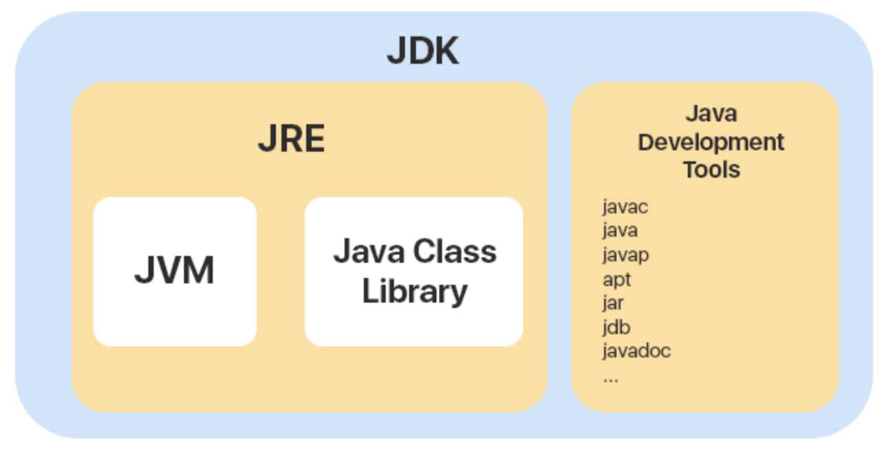
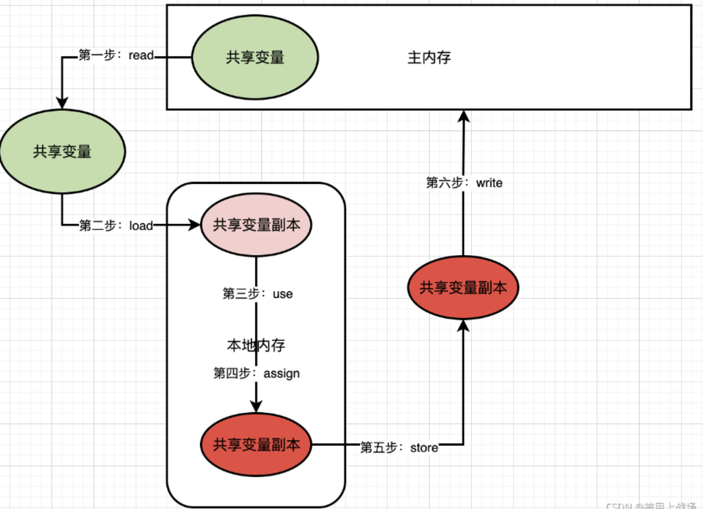
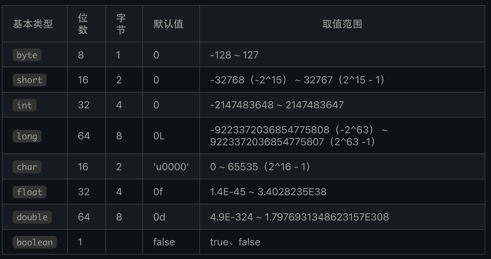
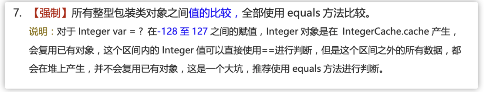
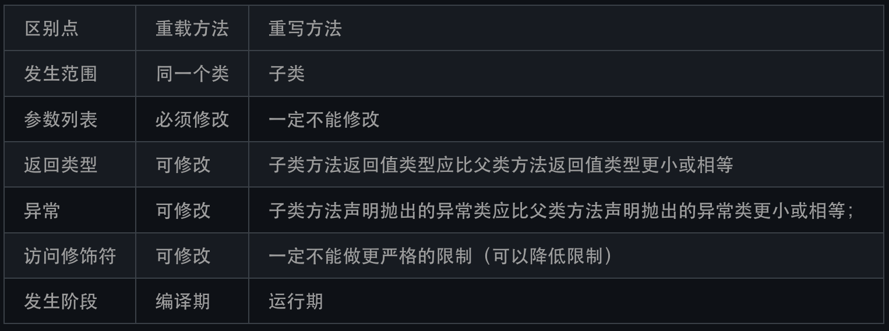
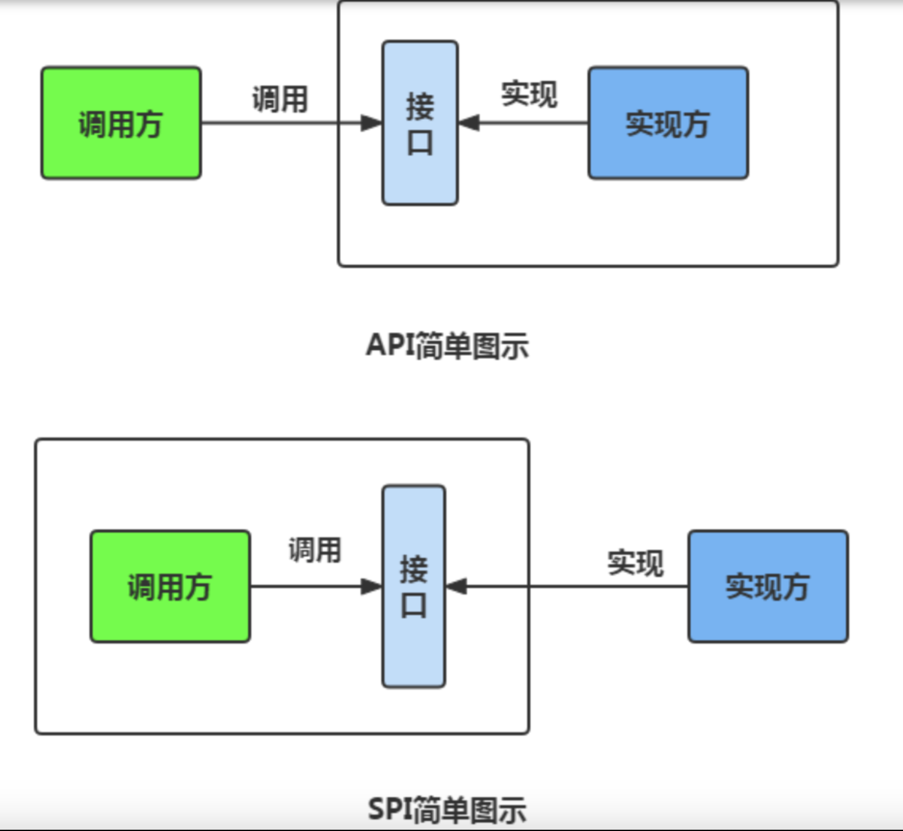
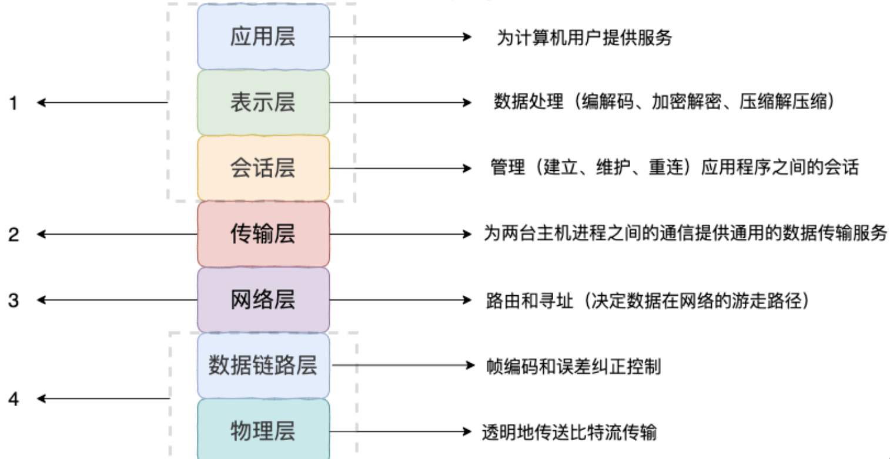

# Java基础

### Java SE vs Java EE

- Java SE（Java Platform，Standard Edition）: Java 平台标准版，Java 编程语言的基础，它包含了支持 Java 应用程序开发和运行的核心类库以及虚拟机等核心组件。Java SE 可以用于构建桌面应用程序或简单的服务器应用程序。
- Java EE（Java Platform, Enterprise Edition ）：Java 平台企业版，建立在 Java SE 的基础上，包含了支持企业级应用程序开发和部署的标准和规范（比如 Servlet、JSP、EJB、JDBC、JPA、JTA、JavaMail、JMS）。 Java EE 可以用于构建分布式、可移植、健壮、可伸缩和安全的服务端 Java 应用程序，例如 Web 应用程序。

简单来说，Java SE 是 Java 的基础版本，Java EE 是 Java 的高级版本。Java SE 更适合开发桌面应用程序或简单的服务器应用程序，Java EE 更适合开发复杂的企业级应用程序或 Web 应用程序。

### JDK vs JRE vs JVM

JDK（Java Development Kit），它是功能齐全的 Java SDK，是提供给开发者使用，能够创建和编译 Java 程序的开发套件。它包含了 JRE，同时还包含了编译 java 源码的编译器 javac 以及一些其他工具比如 javadoc（文档注释工具）、jdb（调试器）、jconsole（基于 JMX 的可视化监控⼯具）、javap（反编译工具）等等。

JRE（Java Runtime Environment） 是 Java 运行时环境。它是运行已编译 Java 程序所需的所有内容的集合，主要包括 Java 虚拟机（JVM）、Java 基础类库（Class Library）。

也就是说，JRE 是 Java 运行时环境，仅包含 Java 应用程序的运行时环境和必要的类库。而 JDK 则包含了 JRE，同时还包括了 javac、javadoc、jdb、jconsole、javap 等工具，可以用于 Java 应用程序的开发和调试。

Java 虚拟机（JVM）是运行 Java 字节码的虚拟机。JVM 有针对不同系统的特定实现（Windows，Linux，macOS），目的是使用相同的字节码，它们都会给出相同的结果。字节码和不同系统的 JVM 实现是 Java 语言“一次编译，随处可以运行”的关键所在。




### JMM了解吗

JMM定义了Java 虚拟机(JVM)在计算机内存(RAM)中的工作方式。 JMM可以理解为是一个规范，一个抽象概念，并不真实存在。

内存模型可以理解为在特定的操作协议下，对特定的内存或者高速缓存进行读写访问的过程抽象描述，不同架构下的物理机拥有不一样的内存模型，Java虚拟机是一个实现了跨平台的虚拟系统，因此它也有自己的内存模型，即Java内存模型（Java Memory Model, JMM）。

因此它不是对物理内存的规范，而是在虚拟机基础上进行的规范从而实现平台一致性，以达到Java程序能够“一次编写，到处运行”。

> JMM工作流程

- 线程之间的共享变量存储在主内存（Main Memory）中。
  - **共享变量 <--->主内存**
- 每个线程都有一个私有的**本地内存**（Local Memory）。
- 本地内存中存储了该线程以读/写共享变量的副本。
  - **共享变量的副本<--->本地内存**




### **JMM特性？

- 原子性
  - 一个操作不能被打断，要么全部执行完毕，要么不执行。
- 可见性
  - 一个线程对共享变量做了修改之后，其他的线程立即能够看到（感知到）该变量的这种修改（变化）。Java内存模型是通过将在工作内存中的变量修改后的值同步到主内存，在读取变量前从主内存刷新最新值到工作内存中，这种依赖主内存的方式来实现可见性的。
  - **volatile的规则保证了volatile变量值修改后的新值立刻同步到主内存，每次使用volatile变量前立即从主内存中刷新，因此volatile保证了多线程之间的操作变量的可见性，而普通变量则不能保证这一点**。并不能保证原子性。更多可以看[这个](https://cloud.tencent.com/developer/article/2069822)
  - 除了volatile关键字能实现可见性之外，还有synchronized，Lock，final也是可以的。
  - 使用synchronized关键字，在同步方法/同步块开始时（Monitor Enter）,使用共享变量时会从主内存中刷新变量值到工作内存中，在同步方法/同步块结束时(Monitor Exit),会将工作内存中的变量值同步到主内存中去。
  - 使用Lock接口的最常用的实现ReentrantLock(重入锁)来实现可见性：当我们在方法的开始位置执行lock.lock()方法，即使用共享变量时会从主内存中刷新变量值到工作内存中，在方法的最后finally块里执行lock.unlock()方法,即会将工作内存中的变量值同步到主内存中去。
  - final关键字的可见性是指：被final修饰的变量，在构造函数一旦初始化完成，并且在构造函数中并没有把“this”的引用传递出去，那么其他线程就可以看到final变量的值。
- 有序性
  - 对于一个线程的代码而言，我们总是以为代码的执行是从前往后的，依次执行的。这么说不能说完全不对，在单线程程序里，确实会这样执行；但是在多线程并发时，程序的执行就有可能出现乱序。用一句话可以总结为：在本线程内观察，操作都是有序的；如果在一个线程中观察另外一个线程，所有的操作都是无序的。前半句是指“线程内表现为串行语义”,后半句是指“指令重排”现象和“工作内存和主内存同步延迟”现象。


### 字节码

在 Java 中，JVM 可以理解的代码就叫做字节码（即扩展名为 `.class` 的文件），它不面向任何特定的处理器，只面向虚拟机。Java 语言通过字节码的方式，在一定程度上解决了传统解释型语言执行效率低的问题，同时又保留了解释型语言可移植的特点。所以， Java 程序运行时相对来说还是高效的（不过，和 C、 C++，Rust，Go 等语言还是有一定差距的），而且，由于字节码并不针对一种特定的机器，因此，Java 程序无须重新编译便可在多种不同操作系统的计算机上运行。


### 为什么说 Java 编译与解释并存？

**编译型**：编译型语言会通过编译器将源代码一次性翻译成可被该平台执行的机器码。一般情况下，编译语言的执行速度比较快，开发效率比较低。常见的编译性语言有 C、C++、Go、Rust 等等。

**解释型**：解释型语言会通过解释器一句一句的将代码解释（interpret）为机器代码后再执行。解释型语言开发效率比较快，执行速度比较慢。常见的解释性语言有 Python、JavaScript、PHP 等等。

**为什么说 Java 语言“编译与解释并存”？**

这是因为 Java 语言既具有编译型语言的特征，也具有解释型语言的特征。因为 Java 程序要经过先编译，后解释两个步骤，由 Java 编写的程序需要先经过编译步骤，生成字节码（`.class` 文件），这种字节码必须由 Java 解释器来解释执行。

此外 `.class->机器码` 这一步， JVM 类加载器首先加载字节码文件，然后通过解释器逐行解释执行，这种方式的执行速度会相对比较慢。然而，有些方法和代码块是经常需要被调用的(也就是所谓的热点代码)，所以后面引进了 JIT（Just in Time Compilation） 编译器， JIT 属于运行时编译。当 JIT 编译器完成第一次编译后，其会将字节码对应的机器码保存下来，下次可以直接使用，以提高效率。这也说 Java 是编译与解释共存的语言 的另一个原因

> HotSpot 采用了惰性评估(Lazy Evaluation)的做法，根据二八定律，消耗大部分系统资源的只有那一小部分的代码（热点代码），而这也就是 JIT 所需要编译的部分。JVM 会根据代码每次被执行的情况收集信息并相应地做出一些优化，因此执行的次数越多，它的速度就越快。


### AOT是什么？

JDK 9 引入了一种新的编译模式 **AOT(Ahead of Time Compilation)** 。和 JIT 不同的是，这种编译模式会在程序被**执行前**就将其编译成机器码，属于静态编译（C、 C++，Rust，Go 等语言就是静态编译）。AOT 避免了 JIT 预热等各方面的开销，可以提高 Java 程序的启动速度，避免预热时间长。并且，AOT 还能减少内存占用和增强 Java 程序的安全性（AOT 编译后的代码不容易被反编译和修改），特别适合云原生场景。

AOT 的主要优势在于启动时间、内存占用和打包体积。JIT 的主要优势在于具备更高的极限处理能力，可以降低请求的最大延迟。

**既然 AOT 这么多优点，那为什么不全部使用这种编译方式呢？**

 JIT 与 AOT 两者各有优点，只能说 AOT 更适合当下的云原生场景，对微服务架构的支持也比较友好。除此之外，AOT 编译无法支持 Java 的一些动态特性，如反射、动态代理、动态加载、JNI（Java Native Interface）等。然而，很多框架和库（如 Spring、CGLIB）都用到了这些特性。如果只使用 AOT 编译，那就没办法使用这些框架和库了，或者说需要针对性地去做适配和优化。举个例子，CGLIB 动态代理使用的是 ASM 技术，而这种技术大致原理是运行时直接在内存中生成并加载修改后的字节码文件也就是 `.class` 文件，如果全部使用 AOT 提前编译，也就不能使用 ASM 技术了。为了支持类似的动态特性，所以选择使用 JIT 即时编译器。


### Java 和 C++ 的区别?

虽然，Java 和 C++ 都是面向对象的语言，都支持封装、继承和多态，但是，它们还是有挺多不相同的地方：

- Java 不提供指针来直接访问内存，程序内存更加安全
- Java 的类是单继承的，C++ 支持多重继承；虽然 Java 的类不可以多继承，但是接口可以多继承。
- Java 有自动内存管理垃圾回收机制(GC)，不需要程序员手动释放无用内存。
- C ++同时支持方法重载和操作符重载，但是 Java 只支持方法重载（操作符重载增加了复杂性，这与 Java 最初的设计思想不符）。
- ……


### java注释有哪些？

1. **单行注释**：通常用于解释方法内某单行代码的作用。
2. **多行注释**：通常用于解释一段代码的作用。
3. **文档注释**：通常用于生成 Java 开发文档。

注释并不会执行(编译器在编译代码之前会把代码中的所有注释抹掉,字节码中不保留注释)


### 标识符和关键字区别？

为程序、类、变量、方法等取名字，就是 **标识符** 。有一些标识符，Java 语言已经赋予了其特殊的含义，只能用于特定的地方，这些特殊的标识符就是 **关键字** 。简单来说，**关键字是被赋予特殊含义的标识符** 。如public，int，try等


### 移位运算符

java有三种移位运算符

- `<<` :左移运算符，向左移若干位，高位丢弃，低位补零。`x << 1`,相当于 x 乘以 2(不溢出的情况下)。
- `>>` :带符号右移，向右移若干位，高位补符号位，低位丢弃。正数高位补 0,负数高位补 1。`x >> 1`,相当于 x 除以 2。
- `>>>` :无符号右移，忽略符号位，空位都以 0 补齐。

移位操作符实际上支持的类型只有`int`和`long`，编译器在对`short`、`byte`、`char`类型进行移位前，都会将其转换为`int`类型再操作。

**如果移位的位数超过数值所占有的位数会怎样？**

当 int 类型左移/右移位数大于等于 32 位操作时，会先求余（%）后再进行左移/右移操作。也就是说左移/右移 32 位相当于不进行移位操作（32%32=0），左移/右移 42 位相当于左移/右移 10 位（42%32=10）。当 long 类型进行左移/右移操作时，由于 long 对应的二进制是 64 位，因此求余操作的基数也变成了 64。


### 基础数据类型了解吗？

Java 中有 8 种基本数据类型，分别为：

- 6 种数字类型： 
  - 4 种整数型：`byte`、`short`、`int`、`long`
  - 2 种浮点型：`float`、`double`
- 1 种字符类型：`char`
- 1 种布尔型：`boolean`。




### 基本类型和包装类型？

八种基本类型都有对应的包装类分别为：`Byte`、`Short`、`Integer`、`Long`、`Float`、`Double`、`Character`、`Boolean` 

- **用途**：除了定义一些常量和局部变量之外，我们在其他地方比如方法参数、对象属性中很少会使用基本类型来定义变量。并且，包装类型可用于泛型，而基本类型不可以。
- **存储方式**：基本数据类型的局部变量存放在 Java 虚拟机栈中的局部变量表中，基本数据类型的成员变量（未被 `static` 修饰 ）存放在 Java 虚拟机的堆中。包装类型属于对象类型，我们知道几乎所有对象实例都存在于堆中。
- **占用空间**：相比于包装类型（对象类型）， 基本数据类型占用的空间往往非常小。
- **默认值**：成员变量包装类型不赋值就是 `null` ，而基本类型有默认值且不是 `null`。
- **比较方式**：对于基本数据类型来说，`==` 比较的是值。对于包装数据类型来说，`==` 比较的是对象的内存地址。所有整型包装类对象之间值的比较，全部使用 `equals()` 方法。


### 包装类型的缓存机制了解吗？

Java 基本数据类型的包装类型的大部分都用到了缓存机制来提升性能。

`Byte`,`Short`,`Integer`,`Long` 这 4 种包装类默认创建了数值 **[-128，127]** 的相应类型的缓存数据，`Character` 创建了数值在 **[0,127]** 范围的缓存数据，`Boolean` 直接返回 `True` or `False`。

Integer源码

```java
public static Integer valueOf(int i) {
    if (i >= IntegerCache.low && i <= IntegerCache.high)
        return IntegerCache.cache[i + (-IntegerCache.low)];
    return new Integer(i);
}
private static class IntegerCache {
    static final int low = -128;
    static final int high;
    static {
        // high value may be configured by property
        int h = 127;
    }
}
```

如果超出对应范围仍然会去创建新的对象，缓存的范围区间的大小只是在性能和资源之间的权衡。

两种浮点数类型的包装类 `Float`,`Double` 并没有实现缓存机制。

```java
Integer i1 = 40;
Integer i2 = new Integer(40);
System.out.println(i1==i2);
```

`Integer i1=40` 这一行代码会发生装箱，也就是说这行代码等价于 `Integer i1=Integer.valueOf(40)` 。因此，`i1` 直接使用的是缓存中的对象。而`Integer i2 = new Integer(40)` 会直接创建新的对象。所以会输出false。

所以在自动装箱的时候会使用缓存，直接新建对象是不会的。




### 自动拆箱和装箱了解吗？

**什么是自动拆装箱？**

- **装箱**：将基本类型用它们对应的引用类型包装起来；
- **拆箱**：将包装类型转换为基本数据类型；

```java
Integer i = 10;  //装箱
int n = i;   //拆箱
```

装箱其实就是调用了 包装类的`valueOf()`方法，拆箱其实就是调用了 `xxxValue()`方法。

因此，

- `Integer i = 10` 等价于 `Integer i = Integer.valueOf(10)`
- `int n = i` 等价于 `int n = i.intValue()`;

注意：如果频繁拆装箱的话，也会严重影响系统的性能。我们应该尽量避免不必要的拆装箱操作。


### 如何解决浮点数精度丢失问题？

`BigDecimal` 可以实现对浮点数的运算，不会造成精度丢失。通常情况下，大部分需要浮点数精确运算结果的业务场景（比如涉及到钱的场景）都是通过 `BigDecimal` 来做的。

```java
BigDecimal a = new BigDecimal("1.0");
BigDecimal b = new BigDecimal("0.9");
BigDecimal c = new BigDecimal("0.8");

BigDecimal x = a.subtract(b);
BigDecimal y = b.subtract(c);

System.out.println(x); /* 0.1 */
System.out.println(y); /* 0.1 */
System.out.println(Objects.equals(x, y)); /* true */
```

同理，超过long的数据，也有BigInteger类来解决


### 重载和重写区别？

重载是同一个类中多个同名方法根据不同的传参来执行不同的逻辑处理，参数类型，参数个数，参数顺序必须不同

重写发生在运行期，是子类对父类的允许访问的方法的实现过程进行重新编写。




### 可变长参数？

从 Java5 开始，Java 支持定义可变长参数，所谓可变长参数就是允许在调用方法时传入不定长度的参数。就比如下面的这个 `printVariable` 方法就可以接受 0 个或者多个参数。

```java
public static void method1(String... args) {
   //......
}
```

另外，可变参数**只能作为函数的最后一个参数**，但其前面可以有也可以没有任何其他参数。

```java
public static void method2(String arg1, String... args) {
   //......
}
```

Java 的可变参数编译后实际会被转换成一个**数组**


### 面向对象和面向过程区别？

两者的主要区别在于解决问题的方式不同：

- 面向过程把解决问题的过程拆成一个个方法，通过一个个方法的执行解决问题。
- 面向对象会先抽象出对象，然后用对象执行方法的方式解决问题。

另外，面向对象开发的程序一般更易维护、易复用、易扩展。


### 一个类没有声明构造方法，能创建对象?

构造方法是一种特殊的方法，主要作用是完成对象的初始化工作。

如果一个类没有声明构造方法，也可以执行！因为一个类即使没有声明构造方法也会有**默认的不带参数的构造方法**。如果我们自己添加了类的构造方法（无论是否有参），Java 就**不会**添加默认的无参数的构造方法了。


### 构造方法有哪些特点？是否可被 override?

构造方法特点如下：

- 名字与类名相同。
- 没有返回值，但不能用 void 声明构造函数。
- 生成类的对象时自动执行，无需调用。

构造方法不能被 override（重写）,但是可以 overload（重载），一个类中可以有多个构造函数


### 面向对象三大特征？

封装是指把一个对象的状态信息（也就是属性）隐藏在对象内部，不允许外部对象直接访问对象的内部信息。但是可以提供一些可以被外界访问的方法来操作属性。

继承是使用已存在的类的定义作为基础建立新类的基础，新类的定义可以增加新的数据或新的功能，也可以用父类的功能，但不能选择性地继承父类。通过使用继承，可以快速地创建新的类，可以提高代码的重用，程序的可维护性，节省大量创建新类的时间 ，提高我们的开发效率。

多态，顾名思义，表示一个对象具有多种的状态，具体表现为父类的引用指向子类的实例。

**多态的特点:**

- 对象类型和引用类型之间具有继承（类）/实现（接口）的关系；
- 引用类型变量发出的方法调用的到底是哪个类中的方法，必须在程序运行期间才能确定；
- 多态不能调用“只在子类存在但在父类不存在”的方法；
- 如果子类重写了父类的方法，真正执行的是子类覆盖的方法，如果子类没有覆盖父类的方法，执行的是父类的方法。


### 接口和抽象类有何异同？

**共同点**：

- 都不能被实例化。
- 都可以包含抽象方法。
- 都可以有默认实现的方法（Java 8 可以用 `default` 关键字在接口中定义默认方法）。

**区别**：

- 接口主要用于对类的行为进行约束，你实现了某个接口就具有了对应的行为。抽象类主要用于代码复用，强调的是所属关系。
- 一个类只能继承一个类，但是可以实现多个接口。
- 接口中的成员变量只能是 `public static final` 类型的，不能被修改且必须有初始值，而抽象类的成员变量默认 default，可在子类中被重新定义，也可被重新赋值。


### 深拷贝和浅拷贝区别？懂引用拷贝？

**浅拷贝**：浅拷贝会在堆上创建一个新的对象（区别于引用拷贝的一点），不过，如果原对象内部的属性是引用类型的话，浅拷贝会直接复制内部对象的引用地址，也就是说拷贝对象和原对象共用同一个内部对象。

**深拷贝**：深拷贝会完全复制整个对象，包括这个对象所包含的内部对象。

**引用拷贝**：就是两个不同的引用指向同一个对象


### Object常见方法？

Object 类是一个特殊的类，是所有类的父类。

```java
/**
 * native 方法，用于返回当前运行时对象的 Class 对象，使用了 final 关键字修饰，故不允许子类重写。
 */
public final native Class<?> getClass()
/**
 * native 方法，用于返回对象的哈希码，主要使用在哈希表中，比如 JDK 中的HashMap。
 */
public native int hashCode()
/**
 * 用于比较 2 个对象的内存地址是否相等，String 类对该方法进行了重写以用于比较字符串的值是否相等。
 */
public boolean equals(Object obj)
/**
 * native 方法，用于创建并返回当前对象的一份拷贝。
 */
protected native Object clone() throws CloneNotSupportedException
/**
 * 返回类的名字实例的哈希码的 16 进制的字符串。建议 Object 所有的子类都重写这个方法。
 */
public String toString()
/**
 * native 方法，并且不能重写。唤醒一个在此对象监视器上等待的线程(监视器相当于就是锁的概念)。如果有多个线程在等待只会任意唤醒一个。
 */
public final native void notify()
/**
 * native 方法，并且不能重写。跟 notify 一样，唯一的区别就是会唤醒在此对象监视器上等待的所有线程，而不是一个线程。
 */
public final native void notifyAll()
/**
 * native方法，并且不能重写。暂停线程的执行。注意：sleep 方法没有释放锁，而 wait 方法释放了锁 ，timeout 是等待时间。会自己醒来，然后去争夺锁
 */
public final native void wait(long timeout) throws InterruptedException
/**
 * 多了 nanos 参数，这个参数表示额外时间（以纳秒为单位，范围是 0-999999）。 所以超时的时间还需要加上 nanos 纳秒。。
 */
public final void wait(long timeout, int nanos) throws InterruptedException
/**
 * 跟之前的2个wait方法一样，只不过该方法一直等待，没有超时时间这个概念
 */
public final void wait() throws InterruptedException
/**
 * 实例被垃圾回收器回收的时候触发的操作
 */
protected void finalize() throws Throwable { }

```


### hashCode()了解多少？

`hashCode()` 的作用是获取哈希码（`int` 整数），也称为散列码。这个哈希码的作用是确定该对象在哈希表中的索引位置。

`hashCode()` 定义在 JDK 的 `Object` 类中，这就意味着 Java 中的任何类都包含有 `hashCode()` 函数。另外需要注意的是：`Object` 的 `hashCode()` 方法是本地方法，也就是用 C 语言或 C++ 实现的。

> 注意：该方法在 **Oracle OpenJDK8** 中默认是 "使用线程局部状态来实现 Marsaglia's xor-shift 随机数生成", 并不是 "地址" 或者 "地址转换而来", 不同 JDK/VM 可能不同在 **Oracle OpenJDK8** 中有六种生成方式 (其中第五种是返回地址), 通过添加 VM 参数: -XX:hashCode=4 启用第五种

为何要有？

主要用于比较对象是否相等，减小Hash结构中的比较和查找成本

- 如果两个对象的`hashCode` 值相等，那这两个对象不一定相等（哈希碰撞）。
- 如果两个对象的`hashCode` 值相等并且`equals()`方法也返回 `true`，我们才认为这两个对象相等。
- 如果两个对象的`hashCode` 值不相等，我们就可以直接认为这两个对象不相等。


### 为什么重写 equals() 时必须重写 hashCode() 方法？

因为两个相等的对象的 `hashCode` 值必须是相等。也就是说如果 `equals` 方法判断两个对象是相等的，那这两个对象的 `hashCode` 值也要相等。

如果重写 `equals()` 时没有重写 `hashCode()` 方法的话就可能会导致 `equals` 方法判断是相等的两个对象，`hashCode` 值却不相等。Hash结构的底层就是先比较hashCode，然后在比较equals，

**思考**：重写 `equals()` 时没有重写 `hashCode()` 方法的话，使用 `HashMap` 可能会出现什么问题。


### String&StringBuild&StringBuffer？

**可变性**

`String` 是不可变的。`StringBuilder` 与 `StringBuffer` 都继承自 `AbstractStringBuilder` 类，在 `AbstractStringBuilder` 中也是使用字符数组保存字符串，不过没有使用 `final` 和 `private` 关键字修饰，最关键的是这个 `AbstractStringBuilder` 类还提供了很多修改字符串的方法比如 `append` 方法。

**线程安全性**

`String` 中的对象是不可变的，也就可以理解为常量，线程安全。`AbstractStringBuilder` 是 `StringBuilder` 与 `StringBuffer` 的公共父类，定义了一些字符串的基本操作，如 `expandCapacity`、`append`、`insert`、`indexOf` 等公共方法。`StringBuffer` 对方法加了同步锁或者对调用的方法加了同步锁，所以是线程安全的。`StringBuilder` 并没有对方法进行加同步锁，所以是非线程安全的。

**性能**

每次对 `String` 类型进行改变的时候，都会生成一个新的 `String` 对象，然后将指针指向新的 `String` 对象。`StringBuffer` 每次都会对 `StringBuffer` 对象本身进行操作，而不是生成新的对象并改变对象引用。相同情况下使用 `StringBuilder` 相比使用 `StringBuffer` 仅能获得 10%~15% 左右的性能提升，但却要冒多线程不安全的风险。


### String为啥不可变？

`String` 类中使用 `final` 关键字修饰字符数组来保存字符串。

```java
public final class String implements java.io.Serializable, Comparable<String>, CharSequence {
    private final char value[];
  //...
}
```

> 我们知道被 `final` 关键字修饰的类不能被继承，修饰的方法不能被重写，修饰的变量是基本数据类型则值不能改变，修饰的变量是引用类型则不能再指向其他对象。因此，`final` 关键字修饰的数组保存字符串并不是 `String` 不可变的根本原因，因为这个数组保存的字符串是可变的（`final` 修饰引用类型变量的情况）。
>
> `String` 真正不可变有下面几点原因：
>
> 1. 保存字符串的数组被 `final` 修饰且为私有的，并且`String` 类没有提供/暴露修改这个字符串的方法。
> 2. `String` 类被 `final` 修饰导致其不能被继承，进而避免了子类破坏 `String` 不可变。


### Java 9 为何要将 `String` 的底层实现由 `char[]` 改成了 `byte[]` ?

新版的 String 其实支持两个编码方案：Latin-1 和 UTF-16。如果字符串中包含的汉字没有超过 Latin-1 可表示范围内的字符，那就会使用 Latin-1 作为编码方案。Latin-1 编码方案下，`byte` 占一个字节(8 位)，`char` 占用 2 个字节（16），`byte` 相较 `char` 节省一半的内存空间。

如果字符串中包含的汉字超过 Latin-1 可表示范围内的字符，`byte` 和 `char` 所占用的空间是一样的。


### 字符串拼接+还是StrignBuild？

字符串对象通过“+”的字符串拼接方式，实际上是通过 `StringBuilder` 调用 `append()` 方法实现的，拼接完成之后调用 `toString()` 得到一个 `String` 对象 。toString里面其实是再次new String()，所以频繁的使用+会创建很多没必要的对象

> 不过，使用 “+” 进行字符串拼接会产生大量的临时对象的问题在 JDK9 中得到了解决。在 JDK9 当中，字符串相加 “+” 改为了用动态方法 `makeConcatWithConstants()` 来实现，而不是大量的 `StringBuilder` 了。这个改进是 JDK9 的 [JEP 280open in new window](https://openjdk.org/jeps/280) 提出的，这也意味着 JDK 9 之后，可以放心使用“+” 进行字符串拼接了


### 字符串常量池作用？

**字符串常量池** 是 JVM 为了提升性能和减少内存消耗针对字符串（String 类）专门开辟的一块区域，主要目的是为了避免字符串的重复创建。

```java
// 在堆中创建字符串对象”ab“
// 将字符串对象”ab“的引用保存在字符串常量池中
String aa = "ab";
// 直接返回字符串常量池中字符串对象”ab“的引用
String bb = "ab";
System.out.println(aa==bb);// true
```


### String#intern 方法有什么作用?

`String.intern()` 是一个 native（本地）方法，其作用是将指定的字符串对象的引用保存在字符串常量池中，可以简单分为两种情况：

- 如果字符串常量池中保存了对应的字符串对象的引用，就直接返回该引用。
- 如果字符串常量池中没有保存了对应的字符串对象的引用，那就在常量池中创建一个指向该字符串对象的引用并返回。


### Exception 和 Error 有什么区别？

在 Java 中，所有的异常都有一个共同的祖先 `java.lang` 包中的 `Throwable` 类。`Throwable` 类有两个重要的子类:

- **`Exception`** :程序本身可以处理的异常，可以通过 `catch` 来进行捕获。`Exception` 又可以分为 Checked Exception (受检查异常，必须处理) 和 Unchecked Exception (不受检查异常，可以不处理)。
- **`Error`**：`Error` 属于程序无法处理的错误 ，不建议通过`catch`捕获 。例如 Java 虚拟机运行错误（`Virtual MachineError`）、虚拟机内存不够错误(`OutOfMemoryError`)、类定义错误（`NoClassDefFoundError`）等 。这些异常发生时，Java 虚拟机（JVM）一般会选择线程终止。


### Checked Exception 和 Unchecked Exception 有什么区别？

**Checked Exception** 即 受检查异常 ，Java 代码在编译过程中，如果受检查异常没有被 `catch`或者`throws` 关键字处理的话，就没办法通过编译。

除了`RuntimeException`及其子类以外，其他的`Exception`类及其子类都属于受检查异常 。常见的受检查异常有：IO 相关的异常、`ClassNotFoundException`、`SQLException`...。

**Unchecked Exception** 即 **不受检查异常** ，Java 代码在编译过程中 ，我们即使不处理不受检查异常也可以正常通过编译。

`RuntimeException` 及其子类都统称为非受检查异常，常见的有（建议记下来，日常开发中会经常用到）：

- `NullPointerException`(空指针错误)
- `IllegalArgumentException`(参数错误比如方法入参类型错误)
- `NumberFormatException`（字符串转换为数字格式错误，`IllegalArgumentException`的子类）
- `ArrayIndexOutOfBoundsException`（数组越界错误）
- `ClassCastException`（类型转换错误）
- `ArithmeticException`（算术错误）
- `SecurityException` （安全错误比如权限不够）
- `UnsupportedOperationException`(不支持的操作错误比如重复创建同一用户)


### Throwable 类常用方法有哪些？

- `String getMessage()`: 返回异常发生时的简要描述
- `String toString()`: 返回异常发生时的详细信息
- `String getLocalizedMessage()`: 返回异常对象的本地化信息。使用 `Throwable` 的子类覆盖这个方法，可以生成本地化信息。如果子类没有覆盖该方法，则该方法返回的信息与 `getMessage()`返回的结果相同
- `void printStackTrace()`: 在控制台上打印 `Throwable` 对象封装的异常信息


### try-catch-finally 如何使用？

- `try`块：用于捕获异常。其后可接零个或多个 `catch` 块，如果没有 `catch` 块，则必须跟一个 `finally` 块。
- `catch`块：用于处理 try 捕获到的异常。
- `finally` 块：无论是否捕获或处理异常，`finally` 块里的语句都会被执行。**当在 `try` 块或 `catch` 块中遇到 `return` 语句时，`finally` 语句块将在方法返回之前被执行。**

**注意：不要在 finally 语句块中使用 return!** 当 try 语句和 finally 语句中都有 return 语句时，try 语句块中的 return 语句会被忽略。这是因为 try 语句中的 return 返回值会先被暂存在一个本地变量中，当执行到 finally 语句中的 return 之后，这个本地变量的值就变为了 finally 语句中的 return 返回值。

```java
public static void main(String[] args) {
    System.out.println(f(2));
}

public static int f(int value) {
    try {
        return value * value;
    } finally {
        if (value == 2) {
            return 0;
        }
    }
}
// 输出2
```


### 如何使用 `try-with-resources` 代替`try-catch-finally`？

1. **适用范围（资源的定义）：** 任何实现 `java.lang.AutoCloseable`或者 `java.io.Closeable` 的对象
2. **关闭资源和 finally 块的执行顺序：** 在 `try-with-resources` 语句中，任何 catch 或 finally 块在声明的资源关闭后运行

《Effective Java》中明确指出：

> 面对必须要关闭的资源，我们总是应该优先使用 `try-with-resources` 而不是`try-finally`。随之产生的代码更简短，更清晰，产生的异常对我们也更有用。`try-with-resources`语句让我们更容易编写必须要关闭的资源的代码，若采用`try-finally`则几乎做不到这点。

Java 中类似于`InputStream`、`OutputStream`、`Scanner`、`PrintWriter`等的资源都需要我们调用`close()`方法来手动关闭，一般情况下我们都是通过`try-catch-finally`语句来实现这个需求，如下

```java
//读取文本文件的内容
Scanner scanner = null;
try {
    scanner = new Scanner(new File("D://read.txt"));
    while (scanner.hasNext()) {
        System.out.println(scanner.nextLine());
    }
} catch (FileNotFoundException e) {
    e.printStackTrace();
} finally {
    if (scanner != null) {
        scanner.close();
    }
}
```

使用 Java 7 之后的 `try-with-resources` 语句改造上面的代码:

```java
try (Scanner scanner = new Scanner(new File("test.txt"))) {
    while (scanner.hasNext()) {
        System.out.println(scanner.nextLine());
    }
} catch (FileNotFoundException fnfe) {
    fnfe.printStackTrace();
}
```

当然多个资源需要关闭的时候，使用 `try-with-resources` 实现起来也非常简单，如果你还是用`try-catch-finally`可能会带来很多问题。通过使用分号分隔，可以在`try-with-resources`块中声明多个资源。

```java
try (BufferedInputStream bin = new BufferedInputStream(new FileInputStream(new File("test.txt")));
     BufferedOutputStream bout = new BufferedOutputStream(new FileOutputStream(new File("out.txt")))) {
    int b;
    while ((b = bin.read()) != -1) {
        bout.write(b);
    }
}
catch (IOException e) {
    e.printStackTrace();
}
```


### 什么是泛型？

**Java 泛型（Generics）** 是 JDK 5 中引入的一个新特性。使用泛型参数，可以增强代码的可读性以及稳定性。主要作用是可以动态绑定类型

编译器可以对泛型参数进行检测，并且通过泛型参数可以指定传入的对象类型。比如 `ArrayList<Person> persons = new ArrayList<Person>()` 这行代码就指明了该 `ArrayList` 对象只能传入 `Person` 对象，如果传入其他类型的对象就会报错。

```java
ArrayList<E> extends AbstractList<E>
```

并且，原生 `List` 返回类型是 `Object` ，需要手动转换类型才能使用，使用泛型后编译器自动转换。


### 泛型有哪些？

泛型一般有三种使用方式:**泛型类**、**泛型接口**、**泛型方法**。

**1.泛型类**：

```java
//此处T可以随便写为任意标识，常见的如T、E、K、V等形式的参数常用于表示泛型
//在实例化泛型类时，必须指定T的具体类型
public class Generic<T>{

    private T key;

    public Generic(T key) {
        this.key = key;
    }

    public T getKey(){
        return key;
    }
}
```

如何实例化泛型类：

```java
Generic<Integer> genericInteger = new Generic<Integer>(123456);
```

**2.泛型接口**：

```java
public interface Generator<T> {
    public T method();
}
```

实现泛型接口，不指定类型：

```java
class GeneratorImpl<T> implements Generator<T>{
    @Override
    public T method() {
        return null;
    }
}
```

实现泛型接口，指定类型：

```java
class GeneratorImpl<T> implements Generator<String>{
    @Override
    public String method() {
        return "hello";
    }
}
```

**3.泛型方法**：

```java
 public static <E> void printArray(E[] inputArray)
 {
       for (E element : inputArray){
          System.out.printf("%s ", element);
       }
       System.out.println();
  }
```

使用：

```java
// 创建不同类型数组：Integer, Double 和 Character
Integer[] intArray = { 1, 2, 3 };
String[] stringArray = { "Hello", "World" };
printArray( intArray  );
printArray( stringArray  );
```

>注意: `public static < E > void printArray( E[] inputArray )` 一般被称为静态泛型方法;在 java 中泛型只是一个占位符，必须在传递类型后才能使用。类在实例化时才能真正的传递类型参数，由于静态方法的加载先于类的实例化，也就是说类中的泛型还没有传递真正的类型参数，静态的方法的加载就已经完成了，所以静态泛型方法是没有办法使用类上声明的泛型的。只能使用自己声明的 `<E>`


### 何谓反射？

反射之所以被称为框架的灵魂，主要是因为它赋予了我们在运行时分析类以及执行类中方法的能力。通过反射你可以获取任意一个类的所有属性和方法，你还可以调用这些方法和属性。


### 反射的优缺点？

反射可以让我们的代码更加灵活、为各种框架提供开箱即用的功能提供了便利。

不过，反射让我们在运行时有了分析操作类的能力的同时，也增加了安全问题，比如可以无视泛型参数的安全检查（泛型参数的安全检查发生在编译时）。另外，反射的性能也要稍差点，不过，对于框架来说实际是影响不大的。


### 反射的应用场景？

平时大部分时候都是在写业务代码，很少会接触到直接使用反射机制的场景。但是！这并不代表反射没有用。相反，正是因为反射，才能这么轻松地使用各种框架。像 Spring/Spring Boot、MyBatis 等等框架中都大量使用了反射机制。

**这些框架中也大量使用了动态代理，而动态代理的实现也依赖反射。**

比如下面是通过 JDK 实现动态代理的示例代码，其中就使用了反射类 `Method` 来调用指定的方法。

```java
public class DebugInvocationHandler implements InvocationHandler {
  /**
   * 代理类中的真实对象
   */
  private final Object target;

  public DebugInvocationHandler(Object target) {
      this.target = target;
  }

  public Object invoke(Object proxy, Method method, Object[] args) throws InvocationTargetException, IllegalAccessException {
      System.out.println("before method " + method.getName());
      Object result = method.invoke(target, args);
      System.out.println("after method " + method.getName());
      return result;
  }
}
```

另外，像 Java 中的一大利器 **注解** 的实现也用到了反射。为什么你使用 Spring 的时候 ，一个`@Component`注解就声明了一个类为 Spring Bean 呢？为什么你通过一个 `@Value`注解就读取到配置文件中的值呢？究竟是怎么起作用的呢？这些都是因为你可以基于反射分析类，然后获取到类/属性/方法/方法的参数上的注解。你获取到注解之后，就可以做进一步的处理。


### 何谓注解？

`Annotation` （注解） 是 Java5 开始引入的新特性，可以看作是一种特殊的注释，主要用于修饰类、方法或者变量，提供某些信息供程序在编译或者运行时使用。

注解本质是一个继承了`Annotation` 的特殊接口：

```java
@Target(ElementType.METHOD)
@Retention(RetentionPolicy.SOURCE)
public @interface Override {

}

public interface Override extends Annotation{

}
```

JDK 提供了很多内置的注解（比如 `@Override`、`@Deprecated`），同时，我们还可以自定义注解。


### 注解的解析方法有哪几种？

注解只有被解析之后才会生效，常见的解析方法有两种：

- **编译期直接扫描**：编译器在编译 Java 代码的时候扫描对应的注解并处理，比如某个方法使用`@Override` 注解，编译器在编译的时候就会检测当前的方法是否重写了父类对应的方法。
- **运行期通过反射处理**：像框架中自带的注解(比如 Spring 框架的 `@Value`、`@Component`)都是通过反射来进行处理的。


### 了解SPI？

SPI 即 Service Provider Interface ，字面意思就是：“服务提供者的接口”，专门提供给服务提供者或者扩展框架功能的开发者去使用的一个接口。SPI 将服务接口和具体的服务实现分离开来，将服务调用方和服务实现者解耦，能够提升程序的扩展性、可维护性。修改或者替换服务实现并不需要修改调用方。

很多框架都使用了 Java 的 SPI 机制，比如：Spring 框架、数据库加载驱动、日志接口、以及 Dubbo 的扩展实现等等。



一般模块之间都是通过接口进行通讯，那我们在服务调用方和服务实现方（也称服务提供者）之间引入一个“接口”。

当实现方提供了接口和实现，我们可以通过调用实现方的接口从而拥有实现方给我们提供的能力，这就是 API ，这种接口和实现都是放在实现方的。

当接口存在于调用方这边时，就是 SPI ，由接口调用方确定接口规则，然后由不同的厂商去根据这个规则对这个接口进行实现，从而提供服务。

举个通俗易懂的例子：公司 H 是一家科技公司，新设计了一款芯片，然后现在需要量产了，而市面上有好几家芯片制造业公司，这个时候，只要 H 公司指定好了这芯片生产的标准（定义好了接口标准），那么这些合作的芯片公司（服务提供者）就按照标准交付自家特色的芯片（提供不同方案的实现，但是给出来的结果是一样的）。

SPI 的优缺点？

通过 SPI 机制能够大大地提高接口设计的灵活性，但是 SPI 机制也存在一些缺点，比如：

- 需要遍历加载所有的实现类，不能做到按需加载，这样效率还是相对较低的。
- 当多个 `ServiceLoader` 同时 `load` 时，会有并发问题。


### 什么是序列化?什么是反序列化?

如果我们需要持久化 Java 对象比如将 Java 对象保存在文件中，或者在网络传输 Java 对象，这些场景都需要用到序列化。

简单来说：

- **序列化**：将数据结构或对象转换成二进制字节流的过程
- **反序列化**：将在序列化过程中所生成的二进制字节流转换成数据结构或者对象的过程

对于 Java 这种面向对象编程语言来说，我们序列化的都是对象（Object）也就是实例化后的类(Class)，但是在 C++这种半面向对象的语言中，struct(结构体)定义的是数据结构类型，而 class 对应的是对象类型。

下面是序列化和反序列化常见应用场景：

- 对象在进行网络传输（比如远程方法调用 RPC 的时候）之前需要先被序列化，接收到序列化的对象之后需要再进行反序列化；
- 将对象存储到文件之前需要进行序列化，将对象从文件中读取出来需要进行反序列化；
- 将对象存储到数据库（如 Redis）之前需要用到序列化，将对象从缓存数据库中读取出来需要反序列化；
- 将对象存储到内存之前需要进行序列化，从内存中读取出来之后需要进行反序列化。

**序列化协议对应于 TCP/IP 4 层模型的哪一层？**



如上图所示，OSI 七层协议模型中，表示层做的事情主要就是对应用层的用户数据进行处理转换为二进制流。反过来的话，就是将二进制流转换成应用层的用户数据。这不就对应的是序列化和反序列化么？因为，OSI 七层协议模型中的应用层、表示层和会话层对应的都是 TCP/IP 四层模型中的应用层，所以序列化协议属于 TCP/IP 协议应用层的一部分。


### 如果有些字段不想进行序列化怎么办？

对于不想进行序列化的变量，使用 `transient` 关键字修饰。

`transient` 关键字的作用是：阻止实例中那些用此关键字修饰的的变量序列化；当对象被反序列化时，被 `transient` 修饰的变量值不会被持久化和恢复。

关于 `transient` 还有几点注意：

- `transient` 只能修饰变量，不能修饰类和方法。
- `transient` 修饰的变量，在反序列化后变量值将会被置成类型的默认值。例如，如果是修饰 `int` 类型，那么反序列后结果就是 `0`。
- `static` 变量因为不属于任何对象(Object)，所以无论有没有 `transient` 关键字修饰，均不会被序列化。


### 常见序列化协议有哪些？

JDK 自带的序列化方式一般不会用 ，因为序列化效率低并且存在安全问题。比较常用的序列化协议有 Hessian、Kryo、Protobuf、ProtoStuff，这些都是基于二进制的序列化协议。

像 JSON 和 XML 这种属于文本类序列化方式。虽然可读性比较好，但是性能较差，一般不会选择。


### Java IO 流了解吗？

IO 即 `Input/Output`，输入和输出。数据输入到计算机内存的过程即输入，反之输出到外部存储（比如数据库，文件，远程主机）的过程即输出。数据传输过程类似于水流，因此称为 IO 流。IO 流在 Java 中分为输入流和输出流，而根据数据的处理方式又分为字节流和字符流。

Java IO 流的 40 多个类都是从如下 4 个抽象类基类中派生出来的。

- `InputStream`/`Reader`: 所有的输入流的基类，前者是字节输入流，后者是字符输入流。
- `OutputStream`/`Writer`: 所有输出流的基类，前者是字节输出流，后者是字符输出流。


### I/O 流为什么要分为字节流和字符流呢?

问题本质想问：**不管是文件读写还是网络发送接收，信息的最小存储单元都是字节，那为什么 I/O 流操作要分为字节流操作和字符流操作呢？**

个人认为主要有两点原因：

- 字符流是由 Java 虚拟机将字节转换得到的，这个过程还算是比较耗时；
- 如果我们不知道编码类型的话，使用字节流的过程中很容易出现乱码问题。


### 什么是语法糖？

**语法糖（Syntactic sugar）** 代指的是编程语言为了方便程序员开发程序而设计的一种特殊语法，这种语法对编程语言的功能并没有影响。实现相同的功能，基于语法糖写出来的代码往往更简单简洁且更易阅读。

举个例子，Java 中的 `for-each` 就是一个常用的语法糖，其原理其实就是基于普通的 for 循环和迭代器。

```java
String[] strs = {"xxx", "xxxx", "xxxx"};
for (String s : strs) {
    System.out.println(s);
}
```

不过，JVM 其实并不能识别语法糖，Java 语法糖要想被正确执行，需要先通过编译器进行解糖，也就是在程序编译阶段将其转换成 JVM 认识的基本语法。这也侧面说明，Java 中真正支持语法糖的是 Java 编译器而不是 JVM。如果你去看`com.sun.tools.javac.main.JavaCompiler`的源码，你会发现在`compile()`中有一个步骤就是调用`desugar()`，这个方法就是负责解语法糖的实现的。

Java 中最常用的语法糖主要有泛型、自动拆装箱、变长参数、枚举、内部类、增强 for 循环、try-with-resources 语法、lambda 表达式等。

