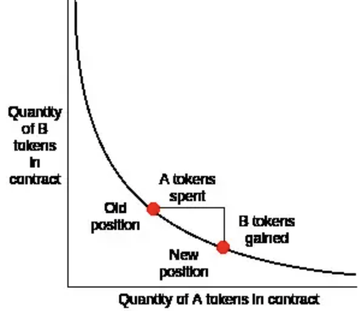

# MEV 最大可提取价值

最大可提取价值 (MEV) 是指通过在区块中添加和排除交易并更改区块中的交易顺序，可以从区块生产中提取的超过标准区块奖励和燃料费用的最大值。

## MEV 提取

从理论上讲，最大可提取价值完全属于验证者，因为他们是唯一可以保证执行有利可图的最大可提取价值机会的一方。 但实际上，大部分 MEV 是由称为“搜索人”的独立网络参与者提取的。 搜索人在区块链数据上运行复杂的算法来检测盈利的 MEV 机会，并且有机器人自动将这些盈利交易提交到网络。

无论如何，验证者确实会获得全部最大可提取价值金额的一部分，因为搜索者愿意支付高昂的燃料费用（这些费用将归验证者所有），以换取将其有利可图的交易纳入一个区块的更高可能性。 假定搜索人在经济上是合理的。搜索人愿意支付的燃料费将是 MEV 的 100% 的金额（也不会是 100%，不然他就没得赚了，因为如果燃料费更高，搜索人将亏钱）。

这样一来，对于一些竞争激烈的最大可提取价值机会，例如去中心化交易所套利，搜索者可能不得不将其最大可提取价值总收入的 90% 甚至更多作为燃料费用支付向验证者，因为很多人都想进行同样有利可图的套利交易。 这是因为，确保套利交易运行的唯一方法是提交最高燃料费用的交易。

### 搜索人

最大可提取价值（MEV，Maximal Extractable Value）是指验证者或矿工通过选择、排序和包含交易在区块链中所能获得的额外收益。理论上，验证者具有完全控制区块的权力，能够优先处理对他们有利的交易，从而最大化他们的收益。然而，在实际操作中，大部分MEV是由称为“搜索人”的独立网络参与者提取的。

1. **机会检测**：搜索人使用复杂的算法和工具在区块链数据上运行，检测潜在的有利可图的MEV机会。这些机会包括套利、清算和前运行（front-running）等。
2. **交易生成**：一旦搜索人发现MEV机会，他们会生成相应的交易以捕捉这些机会。这些交易可以是多种类型的组合，以确保他们可以从中获利。
3. **机器人提交**：搜索人通常会使用自动化的机器人（bot）将这些盈利交易提交到网络。这些机器人经过编程，可以快速反应和提交交易，以确保搜索人能够在其他竞争者之前抓住机会。
4. **竞价机制**：在一些情况下，搜索人会参与竞价，付费给验证者或矿工以确保他们的交易被优先处理。这种竞价机制进一步复杂化了MEV的提取过程，但同时也增加了搜索人成功捕获MEV机会的概率。

### 机器人

在区块链和加密货币领域，**机器人（bot）是指自动化软件程序**，**用于执行预定的任务**。针对最大可提取价值（MEV），机器人被设计用于自动化交易操作，以捕捉盈利机会。以下是一些关键点，帮助理解这些机器人在MEV提取中的角色：

> 机器人在MEV提取中的角色

1. **自动化检测**：机器人可以持续监控区块链上的交易和市场数据，实时检测潜在的MEV机会，如套利、清算和前运行机会。它们能够快速处理大量数据，比人类更快地发现机会。

2. **自动化交易**：一旦机器人检测到MEV机会，它们可以自动生成和提交交易。这些交易通常经过优化，以确保最大化利润。例如，机器人可以在价格低的交易对中买入代币，然后立即在价格高的交易对中卖出。

3. **优先排序**：为了确保交易能够优先处理，机器人可能会参与竞价机制，支付更高的费用给矿工或验证者，保证它们的交易在区块中优先执行。这种机制被称为“矿工提取价值”（Miner Extractable Value, MEV）竞赛。

4. **高频交易**：机器人能够执行高频交易，即在极短时间内进行大量交易。这使得它们能够迅速反应市场变化，并从中捕捉微小的价格差异，实现利润。

> 机器人类型

1. **套利机器人**：这些机器人专门寻找不同交易所或交易对之间的价格差异，进行套利交易。例如，买入价格低的代币，然后在价格高的地方卖出。

2. **清算机器人**：这些机器人监控去中心化金融（DeFi）平台上的抵押贷款和借贷情况，自动执行清算操作。当借款人的抵押物价值低于借款价值时，清算机器人会自动清算其抵押物，从中获利。

3. **前运行机器人**：这些机器人通过监控交易池中的未确认交易，提前下单，从中获利。例如，在一个大额买单进入市场前，机器人先行买入，然后利用价格上涨卖出获利。

> 机器人运作示例

假设在一个去中心化交易所（DEX）上，某代币的价格在两个交易对中存在套利机会：
- 交易对A：代币X价格为10美元
- 交易对B：代币X价格为12美元

机器人检测到这个机会后，会自动生成两笔交易：
1. 在交易对A中以10美元买入代币X。
2. 在交易对B中以12美元卖出代币X。

然后，机器人会将这两笔交易一起提交到区块链网络中，并可能支付更高的交易费以确保它们优先处理。通过这种方式，机器人实现了2美元的套利利润。

> 结论

机器人在MEV提取中起着关键作用，通过自动化技术和复杂算法，能够迅速发现和捕捉盈利机会。它们不仅提高了交易效率，还在区块链网络中扮演着重要的经济角色。

### 燃料高尔夫

“燃料高尔夫”是一种优化燃料使用的技术和策略，目的是在交易中使用最少的燃料，以降低成本或提高效率。因为它允许搜索人设置较高的燃料价格，同时保持总燃料费不变(因为使用燃料费 = 燃料价格* 燃料用量)。

通过优化燃料用量，用户可以在保持总燃料费用不变的情况下，设置较高的燃料价格。这使得他们的交易在竞价过程中具有优势，因为燃料价格较高的交易通常会被优先处理。

一些著名的燃料高尔夫技术包括：使用用长串零开头的地址(如：[0x0000000000C521824EaFf97Eac7B73B084ef9306](https://etherscan.io/address/0x0000000000c521824eaff97eac7b73b084ef9306))，因为他们的需要的存储空间较少（因而燃料也减少）；并留下很小 ERC-20 令牌余额在合约中，因为相比于更新储存插槽，初始化存储插槽需要更多的燃料（余额为 0 时）。 寻找如何更多的减少燃料使用是搜索人在积极研究的一个领域。

搜索人和开发者不断研究和开发新的燃料优化技术，以进一步减少燃料使用。这包括：

- 研究新的存储优化技术。
- 开发更高效的合约代码。
- 寻找新的燃料高尔夫策略，以在激烈的市场竞争中获得优势。

### 通用领跑者

一些搜索人并没有编写复杂的算法来检测盈利的 MEV 机会，而是运行通用的领跑者front-runner。 通用的领跑者是监控内存池以检测盈利交易的机器人。 领跑者将复制潜在的盈利交易代码，用领跑者的地址替换其地址。然后在本地执行交易，重复检查修改后的交易是否给领跑者地址带来利润。 如果交易确实有利可图，领跑者将以更替地址和更高的燃料价格提交修改后的交易。“领跑”原始交易并获取原始搜索人的 MEV。

> 领跑者的工作机制

1. **监控内存池（mempool）**：
   - 内存池是一个临时存储区，用于存储待处理的交易。所有尚未被包含在区块中的交易都会在内存池中排队等待确认。
   - 领跑者机器人会实时监控内存池，寻找有利可图的交易。

2. **复制和修改交易**：
   - 当领跑者检测到一个潜在有利可图的交易时，会复制该交易的代码。
   - 将交易中涉及的地址替换为领跑者自己的地址。
   - 在本地环境中执行修改后的交易，验证其是否能够给领跑者带来利润。

3. **提交修改后的交易**：
   - 如果验证结果显示交易确实有利可图，领跑者会将修改后的交易提交到区块链网络。
   - 领跑者会设置比原始交易更高的燃料价格，以确保其交易在原始交易之前被矿工优先处理。
   
> 领跑的影响

- **抢先执行交易**：领跑者通过高燃料价格优先执行自己的交易，从而抢先获取原本属于其他人的利润。
- **增加网络竞争**：领跑行为增加了网络的竞争，可能导致交易费用上升。
- **影响交易公平性**：领跑行为影响了交易的公平性，因为原始交易提交者的利益可能被抢夺。

### Flashbots

Flashbots 是一个独立项目，它通过一项服务扩展执行客户端，该服务允许搜索者将最大可提取价值交易提交给验证者，而无需将它们透露给公共内存池。 这就防止了交易被通用领跑者领跑。

> Flashbots 的直接通信机制

1. **Flashbots 传递网络（Relay Network）**：
   - Flashbots 使用一个专门的传递网络，称为 Flashbots Relay。这是一个中间节点，用于在搜索者和矿工之间传递私有交易。
2. **MEV-Geth 客户端**：
   - Flashbots 提供了一个修改后的以太坊客户端，称为 MEV-Geth。这是一个基于 Geth 的客户端，支持接收来自 Flashbots Relay 的私有交易。
   - 矿工可以运行 MEV-Geth 客户端，从而参与 Flashbots 网络并接收私有交易。
3. **搜索者提交交易**：
   - 搜索者将他们的交易捆绑（bundle）发送到 Flashbots Relay，而不是公共内存池。交易捆绑可以包括多笔交易，按特定顺序执行。
4. **交易验证和打包**：
   - Flashbots Relay 将接收到的交易捆绑传递给运行 MEV-Geth 客户端的矿工。
   - MEV-Geth 客户端在本地验证这些交易，确保它们是有效和有利可图的。
   - 验证通过后，矿工将这些交易包含在他们即将挖出的区块中。
5. **交易确认**：
   - 当矿工成功挖出包含私有交易的区块并将其广播到网络时，这些交易即被确认。
   - 由于这些交易从未经过公共内存池，其他参与者（如通用领跑者）无法在交易提交前看到或复制这些交易。

## MEV示例

### 去中心化交易所套利

去中心化交易所 (DEX) 套利是最简单和最著名的最大可提取价值机会。 因此，它也是竞争最激烈的。

它的作用原理就像这样：如果有两个去中心化交易所以两种不同的价格提供一种代币，有人可以通过一笔原子交易，在价格较低的去中心化交易所购买此代币，并在价格较高的去中心化交易所将其出售。 得益于区块链的机制，这是真实的无风险套利。

### 清算

借贷协议清算提供了另一个众所周知的最大可提取价值机会。在借贷协议（如去中心化金融平台 DeFi）中，清算（liquidation）是指当借款人的抵押物价值下降到低于一定阈值，无法覆盖其借款时，平台自动出售或扣押部分或全部抵押物以偿还借款的过程。清算机制是为了保护借贷平台的稳定性和防止坏账风险。

> 清算的基本概念

1. **抵押借贷**：
   - 用户在借贷平台上抵押一定数量的资产（如加密货币）以借款。
   - 借款金额通常低于抵押资产的价值，以提供一个安全边际。

2. **抵押率**：
   - 抵押率是抵押资产价值与借款金额的比率。例如，如果用户抵押价值 150 美元的资产借款 100 美元，则抵押率为 150%。

3. **清算阈值**：
   - 平台设置一个清算阈值，当抵押率下降到该阈值以下时，触发清算。比如，当抵押率降至 110% 时，系统会启动清算过程。

> 清算的过程

1. **监控抵押率**：
   - 借贷协议持续监控每个借款人的抵押率。如果抵押物价值因市场波动下降，而借款人未能及时增加抵押物或偿还部分借款，抵押率会下降。

2. **触发清算**：
   - 当抵押率降至清算阈值以下时，系统自动触发清算。
   - 系统会将部分或全部抵押物出售，以偿还借款和相关费用。

3. **清算者的角色**：
   - 清算者（liquidator）是外部参与者，他们在清算过程中扮演关键角色。
   - 清算者发现清算机会后，会通过执行清算交易获取奖励或折扣。
   - 这些奖励通常是清算过程中获得的一部分抵押资产。

> 清算的示例

假设某用户在借贷平台上抵押了价值 1500 美元的以太坊（ETH），并借了 1000 美元的稳定币（如 USDC）。平台的清算阈值设为 120%。

1. **市场波动**：
   - 由于市场下跌，抵押的 ETH 价值降至 1200 美元。

2. **抵押率下降**：
   - 抵押率从 150%（1500/1000）降至 120%（1200/1000），触发清算阈值。

3. **触发清算**：
   - 借贷协议自动触发清算过程，将一部分 ETH 出售以偿还部分借款。

4. **清算者执行**：
   - 清算者发现该清算机会后，提交交易进行清算。
   - 清算者获得清算奖励，比如折扣购买被清算的 ETH。

### 夹心交易

夹心交易（Sandwich Trading）是一种常见的 MEV 提取策略，涉及监控去中心化交易所（DEX）内的大额交易，并在该交易前后执行买卖操作，以利用价格波动获利。这种方法虽然潜在利润较高，但也存在一定风险。以下是对夹心交易的详细解释：

> 夹心交易的工作机制

1. **监控大额交易**：
   - 搜索者（或机器人）持续监控内存池，寻找在 DEX 上即将执行的大额交易。
   - 假设有人在 Uniswap 上使用 DAI 购买 10,000 UNI。

2. **计算价格影响**：
   - 搜索者计算这笔大额交易可能对 UNI/DAI 交易对价格的影响。
   - 由于大额买单会显著推高 UNI 的价格，搜索者可以预测价格的上升幅度。

3. **执行夹心交易**：
   - 搜索者在大额交易前立即执行一笔买单，以当前较低价格买入 UNI。
   - 当大额交易推动 UNI 价格上升后，搜索者在大额交易之后立即执行一笔卖单，以较高价格卖出 UNI。
   - 通过这两个操作，搜索者实现了买低卖高，从而获利。

> 夹心交易的风险

1. **非原子性**：
   - 夹心交易不是原子交易，这意味着买单和卖单并非在同一时间完成。市场条件可能在两笔交易之间发生变化。
   - 例如，其他交易者可能也在观察内存池，并尝试执行类似的交易，导致价格变化超出预期。

2. **Salmonella 攻击**：
   - Salmonella 攻击是一种反制措施，设计用来诱导和捕捉夹心交易者。
   - 在这种攻击中，攻击者发布一个看似有利可图的大额交易，但在其执行前迅速撤销或更改该交易，导致夹心交易者的买单失效或亏损。

## 以太坊POS下的MEV

### 验证者中心化

在合并后的以太坊中，验证者（已经存入 32 个以太币作为保证金）就添加到信标链的区块的有效性达成共识。 由于 32 个以太币可能超出了许多人的能力范围，[加入质押池](https://ethereum.org/zh/staking/pools/)也许是一种更可行的选择。 然而，[单独质押人](https://ethereum.org/zh/staking/solo/)合理分布才是一种理想状态，因为它削弱了验证者的中心化并且提升了以太坊的安全性。

不过，最大可提取价值提取能够加速验证者中心化。 更大的质押池可能会有更多的资源投资进行必要的优化，以抓住最大可提取价值机会。 这些质押池提取的最大可提取价值越多，它们用来提升最大可提取价值提取能力（并增加总收入）的资源就越多，这在本质上形成了[规模经济](https://www.investopedia.com/terms/e/economiesofscale.asp#)。

由于可支配的资源较少，单独质押人可能无法从最大可提取价值机会中获利。 这种情况可能会增加独立验证者加入强大的质押池以提高收益的压力，从而削弱以太坊的去中心化。

### 许可内存池

为了应对三明治攻击和抢先交易攻击，交易者可能会开始与验证者进行链下交易以确保交易隐私。 交易者将潜在的最大可提取价值交易直接发送给验证者而非公共内存池，验证者将交易添加到区块中并与交易者分配利润。

“暗池”扩展了这种模式，是一种只供访问的许可内存池，对愿意支付一定费用的用户开放。 这一趋势将弱化以太坊的无许可和去信任特性，并有可能将区块链转变成一种有利于最高出价者的“付费参与”机制。

许可内存池还会增加中心化风险。 运行多个验证者的大型池可能会受益于为交易者和用户提供交易隐私，增加其最大可提取价值收入。

在合并后的以太坊中解决这些与最大可提取价值相关的问题是一个核心研究领域。 迄今为止，为了减少最大可提取价值对合并后以太坊去中心化和安全性的负面影响，提出了两种解决方案：**提议者-构建者分离 (PBS)** 和**构建者应用程序接口**。

### 提议者-构建者分离

在工作量证明和权益证明机制中，构建区块的节点面向参与共识的其他节点提出区块以将其添加到链中。 新区块在另一位矿工在其上构建区块（在工作量证明中）或从大多数验证者那里获得认证（在权益证明中）后，成为规范链的一部分。

**区块生产者和区块提议者角色的合并造成了大多数前面描述的与最大可提取价值相关的问题**。 例如，在时间盗贼攻击中，共识节点受到激励引发区块链重组，以最大限度增加最大可提取价值收入。

[提议者-构建者分离](https://ethresear.ch/t/proposer-block-builder-separation-friendly-fee-market-designs/9725) (PBS) 旨在减轻最大可提取价值的影响，尤其是对共识层的影响。 ==提议者-构建者分离的主要特点是区块生产者和区块提议者规则的分离==。 **验证者仍然负责提出区块并投票，但有一类新的特别实体（称为区块构建者），其任务是对交易排序和构建区块。**

在提议者-构建者分离解决方案下，区块构建者创建一个交易包并出价将其包含在信标链区块中（作为“执行有效负载”）。 选中提出下一个区块的验证者随后查看不同的出价，并选择费用最高的交易包。 提议者-构建者分离实际上创建了一个拍卖市场，让构建者和出售区块空间的验证者谈判。

当前，提议者-构建者分离设计采用一种[提交-披露方案](https://gitcoin.co/blog/commit-reveal-scheme-on-ethereum/)，即构建者仅发布对区块内容（区块头）的加密承诺及他们的出价。 在接受成交出价后，提议者创建一个包括区块头的签名区块提案。 区块构建者在看到签名区块提案后可能会发布整个区块体，并且它必须还要从验证者那里获得足够多的认证后才能最终确定区块。

> 提议者-构建者分离如何减弱最大可提取价值的影响？

协议内的提议者-构建者分离将最大可提取价值提取从验证者权限范围内移除，降低了最大可提取价值对共识的影响。 相反，运行专用硬件的区块构建者将抓住出现的最大可提取价值机会。

不过，这并没有完全杜绝验证者与最大可提取价值有关的收入，因为**构建者必须出高价才能让验证者接受他们的区块**。 然而，由于验证者不再直接关注如何尽可能提高最大可提取价值收入，时间盗贼攻击的威胁降低了。

提议者-构建者分离也降低了最大可提取价值中心化的风险。 例如，使用提交-披露方案，构建者就去信任验证者不会窃取最大可提取价值机会或将其暴露给其他构建者。 这就降低了单独质押人从最大可提取价值获益的门槛，否则，构建者将倾向于支持有着链下声誉的大型池并与它们进行链下交易。

同样，验证者不必信任构建者不会隐藏区块体或者发布无效区块，因为付款是无条件的。 即使提出的区块不可用或被其他验证者宣称无效，验证者的费用依然会支付。 在后一种情况下，区块被直接丢弃，迫使区块构建者失去所有交易费和最大可提取价值收入。

### 构建者应用程序接口

虽然提议者-构建者分离有望减弱最大可提取价值提取的影响，但**实现它需要对共识协议进行更改**。 具体而言，需要更新信标链的[分叉选择](https://ethereum.org/zh/developers/docs/consensus-mechanisms/pos/#fork-choice)规则。 [构建者应用程序接口](https://github.com/ethereum/builder-specs)是一种临时解决方案，旨在有效实现提议者-构建者分离，然而信任假设更高。

==看不懂，插个眼==

## Uniswap

### 介绍

Uniswap 是一个基于以太坊的协议，旨在实现 ETH 和 ERC20 代币数字资产之间的自动兑换。Uniswap 是一个完全的链上协议，个人只要安装了 MetaMask 就可以使用该协议。Uniswap 也可以被认为是一个 DeFi（去中心化金融）项目，因为它寻求利用其去中心化协议，消除参与数字资产交易流程的中间人。他就是一个去中心化交易所 DEX。

Uniswap 由两种类型的智能合约组成：

- 交易合约 (exchange contract)
- 工厂合约 (factory contract)

这些合约都由 Vyper 智能合约编程语言所编写，而且它们是 Uniswap 协议功能的核心。**一个交易合约只支持一种 ERC20 代币，而且每个交易合约都储备了 ETH 和所支持的 ERC20 代币**。这意味着在一个特定交易合约上执行的交易，是基于合约中存储的 ETH 和 ERC20 代币的相对供应量。在交易合约中执行的交易，也可以是通过将 ETH 作为中介来实现 ERC20 与 ERC20 之间的直接交易。

**工厂合约**可用于部署一个新的交易合约，因此，**尚未拥有交易合约的 ERC20 代币都可以通过工厂合约来创建一个交易合约。createExchange() 函数允许任何以太坊用户利用工厂合约部署一个交易合约。还需要注意的是，工厂合约被用作 Uniswap 交易合约的注册表，这意味着工厂合约可用于查询被添加进系统中的所有代币和交易地址**。当一个交易合约发布时，工厂合约不会对代币进行检查（除了需要检查每个交易合约只支持一种代币的约束意外)，因此，**用户应该只与他们完全信任的交易合约进行交互。**

### uniswap 流动性

Uniswap 协议的设计架构不同于传统数字资产交易所中的模型。大多数传统交易所会维护一个订单簿并用于匹配特定资产的买家和卖家。而 Uniswap 利用**流动性储备 (liquidity reserves) **来在协议中实现数字资产的交易。

交易合约的流动性储备由网络中的流动性提供者 (liquidity providers) 提供。这些流动性提供者将等价的 ETH 和 ERC20 代币存入特定的 ERC20 代币交易合约（就叫做流动性池，如ETH/DAI 池）之中。**第一个向某个交易合约提供流动性的流动性提供者将首先设定 ETH 和该交易合约中相应的 ERC20 代币之间的兑换率**。流动性提供者通过存入他们认为等价的 ETH 和该合约支持的 ERC20 代币来设定这个兑换率的。**如果流动性提供者设定的兑换率与更广泛的加密货币交易市场不一致，那么套利的交易者会把 ETH 和 ERC20 代币间的兑换率引向市场上所认为的正确兑换率上。因此，所有后续的流动性提供者将会使用自己存入资产时的兑换率来存入流动性。**==注意：存入资产提供流动性和兑换币的交易是不一样的==

Uniswap 还使用所谓的**“流动性代币” (liquidity tokens)**，这些代币本身符合 ERC20 标准。这些代币可以视为流动性提供者对交易合约贡献的一种表示。Uniswap 限制每个交易合约只能支持一种 ERC20 代币的背后原理是为了**鼓励流动性提供者将他们的流动性资产集中到单一的储备中**。Uniswap 通过铸造流动性代币来追踪每个流动性提供者贡献给总储备的相对比例。**流动性提供者能够在他们选择的时间对他们的流动性代币进行销毁，从而他们可以从交易合约中取出他们的 ETH 和 ERC20 代币的比例份额。**

流动性提供者可以选择出售或者转让其流动性代币，而不必从交易合约中移除流动性。然而，Uniswap的流动性代币被严格地指定于一个交易合约。**与 Uniswap 协议相关联的单一原生数字资产是不存在的**。流动性提供者还可以通过调用 addLiquidity() 函数往交易合约存入流动性。**作为提供流动性的奖励，流动性提供者在交易执行时会获得一定比例的交易手续费（每个兑换币的交易都会支付交易手续费，这些手续费会根据比例分配给流动性提供者）。**

### 在 Uniswap 进行交易：ETH ⇄ ERC20 交易

**能在 Uniswap 协议中执行的其中一类交易是将 ETH 与任何特定的 ERC20 代币进行兑换。**如前文所述，**ETH 和某种 ERC20 代币之间的兑换率基于交易合约中各资产流动性池的相对大小。**兑换率是建立这个在 Uniswap 的不变式之上：**ETH pool \* token pool = invariant (不变量)**。在执行 Uniswap 协议上的任何交易期间，invariant (不变量）会保持不变。此外，**只有当交易合约中的流动性增加或减少时，不变量才会发生变化。**

**例子 ETH ⇄ BAT：**Bob 希望发起一笔交易，用于把 1 ETH 兑换为 ERC20 代币 BAT。Bob 将使用一个 Uniswap 协议上现有的交易合约来执行此交易。流动性提供者已将一定数量的 ETH 和 BAT 存入该交易合约，就本例而言，假设为 10 ETH 和 500 BAT。底层的不变式被设置为：ETH pool * BAT pool = invariant (不变量)，也即：

- ETH pool = 10
- BAT pool = 500
- Invariant = 10 * 500 = 5,000

Bob 通过发送 1 ETH 到交易合约的 ETH 池中来发起他交易，在此基础上扣除 0.3% 作为给流动性提供者的费用。**剩下的 0.997 ETH 被添加到 ETH 池子中。然后，用不变量除以新的 ETH 总量以确定 BAT 池子的最新大小**。然后，剩余的 BAT 代币会被发送给买家，在本例中买家为 Bob。也即：

- Bob 发送：1 ETH
- 手续费：0.003 ETH
- ETH pool = 10 + (1 – 0.003) = 10.997
- BAT pool = 5000/10.997 = 454.67
- Bob 收到：500 – 454.67 = 45.33 BAT

**支付给流动性提供者的手续费在先前 Bob 发起交易时被扣除，现在这笔手续费又被加入到流动性池子中 (这意味着不变量会增加)。**这起到了向流动性提供者支付费用的作用，**当这些提供者从市场中移除他们的流动性贡献时，他们就可以获取这些费用。**由于这笔费用在价格计算后重新被加入，**随着在交易合约上的每笔交易被执行，不变量逐渐增大，**使得把流动性存入一个交易合约的行为对于流动性提供者来说是一种有利可图的行为。此时：

- ETH pool = 10.997 + 0.003 = 11
- BAT pool = 454.67
- 新的不变量 (invariant) = 5,001.37

在这次交易中，Bob 获取 BAT 的兑换率为 45.33 BAT/ETH。

- 输入：1 ETH
- 输出：45.33 BAT
- 兑换率 = 45.33 BAT/ETH

### 在 Uniswap 进行交易：ERC20 ⇄ ERC20 交易

能在 Uniswap 协议中执行的另一类交易是将某种 ERC20 代币与另一种 ERC20 代币进行兑换。由于 ETH 用作所有 ERC20 代币的公共交易对，Uniswap 将 ETH 用作 ERC20 和 ERC20 之间直接交易的中介资产。比如，Uniswap 可以在某个交易合约中将 BAT 代币兑换成 ETH，然后在另一个交易合约中将这部分 ETH 兑换成 OMG，所有这些都是在一笔交易种完成的，从而使得任何两种 ERC20 代币之间得兑换成为可能。

这个公式的作用非常类似于一个普通的市场，原因是你购买的代币越多时，为了购买多一个单元的代币，你所要支付的边际兑换率就会越高。

> 交易费用构成

在协议上执行交易的 Uniswap 费用的构成如下：

- ETH 兑换为 ERC20：支付 0.3% 的 ETH。
- ERC20 兑换为 ETH：支付 0.3% 的 ERC20 代币。
- ERC20 兑换为 ERC20：支付 0.3% 的 ERC20 代币 (针对将某种 ERC20 代币兑换为 ETH) 和 0.3% 的 ETH (针对将 ETH 再兑换为另一种 ERC20 代币)。

### 代币兑换率

Uniswap 采用的用于确定代币间兑换率的不变式取自于 Vitalik Buterin 在2018年3月发表的[一篇文章](https://ethresear.ch/t/improving-front-running-resistance-of-x-y-k-market-makers/1281)。在该文章中，ERC20 代币的兑换率按照一下公式计算：

$x * y = k$

k 是一个不变的常量，x和y表示在特定的交易中可用的 ETH 和 ERC20 代币的数量，在 Uniswap 的情况下，x 和 y 就是在特定交易合约中可用的 ETH 和 ERC20 代币的数量。**利用这个公式，代币的兑换率将始终是上述公式产生的曲线上的某个点**。见下图。

$x*y=k$ 公式是 Uniswap 协议中不可分割的一部分，而且 Vitalik Buterin 使用下面所示的图，以如下方式进行描述：

根据该公式，一个合约 将会持有x个**代币A**和y个**代币B**。**这个合约将维持不变量使得 x \* y = k 始终成立**。任何个人都可以通过有效地改变做市商在 x * y 曲线上的头寸 (position) 来买卖该合约中的代币。将做市商的头寸向右移动意味着，一笔交易向右移动的金额就是交易员必须输入的**代币A**的量 (即通过输入代币A来兑换代币B)。相应地，做市商的头寸向下移动的量是交易者应该买入多少**代币B**。

假设代币B是 ETH，代币A是任何特定的 ERC20 代币，我们可以看到它们是如何利用公式x * y = k进行运转的。如果 Alice 决定购买一大批特定的 ERC20 代币，这将使得交易合约中的 ERC20 代币的短缺以及 ETH 的增加。Alice 的购买结果是把兑换率移动到 x * y = k 曲线上的一个不同的点。也即红点将会向左移动，这意味着购买更多 ERC20 代币会变得更加昂贵。ETH 和 ERC20 代币的相对供应量可以被认为是 ERC20 代币供需的反映，这最终会决定兑换率价值。

如前文所述，流动性往交易合约的首次存入并非由兑换率所决定。相反，流动性提供者将会存入一定数量的 ETH 和 ERC20 代币，这反映了他们心中 ETH 和 ERC20 代币间的兑换率值。**如果 ETH 和 ERC20 代币被认为是太便宜或者太贵，那么套利交易者就会受到激励去把价格带到市场认为正确的价格上。**

### Uniswap 和套利交易

值得主要的是，虽然 Uniswap 是一个去中心化的链上数字资产交易所，但是它不是为了替代中心化交易所而存在的。当 Uniswap 上的交易机制出现偏差时（这里的意思是 Uniswap 上兑换率偏高或偏低），那么必须存在一个纠正错误的机制。这个机制以套利交易的形式存在。

**套利交易 (arbitrage trading) 可以被很好地理解为交易者利用两个市场之间存在的价格差进行交易获利的策略。**在加密货币的情况下，这种价格差可以在[加密货币交易所](https://www.mycryptopedia.com/cryptocurrency-exchanges-complete-beginners-guide/)之间的数字资产价格差异中找到。如果交易者发现了套利的机会，那么他们会在一个交易所中购买数字资产，然后在另一个加密货币交易所中出售（这就是常说的不同的池子中代币价格不一样）。**套利交易对于 Uniswap 的运作至关重要，这是因为交易者可以利用其他加密货币交易所的兑换率来纠正 Uniswap 上可能出现的价格偏差。**

### Uniswap 和 Gas

使用 Uniswap 协议进行数字资产兑换的其中一个优点是它十分节约 gas。**在 Uniswap 上进行交易时所产生的 gas 成本相对来说比其他去中心化交易所更加便宜**。

节约 gas 只是 Uniswap 协议的其中一个优点，更多的优点包括：

- Uniswap 是去中心化的，因此它的运作不依赖于第三方。此外，希望连接到该协议的任何人都可以自由访问 Uniswap。
- 与其他数字资产交易所相比，在 Uniswap 上进行交易的成本相对较低。
- Uniswap 允许任何用户为任何特定的 ERC20 代币创建交易合约。

然而，Uniswap 确实有它的局限性：

- Uniswap 确实依靠套利交易来控制协议中代币的交易价格。这意味着 Uniswap 依靠其他数字资产交易所的存在来保持兑换率的平衡。

## DEX聚合器

DEX 聚合器是旨在从多个去中心化交易所（DEX）中获取流动性，为用户提供最佳交易价格的协议。它们通过集成和访问多个 DEX，帮助用户找到最优的交易路径和价格，而无需用户手动检查每个 DEX 的价格。

### DEX 聚合器的工作原理

1. **多路径搜索**：
   - DEX 聚合器连接多个 DEX（如 Uniswap、SushiSwap、Balancer 等），并在用户发起交易请求时，从这些 DEX 中搜索所有可能的交易路径和价格。

2. **价格比较**：
   - 聚合器会比较每个 DEX 提供的价格，考虑交易对的流动性、交易量和当前市场价格，以找到最佳的交易选项。

3. **优化交易**：
   - 为了确保最佳交易结果，DEX 聚合器会优化交易的滑点、成本和速度。这可能涉及将交易拆分成多个部分，通过不同的路径进行，以减少滑点和获得更好的价格。
   - 例如，想用 ETH 兑换 DAI，聚合器可能会通过多个 DEX 的不同路径，将交易拆分成多个小部分，以获得更高的总收益。

4. **交易执行**：
   - 聚合器会自动执行交易，将用户的资产通过最优路径兑换成目标资产，并将最终的代币发送回用户的钱包。

### 优势

1. **最佳价格**：
   - 通过同时访问多个 DEX，聚合器能找到和提供市场上最优的交易价格，帮助用户节省成本。

2. **减少滑点**：
   - **滑点是指交易价格与预期价格的差异**，通常由于市场波动和流动性不足造成。聚合器通过拆分交易和优化路径，能有效减少滑点。

3. **提高效率**：
   - 用户无需手动检查每个 DEX 的价格和流动性，节省了大量时间和精力。聚合器会自动为用户完成这一过程。

4. **增强流动性**：
   - 聚合器通过整合多个 DEX 的流动性，提供更大规模的流动性池，确保大额交易也能快速、高效地执行。

5. **用户友好**：
   - 通过一个简单的接口，用户可以直接访问和交易多个 DEX 的流动性，无需了解每个 DEX 的具体操作细节。

### 常见的 DEX 聚合器

1. **1inch**：
   - 1inch 是一个知名的 DEX 聚合器，集成了多个 DEX 并提供最佳交易路径和价格。它还提供流动性挖矿和聚合治理代币 1INCH。

2. **Paraswap**：
   - Paraswap 通过智能算法搜索多个 DEX，提供优化的交易路径和最佳价格。

3. **Matcha**：
   - 由 0x 协议支持的 Matcha 也是一个广受欢迎的 DEX 聚合器，注重用户体验和交易优化。

