# MPT默克尔压缩前缀树

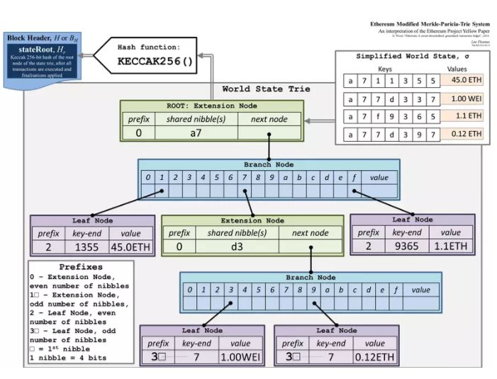

在以太坊中，一种经过改良的默克尔树非常关键，是以太坊数据安全与效率的保障，此树在以太坊中称之为 MPT（默克尔压缩前缀树）。 MPT 全称是 Merkle Patricia Trie 也叫 Merkle Patricia Tree，是 Merkle Tree 和 Patricia Tree 的混合物。 Merkle Tree(默克尔树) 用于保证数据安全，Patricia Tree(基数树,也叫基数特里树或压缩前缀树) 用于提升树的读写效率。

状态树，存储树，交易树，数据树都是通过 MPT 来存储的。

每个合约账户都有一个存储树

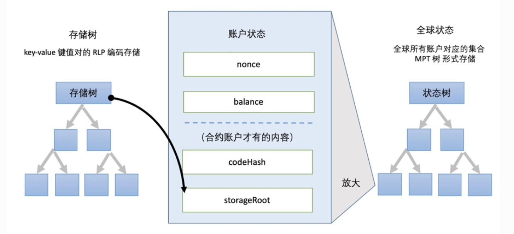

每个区块都有一个交易树

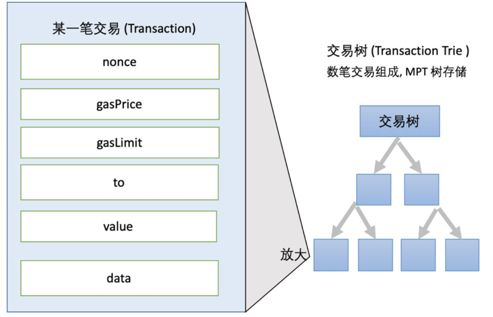

每个区块都有一棵独立的 **收据树** （receiptsRoot）。如果一笔交易是一次智能合约的执行，则在以太坊执虚拟机执行的过程中会产生程序员自定义的日志，日志是智能合约自定义的格式。

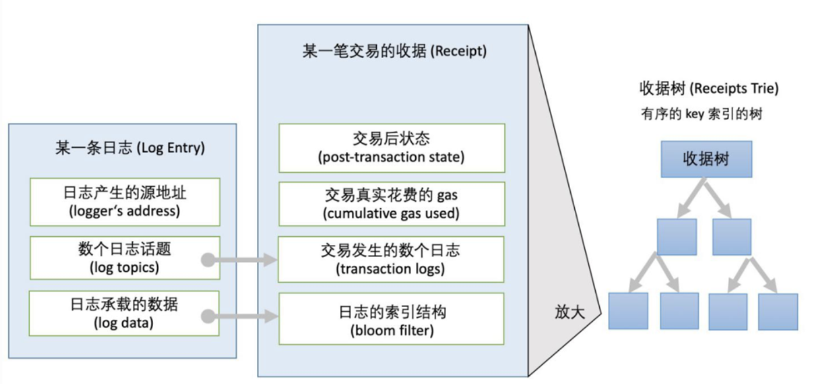


## 简述

以太坊不同于比特币的 UXTO 模型，在账户模型中，账户存在多个属性（余额、代码、存储信息），属性（状态）需要经常更新。因此需要一种数据结构来满足几点要求：

- ①在执行插入、修改或者删除操作后能快速计算新的树根，而无需重新计算整个树。
- ②即使攻击者故意构造非常深的树，它的深度也是有限的。否则，攻击者可以通过特意构建足够深的树使得每次树更新变得极慢，从而执行拒绝服务攻击。
- ③树的根值仅取决于数据，而不取决于更新的顺序。以不同的顺序更新，甚至是从头重新计算树都不会改变树的根值。

要求①是默克尔树特性，但要求②③则非默克尔树的优势。 对于要求②，可将数据 Key 进行一次哈希计算，得到确定长度的哈希值参与树的构建。而要求③则是引入位置确定的压缩前缀树并加以改进。


## Trie前缀树

在计算机科学中， Trie ，又称前缀树或字典树，是一种有序树，用于保存关联数组，其中的键通常是字符串。 与二叉查找树不同，键不是直接保存在节点中，而是由节点在树中的位置决定。 一个节点的所有子孙都有相同的前缀，也就是这个节点对应的字符串，而根节点对应空字符串。 一般情况下，不是所有的节点都有对应的值，只有叶子节点和部分内部节点所对应的键才有相关的值。

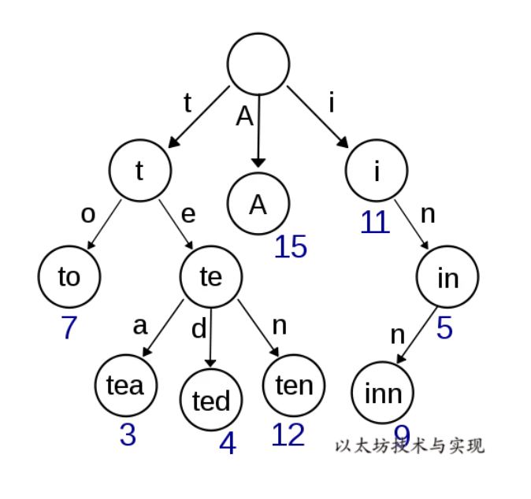

Trie 中的键通常是字符串，但也可以是其它的结构。 Trie 的算法可以很容易地修改为处理其它结构的有序序列，比如一串数字或者形状的排列。比如，bitwise Trie 中的键是一串比特，可以用于表示整数或者内存地址。


## 压缩前缀树Patricia Tree

在[压缩前缀树（基数树）](https://baike.baidu.com/item/基数树/22853708)中，键值是通过树到达相应值的实际路径值。 也就是说，从树的根节点开始，键中的每个字符会告诉您要遵循哪个子节点以获取相应的值，其中值存储在叶节点中，叶节点终止了穿过树的每个路径。假设键是包含 N 个字符的字母，则树中的每个节点最多可以有 N 个子级，并且树的最大深度是键的最大长度。

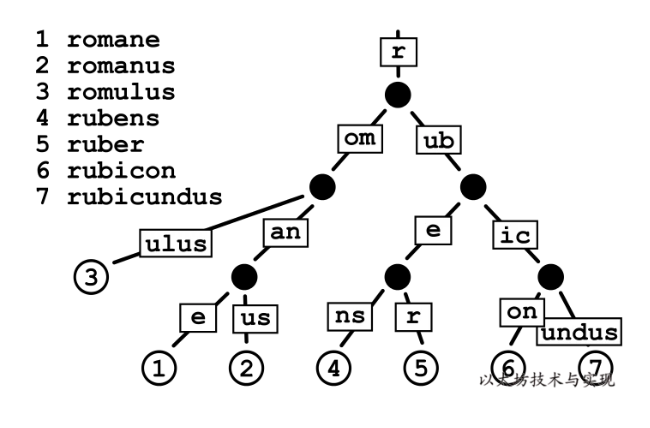

虽然基数树使得以相同字符序列开头的键的值在树中靠得更近，但是它们可能效率很低。 例如，当你有一个超长键且没有其他键与之共享前缀时，即使路径上没有其他值，但你必须在树中移动（并存储）大量节点才能获得该值。 这种低效在以太坊中会更加明显，因为参与树构建的 Key 是一个哈希值有 64 长（32 字节），则树的最长深度是 64。树中每个节点必须存储 32 字节，一个 Key 就需要至少 2KB 来存储，其中包含大量空白内容。 因此，在经常需要更新的以太坊状态树中，优化改进基数树，以提高效率、降低树的深度和减少 IO 次数，是必要的。


## 以太坊改进

### 节点改进

为了解决基数树的效率问题，以太坊对基数树的最大改动是丰富了节点类型，围绕不同节点类型的不同操作来解决效率。

1. 空白节点 NULL
2. 分支节点 branch Node [0,1,…,16,value]
3. 叶子节点 leaf Node : [key,value]
4. 扩展节点 extension Node: [key,value]

多种节点类型的不同操作方式，虽然提升了效率，但复杂度被加大。而在 geth 中，为了适应实现，节点类型的设计稍有不同：

```go
type (
	fullNode struct {
		Children [17]node // Actual trie node data to encode/decode (needs custom encoder)
		flags    nodeFlag
	}
	shortNode struct {
		Key   []byte
		Val   node
		flags nodeFlag
	}
	hashNode  []byte // fullnode 中的 key，其实就是他的孩子节点的 key，或者说 id
	valueNode []byte // 就是数据，可以从他的数据类型中看出，他就是存一个数据而已
)
// nilValueNode is used when collapsing internal trie nodes for hashing, since
// unset children need to serialize correctly.
var nilValueNode = valueNode(nil)

type nodeFlag struct {
	hash  hashNode // cached hash of the node (may be nil)
	dirty bool     // whether the node has changes that must be written to the database
}
```

- fullNode: 分支节点，fullNode[16]的类型是 valueNode。前 16 个元素对应键中可能存在的一个十六进制字符。如果键[key,value]在对应的分支处结束，则在列表末尾存储 value 。
- shortNode: 叶子节点或者扩展节点，当 shortNode.Key的末尾字节是终止符 `16` 时表示为叶子节点。当 shortNode 是叶子节点时，Val 是 valueNode。
- hashNode: 应该取名为 collapsedNode 折叠节点更合适些，但因为其值是一个哈希值当做指针使用，所以取名 hashNode。使用这个哈希值可以从数据库读取节点数据展开节点。
- valueNode: 数据节点，实际的业务数据值，严格来说他不属于树中的节点，它只存在于 fullNode.Children 或者 shortNode.Val 中。

> hashNode

hashNode 跟 valueNode 一样，也是字符数组 []byte 的一个别名，同样存放 32byte 的哈希值，也没有子节点。不同的是，**hashNode 是 fullNode 或者 shortNode 对象的 RLP 哈希值**，所以它跟 valueNode 在使用上有着莫大的不同。

在 MPT 中，hashNode 几乎不会单独存在 (有时遍历遇到一个 hashNode 往往因为原本的 node 被折叠了)，而是以 nodeFlag 结构体的成员(nodeFlag.hash) 的形式，被 fullNode 和 shortNode 间接持有。一旦 fullNode 或 shortNode 的成员变量 (包括子结构) 发生任何变化，它们的 hashNode 就一定需要更新。所以在 trie.Trie 结构体的 insert()，delete()等函数实现中，可以看到除了新创建的 fullNode、shortNode，那些子结构有所改变的 fullNode、shortNode 的 nodeFlag 成员也会被重设，hashNode 会被清空。在下次 trie.Hash()调用时，整个 MPT 自底向上的遍历过程中，所有清空的 hashNode 会被重新赋值。这样 trie.Hash()结束后，我们可以得到一个根节点 root 的 hashNode，它就是**此时此刻这个 MPT 结构的哈希值**。上文中提到的，Block 的成员变量 Root、TxHash、ReceiptHash 的生成，正是源出于此。

明显的，hashNode 体现了 **MerkleTree** 的特点：每个父节点的哈希值来源于所有子节点哈希值的组合，一个顶点的哈希值能够代表一整个树形结构。hashNode 加上之前的 fullNode，shortNode，valueNode，构成了一个完整的 Merkle-PatriciaTrie 结构

可以从源码中看到，nodeFlag 就是 HashNode，结合下面计算树 rootHash 中提到只有分支节点和扩展节点才有 hash，说明hashNode 就是存储的该节点的 hash 值，用来计算最终的根 hash 值。


### 各类 key

在改进过程中，为适应不同场景应用，以太坊定义了几种不同类型的 key 。

1. keybytes ：数据的原始 key
2. Secure Key: 是 Keccak256(keybytes) 结果，用于规避 key 深度攻击，长度固定为 32 字节。
3. Hex Key: 将 Key 进行半字节拆解后的 key ，用于 MPT 的树路径中和降低子节点水平宽度。
4. HP Key: Hex 前缀编码(hex prefix encoding)，在节点存持久化时，将对节点 key 进行压缩编码，并加入节点类型标签，以便从存储读取节点数据后可分辨节点类型。

下图是 key 有特定的使用场景，基本支持逆向编码，在下面的讲解中 Key 在不同语义下特指的类型有所不同。

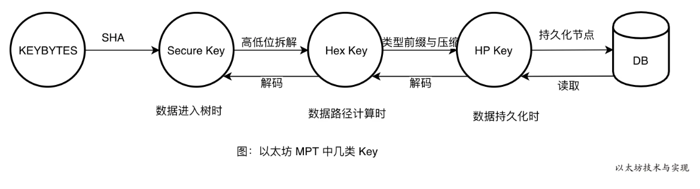


## 结构改进说明

当我们把一组数据（romane、romanus、romulus、rubens、ruber、rubicon、rubicunds）写入基数树中时，得到如下一颗基数树：

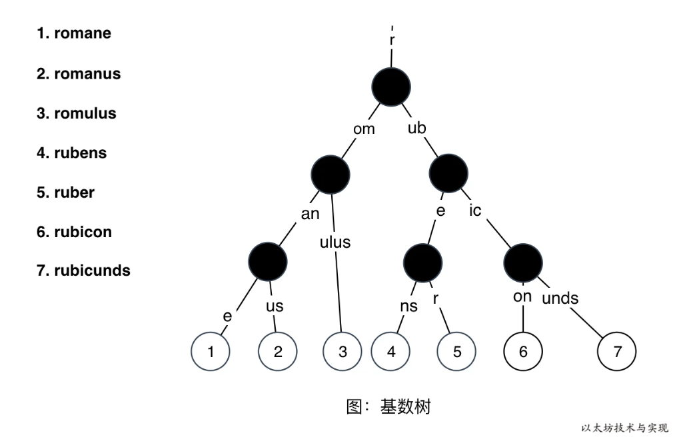

在上图的基数树中，持久化节点，有 13 次 IO。数据越多时，节点数越多，IO 次数越多。另外当树很深时，可能需要遍历到树的底部才能查询到数据。 面对此效率问题，以太坊在树中加入了一种名为**分支节点**(branch node) 的节点结构，将其子节点直接包含在自身的数据插槽中。

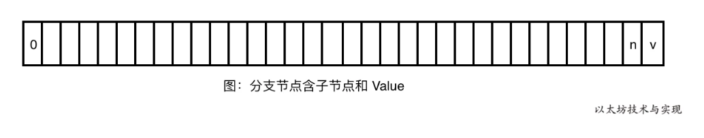

分支节点中，如果某个子节点不需要进一步划分了，就会直接保存他的值，因为**分支节点的 index 也是 path 的一部分（理解这个很重要）**

这样可缩减树深度和减少IO次数，特别是当插槽中均有子节点存在时，改进效果越明显。 下图是上方基数树在采用分支节点后的树节点逻辑布局：

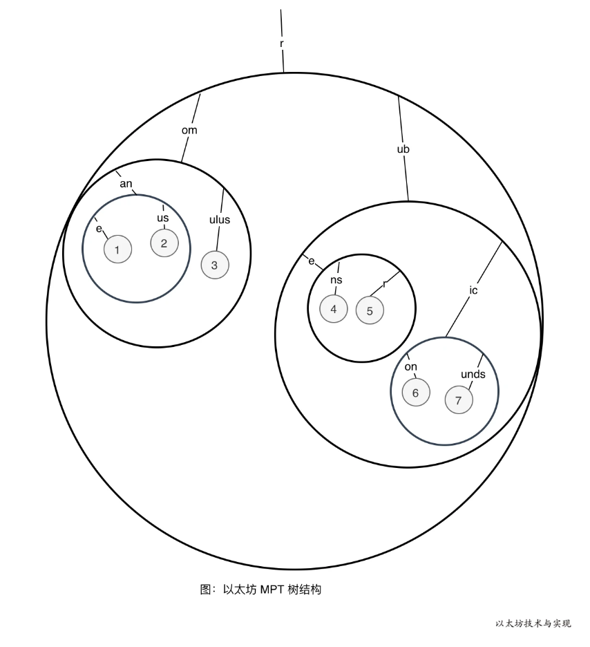

从图中可以看出节点数量并无改进，仅仅是改变了节点的存放位置，节点的分布变得紧凑。图中大黑圆圈均为分支节点，它包含一个或多个子节点， 这降低了 IO 和查询次数，在上图中，持久化 IO 只有 6 次，低于基数树的 13 次。

这是因为在持久化分支节点时，并不是将叶子节点分开持久化，而是将其存储在一块。并将持久化内容的哈希值作为一个新节点来参与树的进一步持久化，这种新型的节点称之为扩展节点。比如，数据 rubicon(6) 和 rubicunds(7) 是被一起持久化，在查询数据 rubicon 时，将根据 hasNode 值从数据库中读取分支节点内容，并解码成分支节点，内含 rubicon 和 rubicunds。

另外，数据 Key 在进入 MPT 前已转换 Secure Key。 因此，key 长度为 32 字节，每个字节的值范围是[0 - 255]。 如果在分支节点中使用 256 个插槽，空间开销非常高，造成浪费，毕竟空插槽在持久化时也需要占用空间。同时超大容量的插槽，也会可能使得持久化数据过大，可能会造成读取持久化数据时占用过多内存。 如果将 Key 进行Hex 编码，每个字节值范围被缩小到 [0-15] 内(4bits)。这样，分支节点只需要 16 个插槽来存放子节点。

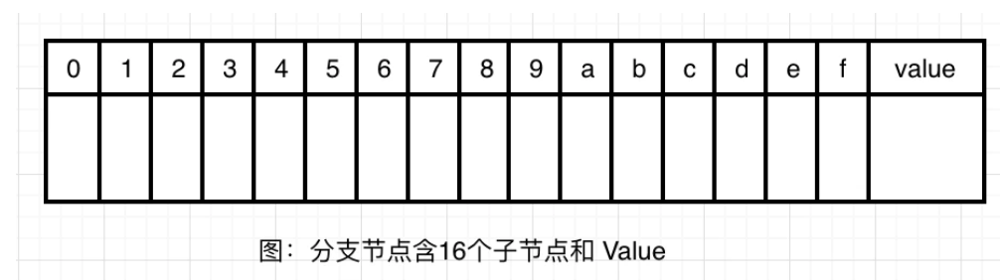

上图中 0 - f 插槽索引是半字节值，也是 Key 路径的一部分。虽然一定程度上增加了树高（32 个数变成了 64 个数），但降低了分支节点的存储大小（256 变成了 16），也保证了一定的分支节点合并量。


## 树的增删改查

经过改进后，树的增删改查将有一些不一样。需要掌握几个内含的规则和概念：

1. MPT 是一颗逻辑树，并不一一对应物理树（存储）。
2. 在 MPT 中必将在叶子节点处存放在 Key 对应的数据节点（ValueNode），数据节点必然是在树的子叶节点中。
3. 在 MPT 中，到达节点的树路径 Path 和节点中记录的 Key 一起构成了节点的完整 Key。
4. 分支节点的插槽 Index 就是树路径的一部分。

这里之后再详细看吧。这些其实都是深度递归来解析，查找的时候需要根据节点类型进行判断，修改数据的时候可能会引起树结构的修改。

### 查源码

不断递归，然后根据不同的节点类型进行不同的处理

```go
func (t *Trie) get(origNode node, key []byte, pos int) (value []byte, newnode node, didResolve bool, err error) {
	switch n := (origNode).(type) {
	case nil:
		return nil, nil, false, nil
	case valueNode:
    // 说明找到了，直接返回结果
		return n, n, false, nil
	case *shortNode:
		if len(key)-pos < len(n.Key) || !bytes.Equal(n.Key, key[pos:pos+len(n.Key)]) {
			// key not found in trie
			return nil, n, false, nil
		}
    // 说明可能是扩展节点或者叶子结点，读取他的 value 然后进一步递归（value 可能指向一个分支节点，也可能是 value 节点，注意虽然他可能直接就是叶子结点，但是为了统一处理，叶子结点也是由 valueNode 构成，所以可以执行下一次递归得到他的值）。
		value, newnode, didResolve, err = t.get(n.Val, key, pos+len(n.Key))
		if err == nil && didResolve {
			n = n.copy()
			n.Val = newnode
		}
		return value, n, didResolve, err
	case *fullNode:
    // 分支节点，读取某个分支，然后进入下一个递归
		value, newnode, didResolve, err = t.get(n.Children[key[pos]], key, pos+1)
		if err == nil && didResolve {
			n = n.copy()
			n.Children[key[pos]] = newnode
		}
		return value, n, didResolve, err
	case hashNode:
    // 根据 hash 还原出节点内容，然后再进行递归
		child, err := t.resolveAndTrack(n, key[:pos])
		if err != nil {
			return nil, n, true, err
		}
		value, newnode, _, err := t.get(child, key, pos)
		return value, newnode, true, err
	default:
		panic(fmt.Sprintf("%T: invalid node: %v", origNode, origNode))
	}
}
```


### 插入

==Todo==


### 删除

==Todo==


### 更新

==Todo==


### 更新的一个实例

演示依次将一组数据 romane、romanus、romulus、rubens、ruber、rubicon、rubicunds 插入到 MPT 中时的树结构的变化情况。

首先依次写入：romane、romanus、romulus 后树的变化如下：

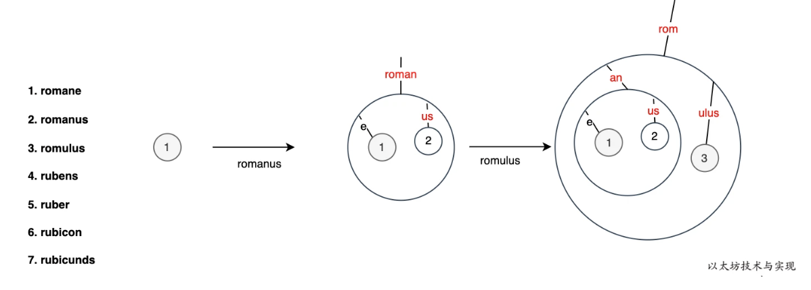

图中的每一个圆圈均代表一个节点，只是节点的类型不同。需要注意的是，图中的红色字部分，实际是一个短节点（shortNode）。 比如，红色的“roman“ 短节点的 key 为 roman, value 是分支节点。继续写入 rubens、ruber、rubicon 的变化过程如下：

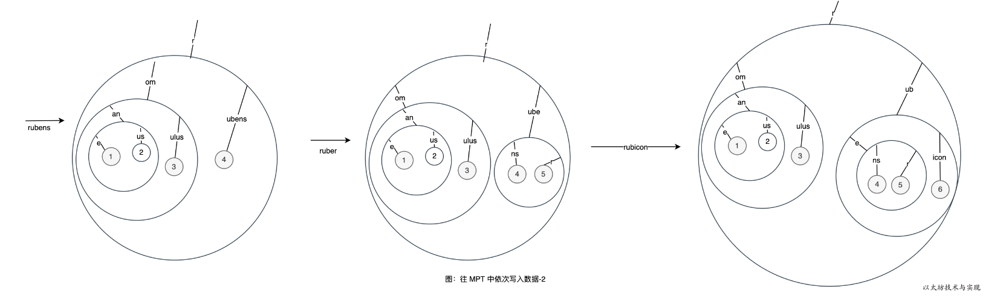

最后，写入最后一个数据项 rubicunds 后可得到最终的 MPT 树结构：

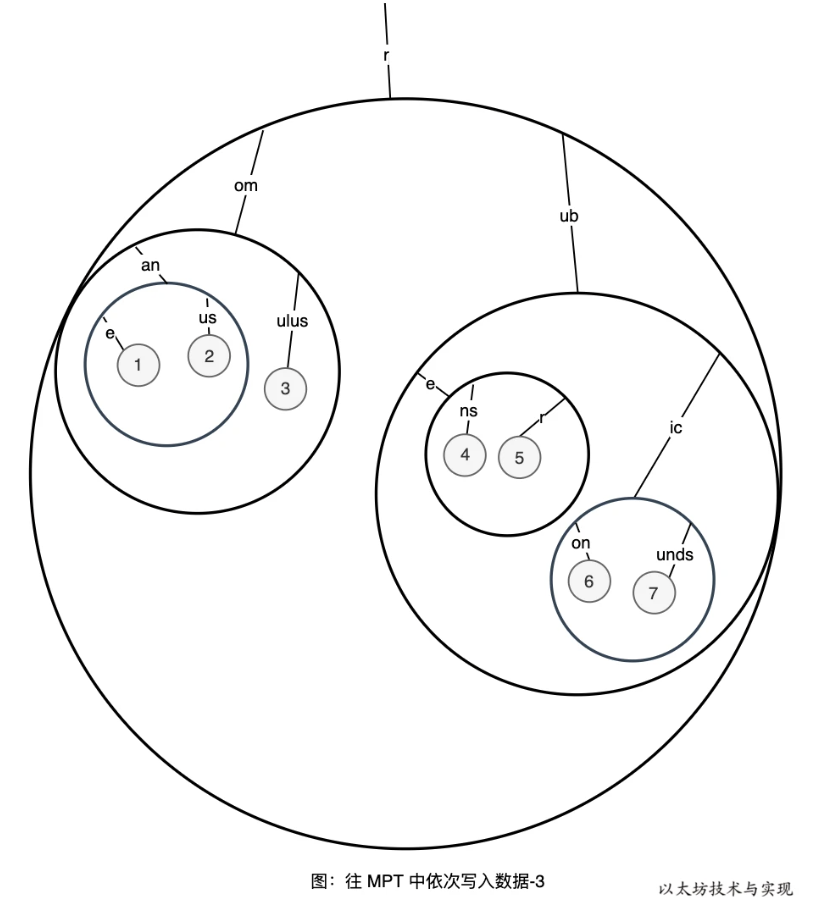

### 总结

即使以太坊有大量改进基数树，形成 MPT。但还是并没有解决树节点更新时的蝴蝶效应问题。 在 MPT 中树的最大深度是 64，当树充分大时，为更新一个数据节点而需要连带更新的节点也非常多。 这使得以太坊的数据更新是昂贵的。大量的变动也会使得每产生一个新区块，持久化数据后。 有大量的存储不再属于最新状态的一部分，即以太坊的数据增量更新的体量依旧很大。

如果要满足以太坊 2.0 的性能要求，继续改进 MPT 是不可忽略的。


## 计算树 Roothash

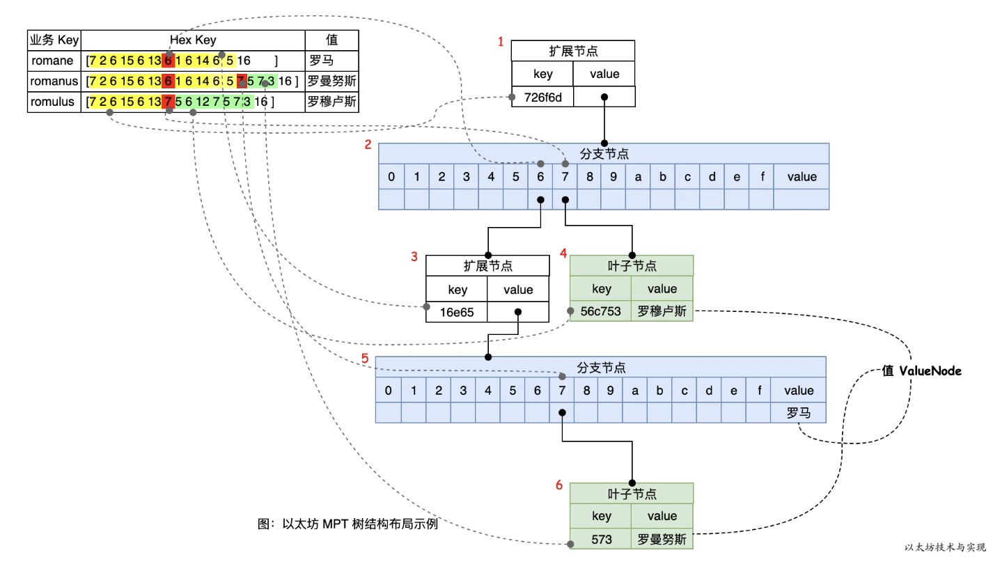

上图是三项数据的业务 Key 经过 HP 编码后，写入 MPT 树后所形成的 MPT 树结构布局。HP表和树的虚线连接表示树路径的生成依据，这是根据前面所描述的 MPT 生成规则而形成的树结构。在树中，一共有6 个节点，其中节点 1 和 3 为扩展节点，节点 2 和 5 为分支节点，节点 4 和 6 为叶子节点。可以看到在分支节点 5 中的 value 位置存放着业务 key “romane” 所对应的值“罗马”，但业务 key “romanus”和“romulus” 则存放在独立的叶子节点中。

当我们执行 trie.Commit 时将获得一个 Hash 值，称之为 树的 Root 值，这个 Root 值是如何得到的呢？ Root 值算法源自默克尔树（Merkle Tree），在默克尔树中，树根值是由从子叶开始不断进行哈希计算得到最终能代表这棵树数据的哈希值。

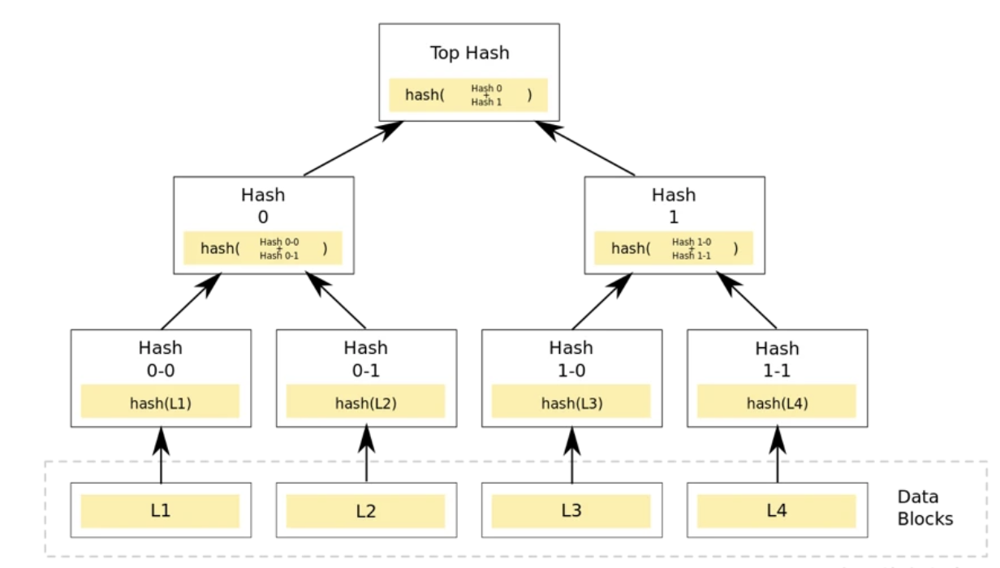

同样在计算 MPT 树的 Root 值是也是如此，在 MPT 中一个节点的哈希值，是节点内容经 RLP 编码后的 Keccak256 哈希值。当对一个节点进行哈希计算遵循如下规则==重要==：

1. Hash(扩展节点)= Hash( HP(node.Key),Hash(node.Value) )， 节点 key 需 HP 编码后参与哈希计算。当 node.Value 是表示业务数据时(valueNode)，将为 Hash( HP(node.Key),node.Value)。
2. Hash(叶子节点) 无，叶子节点只存在于分支节点中。
3. Hash(分支节点)= Hash( hash(node.Children[1]),…,hash(node.Children[i]),node.Value)，需要先将每个子节点存储中的节点进行哈希。如果子节点为 null，则使用空字节表示。

根据上面的规则，我们可以得到上面 MPT 树进行哈希计算时的节点分布：

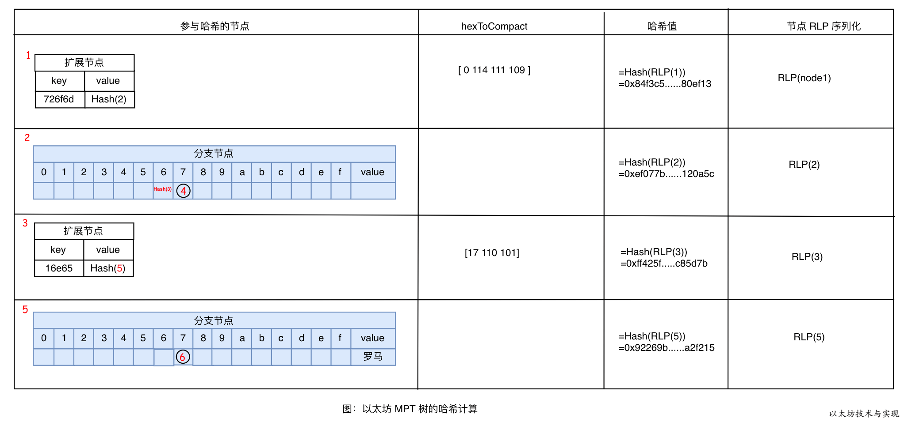

图中，可哈希的节点只有 4 个，而叶子节点 4 和 6 则直接属于分支节点的一部分参与哈希计算。MPT 的 Root 值是 MPT 树根节点的哈希值。在本示例中，Root 节点为 节点 1，Hash(节点 1)=`0x84f3c5......80ef13` 即为 MPT 的 Root 值。扩展节点 1 和 3 的 key 在哈希计算时有进行 HP 编码。需要编码的原因是为了区分扩展节点的 value 是叶子节点还是分支节点的区别，具体见 HP 编码规则。


## 持久化

当需要将 MPT Commit 到 DB 时，这颗树的数据是如何完整存储到数据库的呢？以太坊的持久层是 **KV 数据库**，一个 Key 对应一份存储内容。 当上面在计算 Root 值时，实际上已完成了哈希值和节点内容的处理过程。不同于在内存中计算 Root 值，在持久化时是持久化和 Hash 计算同步进行。

从Root的计算规则可知，HASH 计算是递归的，从树的叶子节点向上计算。每次计算出一个节点哈希时，将使用此哈希值作为数据库的 Key，存放节点的 RLP 持久化内容到数据库中。 因为节点哈希值以及被包含在父节点中，直至树根。因此，我们只需要知道一颗树的 Root 值，便可以依次从 DB 中读取节点数据，并在内存中构建完整的 MPT 树。

比如，上图中的树的 Root 值为 `0x84f3c5……80ef13`，通过 `db.Get(root)` 可获得节点 1，在通过 `db.Get(node1.Value)` 可获得节点 2…，直至节点 5。

需要注意的是，在分支节点 2 中，他的子节点插槽 6 的位置上是记录的节点 3 的哈希值。在从数据库中获得节点 2 时，并不会立刻将 节点 3 立刻加载。而是在需要使用 到 node2.Children[6]时，根据 node2.Children[6].Value 的类型仅一步判断。如果它是 hashNode 类型，则将根据此 Value 获取节点数据并展开。这样，保证在使用树时是按需实例化节点。


## Key的编码规则

### Secure 编码

这并非 MPT 树的必要部分，是为了解决路径深度攻击而将数据进入 MPT 前进行一次安全清洗，**使用 Keccak256(key) 得到的key 的哈希值替换原数据 key。**

在实现上，只需要在原 MPT 树进行依次封装即可获得一颗 Secure MPT 树。

### HEX 编码

用于树路径中，是将数据 key 进行半字节拆解而成。即依次将 key[0],key[1],…,key[n] 分别进行半字节拆分成两个数，再依次存放在长度为 len(key)+1 的数组中。 **并在数组末尾写入终止符 `16`**。算法如下：

> 半字节，在计算机中，通常将8位二进制数称为字节，而把4位二进制数称为半字节。 高四位和低四位，这里的“位”是针对二进制来说的。比如数字 250 的二进制数为 11111010，则高四位是左边的 1111，低四位是右边的 1010。

```go
// trie/encoding.go:65
func keybytesToHex(str []byte) []byte {
	l := len(str)*2 + 1
	var nibbles = make([]byte, l)
	for i, b := range str {
		nibbles[i*2] = b / 16
		nibbles[i*2+1] = b % 16
	}
	nibbles[l-1] = 16
	return nibbles
}
```

例如：字符串 “romane” 的 bytes 是 `[114 111 109 97 110 101]`，在 HEX 编码时将其依次处理：

| i    | key[i] | key[i]二进制 | nibbles[i*2]=高四位 | nibbles[i*2+1]=低四位 |
| :--- | :----- | :----------- | :------------------ | :-------------------- |
| 0    | 114    | 011100102    | 01112= 7            | 00102= 2              |
| 1    | 111    | 011011112    | 01102=6             | 11112=15              |
| 2    | 109    | 011011012    | 01102=6             | 11012=13              |
| 3    | 97     | 011000012    | 01102=6             | 00012=1               |
| 4    | 110    | 011011102    | 01102=6             | 11102=14              |
| 5    | 101    | 011001012    | 01102=6             | 01012=5               |

最终得到 Hex(“romane”) = `[7 2 6 15 6 13 6 1 6 14 6 5 16]`

### HP(Hex-Prefix) /Compact编码

Hex-Prefix 编码是一种任意量的半字节转换为数组的有效方式，还可以在存入一个标识符来区分不同节点类型。 因此 HP 编码是在由一个标识符前缀和半字节转换为数组的两部分组成。存入到数据库中存在节点 Key 的只有扩展节点和叶子节点，因此 HP 只用于区分扩展节点和叶子节点，不涉及无节点 key 的分支节点。其编码规则如下图：

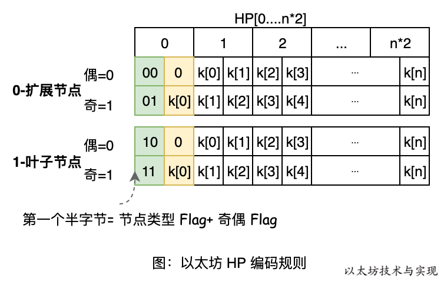

前缀标识符由两部分组成：节点类型和奇偶标识，并存储在编码后字节的第一个半字节中。 0 表示扩展节点类型，1 表示叶子节点，偶为 0，奇为 1。最终可以得到唯一标识的前缀标识：

- 0：偶长度的扩展节点
- 1：奇长度的扩展节点
- 2：偶长度的叶子节点
- 3：奇长度的叶子节点

当偶长度时，第一个字节的低四位用`0`填充，当是奇长度时，则将 key[0] 存放在第一个字节的低四位中，这样 HP 编码结果始终是偶长度。 这里为什么要区分节点 key 长度的奇偶呢？这是因为，半字节 `1` 和 `01` 在转换为 bytes 格式时都成为`<01>`，无法区分两者。

例如，上图 “以太坊 MPT 树的哈希计算”中的控制节点1的key 为 `[ 7 2 6 f 6 d]`，因为是偶长度，则 HP[0]= (00000000)~2~=0，H[1:]= 解码半字节(key)。 而节点 3 的 key 为 `[1 6 e 6 5]`，为奇长度，则 HP[0]= (0001 0001)~2~=17。

下面是 HP 编码算法的 Go 语言实现：

```go
// trie/encoding.go:37
func hexToCompact(hex []byte) []byte {
	terminator := byte(0)
	if hasTerm(hex) {
		terminator = 1
		hex = hex[:len(hex)-1]
	}
	buf := make([]byte, len(hex)/2+1)
	buf[0] = terminator << 5 // the flag byte
	if len(hex)&1 == 1 {
		buf[0] |= 1 << 4 // odd flag
		buf[0] |= hex[0] // first nibble is contained in the first byte
		hex = hex[1:]
	}
	decodeNibbles(hex, buf[1:])
	return buf
}
```

在 Go 语言中因为叶子节点的末尾字节必然是 16（Hex 编码的终止符），依据此可以区分扩展节点还是叶子节点。

> 节点放入数据库时候的key用到的就是Compact编码，可以节约磁盘空间。