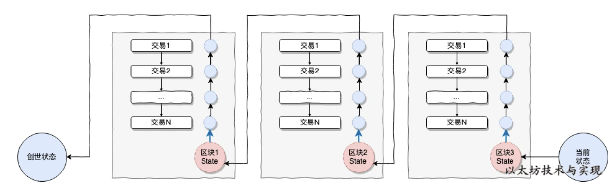
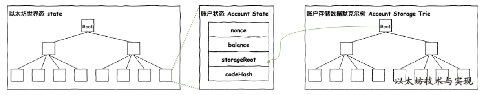
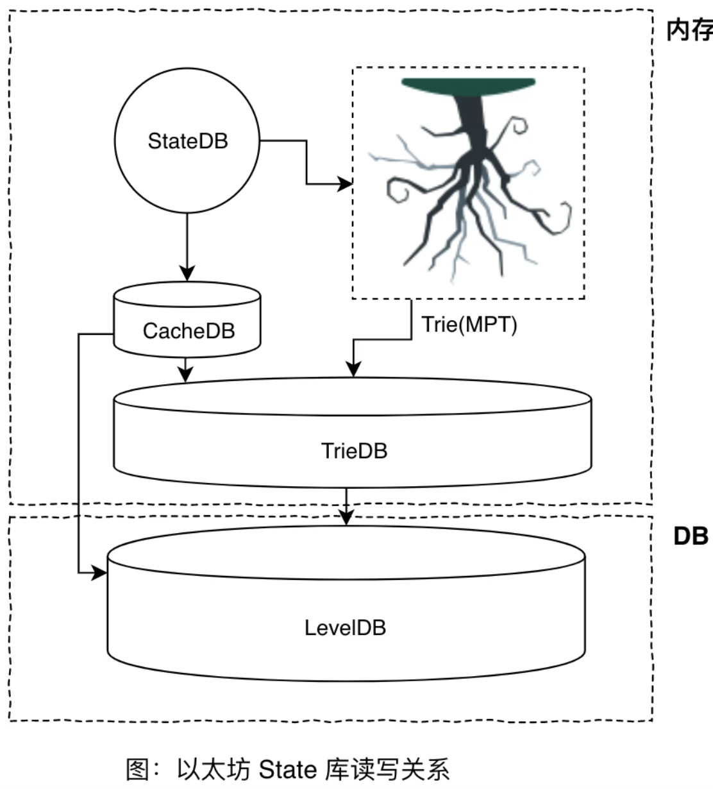

# StateDB 状态机

## 以太坊世界状态

基于状态机模型，以太坊网络已变成一个依靠矿工维护的去中心化的大型状态机。在任意时刻，只会处于一个状态中，全世界唯一的状态。我们把这个状态机，称之为以太坊世界状态，代表着以太坊网络的全局状态。

世界状态(state)由无数的账户信息组成，每个账户均存在一个唯一的账户信息。账户信息中存储着账户余额、Nonce、合约哈希、账户状态等内容，每个账户信息通过账户地址影射。 从创世状态开始，随着将交易作为输入信息，在预设协议标准（条件）下将世界态推进到下一个新的状态中。

当你需要查询某账户余额时，将从从世界状态中定位到目标账户的账户状态，便可从中查询到在现态中账户余额。而当你转账 5 ETH 给张三时，则将使得状态从 `{你: 8 ETH,张三：2 ETH}` 转移到 `{你: 3 ETH,张三：7 ETH}` 状态。

交易被矿工（再 PoS 共识机制下，现在应该叫提议者）收集到区块中的过程，就是矿工在执行状态转换的过程。即使无交易，矿工也可以直接将世界状态迁移到新状态中，比如挖出空快。

## 为什么有以太坊状态数据库 StateDB

即使在以太坊早期，当以太坊运行三个月后，以太坊客户端的本地文件夹存储已膨胀到惊人的 10 到40 GB。 截止到区块高度9001290，一个保留所有状态的以太坊归档节点，需要占用 216 GB 空间。如果说这些状态全部记录在区块链上，那么，这会是一个噩梦。

这会使得物联网设备、个人笔记本、手机等微设备无法使用以太坊客户端，会导致网络节点数量下降和影响用户使用。因此这些状态并非直接存储在区块链上，而是将这些状态维护在默克尔前缀树中，在区块链上仅记录对应的树 Root 值。使用简单的数据库来维护树的持久化内容，而这个用来维护映射的数据库叫做 StateDB。

## 世界状态中存储了哪些内容

首先，以太坊中有两种级别的状态，一个是顶级的世界状态，另一个是账户级的账户状态。账户状态中存储账户信息：

1. nonce: 这个值等于由此账户发出的交易数量，或者由这个账户所创建的合约数量(当这个账户有关联代码时)。
2. balance: 表示这个账户账户余额。
3. storageRoot: 表示保存了（合约）账户存储内容的 MPT 树的根节点的哈希值。
4. codeHash: 表示（合约）账户的 EVM 代码哈希值，当这个地址接收到一个消息调用时，这些代码会被执行; 它和其它字段不同，创建后不可更改。如果 codeHash 为空，则说明该账户是一个简单的外部账户，只存在 nonce 和 balance。

如上图所示，在以太坊中不止一颗默克尔树，所有账户状态通过以账户地址为键，维护在表示世界状态的树中。所有账户也存在一颗表示此账户的存储数据的树，此树是独立唯一的。

通过账户地址便可以从世界状态树中查找到该账户状态（如账户余额），如果是合约地址，还可以继续通过 storageRoot 从该账户存储数据树中查找对应的合约信息（如：拍卖合约中的商品信息）。

## StateDB是如何管理状态的

从程序设计角度，StateDB 有多种用途：

1. 维护账户状态到世界状态的映射。
2. 支持修改、回滚、提交状态。
3. 支持持久化状态到数据库中。
4. 是状态进出默克尔树的媒介。

实际上 StateDB 充当状态（数据）、Trie(树)、LevelDB（存储）的协调者。

## 如何运行的

看[网页](https://learnblockchain.cn/books/geth/part3/statedb.html)吧，太多了，现在不是我能驾驭的=_=