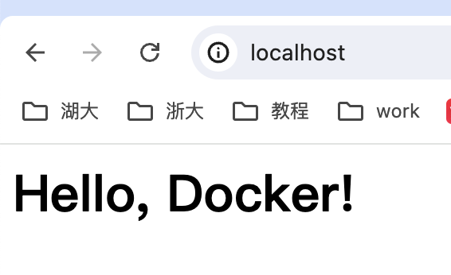

# 镜像构建

镜像是容器的基础，每次执行 `docker run` 的时候都会指定哪个镜像作为容器运行的基础。直接使用Docker Hub镜像是可以满足一定的需求，而当这些镜像无法直接满足需求时，就需要定制这些镜像。


## 利用 commit 理解

> 注意： `docker commit` 命令除了学习之外，还有一些特殊的应用场合，比如被入侵后保存现场等。但是，不要使用 `docker commit` 定制镜像，定制镜像应该使用 `Dockerfile` 来完成。如果你想要定制镜像请查看下一小节。

镜像是多层存储，每一层是在前一层的基础上进行的修改；而容器同样也是多层存储，是在以镜像为基础层，在其基础上加一层作为容器运行时的存储层。


现在让以定制一个 Web 服务器为例子，来看看镜像是如何构建的。

```bash
docker run --name webserver -d -p 80:80 nginx
```

这条命令会用 `nginx` 镜像启动一个容器，命名为 `webserver`，并且映射了 80 端口，直接用浏览器访问的话，我们会看到默认的 Nginx 欢迎页面。

现在，希望改成欢迎 Docker 的文字，可以使用 `docker exec` 命令进入容器，修改其内容。

```bash
$ docker exec -it webserver bash
root@3729b97e8226:/# echo '<h1>Hello, Docker!</h1>' > /usr/share/nginx/html/index.html
root@3729b97e8226:/# exit
exit
```

以交互式终端方式进入 `webserver` 容器，并执行了 `bash` 命令，也就是获得一个可操作的 Shell。

然后，用 `<h1>Hello, Docker!</h1>` 覆盖了 `/usr/share/nginx/html/index.html` 的内容。

现在再刷新浏览器的话，会发现内容被改变了。



修改了容器的文件，也就是改动了容器的存储层。可以通过 `docker diff` 命令看到具体的改动。

```
liushun@liushun ~ % docker diff webserver
C /run
A /run/nginx.pid
C /root
A /root/.bash_history
C /etc
C /etc/nginx
C /etc/nginx/conf.d
C /etc/nginx/conf.d/default.conf
C /usr
C /usr/share
C /usr/share/nginx
C /usr/share/nginx/html
C /usr/share/nginx/html/index.html
C /var
C /var/cache
C /var/cache/nginx
A /var/cache/nginx/scgi_temp
A /var/cache/nginx/uwsgi_temp
A /var/cache/nginx/client_temp
A /var/cache/nginx/fastcgi_temp
A /var/cache/nginx/proxy_temp
```

现在定制好了变化，希望能将其保存下来形成镜像。

要知道，当运行一个容器的时候（如果不使用卷的话），做的任何文件修改都会被记录于容器存储层里。而 Docker 提供了一个 `docker commit` 命令，可以将容器的存储层保存下来成为镜像。换句话说，就是在原有镜像的基础上，再叠加上容器的存储层，并构成新的镜像。以后运行这个新镜像的时候，就会拥有原有容器最后的文件变化。

`docker commit` 的语法格式为：

```bash
docker commit [选项] <容器ID或容器名> [<仓库名>[:<标签>]]
```

我们可以用下面的命令将容器保存为镜像：

```bash
liushun@liushun ~ % docker commit --author "lishun" --message "change index" webserver nginx:v2
sha256:f74af6067d0aa3fd09b80360ec54ee8879234f125e3453eafbcd160d31b12729
```

其中 `--author` 是指定修改的作者，而 `--message` 则是记录本次修改的内容。这点和 `git` 版本控制相似，不过这里这些信息可以省略留空。

可以在 `docker image ls` 中看到这个新定制的镜像：

```bash
liushun@liushun ~ % docker image ls
REPOSITORY   TAG       IMAGE ID       CREATED          SIZE
nginx        v2        f74af6067d0a   17 seconds ago   193MB
nginx        latest    443d199e8bfc   4 weeks ago      193MB
```

还可以用 `docker history` 具体查看镜像内的历史记录，如果比较 `nginx:latest` 的历史记录，会发现新增了刚刚提交的这一层。

```bash
liushun@liushun ~ % docker history nginx:v2
IMAGE          CREATED          CREATED BY                                       SIZE      COMMENT
f74af6067d0a   40 seconds ago   nginx -g daemon off;                             1.19kB    change index
443d199e8bfc   4 weeks ago      CMD ["nginx" "-g" "daemon off;"]                 0B        buildkit.dockerfile.v0
<missing>      4 weeks ago      STOPSIGNAL SIGQUIT                               0B        buildkit.dockerfile.v0
<missing>      4 weeks ago      EXPOSE map[80/tcp:{}]                            0B        buildkit.dockerfile.v0
<missing>      4 weeks ago      ENTRYPOINT ["/docker-entrypoint.sh"]             0B        buildkit.dockerfile.v0
```

新的镜像定制好后，可以来运行这个镜像。

```bash
docker run --name web2 -d -p 81:80 nginx:v2
```

这里命名为新的服务为 `web2`，并且映射到 `81` 端口。访问 `http://localhost:81` 看到结果，其内容应该和之前修改后的 `webserver` 一样。

至此，第一次使用 `docker commit` 命令完成了定制镜像，手动操作给旧的镜像添加了新的一层，形成新的镜像，对镜像多层存储应该有了更直观的感觉。


>> [!WARNING]
>>
>> 慎用 `docker commit`
>
>使用 `docker commit` 命令虽然可以比较直观的帮助理解镜像分层存储的概念，但是实际环境中并不会这样使用。
>
>首先，如果仔细观察之前的 `docker diff webserver` 的结果，会发现除了真正想要修改的 `/usr/share/nginx/html/index.html` 文件外，由于命令的执行，还有很多文件被改动或添加了。这还仅仅是最简单的操作，如果是安装软件包、编译构建，那会有大量的无关内容被添加进来，将会导致镜像极为臃肿。
>
>此外，使用 `docker commit` 意味着所有对镜像的操作都是黑箱操作，生成的镜像也被称为 **黑箱镜像**，换句话说，就是除了制作镜像的人知道执行过什么命令、怎么生成的镜像，别人根本无从得知。而且，即使是这个制作镜像的人，过一段时间后也无法记清具体的操作。这种黑箱镜像的维护工作是非常痛苦的。
>
>而且，回顾之前提及的镜像所使用的分层存储的概念，除当前层外，之前的每一层都是不会发生改变的，换句话说，任何修改的结果仅仅是在当前层进行标记、添加、修改，而不会改动上一层。如果使用 `docker commit` 制作镜像，以及后期修改的话，每一次修改都会让镜像更加臃肿一次，所删除的上一层的东西并不会丢失，会一直如影随形的跟着这个镜像，即使根本无法访问到。这会让镜像更加臃肿。


## 使用 Dockerfile 定制

从刚才的 `docker commit` 的构建过程中可以了解到，镜像的定制实际上就是定制每一层所添加的配置、文件。如果可以把每一层修改、安装、构建、操作的命令都写入一个脚本，用这个脚本来构建、定制镜像，那么之前提及的无法重复的问题、镜像构建透明性的问题、体积的问题就都会解决。这个脚本就是 Dockerfile。

Dockerfile 是一个文本文件，其内包含了一条条的 **指令(Instruction)**，每一条指令构建一层，因此每一条指令的内容，就是描述该层应当如何构建。

还以之前定制 `nginx` 镜像为例，这次使用 Dockerfile 来定制。

在一个空白目录中，建立一个文本文件，并命名为 `Dockerfile`：

```bash
$ mkdir mynginx
$ cd mynginx
$ touch Dockerfile
```

其内容为：

```docker
FROM nginx
RUN echo '<h1>Hello, Docker!</h1>' > /usr/share/nginx/html/index.html
```

这个 Dockerfile 很简单，一共就两行。涉及到了两条指令，`FROM` 和 `RUN`。


### From指定镜像

所谓定制镜像，那一定是以一个镜像为基础，在其上进行定制。就像之前运行了一个 `nginx` 镜像的容器，再进行修改一样，基础镜像是必须指定的。而 `FROM` 就是指定 **基础镜像**，因此一个 `Dockerfile` 中 `FROM` 是必备的指令，并且必须是第一条指令。

在 [Docker Hub](https://hub.docker.com/search?q=&type=image&image_filter=official) 上有非常多的高质量的官方镜像，有可以直接拿来使用的服务类的镜像，如 `nginx`、`redis`、`mongo`、`mysql`、`httpd`、`php`、`tomcat` 等；也有一些方便开发、构建、运行各种语言应用的镜像，如 `node`、`openjdk`、`python`、`ruby`、`golang` 等。可以在其中寻找一个最符合我们最终目标的镜像为基础镜像进行定制。

如果没有找到对应服务的镜像，官方镜像中还提供了一些更为基础的操作系统镜像，如 `ubuntu`、`debian`、`centos`、`fedora`、`alpine` 等，这些操作系统的软件库为我们提供了更广阔的扩展空间。

除了选择现有镜像为基础镜像外，Docker 还存在一个特殊的镜像，名为 `scratch`。这个镜像是虚拟的概念，并不实际存在，它表示一个空白的镜像。

```docker
FROM scratch
...
```

如果你以 `scratch` 为基础镜像的话，意味着你不以任何镜像为基础，接下来所写的指令将作为镜像第一层开始存在。

不以任何系统为基础，直接将可执行文件复制进镜像的做法并不罕见，对于 Linux 下静态编译的程序来说，并不需要有操作系统提供运行时支持，所需的一切库都已经在可执行文件里了，因此直接 `FROM scratch` 会让镜像体积更加小巧。使用 Go 语言开发的应用很多会使用这种方式来制作镜像，这也是为什么有人认为 Go 是特别适合容器微服务架构的语言的原因之一。


### Run 执行命令

`RUN` 指令是用来执行命令行命令的。由于命令行的强大能力，`RUN` 指令在定制镜像时是最常用的指令之一。其格式有两种：

- *shell* 格式：`RUN <命令>`，就像直接在命令行中输入的命令一样。刚才写的 Dockerfile 中的 `RUN` 指令就是这种格式。

```docker
RUN echo '<h1>Hello, Docker!</h1>' > /usr/share/nginx/html/index.html
```

- *exec* 格式：`RUN ["可执行文件", "参数1", "参数2"]`，这更像是函数调用中的格式。

既然 `RUN` 就像 Shell 脚本一样可以执行命令，那么是否就可以像 Shell 脚本一样把每个命令对应一个 RUN 呢？比如这样：

```docker
FROM debian:stretch

RUN apt-get update
RUN apt-get install -y gcc libc6-dev make wget
RUN wget -O redis.tar.gz "http://download.redis.io/releases/redis-5.0.3.tar.gz"
RUN mkdir -p /usr/src/redis
RUN tar -xzf redis.tar.gz -C /usr/src/redis --strip-components=1
RUN make -C /usr/src/redis
RUN make -C /usr/src/redis install
```

**Dockerfile 中每一个指令都会建立一层，`RUN` 也不例外**。每一个 `RUN` 的行为，就和刚才手工建立镜像的过程一样：新建立一层，在其上执行这些命令，执行结束后，`commit` 这一层的修改，构成新的镜像。

而上面的这种写法，创建了 7 层镜像。这是完全没有意义的，而且很多运行时不需要的东西，都被装进了镜像里，比如编译环境、更新的软件包等等。结果就是产生非常臃肿、非常多层的镜像，不仅仅增加了构建部署的时间，也很容易出错。 

*Union FS 是有最大层数限制的，比如 AUFS，曾经是最大不得超过 42 层，现在是不得超过 127 层。*

上面的 `Dockerfile` 正确的写法应该是这样：

```docker
FROM debian:stretch

RUN set -x; buildDeps='gcc libc6-dev make wget' \
    && apt-get update \
    && apt-get install -y $buildDeps \
    && wget -O redis.tar.gz "http://download.redis.io/releases/redis-5.0.3.tar.gz" \
    && mkdir -p /usr/src/redis \
    && tar -xzf redis.tar.gz -C /usr/src/redis --strip-components=1 \
    && make -C /usr/src/redis \
    && make -C /usr/src/redis install \
    && rm -rf /var/lib/apt/lists/* \
    && rm redis.tar.gz \
    && rm -r /usr/src/redis \
    && apt-get purge -y --auto-remove $buildDeps
```

首先，之前所有的命令只有一个目的，就是编译、安装 redis 可执行文件。因此没有必要建立很多层，这只是一层的事情。因此，这里没有使用很多个 `RUN` 一一对应不同的命令，而是仅仅使用一个 `RUN` 指令，并使用 `&&` 将各个所需命令串联起来。将之前的 7 层，简化为了 1 层。在撰写 Dockerfile 的时候，要经常提醒自己，这并不是在写 Shell 脚本，而是在定义每一层该如何构建。

并且，这里为了格式化还进行了换行。Dockerfile 支持 Shell 类的行尾添加 `\` 的命令换行方式，以及行首 `#` 进行注释的格式。良好的格式，比如换行、缩进、注释等，会让维护、排障更为容易，这是一个比较好的习惯。

**此外，还可以看到这一组命令的最后添加了清理工作的命令，删除了为了编译构建所需要的软件，清理了所有下载、展开的文件，并且还清理了 `apt` 缓存文件。**这是很重要的一步，之前说过，镜像是多层存储，每一层的东西并不会在下一层被删除，会一直跟随着镜像。因此镜像构建时，一定要确保每一层只添加真正需要添加的东西，任何无关的东西都应该清理掉。

很多人初学 Docker 制作出了很臃肿的镜像的原因之一，就是忘记了每一层构建的最后一定要清理掉无关文件。


### 构建镜像

在 `Dockerfile` 文件所在目录执行：

```bash
liushun@liushun mynginx % docker build -t nginx:v3 .
[+] Building 0.3s (6/6) FINISHED                                          docker:desktop-linux
 => [internal] load build definition from Dockerfile                                      0.0s
 => => transferring dockerfile: 482B                                                      0.0s
 => [internal] load metadata for docker.io/library/nginx:latest                           0.0s
 => [internal] load .dockerignore                                                         0.0s
 => => transferring context: 2B                                                           0.0s
 => [1/2] FROM docker.io/library/nginx:latest                                             0.0s
 => [2/2] RUN echo '<h1>Hello, Docker!</h1>' > /usr/share/nginx/html/index.html           0.2s
 => exporting to image                                                                    0.0s
 => => exporting layers                                                                   0.0s
 => => writing image sha256:009e9176dac405941b61c1a96106e4c1844069a631263c59072dacd477f7  0.0s
 => => naming to docker.io/library/nginx:v3                                               0.0s

What's next:
    View a summary of image vulnerabilities and recommendations → docker scout quickview 
```

从命令的输出结果中，可以清晰的看到镜像的构建过程。

这里使用了 `docker build` 命令进行镜像构建。其格式为：

```bash
docker build [选项] <上下文路径/URL/->
```

在这里指定了最终镜像的名称 `-t nginx:v3`，构建成功后，可以像之前运行 `nginx:v2` 那样来运行这个镜像，其结果会和 `nginx:v2` 一样。


### 镜像构建上下文（Context）

> [!IMPORTANT]

 `docker build` 命令最后有一个 `.`。`.` 表示当前目录，而 `Dockerfile` 就在当前目录，因此不少初学者以为这个路径是在指定 `Dockerfile` 所在路径，这么理解其实是不准确的。这其实是在指定 **上下文路径**。那么什么是上下文呢？

首先要理解 `docker build` 的工作原理。Docker 在运行时分为 Docker 引擎（也就是服务端守护进程）和客户端工具。Docker 的引擎提供了一组 REST API，被称为 [Docker Remote API](https://docs.docker.com/develop/sdk/)，而如 `docker` 命令这样的客户端工具，则是通过这组 API 与 Docker 引擎交互，从而完成各种功能。因此，虽然表面上好像是在本机执行各种 `docker` 功能，但实际上，一切都是使用的远程调用形式在服务端（Docker 引擎）完成。也因为这种 C/S 设计，让操作远程服务器的 Docker 引擎变得轻而易举。

当进行镜像构建的时候，并非所有定制都会通过 `RUN` 指令完成，经常会需要将一些本地文件复制进镜像，比如通过 `COPY` 指令、`ADD` 指令等。而 `docker build` 命令构建镜像，其实并非在本地构建，而是在服务端，也就是 Docker 引擎中构建的。那么在这种客户端/服务端的架构中，如何才能让服务端获得本地文件呢？

这就引入了上下文的概念。当构建的时候，用户会指定构建镜像上下文的路径，`docker build` 命令得知这个路径后，会将路径下的所有内容打包，然后上传给 Docker 引擎。这样 Docker 引擎收到这个上下文包后，展开就会获得构建镜像所需的一切文件。

如果在 `Dockerfile` 中这么写：

```docker
COPY ./package.json /app/
```

这并不是要复制执行 `docker build` 命令所在的目录下的 `package.json`，也不是复制 `Dockerfile` 所在目录下的 `package.json`，而是复制 **上下文（context）** 目录下的 `package.json`。

因此，`COPY` 这类指令中的源文件的路径都是*相对路径*。这也是初学者经常会问的为什么 `COPY ../package.json /app` 或者 `COPY /opt/xxxx /app` 无法工作的原因，因为这些路径已经超出了上下文的范围，Docker 引擎无法获得这些位置的文件。如果真的需要那些文件，应该将它们复制到上下文目录中去。

现在就可以理解刚才的命令 `docker build -t nginx:v3 .` 中的这个 `.`，实际上是在指定上下文的目录，`docker build` 命令会将该目录下的内容打包交给 Docker 引擎以帮助构建镜像。

理解构建上下文对于镜像构建是很重要的，避免犯一些不应该的错误。比如有些初学者在发现 `COPY /opt/xxxx /app` 不工作后，于是干脆将 `Dockerfile` 放到了硬盘根目录去构建，结果发现 `docker build` 执行后，在发送一个几十 GB 的东西，极为缓慢而且很容易构建失败。那是因为这种做法是在让 `docker build` 打包整个硬盘，这显然是使用错误。

一般来说，应该会将 `Dockerfile` 置于一个空目录下，或者项目根目录下。如果该目录下没有所需文件，那么应该把所需文件复制一份过来。如果目录下有些东西确实不希望构建时传给 Docker 引擎，那么可以用 `.gitignore` 一样的语法写一个 `.dockerignore`，该文件是用于剔除不需要作为上下文传递给 Docker 引擎的。

那么为什么会有人误以为 `.` 是指定 `Dockerfile` 所在目录呢？这是因为在默认情况下，如果不额外指定 `Dockerfile` 的话，会将上下文目录下的名为 `Dockerfile` 的文件作为 Dockerfile。

这只是默认行为，实际上 `Dockerfile` 的文件名并不要求必须为 `Dockerfile`，而且并不要求必须位于上下文目录中，比如可以用 `-f ../Dockerfile.php` 参数指定某个文件作为 `Dockerfile`。

当然，一般大家习惯性的会使用默认的文件名 `Dockerfile`，以及会将其置于镜像构建上下文目录中。


### 其它 `docker build` 的用法

> 直接用 Git repo 进行构建

`docker build` 还支持从 URL 构建，比如可以直接从 Git repo 中构建：

```bash
# $env:DOCKER_BUILDKIT=0
# export DOCKER_BUILDKIT=0

$ docker build -t hello-world https://github.com/docker-library/hello-world.git#master:amd64/hello-world

Step 1/3 : FROM scratch
 --->
Step 2/3 : COPY hello /
 ---> ac779757d46e
Step 3/3 : CMD ["/hello"]
 ---> Running in d2a513a760ed
Removing intermediate container d2a513a760ed
 ---> 038ad4142d2b
Successfully built 038ad4142d2b
```

这行命令指定了构建所需的 Git repo，并且指定分支为 `master`，构建目录为 `/amd64/hello-world/`，然后 Docker 就会自己去 `git clone` 这个项目、切换到指定分支、并进入到指定目录后开始构建。

> 用给定的 tar 压缩包构建

```bash
$ docker build http://server/context.tar.gz
```

如果所给出的 URL 不是个 Git repo，而是个 `tar` 压缩包，那么 Docker 引擎会下载这个包，并自动解压缩，以其作为上下文，开始构建。

> 从标准输入中读取 Dockerfile 进行构建

```bash
docker build - < Dockerfile
```

或

```bash
cat Dockerfile | docker build -
```

如果标准输入传入的是文本文件，则将其视为 `Dockerfile`，并开始构建。这种形式由于直接从标准输入中读取 Dockerfile 的内容，它没有上下文，因此不可以像其他方法那样可以将本地文件 `COPY` 进镜像之类的事情。

> 从标准输入中读取上下文压缩包进行构建

```bash
docker build - < context.tar.gz
```

如果发现标准输入的文件格式是 `gzip`、`bzip2` 以及 `xz` 的话，将会使其为上下文压缩包，直接将其展开，将里面视为上下文，并开始构建。


## Dockerfile 指令详解


### COPY 复制文件

格式：

- `COPY [--chown=<user>:<group>] <源路径>... <目标路径>`
- `COPY [--chown=<user>:<group>] ["<源路径1>",... "<目标路径>"]`

和 `RUN` 指令一样，也有两种格式，一种类似于命令行，一种类似于函数调用。

==`COPY` 指令将从构建上下文目录中 `<源路径>` 的文件/目录复制到新的一层的镜像内的 `<目标路径>` 位置==。比如：

```docker
COPY package.json /usr/src/app/
```

`<源路径>` 可以是多个，甚至可以是通配符，其通配符规则要满足 Go 的 [`filepath.Match`](https://golang.org/pkg/path/filepath/#Match) 规则，如：

```docker
COPY hom* /mydir/
COPY hom?.txt /mydir/
```

`<目标路径>` 可以是容器内的绝对路径，也可以是相对于工作目录的相对路径（工作目录可以用 `WORKDIR` 指令来指定）。目标路径不需要事先创建，如果目录不存在会在复制文件前先行创建缺失目录。

此外，还需要注意一点，使用 `COPY` 指令，源文件的各种元数据都会保留。比如读、写、执行权限、文件变更时间等。这个特性对于镜像定制很有用。特别是构建相关文件都在使用 Git 进行管理的时候。

在使用该指令的时候还可以加上 `--chown=<user>:<group>` 选项来改变文件的所属用户及所属组。

```docker
COPY --chown=55:mygroup files* /mydir/
COPY --chown=bin files* /mydir/
COPY --chown=1 files* /mydir/
COPY --chown=10:11 files* /mydir/
```

如果源路径为文件夹，复制的时候不是直接复制该文件夹，而是将文件夹中的内容复制到目标路径。


### ADD 高级的复制文件

`ADD` 指令和 `COPY` 的格式和性质基本一致。但是在 `COPY` 基础上增加了一些功能。

比如 `<源路径>` 可以是一个 `URL`，这种情况下，Docker 引擎会试图去下载这个链接的文件放到 `<目标路径>` 去。下载后的文件权限自动设置为 `600`，如果这并不是想要的权限，那么还需要增加额外的一层 `RUN` 进行权限调整，另外，如果下载的是个压缩包，需要解压缩，也一样还需要额外的一层 `RUN` 指令进行解压缩。所以不如直接使用 `RUN` 指令，然后使用 `wget` 或者 `curl` 工具下载，处理权限、解压缩、然后清理无用文件更合理。因此，这个功能其实并不实用，而且不推荐使用。

如果 `<源路径>` 为一个 `tar` 压缩文件的话，压缩格式为 `gzip`, `bzip2` 以及 `xz` 的情况下，`ADD` 指令将会**自动解压**缩这个压缩文件到 `<目标路径>` 去。

在某些情况下，这个自动解压缩的功能非常有用，比如官方镜像 `ubuntu` 中：

```docker
FROM scratch
ADD ubuntu-xenial-core-cloudimg-amd64-root.tar.gz /
...
```

在 Docker 官方的 [Dockerfile 最佳实践文档](https://docker-practice.github.io/zh-cn/appendix/best_practices.html) 中要求，尽可能的使用 `COPY`，因为 `COPY` 的语义很明确，就是复制文件而已，而 `ADD` 则包含了更复杂的功能，其行为也不一定很清晰。最适合使用 `ADD` 的场合，就是所提及的需要自动解压缩的场合。

另外需要注意的是，`ADD` 指令会令镜像构建缓存失效，从而可能会令镜像构建变得比较缓慢。

在使用该指令的时候还可以加上 `--chown=<user>:<group>` 选项来改变文件的所属用户及所属组。

```docker
ADD --chown=55:mygroup files* /mydir/
ADD --chown=bin files* /mydir/
ADD --chown=1 files* /mydir/
ADD --chown=10:11 files* /mydir/
```


### CMD 容器启动命令

`CMD` 指令的格式和 `RUN` 相似，也是两种格式：

- `shell` 格式：`CMD <命令>`
- `exec` 格式：`CMD ["可执行文件", "参数1", "参数2"...]`
- 参数列表格式：`CMD ["参数1", "参数2"...]`。在指定了 `ENTRYPOINT` 指令后，用 `CMD` 指定具体的参数。

之前介绍容器的时候曾经说过，Docker 不是虚拟机，容器就是进程。既然是进程，那么在启动容器的时候，需要指定所运行的程序及参数。**`CMD` 指令就是用于==指定默认的容器主进程的启动命令==的。**

**在运行时可以指定新的命令来替代镜像设置中的这个默认命令**，比如，`ubuntu` 镜像默认的 `CMD` 是 `/bin/bash`，如果直接 `docker run -it ubuntu` 的话，会直接进入 `bash`。可以在运行时指定运行别的命令，如 `docker run -it ubuntu cat /etc/os-release`。这就是用 `cat /etc/os-release` 命令替换了默认的 `/bin/bash` 命令了，输出了系统版本信息。

在指令格式上，一般推荐使用 `exec` 格式，这类格式在解析时会被解析为 JSON 数组，因此一定要使用双引号 `"`，而不要使用单引号。

如果使用 `shell` 格式的话，实际的命令会被包装为 `sh -c` 的参数的形式进行执行。比如：

```docker
CMD echo $HOME
```

在实际执行中，会将其变更为：

```docker
CMD [ "sh", "-c", "echo $HOME" ]
```

这就是为什么可以使用环境变量的原因，因为这些环境变量会被 shell 进行解析处理。

提到 `CMD` 就不得不提容器中应用在前台执行和后台执行的问题。这是初学者常出现的一个混淆。

Docker 不是虚拟机，容器中的应用都应该以前台执行，而不是像虚拟机、物理机里面那样，用 `systemd` 去启动后台服务，容器内没有后台服务的概念。

一些初学者将 `CMD` 写为：

```docker
CMD service nginx start
```

然后发现容器执行后就立即退出了。甚至在容器内去使用 `systemctl` 命令结果却发现根本执行不了。这就是因为没有搞明白前台、后台的概念，没有区分容器和虚拟机的差异，依旧在以传统虚拟机的角度去理解容器。

对于容器而言，其启动程序就是容器应用进程，容器就是为了主进程而存在的，主进程退出，容器就失去了存在的意义，从而退出，其它辅助进程不是它需要关心的东西。

而使用 `service nginx start` 命令，则是希望 upstart 来以后台守护进程形式启动 `nginx` 服务。而刚才说了 `CMD service nginx start` 会被理解为 `CMD [ "sh", "-c", "service nginx start"]`，因此主进程实际上是 `sh`。那么当 `service nginx start` 命令结束后，`sh` 也就结束了，`sh` 作为主进程退出了，自然就会令容器退出。

正确的做法是直接执行 `nginx` 可执行文件，并且要求以前台形式运行。比如：

```docker
CMD ["nginx", "-g", "daemon off;"]
```


### ENTRYPOINT 入口点

`ENTRYPOINT` 的格式和 `RUN` 指令格式一样，分为 `exec` 格式和 `shell` 格式。

`ENTRYPOINT` 的目的和 `CMD` 一样，都是在指定容器启动程序及参数。`ENTRYPOINT` 在运行时也可以替代，不过比 `CMD` 要略显繁琐，需要通过 `docker run` 的参数 `--entrypoint` 来指定。

当指定了 `ENTRYPOINT` 后，**`CMD` 的含义就发生了改变，不再是直接的运行其命令**，而是**将 `CMD` 的内容作为参数传给 `ENTRYPOINT` 指令**，换句话说实际执行时，将变为：

```bash
<ENTRYPOINT> "<CMD>"
```

那么有了 `CMD` 后，为什么还要有 `ENTRYPOINT` 呢？这种 `<ENTRYPOINT> "<CMD>"` 有什么好处么？

> 场景一：让镜像变成像命令一样使用，==可以传递参数而不影响指令==

假设需要一个得知自己当前公网 IP 的镜像，那么可以先用 `CMD` 来实现：

```docker
FROM ubuntu:18.04
RUN apt-get update \
    && apt-get install -y curl \
    && rm -rf /var/lib/apt/lists/*
CMD [ "curl", "-s", "http://myip.ipip.net" ]
```

假如使用 `docker build -t myip .` 来构建镜像的话，如果需要查询当前公网 IP，只需要执行：

```bash
$ docker run myip
```

这么看起来好像可以直接把镜像当做命令使用了，不过命令总有参数，如果希望加参数呢？比如从上面的 `CMD` 中可以看到实质的命令是 `curl`，那么如果希望显示 HTTP 头信息，就需要加上 `-i` 参数。那么可以直接加 `-i` 参数给 `docker run myip` 么？

```bash
$ docker run myip -i
docker: Error response from daemon: invalid header field value "oci runtime error: container_linux.go:247: starting container process caused \"exec: \\\"-i\\\": executable file not found in $PATH\"\n".
```

可以看到可执行文件找不到的报错，`executable file not found`。之前说过，跟在镜像名后面的是 `command`，运行时会替换 `CMD` 的默认值。因此这里的 `-i` 替换了原来的 `CMD`，而不是添加在原来的 `curl -s http://myip.ipip.net` 后面。而 `-i` 根本不是命令，所以自然找不到。

那么如果希望加入 `-i` 这参数，就必须重新完整的输入这个命令：

```bash
$ docker run myip curl -s http://myip.ipip.net -i
```

这显然不是很好的解决方案，而使用 `ENTRYPOINT` 就可以解决这个问题。现在重新用 `ENTRYPOINT` 来实现这个镜像：

```docker
FROM ubuntu:18.04
RUN apt-get update \
    && apt-get install -y curl \
    && rm -rf /var/lib/apt/lists/*
ENTRYPOINT [ "curl", "-s", "http://myip.ipip.net" ]
```

再来尝试直接使用 `docker run myip -i`：

```bash
$ docker run myip
当前 IP：61.148.226.66 来自：杭州市 联通

$ docker run myip -i
HTTP/1.1 200 OK
Server: nginx/1.8.0
Date: Tue, 22 Nov 2016 05:12:40 GMT
Content-Type: text/html; charset=UTF-8
Vary: Accept-Encoding
X-Powered-By: PHP/5.6.24-1~dotdeb+7.1
X-Cache: MISS from cache-2
X-Cache-Lookup: MISS from cache-2:80
X-Cache: MISS from proxy-2_6
Transfer-Encoding: chunked
Via: 1.1 cache-2:80, 1.1 proxy-2_6:8006
Connection: keep-alive

当前 IP：61.148.226.66 来自：杭州市 联通
```

可以看到，这次成功了。这是因为当存在 `ENTRYPOINT` 后，`CMD` 的内容将会作为参数传给 `ENTRYPOINT`，而这里 `-i` 就是新的 `CMD`，因此会作为参数传给 `curl`，从而达到了预期的效果。

> 场景二：应用运行前的准备工作，隔离用户权限之类

启动容器就是启动主进程，但有些时候，启动主进程前，需要一些准备工作。

比如 `mysql` 类的数据库，可能需要一些数据库配置、初始化的工作，这些工作要在最终的 mysql 服务器运行之前解决。

此外，可能希望避免使用 `root` 用户去启动服务，从而提高安全性，而在启动服务前还需要以 `root` 身份执行一些必要的准备工作，最后切换到服务用户身份启动服务。或者除了服务外，其它命令依旧可以使用 `root` 身份执行，方便调试等。

**这些准备工作是和容器 `CMD` 无关的，无论 `CMD` 为什么，都需要事先进行一个预处理的工作**。这种情况下，**可以写一个脚本，然后放入 `ENTRYPOINT` 中去执行，而这个脚本会将接到的参数（也就是 `<CMD>`）作为命令，在脚本最后执行**。比如官方镜像 `redis` 中就是这么做的：

```docker
FROM alpine:3.4
...
RUN addgroup -S redis && adduser -S -G redis redis
...
ENTRYPOINT ["docker-entrypoint.sh"]

EXPOSE 6379
CMD [ "redis-server" ]
```

可以看到其中为了 redis 服务创建了 redis 用户，并在最后指定了 `ENTRYPOINT` 为 `docker-entrypoint.sh` 脚本。

```bash
#!/bin/sh
...
# allow the container to be started with `--user`
if [ "$1" = 'redis-server' -a "$(id -u)" = '0' ]; then
    find . \! -user redis -exec chown redis '{}' +
    exec gosu redis "$0" "$@"
fi

exec "$@"
```

该脚本的内容就是根据 `CMD` 的内容来判断，如果是 `redis-server` 的话，则切换到 `redis` 用户身份启动服务器，否则依旧使用 `root` 身份执行。比如：

```bash
$ docker run -it redis id
uid=0(root) gid=0(root) groups=0(root)
当你运行这个命令时，Docker 会启动一个基于 redis 镜像的新容器，但它不会启动 Redis 服务器。相反，它会在容器中运行 id 命令。
这个 id 会覆盖掉 redis-server 信息。从而将原本的启动 redis 变成显示容器内的用户和组信息
```


### ENV 设置环境变量

格式有两种：

- `ENV <key> <value>`
- `ENV <key1>=<value1> <key2>=<value2>...`

这个指令很简单，就是设置环境变量而已，无论是后面的其它指令，如 `RUN`，还是运行时的应用，都可以直接使用这里定义的环境变量。

```docker
ENV VERSION=1.0 DEBUG=on NAME="Happy Feet"
```

定义了环境变量，那么在后续的指令中，就可以使用这个环境变量。比如在官方 `node` 镜像 `Dockerfile` 中，就有类似这样的代码：

```docker
ENV NODE_VERSION 7.2.0

RUN curl -SLO "https://nodejs.org/dist/v$NODE_VERSION/node-v$NODE_VERSION-linux-x64.tar.xz" \
  && curl -SLO "https://nodejs.org/dist/v$NODE_VERSION/SHASUMS256.txt.asc" \
  && gpg --batch --decrypt --output SHASUMS256.txt SHASUMS256.txt.asc \
  && grep " node-v$NODE_VERSION-linux-x64.tar.xz\$" SHASUMS256.txt | sha256sum -c - \
  && tar -xJf "node-v$NODE_VERSION-linux-x64.tar.xz" -C /usr/local --strip-components=1 \
  && rm "node-v$NODE_VERSION-linux-x64.tar.xz" SHASUMS256.txt.asc SHASUMS256.txt \
  && ln -s /usr/local/bin/node /usr/local/bin/nodejs
```

在这里先定义了环境变量 `NODE_VERSION`，其后的 `RUN` 这层里，多次使用 `$NODE_VERSION` 来进行操作定制。可以看到，将来升级镜像构建版本的时候，只需要更新 `7.2.0` 即可，`Dockerfile` 构建维护变得更轻松了。

下列指令可以支持环境变量展开： `ADD`、`COPY`、`ENV`、`EXPOSE`、`FROM`、`LABEL`、`USER`、`WORKDIR`、`VOLUME`、`STOPSIGNAL`、`ONBUILD`、`RUN`。

可以从这个指令列表里感觉到，环境变量可以使用的地方很多，很强大。通过环境变量，可以让一份 `Dockerfile` 制作更多的镜像，只需使用不同的环境变量即可。


### ARG 构建参数

格式：`ARG <参数名>[=<默认值>]`

**构建参数和 `ENV` 的效果一样，都是设置环境变量**。**所不同的是，`ARG` 所设置的构建环境的环境变量，在将来容器运行时是不会存在这些环境变量的。**但是不要因此就使用 `ARG` 保存密码之类的信息，因为 `docker history` 还是可以看到所有值的。

**`Dockerfile` 中的 `ARG` 指令是定义参数名称，以及定义其默认值**。该默认值可以在构建命令 `docker build` 中用 `--build-arg <参数名>=<值>` 来覆盖。

灵活的使用 `ARG` 指令，能够在不修改 Dockerfile 的情况下，构建出不同的镜像。

ARG 指令有生效范围，如果在 `FROM` 指令之前指定，那么只能用于 `FROM` 指令中。

```docker
ARG DOCKER_USERNAME=library
FROM ${DOCKER_USERNAME}/alpine
RUN set -x ; echo ${DOCKER_USERNAME}
```

使用上述 Dockerfile 会发现无法输出 `${DOCKER_USERNAME}` 变量的值，要想正常输出，必须在 `FROM` 之后再次指定 `ARG`

```docker
# 只在 FROM 中生效
ARG DOCKER_USERNAME=library
FROM ${DOCKER_USERNAME}/alpine

# 要想在 FROM 之后使用，必须再次指定
ARG DOCKER_USERNAME=library
RUN set -x ; echo ${DOCKER_USERNAME}
```

对于多阶段构建，尤其要注意这个问题

```docker
# 这个变量在每个 FROM 中都生效
ARG DOCKER_USERNAME=library
FROM ${DOCKER_USERNAME}/alpine
RUN set -x ; echo 1
FROM ${DOCKER_USERNAME}/alpine
RUN set -x ; echo 2
```

对于上述 Dockerfile 两个 `FROM` 指令都可以使用 `${DOCKER_USERNAME}`，对于在各个阶段中使用的变量都必须在每个阶段分别指定：

```docker
ARG DOCKER_USERNAME=library
FROM ${DOCKER_USERNAME}/alpine
# 在FROM 之后使用变量，必须在每个阶段分别指定
ARG DOCKER_USERNAME=library
RUN set -x ; echo ${DOCKER_USERNAME}
FROM ${DOCKER_USERNAME}/alpine
# 在FROM 之后使用变量，必须在每个阶段分别指定
ARG DOCKER_USERNAME=library
RUN set -x ; echo ${DOCKER_USERNAME}
```


### VOLUME 定义匿名卷

格式为：

- `VOLUME ["<路径1>", "<路径2>"...]`
- `VOLUME <路径>`

之前说过，容器运行时应该尽量保持容器存储层不发生写操作，对于数据库类需要保存动态数据的应用，其数据库文件应该保存于卷(volume)中（这个卷不会随着 Docker 镜像一起发布和共享，所以你本地的数据，别人拿了镜像后是不会有的，顶多会自己创建一个新的空数据卷，但是不会有数据）。为了防止运行时用户忘记将动态文件所保存目录挂载为卷，在 `Dockerfile` 中，可以事先指定某些目录挂载为匿名卷，这样在运行时如果用户不指定挂载，其应用也可以正常运行，不会向容器存储层写入大量数据。

```docker
VOLUME /data
```

这里的 `/data` 目录就会在容器运行时自动挂载为匿名卷，任何向 `/data` 中写入的信息都不会记录进容器存储层，从而保证了容器存储层的无状态化。当然，运行容器时可以覆盖这个挂载设置。比如：

```bash
$ docker run -d -v mydata:/data xxxx
```

在这行命令中，就使用了 `mydata` 这个命名卷挂载到了 `/data` 这个位置，替代了 `Dockerfile` 中定义的匿名卷的挂载配置。


### EXPOSE 声明端口

格式为 `EXPOSE <端口1> [<端口2>...]`。

`EXPOSE` 指令是声明容器运行时提供服务的端口，这只是一个声明，在容器运行时并不会因为这个声明应用就会开启这个端口的服务。在 Dockerfile 中写入这样的声明有两个好处，一个是帮助镜像使用者理解这个镜像服务的守护端口，以方便配置映射；另一个用处则是在运行时使用随机端口映射时，也就是 **`docker run -P` 时，会自动随机映射 `EXPOSE` 的端口**。

要将 `EXPOSE` 和在运行时使用 `-p <宿主端口>:<容器端口>` 区分开来。`-p`，是映射宿主端口和容器端口，换句话说，就是将容器的对应端口服务公开给外界访问，而 `EXPOSE` 仅仅是声明容器打算使用什么端口而已，并不会自动在宿主进行端口映射。


### WORKDIR 指定工作目录

格式为 `WORKDIR <工作目录路径>`。

使用 `WORKDIR` 指令可以来指定工作目录（或者称为当前目录），以后各层的当前目录就被改为指定的目录，如该目录不存在，`WORKDIR` 会建立目录。

之前提到一些初学者常犯的错误是把 `Dockerfile` 等同于 Shell 脚本来书写，这种错误的理解还可能会导致出现下面这样的错误：

```docker
RUN cd /app
RUN echo "hello" > world.txt
```

如果将这个 `Dockerfile` 进行构建镜像运行后，会发现找不到 `/app/world.txt` 文件，或者其内容不是 `hello`。原因其实很简单，在 Shell 中，连续两行是同一个进程执行环境，因此前一个命令修改的内存状态，会直接影响后一个命令；**而在 `Dockerfile` 中，这两行 `RUN` 命令的执行环境根本不同，是两个完全不同的容器。**这就是对 `Dockerfile` 构建分层存储的概念不了解所导致的错误。

之前说过每一个 `RUN` 都是启动一个容器、执行命令、然后提交存储层文件变更。第一层 `RUN cd /app` 的执行仅仅是当前进程的工作目录变更，一个内存上的变化而已，其结果不会造成任何文件变更。而到第二层的时候，启动的是一个全新的容器，跟第一层的容器更完全没关系，自然不可能继承前一层构建过程中的内存变化。

因此如果需要改变以后各层的工作目录的位置，那么应该使用 `WORKDIR` 指令。

```docker
WORKDIR /app
RUN echo "hello" > world.txt
```

如果 `WORKDIR` 指令使用的相对路径，那么所切换的路径与之前的 `WORKDIR` 有关：

```docker
WORKDIR /a
WORKDIR b
WORKDIR c
RUN pwd
```

`RUN pwd` 的工作目录为 `/a/b/c`。


### USER 指定当前用户

格式：`USER <用户名>[:<用户组>]`

`USER` 指令和 `WORKDIR` 相似，都是**改变环境状态并影响以后的层**。`WORKDIR` 是改变工作目录，`USER` 则是改变之后层的执行 `RUN`, `CMD` 以及 `ENTRYPOINT` 这类命令的身份。

注意，`USER` 只是帮助切换到指定用户而已，这个用户**必须是事先建立好**的，否则无法切换。

```docker
RUN groupadd -r redis && useradd -r -g redis redis
USER redis
RUN [ "redis-server" ]
```

如果以 `root` 执行的脚本，在执行期间希望改变身份，比如希望以某个已经建立好的用户来运行某个服务进程，不要使用 `su` 或者 `sudo`，这些都需要比较麻烦的配置，而且在 TTY 缺失的环境下经常出错。建议使用 [`gosu`](https://github.com/tianon/gosu)。

```docker
# 建立 redis 用户，并使用 gosu 换另一个用户执行命令
RUN groupadd -r redis && useradd -r -g redis redis
# 下载 gosu
RUN wget -O /usr/local/bin/gosu "https://github.com/tianon/gosu/releases/download/1.12/gosu-amd64" \
    && chmod +x /usr/local/bin/gosu \
    && gosu nobody true
# 设置 CMD，并以另外的用户执行 
CMD [ "exec", "gosu", "redis", "redis-server" ]
```


### 其他指令

[HEALTHCHECK 健康检查](https://docker-practice.github.io/zh-cn/image/dockerfile/healthcheck.html)

[ONBUILD 为他人做嫁衣裳](https://docker-practice.github.io/zh-cn/image/dockerfile/onbuild.html)

[LABEL](https://docker-practice.github.io/zh-cn/image/dockerfile/label.html)

[SHELL](https://docker-practice.github.io/zh-cn/image/dockerfile/shell.html)


### Dockerfile 多阶段构建

用到了再说了，看的脑壳痛，[菜](https://docker-practice.github.io/zh-cn/image/multistage-builds/)

