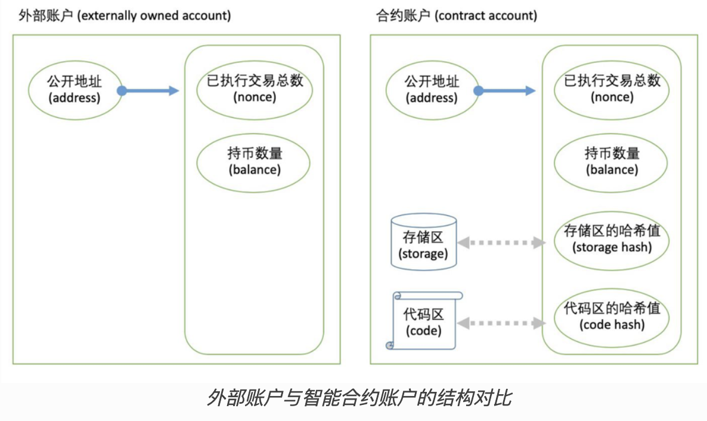

# 以太坊账户

一个以太坊帐户是一个具有以太币 (ETH) 余额的实体，可以在以太坊上发送交易。 帐户可以由用户控制，也可以作为智能合约部署。

## 帐户类型

以太坊有两种帐户类型：

- 外部所有的帐户 (EOA) – 由任何拥有私钥的人控制
- 合约帐户 – 部署到网络上的智能合约，由代码控制。 

这两种帐户类型都能：

- 接收、持有和发送 ETH 和 token
- 与已部署的智能合约进行交互

## 主要区别

**外部持有**

- 创建帐户是免费的
- 可以发起交易
- 外部所有的帐户之间只能进行以太币和代币交易
- 由一对加密密钥组成：控制帐户活动的公钥和私钥

**合约**

- 创建合约**存在成本**，因为需要使用网络存储空间
- 只能在收到交易时发送交易
- 从外部帐户向合约帐户发起的交易能触发可执行多种操作的代码，例如转移代币甚至创建新合约
- 合约帐户没有私钥。 相反，它们由智能合约代码逻辑控制

## 内容

以太坊帐户有四个字段：

- `nonce` - 一个计数器，用来显示外部帐户发送的交易数量或合约帐户创建的合约数量。 每个帐户只能执行具有一个给定随机数的一笔交易，以防范重放攻击，重放攻击指多次广播和重复执行已签署的交易。
- `balance` – 这个地址拥有的 Wei 数量。 Wei 是以太币的计数单位，每个 ETH 有 1e+18 个 Wei。
- `codeHash` - 该哈希表示以太坊虚拟机 (EVM) 上的帐户*代码*。 合约帐户具有编程的代码片段，可以执行不同的操作。 如果帐户收到消息调用，则执行此 EVM 代码。 与其他帐户字段不同，不能更改。 所有代码片段都被保存在状态数据库的相应哈希下，供后续检索。 此哈希值称为 codeHash。 对于外部所有的帐户，codeHash 字段是空字符串的哈希。代码区即为智能合约代码本身。 在合约的生命周期中，该区域的内容是不可更改的 **只读状态**。 代码区存放于以太坊网络节点的硬盘中，当运行时被读入虚拟机执行。代码区的内容通过散列函数得出校验哈希值，该值即为代码区的哈希值。
- `storageRoot` – 有时被称为存储哈希。 Merkle Patricia trie 根节点的 256 位哈希已编码了帐户的存储内容（256 位整数值映射），并编码为 Trie，作为来自 256 的 Keccak 256 位哈希的映射位整数键，用于 RLP 编码的256位整数值。 此 Trie 对此帐户存储内容的哈希进行编码，默认情况下为空。存储区即为智能合约在运行中，产生的数据的存储地。 在合约的生命周期里，该区域的内容被合约代码不断写入、读取。 存储区存放于以太坊网络节点的硬盘上。 存储区的内容通过散列函数得出校验哈希值，该值即为存储区的哈希值。

## 外部持有的帐户和密钥对

帐户由公钥和私钥加密对组成。 它们有助于证明交易实际上是由发送者签名的，并防止伪造。 你的私钥是你用来签名交易的密钥，所以它保障你对与自己帐户相关的资金进行管理。 你从未真正持有加密货币，你持有私钥 – 资金总是在以太坊的账本上。

这将防止恶意参与者广播虚假交易，因为你总是可以验证交易的发送者。

## 外部账户创建

想要创建一个帐户时，大多数库将生成一个随机的私钥。

私钥由 **64 个十六进制字符**组成，可以用密码加密保存。

例如：`fffffffffffffffffffffffffffffffebaaedce6af48a03bbfd25e8cd036415f`

使用[椭圆曲线加密法](https://wikipedia.org/wiki/Elliptic_Curve_Digital_Signature_Algorithm)从私钥生成公钥。 通过获取公钥 Keccak-256 哈希的最后 20 个字节并校验码前面添加 `0x`，可以为帐户获取公共地址。

## 合约帐户

合约帐户也有一个 42 个字符组成的十六进制地址：

例如：`0x06012c8cf97bead5deae237070f9587f8e7a266d`

合约地址通常在将合约部署到以太坊区块链时给出。 地址产生自创建人的地址和从创建人地址发送的交易数量（“nonce”）。

> 重要

根据以太坊黄皮书，账户若是一个智能合约账户，则必定包含了 **存储树** （storageRoot）和 **代码存储** （codeHash）。

若我们继续放大观察存储树，即为上图最左边的树。存储树保存了智能合约的变量数据，它维持着256位的变量数据索引与RLP 算法编码过的256位数据本身。

为保证数据完整性，这些数据 *也被组织成一棵 MPT 树的形式* 。该MPT树的根节点哈希值称为 **存储树** 。

Note

**存储树** 是账户状态的一个 *域* ，该值随着合约的存储区的增加、删除、改动而不断变更。

**代码存储** 是只读的，它是合约账户的所执行的代码，它在合约第一次创建完毕后就不可以再变更。