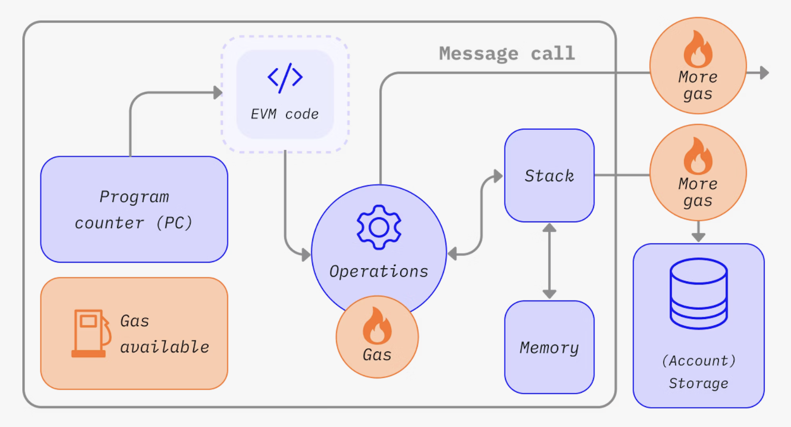

# Gas 燃料和费用

## 啥是燃料

燃料是指在以太坊网络上执行特定操作所需的计算工作量。

由于每笔以太坊交易都需要使用计算资源来执行，因此必须为这些资源付费，以确保以太坊不容易受到垃圾信息的攻击，并且不会陷入无限的计算循环。 计算费用以燃料费的形式支付。

燃料费是**用于执行某些操作的燃料数量，乘以每单位燃料的成本**。 ==无论交易成功与否，都要支付燃料费==。



燃料费必须用以太坊的本币支付，即以太币 (ETH)。 燃料通常以 gwei 计价，gwei 是以太币的一种计量单位。 一个 gwei 等于一个以太币的十亿分之一（0.000000001 个以太币，或 10-9 个以太币）。

比如，燃料费是 1 gwei，而不说 0.000000001 个以太币。


## 如何计算燃料费？

当提交交易时，可以设置愿意支付的燃料数量。 通过提供一定数量的燃料，我们出价将交易添加到下一个区块中。 如果提供的燃料太少，验证者就不太可能选择添加某个交易，这意味着某个交易可能会延迟执行或不会被执行。 如果提供太多，可能浪费一些以太币。 那么，怎么知道应该支付多少燃料费呢？

支付的总燃料费分为两部分：`base fee` 和 `priority fee`（小费）。

`Base fee` 由协议设定——必须至少支付这些金额，然后交易才会被视为有效。 `Priority fee` 是基础费以外的小费，它可以吸引验证者选择将交易添加到下一个区块。

只支付 `base fee` 的交易从技术上讲是有效的，但不太可能被添加到区块，因为它没有激励验证者优先选择它而不是其他交易。 “合适的” `priority` 费由发送交易时的网络使用情况决定——如果有大量需求，那么可能不得不将 `priority` 费设置得更高；但当需求较少时，也可以减少该费用。

例如，假设 Jordan 要向 Taylor 支付 1 个以太币。 一笔以太币转账需要 21,000 单位的燃料，基础费是10 gwei。 Jordan 支付了 2 gwei 作为小费。

总费用等于：

```
使用的燃料单位数 *（基础费 + 优先费）
```

其中 `base fee` 由协议设置，`priority fee` 是用户设置的支付给验证者的小费。

即 `21,000 * (10 + 2) = 252,000 gwei`（0.000252 个以太币）。

当 Jordan 转账时，将从 Jordan 帐户中扣除 1.000252 个以太币。 Taylor 的帐户增加 1.0000 个以太币。 验证者收到价值 0.000042 个以太币的小费。 0.00021 个以太币的 `base fee` 被销毁。


有两种交易类型：这造成了一个硬分叉

**1. 传统交易类型（Legacy Transaction）**

**字段**：gas price 和 gas limit

**费用支付**：

- 在传统交易类型中，用户设置的 gas price 表示愿意支付的每单位 gas 的费用。
- 所有交易费用直接支付给矿工，没有明确的小费字段。
- 示例：如果用户设置 gas price 为 100 gwei，并且交易使用了 21,000 gas，则交易费用为 100 gwei * 21,000 = 2,100,000 gwei，全部支付给矿工。

**2. EIP-1559 交易类型（Type 2 Transaction）**

**字段**：maxFeePerGas，maxPriorityFeePerGas，gas limit

**费用支付**：

- maxFeePerGas：用户愿意为每单位 gas 支付的最高费用，包括基础费和小费。
- maxPriorityFeePerGas：用户愿意支付给矿工的小费。
- 交易实际支付的费用 = gas used * min(maxFeePerGas, baseFee + maxPriorityFeePerGas)
- 基础费部分被销毁，小费部分支付给矿工。


## 基础费

每个区块都有一个基础费作为底价。 要想有资格添加到区块中，燃料费出价必须至少等于基础费。 **基础费独立于当前区块计算，是由当前区块之前的区块决定的**，这使得用户更容易预测交易费。 在创建区块时，它的**基础费将被“销毁”**并退出流通。

基础费由一个公式计算得出，该公式将上一个区块的大小（所有交易中使用的燃料数量）与目标大小进行比较。 如果超过目标区块大小，每个区块的基础费将最多增加 12.5%。 这种指数级增长使得区块大小无限期保持高位在经济上不可行。

EIP-1559 引入了一种动态调整的基础费（base fee）机制，用于计算每个区块的交易费用。这种机制根据区块的拥堵情况自动调整基础费，以实现费用的稳定和可预测性。基础费的计算方式如下：

### 基础费的调整规则

1. **目标区块大小**：
   **每个区块的目标大小是网络设定的目标 gas 限制的一半**。以太坊区块的目标大小约为 15,000,000 gas（现在总的 gas 限制是 30,000,000 gas）。

2. **基础费的调整**：
   
   - 当区块大小超过目标大小时，基础费会上升。
   - 当区块大小小于目标大小时，基础费下降。
   
3. **基础费的计算公式**：
   每个区块的基础费根据前一个区块的基础费和当前区块的大小来调整。具体的调整公式为：
   
   $
   \text{new base fee} = \text{old base fee} \times \left(1 + \frac{\text{actual block size} - \text{target block size}}{\text{target block size}} \times \text{base fee change rate}\right)
   $
   
   其中：
   - $\text{old base fee}$ 是前一个区块的基础费。
   - $\text{actual block size}$ 是当前区块的实际大小（gas 使用量）。
   - $\text{target block size}$ 是目标区块大小。
   - $\text{base fee change rate}$ 是基础费的最大调整比例，每个区块的基础费调整不能超过 12.5%。

### 具体示例

假设：
- 目标区块大小为 15,000,000 gas
- 前一个区块的基础费为 100 gwei
- 当前区块的实际大小为 18,000,000 gas
- 基础费的最大调整比例为 12.5%

基础费的计算如下：

1. **计算区块大小的差异**：
   $\frac{18,000,000 - 15,000,000}{15,000,000} = \frac{3,000,000}{15,000,000} = 0.2$​
   
2. **计算新的基础费**：
   $\text{new base fee} = 100 \times (1 + 0.2 \times 0.125) = 100 \times (1 + 0.025) = 100 \times 1.025 = 102.5 \text{ gwei}$

因此，新的基础费为 102.5 gwei。

### 动态调整机制的效果

- 当网络繁忙时，区块大小往往会超过目标大小，导致基础费上升，抑制交易需求。
- 当网络空闲时，区块大小往往会低于目标大小，导致基础费下降，刺激交易需求。
- 这种动态调整机制有助于实现交易费用的稳定和可预测性，使用户能够更准确地估算交易成本。


## 优先费（小费）

优先费（小费）激励验证者将交易添加到区块中。 如果没有小费，验证者会发现开采空区块在经济上可行，因为它们会获得相同的区块奖励。 小额小费是对验证者将交易添加到区块的最小激励。 在相同区块中，对于要优先于其他交易执行的交易，可以添加更高的小费来尝试使出价高于竞争性交易。


## 最高费用

要在网络上执行交易，用户可以为他们愿意支付的交易执行费用指定最高限额。 此可选参数称为 `maxFeePerGas`。 为了执行交易，最高费用必须超过基础费和小费的总和。 交易完成后，会将最高费用与基础费和小费总和之间的差额退还给交易发送人。


## 区块大小

每个区块的目标大小为 1500 万单位燃料，但区块的大小将根据网络需求增减，最大不得超过 3000 万单位燃料的区块大小上限（目标区块大小的 2 倍）。 协议通过 *tâtonnement* 过程使均衡区块大小平均达到 1,500 万单位燃料。 这意味着如果区块大小超出目标区块大小，协议将增加下一个区块的基础费。 同样，如果区块大小小于目标区块大小，协议将减少基础费。 基础费的调整金额与当前区块大小和目标区块大小的差距成比例。 最多包含交易= 3000 万 / 21000 = 1500 个左右，实际大部分区块都达不到这个值

### 

## 实践中的燃料费计算

可以明确说明自己愿意支付多少交易执行费。 然而，大多数钱包提供商会自动设置推荐的交易费（基础费 + 推荐的优先费）来降低用户操作的复杂程度。

geth 中也提供了相应的 API，如：`client.EstimateGas`估计合约调用的 gasLimit，`client.SuggestGasPrice`推荐 gasPrice


## 什么是燃料限额？

燃料限额是指你愿意在交易中消耗的最大燃料数量。 涉及智能合约的更复杂交易需要进行更多的计算工作，因此相比简单的支付，它们需要更高的燃料限额。 标准以太币转账要求燃料限额为 21,000 单位燃料。

例如，如果对简单的以太币转账设置 50,000 单位燃料限额，以太坊虚拟机将消耗 21,000 单位，剩余的 29,000 单位将会退回。 然而，如果设置的燃料太少，比如说，对于简单的以太币转账，设置燃料限额为 20,000 单位，以太坊虚拟机将消耗 20,000 单位燃料并尝试执行交易，但最后不会完成。 然后，以太坊虚拟机回滚所有变化，但由于验证者已经完成了价值 20k 单位燃料的工作，这些燃料就被消耗了。