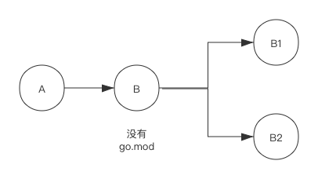
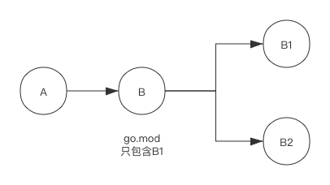

# 依赖管理

Go语言依赖管理经历了三个重要的阶段：

- GOPATH；
- vendor；
- Go Module；

早期Go语言单纯使用GOPATH管理依赖，但GOPATH不方便管理依赖的多个版本，后来增加了vendor，允许把项目依赖连同项目源码一同管理。 自从Go 1.11版本引入了全新的依赖管理工具Go module，直到Go 1.14版本 Go module才走向成熟。


## GOPATH

### GOROOT

通常说安装Go语言，实际上安装的是Go编译器和Go标准库，二者位于同一个安装包中。

Go语言安装的目录即GOROOT目录，里面保存了开发GO程序所需要的所有组件，比如编译器、标准库和文档等等。通常会把这个加入环境变量。

此外，通常还会把`$GOROOT/bin`添加到环境变量中，该目录主要是GO语言开发包中提供的二进程可执行程序。

所以，GOROOT实际上是指示GO语言安装目录的环境变量，属于GO语言顶级目录。

### GOPATH

Go语言项目是由一个或多个package组成的，这些package按照来源分为以下几种：

- 标准库
- 第三方库
- 项目私有库

其中标准库的package全部位于GOROOT环境变量指示的目录中，而第三方库和项目私有库都位于GOPATH环境变量所指示的目录中。

实际上，安装GO语言时，安装程序会设置一个**默认**的GOPATH环境变量，与GOROOT不同的是，GOPATH环境变量位于用户域，因为每个用户都可以创建自己的工作空间而互不干扰。 用户的项目需要位于`GOPATH`下的`src/`目录中。

所以GOPATH指示用户工作空间目录的环境变量，它属于用户域范畴的。

### 依赖查找

当某个package需要引用其他包时，编译器就会依次从`GOROOT/src/`和`GOPATH/src/`中去查找，如果某个包从GOROOT下找到的话，就不再到GOPATH目录下查找，所以如果项目中开发的包名与标准库相同的话，将会被自动忽略。

### GOPATH的缺点

GOPATH的优点是足够简单，但它不能很好的满足实际项目的工程需求。

比如，有两个项目A和B，他们都引用某个第三方库T，但这两个项目使用了不同的T版本，即：

- 项目A 使用T v1.0
- 项目B 使用T v2.0

由于编译器依赖查找固定从GOPATH/src下查找`GOPATH/src/T`，所以，无法在同一个GOPATH目录下保存第三方库T的两个版本。所以项目A、B无法共享同一个GOPATH，需要各自维护一个。


## Vendor

针对GOPATH的缺点：多项目无法共享同一个GOPATH。 vendor机制也没有彻底解决这个痛点，但是它提供了一个机制让项目的依赖隔离而不互相干扰。

自Go 1.6版本起，vendor机制正式启用，它允许把项目的依赖全部放到一个位于本项目的vendor目录中，这个vendor目录可以简单理解成私有的GOPATH目录。即编译时，优先从vendor中寻找依赖包，如果vendor中找不到再到GOPATH中寻找。

### vendor目录位置

一个项目可以有多个vendor目录，分别位于不同的目录级别，但建议每个项目只在根目录放置一个vendor目录。

假如有一个`github.com/constabulary/example-gsftp`项目， `main.go`中依赖如下几个包：

```
import (
    "golang.org/x/crypto/ssh"
    "github.com/pkg/sftp"
)
```

在没有使用vendor目录时，若想编译这个项目，那么GOPATH目录结构应该是如下所示：

```
$GOPATH
|    src/
|    |    github.com/constabulary/example-gsftp/
|    |    golang.org/x/crypto/ssh
|    |    github.com/pkg/sftp
```

而对于vendor机制，则如下所示：

```
$GOPATH
|    src/
|    |    github.com/constabulary/example-gsftp/
|    |    |    cmd/
|    |    |    |    gsftp/
|    |    |    |    |    main.go
|    |    |    vendor/
|    |    |    |    github.com/pkg/sftp/
|    |    |    |    golang.org/x/crypto/ssh/
```

### 搜索顺序

上面的例子中，在编译main.go时，编译器搜索依赖包顺序为：

1. 从`github.com/constabulary/example-gsftp/cmd/gsftp/`下寻找vendor目录，没有找到，继续从上层查找；
2. 从`github.com/constabulary/example-gsftp/cmd/`下寻找vendor目录，没有找到，继续从上层查找；
3. 从`github.com/constabulary/example-gsftp/`下寻找vendor目录，从vendor目录中查找依赖包，结束；

如果`github.com/constabulary/example-gsftp/`下的vendor目录中没有依赖包，则返回到GOPATH目录继续查找，这就是GOPATH机制了。

从上面的搜索顺序可以看出，实际上vendor目录可以存在于项目的任意目录的。但非常不推荐这么做，因为如果vendor目录过于分散，很可能会出现同一个依赖包，在项目的多个vendor中出现多次，这样依赖包会多次编译进二进制文件，从而造成二进制大小急剧变大。同时，也很可能出现一个项目中使用同一个依赖包的多个版本的情况，这种情况往往应该避免。

### vendor存在的问题

vendor很好的解决了多项目间的隔离问题，但是位于vendor中的依赖包无法指定版本，某个依赖包，在把它放入vendor的那刻起，它就固定在当时版本，项目的使用者很难识别出所使用的依赖版本。

比起这个，更严重的问题是二进制急剧扩大问题，比如你依赖某个开源包A和B，但A中也有一个vendor目录，其中也放了B，那么项目中将会出现两个开源包B。再进一步，如果这两个开源包B版本不一致呢？如果二者不兼容，那后果将是灾难性的。


## MODULE

在Go v1.11版本中，Module特性被首次引入，这标志着Go的依赖管理开始进入第三个阶段。

Go Module更像是一种全新的依赖管理方案，它涉及一系列的特性，但究其核心，它主要解决两个重要的问题：

- 准确的记录项目依赖；
- 可重复的构建；

准确的记录项目依赖，是指项目依赖哪些package、以及package的版本可以非常精确。可重复的构建是指，项目无论在谁的环境中（同平台）构建，其产物都是相同的。


### 基础概念

官方给module的定义是：`A module is a collection of related Go packages that are versioned together as a single unit.`，定义非常晰，一组package的集合，一起被标记版本，即是一个module。

通常而言，一个仓库包含一个module（虽然也可以包含多个，但不推荐），所以仓库、module和package的关系如下：

- 一个仓库包含一个或多个Go module；
- 每个Go module包含一个或多个Go package；
- 每个package包含一个或多个Go源文件；

此外，一个module的版本号规则必须遵循[语义化规范](https://semver.org/)，版本号必须使用格式`v(major).(minor).(patch)`，比如`v0.1.0`、`v1.2.3` 或`v1.5.0-rc.1`。

版本格式`v(major).(minor).(patch)`中major指的是大版本，minor指小版本，patch指补丁版本。

- major: 当发生不兼容的改动时才可以增加major版本；比如`v2.x.y`与`v1.x.y`是不兼容的；
- minor: 当有新增特性时才可以增加该版本，比如`v1.17.0`是在`v1.16.0`基础上加了新的特性，同时兼容`v1.16.0`；
- patch: 当有bug修复时才可以 增加该版本，比如`v1.17.1`修复了`v1.17.0`上的bug，没有新特性增加；

语义化版本规范的好处是，用户通过版本号就能了解版本信息。


### init和require

在Go module机制下，项目的module名字以及其依赖信息记录在一个名为`go.mod`的文件中，该文件可以手动创建，也可以使用`go mod init`命令自动生成。

完整的`go mod init`命令格式为`go mod init [module]`：其中`[module]`为module名字，如果不填，`go mod init`会尝试从版本控制系统或import的注释中猜测一个。建议明确指定。

引入依赖后，会在go.mod文件中添加引入的依赖信息，这些依赖被`require`指令标识，于此同时，还会在go.sum记录该依赖的校验和。

如：

```go
// go.mod
module testmodule

go 1.13

require github.com/google/uuid v1.1.1

// go.sum 
github.com/google/uuid v1.1.1 h1:Gkbcsh/GbpXz7lPftLA3P6TYMwjCLYm83jiFQZF/3gY=
github.com/google/uuid v1.1.1/go.mod h1:TIyPZe4MgqvfeYDBFedMoGGpEw/LqOeaOT+nhxU+yHo=
```


### replace

`go.mod`文件中通过`指令`声明module信息，用于控制命令行工具进行版本选择。一共有四个指令可供使用：

- module： 声明module名称；
- require： 声明依赖以及其版本号；
- replace： 替换require中声明的依赖，使用另外的依赖及其版本号；
- exclude： 禁用指定的依赖；

#### replace 工作机制

`replace`指替换，它指示编译工具替换`require`指定中出现的包，比如，我们在`require`中指定的依赖如下：

```
module testmodule  

go 1.13  

require github.com/google/uuid v1.1.1
```

此时，可以使用`go list -m all`命令查看最终选定的版本：

```
[root@ecs-d8b6 gomodule]# go list -m all
testmodule
github.com/google/uuid v1.1.1
```

比如，修改`go.mod`，添加replace指令：

```
[root@ecs-d8b6 gomodule]# cat go.mod 
module testmodule

go 1.13

require github.com/google/uuid v1.1.1

replace github.com/google/uuid v1.1.1 => github.com/google/uuid v1.1.0
```

`replace github.com/google/uuid v1.1.1 => github.com/google/uuid v1.1.0`指定表示替换uuid v1.1.1版本为 v1.1.0，此时再次使用`go list -m all`命令查看最终选定的版本：

```
[root@ecs-d8b6 gomodule]# go list -m all 
github.com/renhongcai/gomodule
github.com/google/uuid v1.1.1 => github.com/google/uuid v1.1.0
```

可以看到其最终选择的uuid版本为 v1.1.0。

`replace`正常工作还需要满足两个条件：

第一，`replace`仅在当前module为`main module`时有效，如果其他项目引用了`testmodule`，那么其他项目编译时，`replace`就会被自动忽略。

第二，`replace`指定中`=>`前面的包及其版本号必须出现在`require`中才有效，否则指令无效，也会被忽略。 

#### replace 使用场景

**替换无法下载的包**

由于中国大陆网络问题，有些包无法顺利下载，比如`golang.org`组织下的包，值得庆幸的是这些包在GitHub都有镜像，此时 就可以使用GitHub上的包来替换。

比如，项目中使用了`golang.org/x/text`包：

```
package main

import (
    "fmt"

    "github.com/google/uuid"
    "golang.org/x/text/language"
    "golang.org/x/text/message"
)

func main() {
    id := uuid.New().String()
    fmt.Println("UUID: ", id)

    p := message.NewPrinter(language.BritishEnglish)
    p.Printf("Number format: %v.\n", 1500)

    p = message.NewPrinter(language.Greek)
    p.Printf("Number format: %v.\n", 1500)
}
```

上面的简单例子，使用两种语言`language.BritishEnglish` 和`language.Greek`分别打印数字`1500`，来查看不同语言对数字格式的处理，一个是`1,500`，另一个是`1.500`。此时就会分别引入`"golang.org/x/text/language"` 和`"golang.org/x/text/message"`。

执行`go get` 或`go build`命令时会就再次分析依赖情况，并更新`go.mod`文件。网络正常情况下，`go.mod`文件将会变成下面的内容：

```
module testmodule

go 1.13

require (
    github.com/google/uuid v1.1.1
    golang.org/x/text v0.3.2
)

replace github.com/google/uuid v1.1.1 => github.com/google/uuid v1.1.0
```

没有合适的网络代理情况下，`golang.org/x/text` 很可能无法下载。那么此时，就可以使用`replace`来让项目使用GitHub上相应的镜像包。可以添加一条新的`replace`条目，如下所示：

```
replace (
    github.com/google/uuid v1.1.1 => github.com/google/uuid v1.1.0
    golang.org/x/text v0.3.2 => github.com/golang/text v0.3.2
)
```

此时，项目编译时就会从GitHub下载包。源代码中import路径 `golang.org/x/text/xxx`不需要改变。

是否可以将import路径由`golang.org/x/text/xxx`改成`github.com/golang/text/xxx`？这样一来，就不需要使用replace来替换包了。

遗憾的是，不可以。因为`github.com/golang/text`只是镜像仓库，其`go.mod`文件中定义的module还是`module golang.org/x/text`，这个module名字直接决定了import的路径。

**调试依赖包**

有时需要调试依赖包，此时就可以使用`replace`来修改依赖，如下所示：

```
replace (
github.com/google/uuid v1.1.1 => ../uuid
golang.org/x/text v0.3.2 => github.com/golang/text v0.3.2
)
```

语句`github.com/google/uuid v1.1.1 => ../uuid`使用本地的uuid来替换依赖包，此时，可以任意地修改`../uuid`目录的内容来进行调试。

除了使用相对路径，还可以使用绝对路径，甚至还可以使用自已的fork仓库。

**使用fork仓库**

有时在使用开源的依赖包时发现了bug，在开源版本还未修改或者没有新的版本发布时，可以使用fork仓库，在fork仓库中进行bug fix。 可以在fork仓库上发布新的版本，并相应的修改`go.mod`来使用fork仓库。

使用fork仓库仅仅是临时的做法，一旦开源版本变得可用，需要尽快切换到开源版本。

**禁止被依赖**

另一种使用`replace`的场景是module不希望被直接引用，比如开源软件[kubernetes](https://github.com/kubernetes/kubernetes)，在它的`go.mod`中`require`部分有大量的`v0.0.0`依赖，比如：

```
module k8s.io/kubernetes

require (
    ...
    k8s.io/api v0.0.0
    k8s.io/apiextensions-apiserver v0.0.0
    k8s.io/apimachinery v0.0.0
    k8s.io/apiserver v0.0.0
    k8s.io/cli-runtime v0.0.0
    k8s.io/client-go v0.0.0
    k8s.io/cloud-provider v0.0.0
    ...
)
```

由于上面的依赖都不存在v0.0.0版本，所以其他项目直接依赖`k8s.io/kubernetes`时会因无法找到版本而无法使用。 因为Kubernetes不希望作为module被直接使用，其他项目可以使用kubernetes其他子组件。

kubernetes 对外隐藏了依赖版本号，其真实的依赖通过`replace`指定：

```
replace (
    k8s.io/api => ./staging/src/k8s.io/api
    k8s.io/apiextensions-apiserver => ./staging/src/k8s.io/apiextensions-apiserver
    k8s.io/apimachinery => ./staging/src/k8s.io/apimachinery
    k8s.io/apiserver => ./staging/src/k8s.io/apiserver
    k8s.io/cli-runtime => ./staging/src/k8s.io/cli-runtime
    k8s.io/client-go => ./staging/src/k8s.io/client-go
    k8s.io/cloud-provider => ./staging/src/k8s.io/cloud-provider
)
```

`replace`指令在当前模块不是`main module`时会被自动忽略的，Kubernetes正是利用了这一特性来实现对外隐藏依赖版本号来实现禁止直接引用的目的。


### exclude

`go.mod`文件中的`exclude`指令用于排除某个包的特定版本，其与`replace`类似，也仅在当前module为`main module`时有效，其他项目引用当前项目时，`exclude`指令会被忽略。

#### 排除指定版本

假如，当前uuid仅有`v1.0.0` 、`v1.1.0`和`v1.1.1`三个版本可用，而且假定`v1.1.0`版本有严重bug。 此时可以使用`exclude`指令将uuid的`v1.1.0`版本排除在外，即在`go.mod`文件添加如下内容：

```
exclude github.com/google/uuid v1.1.0
```

虽然暂时没有使用uuid的`v1.1.0`版本，但如果将来引用了其他包，正好其他包引用了uuid的`v1.1.0`版本的话，此时添加的`exclude`指令就会跳过`v1.1.0`版本。

将来该模块引用了A模块，A模块使用了`v1.1.0`版本，那么在选择版本时，该模块发现跳过uuid `v1.1.0`版本后还有`v1.1.1`版本可用，Go 命令行工具可以自动选择`v1.1.1`版本，但如果没有更新的版本时将会报错而无法编译。


### indirect

在使用 Go module 过程中，随着引入的依赖增多，`go.mod`文件中部分依赖包后面会出现一个`// indirect`的标识。这个标识总是出现在`require`指令中，`indirect`表示间接的依赖。

在执行命令`go mod tidy`时，Go module 会自动整理`go.mod 文件`，如果有必要会在部分依赖包的后面增加`// indirect`注释。一般而言，被添加注释的包肯定是间接依赖的包，而没有添加`// indirect`注释的包则是直接依赖的包，即明确的出现在某个`import`语句中。

然而，这里需要着重强调的是：并不是所有的间接依赖都会出现在 `go.mod`文件中。间接依赖出现在`go.mod`文件的情况，可能符合下面所列场景的一种或多种：

- 直接依赖未启用 Go module
- 直接依赖go.mod 文件中缺失部分依赖

#### 直接依赖未启用 Go module

如下图所示，Module A 依赖 B，但是 B 还未切换成 Module，也即没有`go.mod`文件，此时，当使用`go mod tidy`命令更新A的`go.mod`文件时，B的两个依赖B1和B2将会被添加到A的`go.mod`文件中（前提是A之前没有依赖B1和B2），并且B1 和B2还会被添加`// indirect`的注释。



#### 直接依赖 go.mod 文件不完整

即便B拥有`go.mod`，如果`go.mod`文件不完整的话，Module A依然会记录部分B的依赖到`go.mod`文件中。

如下图所示，Module B虽然提供了`go.mod`文件中，但`go.mod`文件中只添加了依赖B1，那么此时A在引用B时，则会在A的`go.mod`文件中添加B2作为间接依赖，B1则不会出现在A的`go.mod`文件中。



#### 如何查找间接依赖来源

Go module提供了`go mod why` 命令来解释为什么会依赖某个软件包，若要查看`go.mod`中某个间接依赖是被哪个依赖引入的，可以使用命令`go mod why -m <pkg>`来查看。

希望确定间接依赖`github.com/Rican7/retry v0.1.0 // indirect`是被哪个依赖引入的，则可以使用命令`go mod why`来查看：

```
[root@ecs-d8b6 gomodule]# go mod why -m github.com/Rican7/retry
# github.com/Rican7/retry
github.com/renhongcai/gomodule
github.com/renhongcai/indirect
github.com/Rican7/retry
```

上面的打印信息中`# github.com/Rican7/retry` 表示当前正在分析的依赖，后面几行则表示依赖链。`github.com/renhongcai/gomodule` 依赖`github.com/renhongcai/indirect`，而`github.com/renhongcai/indirect`依赖`github.com/Rican7/retry`。由此可以判断出间接依赖`github.com/Rican7/retry`是被`github.com/renhongcai/indirect`引入的。

另外，命令`go mod why -m all`则可以分析所有依赖的依赖链。


### 版本选择机制

`go get <pkg>`来获取某个依赖，如果没有特别指定依赖的版本号，`go get`会自动选择一个最优版本，并且如果本地有`go.mod`文件的话，还会自动更新`go.mod`文件。

事实上除了`go get`，`go build`和`go mod tidy`也会自动选择依赖的版本。这些命令选择依赖版本时都遵循一些规则。

#### 依赖包版本约定

从Go v1.11版本开始，随着Go module特性的引入，依赖包的兼容性要求的核心内容如下：

- 如果新package 和旧的package拥有相同的import 路径，那么新package必须兼容旧的package;
- 如果新的package不能兼容旧的package，那么新的package需要更换import路径；

Go module 的`go.mod`中记录的module名字决定了import路径。

在Go module时代，module版本号要遵循语义化版本规范，即版本号格式为`v<major>.<minor>.<patch>`，如v1.2.3。当有不兼容的改变时，需要增加`major`版本号，如v2.1.0。

Go module规定，如果`major`版本号大于`1`，则`major`版本号需要显式地标记在module名字中，如`module github.com/my/mod/v2`。这样做的好处是Go module 会把`module github.com/my/mod/v2` 和 `module github.com/my/mod`视做两个module，他们甚至可以被同时引用。

#### 版本选择机制

Go 的多个命令行工具都有自动选择依赖版本的能力，如`go build` 和`go test`，当在源代码中增加了新的import，这些命令将会自动选择一个最优的版本，并更新`go.mod`文件。

需要特别说明的是，如果`go.mod`文件中已标记了某个依赖包的版本号，则这些命令不会主动更新`go.mod`中的版本号。所谓自动更新版本号只在`go.mod`中缺失某些依赖或者依赖不匹配时才会发生。

**最新版本选择**

当在源代码中新增加了一个import，比如：

```
import "github.com/RainbowMango/M"
```

如果`go.mod`的require指令中并没有包含`github.com/RainbowMango/M`这个依赖，那么`go build` 或`go test`命令则会去`github.com/RainbowMango/M`仓库寻找最新的符合语义化版本规范的版本，这里，由于import路径里没有类似于`v2`或更高的版本号，所以版本选择时只会选择v1.x.x的版本，不会去选择v2.x.x或更高的版本。

**最小版本选择**

有时记录在`go.mod`文件中的依赖包版本会随着引入其他依赖包而发生变化。

如下图所示：


Module A 依赖 Module M的v1.0.0版本，但之后 Module A 引入了 Module D，而Module D 依赖 Module M的v1.1.1版本，此时，由于依赖的传递，Module A也会选择v1.1.1版本。

需要注意的是，此时会自动选择最小可用的版本，而不是最新的tag版本。


### incompatible

Module的版本号需要遵循`v<major>.<minor>.<patch>`的格式，此外，如果`major`版本号大于1时，其版本号还需要体现在Module名字中。

那么如果Module的`major`版本号虽然变成了`v2.x.x`，但Module名字仍保持原样会怎么样呢？ 其他项目是否还可以引用呢？其他项目引用时有没有风险呢？

#### 能否引用不兼容的包

假如 `github.com/RainbowMango/m` 当前版本为`v3.6.0`，因为其Module名字未遵循Golang所推荐的风格，即Module名中附带版本信息，称这个Module为不规范的Module。

不规范的Module还是可以引用的，但跟引用规范的Module略有差别。

如果在项目A中引用了该module，使用命令`go mod tidy`，go 命令会自动查找Module m的最新版本，即`v3.6.0`。 由于Module为不规范的Module，为了加以区分，go 命令会在`go.mod`中增加`+incompatible` 标识。

```
require (
    github.com/RainbowMango/m v3.6.0+incompatible
)
```

除了增加`+incompatible`（不兼容）标识外，在其使用上没有区别。

#### 如何处理incompatible

困扰在于，比如 `github.com/blang/semver`发布了新版本`v4.0.0`，但不幸的是Module名字仍然为`github.com/blang/semver`。那么，升级这个Module的版本将会变得困难。因为`v3.6.0`到`v4.0.0`跨越了大版本，按照语义化版本规范来解释说明发生了不兼容的改变，即然不兼容，项目维护者有必须对升级持谨慎态度，甚至放弃升级。


### 伪版本

在`go.mod`中通常使用语义化版本来标记依赖，比如`v1.2.3`、`v0.1.5`等。因为`go.mod`文件通常是`go`命令自动生成并修改的，所以实际上是`go`命令习惯使用语义化版本。

诸如`v1.2.3`和`v0.1.5`这样的语义化版本，实际是某个commit ID的标记，真正的版本还是commit ID。

由于语义化版本比`commit ID`更直观（方便交流与比较版本大小），所以一般情况下使用语义化版本。

#### 什么是伪版本

在实际项目中，有时不得不直接使用一个`commit ID`，比如某项目发布了`v1.5.0`版本，但随即又修复了一个bug（引入一个新的commit ID），而且没有发布新的版本。此时，如果希望使用最新的版本，就需要直接引用最新的`commit ID`，而不是之前的语义化版本`v1.5.0`。 使用`commit ID`的版本在Go语言中称为`pseudo-version`，可译为"伪版本"。

伪版本的版本号通常会使用`vx.y.z-yyyymmddhhmmss-abcdefabcdef`格式，其中`vx.y.z`看上去像是一个真实的语义化版本，但通常并不存在该版本，所以称为伪版本。另外`abcdefabcdef`表示某个commit ID的前12位，而`yyyymmddhhmmss`则表示该commit的提交时间，方便做版本比较。

使用伪版本的`go.mod`举例如下：

```
...
require (
    go.etcd.io/etcd v0.0.0-20191023171146-3cf2f69b5738
)
...
```

#### 如何获取伪版本

使用`go get github.com/renhongcai/gomodule@6eb27062747a458a27fb05fceff6e3175e5eca95`命令（可以使用完整的commit id，也可以只使用前12位）：

此时，可以看到生成的伪版本号为`v1.5.1-0.20200203082525-6eb27062747a`，当前最新版本为`v1.5.0`，`go`命令生成伪版本号时自动增加了版本。

也可以使用某个分支`go get xxx@main`，他也会为最新的commit创建一个伪版本。

伪版本由go自动生成，不用特别关注。


### 依赖包存储

`GOPATH`模式下，依赖包存储在`$GOPATH/src`，该目录下只保存特定依赖包的一个版本，而在`GOMODULE`模式下，依赖包存储在`$GOPATH/pkg/mod`，该目录中可以存储特定依赖包的多个版本。

需要注意的是`$GOPATH/pkg/mod`目录下有个`cache`目录，它用来存储依赖包的缓存，简单说，`go`命令每次下载新的依赖包都会在该`cache`目录中保存一份。对`GOPROXY`有用。

使用`GO111MODULE`环境变量控制具体的模式：

- `export GO111MODULE=off`切换到`GOPATH`模式
- `export GO111MODULE=on`切换到`GOMODULE`模式。

#### GOPATH 依赖包存储

```
# export GO111MODULE=off
# go get -v github.com/google/uuid
```

在`GOPATH`模式下，`go get`命令会将依赖包下载到`$GOPATH/src/google`目录中。

该命令等同于在`$GOPATH/src/google`目录下执行`git clone https://github.com/google/uuid.git`，也就是`$GOPATH/src/google/uuid`目录中存储的是完整的仓库。

#### GOMODULE 依赖包存储

```
# export GO111MODULE=on
# go get -v github.com/google/uuid
# go get -v github.com/google/uuid@v1.0.0
# go get -v github.com/google/uuid@v1.1.0
# go get -v github.com/google/uuid@v1.1.1
```

在`GOMODULE`模式下，`go get`命令会将依赖包下载到`$GOPATH/pkg/mod`目录下，并且按照依赖包的版本分别存放。（注：`go get`命令不指定特定版本时，默认会下载最新版本）

此时`$GOPATH/pkg/mod`目录结构如下：

```
${GOPATH}/pkg/mod/github.com/google
├── uuid@v1.0.0
├── uuid@v1.1.0
├── uuid@v1.1.1
```

相较于`GOPATH`模式，`GOMODULE`有两处不同点：

- 一是依赖包的目录中包含了版本号，每个版本占用一个目录；
- 二是依赖包的特定版本目录中只包含依赖包文件，不包含`.git`目录；

#### 包名大小写敏感问题

有时使用的包名中会包含大写字母，比如`github.com/Azure/azure-sdk-for-go`，`GOMODULE`模式下，在存储时会将包名做大小写编码处理，即每个大写字母将变与`!`+相应的小写字母。

由于`github.com/google/uuid`域名不区分大小写，所以使用`github.com/google/UUID`下载包时仍然可以下载，但在存储时将会严格区分大小写，此时`$GOPATH/pkg/mod/google/`目录下将会多出一个`!u!u!i!d@v1.0.0`目录：

```
${GOPATH}/pkg/mod/github.com/google
├── uuid@v1.0.0
├── uuid@v1.1.0
├── uuid@v1.1.1
├── !u!u!i!d@v1.0.0
```

在`go get`中使用错误的包名，除了会增加额外的不必要存储外，还可能会影响`go`命令解析依赖，还可能将错误的包名使用到`import`指令中，所以在实际使用时应该尽量避免。


### go.sum

为了确保一致性构建，Go引入了`go.mod`文件来标记每个依赖包的版本，在构建过程中`go`命令会下载`go.mod`中的依赖包，下载的依赖包会缓存在本地，以便下次构建。 考虑到下载的依赖包有可能是被黑客恶意篡改的，以及缓存在本地的依赖包也有被篡改的可能，单单一个`go.mod`文件并不能保证一致性构建。

为了解决Go module的这一安全隐患，Go开发团队在引入`go.mod`的同时也引入了`go.sum`文件，用于记录每个依赖包的哈希值，在构建时，如果本地的依赖包hash值与`go.sum`文件中记录得不一致，则会拒绝构建。

#### go.sum文件记录

`go.sum`文件中每行记录由`module`名、版本和哈希组成，并由空格分开：

```
<module> <version>[/go.mod] <hash>
```

比如，某个`go.sum`文件中记录了`github.com/google/uuid` 这个依赖包的`v1.1.1`版本的哈希值：

```
github.com/google/uuid v1.1.1 h1:Gkbcsh/GbpXz7lPftLA3P6TYMwjCLYm83jiFQZF/3gY=  
github.com/google/uuid v1.1.1/go.mod h1:TIyPZe4MgqvfeYDBFedMoGGpEw/LqOeaOT+nhxU+yHo=
```

正常情况下，每个`依赖包版本`会包含两条记录，第一条记录为该`依赖包版本`整体（所有文件）的哈希值，第二条记录仅表示该`依赖包版本`中`go.mod`文件的哈希值，如果该`依赖包版本`没有`go.mod`文件，则只有第一条记录。如上面的例子中，`v1.1.1`表示该`依赖包版本`整体，而`v1.1.1/go.mod`表示该`依赖包版本`中`go.mod`文件。

`依赖包版本`中任何一个文件（包括`go.mod`）改动，都会改变其整体哈希值，此处再额外记录`依赖包版本`的`go.mod`文件主要用于计算依赖树时不必下载完整的`依赖包版本`，只根据`go.mod`即可计算依赖树。

每条记录中的哈希值前均有一个表示哈希算法的`h1:`，表示后面的哈希值是由算法`SHA-256`计算出来的

此外，`go.sum`文件中记录的`依赖包版本`数量往往比`go.mod`文件中要多，这是因为二者记录的粒度不同导致的。`go.mod`只需要记录直接依赖的`依赖包版本`，只在`依赖包版本`不包含`go.mod`文件时候才会记录间接`依赖包版本`，而`go.sum`则是要记录构建用到的所有`依赖包版本`。

#### 生成

`go get`命令首先会将该依赖包下载到本地缓存目录`$GOPATH/pkg/mod/cache/download`，该依赖包为一个后缀为`.zip`的压缩包，如`v1.0.0.zip`。`go get`下载完成后会对该`.zip`包做哈希运算，并将结果存放在后缀为`.ziphash`的文件中，如`v1.0.0.ziphash`。如果在项目的根目录中执行`go get`命令的话，`go get`会同步更新`go.mod`和`go.sum`文件，`go.mod`中记录的是依赖名及其版本，如：

```
require (
    github.com/google/uuid v1.0.0
)
```

`go.sum`文件中则会记录依赖包的哈希值（同时还有依赖包中go.mod的哈希值），如：

```
github.com/google/uuid v1.0.0 h1:b4Gk+7WdP/d3HZH8EJsZpvV7EtDOgaZLtnaNGIu1adA=
github.com/google/uuid v1.0.0/go.mod h1:TIyPZe4MgqvfeYDBFedMoGGpEw/LqOeaOT+nhxU+yHo=
```

值得一提的是，在更新`go.sum`之前，为了确保下载的依赖包是真实可靠的，`go`命令在下载完依赖包后还会查询`GOSUMDB`环境变量所指示的服务器，以得到一个权威的`依赖包版本`哈希值。如果`go`命令计算出的`依赖包版本`哈希值与`GOSUMDB`服务器给出的哈希值不一致，`go`命令将拒绝向下执行，也不会更新`go.sum`文件。

#### 校验

假设拿到某项目的源代码并尝试在本地构建，`go`命令会从本地缓存中查找所有`go.mod`中记录的依赖包，并计算本地依赖包的哈希值，然后与`go.sum`中的记录进行对比，即检测本地缓存中使用的`依赖包版本`是否满足项目`go.sum`文件的期望。

如果校验失败，说明本地缓存目录中`依赖包版本`的哈希值和项目中`go.sum`中记录的哈希值不一致，`go`命令将拒绝构建。 

当校验失败时，有必要确认到底是本地缓存错了，还是`go.sum`记录错了。 需要说明的是，二者都可能出错。当校验失败时，`go`命令倾向于相信`go.sum`，因为一个新的`依赖包版本`在被添加到`go.sum`前是经过`GOSUMDB`（校验和数据库）验证过的。此时即便系统中配置了`GOSUMDB`（校验和数据库），`go`命令也不会查询该数据库。

#### 校验和数据库

环境变量`GOSUMDB`标识一个`checksum database`，即校验和数据库，实际上是一个web服务器，该服务器提供查询`依赖包版本`哈希值的服务。

该数据库中记录了很多`依赖包版本`的哈希值，比如Google官方的`sum.golang.org`则记录了所有的可公开获得的`依赖包版本`。除了使用官方的数据库，还可以指定自行搭建的数据库，甚至干脆禁用它（`export GOSUMDB=off`）。

如果系统配置了`GOSUMDB`，在`依赖包版本`被写入`go.sum`之前会向该数据库查询该`依赖包版本`的哈希值进行二次校验，校验无误后再写入`go.sum`。

如果系统禁用了`GOSUMDB`，在`依赖包版本`被写入`go.sum`之前则不会进行二次校验，`go`命令会相信所有下载到的依赖包，并把其哈希值记录到`go.sum`中。