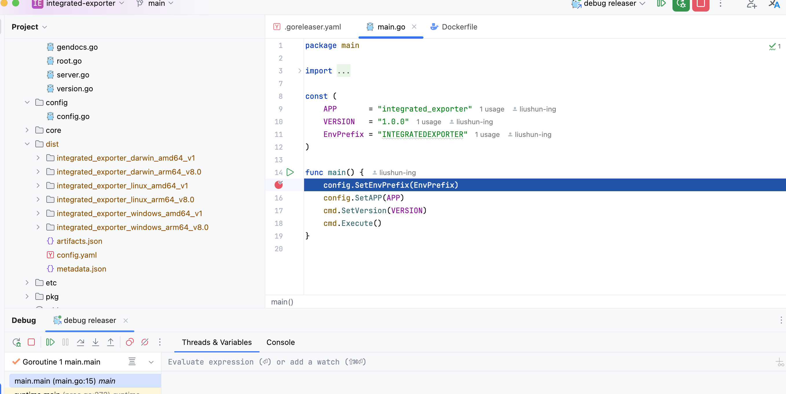

## Go Tools

go编写项目的一些有用的工具。


## gorgeous

[代码格式化](https://github.com/fsgo/go_fmt)

```sh
go install github.com/fsgo/go_fmt/cmd/gorgeous@latest
```

然后对代码进行格式化

```sh
gorgeous ./...
```


## golangci-lint

[静态检查](https://github.com/golangci/golangci-lint)

```sh
go install github.com/golangci/golangci-lint/cmd/golangci-lint@latest
```

注意他安装的时候有版本对应问题，不能用低版本go安装的golangci-lint，去检查高版本的项目。所以推荐使用gvm来管理多个go版本。

使用：

创建`.golangci.yaml`配置文件

样例：

```yml
run:
  go: '1.23.4'
linters:
  enable:
    - thelper
    - gofumpt
    - tparallel
    - unconvert
    - wastedassign
    - tagliatelle

linters-settings:
  gofumpt:
    # Module path which contains the source code being formatted.
    # Default: ""
    module-path: github.com/liushunkkk/integrated_exporter
    # Choose whether to use the extra rules.
    # Default: false
    extra-rules: true
#  staticcheck:
#    checks: ["-SA5008"] # 忽略 tag 检查
```

然后检查

```sh
golangci-lint run --fix  
```


## delve

[代码远程调试](https://github.com/go-delve/delve)

场景：你本地有一个项目，然后远程服务上，你想在本地goland中调试远程服务器上跑的情况，就可以使用dlv

安装

```sh
go install github.com/go-delve/delve/cmd/dlv@latest
```

远程服务器跑一个程序，注意这个程序编译的时候不能使用优化，不然可能本地代码和服务器跑的不一样，会导致打断点啥的对应不上。

也就是编译的时候要设置gcflags：`go build -gcflags="all=-N -l" .`

然后使用dlv启动程序

```sh
dlv --listen=:2345 --headless=true --api-version=2 --accept-multiclient exec xxx -- -a=a -b=b
```


运行成功的话，就会有日志打印，他在监听2345端口，等待连接。

> 注意：dlv程序要么等待连接者断开，要么就只能使用kill -9 pid杀死

然后这是goland就可以去连接了。注意goland需要新建的是go remote配置。


配置好后，启动goland程序，就可以打断点进行远程调试了。




