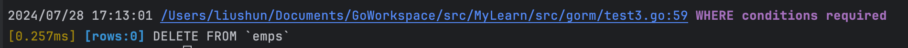

# GORM-1

GORM 是 Go 语言中最受欢迎的 ORM 库之一，它提供了强大的功能和简洁的 API，让数据库操作变得更加简单和易维护。

## 约定

1、默认情况下，GORM 会使用 `ID` 作为表的主键。

```
type User struct {
  ID   string // 默认情况下，名为 `ID` 的字段会作为表的主键
  Name string
}
```

2、GORM 使用结构体名的 `蛇形命名` 作为表名，并用复数。对于结构体 `User`，根据约定，其表名为 `users`

可以使用如下方式重写表名，其实就是需要实现一个 Tabler 接口。

```go
type Tabler interface {
    TableName() string
}
// TableName 会将 Depts 的表名重写为 `Dept`
func (*Dept) TableName() string {
    return "dept"
}
```

3、根据约定，数据表的列名使用的是 struct 字段名的 `蛇形命名`

```go
type User struct {
  ID        uint      // 列名是 `id`
  Name      string    // 列名是 `name`
  Birthday  time.Time // 列名是 `birthday`
  CreatedAt time.Time // 列名是 `created_at`
}
```

可以使用 `column` 标签来覆盖列名

```go
type Animal struct {
  AnimalID int64     `gorm:"column:beast_id"`         // 将列名设为 `beast_id`
  Birthday time.Time `gorm:"column:day_of_the_beast"` // 将列名设为 `day_of_the_beast`
  Age      int64     `gorm:"column:age_of_the_beast"` // 将列名设为 `age_of_the_beast`
}
```


## 声明模型

GORM 通过将 Go 结构体（Go structs） 映射到数据库表来简化数据库交互。 了解如何在GORM中定义模型，是充分利用GORM全部功能的基础。

### 模型定义

模型是使用普通结构体定义的。 这些结构体可以包含具有基本Go类型、指针或这些类型的别名，甚至是自定义类型（只需要实现 `database/sql` 包中的[Scanner](https://pkg.go.dev/database/sql/?tab=doc#Scanner)和[Valuer](https://pkg.go.dev/database/sql/driver#Valuer)接口）。

考虑以下 `user` 模型的示例：

```
type User struct {
  ID           uint           // 标准字段，主键
  Name         string         // 一个常规字符串字段
  Email        *string        // 一个指向字符串的指针, 允许为 null
  Age          uint8          // 一个未签名的8位整数
  Birthday     *time.Time     // A pointer to time.Time, can be null
  MemberNumber sql.NullString // Uses sql.NullString to handle nullable strings
  ActivatedAt  sql.NullTime   // Uses sql.NullTime for nullable time fields
  CreatedAt    time.Time      // 创建时间（由GORM自动管理）
  UpdatedAt    time.Time      // 最后一次更新时间（由GORM自动管理）
}
```

在此模型中：

- 具体数字类型如 `uint`、`string`和 `uint8` 直接使用。
- 指向 `*string` 和 `*time.Time` 类型的指针表示可空字段。
- 来自 `database/sql` 包的 `sql.NullString` 和 `sql.NullTime` 用于具有更多控制的可空字段。
- `CreatedAt` 和 `UpdatedAt` 是特殊字段，当记录被创建或更新时，GORM 会自动向内填充当前时间。


### 约定

1. **主键**：GORM 使用一个名为`ID` 的字段作为每个模型的默认主键。
2. **表名**：默认情况下，GORM 将结构体名称转换为 **`snake_case` 并为表名加上复数形式**。 例如，一个 `User` 结构体在数据库中的表名变为 `users` 。
3. **列名**：GORM 自动将结构体字段名称转换为 `snake_case` 作为数据库中的列名。
4. **时间戳字段**：GORM使用字段 `CreatedAt` 和 `UpdatedAt` 来自动跟踪记录的创建和更新时间。

遵循这些约定可以大大减少需要编写的配置或代码量。 


### gorm.Model

GORM提供了一个预定义的结构体，名为`gorm.Model`，其中包含常用字段：

```
// gorm.Model 的定义
type Model struct {
  ID        uint           `gorm:"primaryKey"`
  CreatedAt time.Time
  UpdatedAt time.Time
  DeletedAt gorm.DeletedAt `gorm:"index"`
}
```

- **将其嵌入在结构体中**: 可以直接在结构体中嵌入 `gorm.Model` ，以便自动包含这些字段。 这对于在不同模型之间保持一致性并利用GORM内置的约定非常有用。
- **包含的字段**：
  - `ID` ：每个记录的唯一标识符（主键）。
  - `CreatedAt` ：在创建记录时自动设置为当前时间。
  - `UpdatedAt`：每当记录更新时，自动更新为当前时间。
  - `DeletedAt`：用于软删除（将记录标记为已删除，而实际上并未从数据库中删除）。

> 需要注意的是，DeletedAt 是一个`sql.NullTime`类型，他记录的是时间信息。如果不为空说明已经删除


### 高级选项

#### 字段级权限控制

可导出的字段在使用 GORM 进行 CRUD 时拥有全部的权限，此外，GORM 允许用标签控制字段级别的权限。这样可以让一个字段的权限是只读、只写、只创建、只更新或者被忽略

> 使用 GORM Migrator 创建表时，不会创建被忽略的字段

```go
type User struct {  
  Name string `gorm:"<-:create"` // 允许读和创建  
  Name string `gorm:"<-:update"` // 允许读和更新  
  Name string `gorm:"<-"`        // 允许读和写（创建和更新）  
  Name string `gorm:"<-:false"`  // 允许读，禁止写  
  Name string `gorm:"->"`        // 只读（除非有自定义配置，否则禁止写）  
  Name string `gorm:"->;<-:create"` // 允许读和写  
  Name string `gorm:"->:false;<-:create"` // 仅创建（禁止从 db 读）  
  Name string `gorm:"-"`  // 通过 struct 读写会忽略该字段  
  Name string `gorm:"-:all"`        // 通过 struct 读写、迁移会忽略该字段  
  Name string `gorm:"-:migration"`  // 通过 struct 迁移会忽略该字段
}
```


#### 创建/更新时间

GORM 约定使用 `CreatedAt`、`UpdatedAt` 追踪创建/更新时间，GORM 在创建、更新时会自动填充当前时间

要使用不同名称的字段，可以配置 `autoCreateTime`、`autoUpdateTime` 标签。

也可以使用其他单位，如 UNIX（毫/纳）秒时间戳，而不是 time，只需将 `time.Time` 修改为 `int` 

```go
type User struct {
  CreatedAt time.Time // 在创建时，如果该字段值为零值，则使用当前时间填充
  UpdatedAt int       // 在创建时该字段值为零值或者在更新时，使用当前时间戳秒数填充
  Updated   int64 `gorm:"autoUpdateTime:nano"` // 使用时间戳纳秒数填充更新时间
  Updated   int64 `gorm:"autoUpdateTime:milli"` // 使用时间戳毫秒数填充更新时间
  Created   int64 `gorm:"autoCreateTime"`      // 使用时间戳秒数填充创建时间
}
```


#### 嵌入结构体

对于`gorm.Model`会自动嵌入

对于正常的结构体字段，可以通过标签 `embedded` 将其嵌入，例如：

```go
type Author struct {
    Name  string
    Email string
}

type Blog struct {
  ID      int
  Author  Author `gorm:"embedded"`
  Upvotes int32
}
// 等效于
type Blog struct {
  ID    int64
  Name  string
  Email string
  Upvotes  int32
}
```

使用标签 `embeddedPrefix` 来为 db 中的字段名添加前缀，例如：

```go
type Blog struct {
  ID      int
  Author  Author `gorm:"embedded;embeddedPrefix:author_"`
  Upvotes int32
}
// 等效于
type Blog struct {
  ID          int64
  AuthorName string
  AuthorEmail string
  Upvotes     int32
}
```


#### 字段标签

声明 model 时，tag 是可选的，GORM 支持以下 tag： tag 名大小写不敏感，但建议使用 `camelCase` 风格，每个不同标签之间使用`;`分隔。需要赋值的使用`:`

| 标签名                 | 说明                                                         |
| :--------------------- | :----------------------------------------------------------- |
| column                 | 指定 db 列名                                                 |
| type                   | 列数据类型，推荐使用通用类型，例如：所有数据库都支持 bool、int、uint、float、string、time、bytes 并且可以和其他标签一起使用，例如：`not null`、`size`, `autoIncrement`。 |
| serializer             | 指定将数据序列化或反序列化到数据库中的序列化器, 例如: `serializer:json/gob/unixtime` |
| size                   | 定义列数据类型的大小或长度，例如 `size: 256`                 |
| primaryKey             | 将列定义为主键                                               |
| unique                 | 将列定义为唯一键                                             |
| default                | 定义列的默认值                                               |
| precision              | 指定列的精度                                                 |
| scale                  | 指定列大小                                                   |
| not null               | 指定列为 NOT NULL                                            |
| autoIncrement          | 指定列为自动增长                                             |
| autoIncrementIncrement | 自动步长，控制连续记录之间的间隔                             |
| embedded               | 嵌入结构体                                                   |
| embeddedPrefix         | 嵌入结构体的各字段的列名前缀                                 |
| autoCreateTime         | 创建时追踪当前时间，对于 `int` 字段，它会追踪时间戳秒数，可以使用 `nano`/`milli` 来追踪纳秒、毫秒时间戳，例如：`autoCreateTime:nano` |
| autoUpdateTime         | 创建/更新时追踪当前时间，其他同上                            |
| index                  | 根据参数创建索引，多个字段使用相同的名称则创建复合索引       |
| uniqueIndex            | 与 `index` 相同，但创建的是唯一索引                          |
| check                  | 创建检查约束，例如 `check:age > 13`                          |
| <-                     | 设置字段**写入的权限**， `<-:create` 只创建、`<-:update` 只更新、`<-:false` 无写入权限、`<-` 创建和更新权限 |
| ->                     | 设置字段**读的权限**，`->:false` 无读权限                    |
| -                      | 忽略该字段，`-` 表示无读写，`-:migration` 表示无迁移权限，`-:all` 表示无读写迁移权限 |
| comment                | 迁移时为字段添加注释                                         |


## 链接到数据库

GORM 官方支持的数据库类型有：MySQL, PostgreSQL, SQLite, SQL Server 和 TiDB，现在只关心 mysql

### mysql

```go
import (
  "gorm.io/driver/mysql" // go get -u gorm.io/driver/mysql
  "gorm.io/gorm"
)

func main() {
  dsn := "root:root123456@tcp(127.0.0.1:3306)/zhiku?charset=utf8mb4&parseTime=True&loc=Local"
  db, err := gorm.Open(mysql.Open(dsn), &gorm.Config{})
}
```

> **注意：**想要正确的处理 `time.Time` ，需要带上 `parseTime` 参数，要支持完整的 UTF-8 编码，需要将 `charset=utf8` 更改为 `charset=utf8mb4` 

MySQL 驱动程序提供了 [一些高级配置](https://github.com/go-gorm/mysql) 可以在初始化过程中使用，例如：

```go
db, err := gorm.Open(mysql.New(mysql.Config{
  DSN: "xxx", // DSN data source name
  DefaultStringSize: 256, // string 类型字段的默认长度
  DisableDatetimePrecision: true, // 禁用 datetime 精度，MySQL 5.6 之前的数据库不支持
  DontSupportRenameIndex: true, // 重命名索引时采用删除并新建的方式，MySQL 5.7 之前的数据库和 MariaDB 不支持重命名索引
  DontSupportRenameColumn: true, // 用 `change` 重命名列，MySQL 8 之前的数据库和 MariaDB 不支持重命名列
  SkipInitializeWithVersion: false, // 根据当前 MySQL 版本自动配置
}), &gorm.Config{})
```


### 连接池

GORM 提供了 `DB` 方法，可用于从当前 `*gorm.DB` 返回一个通用的数据库接口 [*sql.DB](https://pkg.go.dev/database/sql#DB)

GORM 使用 [database/sql](https://pkg.go.dev/database/sql) 来维护连接池

```go
sqlDB, err := db.DB()
// SetMaxIdleConns sets the maximum number of connections in the idle connection pool.
sqlDB.SetMaxIdleConns(10)
// SetMaxOpenConns sets the maximum number of open connections to the database.
sqlDB.SetMaxOpenConns(100)
// SetConnMaxLifetime sets the maximum amount of time a connection may be reused.
sqlDB.SetConnMaxLifetime(time.Hour)
```


## CRUD

crud操作都是通过 `*gorm.db` 进行，而且，大部分的操作都是返回一个*db 对象，所以支持链式调用，上一个操作的结果被封装到了返回结构体的 Error 和 RowsAffected 中。

```go
type DB struct {
    *Config
    Error        error
    RowsAffected int64
    Statement    *Statement
    clone        int
}
```


### 创建 db.Create

#### 普通插入

> **NOTE** 无法向 `create` 传递结构体，只能传入数据的指针.

```go
// 插入一条
user := User{Username: "test gorm username", Password: "test gorm password", Admin: 0}
result := db.Create(&user) // 通过数据的指针来创建

// 插入多条
users := []*User{
    {Name: "Jinzhu", Age: 18, Birthday: time.Now()},
    {Name: "Jackson", Age: 19, Birthday: time.Now()},
}
result := db.Create(users) // pass a slice to insert multiple row
// 然后会回填主键
```


#### 指定字段

指定的时候，需要保证缺省的字段没有值不会报错。

创建记录并为指定字段赋值。

```go
db.Select("Name", "Age", "CreatedAt").Create(&user)
// INSERT INTO `users` (`name`,`age`,`created_at`) VALUES ("jinzhu", 18, "2020-07-04 11:05:21.775")
```

创建记录并忽略传递给 ‘Omit’ 的字段值

```go
db.Omit("Name", "Age", "CreatedAt").Create(&user) // 指定列名时开头大小写都可以，他还是按照自己的规则进行映射的
// INSERT INTO `users` (`birthday`,`updated_at`) VALUES ("2020-01-01 00:00:00.000", "2020-07-04 11:05:21.775")
```


#### 批量插入

要高效地插入大量记录，可以组织成切片传递给`Create`方法。 GORM 将生成一条 SQL 来插入所有数据，以返回所有主键值，并触发 `Hook` 方法。 当这些记录可以被分割成多个批次时，GORM会开启一个事务来处理它们。

```go
var users = []User{ {Name: "jinzhu1"}, {Name: "jinzhu2"}, {Name: "jinzhu3"} }
db.Create(&users)

for _, user := range users {
  user.ID // 1,2,3
}
```

你可以通过`db.CreateInBatches`方法来指定批量插入的批次大小

```go
var users = []User{ {Name: "jinzhu_1"}, ...., {Name: "jinzhu_10000"} }
// batch size 100
db.CreateInBatches(users, 100)
```


#### 根据 map 创建

GORM支持通过 `map[string]interface{}` 与 `[]map[string]interface{}{}`来创建记录。

```go
db.Model(&User{}).Create(map[string]interface{}{
  "Name": "jinzhu", "Age": 18,
})

// batch insert from `[]map[string]interface{}{}`
db.Model(&User{}).Create([]map[string]interface{}{
  {"Name": "jinzhu_1", "Age": 18},
  {"Name": "jinzhu_2", "Age": 20},
})
```

> **注意**当使用map来创建时，钩子方法不会执行，关联不会被保存且不会**回写主键**。


#### 关联创建

创建关联数据时，如果关联值非零，这些关联会被upsert，并且它们的`Hooks`方法也会被调用。以及就是他会自动级联的去多个表中插入数据

```go
type CreditCard struct {
  gorm.Model
  Number   string
  UserID   uint
}

type User struct {
  gorm.Model
  Name       string
  CreditCard CreditCard
}

db.Create(&User{
  Name: "jinzhu",
  CreditCard: CreditCard{Number: "411111111111"}
})
// INSERT INTO `users` ...
// INSERT INTO `credit_cards` ...
```

你可以通过`Select`, `Omit`方法来跳过关联更新，示例如下：

```go
db.Omit("CreditCard").Create(&user)
// skip all associations
db.Omit(clause.Associations).Create(&user)
```


### 查询

#### 检索单个对象

GORM 提供了 `First`、`Take`、`Last` 方法，以便从数据库中检索单个对象。当查询数据库时它添加了 `LIMIT 1` 条件，且没有找到记录时，它会返回 `ErrRecordNotFound` 错误

```go
// 获取第一条记录（主键升序）
db.First(&user)
// SELECT * FROM users ORDER BY id LIMIT 1;
// 获取一条记录，没有指定排序字段
db.Take(&user)
// SELECT * FROM users LIMIT 1;
// 获取最后一条记录（主键降序）
db.Last(&user)
// SELECT * FROM users ORDER BY id DESC LIMIT 1;
result := db.First(&user)       
// 检查 ErrRecordNotFound 错误
errors.Is(result.Error, gorm.ErrRecordNotFound)
```

> 如果想避免`ErrRecordNotFound`错误，可以使用`Find`，比如`db.Limit(1).Find(&user)`，`Find`方法可以接受struct和slice的数据。

> 对单个对象使用`Find`而不带limit，`db.Find(&user)`将会查询整个表并且只返回第一个对象，只是**性能不高并且不确定的**。

另外，需要注意的是：`First` and `Last` 方法会按主键排序找到第一条记录和最后一条记录 (分别)。 只有在目标 struct 是指针或者通过 `db.Model()` 指定 model 时，该方法才有效。 此外，如果相关 model 没有定义主键，那么将按 model 的第一个字段进行排序。

```go
// 这样是生效的，虽然是 map，但是指定了 model
result := map[string]interface{}{}
db.Model(&User{}).First(&result)
// SELECT * FROM `users` ORDER BY `users`.`id` LIMIT 1
```


#### 根据主键检索

如果主键是数字类型，您可以使用 [内联条件](https://gorm.io/zh_CN/docs/query.html#inline_conditions) 来检索对象。 当使用字符串时，需要额外的注意来避免SQL注入；

```go
db.First(&user, 10)
// SELECT * FROM users WHERE id = 10;
db.First(&user, "10")
// SELECT * FROM users WHERE id = 10;
db.Find(&users, []int{1,2,3})
// SELECT * FROM users WHERE id IN (1,2,3);
```

如果主键是字符串(例如像uuid)，查询将被写成如下：

```go
db.First(&user, "id = ?", "1b74413f-f3b8-409f-ac47-e8c062e3472a")
// SELECT * FROM users WHERE id = "1b74413f-f3b8-409f-ac47-e8c062e3472a";
```

当目标对象有一个主键值时，将使用主键构建查询条件，例如：

```go
var user = User{ID: 10}
db.First(&user) // 这种可以
// SELECT * FROM users WHERE id = 10;

var result User
db.Model(User{ID: 10}).First(&result) // 这个不灵啊，查不出来
db.Model(&User{Id: 3}).First(&user) // 传对象和指针都不行
// SELECT * FROM users WHERE id = 10;
```


#### 检索全部对象

```go
var users []User
res := db.Find(&users)
fmt.Println(users, len(users) == res.RowsAffected)
```


#### 条件

##### Where

可以支持以字符串的形式设置where 的查询条件，这包含常见的`=,<,>,LIKE,AND,BETWEEN AND,OR,IN`等查询条件，类型也不仅仅只是针对字符串，数字，日期等类型也可以

```go
// Get all matched records
db.Where("name = ?", "jinzhu").Where("des <> ?", "jinzhu").Find(&users)
// SELECT * FROM users WHERE name <> 'jinzhu';
// IN
db.Where("name IN ?", []string{"jinzhu", "jinzhu 2"}).Find(&users)
// SELECT * FROM users WHERE name IN ('jinzhu','jinzhu 2');
// LIKE
db.Where("name LIKE ?", "%jin%").Find(&users)
// SELECT * FROM users WHERE name LIKE '%jin%';
// AND
db.Where("name = ? AND age >= ?", "jinzhu", "22").Find(&users)
// SELECT * FROM users WHERE name = 'jinzhu' AND age >= 22;
// Time
db.Where("updated_at > ?", lastWeek).Find(&users)
// SELECT * FROM users WHERE updated_at > '2000-01-01 00:00:00';
// BETWEEN
db.Where("created_at BETWEEN ? AND ?", lastWeek, today).Find(&users)
// SELECT * FROM users WHERE created_at BETWEEN '2000-01-01 00:00:00' AND '2000-01-08 00:00:00';
```

除了以上的自己构造字符串，还可以传入结构体或者 map 来构造查询条件

```go
// Struct
db.Where(&User{Name: "jinzhu", Age: 20}).First(&user)
// SELECT * FROM users WHERE name = "jinzhu" AND age = 20 ORDER BY id LIMIT 1;
// Map
db.Where(map[string]interface{}{"name": "jinzhu", "age": 20}).Find(&users)
// SELECT * FROM users WHERE name = "jinzhu" AND age = 20;
// Slice of primary keys
db.Where([]int64{20, 21, 22}).Find(&users)
// SELECT * FROM users WHERE id IN (20, 21, 22);
```

不过需要注意的是，对于结构体中如果存在零值，会忽略此字段，而 map 中不会。

此外，针对结构体条件，where 中还可以设定查询的字段，注意一旦指定查询字段，前面结构体中设置的条件将不会作为生效了。

```go
db.Where(&User{Name: "jinzhu"}, "name", "Age").Find(&users)
// SELECT * FROM users WHERE name = "jinzhu" AND age = 0;
db.Where(&User{Name: "jinzhu"}, "Age").Find(&users)
// SELECT * FROM users WHERE age = 0;
```


##### 内联条件

可以将 Where 的条件直接放入 First，Find 等方法中，如下：

Query conditions can be inlined into methods like `First` and `Find` in a similar way to `Where`.

```go
// Get by primary key if it were a non-integer type
db.First(&user, "id = ?", "string_primary_key")
// SELECT * FROM users WHERE id = 'string_primary_key';
```


##### Not

和 Where 使用类似，同样支持字符串，map，结构体等

```go
db.Not("name = ?", "jinzhu").First(&user)
// SELECT * FROM users WHERE NOT name = "jinzhu" ORDER BY id LIMIT 1;
// Not In
db.Not(map[string]interface{}{"name": []string{"jinzhu", "jinzhu 2"} }).Find(&users)
// SELECT * FROM users WHERE name NOT IN ("jinzhu", "jinzhu 2");
// Struct
db.Not(User{Name: "jinzhu", Age: 18}).First(&user) // 这里传结构体对象，和结构体指针都可以
// SELECT * FROM users WHERE name <> "jinzhu" AND age <> 18 ORDER BY id LIMIT 1;
// Not In slice of primary keys
db.Not([]int64{1,2,3}).First(&user)
// SELECT * FROM users WHERE id NOT IN (1,2,3) ORDER BY id LIMIT 1;
```


##### Or

```go
db.Where("role = ?", "admin").Or("role = ?", "super_admin").Find(&users)
// SELECT * FROM users WHERE role = 'admin' OR role = 'super_admin';
// Struct
db.Where("name = 'jinzhu'").Or(User{Name: "jinzhu 2", Age: 18}).Find(&users)
// SELECT * FROM users WHERE name = 'jinzhu' OR (name = 'jinzhu 2' AND age = 18);
// Map
db.Where("name = 'jinzhu'").Or(map[string]interface{}{"name": "jinzhu 2", "age": 18}).Find(&users)
// SELECT * FROM users WHERE name = 'jinzhu' OR (name = 'jinzhu 2' AND age = 18);
db.Or("id=?", 4).Or("id=?", 3).Find(&user)
// 这样也是支持的
```

其实，Or 也可以单独使用，他解析的时候好像会自动把前面的 or 去掉，就好比直接使用了where 一样。


#### 选择特定字段Select

Select 允许查询的时候选择需要输出的字段

```go
db.Select("name", "age").Find(&users)
// SELECT name, age FROM users;
db.Select([]string{"name", "age"}).Find(&users)
// SELECT name, age FROM users;
db.Table("users").Select("COALESCE(age,?)", 42).Rows()
// SELECT COALESCE(age,'42') FROM users;
```

select 的另一种实现方式

```go
type User struct {
  ID     uint  
  Name   string  
  Age    int  
  Gender string  // 很多很多字段
}
type APIUser struct {  
  ID   uint  
  Name string
}
// 在查询时，GORM 会自动选择 `id `, `name` 字段
db.Model(&User{}).Limit(10).Find(&APIUser{})// SQL: SELECT `id`, `name` FROM `users` LIMIT 10
```

但是这种情况下必须要指定表（Model 或者 Table 指定），否则查询出来的值是空的


#### 排序 Order

```go
db.Order("age desc, name").Find(&users)
// SELECT * FROM users ORDER BY age desc, name;
// Multiple orders
db.Order("age desc").Order("name").Find(&users)
// SELECT * FROM users ORDER BY age desc, name;
```


#### Limit&Offset

```go
db.Limit(3).Find(&users)
// SELECT * FROM users LIMIT 3;

// Cancel limit condition with -1
db.Limit(10).Find(&users1).Limit(-1).Find(&users2) // 这种两次连续的查询的时候，如果后面的 limit 不重新设置，会沿用前面的,当然其他条件也一样，如 Where
// SELECT * FROM users LIMIT 10; (users1)
// SELECT * FROM users; (users2)

db.Offset(3).Find(&users)
// SELECT * FROM users OFFSET 3;

db.Limit(10).Offset(5).Find(&users)
// SELECT * FROM users OFFSET 5 LIMIT 10;

// Cancel offset condition with -1
db.Offset(10).Find(&users1).Offset(-1).Find(&users2)
// SELECT * FROM users OFFSET 10; (users1)
// SELECT * FROM users; (users2)
```


#### GroupBy&Having

Having 一般针对分组字段或者分组后的统计字段

> Group中指定的名字是数据库中的字段名，他不会进行自动转换，因为他的参数类型是 string，不像别的方法是接口类型

```go
type result struct {  Date  time.Time  Total int}
db.Model(&User{}).Select("name, sum(age) as total").Where("name LIKE ?", "group%").Group("name").First(&result)
// SELECT name, sum(age) as total FROM `users` WHERE name LIKE "group%" GROUP BY `name` LIMIT 1
db.Model(&User{}).Select("name, sum(age) as total").Group("name").Having("name = ?", "group").Find(&result)

// 读取数据的示例
rows, err := db.Table("users").Select("sum(id) as id", "admin").Group("admin").Having("sum(id)>?", 1).Rows()
if err != nil {
  return
}
defer rows.Close()
for rows.Next() {
  var user1 User
  //err := db.ScanRows(rows, &user1)
  err := rows.Scan(&user1.Id, &user1.Admin) // 注意这两者的使用区别
  if err != nil {
    log.Fatal(err)
  }
  fmt.Println(user1)
}

// 直接读取到一个切片中
type Result struct {  Date  time.Time  Total int64}
db.Table("orders").Select("date(created_at) as date, sum(amount) as total").Group("date(created_at)").Having("sum(amount) > ?", 100).Scan(&results)
```


#### Distinct

```go
db.Distinct("name", "age").Order("name, age desc").Find(&results)
```


#### Joins

使用 joins 进行连表查询

```go
type result struct {
  Name  string
  Email string
}

db.Model(&User{}).Select("users.name, emails.email").Joins("left join emails on emails.user_id = users.id").Scan(&result{})
// SELECT users.name, emails.email FROM `users` left join emails on emails.user_id = users.id

db.Table("users").Select("users.name, emails.email").Joins("left join emails on emails.user_id = users.id").Scan(&results)

// multiple joins with parameter
db.Joins("JOIN emails ON emails.user_id = users.id AND emails.email = ?", "jinzhu@example.org").Joins("JOIN credit_cards ON credit_cards.user_id = users.id").Where("credit_cards.number = ?", "411111111111").Find(&user)
```


#### Scan

Scan （Scan scans selected value to the struct dest）和 Find（Find finds all records matching given conditions conds） 的作用类似，都是将查询的结果填充到实体中。

但是不同的是Scan 需要指定 Table 或者 Model，也就是表，而 Find 不用，从描述中也可以看出，Scan 只针对已经查询的结果来进行解析，Find 则是一种查询。

Scan 的实现中，他是去遍历 db.Rows，而 Find 是excute 一个查询。

```go
type Result struct {
  Name string
  Age  int
}

var result Result
db.Table("users").Select("name", "age").Where("name = ?", "Antonio").Scan(&result)

// Raw SQL
db.Raw("SELECT name, age FROM users WHERE name = ?", "Antonio").Scan(&result)

db.Not("id=?", 1).Scan(&user) // 报错
// SQL: SELECT * FROM ` WHERE NOT id=1
db.Not("id=?", 1).Find(&user) // 不报错
```


#### 子查询

子查询（Subquery）是SQL中非常强大的功能，它允许嵌套查询。 

在条件中使用子查询

```go
// 简单的子查询
db.Where("amount > (?)", db.Table("orders").Select("AVG(amount)")).Find(&orders)
// SQL: SELECT * FROM "orders" WHERE amount > (SELECT AVG(amount) FROM "orders");

// 内嵌子查询
subQuery := db.Select("AVG(age)").Where("name LIKE ?", "name%").Table("users")
db.Select("AVG(age) as avgage").Group("name").Having("AVG(age) > (?)", subQuery).Find(&results)
// SQL: SELECT AVG(age) as avgage FROM `users` GROUP BY `name` HAVING AVG(age) > (SELECT AVG(age) FROM `users` WHERE name LIKE "name%")
```

在 From 中使用子查询，Table 函数相当于指定 From 语句的表名

```go
// 在 FROM 子句中使用子查询
db.Table("(?) as u", db.Model(&User{}).Select("name", "age")).Where("age = ?", 18).Find(&User{})
// SQL: SELECT * FROM (SELECT `name`,`age` FROM `users`) as u WHERE `age` = 18
```


#### 组合条件

Where 和 Or，And 等条件方法可以组合，嵌套，构成复杂的条件查询

```go
// 使用 Group 条件的复杂 SQL 查询
db.Where(
  db.Where("pizza = ?", "pepperoni").Where(db.Where("size = ?", "small").Or("size = ?", "medium")),
).Or(
  db.Where("pizza = ?", "hawaiian").Where("size = ?", "xlarge"),
).Find(&Pizza{})
// SQL: SELECT * FROM `pizzas` WHERE (pizza = "pepperoni" AND (size = "small" OR size = "medium")) OR (pizza = "hawaiian" AND size = "xlarge")
```


#### 多列的 IN

GROM 支持多列的 IN 子句（the IN clause with multiple columns），允许在单次查询里基于多个字段值筛选数据。

```go
// 多列 IN
db.Where("(name, age, role) IN ?", [][]interface{}{ {"jinzhu", 18, "admin"}, {"jinzhu2", 19, "user"} }).Find(&users)
// SQL: SELECT * FROM users WHERE (name, age, role) IN (("jinzhu", 18, "admin"), ("jinzhu 2", 19, "user"));
```


#### Sql 命名参数

GORM 支持命名的参数，提高SQL 查询的可读性和可维护性。 命名参数可以使用 [`sql.NamedArg`](https://tip.golang.org/pkg/database/sql/#NamedArg) 或 `map[string]interface{}{} }`。

```go
// 使用 sql.NamedArg 命名参数的例子
db.Where("name1 = @name OR name2 = @name", sql.Named("name", "jinzhu")).Find(&user)
// SQL: SELECT * FROM `users` WHERE name1 = "jinzhu" OR name2 = "jinzhu"

// 使用 map 命名参数的例子
db.Where("name1 = @name OR name2 = @name", map[string]interface{}{"name": "jinzhu"}).First(&user)
// SQL: SELECT * FROM `users` WHERE name1 = "jinzhu" OR name2 = "jinzhu" ORDER BY `users`.`id` LIMIT 1
```


#### Find 至 Map

GORM 提供了灵活的数据查询，允许将结果扫描进（scanned into）`map[string]interface{}` or `[]map[string]interface{}`，这对动态数据结构非常有用。

当使用 `Find To Map`时，一定要在查询中包含 `Model` 或者 `Table` ，以此来显式地指定表名。 这能确保 GORM 正确的理解哪个表要被查询。

```go
// 扫描第一个结果到 map with Model 中
result := map[string]interface{}{}
db.Model(&User{}).First(&result, "id = ?", 1)
// SQL: SELECT * FROM `users` WHERE id = 1 LIMIT 1

// 扫描多个结果到部分 maps with Table 中
var results []map[string]interface{}
db.Table("users").Find(&results)
// SQL: SELECT * FROM `users`
```


#### FirstOrInit

这个不会影响到数据库，更新的只是查询后需要填充的实体

GORM 的 `FirstOrInit` 方法用于获取与特定条件匹配的第一条记录，如果没有成功获取，就初始化一个新实例。 这个方法与结构和map条件兼容，并且在使用 `Attrs` 和 `Assign` 方法时有着更多的灵活性。

```go
// 如果没找到 name 为 "non_existing" 的 User，就初始化一个新的 User
var user User
db.FirstOrInit(&user, User{Name: "non_existing"})
// user -> User{Name: "non_existing"} if not found
```

这个方法有两个补充函数，`Attrs` 和 `Assign`

```go
.Attrs(User{Age: 20}) // 如果找到了，则忽略，没找到
.Assign(User{Age: 20}) // 如果找到了，则替换找到的
db.Attrs(User{Admin: 1}).FirstOrInit(&user)
```


#### FirstOrCreate

`FirstOrCreate` 用于获取与特定条件匹配的第一条记录，或者如果没有找到匹配的记录，创建一个新的记录。 `受RowsAffected的` 属性有助于确定创建或更新记录的数量。

```go
// 如果没找到，就创建一个新纪录
result := db.FirstOrCreate(&user, User{Name: "non_existing"})
// SQL: INSERT INTO "users" (name) VALUES ("non_existing");
// user -> User{ID: 112, Name: "non_existing"}
// result.RowsAffected // => 1 (record created)
```

也可以和 `Attrs`  和  `Assign` 配合使用，但需要注意的是，`Assign` 是强制更新，没有找到则创建，找到了则更新（会强制执行 `update` 语句，但是 `Attrs` 则不会）。


#### FindInBatches批处理

`FindInBatches` 允许分批查询和处理记录。 这对于有效地处理大型数据集、减少内存使用和提高性能尤其有用。

使用`FindInBatches`, GORM 处理指定批大小的记录。 在批处理功能中，可以对每批记录应用操作。

> 感觉像是提供了一个回调函数，但 results 是复用的，每个批次会进行覆盖
>
> result 必须要是一个 []struct，不能是一个 []map，否则会报错

```go
var results []Emp

// 处理记录，批处理大小为100
db.Where("did = ?", 2).FindInBatches(&results, 5, func(tx *gorm.DB, batch int) error {
  fmt.Println(batch)
  for _, result := range results {
    // 对批中的每条记录进行操作
    fmt.Println(result)
  }
  //results = make([]map[string]interface{}, 0)

  // 保存对当前批记录的修改
  //tx.Save(&results)

  // tx.RowsAffected 提供当前批处理中记录的计数（the count of records in the current batch）
  // 'batch' 变量表示当前批号（the current batch number）

  // 返回 error 将阻止更多的批处理
  return nil
})

// result.Error 包含批处理过程中遇到的任何错误
// result.RowsAffected 提供跨批处理的所有记录的计数（the count of all processed records across batches）
```

`FindInBatches` 是处理大量可管理数据的有效工具，可以优化资源使用和性能。


#### Pluck 单个字段

GORM 中的 `Pluck` 方法用于从数据库中查询单列并扫描结果到切片。 

如果需要查询多个列，可以使用 `Select` 配合 [Scan](https://gorm.io/zh_CN/docs/query.html) 或者 [Find](https://gorm.io/zh_CN/docs/query.html) 来代替。

```go
// 检索所有用户的 age
var ages []int64
db.Model(&User{}).Pluck("age", &ages)

// 检索所有用户的 name
var names []string
db.Model(&User{}).Pluck("name", &names)

// 从不同的表中检索 name
db.Table("deleted_users").Pluck("name", &names)

// 使用Distinct和Pluck
db.Model(&User{}).Distinct().Pluck("Name", &names)
// SQL: SELECT DISTINCT `name` FROM `users`

// 多列查询
db.Select("name", "age").Scan(&users) // Error， 必须指定表名
db.Select("name", "age").Find(&users)
```


#### Scope

GORM中的 `Scopes` 是一个强大的特性，它允许您将常用的查询条件定义为可重用的方法。 这些作用域可以很容易地在查询中引用，从而使代码更加模块化和可读。其实就是封装一些常用的公共查询条件罢了。

> 定义 Scopes

`Scopes` 被定义为**返回一个 `gorm.DB` 实例的函数**。

```go
// Scope for filtering records where amount is greater than 1000
func AmountGreaterThan1000(db *gorm.DB) *gorm.DB {
  return db.Where("amount > ?", 1000)
}

// Scope for orders paid with a credit card
func PaidWithCreditCard(db *gorm.DB) *gorm.DB {
  return db.Where("pay_mode_sign = ?", "C")
}

// Scope for orders paid with cash on delivery (COD)
func PaidWithCod(db *gorm.DB) *gorm.DB {
  return db.Where("pay_mode_sign = ?", "COD")
}

// Scope for filtering orders by status
// 可以通过嵌套的方式，使得其可以传递参数，甚是巧妙。
func OrderStatus(status []string) func(db *gorm.DB) *gorm.DB {
  return func(db *gorm.DB) *gorm.DB {
    return db.Where("status IN (?)", status)
  }
}
```

> 在查询中使用 Scopes

可以通过 `Scopes` 方法使用一个或者多个 Scope 来查询。 这允许动态地连接多个条件。

```go
// 使用 scopes 来寻找所有的 金额大于1000的信用卡订单
db.Scopes(AmountGreaterThan1000, PaidWithCreditCard).Find(&orders)

// 使用 scopes 来寻找所有的 金额大于1000的货到付款（COD）订单
db.Scopes(AmountGreaterThan1000, PaidWithCod).Find(&orders)

//使用 scopes 来寻找所有的 具有特定状态且金额大于1000的订单
db.Scopes(AmountGreaterThan1000, OrderStatus([]string{"paid", "shipped"})).Find(&orders)
```

`Scopes` 是封装普通查询逻辑的一种干净而有效的方式，增强了代码的可维护性和可读性。


#### Count

使用 `Count` 来确定符合您的查询中符合特定标准的记录的数量。

```go
var count int64

// 计数
db.Model(Emp{}).Where(&Emp{EmpName: "lisi"}).Count(&count)
// SQL: SELECT count(*) FROM `emps` WHERE `emps`.`emp_name` = 'lisi'

// 为不同 name 计数
db.Model(&User{}).Distinct("name").Count(&count)
// SQL: SELECT COUNT(DISTINCT(`name`)) FROM `users`

db.Model(Emp{}).Group("emp_name").Count(&count)
// SELECT count(*) FROM `emps` GROUP BY `emp_name`
// 按名称分组后计数
```


### 更新

#### Save

`Save` 会保存所有的字段，即使字段是零值

```go
db.First(&user)
user.Name = "jinzhu 2"
user.Age = 100
db.Save(&user)
// UPDATE users SET name='jinzhu 2', age=100, birthday='2016-01-01', updated_at = '2013-11-17 21:34:10' WHERE id=111;
```

`保存` 是一个组合函数。 如果保存值不包含主键，它将执行 `Create`，否则它将执行 `Update` (包含所有字段，没有指定的字段就会赋值成零值，要小心)。

```go
db.Save(&User{Name: "jinzhu", Age: 100})
// INSERT INTO `users` (`name`,`age`,`birthday`,`update_at`) VALUES ("jinzhu",100,"0000-00-00 00:00:00","0000-00-00 00:00:00")

db.Save(&User{ID: 1, Name: "jinzhu", Age: 100})
// UPDATE `users` SET `name`="jinzhu",`age`=100,`birthday`="0000-00-00 00:00:00",`update_at`="0000-00-00 00:00:00" WHERE `id` = 1
```

> **NOTE**不要将 `Save` 和 `Model`一同使用, 这是 **未定义的行为**。
>
> ```go
> db.Model(Emp{}).Save(&Emp{Eid: 14})
> ```
>
> WHERE conditions required，日志提示需要使用 Where。
> ````
> [0.255ms] [rows:0] UPDATE `emps` SET `eid`=14,`emp_name`='',`age`=0,`email`='',`did`=0
> ````


#### Update

有四个方法：`Updates(values interface{})`，`Update(column string, value interface{})`，`UpdateColumn(column string, value interface{})`，`UpdateColumns(values interface{})`

注意区分他们的使用方式。==带 Column 后缀的不会执行 hook，也不会追踪更新时间==

> 更新单列

当使用 `Update` 更新单列时，需要有一些条件，否则将会引起`ErrMissingWhereClause` 错误

要么在 Model 中制定了某些条件，要么使用 Where 方法指定

```go
// 根据条件和 model 的值进行更新
db.Model(&user).Where("active = ?", true).Update("name", "hello")
// UPDATE users SET name='hello', updated_at='2013-11-17 21:34:10' WHERE id=111 AND active=true;
```

> 更新多列

`Updates` 方法支持 `struct` 和 `map[string]interface{}` 参数。

```go
// 根据 `struct` 更新属性，只会更新非零值的字段
db.Model(&user).Updates(User{Name: "hello", Age: 18, Active: false})
// UPDATE users SET name='hello', age=18, updated_at = '2013-11-17 21:34:10' WHERE id = 111;

// 根据 `map` 更新属性
db.Model(&user).Updates(map[string]interface{}{"name": "hello", "age": 18, "active": false})
// UPDATE users SET name='hello', age=18, active=false, updated_at='2013-11-17 21:34:10' WHERE id=111;
```

> **注意** 使用 struct 更新时, GORM 将只更新非零值字段。使用 `map` 来更新属性，或者使用 `Select` 声明字段来更新

想要在更新时选择、忽略某些字段，可以使用 `Select`、`Omit`

```go
// 选择所有字段（选择包括零值字段的所有字段）
db.Model(&user).Select("*").Updates(User{Name: "jinzhu", Role: "admin", Age: 0})

// 选择除 Role 外的所有字段（包括零值字段的所有字段）
db.Model(&user).Select("*").Omit("Role").Updates(User{Name: "jinzhu", Role: "admin", Age: 0})
```


#### 全局更新

如果执行批量更新时，没有设置任何条件，GORM 不会执行它，会默认跑出错误  `ErrMissingWhereClause` ，需要手动指定允许全局更新

```go
db.Session(&gorm.Session{AllowGlobalUpdate: true}).Model(&User{}).Update("name", "jinzhu")
// UPDATE users SET `name` = "jinzhu"
```


#### SQL 表达式更新

```go
// product's ID is `3`
db.Model(&product).Update("price", gorm.Expr("price * ? + ?", 2, 100))
// UPDATE "products" SET "price" = price * 2 + 100, "updated_at" = '2013-11-17 21:34:10' WHERE "id" = 3;
db.Model(&product).Updates(map[string]interface{}{"price": gorm.Expr("price * ? + ?", 2, 100)})
// UPDATE "products" SET "price" = price * 2 + 100, "updated_at" = '2013-11-17 21:34:10' WHERE "id" = 3;
db.Model(&product).UpdateColumn("quantity", gorm.Expr("quantity - ?", 1))
// UPDATE "products" SET "quantity" = quantity - 1 WHERE "id" = 3;
```


#### 根据子查询更新

```go
db.Model(&user).Update("company_name", db.Model(&Company{}).Select("name").Where("companies.id = users.company_id"))
// UPDATE "users" SET "company_name" = (SELECT name FROM companies WHERE companies.id = users.company_id);
db.Table("users as u").Where("name = ?", "jinzhu").Update("company_name", db.Table("companies as c").Select("name").Where("c.id = u.company_id"))
```


### 删除 Delete

删除一条记录时，删除对象需要指定主键，否则会触发批量删除

```go
db.Where("name = ?", "jinzhu").Delete(&email)
// DELETE from emails where id = 10 AND name = "jinzhu";
db.Delete(&User{}, 10)
// DELETE FROM users WHERE id = 10;
db.Delete(&users, []int{1,2,3})
// DELETE FROM users WHERE id IN (1,2,3);
db.Where("email LIKE ?", "%jinzhu%").Delete(&Email{})
// DELETE from emails where email LIKE "%jinzhu%";
```


#### 全局删除

如果是不带条件的批量删除，GORM将不会运行并返回`ErrMissingWhereClause` 错误，新版的处理不会报错了。只不过他不会执行，会在日志中提示你需要 where 条件。



如果一定要这么做，你必须添加一些条件，或者使用原生SQL，或者开启`AllowGlobalUpdate` 模式，如下例：

```go
db.Delete(&User{}).Error // gorm.ErrMissingWhereClause

db.Delete(&[]User{ {Name: "jinzhu1"}, {Name: "jinzhu2"} }).Error // gorm.ErrMissingWhereClause

db.Where("1 = 1").Delete(&User{})
// DELETE FROM `users` WHERE 1=1

db.Exec("DELETE FROM users")
// DELETE FROM users

db.Session(&gorm.Session{AllowGlobalUpdate: true}).Delete(&User{})
// DELETE FROM users
```


#### 软删除

如果模型包含了 `gorm.DeletedAt`字段（该字段也被包含在`gorm.Model`中），那么该模型将会自动获得软删除的能力！

当调用`Delete`时，GORM并不会从数据库中删除该记录，而是将该记录的`DeleteAt`设置为当前时间，而后的一般查询方法将无法查找到此条记录。

```go
// user's ID is `111`
db.Delete(&user)
// UPDATE users SET deleted_at="2013-10-29 10:23" WHERE id = 111;

// Batch Delete
db.Where("age = ?", 20).Delete(&User{})
// UPDATE users SET deleted_at="2013-10-29 10:23" WHERE age = 20;

// Soft deleted records will be ignored when querying
db.Where("age = 20").Find(&user)
// SELECT * FROM users WHERE age = 20 AND deleted_at IS NULL;
```

> 查找被软删除的记录

可以使用`Unscoped`来查询到被软删除的记录

```go
db.Unscoped().Where("age = 20").Find(&users)
// SELECT * FROM users WHERE age = 20;
```

> 永久删除

可以使用 `Unscoped`来永久删除匹配的记录

```go
db.Unscoped().Delete(&order)
// DELETE FROM orders WHERE id=10;
```


## 原生 SQL和 SQL 生成器

### Raw 和 Scan

```go
type Result struct {
  ID   int
  Name string
  Age  int
}

var result Result
db.Raw("SELECT id, name, age FROM users WHERE id = ?", 3).Scan(&result)

var age int
db.Raw("SELECT SUM(age) FROM users WHERE role = ?", "admin").Scan(&age)

var users []User
db.Raw("UPDATE users SET name = ? WHERE age = ? RETURNING id, name", "jinzhu", 20).Scan(&users)
```

### Exec 原生 SQL

```go
db.Exec("UPDATE users SET money = ? WHERE name = ?", gorm.Expr("money * ? + ?", 10000, 1), "jinzhu")
```


## 连接Connection

在一条 tcp DB 连接中运行多条 SQL (不是事务)

```go
db.Connection(func(tx *gorm.DB) error {
  tx.Exec("SET my.role = ?", "admin")

  tx.First(&User{})
})
```


### 子句（Clause）

GORM 内部使用 SQL builder 生成 SQL。对于每个操作，GORM 都会创建一个 `*gorm.Statement` 对象，**所有的 GORM API 都是在为 `statement` 添加、修改 `子句`**，最后，GORM 会根据这些子句生成 SQL

例如，当通过 `First` 进行查询时，它会在 `Statement` 中添加以下子句

```go
var limit = 1
clause.Select{Columns: []clause.Column{ {Name: "*"} }}
clause.From{Tables: []clause.Table{ {Name: clause.CurrentTable} }}
clause.Limit{Limit: &limit}
clause.OrderBy{Columns: []clause.OrderByColumn{
  {
    Column: clause.Column{
      Table: clause.CurrentTable,
      Name:  clause.PrimaryKey,
    },
  },
} }
```

==看不明白，感觉暂时也用不到，todo==


