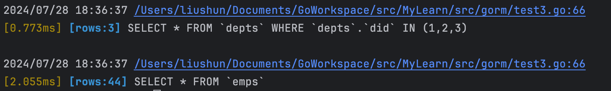
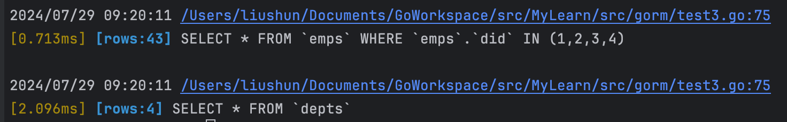
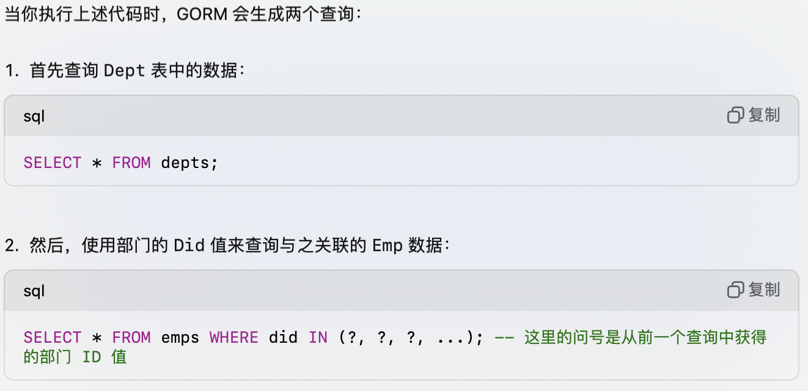
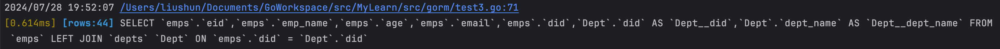
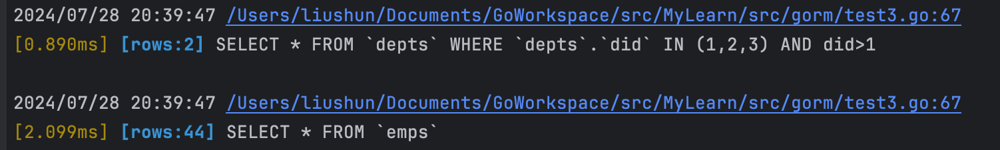
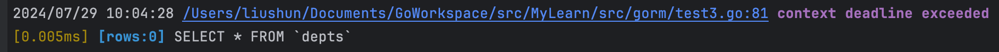

# GORM-2

## 关联篇

### Belongs to

`belongs to` 会与另一个模型建立了一对一的连接。 这种模型的每一个实例都“属于”另一个模型的一个实例。

例如，应用包含 user 和 company，并且每个 user 能且只能被分配给一个 company。下面的类型就表示这种关系。 注意，在 `User` 对象中，有一个和 `Company` 一样的 `CompanyID`。 默认情况下， `CompanyID` 被隐含地用来在 `User` 和 `Company` 之间创建一个外键关系， 因此必须包含在 `User` 结构体中才能填充 `Company` 内部结构体。

```go
// `User` 属于 `Company`，`CompanyID` 是外键
type User struct {
  gorm.Model
  Name      string
  CompanyID int
  Company   Company
}

type Company struct {
  ID   int
  Name string
}
```


#### 重写外键

要定义一个 belongs to 关系，数据库的表中必须存在外键。**默认情况下，外键的名字，使用拥有者的类型名称加上表的主键的字段名字**

例如，定义一个User实体属于Company实体，那么外键的名字一般使用CompanyID。

GORM同时提供自定义外键名字的方式，如下例所示。

```go
type User struct {
  gorm.Model
  Name         string
  CompanyRefer int
  Company      Company `gorm:"foreignKey:CompanyRefer"`
  // 使用 CompanyRefer 作为外键
}

type Company struct {
  ID   int
  Name string
}
```


#### 重写引用

对于 belongs to 关系，GORM 通常使用数据库表，**主表（拥有者）的主键值作为外键参考**。 

如果设置了User实体属于Company实体，那么GORM会自动把Company中的`ID`属性保存到User的`CompanyID`属性中。

同样的，也可以使用标签 `references` 来更改它，例如：

```
type User struct {
  gorm.Model
  Name      string
  CompanyID string
  Company   Company `gorm:"references:Code"` // 使用 Code 作为引用
}

type Company struct {
  ID   int
  Code string
  Name string
}
```

> **NOTE** 如果外键名恰好在拥有者类型中存在，GORM 通常会错误的认为它是 `has one` 关系。我们需要在 `belongs to` 关系中指定 `references`

```
type User struct {
  gorm.Model
  Name      string
  CompanyID string
  Company   Company `gorm:"references:CompanyID"` // 使用 Company.CompanyID 作为引用
}

type Company struct {
  CompanyID   int
  Code        string
  Name        string
}
```


### Has One

`has one` 与另一个模型建立一对一的关联，但它和一对一关系有些许不同。 这种关联表明一个模型的每个实例都包含或拥有另一个模型的一个实例。

> 注意和 Belongs to 的细微区分，Belongs to 除了有一个实体外，还要包含一个外键字段，是他主动去关联到别人
>
> 而 Has One 则是只有一个实体，然后是别人有一个外键，是别人来关联到自己

例如，您的应用包含 user 和 credit card 模型，且每个 user 只能有一张 credit card。

```
// User 有一张 CreditCard，UserID 是外键
type User struct {
  gorm.Model
  CreditCard CreditCard
}

type CreditCard struct {
  gorm.Model
  Number string
  UserID uint
}
```


#### 检索

```go
// 检索用户列表并预加载信用卡
func GetAll(db *gorm.DB) ([]User, error) {
    var users []User
    err := db.Model(&User{}).Preload("CreditCard").Find(&users).Error
    return users, err
}
```


#### 重写外键

对于 `has one` 关系，同样必须存在外键字段。拥有者将把属于它的模型的主键保存到这个字段。

这个字段的名称通常由 `has one` 模型的类型加上其 `主键` 生成，对于上面的例子，它是 `UserID`。

为 user 添加 credit card 时，它会将 user 的 `ID` 保存到自己的 `UserID` 字段。可以使用标签 `foreignKey` 来更改它，例如：

> 这里改的是：他原本会使用 User 中的 ID 来填充 UserID 字段，现在是他会使用 User 的 ID 来填充自己的 UserName 字段

```go
type User struct {
  gorm.Model
  CreditCard CreditCard `gorm:"foreignKey:UserName"` // 使用 UserName 作为外键
}

type CreditCard struct {
  gorm.Model
  Number   string
  UserName string
}
```


#### 重写引用

默认情况下，拥有者实体会将 `has one` 对应模型的主键保存为外键，也可以修改用另一个字段来保存，使用标签 `references` 来更改

> 而这里改的是：他原来使用 User 的 Id 来填充自己的 UserName 字段，现在是使用 User 的 Name 字段来填充 UserName 字段
>
> ==仔细品品这个和上面重写外键的区别：针对 creditCard 的角度，外键是去填充自己哪个，引用是我拿哪个来填充==

```go
type User struct {
  gorm.Model
  Name       string     `gorm:"index"`
  CreditCard CreditCard `gorm:"foreignKey:UserName;references:Name"`
}

type CreditCard struct {
  gorm.Model
  Number   string
  UserName string
}
```

#### 自引用 Has One

这尼玛感觉又像是 belongs to 了，好抽象

```go
type User struct {
  gorm.Model
  Name      string
  ManagerID *uint
  Manager   *User
}
```


### Has Many

`has many` 与另一个模型建立了一对多的连接。 不同于 `has one`，拥有者可以有零或多个关联模型。

例如，应用包含 user 和 credit card 模型，且每个 user 可以有多张 credit card。

```go
// User 有多张 CreditCard，UserID 是外键
type User struct {
  gorm.Model
  CreditCards []CreditCard
}

type CreditCard struct {
  gorm.Model
  Number string
  UserID uint
}
```

#### 检索

```go
// 检索用户列表并预加载信用卡
func GetAll(db *gorm.DB) ([]User, error) {
    var users []User
    err := db.Model(&User{}).Preload("CreditCards").Find(&users).Error
    return users, err
}
```

#### 重写外键

这里和上面的Has One 差不多

要定义 `has many` 关系，同样必须存在外键。 默认的外键名是拥有者的类型名加上其主键字段名

例如，要定义一个属于 `User` 的模型，则其外键应该是 `UserID`。

此外，想要使用另一个字段作为外键，可以使用 `foreignKey` 标签自定义它：

```
type User struct {
  gorm.Model
  CreditCards []CreditCard `gorm:"foreignKey:UserRefer"`
}

type CreditCard struct {
  gorm.Model
  Number    string
  UserRefer uint
}
```

#### 重写引用

GORM 通常使用拥有者的主键作为外键的值。 对于上面的例子，它是 `User` 的 `ID` 字段。

为 user 添加 credit card 时，GORM 会将 user 的 `ID` 字段保存到 credit card 的 `UserID` 字段。

同样的，也可以使用标签 `references` 来更改它，例如：

```
type User struct {
  gorm.Model
  MemberNumber string
  CreditCards  []CreditCard `gorm:"foreignKey:UserNumber;references:MemberNumber"`
}

type CreditCard struct {
  gorm.Model
  Number     string
  UserNumber string
}
```


#### 自引用 Has Many

```go
type User struct {
  gorm.Model
  Name      string
  ManagerID *uint
  Team      []User `gorm:"foreignkey:ManagerID"`
}
```


### Many to Many

Many to Many 会在两个 model 中添加一张连接表。

例如，应用包含了 user 和 language，且一个 user 可以说多种 language，多个 user 也可以说一种 language。

```go
// User 拥有并属于多种 language，`user_languages` 是连接表
type User struct {
  gorm.Model
  Languages []Language `gorm:"many2many:user_languages;"`
}

type Language struct {
  gorm.Model
  Name string
}
```

当使用 GORM 的 `AutoMigrate` 为 `User` 创建表时，GORM 会自动创建连接表

连接表的外键关系，对于 `many2many` 关系，连接表会同时拥有两个模型的外键

```
// 	连接表：user_languages
//   foreign key: user_id, reference: users.id
//   foreign key: language_id, reference: languages.id
```

#### 反向引用

```go
// User 拥有并属于多种 language，`user_languages` 是连接表
type User struct {
  gorm.Model
  Languages []*Language `gorm:"many2many:user_languages;"`
}

type Language struct {
  gorm.Model
  Name string
  Users []*User `gorm:"many2many:user_languages;"`
}
```

#### 检索

```go
// 检索 User 列表并预加载 Language
func GetAllUsers(db *gorm.DB) ([]User, error) {
    var users []User
    err := db.Model(&User{}).Preload("Languages").Find(&users).Error
    return users, err
}

// 检索 Language 列表并预加载 User
func GetAllLanguages(db *gorm.DB) ([]Language, error) {
    var languages []Language
    err := db.Model(&Language{}).Preload("Users").Find(&languages).Error
    return languages, err
}
```


#### 重写外键

这尼玛外键有点复杂，重写的话，有四个可选项，跟个绕弯子似得，好抽象，这设计真的有点抽象

若要重写它们，可以使用标签 `foreignKey`、`references`、`joinforeignKey`、`joinReferences`。

```go
type User struct {
    gorm.Model
    Profiles []Profile `gorm:"many2many:user_profiles;foreignKey:Refer;joinForeignKey:UserReferID;References:UserRefer;joinReferences:ProfileRefer"`
    Refer    uint      `gorm:"index:,unique"`
}

type Profile struct {
    gorm.Model
    Name      string
    UserRefer uint `gorm:"index:,unique"`
}

// 会创建连接表：user_profiles
//   foreign key: user_refer_id, reference: users.refer
//   foreign key: profile_refer, reference: profiles.user_refer
```

> **注意：** 某些数据库只允许在唯一索引字段上创建外键，如果您在迁移时会创建外键，则需要指定 `unique index` 标签。


#### 自引用

自引用 many2many 关系，这玩意更抽象了

```go
type User struct {
  gorm.Model
    Friends []*User `gorm:"many2many:user_friends"`
}

// 会创建连接表：user_friends
//   foreign key: user_id, reference: users.id
//   foreign key: friend_id, reference: users.id
```


### 预加载

#### Preload

GORM允许使用 `Preload`通过多个SQL中来直接加载关系

> Has One

```go
type Emp struct {
	Eid     int `gorm:"primaryKey"`
	EmpName string
	Age     int
	Email   string
	Did     int
	Dept    Dept `gorm:"foreignKey:Did;references:Did"`
}

type Dept struct {
	Did      int `gorm:"primaryKey"`
	DeptName string
}

db.Preload("Dept").Find(&results)
```



**可以看到他执行了两个 sql，并且很疑惑的是，他咋知道 emps 中的外键只用到了 1,2,3 的，很是离谱。**

> Has Many

```go
type Emp struct {
    Eid     int `gorm:"primaryKey"`
    EmpName string
    Age     int
    Email   string
    Did     int
    //Dept    Dept `gorm:"foreignKey:Did;references:Did"`
}

type Dept struct {
    Did      int `gorm:"primaryKey"`
    DeptName string
    Emps     []Emp `gorm:"foreignKey:Did;references:Did"`
}

var results []Dept
db.Preload("Emps").Find(&results)
```

==注意：Preload 里放的是 struct 中关联的字段的名字，如 Emps，和上面的 Dept，不是数据库中的表名啥的==

同样也有点迷惑，他为啥知道要 IN (1,2,3,4)




这是 chatgpt 的解释



所以他 sql 执行的顺序并不是日志打印的顺序。真是有点误导人。


#### Joins 预加载

`Preload` 是按照各种结构体中定义的关联形式进行数据预加载，而 joins 则是按照左连接的方式进行数据预加载的。

```go
db.Joins("Dept").Find(&results)
// 带条件的 join
db.Joins("Company", DB.Where(&Company{Alive: true})).Find(&users)
// SELECT `users`.`id`,`users`.`name`,`users`.`age`,`Company`.`id` AS `Company__id`,`Company`.`name` AS `Company__name` FROM `users` LEFT JOIN `companies` AS `Company` ON `users`.`company_id` = `Company`.`id` AND `Company`.`alive` = true;
```



> `Join Preload` works with one-to-one relation, e.g: `has one`, `belongs to`
>
> db.Joins("Emps").Find(&results)这样会报错。panic: reflect: call of reflect.Value.Field on slice Value
>
> 根据报错信息可以推断，他底层应该是使用的反射去拿到 join 的字段，这个字段应该是要是一个结构体，因为他底层源码中需要遍历这个字段的所有属性，这就意味着关联的关系必须是单个结构体，不能是一个 slice。


#### 预加载全部

可以使用 clause.Associations来代替多个 Preload 的连续使用实现多种关系的一次性预加载

`clause.Associations` can work with `Preload` similar like `Select` when creating/updating, you can use it to `Preload` all associations, for example:

```go
type User struct {
  gorm.Model
  Name       string
  CompanyID  uint
  Company    Company
  Role       Role
  Orders     []Order
}

db.Preload(clause.Associations).Find(&users)
```

`clause.Associations` won’t preload nested associations, but you can use it with [Nested Preloading](https://gorm.io/zh_CN/docs/preload.html#nested_preloading) together, e.g:

```go
db.Preload("Orders.OrderItems.Product").Preload(clause.Associations).Find(&users)
```


#### 条件预加载

```go
// Preload Orders with conditions
db.Preload("Orders", "state NOT IN (?)", "cancelled").Find(&users)
// SELECT * FROM users;
// SELECT * FROM orders WHERE user_id IN (1,2,3,4) AND state NOT IN ('cancelled');
db.Where("state = ?", "active").Preload("Orders", "state NOT IN (?)", "cancelled").Find(&users)
// SELECT * FROM users WHERE state = 'active';
// SELECT * FROM orders WHERE user_id IN (1,2) AND state NOT IN ('cancelled');
```

具体实例：

```go
db.Preload("Dept", "did>?", 1).Find(&results)
```



这种情况下，不会预加载 did 等于 1 的数据，这样在查询的 emps 中，原本应该填充 did=1 的数据，会查不出来，也就是都会被零值填充。现在是这样`{1 zhangsan 10 111@qq.com 1 {0 } } `，之前才出来是这样的`{1 zhangsan 10 111@qq.com 1 {1 a} } `


#### 自定义预加载 SQL

```go
db.Preload("Orders", func(db *gorm.DB) *gorm.DB {
  return db.Order("orders.amount DESC")
}).Find(&users)
// SELECT * FROM users;
// SELECT * FROM orders WHERE user_id IN (1,2,3,4) order by orders.amount DESC;
```


#### 嵌套预加载

对于嵌套的结构体的预加载，采用`.`的方式进行

```go
db.Preload("Orders.OrderItems.Product").Preload("CreditCard").Find(&users)

// Customize Preload conditions for `Orders`
// And GORM won't preload unmatched order's OrderItems then
// 这的意思应该是对于 state 不满足的 orders，他的嵌套预加载也不会进行了
db.Preload("Orders", "state = ?", "paid").Preload("Orders.OrderItems").Find(&users)
```

==`Embedded Preload` only works with `belongs to` relation==，Values of other relations are the same in database, we can’t distinguish them. 注意只是针对嵌套预加载。


## Context

其他上下文的用法没太懂有啥用，插个眼

### 超时上下文

```go
ctx, cancel := context.WithTimeout(context.Background(), 2*time.Second)
defer cancel()
db.WithContext(ctx).Find(&users)

ctx, _ := context.WithTimeout(context.Background(), 1*time.Nanosecond)
db.WithContext(ctx).Find(&results)
```



超时会 log 提示，然后查询出来的 row 为 0.


## 错误处理

在Go语言的应用开发中，特别是在使用GORM与数据库交互时，有效的错误处理是构建稳健应用的基石。 GORM对错误处理的方法，受到其可链式API的影响，需要细致地理解。

### 基本错误处理

GORM将错误处理集成到其可链式方法语法中。 `*gorm.DB`实例包含一个`Error`字段，当发生错误时会被设置。 通常的做法是在执行数据库操作后，特别是在[完成方法（Finisher Methods）](https://gorm.io/zh_CN/docs/method_chaining.html#finisher_method)后，检查这个字段。

在一系列方法之后，检查`Error`字段是至关重要的：

```go
if err := db.Where("name = ?", "jinzhu").First(&user).Error; err != nil {
  // 处理错误...
}
```

或者

```go
if result := db.Where("name = ?", "jinzhu").First(&user); result.Error != nil {
  // 处理错误...
}
```

> 具体错误处理：
>
> ErrRecordNotFound 记录未找到

```go
err := db.First(&user, 100).Error
if errors.Is(err, gorm.ErrRecordNotFound) {  // 处理未找到记录的错误...}
```


## 链式方法

GORM organizes methods into three primary categories: `Chain Methods`, `Finisher Methods`, and `New Session Methods`.

Chain methods are used to modify or append `Clauses` to the current `Statement`. Some common chain methods include:

- `Where`
- `Select`
- `Omit`
- `Joins`
- `Scopes`
- `Preload`
- `Raw`（原生 SQL） (Note: `Raw` cannot be used in conjunction with other chainable methods to build SQL)

Finisher methods are immediate, executing registered callbacks that generate and run SQL commands. This category includes methods:

- `Create`
- `First`
- `Find`
- `Take`
- `Save`
- `Update`
- `Delete`
- `Scan`
- `Row`
- `Rows`

GORM defines methods like `Session`, `WithContext`, and `Debug` as New Session Methods, which are essential for creating shareable and reusable `*gorm.DB` instances.

链式操作会造成 db 对象的不安全使用问题，大概意思就是一个 db 对象不要连续使用，否则前一次的使用会对后一次使用产生影响。他的上下文会被重用。

此外，[Session](https://gorm.io/zh_CN/docs/session.html) 提供了很多可以定制化的方案，如自定义日志，禁用默认事务，是否允许全局更新，预编译，跳过钩子函数等等


## Hook

### 对象生命周期

Hook 是在创建、查询、更新、删除等操作之前、之后调用的函数。

如果已经为模型定义了指定的方法，它会在创建、更新、查询、删除时自动被调用。如果任何回调返回错误，GORM 将停止后续的操作并回滚事务。

钩子方法的函数签名应该是 **`func(*gorm.DB) error`**


### 创建hook

创建时可用的 hook

```
// 开始事务
BeforeSave
BeforeCreate
// 关联前的 save
// 插入记录至 db
// 关联后的 save
AfterCreate
AfterSave
// 提交或回滚事务
```

示例

```go
func (u *User) BeforeCreate(tx *gorm.DB) (err error) {
  u.UUID = uuid.New()
  if !u.IsValid() {
    err = errors.New("can't save invalid data")
  }
  return
}

func (u *User) AfterCreate(tx *gorm.DB) (err error) {
  if u.ID == 1 {
    tx.Model(u).Update("role", "admin")
  }
  return
}
```

**注意** 在 GORM 中保存、删除操作会默认运行在事务上， 因此在事务完成之前该事务中所作的更改是不可见的，如果钩子返回了任何错误，则修改将被回滚。也可以看到，提交和回滚事务是在所有钩子都执行完之后才发生的。

### 更新 hook

和创建 hook 类似

```
// 开始事务
BeforeSave
BeforeUpdate
// 关联前的 save
// 更新 db
// 关联后的 save
AfterUpdate
AfterSave
// 提交或回滚事务
```

### 删除 hook

```
// 开始事务
BeforeDelete
// 删除 db 中的数据
AfterDelete
// 提交或回滚事务
```

### 查询 hook

```
// 从 db 中加载数据
// Preloading (eager loading)
AfterFind
```

代码示例：

```go
func (u *User) AfterFind(tx *gorm.DB) (err error) {
  if u.MemberShip == "" {
    u.MemberShip = "user"
  }
  return
}
```

### 修改当前执行

可以在执行之前的 hook 中使用 statement 修改当前执行的 sql 语句。

```go
func (u *User) BeforeCreate(tx *gorm.DB) error {
  // 通过 tx.Statement 修改当前操作，例如：
  tx.Statement.Select("Name", "Age")
  tx.Statement.AddClause(clause.OnConflict{DoNothing: true})

  // tx 是带有 `NewDB` 选项的新会话模式 
  // 基于 tx 的操作会在同一个事务中，但不会带上任何当前的条件
  err := tx.First(&role, "name = ?", user.Role).Error
  // SELECT * FROM roles WHERE name = "admin"
  // ...
  return err
}
```


## 事务

### 默认事务

为了确保数据一致性，GORM 会在事务里执行写入操作（创建、更新、删除）。如果没有这方面的要求，您可以在初始化时禁用它，这将获得大约 30%+ 性能提升。默认就具有事务规则。

可以通过一下操作禁用默认事务

```go
// 全局禁用
db, err := gorm.Open(sqlite.Open("gorm.db"), &gorm.Config{
  SkipDefaultTransaction: true,
})

// 持续会话模式
tx := db.Session(&Session{SkipDefaultTransaction: true})
tx.First(&user, 1)
tx.Find(&users)
tx.Model(&user).Update("Age", 18)
```


### db.Transaction

通过该方法传入一个函数，可以实现事务操作。返回 nil 则提交事务，返回一个错误则回滚事务。

```go
db.Transaction(func(tx *gorm.DB) error {
  // 在事务中执行一些 db 操作（从这里开始，您应该使用 'tx' 而不是 'db'）
  if err := tx.Create(&Animal{Name: "Giraffe"}).Error; err != nil {
    // 返回任何错误都会回滚事务
    return err
  }

  if err := tx.Create(&Animal{Name: "Lion"}).Error; err != nil {
    return err
  }

  // 返回 nil 提交事务
  return nil
})
```

> 嵌套事务

GORM 支持嵌套事务，可以回滚较大事务内执行的一部分操作，例如：

```go
db.Transaction(func(tx *gorm.DB) error {
  tx.Create(&user1)

  tx.Transaction(func(tx2 *gorm.DB) error {
    tx2.Create(&user2)
    return errors.New("rollback user2") // Rollback user2
  })

  tx.Transaction(func(tx3 *gorm.DB) error {
    tx3.Create(&user3)
    return nil
  })

  return nil
})
// Commit user1, user3
```


### 手动事务

还可以手动控制事务的提交，回滚等。不依托 api 的默认实现

Gorm 支持直接调用事务控制方法（commit、rollback），例如：

```go
// 开始事务
tx := db.Begin()

// 在事务中执行一些 db 操作（从这里开始，您应该使用 'tx' 而不是 'db'）
tx.Create(...)

// ...

// 遇到错误时回滚事务
tx.Rollback()

// 否则，提交事务
tx.Commit()
```

一个样例

```go
func CreateAnimals(db *gorm.DB) error {
  tx := db.Begin()
  defer func() { // 确保错误处理
    if r := recover(); r != nil {
      tx.Rollback()
    }
  }()

  if err := tx.Error; err != nil {
    return err
  }

  if err := tx.Create(&Animal{Name: "Giraffe"}).Error; err != nil {
     tx.Rollback()
     return err
  }

  if err := tx.Create(&Animal{Name: "Lion"}).Error; err != nil {
     tx.Rollback()
     return err
  }

  return tx.Commit().Error
}
```

GORM 提供了 `SavePoint`、`Rollbackto` 方法，来提供保存点以及回滚至保存点功能，例如：

```go
tx := db.Begin()
tx.Create(&user1)

tx.SavePoint("sp1")
tx.Create(&user2)
tx.RollbackTo("sp1") // Rollback user2

tx.Commit() // Commit user1
```


## 日志

Gorm 有一个 [默认 logger 实现](https://github.com/go-gorm/gorm/blob/master/logger/logger.go)，默认情况下，它会打印慢 SQL 和错误

Logger 接受的选项不多，您可以在初始化时自定义它，例如：

```go
newLogger := logger.New(
  log.New(os.Stdout, "\r\n", log.LstdFlags), // io writer
  logger.Config{
    SlowThreshold:              time.Second,   // Slow SQL threshold
    LogLevel:                   logger.Silent, // Log level
    IgnoreRecordNotFoundError: true,           // Ignore ErrRecordNotFound error for logger
    ParameterizedQueries:      true,           // Don't include params in the SQL log
    Colorful:                  false,          // Disable color
  },
)

// Globally mode
db, err := gorm.Open(sqlite.Open("test.db"), &gorm.Config{
  Logger: newLogger,
})

// Continuous session mode
tx := db.Session(&Session{Logger: newLogger})
tx.First(&user)
tx.Model(&user).Update("Age", 18)
```

> 日志级别

GORM 定义了这些日志级别：`Silent`、`Error`、`Warn`、`Info`

```go
db, err := gorm.Open(sqlite.Open("test.db"), &gorm.Config{
  Logger: logger.Default.LogMode(logger.Silent), // 默认为 silent，执行失败或者长操作时会打印
}) // 可以设置为 info 级别，就可以观察执行了那些 sql
```

> Debug

Debug 单个操作，将当前操作的 log 级别调整为 logger.Info

```go
db.Debug().Where("name = ?", "jinzhu").First(&User{})
```


## Scopes 作用域

### 复用

作用域允许复用通用的逻辑，这种共享逻辑需要定义为类型`func(*gorm.DB) *gorm.DB`。

通过两层函数可以实现参数的传递

这得益于链式调用

```go
func AmountGreaterThan1000(db *gorm.DB) *gorm.DB {
  return db.Where("amount > ?", 1000)
}

func PaidWithCreditCard(db *gorm.DB) *gorm.DB {
  return db.Where("pay_mode_sign = ?", "C")
}

func PaidWithCod(db *gorm.DB) *gorm.DB {
  return db.Where("pay_mode_sign = ?", "C")
}

func OrderStatus(status []string) func (db *gorm.DB) *gorm.DB {
  return func (db *gorm.DB) *gorm.DB {
    return db.Where("status IN (?)", status)
  }
}

db.Scopes(AmountGreaterThan1000, PaidWithCreditCard).Find(&orders)
// 查找所有金额大于 1000 的信用卡订单

db.Scopes(AmountGreaterThan1000, PaidWithCod).Find(&orders)
// 查找所有金额大于 1000 的 COD 订单

db.Scopes(AmountGreaterThan1000, OrderStatus([]string{"paid", "shipped"})).Find(&orders)
// 查找所有金额大于1000 的已付款或已发货订单
```


### 分页

可以通过scope 来实现统一的分页逻辑

```go
func Paginate(r *http.Request) func(db *gorm.DB) *gorm.DB {
  return func (db *gorm.DB) *gorm.DB {
    q := r.URL.Query()
    page, _ := strconv.Atoi(q.Get("page"))
    if page <= 0 {
      page = 1
    }

    pageSize, _ := strconv.Atoi(q.Get("page_size"))
    switch {
    case pageSize > 100:
      pageSize = 100
    case pageSize <= 0:
      pageSize = 10
    }

    offset := (page - 1) * pageSize
    return db.Offset(offset).Limit(pageSize)
  }
}

db.Scopes(Paginate(r)).Find(&users)
db.Scopes(Paginate(r)).Find(&articles)
```


