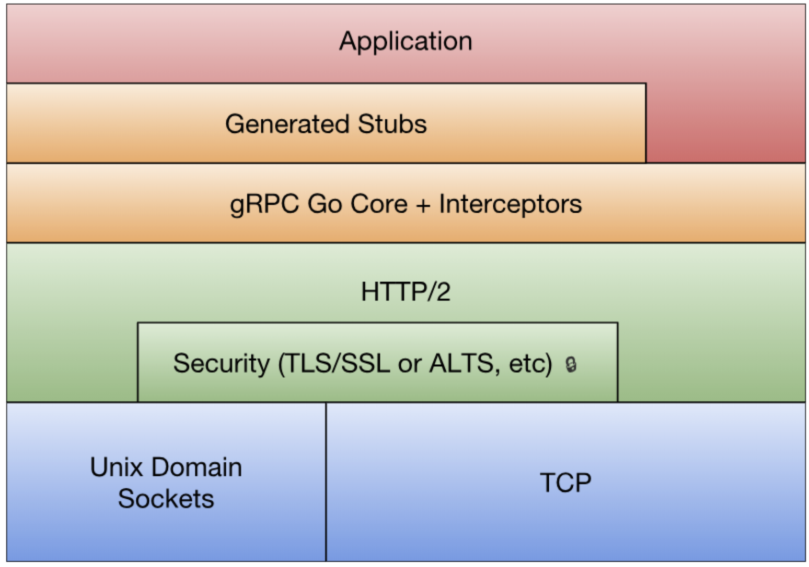
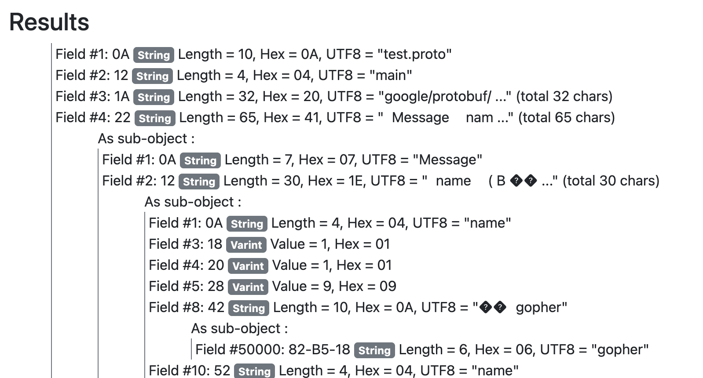
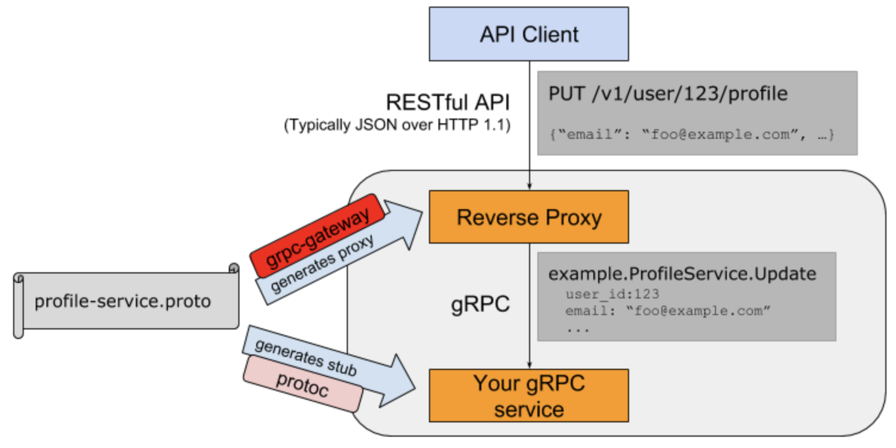

# Go-RPC

RPC是远程过程调用的缩写（Remote Procedure Call），通俗地说就是调用远处的一个函数。远处到底有多远呢？可能是同一个文件内的不同函数，也可能是同一个机器的另一个进程的函数，还可能是远在火星好奇号上面的某个秘密方法。因为RPC涉及的函数可能非常之远，远到它们之间说着完全不同的语言，语言就成了两边的沟通障碍。而Protobuf因为支持多种不同的语言（甚至不支持的语言也可以扩展支持），其本身特性也非常方便描述服务的接口（也就是方法列表），因此非常适合作为RPC世界的接口交流语言。


## RPC 入门

RPC是远程过程调用的简称，是分布式系统中不同节点间流行的通信方式。


### RPC版 hello world

Go语言的RPC包的路径为net/rpc，也就是放在了net包目录下面。先构造一个HelloService类型，其中的Hello方法用于实现打印功能：

```go
type HelloService struct {}

func (p *HelloService) Hello(request string, reply *string) error {
    *reply = "hello:" + request
    return nil
}
```

其中Hello方法必须满足Go语言的RPC规则：**==方法只能有两个可序列化的参数，其中第二个参数是指针类型，并且返回一个error类型，同时必须是公开的方法。==**

然后就可以将HelloService类型的对象注册为一个RPC服务：

```go
func main() {
    rpc.RegisterName("HelloService", new(HelloService))

    listener, err := net.Listen("tcp", ":1234")
    if err != nil {
        log.Fatal("ListenTCP error:", err)
    }

    conn, err := listener.Accept()
    if err != nil {
        log.Fatal("Accept error:", err)
    }
    rpc.ServeConn(conn)
}
```

其中**rpc.Register函数调用会将对象类型中所有满足RPC规则的对象方法注册为RPC函数，所有注册的方法会放在“HelloService”服务空间之下**。然后建立一个唯一的TCP链接，并且通过rpc.ServeConn函数在该TCP链接上为对方提供RPC服务。

下面是客户端请求HelloService服务的代码：

```go
func main() {
    client, err := rpc.Dial("tcp", "localhost:1234")
    if err != nil {
        log.Fatal("dialing:", err)
    }

    var reply string
    err = client.Call("HelloService.Hello", "hello", &reply)
    if err != nil {
        log.Fatal(err)
    }

    fmt.Println(reply)
}
// liushun@liushun rpc % go run HelloClient.go 
// hello:hello
```

首先是通过rpc.Dial拨号RPC服务，然后通过client.Call调用具体的RPC方法。在调用client.Call时，**第一个参数是用点号链接的RPC服务名字和方法名字，第二和第三个参数分别我们定义RPC方法的两个参数。**


### 更安全的RPC接口

在涉及RPC的应用中，作为开发人员一般至少有三种角色：**首先是服务端实现RPC方法的开发人员，其次是客户端调用RPC方法的人员，最后也是最重要的是制定服务端和客户端RPC接口规范的设计人员**。在前面的例子中为了简化将以上几种角色的工作全部放到了一起，虽然看似实现简单，但是不利于后期的维护和工作的切割。

如果要重构HelloService服务，第一步需要明确服务的名字和接口：

```go
const HelloServiceName = "path/to/pkg.HelloService"

type HelloServiceInterface = interface {
    Hello(request string, reply *string) error
}

func RegisterHelloService(svc HelloServiceInterface) error {
    return rpc.RegisterName(HelloServiceName, svc)
}
```

将RPC服务的接口规范分为三个部分：**首先是服务的名字，然后是服务要实现的详细方法列表，最后是注册该类型服务的函数**。为了避免名字冲突，我们在RPC服务的名字中增加了包路径前缀（这个是RPC服务抽象的包路径，并非完全等价Go语言的包路径）。RegisterHelloService注册服务时，编译器会要求传入的对象满足HelloServiceInterface接口。

在定义了RPC服务接口规范之后，客户端就可以根据规范编写RPC调用的代码了：

```go
err = client.Call(HelloServiceName+".Hello", "hello", &reply)
```

其中唯一的变化是client.Call的第一个参数用HelloServiceName+".Hello"代替了"HelloService.Hello"。然而通过client.Call函数调用RPC方法依然比较繁琐，同时参数的类型依然无法得到编译器提供的安全保障。

为了简化客户端用户调用RPC函数，可以在接口规范部分增加对客户端的简单包装：

```go
type HelloServiceClient struct {
    *rpc.Client
}

// 这行代码的作用是为了保证 HelloServiceClient 实现了 HelloServiceInterface 接口，在编译期间保证
var _ HelloServiceInterface = (*HelloServiceClient)(nil)

func DialHelloService(network, address string) (*HelloServiceClient, error) {
    c, err := rpc.Dial(network, address)
    if err != nil {
        return nil, err
    }
    return &HelloServiceClient{Client: c}, nil
}

func (p *HelloServiceClient) Hello(request string, reply *string) error {
    return p.Client.Call(HelloServiceName+".Hello", request, reply)
}
```

在接口规范中针对客户端新增加了HelloServiceClient类型，该类型也必须满足HelloServiceInterface接口，这样客户端用户就可以直接通过接口对应的方法调用RPC函数。同时提供了一个DialHelloService方法，直接拨号HelloService服务。

基于新的客户端接口，简化客户端用户的代码：

```go
func main() {
    client, err := DialHelloService("tcp", "localhost:1234")
    //...
    var reply string
    err = client.Hello("hello", &reply)
    // ...
}
```

现在客户端用户不用再担心RPC方法名字或参数类型不匹配等低级错误的发生。

最后是基于RPC接口规范编写真实的服务端代码：

```go
type HelloService struct {}

func (p *HelloService) Hello(request string, reply *string) error {
    *reply = "hello:" + request
    return nil
}

func main() {
    RegisterHelloService(new(HelloService))

    listener, err := net.Listen("tcp", ":1234")
    if err != nil {
        log.Fatal("ListenTCP error:", err)
    }

    for { // 循环监听
        conn, err := listener.Accept()
        if err != nil {
            log.Fatal("Accept error:", err)
        }
      // 创建 goroutine
        go rpc.ServeConn(conn)
    }
}
```

在新的RPC服务端实现中，用RegisterHelloService函数来注册函数，这样不仅可以避免命名服务名称的工作，同时也保证了传入的服务对象满足了RPC接口的定义。最后新的服务改为支持多个TCP链接，然后为每个TCP链接提供RPC服务。


### 跨语言的RPC

标准库的RPC默认采用Go语言特有的gob编码，因此从其它语言调用Go语言实现的RPC服务将比较困难。在互联网的微服务时代，每个RPC以及服务的使用者都可能采用不同的编程语言，因此跨语言是互联网时代RPC的一个首要条件。得益于RPC的框架设计，Go语言的RPC其实也是很容易实现跨语言支持的。

Go语言的RPC框架有两个比较有特色的设计：**一个是RPC数据打包时可以通过插件实现自定义的编码和解码**；另一个是**RPC建立在抽象的io.ReadWriteCloser接口之上的，可以将RPC架设在不同的通讯协议之上**。这里尝试通过官方自带的net/rpc/jsonrpc扩展实现一个跨语言的RPC。(这里其实就是将原本的使用 go 语言的消息编码系统，改成使用 json 消息格式进行通信。)

首先是基于json编码重新实现RPC服务：

```go
func main() {
    rpc.RegisterName("HelloService", new(HelloService))
    listener, err := net.Listen("tcp", ":1234")
    // handle error

    for {
        conn, err := listener.Accept()
        // handle error
        go rpc.ServeCodec(jsonrpc.NewServerCodec(conn))
    }
}
```

代码中**最大的变化是用rpc.ServeCodec函数替代了rpc.ServeConn函数，传入的参数是针对服务端的json编解码器**。

然后是实现json版本的客户端：

```go
func main() {
    conn, err := net.Dial("tcp", "localhost:1234")
    // handle error
    client := rpc.NewClientWithCodec(jsonrpc.NewClientCodec(conn))

    var reply string
    err = client.Call("HelloService.Hello", "hello", &reply)
    // handle error
    fmt.Println(reply)
}
```

先手工调用net.Dial函数建立TCP链接，然后**基于该链接建立针对客户端的json编解码器**。

在确保客户端可以正常调用RPC服务的方法之后，用一个普通的TCP服务代替Go语言版本的RPC服务，这样可以查看客户端调用时发送的数据格式。比如通过nc命令`nc -l 1234`在同样的端口启动一个TCP服务。然后再次执行一次RPC调用将会发现nc输出了以下的信息：

```json
{"method":"HelloService.Hello","params":["hello"],"id":0}
```

这是一个json编码的数据，其中method部分对应要调用的rpc服务和方法组合成的名字，params部分的第一个元素为参数，id是由调用端维护的一个唯一的调用编号。

请求的json数据对象在内部对应两个结构体：客户端是clientRequest，服务端是serverRequest。clientRequest和serverRequest结构体的内容基本是一致的：

```go
type clientRequest struct {
	Method string `json:"method"`
	Params [1]any `json:"params"`
	Id     uint64 `json:"id"`
}

type serverRequest struct {
	Method string           `json:"method"`
	Params *json.RawMessage `json:"params"`
	Id     *json.RawMessage `json:"id"`
}
```

在获取到RPC调用对应的json数据后，可以通过直接向架设了RPC服务的TCP服务器发送json数据模拟RPC方法调用：

```
$ echo -e '{"method":"HelloService.Hello","params":["hello"],"id":1}' | nc localhost 1234
1.	输出一个 JSON-RPC 请求字符串，-e 完成字符转义。
2.	通过管道将该字符串传递给 nc 命令，| 将前一个命令的输出作为后一个命令的输入。
3.	使用 nc 将请求发送到本地计算机的 1234 端口。
```

返回的结果也是一个json格式的数据：

```json
{"id":1,"result":"hello:hello","error":null}
```

其中id对应输入的id参数，result为返回的结果，error部分在出问题时表示错误信息。对于顺序调用来说，id不是必须的。但是Go语言的RPC框架支持异步调用，当返回结果的顺序和调用的顺序不一致时，可以通过id来识别对应的调用。

返回的json数据也是对应内部的两个结构体：客户端是clientResponse，服务端是serverResponse。两个结构体的内容同样也是类似的：

```go
type clientResponse struct {
	Id     uint64           `json:"id"`
	Result *json.RawMessage `json:"result"`
	Error  any              `json:"error"`
}

type serverResponse struct {
	Id     *json.RawMessage `json:"id"`
	Result any              `json:"result"`
	Error  any              `json:"error"`
}
```

因此无论采用何种语言，只要遵循同样的json结构，以同样的流程就可以和Go语言编写的RPC服务进行通信。这样就实现了跨语言的RPC。


### Http上的RPC

Go语言内在的RPC框架已经支持在Http协议上提供RPC服务。但是框架的http服务同样采用了内置的gob协议，并且没有提供采用其它协议的接口，因此从其它语言依然无法访问的。在前面的例子中，已经实现了在TCP协议之上运行jsonrpc服务，并且通过nc命令行工具成功实现了RPC方法调用。现在尝试在http协议上提供jsonrpc服务。

新的RPC服务其实是一个类似REST规范的接口，接收请求并采用相应处理流程：

```go
func main() {
    rpc.RegisterName("HelloService", new(HelloService))

  	// 设置处理器
    http.HandleFunc("/jsonrpc", func(w http.ResponseWriter, r *http.Request) {
        var conn io.ReadWriteCloser = struct {
            io.Writer
            io.ReadCloser
        }{
            ReadCloser: r.Body,
            Writer:     w,
        }
        rpc.ServeRequest(jsonrpc.NewServerCodec(conn))
    })

    http.ListenAndServe(":1234", nil)
}
```

RPC的服务架设在“/jsonrpc”路径，在处理函数中基于http.ResponseWriter和http.Request类型的参数构造一个io.ReadWriteCloser类型的conn通道。然后基于conn构建针对服务端的json编码解码器。最后通过rpc.ServeRequest函数为每次请求处理一次RPC方法调用。

模拟一次RPC调用的过程就是向该链接发送一个json字符串：

```
$ curl localhost:1234/jsonrpc -X POST --data '{"method":"HelloService.Hello","params":["hello"],"id":0}'
```

返回的结果依然是json字符串：

```json
{"id":0,"result":"hello:hello","error":null}
```

这样就可以很方便地从不同语言中访问RPC服务了。


## Protobuf

Protobuf是Protocol Buffers的简称，它是Google公司开发的一种数据描述语言，并于2008年对外开源。Protobuf刚开源时的定位类似于XML、JSON等数据描述语言，通过附带工具生成代码并实现将结构化数据序列化的功能，有proto.Marshal和 Unmarshal 方法。但是更关注的是Protobuf作为接口规范的描述语言，可以作为设计安全的跨语言PRC接口的基础工具。

```protobuf
service HelloService {
    rpc Hello (String) returns (String);
}
```

对于 protoc 中有 service 服务的情况，运行`protoc --go_out=. hello.proto`指令并不会对 service 进行处理，这是因为世界上的RPC实现有千万种，protoc编译器并不知道该如何为HelloService服务生成代码。其中`go_out`参数告知protoc编译器去加载对应的protoc-gen-go工具，然后通过该工具生成代码，生成代码放到当前目录。最后是一系列要处理的protobuf文件的列表。

不过在protoc-gen-go内部已经集成了一个名字为`grpc`的插件，可以针对gRPC生成代码：

```
$ protoc --go_out=plugins=grpc:. hello.proto
```

在生成的代码中多了一些类似HelloServiceServer、HelloServiceClient的新类型。这些类型是为gRPC服务的，并不符合上述的 RPC 要求。

> 不过gRPC插件提供了改进的思路，下面将探索如何为我们的RPC生成安全的代码。----> 自己写插件


### 定制代码生成器

> [!IMPORTANT]
>
> 不知道怎么定制的，麻了，以后[在看吧](https://chai2010.gitbooks.io/advanced-go-programming-book/content/ch4-rpc/ch4-03-netrpc-hack.html)

Protobuf的protoc编译器是通过插件机制实现对不同语言的支持。比如protoc命令出现`--xxx_out`格式的参数，那么protoc将首先查询是否有内置的xxx插件，如果没有内置的xxx插件那么将继续查询当前系统中是否存在protoc-gen-xxx命名的可执行程序，最终通过查询到的插件生成代码。对于Go语言的protoc-gen-go插件来说，里面又实现了一层静态插件系统。比如protoc-gen-go内置了一个gRPC插件，用户可以通过`--go_out=plugins=grpc`参数来生成gRPC相关代码，否则只会针对message生成相关代码。


## 玩转 RPC

在不同的场景中RPC有着不同的需求，因此开源的社区就诞生了各种RPC框架。这里尝试Go内置RPC框架在一些比较特殊场景的用法。

### 客户端 RPC 实现原理

Go语言的RPC库最简单的使用方式是通过`Client.Call`方法进行同步阻塞调用，该方法的实现如下：

```go
// Call invokes the named function, waits for it to complete, and returns its error status.
func (client *Client) Call(serviceMethod string, args any, reply any) error {
	call := <-client.Go(serviceMethod, args, reply, make(chan *Call, 1)).Done
	return call.Error
}
```

**首先通过`Client.Go`方法进行一次异步调用，返回一个表示这次调用的`Call`结构体。然后等待`Call`结构体的Done管道返回调用结果。**

也可以通过`Client.Go`方法异步调用前面的HelloService服务：

```go
func doClientWork(client *rpc.Client) {
	helloCall := client.Go("HelloService.Hello", "hello", new(string), nil) // 这里传 nil 会自动创建

	// do some thing

	helloCall = <-helloCall.Done
	if err := helloCall.Error; err != nil {
		log.Fatal(err)
	}

	args := helloCall.Args.(string)
	reply := helloCall.Reply.(*string)
	fmt.Println(args, *reply)
}
```

在异步调用命令发出后，一般会执行其他的任务，因此异步调用的输入参数和返回值可以通过返回的Call变量进行获取。

执行异步调用的`Client.Go`方法实现如下：

```go
func (client *Client) Go(serviceMethod string, args any, reply any, done chan *Call) *Call {
	call := new(Call)
	call.ServiceMethod = serviceMethod
	call.Args = args
	call.Reply = reply
	if done == nil {
		done = make(chan *Call, 10) // buffered.
	} else {
		// If caller passes done != nil, it must arrange that
		// done has enough buffer for the number of simultaneous
		// RPCs that will be using that channel. If the channel
		// is totally unbuffered, it's best not to run at all.
		if cap(done) == 0 {
			log.Panic("rpc: done channel is unbuffered")
		}
	}
	call.Done = done
	client.send(call)
	return call
}
```

首先是构造一个表示当前调用的call变量，然后通过`client.send`将call的完整参数发送到RPC框架。`client.send`方法调用是线程安全的，因此可以从多个Goroutine同时向同一个RPC链接发送调用指令。

当调用完成或者发生错误时，将调用`call.done`方法通知完成：

```go
func (call *Call) done() {
    select {
    case call.Done <- call:
        // ok
    default:
        // We don't want to block here. It is the caller's responsibility to make
        // sure the channel has enough buffer space. See comment in Go().
    }
}
```

从`Call.done`方法的实现可以得知`call.Done`管道会将处理后的call返回。

> 总的来说，就是通过管道机制，除法异步调用，在异步调用完成之后，将数据通过管道返回给客户端


### 基于RPC实现Watch功能

> [!NOTE] 
>
> **这里指的是服务端提供 watch 函数，客户端调用这个函数，服务端开启监控，但是这时候客户端会阻塞，直到服务端监听到了某个值变化，给客户端返回了某个值。**

在很多系统中都提供了Watch监视功能的接口，当系统满足某种条件时Watch方法返回监控的结果。在这里尝试通过RPC框架实现一个基本的Watch功能。如前文所描述，因为`client.send`是线程安全的，可以通过在不同的Goroutine中同时并发阻塞调用RPC方法。通过在一个独立的Goroutine中调用Watch函数进行监控。

为了便于演示，计划通过RPC构造一个简单的内存KV数据库。首先定义服务如下：

```go
type KVStoreService struct {
    m      map[string]string
    filter map[string]func(key string)
    mu     sync.Mutex
}

func NewKVStoreService() *KVStoreService {
    return &KVStoreService{
        m:      make(map[string]string),
        filter: make(map[string]func(key string)),
    }
}
```

其中`m`成员是一个map类型，用于存储KV数据。`filter`成员对应每个Watch调用时定义的过滤器函数列表。而`mu`成员为互斥锁，用于在多个Goroutine访问或修改时对其它成员提供保护。

然后就是Get和Set方法：

```go
func (p *KVStoreService) Get(key string, value *string) error {
    p.mu.Lock()
    defer p.mu.Unlock()

    if v, ok := p.m[key]; ok {
        *value = v
        return nil
    }

    return fmt.Errorf("not found")
}

func (p *KVStoreService) Set(kv [2]string, reply *struct{}) error {
    p.mu.Lock()
    defer p.mu.Unlock()

    key, value := kv[0], kv[1]

    if oldValue := p.m[key]; oldValue != value {
        for _, fn := range p.filter {
            fn(key)
        }
    }

    p.m[key] = value
    return nil
}
```

在Set方法中，输入参数是key和value组成的数组，用一个匿名的空结构体表示忽略了输出参数。当修改某个key对应的值时会调用每一个过滤器函数。

而过滤器列表在Watch方法中提供：

```go
func (p *KVStoreService) Watch(timeoutSecond int, keyChanged *string) error {
    id := fmt.Sprintf("watch-%s-%03d", time.Now(), rand.Int())
    ch := make(chan string, 10) // buffered

    p.mu.Lock()
    p.filter[id] = func(key string) { ch <- key }
    p.mu.Unlock()

    select {
    case <-time.After(time.Duration(timeoutSecond) * time.Second):
        return fmt.Errorf("timeout")
    case key := <-ch:
        *keyChanged = key
        return nil
    }

    return nil
}
```

Watch方法的输入参数是超时的秒数。当有key变化时将key作为返回值返回。如果超过时间后依然没有key被修改，则返回超时的错误。Watch的实现中，用唯一的id表示每个Watch调用，然后根据id将自身对应的过滤器函数注册到`p.filter`列表。

注册并启动KVStoreService服务。然后在客户端使用Watch方法：

```go
func doClientWork(client *rpc.Client) {
    go func() {
        var keyChanged string
      	// 这里会阻塞，直到调用 set 方法改变了某个 key。
        err := client.Call("KVStoreService.Watch", 30, &keyChanged)
        if err != nil {
            log.Fatal(err)
        }
        fmt.Println("watch:", keyChanged)
    } ()
  
  	// 在这里最好停一下，保证 Watch 一定在 Set 之前调用
  	time.Sleep(time.Second * 1)

    err := client.Call(
        "KVStoreService.Set", [2]string{"abc", "abc-value"},
        new(struct{}),
    )
    if err != nil {
        log.Fatal(err)
    }

    time.Sleep(time.Second*3)
}
```

首先启动一个独立的Goroutine监控key的变化。同步的watch调用会阻塞，直到有key发生变化或者超时。然后在通过Set方法修改KV值时，服务器会将变化的key通过Watch方法返回。这样就可以实现对某些状态的监控。


### 反向RPC

通常的RPC是基于C/S结构，RPC的服务端对应网络的服务器，RPC的客户端也对应网络客户端。但是对于一些特殊场景，比如在公司内网提供一个RPC服务，但是在外网无法链接到内网的服务器。这种时候可以参考类似反向代理的技术，首先从内网主动链接到外网的TCP服务器，然后基于TCP链接向外网提供RPC服务。

以下是启动反向RPC服务的代码：

```go
func main() {
    rpc.Register(new(HelloService))

  	// 反复去连接
    for {
     		// 充当客户端，去连接外网
        conn, _ := net.Dial("tcp", "localhost:1234")
        if conn == nil {
            time.Sleep(time.Second)
            continue
        }

        rpc.ServeConn(conn)
        conn.Close()
    }
}
```

反向RPC的内网服务将不再主动提供TCP监听服务，而是首先主动链接到对方的TCP服务器。然后基于每个建立的TCP链接向对方提供RPC服务。

而RPC客户端则需要在一个公共的地址提供一个TCP服务，用于接受RPC服务器的链接请求：

```go
func main() {
  	// 监听，等待客户端连接
    listener, err := net.Listen("tcp", ":1234")
    if err != nil {
        log.Fatal("ListenTCP error:", err)
    }

    clientChan := make(chan *rpc.Client)

    go func() {
        for {
            conn, err := listener.Accept()
            if err != nil {
                log.Fatal("Accept error:", err)
            }

            clientChan <- rpc.NewClient(conn)
        }
    }()

    doClientWork(clientChan)
}
```

当每个链接建立后，基于网络链接构造RPC客户端对象并发送到clientChan管道。

客户端执行RPC调用的操作在doClientWork函数完成：

```go
func doClientWork(clientChan <-chan *rpc.Client) {
    client := <-clientChan
    defer client.Close() // 调用完了之后，就会关闭当前程序，等下次需要再次调用 rpc 的服务时，需要重启进程

  	// 反过来去调用客户端的 rpc 服务
    var reply string
    err = client.Call("HelloService.Hello", "hello", &reply)
    if err != nil {
        log.Fatal(err)
    }

    fmt.Println(reply)
}
```

首先从管道去取一个RPC客户端对象，并且通过defer语句指定在函数退出前关闭客户端。然后是执行正常的RPC调用。


### 上下文信息

基于上下文可以针对不同客户端提供定制化的RPC服务。可以通过为每个链接提供独立的RPC服务来实现对上下文特性的支持。

首先改造HelloService，里面增加了对应链接的conn成员：

```go
type HelloService struct {
    conn    net.Conn
    isLogin bool
}

func (p *HelloService) Login(request string, reply *string) error {
    if request != "user:password" {
        return fmt.Errorf("auth failed")
    }
    log.Println("login ok")
    p.isLogin = true
    return nil
}

func (p *HelloService) Hello(request string, reply *string) error {
    if !p.isLogin {
        return fmt.Errorf("please login")
    }
    *reply = "hello:" + request + ", from" + p.conn.RemoteAddr().String()
    return nil
}
```

然后为每个链接启动独立的RPC服务：

```go
func main() {
    listener, err := net.Listen("tcp", ":1234")
    if err != nil {
        log.Fatal("ListenTCP error:", err)
    }

    for {
        conn, err := listener.Accept()
        if err != nil {
            log.Fatal("Accept error:", err)
        }

        go func() {
            defer conn.Close()

            p := rpc.NewServer()
            p.Register(&HelloService{conn: conn})
            p.ServeConn(conn)
        } ()
    }
}
```

这样可以要求在客户端链接RPC服务时，首先要执行登陆操作，登陆成功后才能正常执行其他的服务。

```go
// client
func main() {
	conn, err := net.Dial("tcp", "localhost:1234")
	if err != nil {
		log.Fatal("net.Dial:", err)
	}

	client := rpc.NewClient(conn)

	var reply string
	err = client.Call("HelloService.Login", "user:password", &reply)
	err = client.Call("HelloService.Hello", "user:password", &reply)

	if err != nil {
		log.Fatal(err)
	}

	fmt.Println(reply)
}
```


## gRPC入门

gRPC是Google公司基于Protobuf开发的跨语言的开源RPC框架。gRPC基于HTTP/2协议设计，可以基于一个HTTP/2链接提供多个服务，对于移动设备更加友好。



**最底层为TCP或Unix Socket协议，在此之上是HTTP/2协议的实现，然后在HTTP/2协议之上又构建了针对Go语言的gRPC核心库。应用程序通过gRPC插件生产的Stub代码和gRPC核心库通信，也可以直接和gRPC核心库通信。**


### 实践

如果从Protobuf的角度看，gRPC只不过是一个针对service接口生成代码的生成器。

创建hello.proto文件，定义HelloService接口：

```protobuf
syntax = "proto3";

package main;

// 高版本的 protoc-gen-go 需要指明包路径和包名
option go_package=".;test4";

message String {
    string value = 1;
}

service HelloService {
    rpc Hello (String) returns (String);
}
```

使用protoc-gen-go内置的gRPC插件生成gRPC代码：

```shell
protoc --go_out=plugins=grpc:. hello.proto
```

gRPC插件会为服务端和客户端生成不同的接口：

```go
// HelloServiceServer is the server API for HelloService service.
type HelloServiceServer interface {
	Hello(context.Context, *String) (*String, error)
}
// HelloServiceClient is the client API for HelloService service.
//
// For semantics around ctx use and closing/ending streaming RPCs, please refer to https://godoc.org/google.golang.org/grpc#ClientConn.NewStream.
type HelloServiceClient interface {
	Hello(ctx context.Context, in *String, opts ...grpc.CallOption) (*String, error)
}
```

gRPC通过context.Context参数，为每个方法调用提供了上下文支持。客户端在调用方法的时候，可以通过可选的grpc.CallOption类型的参数提供额外的上下文信息。

基于服务端的HelloServiceServer接口可以重新实现HelloService服务：

```go
type HelloServiceImpl struct{}

func (p *HelloServiceImpl) Hello(
    ctx context.Context, args *String,
) (*String, error) {
    reply := &String{Value: "hello:" + args.GetValue()}
    return reply, nil
}
```

gRPC服务的启动流程和标准库的RPC服务启动流程类似：

```go
func main() {
    grpcServer := grpc.NewServer()
    RegisterHelloServiceServer(grpcServer, new(HelloServiceImpl))

    lis, err := net.Listen("tcp", ":1234")
    if err != nil {
        log.Fatal(err)
    }
    grpcServer.Serve(lis)
}
```

首先是通过`grpc.NewServer()`构造一个gRPC服务对象，然后通过gRPC插件生成的RegisterHelloServiceServer函数注册实现的HelloServiceImpl服务。然后通过`grpcServer.Serve(lis)`在一个监听端口上提供gRPC服务。

然后就可以通过客户端链接gRPC服务了：

```go
func main() {
  // Dial 方法已经被废弃了
	clientConn, err := grpc.NewClient("127.0.0.1:1234")
	if err != nil {
		return
	}

	defer clientConn.Close()

	client := NewHelloServiceClient(clientConn)
	res, err := client.Hello(context.Background(), &String{Value: "hello yeah"})
	if err != nil {
		return
	}
	fmt.Println(res.GetValue())
}
```

其中grpc.NewClient负责和gRPC服务建立链接，然后NewHelloServiceClient函数基于已经建立的链接构造HelloServiceClient对象。返回的client其实是一个HelloServiceClient接口对象，通过接口定义的方法就可以调用服务端对应的gRPC服务提供的方法。

gRPC和标准库的RPC框架有一个区别，gRPC生成的接口并不支持异步调用。不过可以在多个Goroutine之间安全地共享gRPC底层的HTTP/2链接，因此可以通过在另一个Goroutine阻塞调用的方式模拟异步调用（看不懂=_=）。


### gRPC流

RPC是远程函数调用，因此每次调用的函数参数和返回值不能太大，否则将严重影响每次调用的响应时间。因此传统的RPC方法调用对于上传和下载较大数据量场景并不适合。同时传统RPC模式也不适用于对时间不确定的订阅和发布模式。为此，gRPC框架针对服务器端和客户端分别提供了流特性。

服务端或客户端的单向流是双向流的特例，在HelloService增加一个支持双向流的Channel方法：

```proto
service HelloService {
    rpc Hello (String) returns (String);

    rpc Channel (stream String) returns (stream String);
}
```

关键字stream指定启用流特性，参数部分是接收客户端参数的流，返回值是返回给客户端的流。

重新生成代码可以看到接口中新增加的Channel方法的定义：

```go
// HelloServiceServer is the server API for HelloService service.
type HelloServiceServer interface {
	Hello(context.Context, *String) (*String, error)
	Channel(HelloService_ChannelServer) error
}
// HelloServiceClient is the client API for HelloService service.
//
// For semantics around ctx use and closing/ending streaming RPCs, please refer to https://godoc.org/google.golang.org/grpc#ClientConn.NewStream.
type HelloServiceClient interface {
	Hello(ctx context.Context, in *String, opts ...grpc.CallOption) (*String, error)
	Channel(ctx context.Context, opts ...grpc.CallOption) (HelloService_ChannelClient, error)
}
```

在服务端的Channel方法参数是一个新的HelloService_ChannelServer类型的参数，可以用于和客户端双向通信。客户端的Channel方法返回一个HelloService_ChannelClient类型的返回值，可以用于和服务端进行双向通信。

HelloService_ChannelServer和HelloService_ChannelClient均为接口类型：

```go
type HelloService_ChannelServer interface {
	Send(*String) error
	Recv() (*String, error)
	grpc.ServerStream
}

type HelloService_ChannelClient interface {
	Send(*String) error
	Recv() (*String, error)
	grpc.ClientStream
}
```

可以发现服务端和客户端的流辅助接口均定义了Send和Recv方法用于流数据的双向通信。

现在可以实现流服务：

```go
func (p *HelloServiceImpl) Channel(stream HelloService_ChannelServer) error {
    for {
        args, err := stream.Recv()
        if err != nil {
            if err == io.EOF {
                return nil
            }
            return err
        }

        reply := &String{Value: "hello:" + args.GetValue()}

        err = stream.Send(reply)
        if err != nil {
            return err
        }
    }
}
```

服务端在循环中接收客户端发来的数据，如果**遇到io.EOF表示客户端流被关闭**，如果函数退出表示服务端流关闭。生成返回的数据通过流发送给客户端，双向流数据的发送和接收都是完全独立的行为。需要注意的是，发送和接收的操作并不需要一一对应，用户可以根据真实场景进行组织代码。

客户端代码

```go
func main() {
	clientConn, err := grpc.NewClient("127.0.0.1:1234")
	if err != nil {
		return
	}
	defer clientConn.Close()
	client := NewHelloServiceClient(clientConn)

  // 获取流对象
	stream, err := client.Channel(context.Background())
	if err != nil {
		return
	}

	// 新建 goroutine 不断发消息
	go func() {
		for {
			if err := stream.Send(&String{Value: "hi"}); err != nil {
				log.Fatal(err)
			}
			time.Sleep(time.Second)
		}
	}()

	// 主 goroutine 接收消息并打印
	for {
		reply, err := stream.Recv()
		if err != nil {
			if err == io.EOF {
				break
			}
			log.Fatal(err)
		}
		fmt.Println(reply.GetValue())
	}
}
```


### 发布订阅模式

在前一节中，基于Go内置的RPC库实现了一个简化版的Watch方法。基于Watch的思路虽然也可以构造发布和订阅系统，但是因为RPC缺乏流机制导致**每次只能返回一个结果**。在**发布和订阅模式中，由调用者主动发起的发布行为类似一个普通函数调用，而被动的订阅者则类似gRPC客户端单向流中的接收者**。现在可以尝试基于gRPC的流特性构造一个发布和订阅系统。

发布订阅是一个常见的设计模式，开源社区中已经存在很多该模式的实现。其中docker项目中提供了一个pubsub的极简实现，下面是基于pubsub包实现的本地发布订阅代码：

```go
import (
    "github.com/moby/pubsub"
)

func main() {
    p := pubsub.NewPublisher(100*time.Millisecond, 10)

  	// 实现上就是 p 这个结构体上维护了一个 map 对象，subscribers map[subscriber]topicFunc
  	// subscriber 是一个管道，然后 topicFunc 要求是一个函数，返回值是 bool，这是决定当前这个消息需不需要交给这个订阅者处理的条件
    golang := p.SubscribeTopic(func(v interface{}) bool {
        if key, ok := v.(string); ok {
            if strings.HasPrefix(key, "golang:") {
                return true
            }
        }
        return false
    })
    docker := p.SubscribeTopic(func(v interface{}) bool {
        if key, ok := v.(string); ok {
            if strings.HasPrefix(key, "docker:") {
                return true
            }
        }
        return false
    })

  	// 每次发布消息时，就会根据订阅者的函数结果，然后朝管道里写入信息。
  	// 这个和之前接触到的发布订阅有点差异，java 中发布订阅是一般是维护了一个回调函数列表，当符合订阅者条件时，就调用回调函数。go 得益于有 channel，就不需要有回调函数了，可以将函数处理逻辑交给自己处理。
    go p.Publish("hi")
    go p.Publish("golang: https://golang.org")
    go p.Publish("docker: https://www.docker.com/")
    time.Sleep(1)

    go func() {
        fmt.Println("golang topic:", <-golang)
    }()
    go func() {
        fmt.Println("docker topic:", <-docker)
    }()

    <-make(chan bool)
}
```

其中`pubsub.NewPublisher`构造一个发布对象，`p.SubscribeTopic()`可以通过函数筛选感兴趣的主题进行订阅。

现在尝试基于gRPC和pubsub包，提供一个跨网络的发布和订阅系统。首先通过Protobuf定义一个发布订阅服务接口：

```protobuf
service PubsubService {
    rpc Publish (String) returns (String);
    rpc Subscribe (String) returns (stream String);
    // 这里返回值中是 stream 代表流向: 服务端（有发送函数） --> 客户端（有接收函数）
    // 如果参数中是 stream 则代表流向: 服务端（有接收函数） <-- 客户端（有发送函数）
}
```

其中Publish是普通的RPC方法，Subscribe则是一个单向的流服务。然后gRPC插件会为服务端和客户端生成对应的接口：

```go
type PubsubServiceServer interface {
    Publish(context.Context, *String) (*String, error)
    Subscribe(*String, PubsubService_SubscribeServer) error
}
type PubsubServiceClient interface {
    Publish(context.Context, *String, ...grpc.CallOption) (*String, error)
    Subscribe(context.Context, *String, ...grpc.CallOption) (
        PubsubService_SubscribeClient, error,
    )
}

type PubsubService_SubscribeServer interface {
    Send(*String) error
    grpc.ServerStream
}
type PubsubService_SubscribeClient interface {
	Recv() (*String, error)
	grpc.ClientStream
}
```

因为Subscribe是服务端的单向流，因此生成的HelloService_SubscribeServer接口中只有Send方法。

然后是实现发布方法和订阅方法：

```go
// 自定义 server，实现两个方法
type PubsubService struct {
	pub *pubsub.Publisher
}

func NewPubsubService() *PubsubService {
	return &PubsubService{
		pub: pubsub.NewPublisher(100*time.Millisecond, 10),
	}
}
// 在两个方法中可以使用自己的实现方式。
func (p *PubsubService) Publish(
    ctx context.Context, arg *String,
) (*String, error) {
    p.pub.Publish(arg.GetValue())
    return &String{}, nil
}

func (p *PubsubService) Subscribe(
    arg *String, stream PubsubService_SubscribeServer,
) error {
    ch := p.pub.SubscribeTopic(func(v interface{}) bool {
        if key, ok := v.(string); ok {
            if strings.HasPrefix(key,arg.GetValue()) {
                return true
            }
        }
        return false
    })
  	// 这里就会一直卡着，直到 ch 关闭或者读取 ch 异常。
    for v := range ch {
        if err := stream.Send(&String{Value: v.(string)}); err != nil {
            return err
        }
    }

    return nil
}
func main() {
	grpcServer := grpc.NewServer()
	RegisterPubsubServiceServer(grpcServer, NewPubsubService())

	listen, err := net.Listen("tcp", ":1234")
	if err != nil {
		return
	}
	err = grpcServer.Serve(listen)
	if err != nil {
		return
	}
}
```

这样就可以从客户端向服务器发布信息了：

```go
clientConn, err := grpc.NewClient("127.0.0.1:1234")
// error handle

defer clientConn.Close()

client := NewPubsubServiceClient(clientConn)

_, err = client.Publish(
  context.Background(), &String{Value: "golang: hello Go"},
)
// error handle
_, err = client.Publish(
  context.Background(), &String{Value: "docker: hello Docker"},
)
// error handle
```

然后就可以在另一个客户端进行订阅信息了（记住要先订阅消息，然后在发布消息）：

```go
clientConn, err := grpc.NewClient("127.0.0.1:1234")
// error handle

defer clientConn.Close()

client := NewPubsubServiceClient(clientConn)

stream, err := client.Subscribe(
  context.Background(), &String{Value: "golang:"},
)
// error handle

// 循环读取，保证只要有人发布消息，就能接收到
for {
  reply, err := stream.Recv()
  if err != nil {
    if err == io.EOF {
      break
    }
    log.Fatal(err)
  }

  fmt.Println(reply.GetValue())
}
```

到此就基于gRPC简单实现了一个跨网络的发布和订阅服务。


## gRPC 进阶

作为一个基础的RPC框架，安全和扩展是经常遇到的问题。下面简单介绍如何对gRPC进行安全认证。然后通过gRPC的截取器特性，以及如何通过截取器优雅地实现Token认证、调用跟踪以及Panic捕获等特性。最后介绍gRPC服务如何和其他Web服务共存。


### TSL证书认证（todo）

[先不做](https://chai2010.gitbooks.io/advanced-go-programming-book/content/ch4-rpc/ch4-05-grpc-hack.html)


### Token认证

基于证书的认证是针对每个gRPC链接的认证。gRPC还为每个gRPC方法调用提供了认证支持，这样就基于用户Token对不同的方法访问进行权限管理。

要实现对每个gRPC方法进行认证，需要实现grpc.PerRPCCredentials接口

```go
// PerRPCCredentials defines the common interface for the credentials which need to
// attach security information to every RPC (e.g., oauth2).
type PerRPCCredentials interface {
    // GetRequestMetadata gets the current request metadata, refreshing tokens
    // if required. This should be called by the transport layer on each
    // request, and the data should be populated in headers or other
    // context. If a status code is returned, it will be used as the status for
    // the RPC (restricted to an allowable set of codes as defined by gRFC
    // A54). uri is the URI of the entry point for the request.  When supported
    // by the underlying implementation, ctx can be used for timeout and
    // cancellation. Additionally, RequestInfo data will be available via ctx
    // to this call.  TODO(zhaoq): Define the set of the qualified keys instead
    // of leaving it as an arbitrary string.
    GetRequestMetadata(ctx context.Context, uri ...string) (map[string]string, error)
    // RequireTransportSecurity indicates whether the credentials requires
    // transport security.
    RequireTransportSecurity() bool
}
```

在GetRequestMetadata方法中返回认证需要的必要信息。RequireTransportSecurity方法表示是否要求底层使用安全链接。在真实的环境中建议必须要求底层启用安全的链接，否则认证信息有泄露和被篡改的风险。

创建一个Authentication类型，用于实现用户名和密码的认证：

```go
type Authentication struct {
    User     string
    Password string
}

func (a *Authentication) GetRequestMetadata(context.Context, ...string) (
    map[string]string, error,
) {
    return map[string]string{"user":a.User, "password": a.Password}, nil
}
func (a *Authentication) RequireTransportSecurity() bool {
    return false
}
```

在GetRequestMetadata方法中，返回认证信息包装login和password两个信息。为了演示代码简单，RequireTransportSecurity方法表示不要求底层使用安全链接。

然后在每次请求gRPC服务时就可以将Token信息作为参数选项传人：

```go
auth := Authentication{
  User:     "user",
  Password: "password",
}
// 如果使用 token 认证，是需要手动设置不使用 tsl 加密的。
clientConn, err := grpc.NewClient(":1234", grpc.WithTransportCredentials(insecure.NewCredentials()), grpc.WithPerRPCCredentials(&auth))
if err != nil {
  log.Fatal(err)
}

defer clientConn.Close()

client := NewHelloServiceClient(clientConn)
res, err := client.Hello(context.Background(), &String{Value: "hello yeah"})
if err != nil {
  return
}

fmt.Println(res.GetValue())
```

通过grpc.WithTransportCredentials(insecure.NewCredentials())设置不启用安全链接

- WithTransportCredentials：gRPC 提供的一个选项，用于配置客户端或服务器的传输层安全性（TLS/SSL）。
- insecure.NewCredentials()：一个 gRPC 包中的函数，生成一个不安全的传输凭据，这意味着通信不会加密。

然后在gRPC服务端的每个方法中通过Authentication类型的Auth方法进行身份认证：

```go
type HelloServiceImpl struct {
	auth Authentication
}

func (p *HelloServiceImpl) Hello(
	ctx context.Context, args *String,
) (*String, error) {
	fmt.Println("--------")
	if err := p.auth.Auth(ctx); err != nil {
		fmt.Println(err)
		return nil, err
	}
	reply := &String{Value: "hello" + args.GetValue()}
	return reply, nil
}

func (a *Authentication) Auth(ctx context.Context) error {
    md, ok := metadata.FromIncomingContext(ctx)
    if !ok {
        return fmt.Errorf("missing credentials")
    }

    var appid string
    var appkey string

    if val, ok := md["user"]; ok { appid = val[0] }
    if val, ok := md["password"]; ok { appkey = val[0] }

    if appid != a.User || appkey != a.Password {
        return grpc.Errorf(codes.Unauthenticated, "invalid token")
    }

    return nil
}

func main() {
	grpcServer := grpc.NewServer()
  // 在这里需要设置可通过的认证名单
	RegisterHelloServiceServer(grpcServer, &HelloServiceImpl{
		auth: Authentication{
			User:     "user",
			Password: "password",
		},
	})

	listen, err := net.Listen("tcp", ":1234")
	if err != nil {
		return
	}
	err = grpcServer.Serve(listen)
	if err != nil {
		return
	}
}
```

详细地认证工作主要在Authentication.Auth方法中完成。首先通过metadata.FromIncomingContext从ctx上下文中获取元信息（这个是客户端穿过来的数据），然后取出相应的认证信息进行认证（a 对象是服务端设置的数据）。如果认证失败，则返回一个codes.Unauthenticated类型地错误。


### 截取器（拦截器）

gRPC中的grpc.UnaryInterceptor和grpc.StreamInterceptor分别对普通方法和流方法提供了截取器的支持。**截取器就是拦截器，或者可以说是代理。可以在 rpc 调用之前或者调用之后对进行一些自己的处理。**

要实现普通方法的截取器，需要为 grpc.UnaryInterceptor 的参数实现一个函数：**写一个拦截器就是写一个方法**

```go
func filter(ctx context.Context,
    req interface{}, info *grpc.UnaryServerInfo,
    handler grpc.UnaryHandler,
) (resp interface{}, err error) {
    log.Println("filter:", info)
    return handler(ctx, req)
}
```

函数的ctx和req参数就是每个普通的RPC方法的前两个参数。第三个info参数表示当前是对应的那个gRPC方法，第四个handler参数对应当前的gRPC方法函数。上面的函数中首先是日志输出info参数，然后调用handler对应的gRPC方法函数。

要使用filter截取器函数，只需要在启动gRPC服务时作为参数输入即可：

```go
server := grpc.NewServer(grpc.UnaryInterceptor(filter))
```

然后服务器在收到每个gRPC方法调用之前，会首先输出一行日志，然后再调用对方的方法。

如果截取器函数返回了错误，那么该次gRPC方法调用将被视作失败处理。因此，可以在截取器中对输入的参数做一些简单的验证工作。同样，也可以对handler返回的结果做一些验证工作。截取器也非常适合前面对Token认证工作。

下面是截取器增加了对gRPC方法异常的捕获：

```go
func filter(
    ctx context.Context, req interface{},
    info *grpc.UnaryServerInfo,
    handler grpc.UnaryHandler,
) (resp interface{}, err error) {
    log.Println("filter:", info)

    defer func() {
        if r := recover(); r != nil {
            err = fmt.Errorf("panic: %v", r)
        }
    }()

    return handler(ctx, req)
}
```

不过gRPC框架中只能为每个服务设置一个截取器，因此所有的截取工作只能在一个函数中完成(==现在有了grpc.ChainUnaryInterceptor（），可以支持链式拦截了，直接写多个 filter 函数，丢进这个函数的参数就行，拦截器会依次执行，执行过程类比 spring 拦截器就行==)。开源的grpc-ecosystem项目中的go-grpc-middleware包已经基于gRPC对截取器实现了链式截取器的支持。

以下是go-grpc-middleware包中链式截取器的简单用法，可以去看他的源码。

```go
import "github.com/grpc-ecosystem/go-grpc-middleware"

myServer := grpc.NewServer(
    grpc.UnaryInterceptor(grpc_middleware.ChainUnaryServer(
        filter1, filter2, ...
    )),
    grpc.StreamInterceptor(grpc_middleware.ChainStreamServer(
        filter1, filter2, ...
    )),
)
// 第一个拦截器：日志记录
func loggingInterceptor(
    ctx context.Context,
    req interface{},
    info *grpc.UnaryServerInfo,
    handler grpc.UnaryHandler,
) (interface{}, error) {
    log.Printf("Received request: %v", info.FullMethod)
    // 调用下一个拦截器或实际的处理器
    resp, err := handler(ctx, req)
    if err != nil {
        log.Printf("Error handling request: %v", err)
    } else {
        log.Printf("Successfully handled request")
    }
    return resp, err
}

// 第二个拦截器：错误处理
func errorHandlingInterceptor(
    ctx context.Context,
    req interface{},
    info *grpc.UnaryServerInfo,
    handler grpc.UnaryHandler,
) (interface{}, error) {
    // 调用下一个拦截器或实际的处理器
    resp, err := handler(ctx, req)
    if err != nil {
        st, _ := status.FromError(err)
        log.Printf("Handling error: %v, Code: %v", st.Message(), st.Code())
        // 你可以在这里处理错误，例如转换错误或记录错误等
    }
    return resp, err
}
server := grpc.NewServer(
    grpc.ChainUnaryInterceptor(
        loggingInterceptor,
        errorHandlingInterceptor,
    ),
)
```


### 与 web 共存（todo）

[todo](https://chai2010.gitbooks.io/advanced-go-programming-book/content/ch4-rpc/ch4-05-grpc-hack.html)


## gRPC 扩展

### 默认值

上面全部是第三版的Protobuf语法。第二版的Protobuf有个默认值特性，可以为字符串或数值类型的成员定义默认值。

采用第二版的Protobuf语法创建文件：

```protobuf
syntax = "proto2";

package main;

message Message {
    optional string name = 1 [default = "gopher"];
    optional int32 age = 2 [default = 10];
}
```

内置的默认值语法其实是通过Protobuf的扩展选项特性实现。在第三版的Protobuf中不再支持默认值特性，但是可以通过扩展选项自己模拟默认值特性。

下面是用proto3语法的扩展特性重新改写上述的proto文件：

```protobuf
syntax = "proto3";

package main;

option go_package=".;main";

import "google/protobuf/descriptor.proto";

extend google.protobuf.FieldOptions {
  string default_string = 50000;
  int32 default_int = 50001;
}

message Message {
  string name = 1 [(default_string) = "gopher"];
  int32 age = 2[(default_int) = 10];
}
```

其中成员后面的方括号内部的就是扩展语法。重新生成Go语言代码，里面会包含扩展选项相关的元信息：

```go
var file_test_proto_extTypes = []protoimpl.ExtensionInfo{
	{
		ExtendedType:  (*descriptorpb.FieldOptions)(nil),
		ExtensionType: (*string)(nil),
		Field:         50000,
		Name:          "main.default_string",
		Tag:           "bytes,50000,opt,name=default_string",
		Filename:      "test.proto",
	},
	{
		ExtendedType:  (*descriptorpb.FieldOptions)(nil),
		ExtensionType: (*int32)(nil),
		Field:         50001,
		Name:          "main.default_int",
		Tag:           "varint,50001,opt,name=default_int",
		Filename:      "test.proto",
	},
}
```

但是在 go 文件中并没有显示的指明默认值，可以在运行时通过类似反射的技术解析出Message每个成员定义的扩展选项，然后从每个扩展的相关联的信息中解析出定义的默认值。

在 Protocol Buffers 中，默认值的处理机制是在编译器生成代码和反序列化消息时自动处理的。在 Go 中，Protocol Buffers 使用插件 protoc-gen-go 生成的代码会在反序列化消息时为字段设置默认值。在 go 文件中会有一串字节码，那个就是 proto 文件的编码，在使用时会反序列化，就能拿到具体的默认值。

```
var file_test_proto_rawDesc = []byte{
	0x0a, 0x0a, 0x74, 0x65, 0x73, 0x74, 0x2e, 0x70, 0x72, 0x6f, 0x74, 0x6f, 0x12, 0x04, 0x6d, 0x61,
	0x69, 0x6e, 0x1a, 0x20, 0x67, 0x6f, 0x6f, 0x67, 0x6c, 0x65, 0x2f, 0x70, 0x72, 0x6f, 0x74, 0x6f,
	0x62, 0x75, 0x66, 0x2f, 0x64, 0x65, 0x73, 0x63, 0x72, 0x69, 0x70, 0x74, 0x6f, 0x72, 0x2e, 0x70,
使用https://protogen.marcgravell.com/decode反序列化
可以看到和 proto 文件类似的内容
```




### 验证器

在开源社区中，github.com/mwitkow/go-proto-validators 已经基于Protobuf的扩展特性实现了功能较为强大的验证器功能。要使用该验证器首先需要下载其提供的代码生成插件：

```
go get github.com/mwitkow/go-proto-validators/protoc-gen-govalidators
```

然后基于go-proto-validators验证器的规则为Message成员增加验证规则：

```protobuf
syntax = "proto3";

package main;

import "github.com/mwitkow/go-proto-validators/validator.proto";

message Message {
    string important_string = 1 [
        (validator.field) = {regex: "^[a-z]{2,5}$"}
    ];
    int32 age = 2 [
        (validator.field) = {int_gt: 0, int_lt: 100}
    ];
}
```

在方括弧表示的成员扩展中，validator.field表示扩展是validator包中定义的名为field扩展选项。validator.field的类型是FieldValidator结构体，在导入的validator.proto文件中定义。

所有的验证规则都由validator.proto文件中的FieldValidator定义：

```protobuf
extend google.protobuf.FieldOptions {
  optional FieldValidator field = 65020;
}

extend google.protobuf.OneofOptions {
  optional OneofValidator oneof = 65021;
}

message FieldValidator {
  // Uses a Golang RE2-syntax regex to match the field contents.
  optional string regex = 1;
  // Field value of integer strictly greater than this value.
  optional int64 int_gt = 2;
  // Field value of integer strictly smaller than this value.
  optional int64 int_lt = 3;
```

从FieldValidator定义的注释中可以看到验证器扩展的一些语法：其中regex表示用于字符串验证的正则表达式，int_gt和int_lt表示数值的范围。

然后采用以下的命令生成验证函数代码：==他妈的，这里就不是整不出来，路径不对，找不到包和工具，一直失败==

```
protoc  \
    --proto_path=${GOPATH}/src \
    --proto_path=${GOPATH}/src/github.com/google/protobuf/src \
    --proto_path=. \
    --govalidators_out=. --go_out=plugins=grpc:.\
    hello.proto
```

以上的命令会调用protoc-gen-govalidators程序，生成一个独立的名为hello.validator.pb.go的文件：

```go
var _regex_Message_ImportantString = regexp.MustCompile("^[a-z]{2,5}$")

func (this *Message) Validate() error {
    if !_regex_Message_ImportantString.MatchString(this.ImportantString) {
        return go_proto_validators.FieldError("ImportantString", fmt.Errorf(
            `value '%v' must be a string conforming to regex "^[a-z]{2,5}$"`,
            this.ImportantString,
        ))
    }
    if !(this.Age > 0) {
        return go_proto_validators.FieldError("Age", fmt.Errorf(
            `value '%v' must be greater than '0'`, this.Age,
        ))
    }
    if !(this.Age < 100) {
        return go_proto_validators.FieldError("Age", fmt.Errorf(
            `value '%v' must be less than '100'`, this.Age,
        ))
    }
    return nil
}
```

生成的代码为Message结构体增加了一个Validate方法，用于验证该成员是否满足Protobuf中定义的条件约束。无论采用何种类型，所有的Validate方法都用相同的签名，因此可以满足相同的验证接口。

通过生成的验证函数，并结合gRPC的截取器，可以很容易为每个方法的输入参数和返回值进行验证。


### REST 接口

gRPC服务一般用于集群内部通信，如果需要对外暴露服务一般会提供等价的REST接口。通过REST接口比较方便前端JavaScript和后端交互。开源社区中的grpc-gateway项目就实现了将gRPC服务转为REST服务的能力。

grpc-gateway的工作原理如下图：



通过在Protobuf文件中添加路由相关的元信息，通过自定义的代码插件生成路由相关的处理代码，最终将REST请求转给更后端的gRPC服务处理。

路由扩展元信息也是通过Protobuf的元数据扩展用法提供：

```protobuf
syntax = "proto3";

package main;

option go_package=".;main";

import "google/api/annotations.proto";

message StringMessage {
  string value = 1;
}

service RestService {
  rpc Get(StringMessage) returns (StringMessage) {
    option (google.api.http) = {
      get: "/get/{value}"
    };
  }
  rpc Post(StringMessage) returns (StringMessage) {
    option (google.api.http) = {
      post: "/post"
      body: "*"
    };
  }
}
```

首先为gRPC定义了Get和Post方法，然后通过元扩展语法在对应的方法后添加路由信息。其中“/get/{value}”路径对应的是Get方法，`{value}`部分对应参数中的value成员，结果通过json格式返回。Post方法对应“/post”路径，body中包含json格式的请求信息。

然后通过以下命令安装protoc-gen-grpc-gateway插件：

```
go get -u github.com/grpc-ecosystem/grpc-gateway/protoc-gen-grpc-gateway
```

再通过插件生成grpc-gateway必须的路由处理代码：==tmd，这里也一样，就是不对==

```
$ protoc -I/usr/local/include -I. \
    -I$GOPATH/src \
    -I$GOPATH/src/github.com/grpc-ecosystem/grpc-gateway/third_party/googleapis \
    --grpc-gateway_out=. --go_out=plugins=grpc:.\
    hello.proto
```

插件会为RestService服务生成对应的RegisterRestServiceHandlerFromEndpoint函数：==这没看到啊，不知道再哪里==

```go
func RegisterRestServiceHandlerFromEndpoint(
    ctx context.Context, mux *runtime.ServeMux, endpoint string,
    opts []grpc.DialOption,
) (err error) {
    ...
}
```

RegisterRestServiceHandlerFromEndpoint函数用于将定义了Rest接口的请求转发到真正的gRPC服务。

> 啊啊啊啊啊啊，不知道在说什么了，也弄不出来，就这样吧。。。。。。。[网址](https://chai2010.gitbooks.io/advanced-go-programming-book/content/ch4-rpc/ch4-06-grpc-ext.html)


## grpcurl工具

通过 reflection 包注册到反射服务，然后通过该工具可以在没有客户端代码的情况下，通过命令行查询和调用 rpc 服务

这个也挺有用，可以[看一下](https://chai2010.gitbooks.io/advanced-go-programming-book/content/ch4-rpc/ch4-08-grpcurl.html)

不想操作了，还要安装一个工具，浪费我内存


## 大佬劝诫

现代的软件工程是离不开Web的，广义地来讲，Web甚至可以不用非得基于http协议。只要是CS或者BS架构，都可以认为是Web系统。

即使是在看起来非常封闭的游戏系统里，因为玩家们与日俱增的联机需求，也同样会涉及到远程通信，这里面也会涉及到很多Web方面的技术。

所以这个时代，Web编程是一个程序员所必须接触的知识领域。无论你的目标是成为架构师，是去创业，或是去当技术顾问。Web方面的知识都会成为你的硬通货。