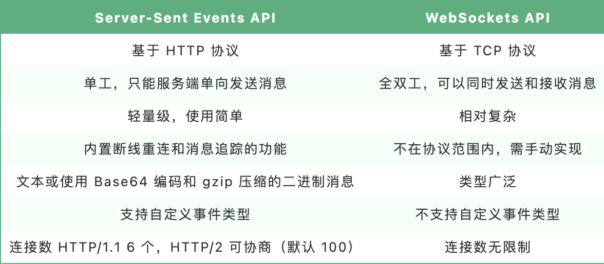
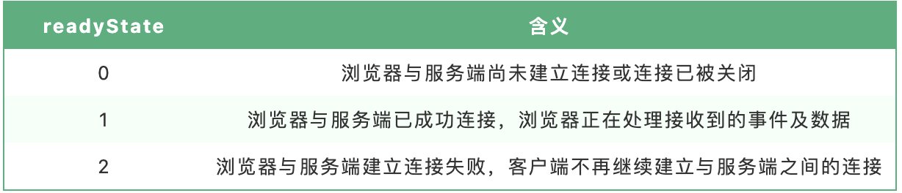
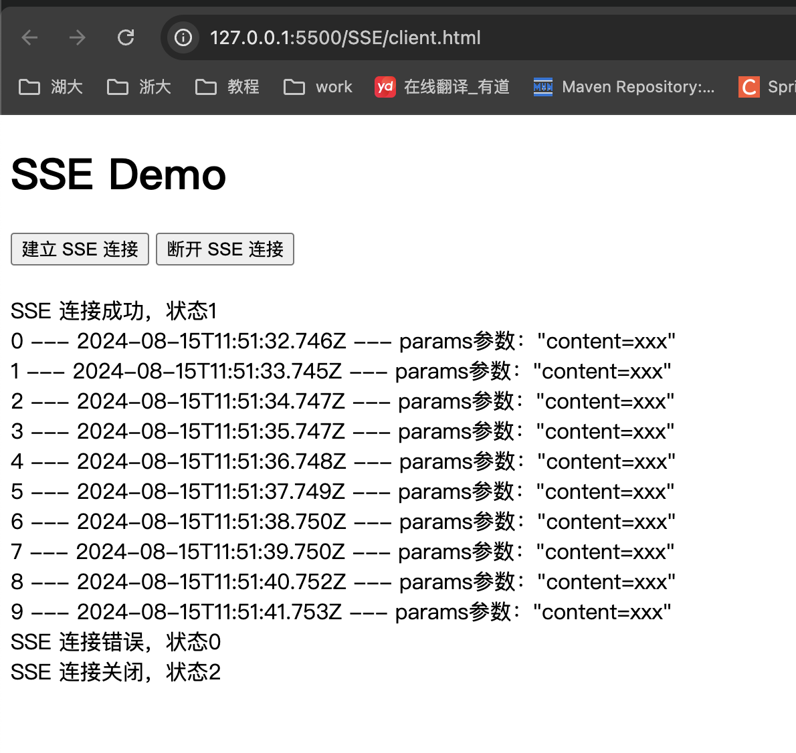

# SSE(Server-Sent Events)

## 背景

在使用 ChatGPT 时，发现输入 prompt 后，页面是逐步给出回复的，这个接口的通信方式并非传统的 http 接口或者 WebSockets，而是基于 EventStream 的事件流，像打字机一样，一段一段的返回答案。

ChatGPT 是一个基于深度学习的大型语言模型，处理自然语言需要大量的计算资源和时间，响应速度肯定比普通的读数据库要慢的多，普通 http 接口等待时间过长，显然并不合适。对于这种单项对话场景，ChagtGPT 将先计算出的数据“推送”给用户，边计算边返回，避免用户因为等待时间过长关闭页面。而这，可以采用 SSE 技术。


## 概述

Server-Sent Events 服务器推送事件，简称 SSE，是一种服务端实时**主动**向浏览器推送消息的技术。

SSE 是 HTML5 中一个与通信相关的 API，主要由两部分组成：服务端与浏览器端的通信协议（`HTTP` 协议）及浏览器端可供 JavaScript 使用的 `EventSource` 对象。

从“服务端主动向浏览器实时推送消息”这一点来看，该 API 与 WebSockets API 有一些相似之处。但是，该 API 与 WebSockers API 的不同之处在于：




## 服务端实现

### 协议

SSE 协议非常简单，本质是浏览器发起 http 请求，服务器在收到请求后，返回状态与数据，并附带以下 headers：

```js
Content-Type: text/event-stream
Cache-Control: no-cache
Connection: keep-alive
```

- SSE API规定推送事件流的 MIME 类型为 `text/event-stream`。
- 必须指定浏览器不缓存服务端发送的数据，以确保浏览器可以实时显示服务端发送的数据。
- SSE 是一个一直保持开启的 TCP 连接，所以 Connection 为 keep-alive。


### 消息格式

EventStream（事件流）为 `UTF-8` 格式编码的`文本`或使用 Base64 编码和 gzip 压缩的二进制消息。

每条消息由一行或多行字段**（`event`、`id`、`retry`、`data`）**组成，每个字段组成形式为：`字段名:字段值`。字段以行为单位，每行一个（即以 `\n` 结尾）。**以`冒号`开头的行为注释行，会被浏览器忽略。**

每次推送，可由多个消息组成，每个消息之间以空行分隔（即最后一个字段以`\n\n`结尾）。

>   [!CAUTION]
>
> - 除上述四个字段外，其他所有字段都会被忽略。
> - 如果一行字段中不包含冒号，则整行文本将被视为字段名，字段值为空。
> - 注释行可以用来防止链接超时，服务端可以定期向浏览器发送一条消息注释行，以保持连接不断。

> event

事件类型。如果指定了该字段，则在浏览器收到该条消息时，会在当前 `EventSource` 对象上触发一个事件，事件类型就是该字段的字段值。可以使用 `addEventListener` 方法在当前 `EventSource` 对象上监听任意类型的命名事件。

如果该条消息没有 `event` 字段，则会触发 `EventSource` 对象 `onmessage` 属性上的事件处理函数。

> id

事件ID。事件的唯一标识符，浏览器会跟踪事件ID，如果发生断连，浏览器会把收到的最后一个事件ID放到 HTTP Header `Last-Event-Id` 中进行重连，作为一种简单的同步机制。

例如可以在服务端将每次发送的事件ID值自动加 1，当浏览器接收到该事件ID后，下次与服务端建立连接后再请求的 Header 中将同时提交该事件ID，服务端检查该事件ID是否为上次发送的事件ID，如果与上次发送的事件ID不一致则说明浏览器存在与服务器连接失败的情况，本次需要同时发送前几次浏览器未接收到的数据。

> retry

重连时间。整数值，单位 ms，如果与服务器的连接丢失，浏览器将等待指定时间，然后尝试重新连接。如果该字段不是整数值，会被忽略。

当服务端没有指定浏览器的重连时间时，由浏览器自行决定每隔多久与服务端建立一次连接（一般为 30s）。

> data

消息数据。数据内容只能以一个字符串的文本形式进行发送，如果需要发送一个对象时，需要将该对象以一个 JSON 格式的字符串的形式进行发送。在浏览器接收到该字符串后，再把它还原为一个 JSON 对象。

### 示例

如下事件流示例，共发送了 4 条消息，每条消息间以一个空行作为分隔符。

- 第一条仅仅是个注释，因为它以冒号开头。
- 第二条消息只包含一个 data 字段，值为 'this is second message'。
- 第三条消息包含两个 data 字段，其会被解析为一个字段，值为 'this is third message part 1\nthis is third message part 2'。
- 第四条消息包含完整四个字段，指定了事件类型为 'server-time'，事件id 为 '1'，重连时间为 '30000'ms，消息数据为 `JSON` 格式的 '{"text": "this is fourth message", "time": "12:00:00"}'。

```js
: this is first message\n\n

data: this is second message\n\n

data: this is third message part one\n
data this is third message part two\n\n

event: server-time\n
id: 1
retry: 30000\n
data: {"text": "this is fourth message", "time": "2023-04-09 12:00:00"}\n\n
```


## 浏览器 API

在浏览器端，可以使用 JavaScript 的 EventSource API 创建 `EventSource` 对象监听服务器发送的事件。一旦建立连接，服务器就可以使用 HTTP 响应的 'text/event-stream' 内容类型发送事件消息，浏览器则可以通过监听 EventSource 对象的 `onmessage`、`onopen` 和 `onerror` 事件来处理这些消息。

### 建立连接

EventSource 接受两个参数：URL 和 options。

URL 为 http 事件来源，一旦 EventSource 对象被创建后，浏览器立即开始对该 URL 地址发送过来的事件进行监听。

options 是一个可选的对象，包含 withCredentials 属性，表示是否发送凭证（cookie、HTTP认证信息等）到服务端，默认为 false。

```js
const eventSource = new EventSource('http_api_url', { withCredentials: true })
```

与 XMLHttpRequest 对象类型，EventSource 对象有一个 readyState 属性值，含义如下表：



可以使用 EventSource 对象的 `close` 方法关闭与服务端之间的连接，使浏览器不再建立与服务端之间的连接。

```js
// 关闭连接
eventSource.close()
```


### 监听事件

EventSource 对象本身继承自 EventTarget 接口，因此可以使用 addEventListener() 方法来监听事件。EventSource 对象触发的事件主要包括以下三种：

- open 事件：当成功连接到服务端时触发。
- message 事件：当接收到服务器发送的消息时触发。该事件对象的 data 属性包含了服务器发送的消息内容。
- error 事件：当发生错误时触发。该事件对象的 event 属性包含了错误信息。

```js
eventSource.addEventListener('open', function(event) {
  console.log('Connection opened')
})

eventSource.addEventListener('message', function(event) {
  console.log('Received message: ' + event.data);
})

// 监听自定义事件
// 这个就和发送的数据中的 event 字段挂钩了
eventSource.addEventListener('xxx', function(event) {
  console.log('Received message: ' + event.data);
})

eventSource.addEventListener('error', function(event) {
  console.log('Error occurred: ' + event.event);
})
```

当然，也可以采用属性监听（`onopen`、`onmessage`、`onerror`）的形式。

```js
eventSource.onopen = function(event) {
  console.log('Connection opened')
}

eventSource.onmessage = function(event) {
  console.log('Received message: ' + event.data);
}

eventSource.onerror = function(event) {
  console.log('Error occurred: ' + event.event);
})
```

>  [!CAUTION]
>
>  `EventSource` 对象的属性监听只能监听预定义的事件类型（`open`、`message`、`error`）。不能用于监听自定义事件类型。如果要实现自定义事件类型的监听，可以使用 `addEventListener()` 方法。


## 实践

### 服务端

使用 Node.js 实现 SSE 的简单示例：

```js
const http = require('http')

http.createServer((req, res) => {
  const url = req.url
  if (url.includes('/sse')) {
    // 如果请求 /events 路径，建立 SSE 连接
    res.writeHead(200, {
      'Content-Type': 'text/event-stream',
      'Cache-Control': 'no-cache',
      'Connection': 'keep-alive',
      'Access-Control-Allow-Origin': '*', // 允许跨域
    })

    // 每隔 1 秒发送一条消息
    let id = 0
    const intervalId = setInterval(() => {
      res.write(`event: customEvent\n`)
      res.write(`id: ${id}\n`)
      res.write(`retry: 30000\n`)
      const params = url.split('?')[1]
      const data = { id, time: new Date().toISOString(), params }
      res.write(`data: ${JSON.stringify(data)}\n\n`)
      id++
      if (id >= 10) {
        clearInterval(intervalId)
        res.end()
      }
    }, 1000)

    // 当客户端关闭连接时停止发送消息
    req.on('close', () => {
      clearInterval(intervalId)
      id = 0
      res.end()
    })
  } else {
    // 如果请求的路径无效，返回 404 状态码
    res.writeHead(404)
    res.end()
  }
}).listen(3000)

console.log('Server listening on port 3000')
```

### 浏览器

```html
<!DOCTYPE html>
<html lang="en">
<head>
  <meta charset="UTF-8">
  <meta http-equiv="X-UA-Compatible" content="IE=edge">
  <meta name="viewport" content="width=device-width, initial-scale=1.0">
  <title>SSE Demo</title>
</head>
<body>
  <h1>SSE Demo</h1>
  <button onclick="connectSSE()">建立 SSE 连接</button>  
  <button onclick="closeSSE()">断开 SSE 连接</button>
  <br />
  <br />
  <div id="message"></div>

  <script>
    const messageElement = document.getElementById('message')

    let eventSource

    // 建立 SSE 连接
    const connectSSE = () => {
      eventSource = new EventSource('http://127.0.0.1:3000/sse?content=xxx')

      // 监听消息事件
      eventSource.addEventListener('customEvent', (event) => {
        const data = JSON.parse(event.data)
        messageElement.innerHTML += `${data.id} --- ${data.time} --- params参数：${JSON.stringify(data.params)}` + '<br />'
      })

      eventSource.onopen = () => {
        messageElement.innerHTML += `SSE 连接成功，状态${eventSource.readyState}<br />`
      }

      eventSource.onerror = () => {
        messageElement.innerHTML += `SSE 连接错误，状态${eventSource.readyState}<br />`
      }
    }

    // 断开 SSE 连接
    const closeSSE = () => {
      eventSource.close()
      messageElement.innerHTML += `SSE 连接关闭，状态${eventSource.readyState}<br />`
    }
  </script>
</body>
</html>
```



## 兼容性

 发展至今，SSE 已具有广泛的的浏览器[兼容性](https://caniuse.com/?search=Server%20-sent%20events)，几乎除 IE 之外的浏览器均已支持。


## Fetch 实现

虽然使用 SSE 技术可以实现 ChatGPT 一样的打字机效果，但是通过上文请求 type 对比可以发现，在使用 SSE 时，type 为 `eventSource`，而 ChatGPT 为 `fetch`。且受浏览器 EventSource API 限制，在使用 SSE 时不能自定义请求头、只能发出 GET 请求，且在大多数浏览器中，URL 限制[2000个字符](https://stackoverflow.com/questions/417142/what-is-the-maximum-length-of-a-url-in-different-browsers)，也无法满足 ChatGPT 参数传递需求。

此时，可以使用 Fetch API 实现一个替代接口，用于**模拟** SSE 实现。简单实现如下：

### 服务端

```js
const http = require('http')

http.createServer((req, res) => {
  const url = req.url
  if (url.includes('/fetch-sse')) {
    // 如果请求 /events-fetch 路径，建立连接
    res.writeHead(200, {
      'Content-Type': 'text/event-stream',
      'Cache-Control': 'no-cache',
      'Connection': 'keep-alive',
      'Access-Control-Allow-Origin': '*', // 允许跨域
    })
    let body = ''
    req.on('data', chunk => {
      body += chunk
    })
    
    // 每隔 1 秒发送一条消息
    let id = 0
    const intervalId = setInterval(() => {
      const data = { id, time: new Date().toISOString(), body: JSON.parse(body) }
      res.write(JSON.stringify(data))
      id++
      if (id >= 10) {
        clearInterval(intervalId)
        res.end()
      }
    }, 1000)

    // 当客户端关闭连接时停止发送消息
    req.on('close', () => {
      clearInterval(intervalId)
      id = 0
      res.end()
    })
  } else {
    // 如果请求的路径无效，返回 404 状态码
    res.writeHead(404)
    res.end()
  }
}).listen(3001)

console.log('Server listening on port 3001')
```

### 浏览器

```html
<!DOCTYPE html>
<html lang="en">

<head>
  <meta charset="UTF-8">
  <meta http-equiv="X-UA-Compatible" content="IE=edge">
  <meta name="viewport" content="width=device-width, initial-scale=1.0">
  <title>fetchSSE Demo</title>
</head>

<body>
  <h1>fetchSSE Demo</h1>
  <button onclick="connectFetch()">建立 fetchSSE 连接</button>
  <button onclick="closeSSE()">断开 fetchSSE 连接</button>
  <br />
  <br />
  <div id="message"></div>

  <script>
    const messageElement = document.getElementById('message')
    let controller

    // 建立 FETCH-SSE 连接
    const connectFetch = () => {
      controller = new AbortController()
      fetchEventSource('http://127.0.0.1:3001/fetch-sse', {
        method: 'POST',
        body: JSON.stringify({
          content: 'xxx'
        }),
        signal: controller.signal,
        onopen: () => {
          messageElement.innerHTML += `FETCH 连接成功<br />`
        },
        onclose: () => {
          messageElement.innerHTML += `FETCH 连接关闭<br />`
        },
        onmessage: (event) => {
          const data = JSON.parse(event)
          messageElement.innerHTML += `${data.id} --- ${data.time} --- body参数：${JSON.stringify(data.body)}` + '<br />'
        },
        onerror: (e) => {
          console.log(e)
        }
      })
    }

    // 断开 FETCH-SSE 连接
    const closeSSE = () => {
      if (controller) {
        controller.abort()
        controller = undefined
        messageElement.innerHTML += `FETCH 连接关闭<br />`
      }
    }


    const fetchEventSource = (url, options) => {
      fetch(url, options)
        .then(response => {
          if (response.status === 200) {
            options.onopen && options.onopen()
            return response.body
          }
        })
        .then(rb => {
          const reader = rb.getReader()
          const push = () => {
            // done 为数据流是否接收完成，boolean
            // value 为返回数据，Uint8Array
            return reader.read().then(({ done, value }) => {
              if (done) {
                options.onclose && options.onclose()
                return
              }
              options.onmessage && options.onmessage(new TextDecoder().decode(value))
              // 持续读取流信息
              return push()
            })
          }
          // 开始读取流信息
          return push()
        })
        .catch((e) => {
          options.error && options.error(e)
        })
    }
  </script>

</html>
```

> 💡不同于 `XMLHttpRequest`，`fetch` 并未原生提供终止操作方法，可以通过 DOM API [AbortController](https://developer.mozilla.org/zh-CN/docs/Web/API/AbortController) 和 `AbortSignal` 实现 fetch 请求终止操作。

不知道为啥server 端不能使用`req.on('data', chunk => { body += chunk  })`接收参数，需要注释掉才能成功


## Go 构建服务端

```go
package main

import (
	"fmt"
	"io"
	"net/http"
	"time"
)

func main() {
	http.HandleFunc("/fetchsse", func(w http.ResponseWriter, r *http.Request) {
		w.Header().Set("Content-Type", "text/event-stream")
		w.Header().Set("Cache-Control", "no-cache")
		w.Header().Set("Connection", "keep-alive")
		w.Header().Set("Access-Control-Allow-Origin", "*")

		// 读取请求体
		body, err := io.ReadAll(r.Body)
		if err != nil {
			http.Error(w, "Failed to read request body", http.StatusInternalServerError)
			return
		}
		defer r.Body.Close() // 确保关闭请求体

		for {
			// Simulate sending events every second
			fmt.Fprintf(w, "data: %s\n\n", time.Now().Format(time.Stamp)+string(body))
			w.(http.Flusher).Flush()
			time.Sleep(1 * time.Second)
		}
	})

	http.ListenAndServe(":3001", nil)
}

```


## 总结

SSE 技术是一种轻量级的实时通信技术，基于 HTTP 协议，具有服务端推送、断线重连、简单轻量等优点。但是，SSE 技术也有一些缺点，如不能进行双向通信、连接数受限、仅支持 get 请求等。

SSE 可以在 Web 应用程序中实现诸如股票在线数据、日志推送、聊天室实时人数等即时数据推送功能。需要注意的是，SSE 并不是适用于所有的实时推送场景。在需要高并发、高吞吐量和低延迟的场景下，WebSockets 可能更加适合。而在需要更轻量级的推送场景下，SSE 可能更加适合。因此，在选择即时更新方案时，需要根据具体的需求和场景进行选择。