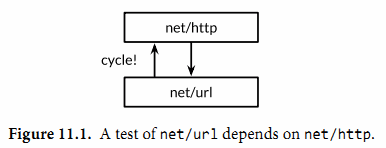
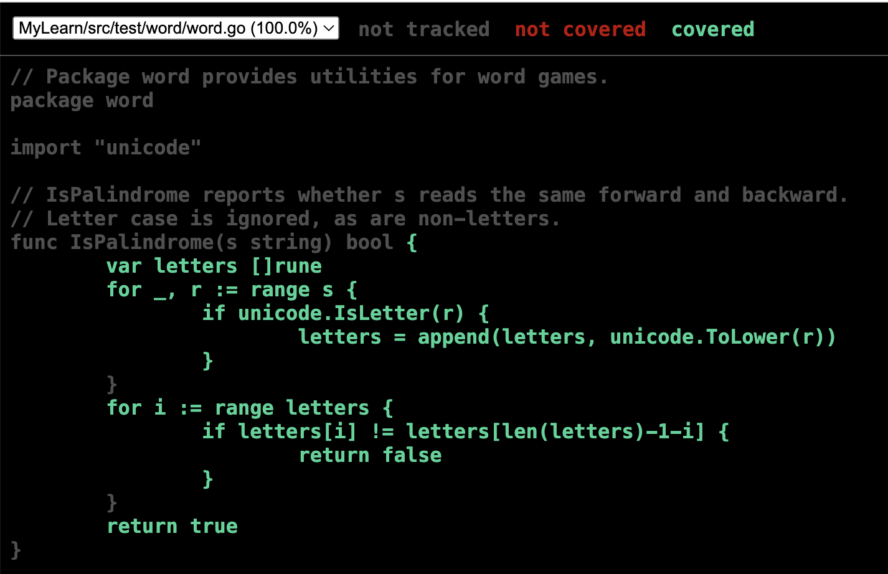
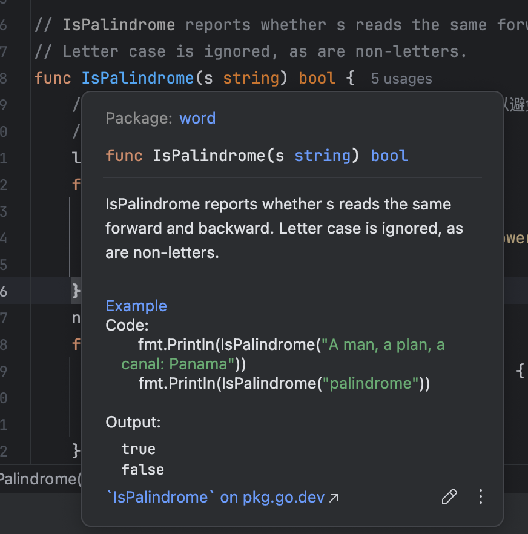

# Go Test

## 概念

go test命令是一个按照一定的约定和组织来测试代码的程序。在包目录内，所有以`_test.go`为后缀名的源文件在执行go build时不会被构建成包的一部分，它们是go test测试的一部分。

在`*_test.go`文件中，有三种类型的函数：测试函数、基准测试（benchmark）函数、示例函数。一个测试函数是以Test为函数名前缀的函数，用于测试程序的一些逻辑行为是否正确；go test命令会调用这些测试函数并报告测试结果是PASS或FAIL。基准测试函数是以Benchmark为函数名前缀的函数，它们用于衡量一些函数的性能；go test命令会多次运行基准测试函数以计算一个平均的执行时间。示例函数是以Example为函数名前缀的函数，提供一个由编译器保证正确性的示例文档。

**go test命令会遍历所有的`*_test.go`文件中符合上述命名规则的函数，生成一个临时的main包用于调用相应的测试函数，接着构建并运行、报告测试结果，最后清理测试中生成的临时文件。**


## 1测试函数

测试函数文件和源文件必须放在同一个包下，`main`包也支持

每个测试函数必须导入testing包。测试函数有如下的签名：

```Go
func TestName(t *testing.T) {
    // ...
}
```

测试函数的名字必须以Test开头，可选的后缀名必须以大写字母开头：

```Go
func TestSin(t *testing.T) { /* ... */ }
func TestCos(t *testing.T) { /* ... */ }
func TestLog(t *testing.T) { /* ... */ }
```

其中t参数用于报告测试失败和附加的日志信息。


### 实例

编写逻辑函数 `word.go`

```go
// Package word provides utilities for word games.
package word

import "unicode"

// IsPalindrome reports whether s reads the same forward and backward.
// Letter case is ignored, as are non-letters.
func IsPalindrome(s string) bool {
	var letters []rune
	for _, r := range s {
		if unicode.IsLetter(r) {
			letters = append(letters, unicode.ToLower(r))
		}
	}
	for i := range letters {
		if letters[i] != letters[len(letters)-1-i] {
			return false
		}
	}
	return true
}
```

在同包下，创建`word_test.go`

```go
package word

import "testing"

func TestIsPalindrome(t *testing.T) {
	var tests = []struct {
		input string
		want  bool
	}{
		{"", true},
		{"a", true},
		{"aa", true},
		{"ab", false},
		{"kayak", true},
		{"detartrated", true},
		{"A man, a plan, a canal: Panama", true},
		{"Evil I did dwell; lewd did I live.", true},
		{"Able was I ere I saw Elba", true},
		{"été", true},
		{"Et se resservir, ivresse reste.", true},
		{"palindrome", false}, // non-palindrome
		{"desserts", false},   // semi-palindrome
	}
	for _, test := range tests {
		if got := IsPalindrome(test.input); got != test.want {
			t.Errorf("IsPalindrome(%q) = %v", test.input, got)
		}
	}
}
```

然后执行`go test`命令，运行测试用例

```sh
liushun@liushun word % go test
PASS
ok      MyLearn/src/test/word   0.388s
```

`go test`命令如果没有参数指定包那么将默认采用当前目录对应的包（和`go build`命令一样）

注意：失败测试的输出并不包括调用t.Errorf时刻的堆栈调用信息。t.Errorf调用并不会引起panic异常或停止测试的执行。即使表格中前面的数据导致了测试的失败，表格后面的测试数据依然会运行测试。

但是可以使用t.Fatal或t.Fatalf停止当前测试函数。它们必须在和测试函数同一个goroutine内调用。


### 子测试

```go
func TestSplit(t *testing.T) {
    type test struct { // 定义test结构体
        input string
        sep   string
        want  []string
    }
    tests := map[string]test{ // 测试用例使用map存储
        "simple":      {input: "a:b:c", sep: ":", want: []string{"a", "b", "c"}},
        "wrong sep":   {input: "a:b:c", sep: ",", want: []string{"a:b:c"}},
        "more sep":    {input: "abcd", sep: "bc", want: []string{"a", "d"}},
        "leading sep": {input: "枯藤老树昏鸦", sep: "老", want: []string{"枯藤", "树昏鸦"}},
    }
    for name, tc := range tests {
        t.Run(name, func(t *testing.T) { // 使用t.Run()执行子测试
            got := Split(tc.input, tc.sep)
            if !reflect.DeepEqual(got, tc.want) {
                t.Errorf("excepted:%#v, got:%#v", tc.want, got)
            }
        })
    }
}
/*
go test -v
=== RUN   TestSplit
=== RUN   TestSplit/leading_sep
=== RUN   TestSplit/simple
=== RUN   TestSplit/wrong_sep
=== RUN   TestSplit/more_sep
--- FAIL: TestSplit (0.00s)
    --- FAIL: TestSplit/leading_sep (0.00s)
        split_test.go:83: excepted:[]string{"枯藤", "树昏鸦"}, got:[]string{"", "枯藤", "树昏鸦"}
    --- PASS: TestSplit/simple (0.00s)
    --- PASS: TestSplit/wrong_sep (0.00s)
    --- PASS: TestSplit/more_sep (0.00s)
FAIL
*/
```


### 参数

参数`-v`可用于打印每个测试函数的名字和运行时间：

```sh
liushun@liushun word % go test -v
=== RUN   TestIsPalindrome
--- PASS: TestIsPalindrome (0.00s)
PASS
ok      MyLearn/src/test/word   0.276s
```

参数`-run`对应一个正则表达式，只有测试函数名被它正确匹配的测试函数才会被`go test`测试命令运行：

```sh
$ go test -v -run="French|Canal"
=== RUN TestFrenchPalindrome
--- FAIL: TestFrenchPalindrome (0.00s)
    word_test.go:28: IsPalindrome("été") = false
=== RUN TestCanalPalindrome
--- FAIL: TestCanalPalindrome (0.00s)
    word_test.go:35: IsPalindrome("A man, a plan, a canal: Panama") = false
FAIL
exit status 1
FAIL    xxx/word  0.014s
```


### 黑白盒

一种测试分类的方法是基于测试者是否需要了解被测试对象的内部工作原理。黑盒测试只需要测试包**公开的**文档和API行为，内部实现对测试代码是透明的。相反，白盒测试有访问包内部函数和数据结构的权限，因此可以做到一些普通客户端无法实现的测试。例如，一个白盒测试可以在每个操作之后检测不变量的数据类型。（白盒测试只是一个传统的名称，其实称为clear box测试会更准确。）

黑盒和白盒这两种测试方法是互补的。黑盒测试一般更健壮，随着软件实现的完善测试代码很少需要更新。它们可以帮助测试者了解真实客户的需求，也可以帮助发现API设计的一些不足之处。相反，白盒测试则可以对内部一些棘手的实现提供更多的测试覆盖。

TestIsPalindrome测试仅仅使用导出的IsPalindrome函数，因此这是一个黑盒测试。如果某个测试调用或更改了内部的未导出的函数或者变量，就是白盒测试。

白盒测试风险：如果在一次测试中，某个测试用例更改了某个全局变量，如果没有在测试用例结束后改回来，他将影响剩余的所有测试用例。====> **使用 defer 来复原**

```go
func TestCheckQuotaNotifiesUser(t *testing.T) {
    // Save and restore original notifyUser.
    saved := notifyUser
    defer func() { notifyUser = saved }()

    // Install the test's fake notifyUser.
    var notifiedUser, notifiedMsg string
    notifyUser = func(user, msg string) {
        notifiedUser, notifiedMsg = user, msg
    }
    // ...rest of test...
}
```

这种处理模式可以用来暂时保存和恢复所有的全局变量，包括命令行标志参数、调试选项和优化参数；安装和移除导致生产代码产生一些调试信息的钩子函数；还有有些诱导生产代码进入某些重要状态的改变，比如超时、错误，甚至是一些刻意制造的并发行为等因素。

以这种方式使用全局变量是安全的，因为go test命令并不会同时并发地执行多个测试。


### 外部测试包

考虑下这两个包：net/url包，提供了URL解析的功能；net/http包，提供了web服务和HTTP客户端的功能。所以上层的net/http包依赖下层的net/url包。然后，net/url包中的一个测试是演示不同URL和HTTP客户端的交互行为。也就是说，一个下层包的测试代码导入了上层的包。



这样的行为在net/url包的测试代码中会导致包的循环依赖，正如图11.1中向上箭头所示，而 Go 语言规范是禁止包的循环依赖的。

可以通过外部测试包的方式解决循环依赖的问题，也就是在net/url包所在的目录声明一个独立的url_test测试包。**其中包名的`_test`后缀告诉go test工具它应该建立一个额外的包来运行测试**。外部测试包不能被其他任何包导入。

因为外部测试包是一个独立的包，所以能够导入那些`依赖待测代码本身`的其他辅助包；包内的测试代码就无法做到这点。在设计层面，外部测试包是在所有它依赖的包的上层，如下图所示。


通过避免循环的导入依赖，外部测试包可以更灵活地编写测试，特别是集成测试（需要测试多个组件之间的交互），可以像普通应用程序那样自由地导入其他包。

可以用go list命令查看包对应目录中哪些Go源文件是产品代码，哪些是包内测试，还有哪些是外部测试包。以fmt包作为一个例子：GoFiles表示产品代码对应的Go源文件列表；也就是go build命令要编译的部分。

```sh
liushun@liushun word % go list -f={{.GoFiles}} fmt
[doc.go errors.go format.go print.go scan.go]
```

TestGoFiles表示的是fmt包内部测试代码，以_test.go为后缀文件名，不过只在测试时被构建：

```shell
liushun@liushun word % go list -f={{.TestGoFiles}} fmt
[export_test.go]
```

包的测试代码通常都在这些文件中，不过fmt包并非如此；

XTestGoFiles表示的是属于外部测试包的测试代码，也就是fmt_test包，因此它们必须先导入fmt包。同样，这些文件也只是在测试时被构建运行：

```sh
liushun@liushun word % go list -f={{.XTestGoFiles}} fmt
[errors_test.go example_test.go fmt_test.go gostringer_example_test.go scan_test.go state_test.go stringer_example_test.go stringer_test.go]
```

有时候外部测试包也需要访问被测试包内部的代码，例如在一个为了避免循环导入而被独立到外部测试包的白盒测试。在这种情况下，可以通过一些技巧解决：在包内的一个_test.go文件中导出一个内部的实现给外部测试包。因为这些代码只有在测试时才需要，因此一般会放在export_test.go文件中。

例如，fmt包的fmt.Scanf函数需要unicode.IsSpace函数提供的功能。但是为了避免太多的依赖，fmt包并没有导入包含巨大表格数据的unicode包；相反fmt包有一个叫isSpace内部的简易实现。

为了确保fmt.isSpace和unicode.IsSpace函数的行为保持一致，fmt包谨慎地包含了一个测试。一个在外部测试包内的白盒测试，是无法直接访问到isSpace内部函数的，因此fmt通过一个后门导出了isSpace函数。**export_test.go文件就是专门用于外部测试包的后门(其实就是为了让外部测试包能够访问待测试的包的未导出的东西)**。

```Go
package fmt

var IsSpace = isSpace
```

这个测试文件并没有定义测试代码；它只是通过fmt.IsSpace简单导出了内部的isSpace函数，提供给外部测试包使用。这个技巧可以广泛用于位于外部测试包的白盒测试。


### 帮助函数t.Helper()

对一些重复的逻辑，抽取出来作为公共的帮助函数(helpers)，可以增加测试代码的可读性和可维护性。 借助帮助函数，可以让测试用例的主逻辑看起来更清晰。

例如

```go
type calcCase struct{ A, B, Expected int }

func createMulTestCase(t *testing.T, c *calcCase) {
  // t.Helper()
	if ans := Mul(c.A, c.B); ans != c.Expected {
		t.Fatalf("%d * %d expected %d, but %d got",
			c.A, c.B, c.Expected, ans)
	}
}

func TestMul(t *testing.T) {
	createMulTestCase(t, &calcCase{2, 3, 6})
	createMulTestCase(t, &calcCase{2, -3, -6})
	createMulTestCase(t, &calcCase{2, 0, 1}) // wrong case
}
```

他的报错信息将提示在第 6 行，如果将第四行的注释取消，将该函数标记为帮助函数，最终他的报错提示在第 14 行。

Go 语言在 1.9 版本中引入了 `t.Helper()`，用于标注该函数是帮助函数，报错时将输出帮助函数调用者的信息，而不是帮助函数的内部信息。


### 并行测试用例t.Parallel()

简单总结：

1. 默认情况下，同一个package内的单元测试是顺序执行的
2. 默认情况下，多个package之间的单元测试是并发执行的
3. 同一个package内的单元测试想要并发执行的话，需要加 t.Parallel() 方法
4. -p 和 -parallel 是两个不同的参数，前者控制多少个package并发执行，实际是会起多个子进程来并发执行package下的测试用例，默认是CPU核数个，后者控制同一个package内的单元测试并发执行多少个，后者是在使用了 t.Parallel()的情况下才生效。
5. 当加了 t.Parallel() 的测试用例和没加的测试用例，在同一个package中执行时，会按照顺序先执行没加t.Parallel()的测试用例，然后再并发执行加了t.Parallel()的测试用例


## 测试覆盖率

就其性质而言，测试不可能是完整的。计算机科学家Edsger Dijkstra曾说过：“测试能证明缺陷存在，而无法证明没有缺陷。”再多的测试也不能证明一个程序没有BUG。

对待测程序执行的测试的程度称为测试的覆盖率。测试覆盖率并不能量化——即使最简单的程序的动态也是难以精确测量的——但是有启发式方法来帮助编写有效的测试代码。

这些启发式方法中，语句的覆盖率是最简单和最广泛使用的。语句的覆盖率是指在测试中至少被运行一次的代码占总代码数的比例。可以使用`go test`命令中集成的测试覆盖率工具，来度量代码的测试覆盖率。

首先，要确保所有的测试都正常通过，然后下面这个命令可以显示测试覆盖率工具的使用用法：

```sh
liushun@liushun word %  go tool cover
Usage of 'go tool cover':
Given a coverage profile produced by 'go test':
        go test -coverprofile=c.out

Open a web browser displaying annotated source code:
        go tool cover -html=c.out

Write out an HTML file instead of launching a web browser:
        go tool cover -html=c.out -o coverage.html

Display coverage percentages to stdout for each function:
        go tool cover -func=c.out

```

`go tool`命令运行Go工具链的底层可执行程序。这些底层可执行程序放在`$GOROOT/pkg/tool/${GOOS}_${GOARCH}`目录。因为有`go build`命令的原因，所以很少直接调用这些底层工具。

现在可以用`-coverprofile`标志参数重新运行测试：

```sh
liushun@liushun word % go test -coverprofile=c.out 
PASS
coverage: 100.0% of statements
ok      MyLearn/src/test/word   0.413s
```

这个标志参数通过在测试代码中插入生成钩子来统计覆盖率数据。也就是说，在运行每个测试前，**它将待测代码拷贝一份并做修改，在每个词法块都会设置一个布尔标志变量**。当被修改后的被测试代码运行退出时，将统计日志数据写入c.out文件，并打印一部分执行的语句的一个总结。（如果需要的是摘要，使用`go test -cover`。）

如果使用了`-covermode=count`标志参数，那么将在每个代码块插入一个计数器而不是布尔标志量。在统计结果中记录了每个块的执行次数，这可以用于衡量哪些是被频繁执行的热点代码。

为了收集数据，我们运行了测试覆盖率工具，打印了测试日志，生成一个HTML报告，然后在浏览器中打开（图11.3）。

```sh
go tool cover -html=c.out
```



```sh
liushun@liushun word % go tool cover -func=c.out
MyLearn/src/test/word/word.go:8:        IsPalindrome    100.0%
total:                                  (statements)    100.0%
```

绿色的代码块被测试覆盖到了，红色的则表示没有被覆盖到。

实现100%的测试覆盖率听起来很美，但是在具体实践中通常是不可行的，也不是值得推荐的做法。因为那只能说明代码被执行过而已，并不意味着代码就是没有BUG的；因为对于逻辑复杂的语句需要针对不同的输入执行多次。有一些语句，例如panic语句可能永远都不会被执行到。另外，还有一些隐晦的错误在现实中很少遇到也很难编写对应的测试代码。


## 2基准测试函数

### 实例

**基准测试是测量一个程序在固定工作负载下的性能**。在Go语言中，基准测试函数和普通测试函数写法类似，但是以Benchmark为前缀名，并且带有一个`*testing.B`类型的参数；`*testing.B`参数除了提供和`*testing.T`类似的方法，还有额外一些和性能测量相关的方法。它还提供了一个整数N，用于指定操作执行的循环次数。

下面是IsPalindrome函数的基准测试，其中循环将执行N次。

```go
import "testing"

func BenchmarkIsPalindrome(b *testing.B) {
    for i := 0; i < b.N; i++ {
        IsPalindrome("A man, a plan, a canal: Panama")
    }
}
```

用下面的命令运行基准测试。和普通测试不同的是，默认情况下不运行任何基准测试。需要通过`-bench`命令行标志参数手工指定要运行的基准测试函数。该参数是一个正则表达式，用于匹配要执行的基准测试函数的名字，默认值是空的。其中“.”模式将可以匹配所有基准测试函数，但因为这里只有一个基准测试函数，因此和`-bench=IsPalindrome`参数是等价的效果。

```sh
liushun@liushun word % go test -bench=.         
goos: darwin
goarch: arm64
pkg: MyLearn/src/test/word
BenchmarkIsPalindrome-8          4530589               263.1 ns/op
PASS
ok      MyLearn/src/test/word   1.825s
```

结果中基准测试名的数字后缀部分，这里是8，表示运行时对应的GOMAXPROCS的值，这对于一些与并发相关的基准测试是重要的信息。

报告显示每次调用IsPalindrome函数花费263.1纳秒，是执行4530589次的平均时间。因为基准测试驱动器开始时并不知道每个基准测试函数运行所花的时间，它会尝试在真正运行基准测试前先尝试用较小的N运行测试来估算基准测试函数所需要的时间，然后推断一个较大的时间保证稳定的测量结果。

循环在基准测试函数内实现，而不是放在基准测试框架内实现，这样可以让每个基准测试函数有机会在循环启动前执行初始化代码，这样并不会显著影响每次迭代的平均运行时间。如果还是担心初始化代码部分对测量时间带来干扰，那么可以通过testing.B参数提供的方法来临时关闭或重置计时器，不过这些一般很少会用到。

对代码做两个改进

```go
func IsPalindrome(s string) bool {
  // 在开始为每个字符预先分配一个足够大的数组，这样就可以避免在append调用时可能会导致内存的多次重新分配。
  // 声明一个letters数组变量，并指定合适的大小
	letters := make([]rune, 0, len(s))
	for _, r := range s {
		if unicode.IsLetter(r) {
			letters = append(letters, unicode.ToLower(r))
		}
	}
	n := len(letters) / 2 // 减少计算
	for i := 0; i < n; i++ {
		if letters[i] != letters[len(letters)-1-i] {
			return false
		}
	}
	return true
}
```

可以看到有很大性能提升，降低了一半

```sh
liushun@liushun word % go test -bench=.
goos: darwin
goarch: arm64
pkg: MyLearn/src/test/word
BenchmarkIsPalindrome-8          8746796               130.4 ns/op
PASS
ok      MyLearn/src/test/word   1.634s
```

说明快的程序往往是伴随着较少的内存分配。`-benchmem`命令行标志参数将在报告中包含内存的分配数据统计。可以比较优化前后内存的分配情况：

```sh
liushun@liushun word % go test -bench=. -benchmem
goos: darwin
goarch: arm64
pkg: MyLearn/src/test/word
BenchmarkIsPalindrome-8          4464765               263.4 ns/op           248 B/op          5 allocs/op
PASS
ok      MyLearn/src/test/word   1.780s
```

改进后

```sh
liushun@liushun word % go test -bench=. -benchmem
goos: darwin
goarch: arm64
pkg: MyLearn/src/test/word
BenchmarkIsPalindrome-8          8685471               130.5 ns/op           128 B/op          1 allocs/op
PASS
ok      MyLearn/src/test/word   1.548s
```

用一次内存分配代替多次的内存分配节省了80%的分配调用次数和减少近一半的内存需求。


### 性能比较函数

这个基准测试告诉了某个具体操作所需的绝对时间，但往往想知道的是两个不同的操作的时间对比。例如，如果一个函数需要1ms处理1,000个元素，那么处理10000或1百万将需要多少时间呢？这样的比较揭示了渐近增长函数的运行时间。另一个例子：I/O缓存该设置为多大呢？基准测试可以帮助选择在性能达标情况下所需的最小内存。第三个例子：对于一个确定的工作哪种算法更好？基准测试可以评估两种不同算法对于相同的输入在不同的场景和负载下的优缺点。

比较型的基准测试就是普通程序代码。**它们通常是单参数的函数，由几个不同数量级的基准测试函数调用**，就像这样：

```Go
func benchmark(b *testing.B, size int){/* ... */}
func Benchmark10(b *testing.B){ benchmark(b, 10) }
func Benchmark100(b *testing.B){ benchmark(b, 100) }
func Benchmark1000(b *testing.B){ benchmark(b, 1000) }

// 具体例子
func benchmarkFib(b *testing.B, n int) {
    for i := 0; i < b.N; i++ {
        Fib(n)
    }
}

func BenchmarkFib1(b *testing.B)  { benchmarkFib(b, 1) }
func BenchmarkFib2(b *testing.B)  { benchmarkFib(b, 2) }
func BenchmarkFib3(b *testing.B)  { benchmarkFib(b, 3) }
func BenchmarkFib10(b *testing.B) { benchmarkFib(b, 10) }
func BenchmarkFib20(b *testing.B) { benchmarkFib(b, 20) }
func BenchmarkFib40(b *testing.B) { benchmarkFib(b, 40) }
```

这里需要注意的是，默认情况下，每个基准测试**至少运行1秒**。如果在Benchmark函数返回时没有到1秒，则b.N的值会按1,2,5,10,20,50，…增加，并且函数再次运行。

```sh
liushun@liushun word % go test -bench=.
goos: darwin
goarch: arm64
pkg: MyLearn/src/test/word
BenchmarkFib1-8         353770672                3.340 ns/op
BenchmarkFib2-8         196137854                6.117 ns/op
BenchmarkFib3-8         137885349                8.701 ns/op
BenchmarkFib10-8         4052704               296.3 ns/op
BenchmarkFib20-8           32900             36562 ns/op
BenchmarkFib40-8               2         552092396 ns/op
PASS
ok      MyLearn/src/test/word   10.581s
```

最终的BenchmarkFib40只运行了两次，每次运行的平均值只有不到一秒。像这种情况下可以使用-benchtime标志增加最小基准时间，以产生更准确的结果。例如：

```sh
liushun@liushun word % go test -bench=Fib40 -benchtime=20s
goos: darwin
goarch: arm64
pkg: MyLearn/src/test/word
BenchmarkFib40-8              42         553313128 ns/op
PASS
ok      MyLearn/src/test/word   24.076s
```

这一次BenchmarkFib40函数运行了42次，结果就会更准确一些了。

通过函数参数来指定输入的大小，但是参数变量对于每个具体的基准测试都是固定的。要避免直接修改b.N来控制输入的大小。除非你将它作为一个固定大小的迭代计算输入，否则基准测试的结果将毫无意义。

比较型的基准测试反映出的模式在程序设计阶段是很有帮助的，但是即使程序完工了也应当保留基准测试代码。因为随着项目的发展，或者是输入的增加，或者是部署到新的操作系统或不同的处理器，可以再次用基准测试来帮助改进设计。

使用性能比较函数做测试的时候一个容易犯的错误就是把b.N作为输入的大小，例如以下两个例子都是错误的示范：

```go
// 错误示范1
func BenchmarkFibWrong(b *testing.B) {
    for n := 0; n < b.N; n++ {
        Fib(n)
    }
}

// 错误示范2
func BenchmarkFibWrong2(b *testing.B) {
    Fib(b.N)
}
```

### 重置时间

b.ResetTimer之前的处理不会放到执行时间里，也不会输出到报告中，所以可以在之前做一些不计划作为测试报告的操作。例如：

```go
func BenchmarkSplit(b *testing.B) {
    time.Sleep(5 * time.Second) // 假设需要做一些耗时的无关操作
    b.ResetTimer()              // 重置计时器
    for i := 0; i < b.N; i++ {
        Split("枯藤老树昏鸦", "老")
    }
}
```


### 并行测试

func (b *B) RunParallel(body func( *PB))会以并行的方式执行给定的基准测试。

RunParallel会创建出多个goroutine，并将b.N分配给这些goroutine执行， 其中goroutine数量的默认值为GOMAXPROCS。用户如果想要增加非CPU受限（non-CPU-bound）基准测试的并行性， 那么可以在RunParallel之前调用SetParallelism 。RunParallel通常会与-cpu标志一同使用。

```go
func BenchmarkSplitParallel(b *testing.B) {
    // b.SetParallelism(1) // 设置使用的CPU数
    b.RunParallel(func(pb *testing.PB) {
        for pb.Next() {
            Split("枯藤老树昏鸦", "老")
        }
    })
}
```

执行一下基准测试：并行还是要快挺多

```sh
liushun@liushun word % go test -bench=.
goos: darwin
goarch: arm64
pkg: MyLearn/src/test/word
BenchmarkSplit-8                 9693138               121.3 ns/op
BenchmarkSplitParallel-8        50502835                32.47 ns/op
PASS
ok      MyLearn/src/test/word   3.321s
```

还可以通过在测试命令后添加-cpu参数如go test -bench=. -cpu 1来指定使用的CPU数量。


### Setup与TearDown

测试程序有时需要在测试之前进行额外的设置（setup）或在测试之后进行拆卸（teardown）。

#### TestMain

通过在`*_test.go`文件中定义TestMain函数来可以在测试之前进行额外的设置（setup）或在测试之后进行拆卸（teardown）操作。

如果测试文件包含函数:`func TestMain(m *testing.M)`那么生成的测试会先调用 TestMain(m)，然后再运行具体测试。TestMain运行在主goroutine中, 可以**在调用 m.Run前后做任何设置（setup）和拆卸（teardown）**。**退出测试的时候应该使用m.Run的返回值作为参数调用os.Exit**。

一个使用TestMain来设置Setup和TearDown的示例如下：

```go
func TestMain(m *testing.M) {
    fmt.Println("write setup code here...") // 测试之前的做一些设置
    // 如果 TestMain 使用了 flags，这里应该加上flag.Parse()
    retCode := m.Run()                         // 执行测试
    fmt.Println("write teardown code here...") // 测试之后做一些拆卸工作
    os.Exit(retCode)                           // 退出测试
}
```

需要注意的是：在调用TestMain时, flag.Parse并没有被调用。所以如果TestMain 依赖于command-line标志 (包括 testing 包的标记), 则应该显示的调用flag.Parse。


#### 子测试的Setup与Teardown

有时候可能需要为每个测试集设置Setup与Teardown，也有可能需要为每个子测试设置Setup与Teardown。下面定义两个函数工具函数如下：

```go
// 测试集的Setup与Teardown
func setupTestCase(t *testing.T) func(t *testing.T) {
    t.Log("如有需要在此执行:测试之前的setup")
    return func(t *testing.T) {
        t.Log("如有需要在此执行:测试之后的teardown")
    }
}

// 子测试的Setup与Teardown
func setupSubTest(t *testing.T) func(t *testing.T) {
    t.Log("如有需要在此执行:子测试之前的setup")
    return func(t *testing.T) {
        t.Log("如有需要在此执行:子测试之后的teardown")
    }
}
```

使用方式如下：

```go
func TestSplit(t *testing.T) {
    type test struct { // 定义test结构体
        input string
        sep   string
        want  []string
    }
    tests := map[string]test{ // 测试用例使用map存储
        "simple":      {input: "a:b:c", sep: ":", want: []string{"a", "b", "c"}},
        "wrong sep":   {input: "a:b:c", sep: ",", want: []string{"a:b:c"}},
        "more sep":    {input: "abcd", sep: "bc", want: []string{"a", "d"}},
        "leading sep": {input: "枯藤老树昏鸦", sep: "老", want: []string{"", "枯藤", "树昏鸦"}},
    }
    teardownTestCase := setupTestCase(t) // 测试之前执行setup操作
    defer teardownTestCase(t)            // 测试之后执行testdoen操作

    for name, tc := range tests {
        t.Run(name, func(t *testing.T) { // 使用t.Run()执行子测试
            teardownSubTest := setupSubTest(t) // 子测试之前执行setup操作
            defer teardownSubTest(t)           // 测试之后执行testdoen操作
            got := Split(tc.input, tc.sep)
            if !reflect.DeepEqual(got, tc.want) {
                t.Errorf("excepted:%#v, got:%#v", tc.want, got)
            }
        })
    }
}
```

测试结果如下：

```
go test -v
=== RUN   TestSplit
=== RUN   TestSplit/simple
=== RUN   TestSplit/wrong_sep
=== RUN   TestSplit/more_sep
=== RUN   TestSplit/leading_sep
--- PASS: TestSplit (0.00s)
    split_test.go:71: 如有需要在此执行:测试之前的setup
    --- PASS: TestSplit/simple (0.00s)
        split_test.go:79: 如有需要在此执行:子测试之前的setup
        split_test.go:81: 如有需要在此执行:子测试之后的teardown
    --- PASS: TestSplit/wrong_sep (0.00s)
        split_test.go:79: 如有需要在此执行:子测试之前的setup
        split_test.go:81: 如有需要在此执行:子测试之后的teardown
    --- PASS: TestSplit/more_sep (0.00s)
        split_test.go:79: 如有需要在此执行:子测试之前的setup
        split_test.go:81: 如有需要在此执行:子测试之后的teardown
    --- PASS: TestSplit/leading_sep (0.00s)
        split_test.go:79: 如有需要在此执行:子测试之前的setup
        split_test.go:81: 如有需要在此执行:子测试之后的teardown
    split_test.go:73: 如有需要在此执行:测试之后的teardown
```


## 剖析

当想仔细观察程序的运行速度的时候，最好的方法是性能剖析。**剖析技术是基于程序执行期间一些自动抽样，然后在收尾时进行推断；最后产生的统计结果就称为剖析数据。**

Go语言支持多种类型的剖析性能分析，每一种关注不同的方面，但它们都涉及到每个采样记录的感兴趣的一系列事件消息，每个事件都包含函数调用时函数调用堆栈的信息。内建的`go test`工具对几种分析方式都提供了支持。

CPU剖析数据标识了最耗CPU时间的函数。在每个CPU上运行的线程在每隔几毫秒都会遇到操作系统的中断事件，每次中断时都会记录一个剖析数据然后恢复正常的运行。

堆剖析则标识了最耗内存的语句。剖析库会记录调用内部内存分配的操作，平均每512KB的内存申请会触发一个剖析数据。

阻塞剖析则记录阻塞goroutine最久的操作，例如系统调用、管道发送和接收，还有获取锁等。每当goroutine被这些操作阻塞时，剖析库都会记录相应的事件。

只需要开启下面其中一个标志参数就可以生成各种分析文件。当同时使用多个标志参数时需要当心，因为一项分析操作可能会影响其他项的分析结果。

```sh
$ go test -cpuprofile=cpu.out
$ go test -blockprofile=block.out
$ go test -memprofile=mem.out
```

一旦收集到了采样数据，可以使用pprof来分析这些数据。这是Go工具箱自带的一个工具，但并不是一个日常工具，它对应`go tool pprof`命令。该命令有许多特性和选项，但是最基本的是两个参数：生成这个概要文件的可执行程序和对应的剖析数据。

为了提高分析效率和减少空间，分析日志本身并不包含函数的名字；它只包含函数对应的地址。也就是说pprof需要对应的可执行程序来解读剖析数据。虽然`go test`通常在测试完成后就丢弃临时用的测试程序，但是在启用分析的时候会将测试程序保存为foo.test文件，其中foo部分对应待测包的名字。

下面的命令演示了如何收集并展示一个CPU分析文件。选择`net/http`包的一个基准测试为例，用-run=NONE参数禁止那些简单测试。

```sh
liushun@liushun word % go test -run=NONE -bench=ClientServerParallel -cpuprofile=cpu.log net/http
goos: darwin
goarch: arm64
pkg: net/http
BenchmarkClientServerParallel/4/h1-8        50376    286345 ns/op     8192 B/op    76 allocs/op
...

liushun@liushun word % go tool pprof -text -nodecount=10 ./http.test cpu.log
File: http.test
Type: cpu
Time: Aug 15, 2024 at 4:48pm (CST)
Duration: 21.53s, Total samples = 93.81s (435.79%)
Showing nodes accounting for 92.23s, 98.32% of 93.81s total
Dropped 322 nodes (cum <= 0.47s)
Showing top 10 nodes out of 161
      flat  flat%   sum%        cum   cum%
    42.51s 45.31% 45.31%     42.52s 45.33%  syscall.syscall
    24.16s 25.75% 71.07%     24.16s 25.75%  runtime.kevent
     9.94s 10.60% 81.67%      9.94s 10.60%  runtime.usleep
     7.33s  7.81% 89.48%      7.33s  7.81%  runtime.pthread_cond_wait
     3.68s  3.92% 93.40%      3.68s  3.92%  syscall.rawSyscall
     2.20s  2.35% 95.75%      2.20s  2.35%  syscall.syscall6
     1.68s  1.79% 97.54%      1.68s  1.79%  runtime.pthread_cond_signal
     0.63s  0.67% 98.21%      0.63s  0.67%  runtime.pthread_kill
     0.05s 0.053% 98.26%      7.88s  8.40%  runtime.lock2
     0.05s 0.053% 98.32%      5.68s  6.05%  runtime.selectgo
```

参数`-text`用于指定输出格式，在这里每行是一个函数，根据使用CPU的时间长短来排序。其中`-nodecount=10`参数限制了只输出前10行的结果。对于严重的性能问题，这个文本格式基本可以帮助查明原因了。

这个概要文件说明，HTTPS基准测试中`syscall.syscall`函数占用了将近一半的CPU资源，对性能占很大比重。相比之下，如果一个概要文件中主要是runtime包的内存分配的函数，那么减少内存消耗可能是一个值得尝试的优化策略。


## 3示例函数

第三种被`go test`特别对待的函数是示例函数，以Example为函数名开头。示例函数没有函数参数和返回值。下面是IsPalindrome函数对应的示例函数：

```Go
func ExampleIsPalindrome() {
    fmt.Println(IsPalindrome("A man, a plan, a canal: Panama"))
    fmt.Println(IsPalindrome("palindrome"))
    // Output:
    // true
    // false
}
```

示例函数有三个用处。最主要的一个是作为文档：一个包的例子可以更简洁直观的方式来演示函数的用法，比文字描述更直接易懂，特别是作为一个提醒或快速参考时。一个示例函数也可以方便展示属于同一个接口的几种类型或函数之间的关系，所有的文档都必须关联到一个地方，就像一个类型或函数声明都统一到包一样。同时，示例函数和注释并不一样，示例函数是真实的Go代码，需要接受编译器的编译时检查，这样可以保证源代码更新时，示例代码不会脱节。

根据示例函数的后缀名部分，godoc这个web文档服务器会将示例函数关联到某个具体函数或包本身，因此ExampleIsPalindrome示例函数将是IsPalindrome函数文档的一部分，**Example示例函数将是包文档的一部分**。

示例函数的第二个用处是，在`go test`执行测试的时候也会运行示例函数测试。**如果示例函数内含有类似上面例子中的`// Output:`格式的注释，那么测试工具会执行这个示例函数，然后检查示例函数的标准输出与注释是否匹配。**

示例函数的第三个目的提供一个真实的演练场。 [http://golang.org](http://golang.org/) 就是由godoc提供的文档服务，它使用了Go Playground让用户可以在浏览器中在线编辑和运行每个示例函数。

可以看到他会自动生成文档




## goConvey

goconvey 是一套单元测试框架，比原生的 go testing 好用很多。goconvey 提供了很多好用的功能：

- 多层级嵌套单测
- 丰富的断言
- 清晰的单测结果
- 酷炫的 webui
- 支持原生 go test

### 官方示例

```go
package package_name

import (
    "testing"
    . "github.com/smartystreets/goconvey/convey"
)

func TestSpec(t *testing.T) {

	// Only pass t into top-level Convey calls
	Convey("Given some integer with a starting value", t, func() {
		x := 1

		Convey("When the integer is incremented", func() {
			x++

			Convey("The value should be greater by one", func() {
				So(x, ShouldEqual, 2)
			})
		})
	})
}

```


**第一步**， `import . "github.com/smartystreets/goconvey/convey"` ，官方建议直接 import . 是为了方便直接使用 goconvey 中的各种定义，无需再加前缀。

**第二步**，使用 Convey 来构建测试场景。

- Convey 确定了场景范围，这个范围称为 scope；
- 每个 scope 都包含一个 description 字段用来描述当前场景，以及一个 `func()` 函数用来嵌套其他 Convey 或者写测试逻辑。
- Convey 是可以嵌套的

约定如下：

- 最上层的 Convey 需要遵守这样的规则：

```go
Convey(description string, t *testing.T, action func())
```

- 其他层级的嵌套 Convey 不需要传入 *testing.T，只需要按照下面规范即可：

```go
Convey(description string, action func())
```

**第三步**，使用 So 来对 SUT（System Under Test，即待测系统）进行断言。So 的函数体其实非常简单：

```go
func So(actual interface{}, assert Assertion, expected ...interface{}) {
	mustGetCurrentContext().So(actual, assert, expected...)
}
```

参数一：SUT 提供的实际值； 参数二：断言条件； 参数三：预期值。

goconvey 提供了一系列【断言条件】供大家使用，大部分都是类似 `ShouldXXX` 格式，来比对前后两个参数之间的关系。


### Reset

Reset 函数支持注册一个清理的函数进来，在同一个 Scope 的 Convey 执行过后就会由框架自行调用。可以把它类比为 Golang 中的 defer。

```go
func Reset(action func())
```

示例：

```go
func TestSingleScopeWithMultipleRegistrationsAndReset(t *testing.T) {
	output := prepare()

	Convey("reset after each nested convey", t, func() {
		Convey("first output", func() {
			output += "1"
		})

		Convey("second output", func() {
			output += "2"
		})

		Reset(func() {
			output += "a"
		})
	})

	expectEqual(t, "1a2a", output)
}
```


### 执行顺序

Convey 的组织形式可以理解为树形结构，执行顺序是自顶向下执行

```css
Convey A
    So 1
    Convey B
        So 2
    Convey C
        So 3
```

执行顺序是先 A1B2 然后 A1C3。这样可以省下来大量的代码，因为是按照路径来构建测试case的，所以写 case 不需要大量重复的 setup 以及 clean 逻辑，控制好层级可以重用很多代码。

同理，对于这个测试：

```css
Convey A
    So 1
    Convey B
        So 2
        Convey Q
        	So 9
    Convey C
        So 3
```

最后执行的顺序是：A1B2Q9 => A1C3

这就是 scope 和树形结构带来的便利。


## gomonkey

> [!IMPORTANT]
>
> gomonkey 打桩失败的可能原因
>
> - gomonkey 不是并发安全的。如果有多协程并发对同一个目标的打桩的情况，则需要将之前的协程先优雅退出。
> - 打桩目标为内联的函数或成员方法。可通过命令行参数 -gcflags=-l （go1.10 版本之前）或-gcflags=all=-l（go1.10 版本及之后）关闭内联优化。
> - gomonkey 对于私有成员方法的打桩失败。go1.6 版本的反射机制支持私有成员方法的查询，而 go1.7 及之后的版本却不支持，所以当用户使用 go1.7 及之后的版本时，gomonkey 对于私有成员方法的打桩会触发异常。

monkey patch 就是在运行时，动态修改一些变量/函数/方法/模块 的行为的能力。对于有些三方的库，我们没有权限去调整代码逻辑，而这又会对我们测试带来影响，所以，我们通过【运行时替换】的方法来改掉这些实体的行为。

[gomonkey](https://github.com/agiledragon/gomonkey) 就是在 Golang 下对 monkey patching 进行支持的测试库，一个打桩框架。目标是让用户在单元测试中低成本的完成打桩，从而将精力聚焦于业务功能的开发。


> 问题描述

基于 Golang 语言，写单元测试，使用gomonkey对于某个函数进行 Mock，遇到如下问题：

- 使用「正常模式」执行单元测试，Patch不生效，Mock 失败；
- 使用「Debug模式」执行单元测试，Patch生效，Mock 成功。

> 解决方法

想要使gomonkey的Patch生效，需要关闭编译器对代码的自动优化

但是在「正常模式」下，是没有关闭编译器对代码的自动优化的；而在「Debug模式」下，dlv默认关闭了编译器对代码的自动优化。

因此，想要保证gomonkey的Patch生效，需要关闭编译器的自动优化功能。

- 方法1：go test -gcflags "all=-N -l" 
- 方法2：使用 GoLand，在Go Test的配置项Go tool arguments中，配置-gcflags "all=-N -l" 参数。


### 函数打桩

ApplyFunc第一个参数是函数名，第二个参数是桩函数。测试完成后，patches 对象通过 Reset 成员方法删除所有测试桩。

```go
func ApplyFunc(target, double interface{}) *Patches
func (this *Patches) ApplyFunc(target, double interface{}) *Patches
```

举例

```go
now := time.Now()
var p = gomonkey.ApplyFunc(time.Now, func() time.Time {
	return now
})
defer p.Reset()
```

记得函数的签名一定要一样，也就是参数，返回值啥的得要一致，如：

```go
saveValue := ""
var p = gomonkey.ApplyFunc(datasource.Get, func(ctx context.Context, key string) (string, error) {
        return saveValue, nil
})
defer p.Reset()
```


### 方法打桩

第一个参数是目标类的指针变量的反射类型，可以用 reflect.TypeOf 来获取。第二个参数是字符串形式的方法名，第三个参数是桩函数。测试完成后，patches 对象通过 Reset 成员方法删除所有测试桩。

```go
func ApplyMethod(target reflect.Type, methodName string, double interface{}) *Patches
func (this *Patches) ApplyMethod(target reflect.Type, methodName string, double interface{}) *Patches
```

举例：

```go
patchGetBalance := gomonkey.ApplyMethod(reflect.TypeOf(stateDB), "GetBalance", func(_ *state.StateDB, addr common.Address) *uint256.Int {
  if c < 7 {
    c++
    return new(uint256.Int).SetUint64(1_000_000_000_000_000) // 1 gwei
  }
  return new(uint256.Int).SetUint64(21_000_000_000_000_000) // 21 gwei
})
defer patchGetBalance.Reset()
```

注意，使用ApplyMethod时，reflect.TypeOf(caller)的caller入参和func(_ caller)的caller入参必须和原方法一致，原方法采用的是结构体调用，那么caller就必须为结构体，反之就都得为指针。==func的第一个参数一定要是 caller==

**增强方法打桩**，上面的写法可以用下面的写法代替，直接传入一个对象，就不需要用反射了，func 中也可以少写一个参数

```go
patchGetBalance := gomonkey.ApplyMethodFunc(stateDB, "GetBalance", func(addr common.Address) *uint256.Int {
  if c < 7 {
    c++
    return new(uint256.Int).SetUint64(1_000_000_000_000_000) // 1 gwei
  }
  return new(uint256.Int).SetUint64(21_000_000_000_000_000) // 21 gwei
})
```

### 指定返回值

 ApplyFunc 或 ApplyMethod 需要写代码 hardcode 一个返回值，其实可以直接用 `ApplyMethodReturn` 这个来解决，ApplyMethodReturn 接口从第三个参数开始就是桩的返回值。

```go
func TestApplyMethodReturn(t *testing.T) {
    e := &fake.Etcd{}
    Convey("TestApplyMethodReturn", t, func() {
        Convey("declares the values to be returned", func() {
            info := "hello cpp"
            patches := ApplyMethodReturn(e, "Retrieve", info, nil)
            defer patches.Reset()
            for i := 0; i < 10; i++ {
                output, err := e.Retrieve("")
                So(err, ShouldEqual, nil)
                So(output, ShouldEqual, info)
            }
        })
    })
}
```

同样的还有 ApplyFuncReturn, 从第二个参数开始就是桩的返回值。

```go
func TestApplyFuncReturn(t *testing.T) {
    Convey("TestApplyFuncReturn", t, func() {
        Convey("declares the values to be returned", func() {
            info := "hello cpp"
            patches := ApplyFuncReturn(fake.ReadLeaf, info, nil)
            defer patches.Reset()
            for i := 0; i < 10; i++ {
                output, err := fake.ReadLeaf("")
                So(err, ShouldEqual, nil)
                So(output, ShouldEqual, info)
            }
        })
    })
}
```

### 全局变量打桩

这个很简单，直接 ApplyGlobalVar 就 ok。

```go
var num = 10

func TestApplyGlobalVar(t *testing.T) {
  Convey("TestApplyGlobalVar", t, func() {

    Convey("change", func() {
      patches := ApplyGlobalVar(&num, 150)
      defer patches.Reset()
      assert.Equal(t, num, 150)
    })

    Convey("recover", func() {
      assert.Equal(t, num, 10)
    })
  })
}
```


