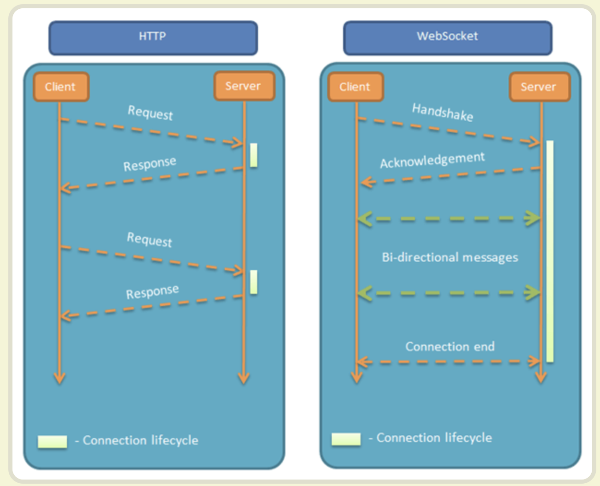
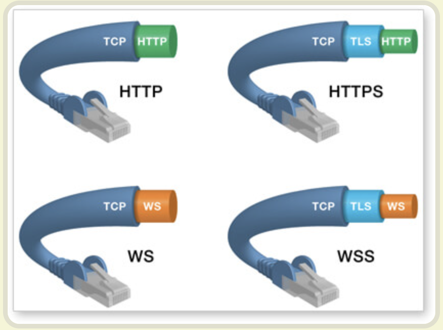
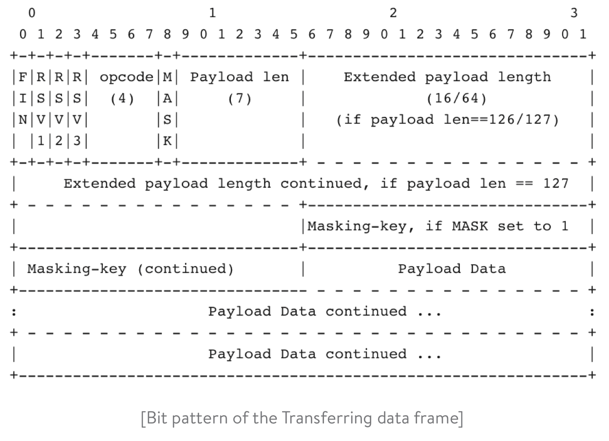

# WebSocket

## 介绍

WebSocket 是一种网络通信协议，服务器可以主动向客户端推送信息，客户端也可以主动向服务器发送信息，是真正的双向平等对话，属于服务器推送技术的一种。

其他特点包括：

（1）建立在 TCP 协议之上，服务器端的实现比较容易。

（2）与 HTTP 协议有着良好的兼容性。默认端口也是80和443，并且握手阶段采用 HTTP 协议，因此握手时不容易屏蔽，能通过各种 HTTP 代理服务器。

（3）数据格式比较轻量，性能开销小，通信高效。

（4）可以发送文本，也可以发送二进制数据。

（5）没有同源限制，客户端可以与任意服务器通信。

（6）协议标识符是`ws`（如果加密，则为`wss`），服务器网址就是 URL。`ws://example.com:80/some/path`



客户端请求如下：

```
GET /chat HTTP/1.1
    Host: server.example.com
    Upgrade: websocket
    Connection: Upgrade
    Sec-WebSocket-Key: x3JJHMbDL1EzLkh9GBhXDw==
    Sec-WebSocket-Protocol: chat, superchat
    Sec-WebSocket-Version: 13
    Origin: http://example.com
```

服务端返回如下：

```
HTTP/1.1 101 Switching Protocols
    Upgrade: websocket
    Connection: Upgrade
    Sec-WebSocket-Accept: HSmrc0sMlYUkAGmm5OPpG2HaGWk=
    Sec-WebSocket-Protocol: chat
```

数据格式：




## go搭建 websocket

go 语言有很多 WebSocket 支持良好的第三方库，能减少很多底层的编码工作。如 `gorilla/websocket`。

websocket由http升级而来，首先发送附带Upgrade请求头的Http请求，所以需要在处理Http请求时拦截请求并判断其是否为websocket升级请求，如果是则调用`gorilla/websocket`库相应函数处理升级请求。

gorilla/websocket库是 RFC 6455 定义的websocket协议的一种实现，在数据收发方面，提供Data Messages、Control Messages两类message粒度的读写API；性能方面，提供Buffers和Compression的相关配置选项；安全方面，可通过CheckOrigin来控制是否支持跨域。 

服务端代码：

```go
var upgrader = websocket.Upgrader{
	ReadBufferSize:  4196,
	WriteBufferSize: 1124,
	// 该函数用于拦截或放行跨域请求
	CheckOrigin: func(r *http.Request) bool {

		//if r.Method != "GET" {
		//	fmt.Println("method is not GET")
		//	return false
		//}
		//if r.URL.Path != "/ws" {
		//	fmt.Println("path error")
		//	return false
		//}
		return true
	},
}

// ServerHTTP 用于升级协议
func ServerHTTP(w http.ResponseWriter, r *http.Request) {
	// 收到http请求之后升级协议
	conn, err := upgrader.Upgrade(w, r, nil)
	if err != nil {
		log.Println("Error during connection upgrade:", err)
		return
	}
	defer conn.Close()

	for {
		// 服务端读取客户端请求
		messageType, message, err := conn.ReadMessage()
		if err != nil {
			log.Println("Error during message reading:", err)
			break
		}
		log.Printf("Received:%s", message)

		// 开启关闭连接监听
		conn.SetCloseHandler(func(code int, text string) error {
			fmt.Println(code, text) // 断开连接时将打印code和text
			return nil
		})

		//服务端给客户端返回请求
		err = conn.WriteMessage(messageType, message)
		if err != nil {
			log.Println("Error during message writing:", err)
			return
		}

	}
}

func home(w http.ResponseWriter, r *http.Request) {
	fmt.Fprintf(w, "Index Page")
}

func main() {
	http.HandleFunc("/socket", ServerHTTP) // 这里设置服务路由，需要和客户端对应
	http.HandleFunc("/", home)
	log.Fatal(http.ListenAndServe("localhost:8181", nil))
}
```

创建了一个 `upgrader` 实例，并将其用于升级 HTTP 连接为 WebSocket 连接。然后，在 `handleWebSocket` 函数中处理 WebSocket 连接。在该函数中，使用 `conn.ReadMessage` 方法读取从客户端发送的消息，并使用 `conn.WriteMessage` 方法将消息发送回客户端。


客户端代码

```go
func main() {
    conn, _, err := websocket.DefaultDialer.Dial("ws://localhost:8181/socket", nil)
    if err != nil {
       return
    }

    defer conn.Close()

    // 发送消息
    err = conn.WriteMessage(websocket.TextMessage, []byte("Hello, world!"))
    if err != nil {
       log.Fatal(err)
    }

    // 读取消息
    messageType, p, err := conn.ReadMessage()
    if err != nil {
       log.Fatal(err)
    }
    log.Println("Received message:", string(p), messageType)

}
```